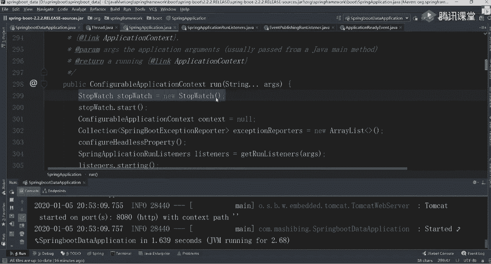
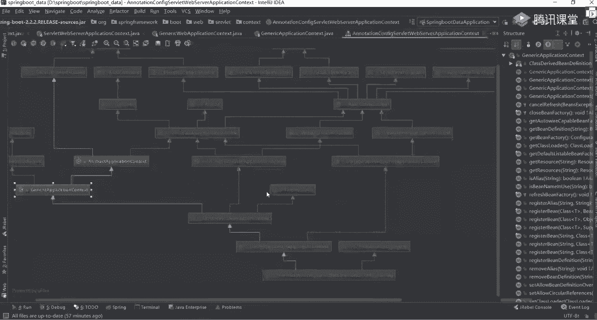
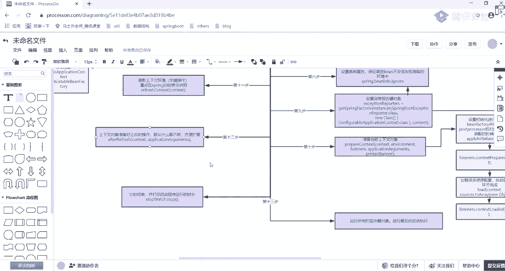

# 系列 5：P67：67、springboot启动源码解析三 - 马士兵学堂 - BV1E34y1w773

这世界意外遇见过人的情绪，不是挣脱自己的过，失败的勇敢，把曾经都短暂停留，后来飘走的云，黑夜呀，我丢了国际风和日丽，春暖花季，但却万里无一，就当我把我的一些感情的甜蜜，白昼的夜里，我不解风情。

并继续你的给予，而飘又开始让我变得狰狞，也开始变得曾经并肩，风起风停，风行羊，喜羊羊决定了爱得死不休，你能不能慢走，那家覆水难收，假钱的人都哦没得多日的降临，没法的应收到，你带着我的表情是飘荡去了巴黎。

说英文风烟满地，乱世了回来，三级锤裂了大量记录增加而失败的正义，当事人闹声却有多神奇，你的余晖下在哪里，那段天刚被暴雨，还是控制不住自己，想到你，嘿嘿，我想找到你，那曾经有短暂停留，后来飘走的黑夜。

我丢那么远，风和日丽，春暖花季，但却万里无云，嘿，我想要到达，那曾经有短暂停留，后来飘走的，嘿耶耶耶，我丢了，我自风和日丽，春暖花季圆缺万里路，那曾经有短暂停留，后来飘走。

我爱你，无畏人海的拥挤，用尽余生的勇气，只为能靠近你，哪怕一厘米爱上你，是我落下的险棋，不惧岁月的更替，往后的朝夕，不论风雨是你就足矣，看了太多情人分分合合，爱其实很脆弱，像温室里的花朵，你这么说。

我其实很忐忑，若我没有许我承诺，你还爱我吗，听夜空的流星陨落的声音，这人我让你听，我爱你，无畏人海的拥挤，用尽余生的勇气，只为能靠近你，哪怕一厘米，爱上你，是我落下的险棋，不惧岁月的更替，往后的朝夕。

不论风雨是你就足矣，你这么说，我其实很忐忑，若我没有许雨过承诺，你还爱我吗，夜空的流星陨落的声音，这愿望让你听，我爱你，无畏人海的拥挤，用尽余生的勇气，只为能靠近你，哪怕一厘米，爱上你，是我落下的险棋。

不惧岁月的更替，往后的朝夕，不论风雨，是你就足矣，我爱你，无畏人海的拥挤，用尽余生的勇气，只为能靠近你，哪怕一厘米，爱上你，是我落下的险棋，不惧岁月的更替，不论风雨是你就足矣，The one god。

It's on degrees like you，Feeling i was the problem，We just said to be free it。

Don't feel like the starting，Run into the radio with the all，Calling the moonlight，Clono。

We don't give a fun，We got a change to think on on uh，How could we do it，Because we want two。

Day's best spine now，We playing by your own chase on the sea，Kissing doesn't wake you。

Dancing in the parking，Lot damage，The most school，We the kings of the city，All the lights are pretty。

Bad boys like daddy，We in the club by fetty e keep my feet on the desk jk gala，Regihaving a blast。

The future，So bright way and looking at the past，And we just fall in the moment。

Because it's on the degrees，Why you feeling now，What's the problem we just said to be free，It。

Don't feel like this stub，Run to already with that，So calling some moonlight close。

Don't we don't give a fu，We got a change a thing on the more，Hey yall，She looks so good。

When the sun's up，But i love fathers should we do when the sundown paying around are you。

Here is best sounds turning out music，When we get a little too，Loud turn around a smile。

And she got the polly way，So she bto sume dry，I need me some peter like，We're gonna take it，So here。

They won，The phone said，She want some more keep it on the low low e keep my feet up on the dance。

Degli，We just having a blast and future，So bright，We looking at the past，And we just stall in the。

好了同学们，咱们开始讲课了，今天是第三节源码课，这节课是第三节，第三节呃，之前如果没听的话，听起来的话可能会稍微有点难受，因为这源码这东西都是连起来讲的，稍微有点难受啊，你可以尝试着去听一下这东西啊。

呃刚刚跟那边那个陈老师沟通了一下，然后源码课呢咱们就看你们的反馈啊，都不是特别好，大家可能需要很多消化时间，所以这边计划是下周二，下周四咱们再上两节，保证了五节课的源码，基本上面试的时候应该够用了。

后面像确认一些源码课，后面会给大家补起来好大家放心好吧，你们还是一样，把我这几天讲这些源码课能够呃掌握了啊，就已经面试，反正就我觉得应该没问题了，最起码跟面试官聊肯定有的聊了行吧，之前听过也难受难受。

什么阿联原版对工作有用吗，呃给大家说一下呃，源码这东西啊，说实话对工作有用吗，稍微有一点就是如果你在用一些框架的时候，当然是小公司，大公司里面可能有自己封装的框架呃，有时候可能会遇到一些bug。

你解决不了啊，解决不了，然后呢你最好还是有可能需要看一些源码，有可能可以需要看一下源码这方面的东西，但是常规来说影响不是特别大，但是现在在面试的时候，他为了考验你对应的一个技术深度。

往往在面试的时候会问你源码好，这是很尴尬的一个点，这没办法，所以源码这东西还是要学的，而且源码学完之后，不是说我工作用不到就可以不学了，不是这样的，我不是为了应付面试，我需要源码。

就是思想层面的境界的提高，会有很大的帮助作用，所以这块我还是希望大家能够把源码，能够系统的学一下，如果你把spring mybatis，Spring vc，Mybatis，Spring boot。

包括后面spring cloud double这些原版都看完了，你之后，其实完全有能力说自己开发一个开源框架出来，这完全有可有可能的，关键是你想不想这样做好吧，小林连web快开始了。

什么叫web快开始了，哪个web，所以啊源码课我还是希望能多看一下，都看完了，感觉成仙了，那不至于好吧，看过原版的人很多啊，不至于都成仙了，呃没没大家想的那么难，OK只不过源码一直被大家。

被大家当成一个非常难的东西，所以很少有人去完完全全看一下，他，其实看完之后感觉也就那么回事，没有特别难行了，多余的，废话不多说，我们下面来接着讲我们的源码课程呃，下午的时候呢。

然后我们大概讲到哪个地方了，还记得吗，我们是不是开始准备我们对一个呃application contest，是不是意思啊，我们这现在主要是干嘛的，叫prepare context。

往我们的上下文环境里面，商业环境里面注入一些属性值，和注入一些参数值，主要这样的一个工作，上午下午的时候我们看到这个地方，就是说他已经开始打印，我们对应的一个启动日志了，好吧。

之前我也给你们看对应的一个控制台了，这东西我没关，打印了两行对应的一个日志信息，人之心怎么打印的，从哪打印的，输出什么信息，那些信息从哪从哪从哪看出来的，我都带你们看样板，看了最下面我们接着往下走。

其实下面这块才是我们整体的一个核心点，好核心点上面东西不是说不重要也重要，但是在面试的时候，其实一旦聊到spring boing，Spring boot，问更多的人是什么，是自动装配的原理，好吧。

这块可能问的比较多，而自动装配就在我们后面某一个地方实现的，讲到那我再说好吧，我们接着往下看吧，来这块，我上午下午讲这块了，这是什么东西。

说at the boat specific singleton beans，添加一个单一的实例对象，或者单一的一个是并并对象，仅此而已，他拿过来一个东西叫get bean factory。

就是我们的编制工厂类，拿过来之后呢，我们可以往下走，第二个叫being factory，Register smoon，是不是注册一个单例对象了，注册谁啊。

叫spring application arguments，大家还记得这个参数吗，记得吧，这个参数在哪见到过，在我们之前那个run方法里面，大家是不是见过这东西，让我们先找一下，找一下我的run方法。

在这块我是不是new了一个东西哪去了，叫application arguments吧，是不是指的是我们命令行里面，输入进去的一些参数值，是不是在这好吧，所以你看完之后，你会发现这终于把它给输入进去了。

嗯哪嗯哪去了，就这是不是把它给注入进去了，application arguments就把这个对象放进去，完事了，别的东西不用管它，然后再往下看，再往下是什么，if print banner不等于空。

我们现在等于空吗，下午是不是已经打印出来，我们对应binder的一个对象了，所以这直接往下走不等于空，所以往下走告诉说，我把这个banner的一个打印对象，也放到我们当前这个b factor里面。

再来看说当前bean factory是否是属于我们的default，Libbean factory，大家还记得这东西吗，我下午带你们看原版的时候，大概看了一下那样的一个目录结构。

我不知道大家还记得没往后翻看哪个对象，哪去了呃，找一下啊，看不到看不到，我们一起来看一下吧，之前下午的时候在你们见过这个对象，我们之前看了一个类叫什么。

Annotation and notation config service，web servation contest吧，是不是大家看这样一类，在当前这个类里面，我带你们看一下它整体的一个类图。

也就是说它整体的一个继承关系，应该还记得吧，放大一点来往这看吧，这块是不是看了最下面这个类，然后我带你们依次看了整体的一个继承关系，到这块的时候，这块的时候我是说，这里面帮我们完成了很多特殊的工作。

包括我们的abstract application contest，在这个abstract contest里面，我们可以再搜一下，找一下那个类，找继承关系，走点它点开它点我们的strut。

在这个里面我们可以找对应的一个构造方法，找一下，是这样吗，不是这不是这样的话，就是在哪啊，我找一下在这里面吗，看看这是不是new了一个对象，叫this bean factory，等于什么呢。

等于new一个default liebbean factory，看见对象了吗，这是不是已经帮我们完成整体的一个，创建工作了，所以刚刚我们在我们的spring application这个类里面。

你是不是能看到对应的一个代码的实现了，这东西哪来的，是不是这个be factory，所以你要判断一下，当前BETHEORY是否归属于这样的一个工厂类，如果归属于的话，是不是该接着往下走了，往下走吧。

然后往下走之后马上马上，然后往里面写的就写叫SALLABEDEFINITIONOVERRI，是告诉你我是否允许一个纯写，这里面就是一个参数值，默认是什么false吧，这是一个false值。

就这直接把它给注进来，就是不允许你进行一个重写工作，这一步骤完成一个事情能看懂吧，所以我说了啊，你在看什么boot源码的时候，如果你对spring源码有一个清楚认知的话，你看起来可能会舒服一点。

如果spring源码之前没怎么看过，现在看起来可能有点难受，有点难受，但没关系，你先把这些关键的类给记住了之后，再看的时候也会轻松很多好吧，这边我说下午有课有啊，呃大家注意啊，那个群你们不要去屏蔽它。

当然有些同学可能会在里面，我们吹一下水，或者说扯一下别的这些东西，最好把群打开，因为经常会发一些群公告，上周二的时候，因为我们做活动做活动，所以呢那个驾校课没给大家上，所以今天下午我们补了一下课。

基本上咱们所有课程保证每周三节，你们最起码有的听啊，最起码有的听，现在上课前几分钟才通知，应该是之前通知的吧，很早之前就发过群公告，你可以翻一下，每周我看看公告，已经养成习惯了，对看一下公告啊。

每周三节基本上是这样的，保证你们最起码这一周有的学也没事干，多不好啊，是不是这意思啊，所以之前就算有，如果我们个人有一些特殊情况，可能会比如有天晚上不上课了之后，也会再抽时间给大家补补回来。

我们不会说无限无限期的把这个周期给拖长，这不会的，大家放心啊，这个替大家放心啊，OK好吧，这块我就不再解释了，我们接着往下看啊，接着往下看呃，多留意一下这个群，包括如果实在不清楚的话。

周五的时候可以问一下班主任，老师这周末会补什么课，行吧，好了不多聊了，来再往下看，但是判断完之后再往下做一件事情，要this lazy initializer吧，是不是否会进行一个烂加载。

这块没做任何设置的话，会直接跳过去啊，这个不用管它了，再来看叫source点get all sources，这个get all sources是干嘛的，是获取一下我当前所有存在的一些资源值。

对我们可以点到这个方法里面，看一下他完成什么事，首先创建一个哈希set，不用说了吧，link哈希set完成判断是不是这个值等于空，然后再往里边添加一下，再判断一下这个source值是不是等于空。

往里面添加，最后把它变成一个集合，所以当这个操作完成之后，你会发现了里面是不是只有一个source的一个对象，对象是谁啊，一样点开看一下，找一下我们的source谁是。

我们之前定义好那个primary source的，在进行spring application这个类实例化的时候，我们是做这样这样一件事，把当前这个类给它加载进来，所以这样判断一下这个值。

这个值如果等于空的话，那后面就没法加载，没有加载的必要了，所以这要把这个值对象拿过来，拿过来之后再往下走是什么呢，是我们漏的这个方法，这个方法我希望所有人能够重点关注一下，为什么，因为在这个方法的里面。

它包含了我们自动装配的一些很核心的一些点，其实就在我们的方法里面讲的，来看一下这个方法吧，你把这点你能做一件事情，不要他点进去，看这做了一个什么样的一个判断，你看能不能认识第一个logo。

Is debug enable，是否允许debug，不管它好吧，第二个说创建一个bean definition loader，是不是相当于一个类的，一个加那个注射器或者加载器这样的东西啊。

这块其实你不用管它，你直接跳过就行，想看的话，把里面看一下，里面的一个代码实现，是不是new了一个bean definition loader，一个对象，别的东西没啥了，别的东西没啥了，看完之后。

这已经logo标签有了，再往下接着找找找，是不是最后挨个的一个判断，判断完之后，这还有一个loader点load的方法，你点开这个load方法，这是一个循环，因为我们的主类有且仅有一个。

就是我们的spring date application，所以这里面也只有一个值，再点我们的load跳到下面了吧，跳下来之后，你看这段代码，你能不能做一个清楚的认知，这块是干嘛的，他说了。

如果你当前的source资源是一个类的话，我会加载类的load，如果我是一个resource配置文件的话，会加载配置文件的一个allow的方法，如果你是一个包的话，会加在包的一个方法。

如果你是一个字符串的话，会使用字符串方法，这是不是帮我们做了一个判断，你想一下你每次启动的时候，是不是需要在spring boot的主程序里面，添加一个叫什么，还记得吗，主要看一下这个链接是什么。

spring boot application吧，是不是有这样的一个注解值对吧，这个值会直接加进来，我们这儿很明显看到它属于什么class吧，是属于某一个类对吧，所以往下走属于类吗，属于吧。

然后点到我们这个漏洞方法里面去，在这个漏洞方法里面，它提供了几种加载文件的方式，第一种叫GA，我不知道读对不对啊，反正你知道这种方式就行了，这个方式你们之前有没有见过，会有印象吗。

有没有这个东西在spring bot源码里面，我带你们看的时候，有没有见过这个东西，没有很多同学一点印象都没有，我给大家说一下之前讲的每一句话，不能说都有用，但大部分是有用的。

我不会白带你看一些乱七八糟的东西，好吧，我会带你看一些有用的东西，什么东西，你点开一个类叫spring application，我们看一下当前这个类，在这个类的最上面往上翻，往上翻，乱七八糟是吧。

哈哈习惯就好好吧，习惯就好，他说了，这一类是用来干嘛的，好吧，是引导我们当前这个程序来进行一个启动，在启动的时候，他告诉你说你要进行如下几个步骤，我找一下哪去了，没有了吗，诶没有啊，我带你们看过这东西。

我记得看不懂啊，使劲跟着再找一下他这个print r，看以下这些步骤吧，他说创建一个这样的实例，Register，Register，Single bean，呃，这怎么没有了，诶没有了吗，不可能。

GROOVY看着看到了吗，就是说我们在我们在读取对应配置的时候，再告诉你了，你会有几种方式，第一种是什么方式，是不加这样一个NOTREADER的东西，第二个时你可以使用一个XML文件好吧。

或者使用一个什么呢，叫GRAVA的一个脚本，是不是动态一个脚本对吧，通过交换方式也能往里面进行一个注入，所以我说过了，你看源码的时候，不要只看这些东西，最好有注释的地方，把注释也稍微看一下。

这里面其实都有一个提示，那通过这其实我们也可以验证回来，要发生什么事，你往哪走，往回走，往回走，到这时候他是先判断一下，你现在有没有管我的东西，我们现在有吗，没有吧，没有的话。

那这个东西按道理说是应该跳过去的，对不对，就跳过去来往下跳，跳，跳这块吧，这是没执行，你没配吗，所以脚本压根不会执行，是不是跟我刚开始定义那段，或者他写的注释匹配上了吧，就这块一定要做一个前前后关联。

你发现了我在讲源代码的时候，我一提到前面的东西听过吗，没听过，一找肯定能找到好肯定要找到，所以这块大家注意了呃，讲spring boot启动的时候，先把spring ioc讲一遍，我不讲这个东西。

因为之前那个spring源码已经讲过了，所以就没讲啊，所以就没讲呃，这个你们回去翻spring源码啊，好吧，来往下看，下到这步之后，这儿有一个非常非常关键的方法，叫is component。

is component不认识，但认识吧，之前我们想要把某一个类变成一个呃，spring context里面的一个对象的话，是不是要加一个标签叫component对吧，你可以看一下当前里面这个方法。

他做了一件什么事情，你可以看一下叫merge annotations from tap，然后再有一个search storage，什么type，什么东西不认识不认识，往后走。

is pert叫component class，这个component class是个什么玩意儿是啥，是不是我们定义好的那个注解，所以它会扫描当前你的注解，这个组件到底是否存在。

存在的话才能把当前对象注入进来，如果不存在的话，你是不是注不进来，所以这时候我传过来tab是谁，是不是告诉你是spring boot data application这个类，你找他之后没满没完。

你要看一下这个类上面有没有包含，我们这个component组件，有包含吗，是不是验证一下，知道了，Spring application。

CTMD就跳出来了，跳了跳出来没关系，马上翻，你看这一类这一类的上面啊，不是这类啊，是我们自己的类啊，不是这类，点开这类这类上面有这个主键吗，没有没有吧，没有没关系，你往里边点，点击之后。

你发现上面也没有component组件，你再往里边点，这是不是也没有好吧，你再往里边点，你点到这个configuration的时候，你往这看这有没有一个component的东西，有了吗，有了吧。

它里面是不是存在着一个继承关系，这能看明白了，这如果看明白了，你再回过头来看一下，刚刚我们指定好这个参数叫search，这什么搜索一个策略吧，这个策略里面它是一个枚举类。

好在大学枚举里面有什么有direct，直接的，还有什么，第二个叫什么东西，他说放or directory，Decare。

notation and wise any叫super class annotation，是包含了任意的一个子类，所以它会有一个竞争关系，因为我们之前父类里面包含声明好这个组件了。

所以当前这个注解它也会被扫描到，所以此时你告诉我，刚刚我们定义好这个主程序类，能不能进行一个B对象，一个注入，能了吗，懂了吧，那这个值判断过来直接是true吧，你往下走是不是也能true。

true完之后直接把那些方法返回return true之后，这是干嘛了，只是告诉你说当前启动类我能够用了，但对象并没有进行一个注册功能，所以到下面这之后，我才开始整体的一个register的一个注册。

往哪走，Rein release，往那边走，走完之后，下面有一堆的逻辑判断，这里面更麻烦啊，这样更麻烦，就这东西我们看我，我简单带你们看一下，简单带你们看一下，我们不详细看了这块你看下上面的名称干嘛的。

叫注册一个B从给定的1class里面好吧，Devote it metadata from class decentration，从他指定好的什么类里面的一个注解里面，把他的一些原数据给分解出来，好吧。

这方法你都不用往下看，来我们往下走走走走，就是原数据处理啊，不用管它，走到往下走走走走，这块这有个非常关键的话，叫什么叫ban definition，Rather util register。

什么是不是叫bean definition，是不是还是我们这个holder，holder就是我们对我刚才那一类的一个包装，你往这边走的话，你能看到一个东西是不是叫get definition的一个。

Get the name，获取个名称吧，来看看名称是谁，是不是spring boot data application，有有名称吗，还有对应的一类对象，这有了名称之后。

我把这个名称和当前对应这个类都加进去，我才能把它给注册成功，这才是完成注册成功，这个功能除此之外，除了这点之外，还有什么东西叫definition holder，点get allayers。

你是不是也可以给我们当前这个bean对象，来设置一些别名，这个别名同样也会完成整体的一个注册功能，所以刚刚那个步骤到底完成了一件什么事，你告诉我哎，往往回返往回返回返回返没有了，高定文表达完之后。

完了干嘛了，注册并吧，你说清楚注册是谁，注册的是谁，注意是我们当前这个spring boot application里面，那个主要的那个启动应用程序，启动类，要把这个程序启动好。

是不是也在我们的context里面完成的，明白了吧好吧，这个时候你整个的逻辑线有没有理清楚一点，来TM同学扣个一，所以啊你把它一层一层往里面找，你会找到你自己认识的东西，当你找到自己认识的东西。

原来告诉我哦，原来是这么回事，心里很舒服了吧，是不是好，这就要注意了，OK这个操作完成了之后，当然我这个东西先讲这么多之后，还有很多其他一些组件，我们到时候再聊，包括那个自动装备怎么完成的。

一会再说他一会再说他好了，这完成之后又到哪了，叫listeners，点contest loader，又看到这个方法了，每次看到listen的时候，应该有一个条件反射，我之前见过N多次这东西了。

之前最起码见过三次，是不是还是用来注册我们对应的一个监听器，触发某些事件，只不过每次的事件是不是都不一样，对吧，来我这边点一下，看这是不是又开始循环了，这个listener是谁，只有一个吧。

叫event publish run listener，整个我说过，整个启动环节里面，有且仅有的一个对应监听器的一类，点完之后把这边走，然后呢叫context loader，点进去，点完之后。

这时候又开始叫get listeners了，application get listeners开始获取我们当前这个监听器，往那边走，判断一下他是否是这样一个类型，如果是的话，做做下面这个判断。

如果不是的话，就不做下判断了吧，往这边走，这个循环把循环走完，打个断点吧，这其实就是过程里面就是一个筛选的过程，就是一个筛选的过程，这块你可以不用管它。

就判断一个类型是不是这个objection aware，这个application contest awa有人见过吗，在spring是见过没见过同学回去看spring源码，老师之前也讲过这个东西。

它是一个扩展接口吧，是不是一个非常重要的扩展接口，你看到这些的时候都是扩展接口，好回头自己看，回头仔细看，我们这不说了，最终答案之后是不是又进到这个方法里面去了，此时他这个疑问的事件变成啥了。

叫application prepared event啊，之前是不是见过三个event了，还记得吗，先交了些事件，不记得没关系，回去看源码的时候，把这个事件给我记下来，给我记下来，记下来之后。

我知道了当前是第四个事件，有了第四个事件之后，我要干什么事儿，是不是还是要过滤我们计算器，哪些东西匹配我们对应的规则来，往这边走，哎呀完了直接跳过去了，找孙权打电影，重新打，重新打麻烦，有多少行。

94行，然后删掉删掉，重新启动，自动启动，直接跳过去了，不好意思，好到这了，到这之后我们接着往下走点F7进来，这是一个new一个实例对象，你不管它不管它再点是到这了吧，再点，然后呢再往里面走点。

它是不是又到这样当前这个方法里面去了，怎么做呢，往里面挨个进行处理，先获取到我们所有的这个listeners，往这边走，这边是不是一次就是一个基本的判断，慢慢走走走走，走到这一块是不是要进行返回了。

点进去往下走走走走，走到这块是不是要进行一个判断了，叫sport event，判断一下我当前到底是否支持，我们当前这个environment这东西吧，然后再循环走走加进去，判断是多少，就判断。

大家看了是不是有N个条件的一个逻辑判断，当你把当前这个逻辑判断弄完之后，是一共有11个，最终会剩下几个符合我们对应需求的，来看看这个ODNESS吧，一共几个五个吧，怎么做条件判断呢。

这个具体规则你下去之后自己看，下周自己看，我之前再给大家看过很多次了，我们这不带大家看了，你知道还剩下五个吧，有了五个之后往回翻，返回来到这儿了吧，是不是从这五个里面挨个取出来。

第一个the cloud foundary，什么东西，一看到是一个云平台，我们这没有支持往这边走，invoke走走走，点进去是不是只带一个日志变都没有吗，没有吧，没有不用管它了，好吧。

这相当于这个事情是什么都没做好，没做完之后再往返，第二个叫config file，Application，什么东西，你看到这个config file之后，你是不是有点熟悉了，他干嘛的。

是不是还是一样加载我们对应一个配置文件的，是配置文件的，所以你往里面走一下试试啊，往下走点进去点进去点进去再说event instance of，这东西匹配吗，不匹配吧，好再往下走。

这时候匹配匹配之后往里边点点进去，这是干嘛呢，叫this log switch to，告诉你说这个logo东西，你看log先不管是不是就是日志的一个输出。

是不是这个输出再来看叫ADD post processor，这里面是不是开始往里面添加我们的post processor的，对吧，加什么东西点进去，这返回一个具体的一个值，Connect。

不管它点进去知道吧，叫contest at bean factory post processor，你有一个什么对象叫property source ordinary post processor。

此时你看到当前对象之后，我应该知道一件事了，知道什么事，我把我当前的这个context里面注册了一个什么，叫bean factory post processor，而这个b proper在干嘛。

会对我们之后所有要存储的这些资源，进行一个什么操作，叫orderly吗，是不是order排序嘛，好完成一个基本的排序功能，所以这块就它一个基本功能完成之后，往回返往回返往回返往回返返返，是不是到这了。

再看看下一个是什么，叫login application干嘛的，那这时候我们要看一下了，这个login啊，我之前用过很多次了，完成初始化系统，比如初始化日志系统，包括往里面放一些参数值。

这时候又用到了点点进去点进去点进去，这要判断了吧，判断哪个走走，这是不是能进来，点进去走，这边也说了，configuration bean factory等于啥，是获取当前B对象。

然后再判断一下当年配对象里面，是否包含这样的一个参数值，叫spring boot login system，是否有这样的一个日志系统走，是不是进来了，我进来之后往里面注册一个什么。

是不是把它注册到我们的being in factory里面，也是一个示例对象嘛，这块都是一样的，之前只是完成初始化，完成了复制操作，但是你并没有构建整个对象出来，而此时是不是开始构建对象了。

并且把我们的不是，并且是不是往我的context里面，是不是该进入进行注入了，这块是不是都有拿走走走好，这是一个log group，是不是日志组的东西，不管它了，好吧，也是往里面注册对象。

你知道就行了好了，这做完了，做完之后往回返没有了吧，这是日志，这东西要做操作，再往下看叫background什么东西，之前我们看到的所有background几乎都没做，什么事，什么都没做吧。

那这样是不是也一样的，点进去点进去点进去走走，看这两个是不是都跳过去了，不太满足条件吗，跳过去不管它是再往回返，在这最后一个叫delegate什么东西好吧，这个东西之前是不是也没做，是不是也没啥用处。

没用处也是一样的，点进去看一下，走走走，我判断判断都不符合规则吧，往回翻嗯好了，做完了，做完之后里面还有吗，没了吧，我说过一共只有五个，所以这五个做完之后，这工作就算是完成了。

还是我们监听我们对应的一个事件吧，这里面就是监听什么事件，第一个跟我们的property source进行一个排序的功能，好吧，第二个来把我们的日志系统的一个bean对象。

注册到我们的content里面去，签合作都没做了，对就完成最基本障碍功能，往回返吧，返返这还有吗，没了吧，就一个对象吧，走当然不是完成了，到达完成之后。

我们整个prepare compass这个操作就算是结束了，好来回顾一下，在这里面，我们到底做了哪些最基本的一个工作呀，啊做哪些基本工作，想一下能想到吗，这个paper context里面回顾一下。

第一，我刚刚是不是只创建好了，一个实例化的一个context对象，但是里面并没有进行参数值的一个复制，参数值一个创建，所以现在我要往里面复制某些具体的参数，而复制这些具体参数值的时候。

你注意一定要看它对应的一个，父子之间的一个依赖关系，因为它是根据我们的依赖关系，里面添加了很多其他的一些属性，包括类的一些初始化工作这块东西，如果你不看的话，你会感觉到很懵，我就感到很懵。

然后做完之后也是一样的，这里面还做什么事了，再想到什么事了，这就是设置一下对应的一个环境值好吧，设置一个post processor啊，做一些post processor创建工作。

包括一些最基本的一些content，里面注册信息是这样工作，把它做完之后，别的东西就没有了，别的东西没有了，所以这个环境准备也不是特别难好，也不是特别难，这块一样的，下去之后自己跟一下源码。

看看里面到底做了什么样的事情，但你要知道它最基本功能是干嘛的，是不是准备我们的上下文环境啊，这块认识到就行了，认识到完之后来再接着往下走，这块儿来能听懂的同学能跟上，同学扣个一能跟上吗，记住我说那句话。

你在捋的时候自己别乱了，之前看到过东西跟现在看到的东西，你要放一块做对比，放下做对比，这对比什么意思，别之前看过啥都忘了，一点印象都没有，这不对，这样的话你看看他什么时候你都一脸懵好吧。

发展完了之后get到这个东西叫refresh context，到这个步骤，这个步骤是一个非常非常麻烦的一个基本操作，来我们看一下里面做什么事吧。

你把这点点完之后叫free flash contest对吧，再往里边点好，往下走，点，点完之后是不是super好，再往里边点，讲到这块了吧，这是完成了一个最基本的一个初始化工作。

他在哪个类里面叫abstract application，然后呢contest吧，还记得这个类吗，记得当时我为什么要带你看这样的一个关系图。

那个notation呢就没了，Apple tation，T a t i n config website，这类里面我带你们看了一个整体的类图，在类图继承关系里面。

是不是有个东西叫abstract application contest，是不是在这，你刚看到这个类，这两类一样吗。

是不是一模一样，看的就是这个类，在这个类里面有一个REFLESH的一个操作，好REFLESH作，而REFLESH其实这块东西属于谁，属于spring里面的东西，而不属于我们的spring boot。

spring面是不是要进行REFLESH操作，还记得吗，这个spring里面reflect操作，知道同学来扣个一，不知道同学扣二，知道吧，这些都知道啊，当时当时讲源码的老师应该跟你说过，这东西这么多。

不知道的，我这这没法带大家看啊，这个这个没法带大家看，看的话太太多了，王师傅说过是吧，自己没看过是吧，你其实没关系，没看过，我们我们粗略的看一下，粗略的粗略看一下好吧，看着没完成什么功能好吧。

然后再看第一个叫prepare this context for reflesh，啥意思，你看注释，你讲过视频视频源码吗，没有没讲过没讲过没讲过，我加SPRBOOT源码，没加all spring源码。

我们看进来之后再做一件事情，Prepare reflesh，是不是准备，我们进行上下文环境的一个刷新工作，好吧，来往里面看，我们看一下做什么事，我们点一下点一下看，知道了好吧，点进去。

然后他告诉你说this scanner clear catch，这个scanner还记得是干嘛的吗，有没有同学记得这个词SKT是啥，我们当时在创建这个annotation config server。

Web server，application connect的时候，是不是定一个实例化对象，是不是有个扫描包小方式完成初始化工作，是不是扫描一下上下这东西，我之前讲过这东西了，好吧，你要忘了的话怎么办。

还是一样，看这个类里面找一下构造方法，这是有个scanner，scanner里面是不是指定好了，干嘛的，叫create new呃，不是这这找一个方法，看这个方法是干嘛的，他说了，定义了一个bean好吧。

能够干scanner，我们当前那个什么，当前我们这个路径里面的所有的一些组件，进行一个扫描工作，就这就这这这类来完成的，所以这个第一步是不是完成这样的操作，往回返啊，把它缓存给清空掉。

清空掉之后一样也是掉到父类里面的，we prepare reflesh做什么事，第一个switch to active，记录一下当前的一个时间好吧，把close给关掉，把active给设置成开启。

让它进行日志的一个输出吧是吧，这块不用管它好吧，再来看叫init property source是干嘛的，it初始化吧，Profesource，Professor，source source熟吗。

之前是不是看过很多proper source的东西了，就完成了我们这些prop source的一个初始化功能，把它点之后也是一样的，判断一下当前的环境是啥，然后呢如果是他的话。

进行一个初始化工作里面是不是依次往里面点，里面包含包含几个环节，还记得吗，咱们那个property source里面包含了几个环境。

还记得同学来扣个一几个，还有没有一点印象，没印象了，是不是一共有具体的四个，刚开始是四个吧，刚开始不是四个，思考完了之后，我是不是加了一个东西，叫什么叫configuration呃。

叫什么default，Configuration，还记得吧对吧，后来又加一个加一个random吧，对不对，后来又加了一个什么，是不是加了一个application，然后点EML记得吗，是包含七个。

七个是包含七个，看一下property source17个吗，看这configuration propose，然后呢server的两个，server system的两个，然后加上我们的random。

加上我们的application改压毛，是不是这几个对吧，记住记住记住一定要记得一定要记得，别忘了，你还没讲完就忘了他，所以我说了啊，你们你们为什么看源码的时候看不下来，原因在这儿。

很多同学看完我前面讲的源码了，我看完自己之前看的东西了，看完就忘，后面看到这东西，我感觉跟新东西一样不对，一定要产生一个前后关联，前后关联点进去是完成初始化工作，你印了什么东西。

get proper source干嘛的，就是一个初始化啊，这是一个初始化，这块我不往这边看了，再看就没头了，不往这边看了，你知道他完成什么事就行了，这玩意什么事，就是一个初始化工作吧，清理完之后。

这是什么东西，叫get environment，Where a balidate required properties，这是干嘛的，你怎么做到看了不忘，看多了就看的不忘了，他怎么做到的，你要有点印象。

好像有点有点有点印象，具体类名我也记不住，但大概大致的东西我会记得好吧，我来看看这个函数干嘛的，叫获取环境，并且进行一个验证必备的一些属性值吧，是不是就是验证操作。

你把这个点还有一个具体时间内看哪个看吧。

再往里面进行一个验证就行了，我们这不往里面看了啊，这是干嘛，这边就是一个环境验证验证的一个东西，好吧，就验证东西啊，验证完了之后来再往下看在干嘛，是不是。

this radification listeners等于空，我们现在就等于空，这个值没赋过值吗，等于空进来之后把刚刚那个里面类似，那是不给他付过去，创建一个集合，找上下集合之后往下走。

找this early等于什么，你有一个list是不是把它给放进去就行了，创建一个新的对象，仅此而已啊，别的东西没有了，然后返回啊，然后返回，这就是刚刚那个初始化的工作，是不是准备了一些基本的环境。

只是配置文件一些操作啊。

这吃住就行了，这块如果你实在不知道的话，没关系，我之前给你写过笔记，找一下我写哪了，Reflesh，这看完了，刷新上下文环境，初始化上下文环境好吧，对系统的环境变量或新增属性进行准备和校验。

现在这句话看明白了吗，你看完原版之后，你再看这句话是不是会好很多，大家知道啊，里面原来这样一些功能，这样一些功能，这样先先记着先记着先记着啊。

记完之后来往下看，第二个操作叫tells the success to reflesh，The internal being factory，这干嘛的，什么叫internal bean factory。

这个intel bean我告诉大家，你如果去实际的类里面找的话，你压根找不到这些东西，但是在我们debug这个环境里面，它确实存在着一些这样的值，找一下我给你找一下，找一下你就知道了。

Being in factory in it，Being map，在这吧，看这这是有一些值叫o r g spring contest，什么internal config，什么东西，什么东西，特么东西。

什么东西是有很多这样的值，我虽然不知道这个是干嘛的，没关系，我们搜一下，看能不能把这只类给搜到，好吧，叫internal in，N t e r t e r，然后呢叫NALCONFIG。

IGURA还用搜吗，没有吧，注意了，这些类值你是不存在的，是不存在的，但它干嘛，它只是指定了具体的一个路径，有一个路径之后或者一个完全限定名，根据完全限定名，它其实起的是一个名称，根据这个名称好吧。

我们能找到具体的一个实例类，相当于把那个类换了个名字，而名字起的这样一个名称，仅此而已，好这东西啊，我后面讲自动装配的时候，我会带你们看一个，看那个东西的时候，你就知道怎么回事了，好先留个印象。

然后点进去看一下吧，做什么事还是一样，reflesh being factory往里边点，然后呢这是false是吧，进不去，然后呢叫set seriid，是不是创建一个序列化的一个id值，往这边走。

返回一个id education，搞定这东西就没有了，现在没有了，然后呢return一个get bean factory，返回当前bean factory对象。

还有谁叫default libbean factory吧，还是当前这个值，这是没变化的，所以当时下午讲课的时候，为什么给你强调一类连接在这后面，你在很多地方都能看到的东西，能看到东西好吧。

就这个对象再往下走，叫prepare bean factory，刚刚是不是告诉你说我获取到了一个bean factory，现在呢是不是要进行一些准备工作了，好吧来吧，你们看这个类是谁。

是不是还是default libbean factory啊，还是当前对象好吧，你妈妈点进去就完成了一些出场工作，set beclass loader好吧。

Set being expression resolver，是不是表达式的一些操作，再来看at property editor register对吧，往下走，at bean什么东西。

ignore什么什么什么东西，是不是忽略，告诉你说我忽略这些依赖的一些接口，告诉你一些忽略，然后再往下走，就是往里面注册一些处理器，处理器这些依赖关系慢慢走走吧。

走是不是要判断一下当前那个类似是哪个类型，走都是一些判断，所以说大家看到了，我就是把我们当前这个bean factory里面好，b factory里面给他做一些参数的设置。

是不是这意思好，再注意一下行了，刚刚我这里面也写了啊，往下看，脚背上扬，准备been factory，对been factory各种功能进行填充，Roware specific。

这个这个SPEL表达式是吧，编辑指出，注射器添加app商店，国外的propost processor这样一个处理器等等东西，这块也属性值啊，没必要挨个看，你大概理解什么意思就行了。

大概什么意思，再来看叫post processor，Dean factory，是不是又是一个定factory，叫allaw post processing of the bean factory。

In contact suppsubclass。

还是为此类添加一些具体的功能，找我写了吧，提供子类覆盖了一些额外处理及此类处理，自定义的be factory postprocessor，就这个功能啊。

再注意一下行了，再往下看，这东西叫invoke，Being factory postprocessor，invoke是什么意思，表示执行处理的一个环节吧好吧，而我们注意了，我们后面再看的时候。

很多自动装配的类，它在完成这个初始化这个对象工作的时候，其实就在这个步骤里面完成的，所以这块我希望大家把这个方法给我记住，现在我不带你们看，之后的时候讲自动装配的时候，我会带你们详细把这个流程再看一下。

你就知道原来是这么回事啊，其实就是一个解析配置的环节啊，解析配置的环节好吧，再来看是干嘛的，叫register，然后呢being processor that interrupt。

Being creation。

这句话翻译过来怎么翻译，看不懂没关系，我这写了啥东西，叫注册拦截并创建并处理器好吧，即注册并post processor，那这样往下初始上下文环境的资源文件，如国际化的一个处理。

再来看初始化上下文环境广播事件，再往下看，为了子类扩展，初始化其他的一些病，还有呢就为所有在所有的bean中查找listener bean，然后呢注册到广播器中，最后完成初始化。

剩余的非懒惰性的一些bean，及初始化非延迟下载的并对象，最后一个完成刷新过程是真心的过程。

这个步骤啊里面东西很很很复杂，我没法在你们挨个往里边看，但你要知道，这个方法里面起了一个至关重要的作用，而我们之后再看的时候，就那些auto comparable呃。

那个叫auto configuration的一些并对象，都是通过这个方法注册进来的，什么时候注册的，一会这个方法我会带你们进去好好看看，进去好好看看这其他方法我就跳过去，不看了是谁，如果不清楚的话。

你上网搜一下，一搜spring contest，一搜搜spring spring contest，然后加一个REFLESH1堆解释好吧，里面有很多页面来解释，下一周自己看行吧好吧，这块不带你们去看了。

这套太浪费时间了，咱毕竟不是讲spring东西啊，你看了这些过程可能要花点时间啊，他不是说立马就往下走了，是不是要需要到执行时间啊，所以这块比较关键，这个步骤往下走，走走走走走回来往下走。

走完之后叫register shut down，shut down hook吧，这干嘛的，注册一个关闭结束的一个钩子吧，这钩子非常简单，判断一下这个值是否等于空，现在是否执行完了。

执行完之后读close，执行一个close方法，这块东西很简单好了，往回返吧，这执行完之后，这就完成了，一会儿我们再详细一会再详细看下东西，所有boss还没学全，我是不是可以撤了。

现在撤的话之后也一样看不懂哈，这东西不在于说你spring boot会不会用，跟你会不会用半毛钱关系都没有，关键是你要对整个体系结构有一个认知哇，这时候你再看就好，就舒服很多了，明白意思吧。

对硬着头皮去听，这是一个很好的方式，因为你现在听起来可能不知道我在说什么，但是当你把某些基础知识的一个储备，如果具备上来了，你再回过头来看我说这句话的时候，你知道哦，原来老师想表达这个意思，听明白了吧。

它是需要一些基础知识知识的，特别是源码里面的东西，好混脸收也可以，我相信啊，咱们班现在听的人有80多个吧，你告诉我有几个人能完完全跟下来，其实比较难，其实比较难好吧，所以希望大家能够认真去跟一下。

认真去跟一下，我我觉得很少有人能把它跟下来啊，呃多听两遍，然后多搜一些基础知识，你慢慢就知道了，因为说实话我不可能说我再讲一个存储源码，我把前面很多系统知识再从头给你讲一遍，这不太可能你哪个地方没听过。

OK记下来，下课之后搜资料，搜完资料之后可以回过头再看懂我意思吧，慢慢去补充，慢慢去扩充，这样的话你就理解是什么意思了，如果你现在，如果你现在一次都没听过，你第一次听的时候，你依然还是会有一种感受。

什么我这种又是全新的懂我意思吧，多听几遍，你会发现还是不懂，不可能好吧，多听几遍，不可能不懂的，不能不懂啊，27真可怜，可怜啥呀，我给大家说一下sn boot源码本来是没打算讲的。

是因为在那个就年前就12月份的时候，很多学生，他说老师我在面试的时候问到spring boot源码了啊，你来给我说一下这东西吧，我来讲一下吧，我们先把这个规划的课程里面懂我意思吧。

老师讲spring mod源码有画实例图吗，一会我给你画一个整体框架图，实际图我之前尝试画过，但是这里面比较恶心，比较恶心，为什么叫恶心，比如说光这个spring application这个类。

你往下翻一下就有上千行，这是来回进行调转的一个过程，所以你画完图之后，那个线勾的真的是真的是那个什么，就是乱七八糟的，割完之后你看到示意图，你画你画你画不清楚，你懂我意思吧，真的是你看了我之前画过。

真的是你画过，我想过各种方式把东西给你画出来，但是真的是凑不到，你知道吗，好吧，你先你先你先听你先听好吧，你先听完，感觉一直在累的对，就是这个类来回调，调完之后就回不来了，调完之后又回过来了。

你会发现这个东西很乱，太乱了，没法画，真没法画好吧，还是要搞清楚类图对，这是为什么，我在讲源码的时候带你们看了很多类图，原因它有一个竞争关系，里面包含很多对应对应东西啊，啊没事没事呃。

我也没指望你们一遍能听懂啊，一遍听懂，我感觉就是也不太现实，就慢慢听就行了，OK好了，刚刚是完成了我们这个context的一个刷新功能，刷新功能刷新完之后，下面还有什么东西叫after reflesh。

这啥意思啊，什么意思，什么叫after reflesh，就说你刷新完了之后，他又完成一件事，但是你往里面走的时候，你会发现这里面什么东西没做好吧，这个功能是干嘛的，是为了我们不是在插件啊。

是为了完成我们具体的一些扩展功能的，好扩展了，他说了，Called after the contest，Has been refreshed，当你刷新完成之后，我会做一些后期处理，它里面什么都没写。

但后续的话，如果你需要填充一些基本功能的时候，你可以把这个代码里面补充东西，懂的东西明白了吧，好吧呃，来我再往下看，这执行完成之后，其实我们基本的核心环节已经都做完了，核心环节都做完了，做完之后好吧。

该干嘛了，还剩下最后的一个具体的一个过程，或者最后一个步骤叫stop，watch加stop，这不用我说了吧，刚开始还记得吗，我们是不是记录了一个启动时间对吧，时间完了之后一定要关掉好吧。

点进去点点是不是会记住一个一个一个值，写完之后把它记录下来啊，把这个值返回去，返回去之后，这是不是有个this log start rainf，看下这个值讲完之后，new一个具体的对象。

这个对象里面是干嘛的，之前说过了吧，返回返回返回走，返回logo get什么这个对象，然后再往里走，是不是obligation inform，什么get message叫start in什么东西。

我们看这边m running for，是不是刚才这个时间把它加进来，然后把数据给返回去，就让你看一下我们控制台吧，看不懂他走走嗯，哪去了，是不是完成了，告诉你了吧。

说start spring fication in，这东西用多长时间，1393秒，因为我刚刚重启了，如果没重启的话，这个时间可能会更长，可能会更长，要记录一下你当年启动用多长时间，懂我意思吧。

因为我们debug的一步一步看的，所以这个时间会稍微长一点，你正常启动的时候可能不到一秒钟，启动完了，懂我意思吧，保持这个logo stars off，这个工作站做完之后来再接着往下看。

好叫listeners，点start是到这了，看来这又熟悉了，这干嘛的，是还是我们对应监听器，它所要做的一些基本工作了啊，完了点一下吧，看下这东西走，改完之后也是一个吧。

叫event publishing，然后呢run listeners慢慢走，点进去，新的事件叫application started in event吧。

是不是刚现在要开始运行我们的application了，不是开始运行了，点一下试试走走，不管他点进去，点进去往这边走，还有这个事件判断完之后往这边走，是不是又到一到又遇到这里面了，也是挨个进行一个执行。

这是返回一个对象，我管他下点到这了吧，在这之后也是获取到我们这个listeners，一共有多少个点一下，我这直接往那边跳了啊，直接往直接往后跳，直接跳，没法跳，那就走一下吧，走一下。

开始是不是RETURNENERS，这个listeners等于几啊，看一下有值吗，刚刚太快了，没看到，不算了，没关系，大家往这边点一下走，第一个叫background，Background。

想想之前做什么事了吧，没做吧，那现在你想一下，是不是按道理来说也应该是什么都不做，走走走判断这不合适吧，所以这东西过滤掉了，第二个之后也是一样的，Delegate，它是不是也是一般情况下程度不做。

不管它了，不管它了，再来看第三个，诶，哪去了跳哪去了，找不着了，诶怎么没有了，我刚才点错了啊，咱这里面是完成了一些最基本的一些，处理的功能操作，我再往回点一下试试，这我们从运行一下啊，点太快了。

把它给干掉，这300多号删掉来重新选项，带你们看一下，带你们看一下进去，然后呢进去，点进去点进去，说到这个方法里面去了，这可以获取到我们这个listeners，往这边点走走走。

这里面会有一个整体的验证过程，哎呀走走走走走，是不是到这方法了，在这个方法里面，方法里面是不是有一个又又是东西叫sp event吧，验证这个规则是否合适，如果不合适的话。

是不是直接进行一个跳转返回就行了对吧，挨个往里面进行判断，执行完，不要返回啊，太麻烦了，OK等一下等一下，这不是这还没到啊，太麻烦了，嗯到哪去了，这我更懵了，这到哪了，这好了。

到这listener等于几个，是不是一共有两个好，你就看到这个listeners一共就两个，所以到时候我们在循环的时候只循环两个就行，一叫background，一个叫delegation。

在这两个里面你也会神奇的发现一件事，往下走，这看循环了，循环之后，第一个background的之前什么都没做好吧，这也是一模一样的，你往下点一下试试走，点进去走，走两个if是不是干完了对吧。

干完之后来再往下走，在这是不是delegate这个东西，再往里面走，Invoke，Invoke，Invoke，点进去判断判断都不合格吧，他执行完之后，大家想一下是不是相当于最后一个电器。

我几乎跟什么事都没做一样，是不是这意思啊，所以他直接就进行一个最基本的打印工作了，大家注意了，这个东西啊，是新版本里面，他好像什么都没干，如果你看的是比较老的版本的话，好吧。

它的版本这个过去的值是不一样的，个数是不一样的，明白意思吧，这做完之后在干嘛，叫call runners，是干嘛的，一看到runners，你应该是比较舒服的，rs是不是正儿八经正式开始进行运行了。

是怎么运行，点进去看一下，这创建一下这个release，然后往里边开始添加我们这样的一个值走，这时候run有东西吗，没有吧，这个值没有吗，不存在，所以角进不进不进不去。

第二个呢con online是不是也没有，也进不去，进行排序，没啥可排的了，基本上就是个空的一个值，然后这个时候开始判断我们这RN，因为你当前是一个空对象，这里面会进来吗，不会吧，所以直接跳过去了啊。

直接跳过去了，再往下看，当你跳过去之后，跳过去之后到哪了，说到下面这个地方了，叫licenlisteners running，之前我们开启了很多个的一个监听器，然后呢让这些监听器是不是开始运行起来。

运行也一样的，点进去好吧，挨个进行运行，running点进去是不是又是一个叫application reevent，是不是ready event对吧，这是告诉你说我已经准备好了，这是第几个第五个了吧。

第五个疑问的事件了，完了点一下一样的published走走走，点进去，这不是开始循环，这我不看了啊，这边类似哪几个呀，进去有几个，这看不到是吧，我看下全都能看到吧，看到了看到了没关系。

我们看一下第一个是什么呢，叫spring application，Admin mx being register，这不是一个东西，它会进行一些具体的实际操作，然后把ECO里面执行多人口。

然后点进去是判断一下这个类型是吧，ready完之后，这点进去好吧，然后呢往里面进行一个判断，说是否等于这个值，如果是的话，状态告诉你说是可以的，是不是等于true了好吧，你等于true了之后。

是不是这个值可以进行一个返回工作了，告诉你说我已经准备好了，准备好之后往回返，这还有吗，第二个叫background，不用看它了吧，什么都不做，对不对，不看它了，走第三个也是一样的，不管它还有吗。

没了吧，所以这步是干嘛的，告诉你说我现在已经准备好，可以进行一个启动工作了，好这是一个ready，这个这样这样这样一个操作，ready一个操作，点完走回来到了之后。

是不是直接把我们这个context给进行一个返回，意味着context已经准备好了，准备好之后往下走，是不是告诉你new一个spring run就执行了吧，走再往回返，回到第一行了吧。

祝我们刚开始看到这个代码执行完成之后，就OK了，是不是按到一个list了，这时候你能看到一个完整的一个环境，就告诉你说我已经都启动完成了，但中间你会发现一个神奇的事情，我们好像少看了很多东西，什么东西。

第一个这块这句话我们见过，第二个active for active file，我们见过，但是像这个tom cat这东西对吧，Study tomcat，以及我们这tom cat这些服务好吧。

这东西你有见过吗，没有吧，是不是没见过，包括中间这些环节，我好像都没有怎么见过啊，然后到最后一句话的时候，我哪见过，这中间是不是省略了很多的工作，这个工作什么时候做的，对我跳过了。

他们看这块我没带你们看，在reflex的时候，他会注册很多对应的一个bean对象，在里面会完成我们很多自动装配的一个功能，是在里面完成的，懂我意思吧，所以刚刚那个环节就完成了。

我们整体这样一个启动步骤和启动步骤，所以这块希望大家能了解到好吧，来到目前为止，我们差不多花了五个小时的时间，把这个runner运行的时候就搞定了啊，就就就就就完成这个基本的操作了是吧。

大家想一下这个run麻烦吗，麻烦吧，你看起来好像说老师我一启动一个程序，然后右击运行，看起来好像很舒服好吧，跟什么事情都没做一样，其实里面涉及到N多个步骤，因为花一秒钟时间，当你debug看的时候。

里面完成了N多个对象，N多个参数等各种值的一些装配工作，有很多准备工作肯定是很麻烦的啊，所以这块你要注意一下啊，其实这里面还涉及到另外一个东西，另外一个东西是什么呢，就是自动装配的一些核心。

把自动装配的一个核心，但没关系，一会我带大家看啊，刚刚那个启动过程好吧，稍微有点感觉，同学来扣个一，我大概知道它里面做什么事，同学来扣个一，能看懂吧，好了，能看懂的话，来下面的时间，我们休息10分钟。

10分钟回来之后，我10分钟回来之后，我来带你们画一下整个启动过程，我到底做了什么样的一个事儿，好，它里面完成什么样的功能，我们一起来画一下这个图好吧，整体的一个部署的一个图好吧。

10分钟之后我们再接着聊，OK还是要撸几遍，肯定要看的，不看不行，就等这个了，今天最后一节不是不是不是不是第三节，我计划周二周四啊，周二周四再讲两节啊，计划这周再再讲两节，从下周一开始。

你们开始讲网约车，网约车好吧，好乱就记住各种listener，Context，Property source，来回prepare reflesh，他其实就是这样的过程，准备好。

然后添加属性之类的东西好吧，完成SPRL，怎么是的是的，二期比一期讲的要多，二期的计划是12节课，12节课，我还是听不懂，不至于吧啊，不用不用不用不用天，二期就好了，二期在一期基础上做了一个扩展。

做了一个扩展，我看这也没有啊，没有白皮书，白皮书可以给大家看一下，用打宝宝不用不需要听，这是spring cloud，不用打我，我是在外称吗，不讲了吧，让我歇会儿吧，我讲完这个课。

我大概要去那个基础班讲4SM了，讲SM9，再等我一下，我给你找一下那个那个白皮书，大家可以看一下。

咱考了一份啊，嗯大家可以看一下吧，就这个网约车二期中还要讲解的一些知识点，好吧，包括一些前端页面的一些设计之类的，然后呢包括像后面的一些服务设计呃，架构的一个设计，包括整体的一个架构图这块。

大家看到这个图非常复杂，非常复杂好吧，后面有课程大概讲什么东西，一共包含的是诶这一期的。

考官来一期的，搞错了，搞一期的二期也一样，在一期的基础之上做了一些扩充，做一些扩充，所以大家如果想先找工作的话，这个这个这个项目，这个项目是可以用到你的简历里面去的啊，用到简历演戏的。

大家下课之后可以找那个班主任老师，过了一会我给大家分享一下，我们这个课程与白皮书啊，下课再分享，玩的比较匆忙，所以考错了，OK反正你知道你下一步要学啥就行了好吧，可以为啥不能呢，可以可以啊。

老师这个源码你看了几遍，不知道谁还数变数啊，看懂为止吧，数变数也没没没没没没没有用处啊，常老师讲，基础班听SM那个SM为啥可听的对吧，这只是一个入门级的东西啊，我问一下那个markdown软件的名字。

T y p o r a，对就这个刚听到打火机的声音，抽根烟放松一下好吧，老师抽烟了，这声音很大吗，这你们都听不着，要下楼买烟了没有，我们办公室一般都存着好几条，就我跟周老师这种大烟枪没烟，我的天哪。

我们就疯了，你说想抽了，我一天一包够不够，一天一包肯定不够啊，不抽烟啥感觉，不抽烟感觉要死了，不抽烟课就没法上了，压力太大好吧，感觉这个世界都不好了，抽烟写代码，头发情调，三包倒不至于啊。

我回家之后一般都是去楼道抽烟，It's good，前端快完了吧，好像是快完了，那加个VE应该就没了吧，家里有孩子不能成，是这样的，12节课，27网约车计划，12节课有可能会更多，有可能会更多。

所以啊多出很多内容来啊，办公室抽烟怕是要卷铺盖了，马老师比较好，允许我们在办公室抽烟，所以支付吗这个细节我还不了解，一会我把那个白皮书分享出去，你们可以看一下，可以看一下好吧，下课之后吧，做一个分享。

下载之后发出去，好了来还在同学扣波一，我们开始要画画这个图了，你们在聊啥，会更新的那个会更新的，肯定肯定肯定会的，肯定会啊，就放心啊，你们抽烟，六六和齐老师不说吗，我跟周老师有自己的一个单独办公室。

所以在办公室抽烟没事，外面闻不到SIM讲了个T不T吗，不讲吧，一个工作流也没啥讲的吧，很简单的东西了，需要的话，我们就提一下这个工作流也没啥，我胃还用开发吗，现在网上一搜一堆老师。

你要去想的SN哪个课程，后端工程师这门课，后端工程师这门课，基础班，基础班的课程好吧。

Process on top。

诶啊把这浏览器打开错了。

好了来我先来画一下整体这个图啊，怎么打不开啊，天哪，对就是这个课就是这个你讲项目讲啊，那个那个到时候那个什么叫啥，何佳音服务平台，我讲何家英服务平台，我讲啥时候讲算法，心情没捣乱，算法讲不了算法。

往后推吧，何佳云那个云服务平台，到时候会讲这样画一个图，我们现在带大家从头画大头画好吧，我们不在之前的基础上做啊。

我们从头画好了，那个有啥问题，一会儿一会儿我们再聊一会，我们再聊好吧，我们先把这个流程梳理清楚，有啥问题，我们讲完图之后，大家再聊这个事好了，下面我们来看一下整体这个spring boot在启动的时候。

还做了哪些事情好吧，首先第一点啊，首先第一点你要知道了，我们刚开始在启启动运行的时候，这边会先有一个什么呢，叫spring，LOYC好的类，是不是他这个在这个类里面进行一个，启动过程的。

这类非常非常关键，是因为之后我们看到了，几乎所有代码里面都在这里面去，是不是在这，然后看完了之后，首先第一步骤，我们虽然在这个主方法里面，我们自己没有创建对象。

但你要知道这里面其实涉及到一个什么叫new spring，的一个过程吧，这个过程就是完成了一个这个对象的一个，基本创建，这个东西啊，其实并不是特别麻烦，好比说他拿过来，但你要知道在整体初始化里面。

他做了什么样的一个事情，要写一下，啊不这样写，这样写一下，初始化这边也一样，是分出来N多块，分成N多块吧，哪些块啊，大家想一下，第一步骤，最关键的是不是有东西叫resource loader。

你们跟我想跟我去回忆好不好，跟我去回忆这东西啊，叫result loader，Resulder，东西啊，其实刚开始是一个空的一个值，所以这东西写不写无所谓，然后写不写无所谓啊。

这第一点第二点做什么事是不是判断，然后呢当前应用程序的类型吧，是不是有这样一个类型的值，这类型里面一共包含多少个，是包含三个具体值，第一个叫none对吧，第二个叫server l，好吧。

第三个叫active reactive AC t i v e好吧，一共包含这三种最基本的情况，这块稍微注意一下好，这是第一点连过来，然后呢这是第一步你要做的一个最基本的事情，这样做完之后还有第二步工作。

想想第二步完成什么事，是不是加载，然后呢所有的初始化，初始化不用谢好吧，从哪下载的，是从我们的spring factor里面进行一个直接加加，加载啊啊这第二步你要做的事情，然后第三步该干嘛了。

是不是该加载所有的监听器，但这东西有中文翻译过来不太准确，好吧，来凑合着听到这块，OK这做完之后还有第四步操作，第四步是干嘛的，是不是找到程序，然后运行的对主类是不是在这进行执行的啊。

有一个程序的一个主类main函数，它通过一个对战的方式，依次进行向上的一个查找工作，是这块东西，好了就这个步骤要完成的事情还记得吧，这东西应该是留有一个最基本印象的啊，最基本还是一块选个颜色。

OK这是第一步，当你把这个对象初始化完成好了之后好吧，下面第二步，是不是该执行一个最基本的若方法了，这写下开始执行run方法啊，这画这些过程其实比较简单，但是你要知道。

在里面其实做了N多个最基本的一个步骤，操作吧，这里面大家想一下我做了什么样的一个事情，往下拉一下，什么样的事情还是一样，挨个码优化吧，第一步开启一个什么，是不是开启计时器吧，这个计时器啊。

我给大家写一下，大家还记得吗，我们来我们看看源码吧。

还要看下源码，不看的话，大家可能跟不上，看下，第一个是stop watch，开启这样的计时器，我把每一行代码给大家粘过来。

这是第一个步骤，你要做一个最基本的工作，这不难吧。

这第一步骤，第一步做完之后，第二步还有什么事，除了他这个东西之外，上面是不是定义一个对象，对象和建模管，第三个是配置一个headless的一个属性文件，就是第二个写一下叫配置系统属性。

java点a wt，点head list加属性值，好了，这是第二步骤，我这写一下step或者一，啊拿不过来了算了打包算了，这写一下小二啊，这这第一步骤啊，这是第二步骤，他俩合到一块了，怎么拿不出来啊。

放下吧，这可以吧，这是一这是二好吧，两个步骤就搞明白了，这是前两个步骤，他做了一个比较简单的一个事情，然后他做完之后，第三步骤该干嘛了，是不是该往里面注册，我们对一些listen的东西的。

这大家应该还记得吧，我来画一下第三步骤，求注册，加入ISTEN11listens，是不是注册了很多对应一个listener。

就在这块是不是拿过来，当然这个listener里面肯定还涉及到一个什么。

是启动的过程，把它拿过来是这些步骤，然后做完它之后，这下面包含了一个具体的启动环节，starting方法，starting进行挨个的一个匹配工作，进行一个启动，是不是这步骤当这个步骤也做完了之后。

也做完了之后在干嘛啊，在干嘛，想一下是不是该起这再写一下三三好，这第三步骤，这做完之后再往下看，是不是该启动，它刚刚写了starting，启动完了之后该准备什么了，是不是准备我们对应的一个命令行。

的一个基本参数了，好，所以再写一下第四步骤啧，都往这边画啊，这边好，第四步加载，找命令行的参数，这老师加它，同时我是不是构建出来一个新的对象，相当于是新的对象，把他过来。

我看这第四个步骤四是不是这个事情，但这个事情完成之后，注意了，这其实做的事情也算是比较多吧，好吧，你要想看的话，点到这个方法里面。

你可以看一下创建对象，然后往里面进行挨个进行一个添加的一个操作，这个东西啊，New new resource，然后读取到它对应一个值，这是不是点过了。

用了一个什么叫simple command line arguments processor，然后进行一个直接的一个解析，解完之后是不是也杠杠开头了，这东西啊，之前我都在你们点上看过了。

所以这块我们不再详细说了，再详细说了。

但是你要知道他做了一件什么事啊，这里面必须要知道他做完之后第五个步骤，丢个罩，干嘛是不是准备当前应用程序的什么呃，环境，是不是该准备我们当前应用程序的一个。

基本环境了，这是不是该准备这个环境了，这个环境里面其实也非常简单，应该做些什么事情，是不是就往里面加了一些配置，是不是创建一个对象，然后往里面加一些基本的配置，启动我们对应监听器。

在网吧里面把这个对象给返回回去对吧，那谁啊，准备硬把代码粘一下，找一下这个值。

啊这是代码准备我当前环境，这是第五个步骤五，当你当前这个环境准备好了之后，你告诉我下面你又做了啥，环境准备好之后，我在这边设置另外一个属性，就忽略某些病，不让他加入到我们的当前环境里面去吧，第六步。

麻烦叫设置系统属性，然后呢保证某些并不会添加到环境呃，我先要准备的找按键对，你说的，啊这个步骤做一下，这是我们第六个步骤要做的一个事情，这都能看懂吧，这都还记得吧，这个整体步骤应该还记得第六步骤。

然后做完之后，第七步是不是准备我们的一个打印图案，打印版的图案拿走，这么麻烦吗，直接直接画了，在准备banner的打印啊，这是我们第七个步骤，这麻烦了，怎么，算了我放弃了好吧，你知道这个步骤就行了好吧。

这是第七个步骤切入录完了之后，我们再往下看他要干嘛，是不是，开始给我们准备上下文的一个最基本环境了，是准备上下文的最基本环境，你给写一下准备，交替着写啊，准备上下文的基本环境对象，好吧。

这块你一定要记住了，记住那个最多的那个类名称，非常非常长的一个类啊，这块记住，OK这是第八步骤，这做完之后再拿走干嘛了，在干嘛，他环境准备好之后，我是不是该收集我们对这些异常报告器了，拿过来，这写一个。

假设置异常报告即对象让我来，我又把代码都补全啊，刚有的站有没粘，又把代码补全，OK这样参数值一样的，把它拿过来应该是好了，就这样的图，这图完之后一样的在干嘛，是不是准备我们当前这个环境，准备。

当前上下文，等下，拉过来准备开个环境，让大家看干嘛呢，是不是要重新刷新我们这个环境，刷新上下和环境，这标注一下叫关键操作，这种操作这关键步骤，你这一定要把它给注意了啊，一定要把记住了啊。

这是我们关键的一个操作，哎麻烦了就比较大，好了问完之后还有什么，是不是开始最后的一个刷新，图比较丑啊，来凑合看，上下文环境，上下文对象准备好，好之后，的操作默认，什么都不做好吧，方便，扩展啊。

把每个步骤步骤记住了啊，里面还有很多东西没没没往里面加，一会往里面添添添加加东西好吧，还没加东西呢，这只是把这个大致轮廓先给大家梳理一下，大家梳理一下好了，是这样的一个环境。

这玩意怎么完之后是不是计时结束好吧，计时结束，再写一下，第十结束吧，并打印是启动程序运行的时长，把这个步骤。

好了这是我们这样一个基本的步骤图，现在就是一个listener start，这里面我说了什么都没做，现在coroners也是什么都没做，这样东西跟没做都一模一样，好名字一模一样，最后还有个什么呢。

叫listen ring，让这些启动器是不是都启动起来。

监听器，找一下监听器，运行所有的监听器对象，好吧，所以你把这些基本的步骤都记住好吧，这是我还往哪加2D85，好拖过来了吧，把这块，我真的是绝了啊，这个东西第九部，几个步骤，然后往下看这个地方，第十步。

你11我，一个不值，不，重叠，等一下拖把，没事就拖吧好吧，快被整疯了，没事快快完了，T14处，我觉得我自己都想笑啊，太搞笑了好了，这些步骤前面下东西，一会儿我给你们分享完之后，我把这东西给你们补全好。

在这先写这么多，先写这么多啊，这块写完之后，就是我们整体这块的一个基本步骤，看起来好像是已经比较清晰了啊，已经比较清晰了，但是但是我说了，我要往里面加东西，加什么东西呢，首先最基本的东西你要知道好吧。

这些是什么东西，你想一下我们本身我们本身从spring property，spring factory文件里面是不是加载了很多对象的一个值，是下载很多属性值，这些属性值你拿过来之后。

其实它是通过一个什么统一的一个方法，是不是读取过来的，所以在右边这块，我希望大家做这样一件事，页面我把它放大一点，2000，好吧，我往右边加点东西，好，加点料，加什么料。

也就是说你之前在进行数据读取的时候，你到底是怎么读的啊，到底是怎么读的，想一下最开始读的是从哪读，是不是通过这两个东西，我要从某ring factory文件里面，是不是再再再再再做内容了。

所以这块拖移过来好多方打这写一下，叫根据什么叫传入的类型类名，或者就是我们的K，然后呢呃得到，需要的工厂集合的实例好吧，先把这个实例名或读过来，当你把它读过来之后，把读过之后，第二步骤在干嘛，想一想。

是不是该加载叫spring factory a AES文件内，文件中的内容，内容是不是开始读取这个文件里面内容了，我们之前所有的那些类名，几乎都是直接从这个类别里面给加载过来的，再过来的，这动完之后。

第二步骤在干嘛，先把这个文件名是不是给取到好，取到之后来获取文件中工厂啊，对应类的什么全路径，然后有钱路径之后，在干嘛，根据反射，得到具体的，的实体类对象是不是拿过来，拿实体对象之后再往下看。

然后呢叫生成，对应的对象之后，之后再返回给调用者啊，这要注意了，所以这块整体上看起来，他好像是一个独立的模块，对不对，要注意了，其实它并不是独，这里面都加加颜色，加这色吧，好看起来他好像是独立的。

但其实它并不是独立的，你想一下像这块的基本操作哪个地方用到了，第一个这块用到它吗，听懂了吧，第二个这块用它了吗，是不是用错了，都是通过什么，还记得方法名称吗，再写一下叫get啥玩意。

Spring factory o r i e s，然后呢instance吧，ANCS是通过当前这样的一个方法，把这个值给获取到了，这俩最起码这两个地方都是一模一样的啊，都是一模一样的，这块大家注意了。

把这些东西都是一模一样的，除此之外，想一下还有哪个地方用到了我们当前这个值，我在进行这类的一个初始化器的时候，它听到了吗，是不是也用到了，还是等于方法了，来再往下看，还有什么东西。

我们之前在写那个异常报告期的时候呢，这没法画了，来换一下方向，换换换方向，要不然那个图片画，拿过来，来过来，再往上挪一下，好吧，然后呢想一下刚刚那一张报告里面，我在获取具体类的属性值的时候。

是不是也是调的是这样的一个方法，是不是一模一样啊，所以这块你要知道啊，所有东西都在里面存储的，这块是不是就比较清晰了，来这块听他同学来扣个一，刚刚那个笔记会非常跟他们会不会这东西啊，全部上传的啊。

全部会上传的缩小一点，肯定会啊，我不上船，那我费劲画这个图干嘛，就为了帮助你们做一个学习嘛，好了这块画完之后，别的东西还有吗，想一下别的还有啥，别的话就是我们具体的一个细节了好吧。

涉及到细节里面的内容了，细节这块我们再接着往下画，每一个步骤里面，其实都有具体的一个细节操作对吧，这细节里面完成了哪些事情，我应该做哪些东西，我们这儿来补充一下，光画这东西没意义好吧。

如果说了你这东西你自己也能画，按照代码的顺序前后往下往下捋就行了，关键是你要知道几个最核心的一个步骤，装备步骤之后，你要知道我如何进行一些实际操作，这才是最核心的，懂我意思吧，一会下课之后。

我会把这个图再美化一下，这个图画太丑了，不太符合我的审美观啊，有对价格debug了，来再往下看，这画完之后，我们再做什么事，你还是一样想一下，刚刚我们那个群体步骤里面我会做什么事，第一个开启计时器。

其实开启计时器的东西并不是特别麻烦，好并特别麻烦，这里面你记住一个东西，哎我想下怎么链接过去，想怎么练怎么练，怎么怎么怎么练，呃这写啥，我想想这没办法，这样没法往里面画了，然后我就直接写吧。

写一下角设置，当前任务的id和启动的时间，然后呢方便后续的时候进行某些，好吧，进行某些什么进行叫计时，的操作，真的注意了，我一会把这东西再美化一下，太丑了，这个自己都受不了了，看到这两件，好了。

这是我们整体的第一个步骤，好吧，它完成了什么样的事情，这块注意就行了，跟着我的逻辑来好吧，这是第一块，它是比较简单的好吧，其实里面没有什么核心，没有什么核心代码好，非常简单的一个基本操作。

OK这做完之后来第二步该干嘛了，是不是加载我们对应命令哎，哪去了，这是第一步，第二步呢，这是第二步，第二步，好了，第二步有了之后它发生什么事，是不是就设置了一个系统的一个属性值对吧。

这个属性值意义不大好吧，可以忽略，因为这块没人去问他好吧，你大概知道是什么样的一个意思就搞定了，别东西不用在乎好了，这二块来再往下看，第三块，这是我们第三个步骤来告诉我第三步骤干嘛。

是不是就注册了一个listen的一个对象吧，说起来很容易，这东西并不是特别难，但是14怎么跑，这好，第二步骤来来看，这里面我声明了一个对应的listener对象。

但是这个listener你要知道它是怎么来的，什么东西叫event，然后呢，Publish，然后呢run listener，是不是他这个东西这写一下会贯穿，冠分开写不开，写开写不小一块，我拿过来。

写下获取一个叫event publish，然后run listener，死的对象好吧，此对象会贯穿整个，然后呢应用程序启动的过程，然后呢每次在进行，监听器，操作的时候都会从中获取具体的监听器。

是不是这个步骤好，这是我们这个步骤要做的一个事情，还要做的一个事情好吧，原装出事件发生器，对事件发生器这块记住就行了呃，调一下，好记住了，这个解释就行了，就是解释。

然后最终的时候这会有一个starting，是不是starting这个starting，这也比较关键，因为每次在进行starting这个操作的时候，其实它整体的一个处理机制，是不是也是一模一样的。

是不是也一模一样的，你告诉我这个starting他做什么事情。

我们这黑网点下看看啊，找一下12点点进去找一下，是在这块，是这有第一个呃，找这对象吧。

找这方法主要这方法，后面再再画一下，假如这怎么画对每次都重复这东西，我画到外面了，每次先听器在实际发生，我实际呃做操作的时候都会，执行叫letter si t1124点星的一个方法，好吧。

几乎每次都会执行这点新的方法，这点星可以是starting，也可以是running，也可以是各种各样的一些触发事件吧，是不是这样东西，这进进行记住了，它会调用这样的东西，当你调用当前这个方法之后。

它最终会出到哪，触发这个地方是不是这样的代码，这没问题吧，当你有了当前代码之后，有当前代码之后会干嘛，它是不是整体上还有一个总总统，统一的处理流程了，也就是说会发布不同类型的事件，别发布了会匹配。

叫匹配，不同类型的事件，然后从干嘛呢，从哪从所有的监听器中，把不符合条件的监听器给过滤掉，是不是过滤掉啊，这这个方法里面他要做的一个最基本的工作。

做完它之后来往里边看走，点，我点下试试，点一下试试，点完之后中间有一个核心处理逻辑。

符合条件的监听器会依次或者会循环执行，具体的自己的处理，逻辑通过什么来处理的，就刚刚后面我发了个代码，当然这个invoke后面的东西有点不太，不给你们画了这1vocal，剩下核心点你们下去之后自己画。

你知道有这样一套处理机制就可以了，是比如说完成一些日志化，一些初始功能对吧等等等等，相关的一些操作，这块稍微注意一下行了，跨屏好了，就这样东西大家看到了，这是我们整体这个监听器。

你在做的时候我要做的一些事情，好的，OK就这块数据环节，这记住就行了，来到目前为止，能听明白，同学扣个一能听懂吗，好了，这时候没问题，之后你发现了这个starting，它最终在调的时候。

是不是也会掉到我们这个地方算开掉吧，好吧，执行叫starting，方法是这个步骤好吧，一会我们都往这练啊，这线可能会比较乱一点，但是你凑合着看，我改一下乱没关系，我们这儿可以打成这样，就形好吧。

就这样东西好了，看完成之后，我们来再接着往下看，这启动好之后，是不是相当于做一些最基本的初始化工作了，对吧，初始化工作14，好了又跑上去了，你看这注释能把我搞疯了，我的天呐，算了，不管他了，不管他了。

不管了，来再往下看，这个第三步我们完成了，完成完了之后，我们来看第四步干嘛的，第四步其实做的事情也非常非常之简单，它其实就做了一件事，是不是，就是说我要初始化我们对应命令行的一个参数。

你最终再往里边点的过程中，你会看到一个具体的实例对象，叫simple command line，是不是一个解析器的一个东西，这样会完成我们整个参数的一个解析工作，我把这颜色给上上，换个色。

这块这样会掉到哪呢。

找一下反反反往回返，一定要足够熟练好吧，等他等他等他好了。

看完这东西，叫解析，在命令行中通过什么叫杠杠，然后呢，he等于value，输入的属性是封装。

到哪个对象记得吗，往回返。

这个项，没想到啊，把这块我get到了，他表示什么意思，一定要知道，OK这块也算个全版，第四步吧，这不难吧不难，完了之后来往下看，第五步骤改成第四步，来第五步，下一下第五步，我做什么事情。

是不是要创建我们当前这个应用程序，满足的一个准备好，一个对应的一个环境了，在环境这块你也要知道一件事，什么事呢，往后延伸，嗯都放不上去了，好了就写到这儿啊，这里面完成什么叫，准备环境的一个初始化工作吧。

在这个环境初始工作里面，其实分了最基本的几个步骤，我把这个步骤来写一下，第一个叫获取或创建一个环境。

接不着，获取，或者创建，一个环境吧，当然我们都知道，当你换创建这个环境的时候，它需要依托于谁，这怎么做啊，我想想等下把页面改大一点，诶没变化吗，有变化，好吧，这些东西都往外挪一下，好了来往下看。

这是我们整体上这一个步骤，这注意了，你是根据什么，根据，我们要根据当前应用程序的类型来做判断的，所以你想一下这个步骤，把这个步骤可以跟我们哪块东西给关联起来，还记得吗，我在完成当前这个程序初始化的时候。

这是初始化环节，在初始化是不是有一个类型的判断，所以这块其实可以勾一条线过来到这个地方，把线打一下，能看懂吗，能看懂吧好吧，根据我们这样一个参数类型，来进行一个整体的判断。

因为这会返回说你具体是什么样的一个类型，OK这没问题吧，这些能看明白吧，这是第一个，你先进行一个创建步骤，创建完成之后，第二步是干嘛，进行一个相关参数的一个配置吧，来做一下，对当前环境进行配置。

就这个属性当然配置什么东西，我这不说了，你下载之后自己可以进行一个查看，这是整体的这个细节啊，这块不走，往上走一下吧，这地盘不够啊，先放上面啊。

这个地方第三个步骤在干嘛，这个attack不用管它了吧，是不是就是配一个什么叫default properties，一个东西好，或者咖啡properties的东西，OK这又到这了。

Listener，是不是看到这个listener这块了，这个listener这块它创建一个什么东西，叫environment prepared吧，是不是相当于是一个全新的一个整体事件。

这个全新事件最终会用到谁，是不是还是贯穿到我们下面这个地方来，我这画一下，把图拿过来啊，我说了啊，这个图可能会有一些交叉，现在看的时候自己免免凑过去看一下，我把这个线给大家打过来，这块儿画一条线。

把这个环节，啊我说过了这些东西啊，都是有整体的一个关联的，不是说我想怎么做就怎么做，不是不是这样的，明白了吧，就这样一个环节来这块能看懂吧，大家读一下好了。

这样东西好了，这做完之后换做我说这东西没啥用啊，我们目前看起来还没啥用。

然后最终把我们对象返回回去，所以这里面其实就包含了这三个，最基本的一个处理，处理的一个环节，来站着听的同学扣个一，能听懂吗，还在线吗，没有，所以啊你把这些关键步骤可以做一个详细的，做一做。

大概罗列一下好吧，是这块东西好了，这块完成之后来再往下看，第六步骤，第六步哪去了，就这吧，第六步，第六步做什么事，是不是设置我们对应的一些系统属性，这就设了系统属性，所以这块其实没啥看的是吧。

那系统属性你们平常用的时候，可能也几乎没怎么用过，这句话你注意就行了，他说哪个系统属性啊，把系统属性给大家说一下哪个系统属性往回返，我们找一下劣势，All right，来来好吧，这是我们的第六步骤。

让大家看，这是我们的第七步骤，第七步，OK你是不是干嘛的，是不是准备我们banner的一个打印了，这个banner打印，banner打印其实也非常非常简单，就是说它是按照几种方式进行打印的呀。

是不是有两种方式的一个选择，那我先把这个代码给它粘过来啊，单打印别道歉，OK怎么打印的，画一下判断的时候，先判断，是否有图片是只支持，只支持什么叫JPG，然后呢GIF，然后呢PNG格式的图片。

这是第二步骤，第一步骤，这如果没有的话，如果没有的话，第二步在干嘛，是不是读取叫banner点TXT文件中的内容对吧，如果这也没有的话，第三步，叫打印的循环打印输出默认是哦logo吧。

默认的banner是不是一共就经历了这三个选项，拿过来，第一个，第二个，第三个，好吧，一共就是买东西，这样听懂吧，好默认default，对对对，就这点东西啊，很多同学能跟着我思路往里面写东西。

说明你还记得当时咱们讲课讲了点啥，还有点印象好吧，这是我们的第七步，第八步就到这了吧，第八步做什么事，如果说了，就准备上下文的一个基本对象，别别别较上下基本环境对象了，上下文，没有对象好吧。

就这个步骤要做的一个事情是第八步骤，第八周回来之后也一样，直接创建它，各位，好在创建的时候它也是一样吧，根据什么来创建的。

还记得吗，是不是还是根据我们对应一个LICATION，它的一个类型来进行创建的啊。

这要注意了啊，这样写一下，根据当前应用程序的类型，来判断创建什么格式的上下文对象，好，这块大家大家注意就行了，这块我还要再给大家写一个最写一个小提示吧，30写小提示，此处再看到上下的。

在看到创建上下文的对象之后，一定要看类图，再说吧，好在父子关系的类中，完成了很多初始化的操作，好容易忽略，还记得我说的是啥吧，大家想一下，如果你是一个application这样类型的一个参数值的话。

最终会创建一个啥来着。

还记得吗，搜一下叫ANO，Tension config service，是不是东西创建它吧，当你创建它的时候，它最终诶哪去了，找点在这里面它有一个最基本的构造方法。

是创建了一个reader和scanner的对象，有它之后，你看下它的类图，我当时在你们看了哎，我看错了，不是他，OK这类图，这图里面有一次有很多层次的一个继承关系，比如说它福利是他复利。

是他这些继承关系里面，每个里面是不是都完成很多事情，这东西啊在你们看那个呃spring源码的时候，应该有有有有机会看到啊，跟spring里面差不多，所以这块你不要忽略了，不要忽略完之后在哪呢。

在这个generate呃，写下这个类吧，在这里面啊。

这有一个非常关键的类啊，我们这儿找一下，我想给你们看一下啊，好好好，在这个类里面，它是不是也有一个对应的构造方法。

还记得吗，在这方面有个什么叫default lieb factory吧，把它拿过来，我们找一下刚刚那个类，这个类有这类之后第二个，注意这类，因为刚刚我们在看原版的ya，应该已经发现了，像刚刚说的那个类。

在后面的时候有很多地方其实都用到了，好一定要把这两个类给我记住了，它的层次关系是怎么找的，一层一层，你是怎么发现它的，一定要知道啊，这这块有一个核心，这不还有印象吗，来有印象的同学扣个一，有没有印象。

后面很多东西都都有这块东西，一定要记住他好吧，我没法再帮你们做做做做这个细化了，这里面东西太多了是吧，这块看完之后，我们还要做一个最基本的关联，从哪关联，白了点，你不能走吧，连，这块吧。

他是不是也是根据我们当前这个应用程序的一，个类型值来做一个基本判断的，好，这块大家注意了啊，两个地方都用到了我们这样一个类型判断，看完了之后来300下翻，怎么样，还有什么东西，该第六期八九该第九步了吧。

第九个是设置什么异常报告对象吗，这对象没啥可看的，就是报告我们对应程序启动过程中，它所涉及到一些异常情况，这块还是比较简单的，还是比较简单的，再来看第十步，是这样吧，是不是准备当前上下文的一个环境对象。

这块东西可能稍微麻烦一点啊，稍微麻烦点，我们依然一样往里边画对应的一个细节，现在在准备我们这个上下文环境的时候。

你需要考虑什么事，这么多吗。

叫premier context，是不是它点它点它之后，里面做了N多的一个事情嘛对吧，你想想这是干嘛用的，或者说我们只说几个比较关键的东西，就比较关键的东西，第一个是不是设置我们当前环境，这不用说了吧。

这没啥可重要的好吧，第三个叫post processor呃，叫application context，这块他做些什么事情还记得吗，判断一下你当前类到底归属于什么类型，然后呢往里边加载一下。

注册一个实例对象吧，这也没啥，这也没啥好吧，大家看第三个这东西，哦往上走一下，完了这些关键步骤啊，剩下的东西你下一周往下往里面补充啊，啊这设置初始化器进行执行啊，进行执行，而在这个执行的环节里面点进去。

那里面是不是又用到了什么叫INSULER，哎不对，这里面是不是也是一个循环过程，每次进来之后是不是都有一个循环，循环完之后，把每一个初始化器都做一个相应的执行，但你执行完之后。

能获取到对应的一个初始化的操作，好吧，这其实没啥可说的好吧，这也一样，把这些细节步骤注注注意就行了，这里面还要强调一件事，我说了后面可能会呃，可能会用到它什么东西呢，这执行完成之后，进行执行，然后呢像。

In factory，中，然后呢注入了三个叫post，cs s o r的对象好，后续在自动装配的时候会用到，为了含这些东西吧，有没有点印象了，这块东西是不是叫mate，叫catching medate。

什么东西哦，还有一个config file什么东西，应该还记得吧，我当时都都都都讲过这东西啊，做完之后在干嘛，是不是又到我们的listener了，这是不是又匹配上了第二块，好了，那这个图要指向什么地方。

这步骤是不是也指向他打一个虚线，OK他是不是也要调整整体的过程，这是一模一样的，这一模一样的，再往下看看，现在还有啥认识的输出，不用管它，注册单体并不用管它对，还有这东西，实体加载很多资源配置是吧。

自动装配，然后呢在此环节，完成是不是这意思好吧，就这样的一个步骤，就这块这做完之后，下面还有最后一句话，是不是又是listeners，什么东西拿过来，是不是，还是我们对应监听器才完成一个基本操作了。

那这块的话也一样，也要指向这个环节，把这条线虚线是不是这东西啊，这块大家还记得吗，来到目前为止，还能听懂同学扣个一，听懵了，我来帮你，我来帮你梳理一块东西啊，好了，这没问题，之后来把它改个四，变成四。

指向发，好了，然后上下之间，好了，OK是这东西啊，破坏了，清楚了些，还要自己点一下，肯定要自己点的，你不点的话肯定肯定不行啊，准备上下文对象，把代码粘过来，OK这是第十步，来。

再往回翻看一下我们的第11步骤，这干嘛呢，刷新吧，这刷新这个东西我说了，是一个关键性的一个操作，好吧，重点在spring的时候好会讲到好，随便的时候之前看没没没看，同学下来之后自己来搜一下。

我们这不再浪费时间给你们画这个细节，细节的东西来看，第12步骤就多就多了，他，老小这块这是不是可以了哇，这块好多了好了，这写完之后，第12步干嘛了，是不是上上下文准备好之后，不方便做一些扩展交易。

就是刷新之后要做的一个基本事情对吧，这个东西没啥可说的，默认就是空的嘛，你之后如果要做扩展的话，可以把这块内容做一个整体的补充，然后第13步骤是不是计时器结束，我要往里面打印一些很多新的东西了对吧。

这做完之后，还有最后一步，是运行所有的一个监视器的一个对象是吧，然后呢进行，最后的启动执行，换个颜色，这块画完之后打开明代码，我拿过来，corona之前还少了一个步骤。

叫listener starter sn，拿尺子还准备打listen to start，第12诶，这哪个步骤，啊这还有13步骤呢，这样吧，这咋回事啊，我要被我要被这东西，我要被这东西搞死了，我不想来。

嗯我的都都混合到一块了，看到了第12步骤是after reflesh，After reflesh stop。

watch上有这个东西啊，哇start把它拿过来。

少写一个步骤，把代码粘一下，Starting，开始，渲染这条线，再点它线，是这个步骤是吧，来14过来吧，14放这可以吧，哇这是这个步骤，那下面我们再多加一个，还有什么步骤。

是不是最后一个这东西吧。

当然刚刚我也带你们看这里面的一个核心代码，其实里面几乎什么事情都没做一样啊，跟什么事情没做一样，把拿下来让方法，没错，是我不，OK拿过来之后搞定了吧好吧。

这块就是我们的一个整体的running这样的一个环节，好吧，running的话点进去看一下是不是也listen running，我们这再点一条线吧，让你把这个线再点过来。

啊这OK这一样的这条线是一条虚线，是不是整体上我们这个study是不是都是这样做的，所以你看过来之后哪错了，最左边那个是三步，没错吧，如果这个顺序有问题啊，现在自己做的调整吧，好吧，画乱了来。

我们刚才图画这么多好吧，基本上能写的一些核心的环节，我都帮你们写好了，看完这个图之后，有没有感觉稍微清晰那么一丢丢啊，有吗，这图片一会我发大家，我把那个post文件也发，大家也发家。

所以下去之后按照这样的顺序依次点一下，把依次点一下，看一下整体的一个处理环节到底做了什么事，每个东西还可以往里面细点，往里面补充什么东西，所以最好啊，呃你画一个比较深的一个像思维导图也行，画这个图也行。

好这块可以做一下这个图，我给大家说一下，其实之前我说了，我画过，但画的东西不是这样的东西，之前画过一个类似的，往这看，就这样的图，这图上写的就比较简略了吧，写的比较简略了，懂我意思吧，写的比较简略啊。

里面都是一些核心应用啊，写的比较简略啊，不是特别细节，刚刚给他画的东西是比较详细的，每个里面包含了什么样的东西，来再写一下spring boot2。2。2启动过程，分析启动过程流程，Ok。

一会我会把那个pose文件和那个图片文件，都翻到下，下周一定要自己点，那关于这块的一个启动类这块东西，我们就不再浪费时间了，在之后一定要点，OK从现在开始，我们开始讲一下自动装配相关的东西。

先讲自动装配的时候，我说过了，最终啊最终还是要回到我们这个启动过程里面，因为在启动过程的时候，其实它已经帮我们完成了，自动装配这样一个过程啊，只不过大家可能没看到之后，我们会点到细节的源码里面。

看一下它到底是怎么做的，之前你们应该看过一些自动装配东西，好吧，我来我说一下你们今天怎么看的，很多人是这样告诉大家的。

你在看这个自动装配的时候，找到当前主类，然后呢在当前主页里面等一下点这东西，然后这个东西啊，enable auto config auto呃。

configuration点进去这个东西叫out configuration，Import selector，所以你可以点一下这个类，在单元类里面完成了很多，对应初始化的一些工作，做完之后就搞定了。

这不对好吧，你应该知道什么东西，你应该知道当前这个类是什么时候下来的，为什么能加在当前这个注释类，它是什么时候找到它的，这类你要知道，所以之后我带你们看的时候，还会升到原版里面。

我们找这个类到底什么时候完成了，并对象一个注册，以及它如何进行加载的，听懂我意思吧，好在这个环节我们到时候还要再走一次，还要再走一次啊，有一部分要走一次，大部分就不重不重做了，明白我意思吗，好吧。

所以你从网上看那些自动转换原理，我不是说的不对啊，呃他讲的东西比较怎么说呢，没到那个没没没没到，那个点到那个点才对，你要告诉他这个整体的一个处理流程，行吧好了，多余的废话就不多说了。

我花这几个过程给大家捋了一下，给大家捋了一下，然后续我们再讲一下自动装配什么这些东西呃，尽量给大家讲的最最清楚的一点，当然我说了，按照我的计划，其实simple源码我们还要可能还有还有好几节课。

这一次我们讲到自动装配，讲一下那个自定义的starter，咱们就结束了呃，别东西就不跟大家说了啊，不对，大家说了才能有兴趣的同学，我们之后再详细聊后续课程的时候回答补好吧，行了，还有啥问题吗。

没问题的话，咱们今天就聊这么多，Ok，好了咱们就下课了，下课了啊，你们在家休息，我也休息了，因为上了四个小时挺累的，早点休息啊。

