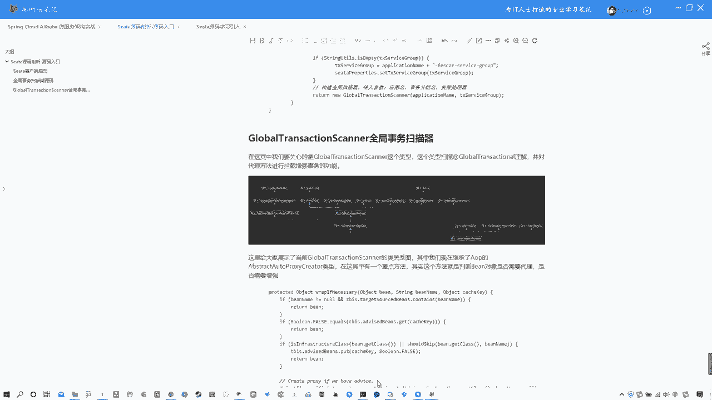

# 系列 5：P69：69、Seata源码剖析-源码入口 - 马士兵学堂 - BV1E34y1w773

好那么这节课开始，我们就开始正式的讲解theta源码啊，那这节课的话，我们先分析一下这个theta的源码入口啊，包括呃像cs的客户端启动等等一些东西吧，包括我们分析一些核心的类型啊。

嗯嗯那么我们先说一下，其实theta的客户端启动它有几个步骤啊，这几个步骤我们还是跟大家说一下啊，首先这里我说一下，就是一个theta的客户端启动，一般会分为几个流程啊。

第一就是自动加载各种bin以及配置信息啊，这个不用多说spring boot项目对吧，因为之前我就说过，你像NUOS也好，你像SA也好，它本质上就是一个spring boot项目对吧，然后第二步。

初始化TM啊，再来初始化RM就是具体的微服务啊，然后初始化分布式事务的客户端完成，那么代理数据源，而这个数据源代理这个事会回头我们再细讲啊，那么还有就是连接TC也就是theta的客户端啊。

连接TC然后注册RM注册TM然后我们之前说过啊，RMTM是可以替换的啊，因为那个我们之前讲那个AT那个例子，像那个订单和这个库存，那个订单，那个就是即使RM也是TM啊那个服务，第六步就是开启全局事务。

然后啊我这要先说一嘴啊，就是各位我们再去讲这个的时候，你们一定要去把我们之前讲过的那个案例啊，代入进来，这样的话我们会更好理解啊，在这其中啊，其实我们会涉及到几个核心的类型，就在这其中过程中。

首先我们说过，他既然是一个spring boot项目，那么spring boot项目的话，我们必然要去找谁啊，找的就是它的一个什么，找到的是spring boot项目启动的时候。

自动扫描加载类型的spring factories啊，然后呢我们找到其中的某一个类型啊，就是C它的自动的配置类啊，这样的话我们来看其中的一些核心点，那么这样吧，我呢我这是官方案例啊。

咱们这样吧，为了大家好理解，啊是吧，就在这就在这吧，我们就直接找官方案例吧好吧，这是官方啊，是那个OK在官方案例中啊，我们就找对应它引入的这个THEA包。

然后呢找它对应的这个spring boot启动加载类型啊，Spring factories，然后在这其中啊，我们来看一下啊，这个不用多解释，这个东西已经说过很多遍了啊，它自动启动的时候。

会自动扫描这个类型中的一些类型，那么你们来看啊，我为什么说，大家把之前的那个T的案例带入进来，因为我们整个的这种分布式事务的一个开启，是通过那个at哪个注解。

global transitional那个注解啊来进行开启的，所以其实这个位置是我们的一个入手的点啊，那个注解其实是我们入手的一个点，所以其实在这其中你就看呗。

那很明显只有一个global transitional auto configuration，有这么个类型，这个配置类型，所以其实这个位置就是我们主要关注的第一块，也就是源码的入口。

我们就从这分析好进来，进来以后你会发现。

这就是一个就是自动装配类对吧，其实就是说白了啊，这个这个东西如果说你之前用过XML的配置的话，其实这个跟XML配置是一样的，也是一个ban啊，包括什么其他的一些这个这个这个类型对吧，OK好啊。

所以这个位置你可以看到有一个艾特ban，那你看到艾特ban的时候，他住了一个什么叫做global transitional scanner，这个实际上是叫做全局事务扫描类啊。

所以其实我们应该从这去入手吧，啊我们就应该从这入手，为什么从这说呢，全局事务扫描类从这儿去扫描，你通过at global transitional注解所标注的对应类型，那么他从事是扫描啊。

OK所以其实我们可以看一下笔记，因为我没有办法写写注释啊，我在笔记中给大家写了一下这个类型，就是它global transitional auto configuration。

那么它就是theta的自动配置类，在这他注入了一个全局的事物扫描器，在这儿他住了一个全局事务的扫描器，然后在这其中啊。

你可以看到有个return new global transitional scanner，它是构建全局扫描器啊，包括传入参数是对应的应用名称，以及事物分组名啊，包括这种失败处理器，所以在这各位啊。

我们现在就来去看一下他。

呃这个的话我们就不通过这来看了，我们直接上源码吧，好吧，我们现在知道了，入手点在global transitional scanner啊，这个全局事务扫描器，那么我们就直接通过源码来找源码的话。

我在这里啊已经把源码给大家开起来了，OK好，那么就是他就是他global transitional scanner，那就是这个OK啊，我们来看一下这里面都干什么了啊，那么其实啊先不着急往下看啊。

我呢在这个讲源码过程中啊，给大家去做了一张图啊，我们讲到哪儿画到哪儿啊，这样的话方便大家复习，或者这个图会给大家的啊，那么可以看到我们最开始第一件事情，其实说白了就是呃。

我没有拿那个我们那个案例去解释啊，至少你们拿我们那个案例也是可以的，他通过去找到我们那个order service订单那块啊，它是TM嘛对吧，找到这个spring boot自动装配对应的一个类型。

然后找到这个艾特bin注入了全局事务扫描器，现在到这了对吧，那么在这其中我们往下来分析，在这其中你可以看到他首先继承了一个什么，Abstract，auto proceed是什么东西啊，这不用多说了吧。

这个这是a OP啊对吧，这a OP啊，我们之前NUONINO都见过OP，其实啊这个OAOP其实在我们你会发现，在我们越往后越往深学习，包括学习源码的时候，你会发现它变得越来越重要了。

很多相关的这种代理啊，都是通过a OP的形式来进行增强啊，来进行使用的，它进行动态代理对吧，OK啊，所以这个位置你可以看到全局事务扫描器，第一件事情，他继承了一个AP的对应的这么一个核心类型。

那么还有什么呢，我在这儿啊，都在这，我把这几个类型给大家列出来了，一个是监听器的一个基准接口啊，监听器因为它有一些事物事件的一些东西啊，那么包括有一个ban的初始化过程，就是引来引LAZBIN啊。

包括还有一个spring容器，这个后续我们慢慢说啊，包括有个容器销毁它，其实用到了spring容器相关的一些内容啊，这个咱们慢慢说啊，那么呃我还是说一嘴啊，我们去学源码的话。

一定要去先看整个的主流程对吧，先看整个主流程，那么这个位置我们上来有一个OP，其实我们应该从这开始入手去看一下，在这其中他做了什么，当然这里面源码有很多很多内容啊，这个咱慢慢分析，不着急啊。

然后我就大叫大家注意两点，一个是这个叫做application id，这个是服务名这个属性，还有就是一个tx service group，这是事物分组啊，这两点各位记一下好吧，我这里给大家标出来了。

那么我们可以看一眼图啊，找到这块以后，我们要分析的实际上是一个啊，这个你看我这句话把标注了at girl global transitional，注解所在类生成代理对象，并植入拦截器。

Global transitional，这个英特尔captain啊，这个东西什么意思呢，这个慢慢说啊，但是这个位置不光有他，还有一个这个呃呃ELIZENLIZBEAN啊，这个东西我们就一个个来看吧。

其实我们可以先看一下这头啊，简单来看一下这个指的是谁，指的就是他啊，那么它里面可以看啊，有这么一个方法，下载一下啊，有这么一个方法，方法可以看一下这个方法，在这他去实现了对应接口以后。

他要去实现对应方法，所以我们所以来找一下啊，在这个方法中他干了什么呢，我们来注意看啊，在这首先这个监听咱们先不着急啊，我们主要来看这位置，他调了一个叫做init client方法。

INIT初始化client是客户端是什么意思，很明显了吧，初始化客户端方法，所以在这个位置，我们就找到了一个初始化客户端方法，然后这个日志这我不看啊，咱们主要看主要流程，那么他这个位置会对应有检查。

包括检查对应的应用名称以及事物分组名，如果为空就抛异常啊，这都不用说，那么你要看这一个初始化TM和初始化RM，初始化TM是什么，不用多解释了对吧。

初始化TMOK还有一个初始化arm arm client init啊，包括application什么id，这是应用的名称，包括事物分组，应用名称，事物分组，还有一些其他的属性，那说白了在这个位置啊。

在这个global transitional c啊，这个这个这个scanner中，它有一个继承这个接口的目的，是为了去初始化你的TM和RM，这点其实符合，我们在说过那个启动流程中的几个步骤对吧。

OK但是这个位置后续我们会详细分析，现在我们就先暂且分析到这个位置，因为这好说，我先说了啊，也就是说白了他去调用对应的重写这个方法来，去初始化了客户端，初始化客户端的RM以及TM，OK这一步就完成了。

那么现在我们再回到这头啊，我们来看这这什么意思，往上翻啊，首先我们可以看一眼啊，他继承了这个AOP的这个核心类型啊，我们可以看一下，在这其中有个关键的方法，我来找一下关键方法嗯。

关键方法就是我们说的那个哎哪去了，来看一下啊，我记得是VIP什么的，在这里warp，If is if necessary，Necessnecessary，Vp，If if necessary，这个方法。

其实这个方法它就是来判断你当前所用注解，所标注的那个对象是否需要代理啊，就是那个B我们代理以后那个ban啊，我们标注注解以后那个那个类型的bean对象，它是否需要被代理，是否需要被增强。

当然这是它的一个负极写法，我们可以看一下啊，我们当前在这个全局事务扫描器中，它继承了这个类型，所以他重写了这个方法，我给你找一下啊，找一下他重写这个方法啊，在这呢OK啊，web1副necessary。

找到这个方法，我这也标注是代理增强啊，而且spring的所有的bean都会经过此方法，说白了其实就是你通过对应的那个注解，标注以后，那么他就会在这儿啊，来走他自己的这么一套模式啊。

他去继承父类方法重写之后，继承父类重写以后，重写方法以后，完成它定制化的效果，其实我们可以看一下这个方法，它的定制化效果是什么啊，首先加锁防止并发，然后你来看这检查是否是TCC模式。

check tcc啊，什么检查是否是TCC模式，是否是t cc的代理对象，说白了，这个位置，就是它根据不同模式会走一些不同的这个，对应的一些啊拦截器啊，因为你这个东西本身就是你想啊。

我们这个a OP里面就是有拦截器的对吧，这是关键点，所以这个位置不用多解释，很明显TCC模式它走了对应的是TCC的N7，所以上来他会先判断你当前啊是否是TCC模式，如果是的话，它会走对应TCC的拦截器。

但正常来说我们现在说的是AT，所以说如果不是TCC模式的话，它会判断是否有相关事物的注解啊，如果没有的话，就不代理了，那这个的话就不用很很很不用多说了，我们写的那个我们之前带入。

我们之前写的那个order订单那个和socket那个库存，那个我们在order那就去添加了对应的这个注解，所以它必然是开启啊这个全局事务的，所以他也是有注解的，那么他必然会开启相关的这什么代理对吧。

所以我们先来看啊，你看这个位置说了，说当发现存在全局事务注解admin啊，全局事务注解的be则添加拦截器，啥意思啊，哎就说白了，你这个位置他在你order订单那个位置发现对，有注解了好。

那么它就添加拦截器，而且在拦截器这个位置有这么个对象啊，global transitional啊，INTERSEPARATE这个对象这个对象啊，所以实际上后续的话，我们应该是往这个里面去深入来看一看啊。

在这里面去干了什么，当然我们先不着急往下看啊，先不着急去进到这深入啊，先往下来看它往下，还有就是说检查是否是代理对象。

也就是说当前你看a OP youtus is a p a products of pro，代理对象对吧，如果不是的话，会调用负极的这个代理，如果已经是代理对象的话，他会做一些这种集合的一些添加。

这个就不用详细去看了，我们主要还是要看哪儿的，看的是添加拦截器这个位置，要知道这个拦截器里面具体干了哪些事情，所以说到这的话，其实我们可以看一下我们这个流程啊，在这个位置我就说白了，你看这个对象。

它的作用是a OP抽象类，具有生成代理对象的功能，也就是说白了对你当前所艾滋病注解所标注的，那个类型进行增强啊，而且他后续是把标注了这个at global transitional。

注解所在内的这个代理对象啊，生成它的代理对象，并且植入到这个拦截器中，那么在拦截器中要做什么事呢，在这啊，你们要想一点，我看我这写了啊，我这写了一个说拦截器调EWORK方法。

但是去掉这个invoke方法之前怎么去触发的，是你浏览器请求触发全局事务，啥意思，我还是把之前的案例给大家开开吧，这样的话好理解，OK就是他啊，稍微等一下啊，很快好，我之前带着大家写过。

这个是应该在就是就是他啊，8001，我们之前写过一个80018002，然后呢我们现在是在8001的这个位置上，我后期改了一下，我是把它放到了这个业务层中啊，我在这儿去开启了全局事务创建订单的时候。

所以说白了我们再对照这张图，他的意思就是指通过这个AOP对象，然后呢找到你对应的这个注解，所标注的这个所在的类型，就是这个类型，然后生成一个代理对象啊，生成代理对象以后编入对应的拦截器。

然后做对应的增强，也就是说他要具体做的一些事情啊，这个增强所谓的增强就是指这个代理对象，我相信大家都玩过啊，这个所谓代理对象，就是在原有这个功能之上去加一些其他的功能，就像我们a OP一样对吧。

去做这种监听啊，环绕监听等等这东西一样的道理啊，那么怎么去触发这块呢，你看我这写了说浏览器发起请求触发全局事务，说白了，就是我们浏览器在调用这个当前订单以后，去发起创建订单的时候。

那么走到业务类型的时候啊，那么就会去触发什么呢，拦截器中其中的invoke方法，这个其实我不用给大家去试了，这个应该是比较基础的内容了啊，这个拦截器是必然会触发这个invoke方法了。

所以当我们有这个请求进来以后啊，有这个请求进来以后哪去了，这代码有点多了啊，就会走到拦截器中的in work方法，在这啊，走到拦截器中的work方法来执行对应操作，那么这里的操作是什么呢。

我们可以看一下，嗯嗯嗯首先获取执行方法啊，类型包括这有一个method获取执行方法，什么方法，就是你通过注解所标注的那个方法啊，我们那个是创建订单，他获取这个方法。

然后在这啊你们要注意看他会获取几个东西，一个是获取global transitional全局事务，还有一个就是global look什么全局所获取全局锁，这说白了就是原数据，那么这个一点就验证了。

我们之前给大家讲过那个独隔离，写隔离，其中所有的那个全局锁，而且这会写了，说这个全局所是会将本地事务执行，纳入到theta的分布式事务管理中，一起来竞争全局所，保证全局事务在执行的时候。

本地业务不可操作，全局事务中的记录张写张毒啊，就在这体现的，所以说白了我们获取到了全局事务，同时要拿到对应的全局所，拿到这以后再来往下来看，说判断啊，在这有判断说，看首先是否获取到了这个全局事务。

如果没有获取到的话，另当别论，如果获取到的就是执行全局事务啊，然后再去执行本地事务，先不着急，看这个本地事务，其实就是我们要往后分析的话，需要分析的是这个全局事务啊，分析是这个全局事务。

我们可以看图找到一个EMOKE方法，对它实际上就是解析你的这个注解，然后对应的执行全局事务，在这handler啊，global transitional啊，所以后续我们真正的核心是在这。

而且这里面的核心是在这个判断方法上，但是这块的话我们就先不往下分析了，因为现在分析的已经有点多了啊，所以回过头来的话，其实我们可以看图总结一下这节课分析的内容，就是说白了我们这个源码是从哪入手的。

把我们那个案例引入，从订单那个位置去找到对应它spring boot，自动装配的那个spring factories，找到我们对应的这个类型，Global transition。

Auto transitional auto configuration，然后找到对应它里面的一个非常核心的类型，就是全局事务扫描器，跟我们那个at global transitional。

transitional注解有关的啊，找到他在这个扫描器这个位置，比较核心的两个功能，一个是去继承了a OP相关的核心类，去做一些这种拦截器啊，环绕监听等等啊，不是环绕，就是做一些拦截器，做一些监听啊。

做一些对当前对象生成代理进行增强啊，那么还有一点就是整个的对你当前的这个病的，一个生命周期，生命周期啊，不是生命啊，生命周期啊，生命周期的管理，那么这一点的话其实没有详细分析，只是先给大家说了一下。

说白了就是初始化RM，初始化TM这一点给大家看到了，具体我们后续再分析，那么后续主要看的是，这在具有了这个a OP代理以后，那么他去重写了负极的这个方法，然后去啊生成对应的这个代理对象，然后构建拦截器。

在你去触发这种全局事务的时候，也就是controller发起请求之后，走的是invoke方法，拦截器的invoke方法解析你的全局事务注解，然后对应执行全局事务，当然对应执行全局事务具体干什么了。

我们还没有分析，这个话，我们下节课来分析，所以这节课的话我们就暂时先分析到这里，说白了就是给大家去源码开了个头，让你们知道怎么去找源码的这个入口，然后呢我们会后续慢慢根据整个的这个流程啊。

刚才我提到这个流程H1点的分析，其实这节课的话我们可以看到自动加载ban啊，这些信息包括初始化IMTM代理数据源，这个我没说，这回头再说啊，连接TC也没说啊，注册RM和注册TC注册TM这个也没说。

然后呃开启全局事务这个事儿我们看见入口了，但是我们后续会详细分析好吧，OK那么这节课的话我们就先分析到这啊，回头的话你们可以去把这个图哦，我回头把链接给你们，把这个图好好看看，跟这个图走一遍。

流程就能熟悉了，然后说一下啊，其实我们当前的这个位置，有一个global transitional scanner，这个类型是非常重要的啊，所有的基本都在这呢。

而且可以给大家看一下它的一个类关系啊，嗯嗯多说一嘴吧，哦就是他啊，这是他的相关类图啊，这他相关类图，首先它继承了哪有哪些接口啊，继承哪些类型啊，这个类型怎么回事啊，这个的话大家可以自己看一下好吧。

OK那么语法分析上来，可能大家会觉得有点空啊，老师这玩意分析的没什么意义的感觉，这个别着急啊，刚开个头。

慢慢的，我们现在只是把一些分支给大家列出来了对吧，两大分支，一个是。

AP里头的一个是这个整个的一个初始化这头的，那么后续我们会针对这两条路线再去展开分析，后续我们就会越来越清晰，好吧，各位啊。

