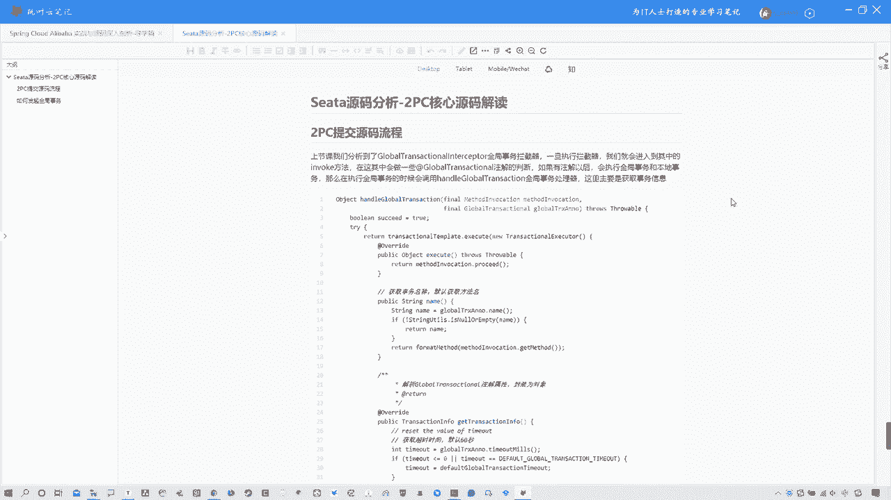
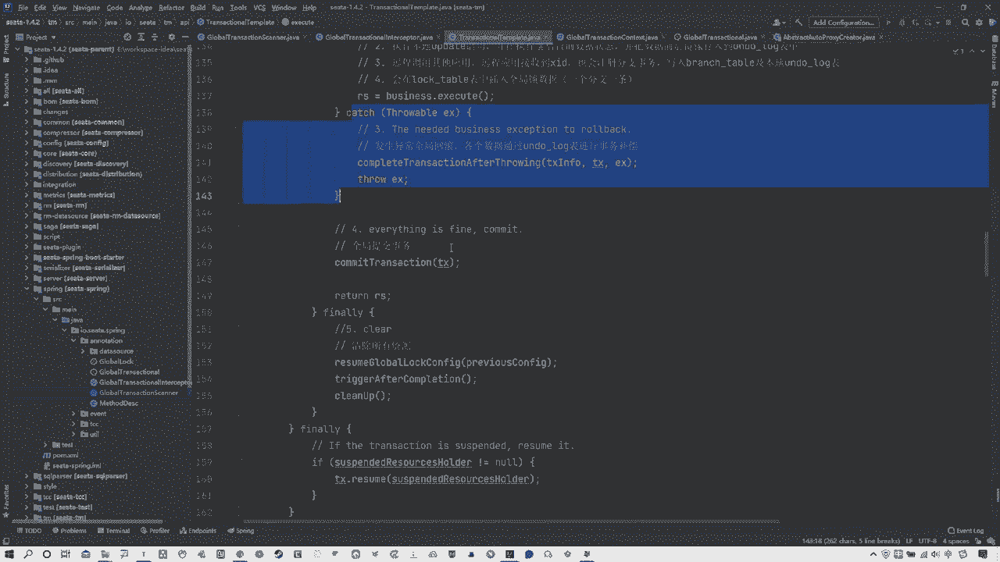
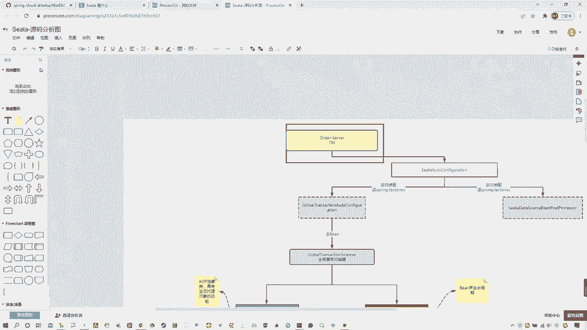
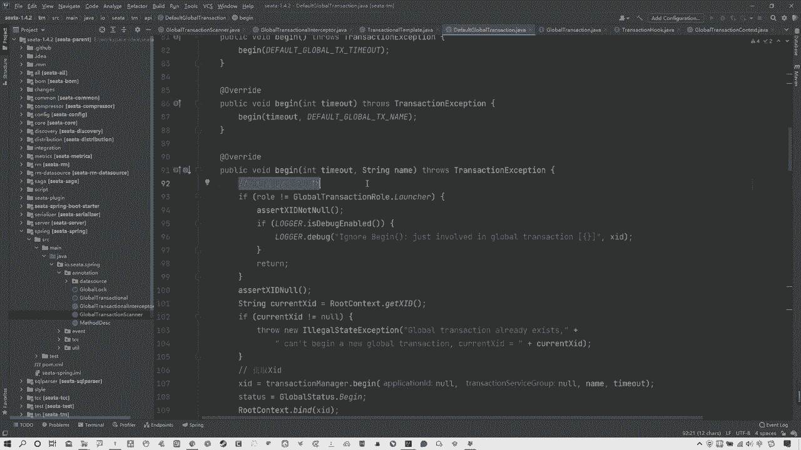
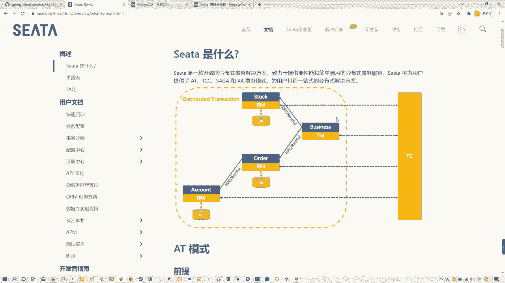
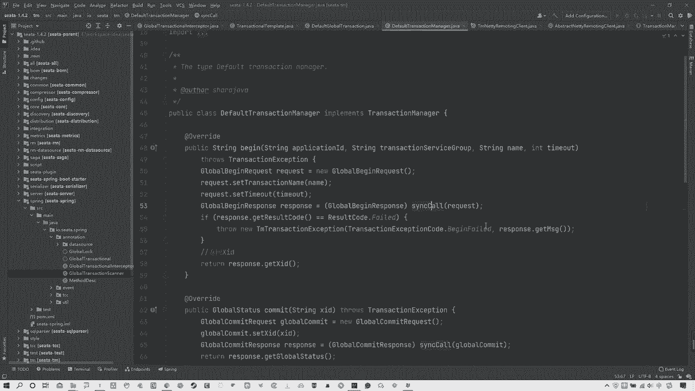
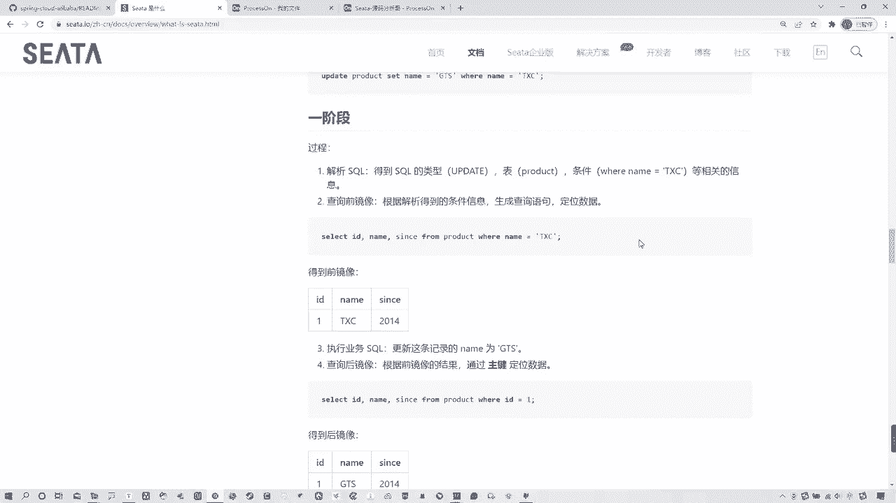

# 系列 5：P70：70、Seata源码分析-2PC核心源码解读 - 马士兵学堂 - BV1E34y1w773

OK各位，那么咱们这节课来接着学习theta的源码，相关内容呃，上节课的话，我们讲到了说这个global transitional intercaptor，这个全局事务拦截器，说一旦执行这个拦截器啊。

就会进入到其中的这个invoke方法，那么在这其中会做一些什么注解的判断呢，有注解以后会执行全局事务啊，那么其实在这儿啊。

我去给大家纠正一点啊，我们先看先复习一下吧，上节课包括上节课给大家画一些图啊，那么这个图的话后续我还会去增加一些内容，这个还有没有增加完啊，这个咱们咱们先不看这头啊，就还是看这咱们简单去复习一下。

说这个从哪开始，我们是从这个例子的角度去分析的，其实我们这节课要分析的就是，整个的这个AT模式的，2PC的这个请求的一个流程，整体流程啊，那么这个全局事务的整体流程，其实这个流程的话是一个比较关键的点。

所以我要领大家去复习一下，上节课我们也说过啊，包括我们之前一直聊说这个啊，theta它分为三个比较重要的角色，分为哪三个，还记着吧对吧，有TC啊，这个TC这个是T画的啊。

这个TC指的就是c a server对吧，我们安装那个theta server，那么他是那个最大号的对吧，他是那个服务端，或者不能说最大号，他是那个服务端啊，那当然还有客户端，客户端包含有TM还有RM。

这是他三个非常重要的概念对吧，那么TM呢是指我具体的这个事物的开启，它从这去开启全局事务，告诉TC我开启全局事务，RM是具体的事物的参与者，说白了就是具体的一个个的微服务，那么我们之前也写过对应的案例。

那么写过像order survey，Order server，包括写个order，写个stock，订单由订单去发起请求啊，干什么，创建哎订单，那么对应的叫减库存，那么这其中存在分布式是有问题。

所以现在谁去发起的这个全局事务，谁就是那个TM那么明显order server，order server啊，就是TM所以从这开始，我们找到了对应的spring boot启动的时候。

所啊这种自动配置的这个啊，自动装配的这么一个类型，叫做global transitional auto configuration，给大家找一下啊，呃我不找他了，找他了，往下走啊，这不找了。

还得看那个不用找他了，反正最后走到哪了，他其中一个非常重要的点啊，所以他会注入一些be组件，一个非常重要的bean组件，就是这个global transitional scanner，也就是他。

那么它是干什么的，它是全局事务扫描器用来扫描啊，我可以告诉大家在扫描什么，现在我可以完全告诉大家，他扫描的就是你当前啊这些啊所有的bean组件中，哪些是带什么的。

那个at transitional注解的，如果你带，那么它就会扫描到，并且添加对应的代理来进行增强啊，完成一系列的功能O所以简单复习一下吧，来看那么在这啊。

我们现在啊要知道是这个global transitional scanner，它实际上继承了abstract out to pro，啊啊啊，Abstract auto proxy creator。

那实际上这就是a OP a p的核心的一个类型，那么a OP的话干什么进行增强并动态代理对吧，包括他还有一些其他的什么什么啊，Configuration change listener。

这是一个机监听器的一个接口啊，包括什么啊，一这个这个这个这个inter alizing bean，bean初始化，包括什么application contacts of our啊，包括等等这些吧。

但实际上这三个，其实你们看到以后会发现他比较眼熟的，而这三个实际上是是什么，我可以明确的告诉大家，它其实就是spring容器啊，他其实就是spring容器，所以说白了。

我们这个当前的这个global transitional scanner啊，在最开始的时候给大家捋流程的时候，没有告诉大家，他实际上天生就自带spring容器啊，这点要知道。

那他这个位置说白了你你找到了有这个东西，它的作用就是去初始化相关的，而这个最后这个它是spring容器销毁的时候走它，所以他就有个destroy方法啊，而他的话也有一个对应方法。

就是after propertise s在所有的bean执行了配置以后，会找他会走他啊，OK首先这不就spring嘛对吧，这不用多解释，OK啊好，那么在当前这个类型中，这不是重点，重点是猜他干了什么啊。

我们都知道他继承这个abstract auto proxy client的时候，它对应有一个方法，找一下这个方法哪去了，它有一个非常重要的方法，我看一下啊，这个方法，啊算了再看吧，这完全没点着啊。

就这个方法，我把它复制一下，哦在这啊，OK在这翻过头了啊，这个非常重要的方法，也就是说白了我们只要有对应的这个AOP，它必然会执行这个方法对吧，说白了为什么是执行它呢。

就是因为你是继承了这个对应的抽象类型，你在底下就必须重写这个方法啊，这点要注意啊，必须重启这个方法，那么它就是实际的那个代理增强spring，所有的ban都会经过此方法啊，那这里会有一些锁啊。

包括去检查是否是TCC模式还是不，如果不是t cc是干什么对吧，包括这里面啊，去什么发现当前全局事务注解并栏添加拦截器，其实上节课我们就分析到这说添加拦截器对吧。

你看我这画着呢说啊这有一个global transitional啊，INTERACTOR不就在这吗，啊添加拦截器对吧啊添加拦截器，那么这个是我们这节课重点往下分析一个地方，但是咱们先不着急看它啊。

先把这捋完啊，往下来看的话，他这个位置会跑去检测，你当前是不是代理对象啊，如果不是的话，就返回负极spring调用的方法，就是负极那个调的方法，如果是的话，那么就嗯这个去添加拦截器械组合等等这些吧。

这个就比较简单了啊，这个其实不是什么重点，我就不多说了，OK那么这其中啊嗯我刚才说过了，比较重要在哪儿，在这儿啊，global transitional啊。

INTERACTOR这块是非常重要的一个地方啊，为什么说这里非常重要呢，因为啊大家要注意呃，它是怎么来的，为什么会有这个拦截器，它怎么进来的，其实我们可以看图这个拦截器啊。

它的作用就是去调用invoke方法，那这个我们都知道，拦截器会必然调用invoke方法，那么什么时候调用的，他拦截的是什么，这点要说清楚，它拦截的，实际上是在你用户请求发到这个order之前。

也就是浏览器发起全局事务的时候，它会进行拦截啊，调用引word方法先走你对应拦截器的一些流程啊，一些逻辑走完以后再走你对应的一些啊，自己的业务对吧，所以上节课实际要分析到。

这就是走的这个invoke方法啊，对吧，哎哪去了，这个invoke方法也就是说当浏览器发送请求，那么拦截器生效调用拦截器的方法，那咱们就分析一下这个方法其中干了什么啊，抱歉啊，呛着了。

那么上节课这个位置，简单跟大家说一说他干的具体一些事情，那么我要纠正一点啊，上节课我也是着急了啊，抱歉抱歉，我刚才我上节课讲到啊，我们看图啊，说这个位置说啊啊创建完订单以后。

解析对应的global transitional注解，也就是全局事务注解，解析完注解以后，如果包含注解就执行全局事务，如果不包含执行啊，不包含注解，执行的是我说的是本地事务啊，sorry抱歉，这里不对。

他不是本地事务，他是执行全局所呃，我在最开始给大家讲源码的时候，跟大家去讲过这个锁的概念，这个全局锁的概念，它是为了防止这种脏读或者脏写的发生啊，AT模式测体特意提供这么个锁对吧。

你必须就是两个事物的时候，举个例子来说啊，复习一下TX1，他必须得获得全局锁啊，那么他在执行过程中，这个全局所一直他持有，它必须全部或者commit或者rob执行完成以后。

那么T2第二个事物才能去拿到这个全局所，执行它对应的一些事物，如果当前TS1在没有执行完的时候，T2是拿不到全集所的，那么他所做的所有的本地事务，将直接什么本地回滚，然后一直在这重试重试重试重试什么。

等待拿到这个全球所OK啊，画了一张草图，简单复习一下，所以这是我们之前讲过的一个概念，那么在这实际上就已经体现出来了，在他这个源码中啊，所以这个位置实际上是使用首先去执行啊，去获取。

看有没有对应的这个注解，这不是吗，获取global transitional全局事务注解，包括这里会获取全局，这就是获取全局锁啊，这句话实际上就是获取全局锁，在获取了以后，在获取了以后啊。

执行官在获取以后，如果有这个全局事务，那么他就会执行全局事务，如果啊获取完以后有全局所，那么会对应执行全局所相关的一些处理，全局所，这里我还没有去关注，我现在关注的是全局事务，好接着往下走。

hler global transactional走，他呃在这其中啊，上节课我也忘了，所以给大家分分析，反正我接着说吧，啊，在这里面，实际上就是我们要主要分析的一个内容啊，主要分析的一个内容啊。

为什么这么说呢，这个handler global transactional，实际上这块是非常非常关键的一块内容，我们可以先看图啊，这我写的书判断完以后，Hla global transitional。

它的作用实际上是获取事务信息，以及执行全局事务啊，或记住它是获取事物信息，执行全局事务，为什么这么说，我们来看源码，走到这以后，你往下看啊，首先这块咱们先不着急看，你先往这看这是什么。

首先这个位置我可以告诉大家，咱们主要看源码，先看流程，不要去分析细节啊，他这个位置是获取你当前的事物名称啊，就是获取你当前这个方法名，如果没有的话，就是默认方法名啊。

然后他要去解析global transitional注解属性，封装为对象，那么有哪些属性呢，其实我可以告诉大家，就是我们这个嗯global transactional注解这个注解啊。

global transactional注解，它对应是有一些自己的属性的，给大家露一眼，这个给大家看一眼啊，你看什么time out time out对应的名字等等吧，一些它是有自己的一些啊属性的。

而这些属性的话说白了是有些默认值的啊，他是有些默认值的，那他需要去拿到这些默认值，去把当前这个对应对应的这个注解啊，打成一个对象，所以在这个位置看第一件事情，他还是获取超时时间，默认是60秒。

我为什么这么说呢，你看刚才咱们看到那个time out mini了，对不对，所以你看啊说呃解析global transitional注解属性，封装为对象，那在这个位置，首先第一件事情就是获取超时时间。

默认为60秒，OK可以看到怎么去获取的，time out minutes走掉的是哪对吧，那么你看它默认的是default values值是多少，这是毫秒啊，6万毫秒，你换算一下是多少秒，对不对。

OK好啊，这不多说了，然后再回来，那么道理都是一样的，那么这能获取到，剩下就好办了对吧，你看包括构建事物对象信息，他这个事物对象信息包括什么超时时间，事物的名称，你可以默认理解为方法名。

包括事物的传播啊，那么校验或占用全局锁的什么间隔等等吧，等等等等等这些东西，把这些所有的对应的注解中的信息，不管是默认的还是可以设置啊，当然这个位置可以设置啊，一般都是默认的把这些信息打包成一个对象。

构建一个对象啊，然后进行一些其他操作等等这些，然后如果出问题会执行对应执行对应的异常，这是这块位置的一个逻辑啊，它是个整体逻辑，噗噗那么说完这块以后，我们再往下看一看，下面还有啥，看看这个方法没啥了。

那么其实这个位置啊，这个位置只是去上来获取了对应的一些啊啊，这个这个这个这个事物的一个信息啊，那么这其中还有一点，获取完事务信息以后，他执行了一个全局事务，在哪去执行呢。

其实我们这其中有一个非常关键的方法，就是它我一直没提到啊，就这个方法execute方法我们可以搂一眼啊，看他干什么了啊，走狗头往上啊，在这来XQ的方法，那么这个方法他干了什么呢。

其实啊各位我们来仔细去观察这个方法上来，第一件事情获取事物信息，唉拿到对应的事物信息，然后干什么了，获取当前的事物，主要获取XID哎XRD是什么，还记得吧，全局事物的唯一标识对吗。

OK然后根据配置的不同事物传播行为，执行不同逻辑，大家可能会对这个事务传播行为有点疑惑啊，这个实际上就是spring那个事务传播行为啊，一般它默认就有这么几种啊，对吧，OK啊。

这个如果说你对这个事物传播行为不了解的话，我建议大家去看看spring源码，或者看看spring课程啊，去把spring的事务传播行为啊，这个这个搞不清楚了，好吧，这我就不多解释了。

因为这是老相当于之前老的知识点了啊，OK那么这个位置获取完对应的这个事务，传播行为以后，再往下来看还干什么了，在这如果当前没有事务事务，则创建一个新的事物，开始执行全局事务，咱先关注主要流程啊。

发生异常回滚，各个各个数据通过undo log表进行事务补偿，这是不是AT啊，这是不是T啊，对吧，OK如果没有问题好，全局提交，最后不管怎么着都要清理资源来，我问大家，这是不是就是AT模式的一个。

或者说说，或者说这个C塔比较核心的这么一个RPC，整体的事物，全局事务的执行流程啊，那说白了，我们在这儿就能看到这些整体的执行流程，这就是我们今天要分析的一个非常关键的点。

那么说白了也就是任何你的请求进来以后，他都必然会走，这就任何你的全局事务走来进来以后，他都必须要走，这获取当前事务执行一些其他的一些呃，呃咱可以大步骤啊，第一件事获取事物信息。

然后第二点说开始执行全局事务啊，第三点说发生异常回滚啊，各数据通过undo log进行事后补偿，如果没有异常，全局提交，那很明显摆着就是整个的一个事物的执行流程，全局事务执行流程对吗，当然我们可以看图。

这就是我的是标出来的，获取事故信息，开始执行全局事务，发生异常回滚，全局提交，以最后的清除资源，所以大家说白了这个方法是干啥的啊，大家说这个方法是干啥的，execute方法是干啥的。

就是真正去执行整体2PC这个阶段的，全部的核心流程，代码全在这里啊，OK那大家可能会产生一些疑问，老师这里这里有很多细节呀，包括我们最开始去讲这个复习这个AT模式，它的EPC阶段和2PC阶段的时候。

2PC咱们好理解，EPC它有很多很多的一些细节事情，那么这些事情我们就可以分析一下了，先看这头啊，我这标了一些，你可以看到上来获取当前事物，主要获取XID，然后根据什么配置的不同的事务传播行为。

执行不同逻辑，如果当前没有事务，创建一个新的事物，这套流程在哪，就在第一部里面，上来获取事物信息以后，在这儿获取当前事物，主要获取差D从这去获取的啊，你看看查D如果为now干什么，获取查D去对吧。

OK啊这我就不细往下看了啊，那么第二点说，根据配置不同的事物的传播行为，执行不同逻辑，那么这一点其实也看这吧，来咱们看看这个类型，这个类型是干啥的，for global transactional啊。

这里面有对应的一些事物的一些传播行为，这就是spring的事务事务传播行为啊，这就是spring的事务传播行为，OK这点我们也验证了，那么还有往下说这1。3，他首先啊去拿这个事物的时候。

这个T代表就是当前这个事物，代表当前这个全局事务，如果当前这个事物没有的话，那么他就要创建一个新的事物来进行执行，那么在这块就是没有创建新的好，那么这就是第一步所做的事情，那么它对应的就是这套流程。

没问题吧对吧，OK好，然后到第二步，第二步这个位置它会发生一些事情啊，什么事情呢，就是什么事情啊，往下一点来分析啊，咱们一点点来分析，首先在第二部这个位置开始执行全局事务。

那你可以先看流程上来看我这写的一个TM对TC，也就是theta server发起请求，客户端向服务端发请求，这是那个TC，这是那个TM啊，然后还有什么有一个begin方法啊，走到默认事务管理者这个位置。

通过NT通讯，唉，其实在最开始我讲这个应用的时候，跟大家说过，这个C塔塔的底层实际上用到了NT啊，它实际上最终是通过NT通讯和谁发生的沟通啊，和服务端进行了一个沟通好，那我们就看看这一步骤啊。

第二步骤OK从这开始，我们主要关注这说开始执行全局事务走进去啊，那么在这进去之前，我还要再多说一嘴啊，再多说一嘴，各位你们先看这个主流程啊，主流程第一步说获取事务信息，第二步开始执行全局事务。

第三步发生异常回滚，第四步全球事务提交。

那我想问大家，你们就猜测一下啊，咱们可以看这张图，在这在这几个步骤中啊，就看这四个步骤在这四个步骤中哪个位置，他对TC也就是sea server发起的请求，很明显，我们获取事物信息。

以及开始执行全局事务的时候，并没有真正的与TC发生相关的通信啊，其实我可以告诉大家啊，不能这么说啊，不能说倒过来说啊，就这个位置不是说没有发生真正通讯，而是说在这整个流程中啊，这其实已经发了通讯了啊。

只是在这个整个流程中啊，哪里是1PC，哪里是2PC啊，抱歉刚才我家猫一叫，我这思路被打断了一下啊，我重新说啊哈哈，在这整个阶段中，各位来想一下，在这整个阶段中，咱们先看一下前四个阶段啊。

这整个阶段中哪里是1PC，哪里是2PC，很明显，一二都属于EPC阶段，从这儿开始出现异常了，进行全局回滚，没有异常，全局提交才是真正的2PC阶段，对吧没有了吧，所以这一点各位要注意一下啊。

这一点各位要注意一下，那么最后他清除资源就不多说了，所以说白了从这我就可以看到，这就是整个2PC的一个执行的关键点，所以现在咱们就看一下第二部这个位置，它是开启开始执行全局事务。

那我们都知道我们这个啊找一块空白机构，我简单画一下啊，比如说这是我的去找他吧，这是我的那个TM对吧。

那么他最开始要发起全局事务，他是不是要跟TC也就是sea server进行通讯对吧，OK好，那么什么位置开始通讯，开启全局事务的时候，要跟TC进行通讯，那很明显。

我们是不是应该是在第二部这个位置的时候啊，跟TC去发起一个通信呢，也就是sea server去发起通信对吧，那么怎么去发起的流程，在这OK我们搂一遍好吧，找到第二步。

找到这个begin transactional走，OK那其实这个位置各位在这TC一点begin，从这去发起的对对TC发起的请求，但是各位你们要注意看一下这个位置，实际上涉及到了一个设计模式，看这方法啊。

这调的是诶，等回来啊，这啊你看啊吹before ban啊，trigger before ban和一个trigger after begin begin，嘴瓢了，可以看一下，这是个空方法。

看这个这个这也是个空方法，那么各位你们看到这想到了什么，这实际上就是一个模板模式的应用，这个相当于就是说啊他当然默认没有啊，如果你想拓展的话，你是可以通过在发起请求前干什么事，发起请求后干什么事啊。

你可以自己拓展的，这是个模板模式的应用，好吧啊，这简单提一嘴，然后我们真正要关注的就是，这个对TC发起的请求，就是TX点begin这个位置好进去看一下，当然啊它是需要有对应的什么重写的。

我们我们走的是哪一个啊，我们这个位置走的实际上就是默认的default，因为我们知道这个theta的默认的这个模式，就是AT，所以不用看别的。

直接找define global transition的状态，OK由他进行调用，我们来看自定制方法他都干什么了啊，第二步就是与TM去发起沟通这一步啊，回到这个图中，我再说一下。

就是在这这是当前的TM与TC进行沟通，发起请求的过程啊，所以咱们来看一下他真正去发起请求的过程啊，begin首先上来就有个判断，他判断你调用者当前是否是TM那你们来想一下。

如果你是第一次发起全局请求的话啊，全局事务请求的话，很明显一定得是TM发起啊，为什么这么说。

看官网看官网啊，TM是什么，还记得吗，受管理器咱不看这看这TM在这儿呢，是不是得由他先去整个发起全局事务，是不是得他发起啊对吧，你不能说我对RM发起吧，那除非他也是TM那这不太现实对吧。

所以通过咱们图中，很明显可以知道TM发起的全局事务。

所以在这调用者必然必须第一次是TM如果不是，那就直接就拜拜了啊，直接就拜拜了，好吧OK啊，所以判断是否是TM，这是第一次发起全局请求的时候，全局事务请求啊，然后往下来看。

在这个位置获取x i d transitional manager，事务管理者点begin方法，在这获取的一个XD可以看到吧，啊在这儿获取的一个查id，OK那没有问题，那我们接着往下跟啊。

走到哪走到获取超额啊，当然这个位置也是需要有调用的，那么这个位置的调用也不用想，就找default就行啊，这个default transitional manager不就是他吗。

啊transaction transactional manager找他啊，default transacti嘴瓢了，transsessional manager默认的吧，走走到这个位置。

begin来看这这个位置就很好看了对吧，对应的请求以及对应的事物名称，超时时间等等，然后把请求给他返回一个响应，那么我们往下来跟跟哪，跟这个，啊这个这个这个这个位置，那你们来看这个位置啊。

它有一个非常重要的东西，你看它通过拆开的方式去写，然后你看这TMNT什么时候client点get instance实例，send发行球，这个很明显，如果说你对NT比较熟悉的话。

各位这一看就知道这是通过NT去发的请求啊，这是通过NT去发的请求啊，没什么毛病对吧，OK那么其实这个TM这个对应的NT类，那么你可以看名字，这tm nt client它是对应的一个TM的client。

一个客户端，所以从这里发起的请求，这也不用多说什么了对吧，所以现在我们就分析清楚了啊，我们回过头来再捋一下啊。

咱不看这看图吧，我们刚才去找到了这个啊，这个这个对应的一个执行全局流程的，一个全局事务流程的一个方法，然后在这其中有几个步骤，我们看到了有获取事务信息，开始执行全局事务，发生异常回滚，或者说全局提交。

那么说白了，这个位置整个就是一个T的2PC阶段，核心核心源码对吧，核心源码，那么在这过程中，一和二这个位置是1PC，三和四是2PC2PC阶段啊，所以当前我们第一次开启全球事务的时候。

他一定是从第二步开始的，为什么由TM发起全局事务，找TC跟TC沟通，OK所以现在我们清楚知道，OK第二步这个位置是要发起全局请求的，那第一步他说获取事务信息，那怎么获取的，主要是获取了一些什么差D啊。

包括事物的一些信息来去创建，如果你没有事务要去创建新的事物，你好第二步能执行啊对吧，所以这是第一步，那第二步他要执行的时候，就需要去真正的跟TC去发起请求，发起通讯，发起连接。

那么它使用的就是begin方法啊，一层层的走default，Default，最后走net通讯，完成对TC的请求，当然只是整体流程，这是整体流程，那么具体到连接到服务端，服务端所干了什么事。

这个咱们后续分析，但这节课我们就先分析到，这起码我们这节课把这个2PC的核心源码，核心流程这个位置搞清楚了，当然大家一定会问我说，老师第三阶段这个什么全局回滚怎么回滚呢。

对undo log怎么生成的对吧，包括这个全局提交这个位置啊，这可能好理解一些，主要是这，那这个的话我们就要去通过下节课去分析了啊，这个位置还涉及到一个点，就是大家先记住一句话，我们之前说过啊。

讲差异模式的时候我也提过，包括讲AT可能我没提过啊，但讲差异的时候，我一定提过有这个数据源代理这么一个事儿啊，其实你们要想一下AT模式，我们在搂一眼AT模式，我们之前说过，他一阶段的时候，我下来看啊。

他需要解析circle，得到circle的这些数据对吧，拿到对应的前进和后镜像，那其实你想他怎么去对应，拿到前进向后倾向，说白了他需要去把原有的这个连接对象，变成一个代理对象，通过这个代理对象来完成的。

它对应的一阶段的一些操作，所以针对于数据源代理这一块儿啊。

我们要进行分析分析以后才能知道啊，这第三步他怎么进行的，整个的安do log表，这个事务补偿回滚，这表怎么出来的，数据怎么来的等等这些，所以下这节课我们先把整体流程研究透，然后下节课来研究一下这个事务。

这个事务代理去了啊，数据源代理这块好吧，各位啊，OK那么这节课就先讲到这儿，各位那么自己可以去，如果你不信邪的话，你可以去按照我这个流程自己去debug1遍，好吧，各位OK啊。

但是我建议大家最好能够通过静态阅读，代码方式把它阅读透了，这个才是能力好吧，各位好，OK那么呃咱们这节课就先到这里了，各位啊。

