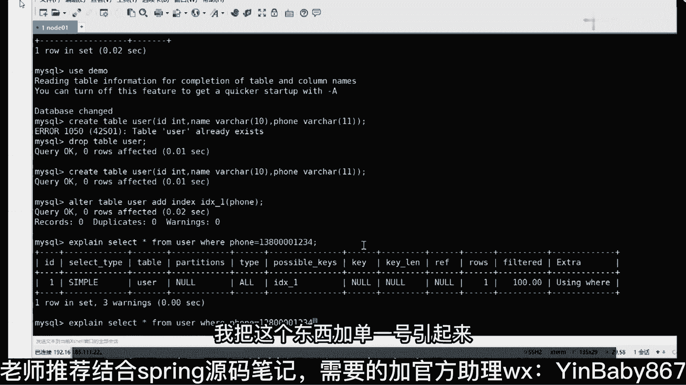

# 系列 5：P76：76、在进行索引优化时应该注意什么问题？ - 马士兵学堂 - BV1E34y1w773

所以优化的时候，要注意啥，注意什么，同时到了啊，第一个，所以占用的存储空间要小，尽可能索引字段，要尽可能少的占用存储空间，还有吗，在满足业务系统的需求类，尽可能自增，还有吗，还有啥，没了。

所以在进行索引字段，我刚才没提这东西，Hope说了就尽可能不要为空，我帅的东西啊，呃空这玩意儿在数据库里面，它是一个非常非常特殊的存在，因为在很多情况下面，空都不等于空对吧，空调none。

你叫is none or is not n对吧，但是尽量不要选择为空的字段，听明白意思吧好吧，这东西还有第四个选择索引的时候，索引，的基数要尽可能的，大有人知道什么叫基数吗，你知道什么叫基数吗。

这里面有一个计算公式，什么计算公式，就是说我们在建索引的时候，到底给哪些列来建我们对应的索引，这边有计算公式，记住了，叫DV除以count，大于等于80%，这字段适合创建，所以明白意思吗。

刚刚那个同学恶龙咆哮说，假如给性别加字段，你给性别加索引一点意义都没有，一点意义都没有，DV是啥，不知道DV是啥吗，Be in value，第4value唯一值，唯一值除以count要大于等于80%。

明白了吗，性别这个字段，你加索引一点意义都没有，就是要给你前面加作业没意义啊，你加作业干嘛，你身边只有男和女男女，你加索引之后，你通过索引来查询没有意义啊，你加这玩意儿明白意思吧，这没意义啊。

对你的不重复的值要尽可能的多好吧，重复值多的话，这长期的话要比较麻烦，还有什么，看到了吗，加了也不会怎么样嘛，你在另外一个字段查询的时候，查出来都是重复数据吗，那没意义，也不会怎么样，还有啥。

不要给所有的字段都添加索引，并不是索引越多越好，明白了吗，这点是很重要的，很多同学老师，我能不能给表里面的每一个字段都添加上，所以不要这样，你给你表里面的每一个字段都添加索引之后，效率不一定高。

效率不一定高，它会占用大量的存储空间，明白意思吧，好吧，再往下看第六个还有什么，看吧，尽量避免索引失效，尽量避免索引失效，尽量避免索引失效，那这里面就涉及到一个问题，老师索引失效都有哪些场景。

比如下一个我要聊的话题，什么情况下会导致索引失效，有人能说一下吗，所以呢应该是很少修改的，这个是对的，加一个吧，这个我之前没准备啊，下一个，尽量选择的索引字段尽量不要频繁，修改，来第一种情况。

所以实际情况你们说的啥来着，like查询的时候，左边的时候，不要加感叹号对吧，还有吗，中国中国，is not all的情况，我建议你不要说all的情况，不要说，看到吗，所以是这样的。

所以字段上不要添加任何的表达式操作，明白了吧，不要加任何表达式操作啊，这是第二个，还有吗，第三个对，所以，字段在使用的时候不要出现类型的影视，影视，转换，还有啥索引，上不要出现函数计算。

说什么组合索引在进行使用的时候，要遵循最左匹配原则，我还没说这东西啊，匹配原则，这最多比原则我还没说，不了解你是转换啥意思，来给你举个例子啊，等下我给你找个案例啊，嗯找一个案例，我想想在哪放着呢。

我让你列一堆情况，是多少下，你找一下这个东西，所以失效，嗯还有啥，诶你现在睡觉吗，找不到从哪讲这玩意，嗯等我找一下。

我忘了在哪在哪讲的，所以失效的情况我这写了一堆啊，先找到，不算了，给大家举个例子啊，就是这个东西是啥意思，什么叫隐式转换，比如说我们在进行具体的数据库操作的时候，有一个叫做什么来着，From。

来看这个东西来演示这个这个这个这个案例啊，来打开我们的数据库，演示一个案例，Use them。

打开user存在draviable user。

你看看表吧，表里面有几个字段，三个字段好吧，123d name和phone，只有且只有这三个字段好吧，当包含了三字段之后，还有一件事，我现在给我们的phone字段，我添加一个索引，建完了。

建完之后查询语句，你在写的时候，比如说我随便写一个，大家看到这个SQL语句吗，我问一下，我现在这种作文字段是什么类型的，什么类型，观察类型了，我现在写什么类型数字啊，是不是数字类型，你运行之后。

你看一下你的执行计划，在执行计划里面K这页里面显示的就是N，如果现在我换一种操作，我把这个东西加单引号引起来。

这有值了吗，你知道吧，这就是我们对应的类型，如果你的类型发生一种转换的话，它可能会导致我们对应的索引失效，就这意思明白了，看明白了吗，来这个案例看明白，同学给他扣个一。

能看懂吗，就就这意思好吧，大家这种情况好吧，再往下看，还有一个东西，我就给大家说一下，in或者on，在很多情况下会导致，所以失效，但是要根据实际的情况来进行判断，明白意思吧。

你不要上来就说印会失效或者or会失效，这种说法都是不对的，都是不对的，OK直播不是直播，是录播，所以啊把这几种情况给大家说清楚，说完之后，你随便哪个地方能举出一些案例就够了，能举出一些案例。

我记得我之前用过这东西，在那忘好吧，来再看还有什么，第七个，在使用组合索引的时候，如果中间的某个索引列使用了范围查询，那么会导致后续表索引失效，这东西啊一会儿也是一样，我会给大家举个例子。

来说明这几种对应的一个情况，好吧，这我写了七个，我就差不多够了吧，你面试的时候去给面试官说这些情况就可以了，好来这几个点能听明白，同学给我扣一，能看懂吗，这样啊这个东西啊我来给大家一会。

我来解释几个名词，解释几个名词的时候，我们把对应的案例啊给大家做一个演示，做一个演示，好吧好了，这是刚刚上面讲的这些核心的一些知识啊，讲完核心知识之后，我们再讲几个关键名词吧，把几个关键名词讲完之后。

基本上就结束了，第一个名词刚才提到的叫回表，来知道回表是啥意思，给老师扣一，不知道扣二，你知道什么叫回表吗，回表是这样一个意思啊，给大家解释一下，我们来列举一个场景，什么场景，比如说表里面有id逗号。

name逗号，真的四个字段好，先明确这四个字段，当我定好数字段之后，我来规定一下，这里面有ID，组件好吧，name是普通，所以我写一个语句叫select星from table，where name等于。

张三问一下，这条SL语句的查找过程是什么样子的，啥样的，先根据，name的值去name b加数，找到对应的叶子节点吧，我问一下这个叶子节点取得数据是什么数据啊，页面放什么，取出D值吧，再根据D值去D。

B加速攻找到查找全部的结果，这个过程称之为回表，是回表的意义，明白意思吧，那我问的是什么，回表的效率高还是低啊，回转的效率高还是低，火页表的效率比较低好吧，尽可能不要使用，我尽可能避免回表的产生。

明白意思吧，就是这些东西，这是回表，那这个没问题的，扣一这是回归概念啊，他需要来回去回到原来表里面，查询我们对应的一个数据记录，这是第一个来聊第二个东西，刚才要求讲的，第二个叫索引覆盖，什么叫索引覆盖。

表示一模一样的数据一模一样，我把这个语句改一下，改成什么呢，改id逗号，Name，想问一下他的操作过程是什么样子的，什么样子，是不是先根据name的值去name的B加数，查找结果能够。

直接获取到id和内容，还需要就不需要去D的B加速查找，其他的查找数据的这个过程，叫做索引覆盖，明白了吗，什么叫索引覆盖，也非常简单，就是说索引的叶子节点中包含了，要查询的全部数据，是叫做索引覆盖。

能听懂吗，这效率高还是低啊，是高还是低高吗，这谁啊，推荐使用索引，对这些东西来，再往下看下一个它都叫什么叫最左匹配原则，这是什么东西啊，什么叫最左匹配原则呀，其实他也挺好理解的，它主要针对什么。

针对的是组合索引，一样改一下条件吧，id name和逗号位置是组合所有，组合索引就在查询，有时候必须要从左向右匹配这东西啊，就跟我们呃去购物网站，你在购物网站里面写写写地址的时候一样，必须要先学省。

再选市，再选缺缺一是不可的，必须按照这样这样这样一个数据来保存，这里面会与生俱来对应几个语句啊，让大家查一下flag行，From table，where name等于根号，and age等于问号。

这是第一个语句，下面还有几条，把他干一下，删掉，呃删掉，我问一下这四条语句里面哪个会用到组合索引，14134134，还是那句话，你记住我刚刚说的那个标准顺序，必须要从左向右挨个匹配，所以在匹配的时候。

我们先匹配第一个name age是不是符合这个顺序，所以是没问题的，第二个age能复合吗，必须要先匹配name再匹配，你这里面没有内幕，所以第二个是不行的，第三个可以吗，可以啊，虽然没有。

但是我能匹配到name也是可以使用的，第四个把name和age顺序换了一下，第四个行不行，第四个项目，这是比较有争议的地方，其实我问一个问题就行了，如果把name和age的顺序来回换一下。

会影响我们最终的查询结果吗，会影响吗，不会吗，所以这块会有一个东西，就刚刚说的是优化器会优化，明白了会调整好我们对应的一个顺序就完了，这就是我们说的最左匹配原则对吧，除了最左匹配原则之外。

还有下面一个东西，什么原理是啥，没啥原理，就是从此就先取为第一个。