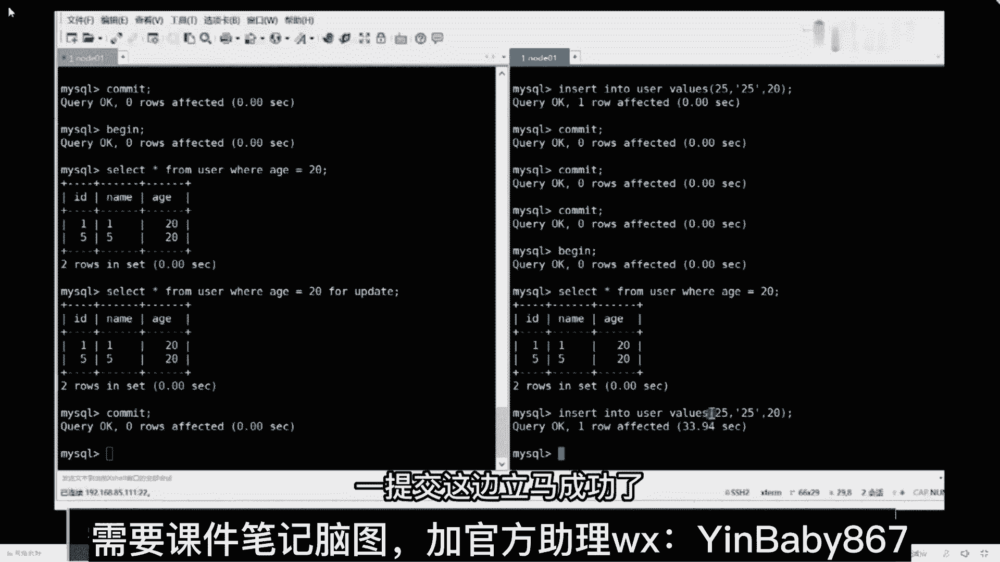

# 系列 5：P82：82、MVCC如何实现多版本并发控制？如何解决读写冲突？ - 马士兵学堂 - BV1E34y1w773

这没有，那这先select，S挪到下面，这只是一个自来操作对吧，然后这是一次快照读，这是一次快照读，来一样的，我错了，每次在进行快照读的时候，需要生成我们的review吧，这里面是不是有两次快照读。

第一个在T2时刻，第二个在T4时刻，所以我们分别要把对应的数据写写完整，把它弄下来，Cl c ctrl v，明白了，回来之后先看蓝色的，首先在这块我在进行查询的时候。

我当前系统的活跃列表里面的事务id是几，你告诉我是几，123123没问题好吧，第二个回形列表里面最小的数id是几一吧，不用动，尚未分配的下一个事关系是几四，也不用动，这个值是几啊。

叫新增这条记录或最近修改这条记录的值，现在我有新增呢，我没看到我的新增操作，但是因为我们的事务id的值是递增的，它一定是小于一的，我能不能给他成零，反正你小于就行了，是不是这意思，小于就行了，无所谓啊。

我这写成一个零，这没问题吧，来下面再来做操作，这是蓝色部分，还有绿色部分，把绿色拿下来，如果是绿色部分的话，我们依然要进行判断，判断啥在这个时候，当前活跃列表数值，这个活页列表id是几啊。

在蓝色部分的时候，我有事务二有提交吗，听同学听我在这执行的时候，二有提交吗，没有还没提交呢，在绿色部分，这时候是不是也提交了，所以回忆里变成几了，一逗号三对吧，然后最少收益地址是不是一。

是不是一最小说话题绿色好吧，我现在是啥都给你标注好还是绿色，这是一尚未分配的，下一个XYD是几四，没问题吧，然后这个值是几，加二，当你改完这个数据之后，我不知道你是否有一种毛骨悚然的感觉。

为什么有毛骨悚然的感觉，这个绿色部分的数据值，跟我们红色部分的数据值一样不一样，为啥是二，你在这查询的时候，你的事务二有没有对这条记录做修改，松饼做了没，你做完修改了，不就是改成二了吗，对不对，看好啊。

这个绿色部分跟红色部分数据值一样不一样，一模一样的，没有任何区别对吧，我们的可见性算法它会变吗，都会变吗，不会变，可见性方法是固定死的，那你就要思考一件事，同学们数据值是一样的，可见性算法是一样的。

但是结果确实不能，我们都要验证了，结果是不同的，那问题出哪了，所以你要考虑一件事，在整个过程里面哪可能会发生变化，你是要做开猜测了好了，很多事情上说radio生成的时刻是不一样的。

那我们这个地方能不能大胆的去做出一个猜测，什么猜测，猜测他说啥呢，第二次的review并没有重新生成，而是用的之前的review，看看是不是这个东西，那所以我最后我这张表应该变成什么样的一，个状态了。

前面东西拿过来复制一下到这边，然后这样123我只需要把这个值改成二，比如说这个地方它是最终状态，这东西能理解的扣一，能理解吧，我猜啊我们现在只是猜测，猜测完成之后再做一件事，什么事，别忘了。

我们最终是要拿我们的可见性算法，来进行对比的，我就拿这个图和这个可见算法来进行判断，判断哪来第一个，首先比较DBTRCID等于几等于二，小于up limd，它等于几等于一，很明显二不小于一。

如果大于等于，则进入下一阶段，一定要尽量下来，记下来之后，这再来DBT23D等于二，漏里面等于几等于四说如果小于，则进入下一判断依然往下走，这时候再判断验证这个值是否在活跃事故中。

问一下在没在活跃事故中，在没在活跃事务中，在吧，这不是1232，是在里面的，如果在则代表在review生成的时刻，这个事物还是活跃状态，还没有commit修改的数据，当前事物也是看不到的。

所以这个时候你验证完可见性算法之后，跟我们最终的结论能不能对上，能还是不能，能吧，所以这个时候我们可以大胆的做一个结论，什么结论，在第二次进行快照读的时候，确实使用了第一次生成的read view。

而没有重新生成来，这句话能理解的，扣一能理解吗，那这个时候很多同学会有问题啊，说老师你这要讲的东西啊，我听懂了，但是按照我之前的认知和感知来说，它有点问题，什么问题，我之前我记得是这样的。

他是跟隔离级别有关系的，什么有关系，如果你的隔离级别是RC这种隔离级别，不管不管你之前有没有查询，那么最终我都是能看到数据的结果的，而如果你用的是RR这种隔离级别，他确实是看不到最终结果的。

这是我之前不管是看帖子也好，还是我自愿的也好，我得到的一个结论，这是你们之前认知，刚刚我在演示那个案例的时候，为什么很多同学都说错了，根本原因在于你是存在这样一个认知的。

来这东西任何同学扣一是不是这么说的，你们之前看帖子也好，干嘛也好，都是这么说的吧，别人都是这么教给你们的，是不是这意思，那问题出在哪了，问题就出在最后面，我要总结的这一句话，同学们记好了。

在RC隔离级别里，每次进行快照读操作的时候，都会重新生成新的review，所以每次可以查询到最新的结果记录，这是第一个RC这种隔离级别，既然有RC了，那么就意味着有RR的隔离级别，在R2隔离级别离。

注意了啊，只有当前事物在第一次进行快照读的时候，才会生成，review之后进行的快照读操作都会沿用，之前的read view，听明白了吗，来听白同学666刷一波。

这就是我们MVACC最终要解决的一个结论，所以为什么在隔离级别里面，你看到的效果是不一样的，原因就在于此，明白意思了，所以这一整套东西就是MVCC，它所对应的实现机制，你是需要把这套东西给搞清楚。

同时给搞明白的。

明白了吧，当然了，这东西还是很多的啊，我讲了差不多一个小时了，光这一点讲一个小时了，下来之后还是需要把这些东西好好去理解一下，好好去悟一下，把这些东西搞清楚搞清楚啊，老师是读了C吗，什么意思没懂啊。

所以把这些东西好好搞清楚一下，对看过一部分源码没看全啊，MYSQL源码太多了，没看全，看了一部分，看了一部分，我说了C语言这东西我能看懂，但让我写都写不出来，我不会写C语言，但我能看懂好吧。

是这块的一些相关的知识，把它搞坏就行了好吧，所以刚刚上面的问题，我基本上也都给大家聊完了吧，还剩下最后一个问题叫MYSQL中的幻读是啥。

手机如何解决幻读问题，来刚刚还有同学问换个问题吧，换读吧，小不点问了，问老师，二二项代替select之前如果进行了update呢，对这就是我马上要讲的换足的问题，来我们演示一个换个问题。

你来看看这换读大家都接触过吧，换读到底是啥，到底什么叫幻读问题，来，我打开这个文档给大家看一下，我这有个换图的案例。

我给你解释一下，你这边是个数据表，把数据表给大家弄一下，MVCC解决不了换图好吧，MVCC解决不了换图，我从来没有说过MVCC能够解决换图，从来没说过换图通过什么，通过加速的方式来解决的。

来做一个演示操作，看一下啊，先commit吧。

然后drop table builder删掉，然后呢我先插一张表，创建一张表，这个表足够简单吧，D好吧，name age id是主键，一共包含了三个字段信息，然后再往里面插入几条对应的数据。

结果走commit，然后select星from user14的结果吧。

这没问题吧，然后呢再来做一件事，这边一样commit select星from user，两边数据一致不一致，同学们两边数据一样不一样一模一样吗，那换读问题到底怎么产生的呢，非常简单，来笔记。

还是同时开启我们的事物，当我开启事务之后，我这边先做一个查询，Let sing from user where age，等于20走几个。

结果两个吧，那这边查询呢，一样的两个结果一一模一样吗，两边数据是一致的，然后我在右边窗口里面做一件事，什么事叫insert into user values，封号二十五十二二十五，括号80。

我现在插入一条语句，然后我再commit一下这条语句，监听好我的第一个问题，我在这边进行select查询的时候，我查询到的结果是两条还是三条，两张卡三条，吴阳系专，你白听几节课了。

chine也白听几节课了，怎么还有人做三头呢，不是说了吗，在RR隔离级别里面，只会用第一次生成的review，看这一次操作会生成read view吗，不会吧，所以这是几两条，它不会动的，当你说老师。

你是真的猛，我哪儿猛啊，没猛好吧，这两条这东西还不叫幻读，但现在我要做一次操作，看好了，叫update user set name等于连where age等于20，我的问题是，现在我更新的时候。

我更新了几条，两条还是三条，肯定成功了，两条还是三条，三条吧，看结果他告诉你三行受影响了，我明明查询到的数据是两条，但是我更新了三条，此时不就是产生了幻读问题吗，这就是幻读问题产生的由来。

是换毒产生的问题由来，所以这东西来这东西听明白，同学给老师扣一能听懂不，这不是幻读吗，明明查到这两条，更新完就是三条，明白意思吧，那换个问题你能听懂吧，那换读问题我应该怎么解决呀，怎么解决能解决吗。

能没有解决不了的问题好吧，Commit，然后呢做一件事叫TRAC，丢了把自己干掉干掉，完成之后，我再重新插入一条我们的数据老师一样走，然后commit，准备完成之后呢。

我再重新开启我们的15PB，开启之后我再查询吧，fl经from user where age等于20，检查结果吧，明白结果吧，这下是没有任何区别的，那我如何组织换换的问题呢，你在查询的时候干这么一件事。

加锁吗，加什么锁，后面加一个for update，当我加上for data之后，我在这边我依然往里面插入我们的数据，当我在插入的时候，你看到了什么效果，同学们，什么效果，我现在还能插进去吗，怎么办呢。

现在是不是被阻塞了，你这边被阻塞者，你当前插入的这条结果，你根本就插不进去，你右边这可能会产生幻读问题吗，会讲话的问题吗，不会的，产生不了半读问题，好吧。

这就是我们如何解决换图文件存在，我这边如果一旦提交了，一提交这边立马成功了。

明白意思吧，我们这边我会加锁，加锁之后解决我们对应的问题，但是我想问的是啥，刚刚缓换读的方式情况我也演示了，演示完成之后呢，我也告诉你解决方案了，我问一下幻读问题产生的本质原因是什么。

不知道为什么会产生幻读，谁能告诉我根本原因是啥，是啥也没有，不是，来记住我下面说的这句话的一个描述，这句话很重要，如果事务中进行操作的都是快照图，那么是不会产生幻读问题的啊。

但是当快照读和当前读一起使用的时候，才会产生幻读问题，来TMD扣六，这是刚刚扫描点说这个问题，因为我中间执行了一个update操作，他用了当前读，所以此时我读取的数据是不一致的。

所以此时我产生了幻读的问题，就这么简单好吧，把这东西给想明白，给解释清楚就完事了，就这样东西唉，终于讲完了，松了一口气，好玩吧，你你学会体会其中的乐趣好不好，同学们，你学会体会其中的乐趣。

我们能突然音音，这边三亚三亚是因为我嗓子哑了，不是这个麦的问题，我喊了一晚上，我喊我喊哑了好不好，为什么update是当前读，没有，为什么就是规定好了，我刚刚上面解释了，同学们，我刚上来就解释了。

我说什么叫当前途，Lost in share model，Select for update，Update，Delete in，四属于当前读，slice是快照读，我之前就说过了吗。

我之前都告诉你这些操作是啥了吗，我之前说过这东西了所有东西了好吧，所以啊这里面的细活，个人认为还是非常非常多的，还是非常非常多的，你们啊需要把这些东西给掌握清楚，这效率也太低了，什么叫下的太多了。

不是因为没加锁，加锁是为了解决幻读问题，不是说我在写思路操作的时候，我一定要加锁，你加不加锁，这件事情是跟你的实际的业务需求挂钩的，不是说我写的所有操作操作我就一定要加锁，没意义，你枷锁干嘛呢，好吧。

嗯很多人说为啥不能一样，什么意思没懂，老师你串一下吧，这没啥串的，我刚上来，我讲了事物的一些特点，然后告诉你说事物各个特点，它对应的实现原理分别是什么，我们讲了MYSQL里面的一些关键的日志系统日志。

然后呢重点聊了一下MVCC，它所对应的实现机制，你就记住MVCC它到底怎么实现的，刚刚有同学说的很对啊，别的东西你都可以记不住，但是最后的结论我希望你一定要记得。

就是这个黄框里面的东西一定要记得，这个结论才是最关键的，我刚刚讲课讲的时间比较久的，原因是什么，是因为我要带着你把这套东西给捋出来，给捋出来好吧，所以讲的时间比较久。

但其实你只需要把当前的结论给记住就完事了，南昌说当前读和快消毒与隔离级别有关系吗，没关系，跟隔离级别没关系，带节奏什么意思，带啥节奏，不带节奏好吧，男生不要再发了，当前读和快照读。

跟隔离级别没有半毛钱关系，好不好。