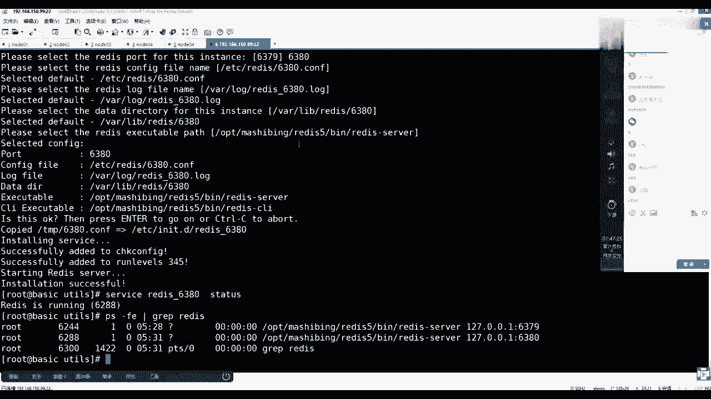
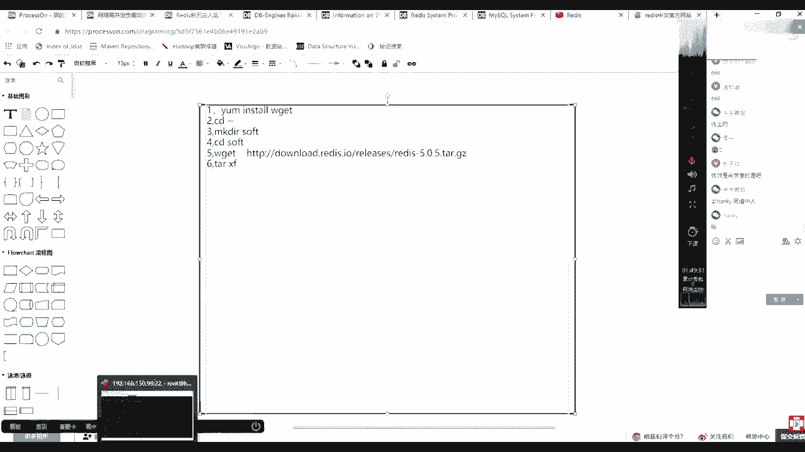
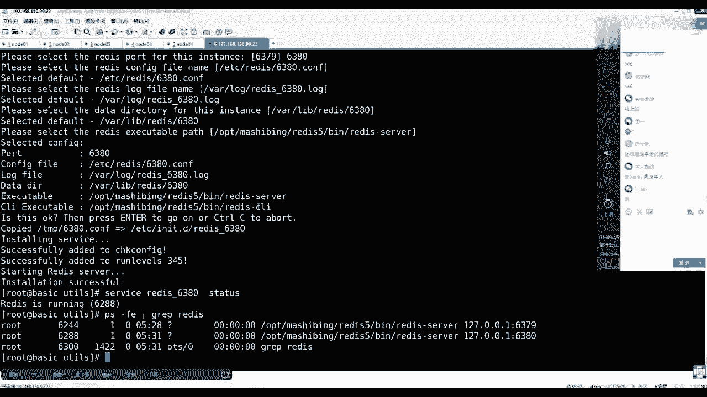
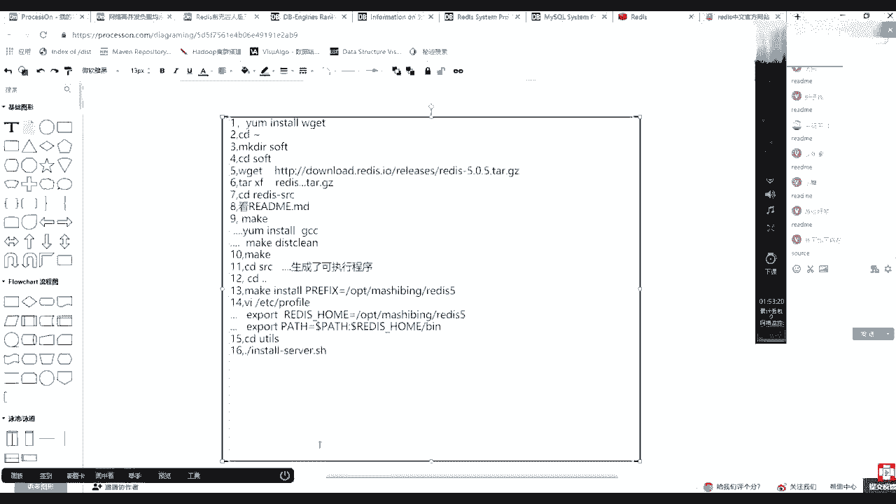
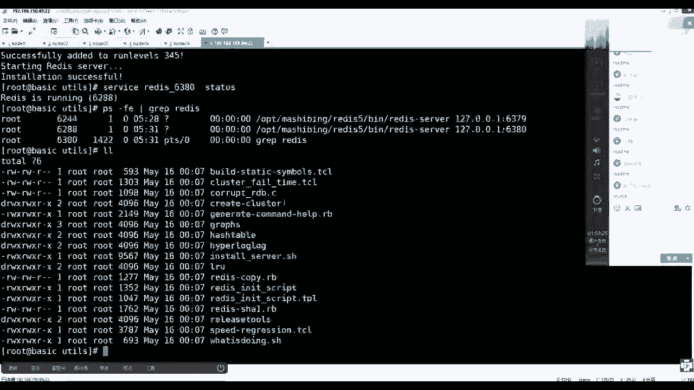
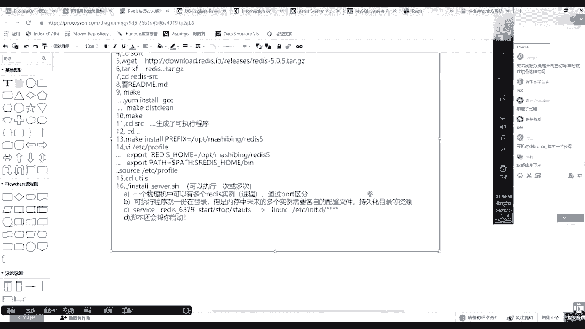
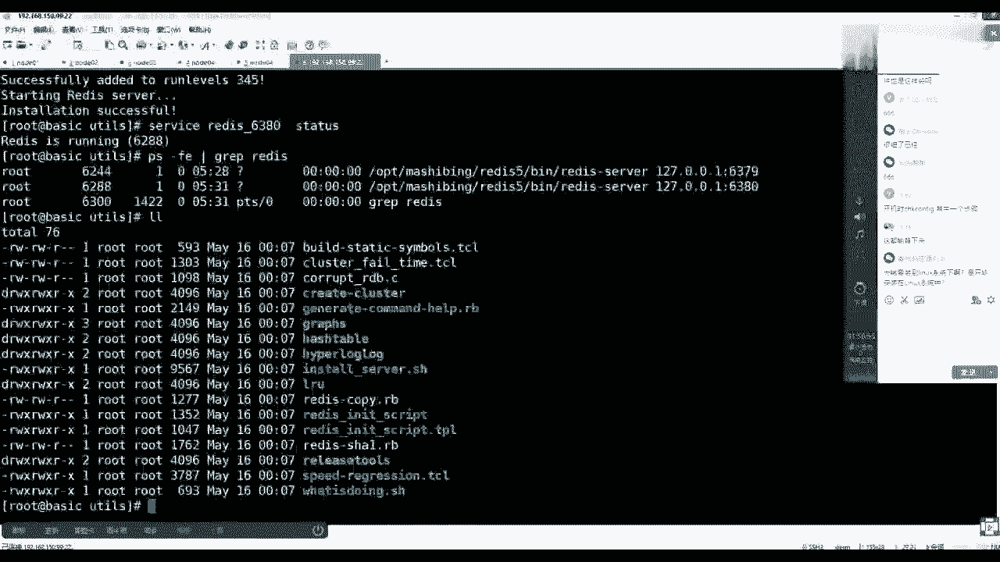
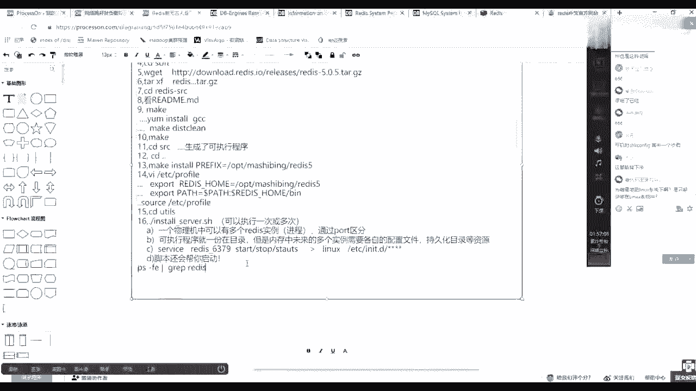
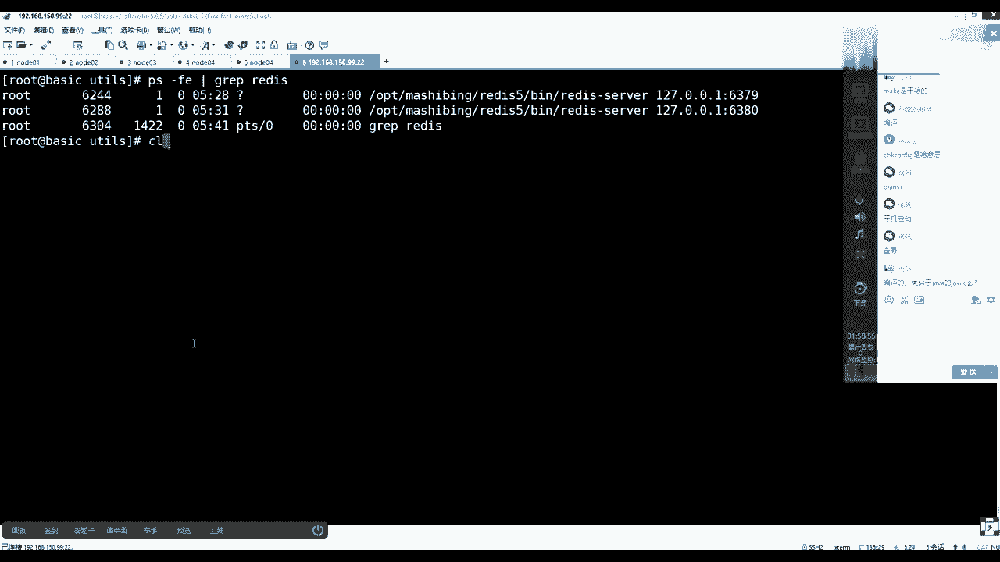

# 系列 5：P89：89、redis安装实操总结 - 马士兵学堂 - BV1E34y1w773

好吧，讲一遍写一遍，做遍笔记，回来趁热打铁，别忘了静静地回忆一遍，安装的流程和步骤是什么，把它背一遍，这样记得更清楚一些，关关说跟其他讲的是不一样，你看过谁的呀，第一步要什么，要准备一件什么事情。

我给你写完整吧，是不是在你系统当中，要么install w get这个命令，优秀有一个版本也是我讲的，懂了吧，但是后面的版本不知道谁讲的了，来先不讨论这个事，咱们接着来啊，接着来，第一步是要装W盖。

有了这个命令之后，你可以下载这个源源码，对不对啊，然后CD到你的家目录，然后呢第三步make dl创建一个salt目录，然后第四步CD到salt目录下，进去之后第五步是w get。

然后那个地址是来自于上面那个地址，我写啊，你得跟着跟着一块回忆好吧，我给你放大点，这个字应该有人看不清楚，这样清楚一点吧，再拉大一点，第六步有了它之后。

然后TXF有人说你为什么不加V，别人是不是写了好长啊，带一个中间对，中间带不带无所谓，是不是要带着V，然后这时候有一个小常识，就是你要明白啊，我们你在公司当中拿的是客户端。

这是一个插上windows的一个东西。

你带着V它解压的过程，所有细节会通过网线回想到你的客户端，会对你台服务器造来造造成一些IO的影响，那网卡是不是得把东西数据包发出来，对不对，所以其实你越搞得深的人，其实更期望什么呀。

IO上规避一下就可以了，所以我把那V我不我不看了，反正要么成功，要么失败，直接就是xx撕毁了，解压这个文件就可以了，没错，到时候归BO，然后把它解压完之后，然后你要C到源码目录，我就用别名了。

你信了他那个源码目录之后，然后第八步很重要，看什么，任何的源码安装都要看什么，没错，你只要把这个学会了，未来你装啥都不怕，你现在可以，今天晚上可以回去之后再装一遍NYX，你读一遍他的read me之后。

你再来，你再来看看它是一个什么流程，对不对，看完之后，然后呢你肯定跟着他的流程走执行，make这个妹子的时候一定缺失一个什么东西，你要安装em install一个GCC，然后肯定是还得去需要什么呀。

Make，清楚一下，会有这么三步缺失，这么几个缺失，就是你肯定先make make，已经产生一些变异的东西了，垃圾了，然后报错了，然后你补全报告诉你缺了缺了cc，然后你就安装GCC。

但那些垃圾已经产生了，然后你如果在这种Mac命令会报错，所以说要先清一下，切完之后，然后第十最终在执行1M，那个执行完之后，你会发现去他的SRC目录下，然后里边儿就已经生成生成什么了，生成了可执行程序。

然后但是我们更期望的是未来把它变成服务化，服务化之后，你需要在这个它的源码目录，这是刚才CD了，CD进去了，你再退回来，看完之后再退回来，退回来之后，然后再执行一个make，然后install。

但是给了一个环境变量覆盖他那个脚本P等于，然后OPT，然后是马士兵，然后REDIS5RI没，你随便给这个目录没有无所谓，他会帮你创建好吧，然后这个时候执行完之后，你去检查那个目录就有了。

然后这时候多做一件事情，VIETC现在profile文件，然后15步啊，这个打开文件之后在里面写什么东西，要export，然后一个redis home等于你刚才那个OPT马士兵，REDIS5没毛病吧。

然后再在下面再写一个，这是pod pass，等于dollar pass，拼上一个dollar redis home，你主要的那个闭幕，可能程序那个位置，然后这步做完之后保存15步，当这件事做完之后。

你可以CD到UTIL目录。

CD它源码的UTIL目录下，然后在这里面16步。

然后触发他当前目录下执行install server点SH，我看见那个中线是中线，是下划线啊，下划线是一个下划线，执行执行的过程当中，有几个东西，有几个知识点，也就是说第一个知识点什么知识点。

一个物理机，一个物理机中可以有，多个REDIS实力就是进程的意思，我做个ready进程，通过part区分，因为他们要通信嘛，通信的时候肯定需要有，各自有各自的那个端口号，然后第二一个。

然后这个程序可执行程序就一份在目录，就上面这个目录下面放着，但是内存，中未来的多个实例需要各自的配置文件持久化，持久化目录，懂资源就是这个流程当中，你要给出不同的端口号，它自动会帮你完成不同目录。

不同配置文件的一个初始，对不对，听力了吧嗯好，刚才少做一个S，搁这加吧，一个SALUCESOURCE，然后ABC的哦，这部你要不做的话，他是发现不了的，然后再到它按照它能跟上吧，是不是这么一个流程。

然后这样完成之后，然后其实最后你会发现，他还给给你做了一件事情，就是一个最基本的一个常识，这个常识就是service，后面接的是REDIS杠6379，然后start stop或者studies。

或者是638063666381，这个东西这个东西会变，对不对，然后他的知识常识来自于LINUX，用的是etc的n it点D下边会有这个脚本，行行星，这样行星这一个脚本。

这个脚本也是通过它来实现给你部署进去的，而且绑定了一个端口号，我就做一个简单的一个笔记了，回去你可以拿着图之后，可以自己在网上写的更细一点，可以吗，同学们，好吧，当执行完之后，然后下一步他还会帮你启动。

脚本还会帮你启动，OK搞定，你可以装这个这个脚本可以执行一次或多次，对他帮你做了check config啊，他帮你做了check config啊。

好啊，你只要按照这个做，就一定能把它装成功，碰着A边线降成一个降细一点好吧。

Ok，那么好放一同来说。

现在我已经装完了啊，对验证这个命令你可以再加一下，你可以做这么一件事情，是P杠FE管道grape，REDIS可以看到是不是会有多个进程，PS杠b grape，然后REDIS是不是两个阶段就跑起来了。

为啥要装到LINUX系统下，是只能安装在LINUX系统中的，不是windows也可以装，问题能装，但是我们基本上服务都是跑在LINUX下的，我不make直接安装GC，然后去make是不是就不用清除了。

如果你直接安装GCC，就不需要做Mac清除，因为你没有Mac，你就不会产生这个垃圾，对不对，脚本是自动做了开机启动吗，是啊，你看下面直言脚本之后，我看到你看读啊，你一定要注意细节，好多。

我带过这么多年的学生了，其实大家都有一个通病，就是你在盯着执行命令之后，你就一闭眼，我看不见看不见看不见，但人家真的说了，人家说了啥了，拷贝这个东西过去了，然后安装服务。

安装服务其实就是在向那个EDZ引擎点低，蒙下拷贝那个脚本，然后并执行了什么呀，这个CONFIG，然后它运行机是345的级别，就是命令行和图形界面都会默认开机启动，然后并且把服务给你start去了。

就等于执行了service redis，6379start，然后比如告诉你诶成功了，所以这时候你直接看这些提示，都能知道他在干什么，make是干啥的，make是一个编译工具，make是编译工具。

make加上make file文件，Mac缺失了Mac文件，但是不知道应该先编译什么，后边什么的，make file文件是你的源码的厂商给你提供出来的，Mac只是个工具。

就跟你那个java c这个命令一样，但是编译下你后边是给出参数的，对不对。

或者NT编译这样的一种工具的，没错，这是类似于JAVC的命令，好吧你这么理解也可以了，但是它不是只面向一类言的啊。

