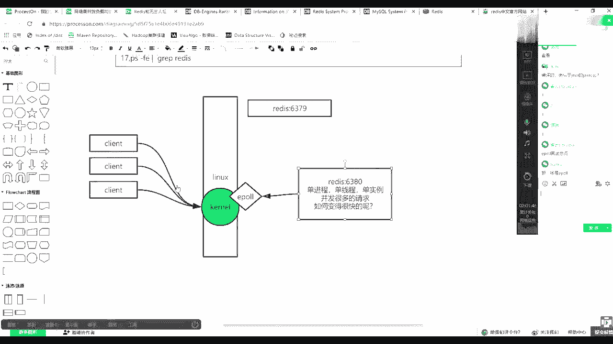

# 系列 5：P91：91、redis原理 - 马士兵学堂 - BV1E34y1w773

画一张图开始。

引出这个这个这个这个思维逻辑了，有些基本之王带领的，比如说我如果有一个物理机，如果有一个物理操作系统LINUX，其实这里面是可以有一个REDIS实力，比他用的就是63796379号。

然后呢在这个句子当中，我是不是还可以有一个6380，对不对，这上面这个知识点就是一个计算机当中，可以有多个进程，多个REDIS进程，然后这是一个上面的知识点，另外一点我告诉你REDIS是单进程单实力的。

把它放大一点，REDIS是单线程，单线程单实力的单，这床单上床按实力就这样，类似这样的一个一个名词，但是这时候这是我告诉你的，就是REDIS他自个儿它并不是一个多线程。

因为我们学JAA他给的多线程对不对，那么re它不是多线程，是单进程的，但是这个时候又根据刚才的描述，他一秒钟可以hold住很多的请求，那么并发到来的时候，并发并发一定是很多的请求，很多的请求。

那么很多球他在单单进程单线程的时候，它是如何变得很快的，如何变得很快的呢，是不是这么一个概念，对不对，那么这时候要注意了，操作系统是不是会有一个内核的概念，Ko，操作系统是有内核的概念的。

那么注意你的所有客户端的连接，如果有一个客户端，你的连接并发一个客户端，可能带来一个链接或者若干个连接，然后所有的连接是先到达哪，先到达你的内核，TCP握手，对不对，你所有的连接是心脏内核。

然后会有很多的所谓的socket，然后这时候其实REDIS进程和内核之间，使用的是EPO，这样的一种多路复用的概念，非阻塞多路复用的这么一个概念，这个E炮是内核提供了一种系统调用。

也就是说其实它是可以用一个进行一个线程，然后通过系统调用来遍历这么多链接，谁有数据我就处理谁。

且它可以满足一个现象，什么现象，他为什么要讲他REDIS为什么快。

REDIS是单进程，是不是用了它一炮了，怕吗不怕，然后所有的客户端发来的数据，因为你内存是不是快的，IO是不是慢的内存，在这等了好多年，数据中心哎，慢慢悠慢慢过了一个。

然后这时候因为有一炮放到这个map区，然后他就直接可以拿那个女服诶，蹲出来，我助理，然后这时候其实间接在它里边，完成了一个什么事情，因为使用的易爆，使用了单进程，它间接有一个这个所有的数据到达来。

是有顺序的，但是这个顺序是加引号的，这个顺序的，真正的事物顺序是由你那边的负载来做的，但是这里面顺序强调什么呀，我会一笔一笔的处理，挨个挨个的处理，因为它是单进程，它不是多进程，不是多线程。

他并不是说这里面他还爆了，太糟了，然后我一个线程处理它，一个线程处理他两个同时进行，那么这样的话有可能两个人都对某一个K，一个一个删除一个创建就撞车了，你得加锁，但是这时候因为我是单进程的。

所以你俩一个删一个，一个删除一个创建或者一个修改，你们俩一定是虽然你可能一块到达，有可能一块到达，但是进了网卡之后，一定排着队挨个来的，因为我肯定是便利的，泥头里面那个文件描述符。

那个列表我肯定是按照顺序取的。

无非就是先取到谁了，那么这时候其实是由你前端前面，再往前一格去控制，如果你想保证事物的话，对于同一个K的增删改查，你要负责让让一个线程一个链接发出来，而不能负载多个，跟你使用卡卡一样，卡夫卡。

其实我可以客户端打很多数据，打到一个topic的很多分区里，但是如果创建删除同一个同一个资源的，我要打到一个topic的一个分区里，而不能让他做其他分区的这种行。

这块跟哪个知识其实也很像，跟你NX知识也可以挂钩，index他要求怎么怎么启动index，index要满足什么呀，多少颗CPU启动多少个进程，就是worker进程，w o r k worker进程。

一个worker进程，是不是，就可以把他的数据压到CPU的123级缓存了，然后你有多少个CPU，就有多少个index进程，每个每个work进程它使用的是什么呀。

多路复用IO，之前是不是也看到ex介绍使用了LINUX1炮了吧，其实更主要的是什么呀，EPOEPO不知道不要紧，是同步非阻塞，然后鸡翅虾的一种什么多路复用，只有windows才有AIOLINUX。

