# 系列 6：P104：如何在双十一大促中提升分布式锁性能 - 马士兵学堂 - BV1RY4y1Q7DL

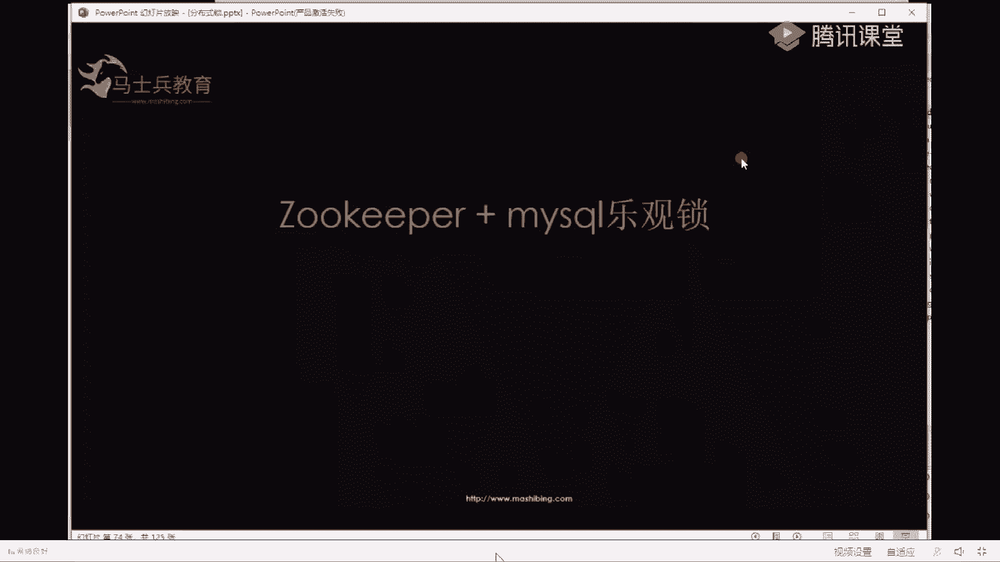

诶y。就是如keeper加mysl的乐光锁。再讲一遍可以吗？可以。再讲一遍啊。最后一遍啊ZK。一号县城。来拿锁拿一号节点。然后呢，把一号节点存在数据库里，数据库有个字段叫一。然后呢。

stop the word之后。他不续期了，然后一号节点没了，然后2号线程进来，他拿了一个节点是2，然后他去把这个数据库这行记录改成2，说明他拿到锁了。然后呢，这边star the word之后。

他要去执行往下执行业务的时候呢，我们都加一个判断where条件where啊version是不是等于我这边加的。第一个节点，一号节点。如果是，那么说明是我的锁正常执行。如果不是，说明有别人来执行，我就。

退出。懂了吧？sweet有点甜。我觉得我说的很清楚了。呃，reis加UUID是不是也能也能解决锁得这个问题？呃，如果你用redis加UUUID的话，你只你那个key，你看啊。

我们用为什么用ZK是因为ZK的这个节点，它有序号。你用reis的 key的话，你仔细想一下key里面的value只是UUID你用UUID能解决它的key，它的key会有序号吗？你仔细思考，你慢慢知乐。

你慢慢的品这个问题，它的key没有序号，你把reis的什么东西存到数据库里。😡，开始执行产生的问题更能讲一遍吗？我要上头条ss word又之后 store什么意思啊，没懂。好了。

这块问题老师说清楚的同学敲个一。就说面试的时候，如果你能达到这个地步，那么你已经你已经。已经很很厉害了，但是是。为什么stop会引起所失效后？那个神雕侠侣stop之后，他也不续期了，就是说他也不去续期。

所以所会失效。好啦。😊，比如说ZK和数据库没有reies效率高吧，是没有reies效率高。就是说呃。😊，效率和数据的正确性方面，你要做平衡。就你在公司设计架构的时候，这块你要你要做平衡。懂吗？

对show word引起com门狗不续期。好了，我说一下实际工作中怎么用啊，实际工作中其实这块的用法呢，好多公司就用一台reis做的。这个你们就用一台relish，也没有做主从，也没有做红锁够。

包括某个大公司。他的某个挺大的业务，每天的交易交易额差不多上亿的业务，他也用一台reis做。啊，说为什么用一台，人家就觉得这一台reice它能保证不挂。😡，知道不？😡，人家就能保证不挂。

所以就用一台是吧？他的队友很厉害，我相信队友。其实好多公司啊，你别看今天我解的我今天我讲的方案特别全，但是好多公司呢你没必要用这么多方案，你就选一个readit book。为什么就怎么怎么做这件事呢？

你比如说你这是你公司。😊，你买个阿里云的res。如果rey挂了是吧？那是阿里云挂，那是阿里云的事。我们公司的业务正常，只不过是阿里云挂了。你别别以为我是在开玩笑。😡，不要以为我是在开玩笑。

好多公司都这么干，包括好多独角兽公司，我就不说名字了，特别特别多，因为这么干都能上头条。嗯。对，那个不说不那个收啊，为什么为什么说这件事呢？😡，就是在2019年3月份的时候。

有好多公司运维大半夜三四点去公司加班，这个事情你们知道吗？但家都上头条了。第二天早上一醒来，新闻上全是这件事儿，好多运维，好多独角兽公司的运维去知道是吧？你看有的有的人知教知道这么一件事是吧？

说明2019年是吧？这个人知道叫什么包着你包着你，说明你2019年你出生了是吧？

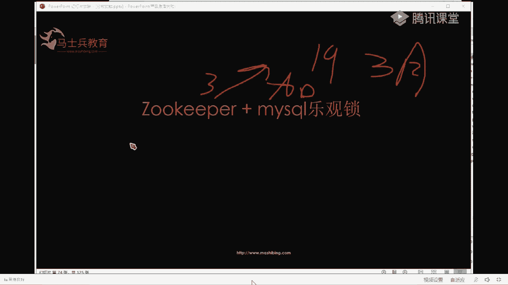

知道是吧？你看好多人都知道你也去加哎小宋，你也去加班了，是吗？😊。

这个这个当时应该在当时轰动挺大的啊。呃，从从那个事说明什么事呢？好多人用阿里云的就全部依赖阿里云，就自己都不做plan B。自己都没有plan币，知道吧？一些独角兽是吧，估值过百亿的公司都这么干。

你是吧？你在小公司有什么理由不可这么干呢？所以。无所谓了。可以吧，实际生产中怎么怎么简单，怎么方便，怎么搞。知道吧？没必要考虑特别全。是吧马老师说过，马世斌老师说过，追求完美是一种人格缺陷，是吧？

所以在工在工作中啊没必要用这么多。今天跟你说这么多呢，是为了让你去。是吧跟面试官怼的是吧？面试如果你能回答到这儿，OK这个问题你你无敌了。😊，主要是没钱找牛人，我记得是腾讯云出问题以后，工司都倒闭了。

我跟你说，哎呀，你看你这个你这个同学遇到的这个问题，我原来也遇到过，我跟你说，原来我不是黑哪家公司啊，就是只能说他们最开始哦就是慢慢就是所有的人都有所有的公司其实都有个眼进的过程。

就你像阿里最开始做淘宝的时候，2003年的时候，淘宝不也就台。

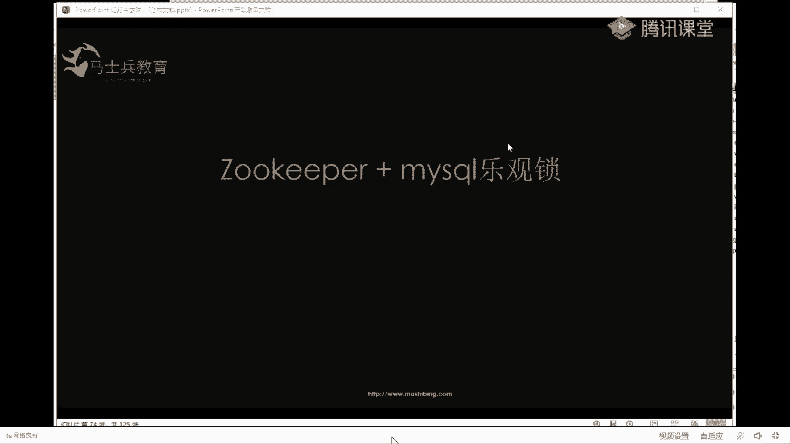

你你拿linux做了一个程序，前面加了个NG，然后后面两台服务器，然后后面一个主买Crcle做了一台从，不就这么搞起来的吗？你知道吧？所以就是最开始也是这么搞。

你说如果是这个架构到现在他能扛的这么扛不住，他也是1。1点发展起来的。最开始我们用腾讯云的时候，呃，最在2015年我用腾讯云的时候，有一件事，就是那天也是也是一个夜深人静的晚上。

结果发现呃我们的服务挂了。😊，服务挂了之后，我我就去看嘛，看服务，结果发现磁盘的数据全没了，然后给腾讯打电话，腾讯说。那个宿主机的硬盘坏了。是吧然后给我们免了免了免了送了我们一年的腾讯云的服务器。

是吧这个事儿就算过去了。知道吧？所起。Nin。刚才那个是吧，你说你出问题，我你你这还倒闭了是吧？腾腾讯员出问题，你公司还倒闭了，我我们这没倒闭，还好。😊。

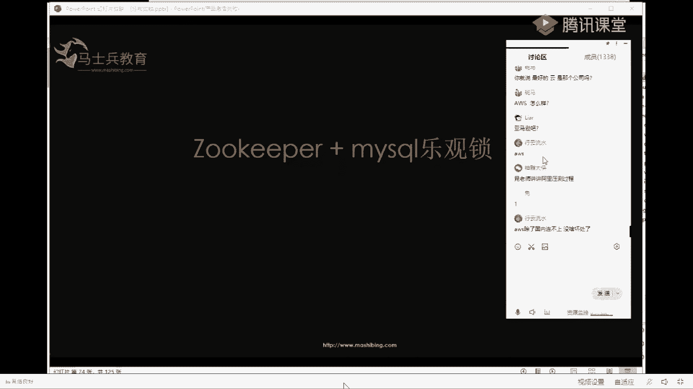

好啦，今天说的这个就今天给大家讲的这段课，呃，这些课呢简单总结一下啊，就是说从一个呃最开始的一台服务器。😊，然后呢，到多台服务器，就一台服务器加锁很简单，多台服务器加锁呢就用分布式锁。

然后分布式锁一点小小一点的项目，你可以用mycircle，然后大一点的你用redisreis呢我们讲了从单节点的redies到主从redis，然后最后到红锁是吧？

然后红锁给大家讲了红锁的方案就里面的延迟启动呀，由于GMJM的fo这些导致stop word，我也给大家讲了，然后stop word怎么解决呢？要么换GM要么换reis是吧？

然后我们选择换掉redis用ZK。😊，然后用ZK之后呢，再加上买s口的乐光锁，就把这件事给搞定了。这就是这节课关于这个基数点的所有的问题，你大家。怎么样？有收获吗？有收获的敲个一敲个一。

我们我们聊聊一点别的，再可以聊聊其他的。好了，这个这个课呢我记得从头到尾都给大家讲清楚了。好了。就是这个课是我们众多课程里面的那么一点点，老师花上20分钟给大家介绍一下我们的课程。好吧，介绍我们的课程。

我们再聊怎么面试O。就是今天讲的这个锁呢是是我们在呃我我讲的一个课，是在我们的网约车，就我们有个项目叫网约车项目。就是我刚才在前面给大家演示的这个。

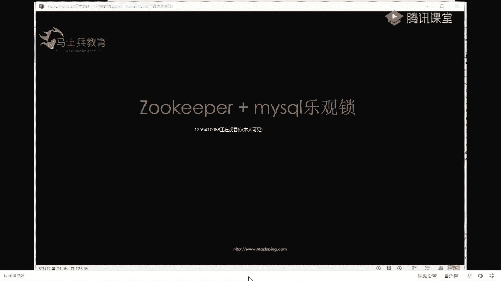

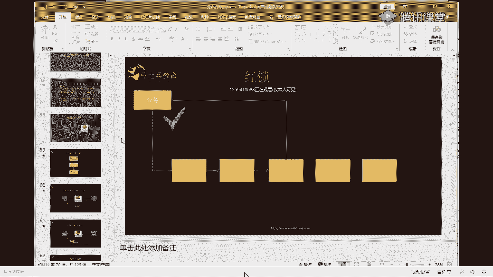

就这个这个项目。这就这这是一个实际中运上线运营的项目。我我呢就在课程的课程里面带的是这个项目，就这个项目的解决方案里面呢，就有红锁这么一个就有分布式锁这么一个东西。

然后这个东西就是我今天给大家聊了有一个半小时。但是我在我们的课上呢讲了差不多有4到6个小时，就是关于分布日锁这一块。然后除了分布日锁，就是这个项目里面，它还有分布式事务。

还有怎么提升你的QPS怎么减少你的响应时间。大家可稍等一下，我打开课程大课程大纲给大家看一眼。就在这个这个项目中，就是项目怎么启动人员怎么分配，接口怎么设计等等等等。所有所有所有的。

你在实际中能遇到的问题呢，都在项目里讲，包括什么灰度发布呀、狼力发布呀、滚动发布呀、分布式事物呀，然后还有动态路由等等等等。就你在工程中能遇到的所有的问题，我们这个课里都有稍等一下啊，你看这个。

课程内容比较多，插慢的打开都比较慢。因为我这机器配置已经非常非常高了，减少QPS是提升QPS减少响应时间。ZMTD这个这个同学。我再回答你的问题啊。是提升QPS。减少响应时间，缩小一下。

这是我们MC架构师的呃，这这个是。我们MC架构师的课，这叫这个MC什么呀？马士斌cerfactor architecture叫马士兵认证的架构师。

然后我跟才说的这些内容呢是我们这个项目里面的网约网约车项目。然后我们现在叫飞机出行。然后呢，这里面从项目怎么启动？人员怎么安排，需求怎么分析，然后怎么设计，就是设计的一些原则，你该注意什么。

这个项目里面都有，然后服务怎么拆分，就是说还有接口怎么设计，你怎么保证你的接口的安全？还有中台就是怎么怎么做中台这个项目里面都有。然后异常的包装异常怎么处理，然后呢，就是怎么提升QPS。

怎么减少响应的时间是吧？就是刚才我跟大家提到过的啊，然后还有业务，就是整个项目的业务是怎么做的？我都给大家把主要的业务的时序，就接口交互的时序图给大家画出来。然后还有后就是就是后面因为我这是网约车嘛。

就是司机跟乘客他们之间要进行交互。嗯。我可以给大家演示一个例子吧，我直接跑代码吧，可以吗？大家有有没有想想想我我跑跑代码吧，好不好？😡，给你跑一下网源上的代码就OK了。😊，这个。很快，等一下啊。

给你跑一下。启动。然后呢，我拿俩浏览器给大家看看。嗯。看一下网约车什么样子的是吧？然后这是一这这这个是一个浏览器啊，这代表乘客端。😊，这个代表时机短。乘客司机。好吧，这是两个端。把它摆好啊。

这代表两个手机啊。😊，好了。😊，然后呢，输入一个乘客的地址。好了，这是乘客打开的一个界面，是不是特别很像那个德德。😊，把它缩小一下啊，大家看不见下面的好吧，缩小了。然后呢，司机也缩小一下，把司机也打开。

司机。系啦。😊，好了，就是司机你要打车之前，司机得先上线是吧？司机开始工作出车是吧？然后乘客呢选地址，我们在这个选一个地方，川荣府鸡蛋灌美吗，还是选哪？呃，学院餐厅邮电邮大邮电大学的吧。好了。

我们从这是吧，这是我们隔壁啊，定位定到我们我们在文教园是吧，点呼叫。😊，哎，你看从文教园到。邮邮电大学接单司机接单了是吧？然后司机开着车去去到达预定地点，然后呢，接到乘客，然后就拉着乘客走嘛，是吧？

乘两边一个车在跑呜呜呜，然后是吧，到达那个目的地。😊。

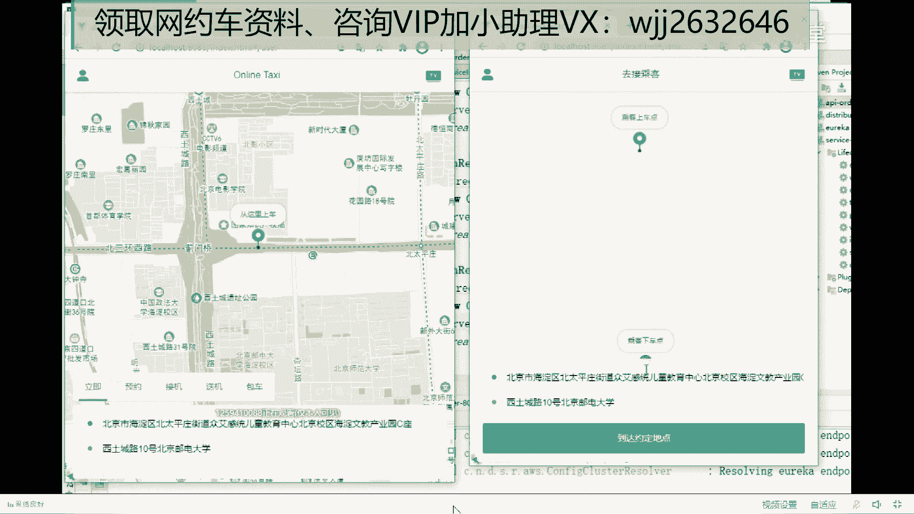

到达目的地之后是吧？然后22块钱你给吧，然后司机发你收款，乘客调取微信或者支付宝的SDK已付款。好了，司机收款成功OK。😊。

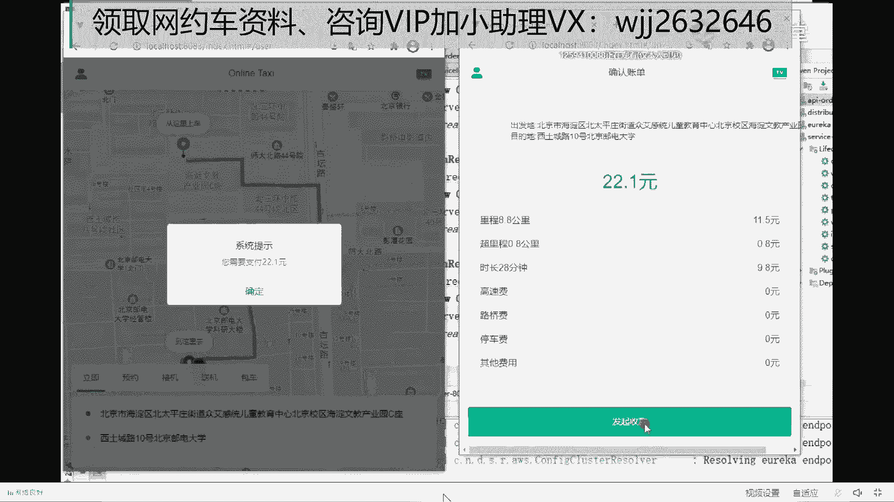

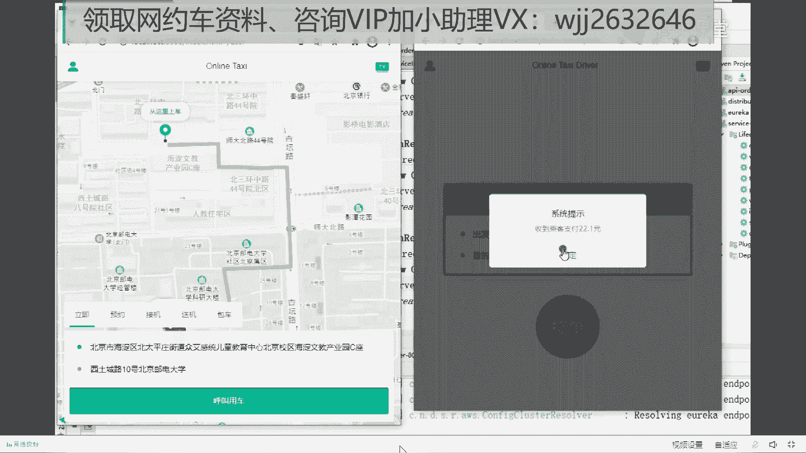

over。是吧这就是网源上的整个业务。好了，我把这块先先停了啊，我让车系统先停了。😊，牛是吧，应该是不是得刷刷一波鲜花？是吧这就是我我在那个我们课上实际讲的一个项目。然后这个项目有什么好处呢？就是。😊。

我原来有好多学生，他一直做的是那种传统的项目，甚至他没有工作经验，然后拿着我的网约车项目，他就可以就原来找工作特别不好找，是因为项目不行，公司不行，做外包的，然后一直做传统项目做CRUD的。

没有经历过微服务高并发项目的，拿着这个项目找到的工作，还有一些应届生，应届生大学毕业，你想想，他就压根没做过项目，去公司面试是拿不到高的薪水的。但是我们这我有一个学生，他学我们的他学我们的项目。

学完之后直接拿了一个应届毕业生，大学本科拿了个22K的。薪水。我给你看一下啊，这是我在我的。微信里。嗯，这个这个孩子叫许。好了，我给你看一下他我们我和他的聊天。😊，好了，没有露出隐私吧。好了好了好了。

你看一下这是一个应届生。😊，他学项目怎么学？他。好啦，你看啊。😊，这是这是问派单派单的业务逻辑，他问了好多，你看还列12怎么问怎么问怎么问，然后我又给他回答，然后呢，又问这个怎么怎么，我又给他回答。

然后又问这个不停的问怎么回答，他为什么不停的问，因为他是。😡，他是一个应届生，压根没做过业务。你看12月9号，你看一直问，然后一直回12月10号，你看项目有啥亮点，我又给他回，然后呢。

什么优注册中心优化怎么做，我又给他回。然后一其他的一些困难又怎么回。然后再麻烦老师再麻烦问几个问题吗？项目的盈利点是什么？定制化的人怎么计中计价中算法是怎么样的，等等等等等等。我又给他回。😊。

12月10号回回回又问你看又这个不明白，定制化服务不明白，怎么着，我又给他回懂了，谢谢老师。然后又是计价的时候一。😊，11号又开始问怎么回怎么回怎么回。老师，我想问问当时服务器数量多少呀？😊。

为什么他这么问，因为他就压根儿没做过项目，然后我给他回，他说啊，好了好了，他说并发量多少啊，司机数量多少啊，又开始问又怎么回。然后最后说感谢你看27号了，都从12月初到12月底，感谢老师这段时间的解答。

这周找到工作了。😊，开了21K，我这厉害。是吧说老师指导的好，主要是他他问的东西啊，也真的是他自己就是花心思去琢磨。然后呢，就是我也能给他就是把他那个他不知道的点给他说清楚，他没做过项目，让他理解的。

实际中项目是怎么做的，然后里面会遇到一些什么样的坑，然后给他说，然后我就问他原来薪水多少。他说今年刚毕业。包装了一下才有这么高。这是这哪年2020年的12月27号，他是2020年的7月份毕业的。

当时毕业之后找不到工作，然后报了我们的课程，报了我们课程之后，学了5个月差不多，然后呢就拿了21K。你说他值不值？一个大学毕业生。太能吹了，我这这是吹了吗？我这是事实。你好啊。后面还有一个。

当时我上上课的时候。上课的时候呢。那个有一个还有一个小孩知道也这个小孩也是个应届生，然后他说跟这哥们交流交流，我说可以，你们都是VIP是吧？我说有个同学想有个同学想找你取取经，你方便和他聊聊吗？他说没。

等下班了，直实他说他很菜是吧？还谦虚一下，我说没问题。然后你看他下班了还告诉我老下班了，老师微信聊了吗？后来我就直接给他拉了群，就就OK了。😊，这样过不了实习期，在你们在你们平安。呃，为什么？

首先说明一点啊，为什么过不了为什么过不了实习期？是因为实际中的问题你解决不了。你想想这个问题是不是？如果说有那么一群老师在你的实习期在给你保驾护航呢，是吧？有什么问题来问问老师。

是吧老师该老师我该怎么做这个方案该怎么做？我遇到什么问题了，该怎么解决？一堆的老师，220多个老师。😊，从前到后有微服务的，有中间件的，有有源码的，有java基础的，有云原生的，有测试的等等等等。

一堆老师。都可以回答你的问题。你还过不了实习期吗？如果如果是试用期吗，你如果如果你说再再再过不了，那真的没办法了。一群人在后面顶着你20多个全是大厂下来的老师。😡，应届生凭啥过不去实习期，社长有可能。

首先不是我是回答那个同学的问题嘛。首先啊就是他学了我们的课，就是我这个项目里面我这个项目里面讲的这些东西，如果都学了，都不用说过实习期了。😡，就就算你直接去上手开发一个微服务项目都没问题。

你看我当时讲那个分布式事务都讲了20个小时，就你把我这些课全听完，你就像我今天讲的这个分布日所一样，你把你今天你把我今天的这个课学了，你觉得你在你工作中，就是遇到分遇到分布日所的问题，你解决不了吗？

然后我还给你全套的代码，还给你全套的代码，代码都给你。然后我这代码写的呢，又直接让你能套你的业务，你怎么套你的业务点开。😡，点开这个service，就是你公司自己的业务。点进去就你的业务逻辑。

外面我都给你全给你分装好了，你直接拿到公司就能用，脑子都不用动。😡。

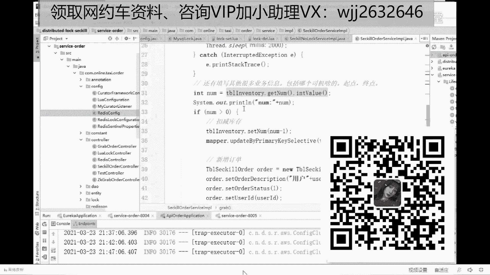

开发都是CRUD。太多了，什么时候学完？我们的课程确实挺多的，你。首先给你说一下，我们今天的这个课。刚才大哥只看了一点点啊，我们课里有什么包含哪些内容？

我们这门就是MC课程里呢有P5就业班P6崭新课、P7架构班、P8精行课，还有源马课、云原生服务网格等等这些课一堆的课都在MC里。如果你要单买的话，每一门都在79010多项目实战我讲的16000是吧？

还是最贵的课。然后呢。

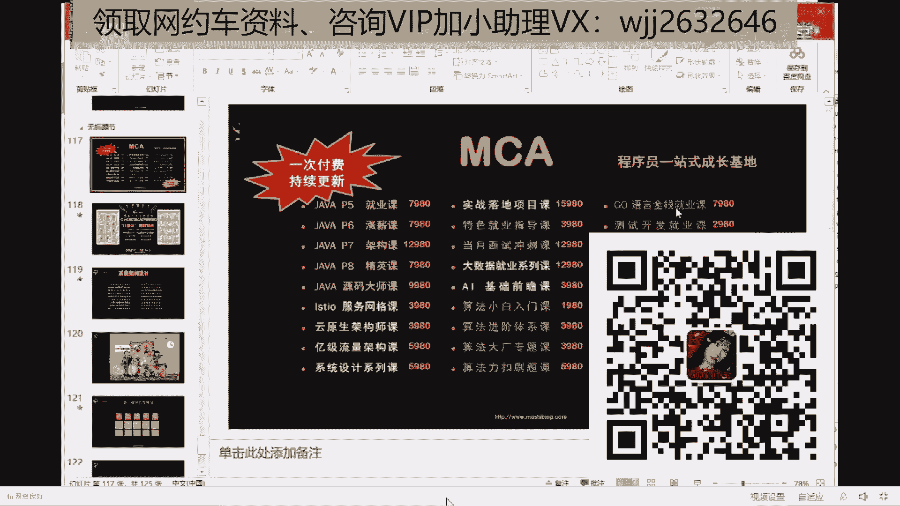

MC里全包括这些。然后今天呢今天有一个活动。

今天的活动原价是。23980，这是腾讯课堂的啊，这是腾讯课堂的原价23980，在直播间优惠20个名额，13980。

