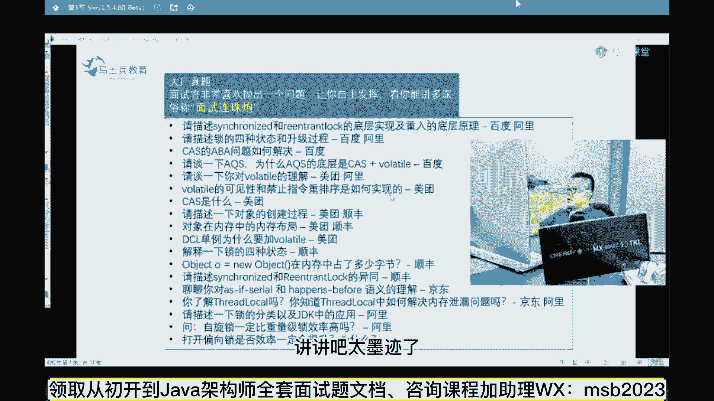
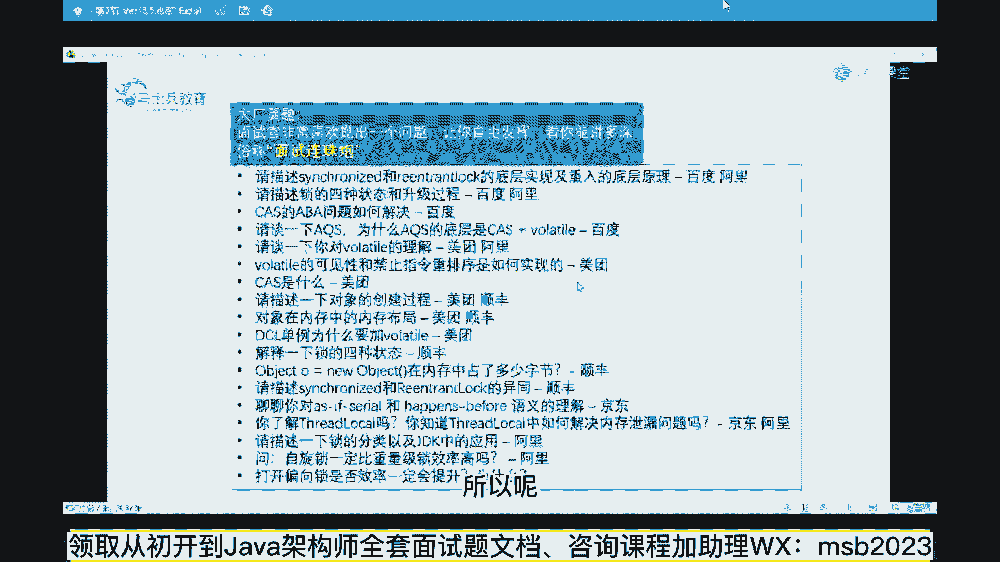
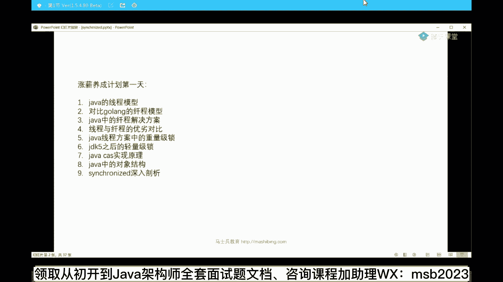
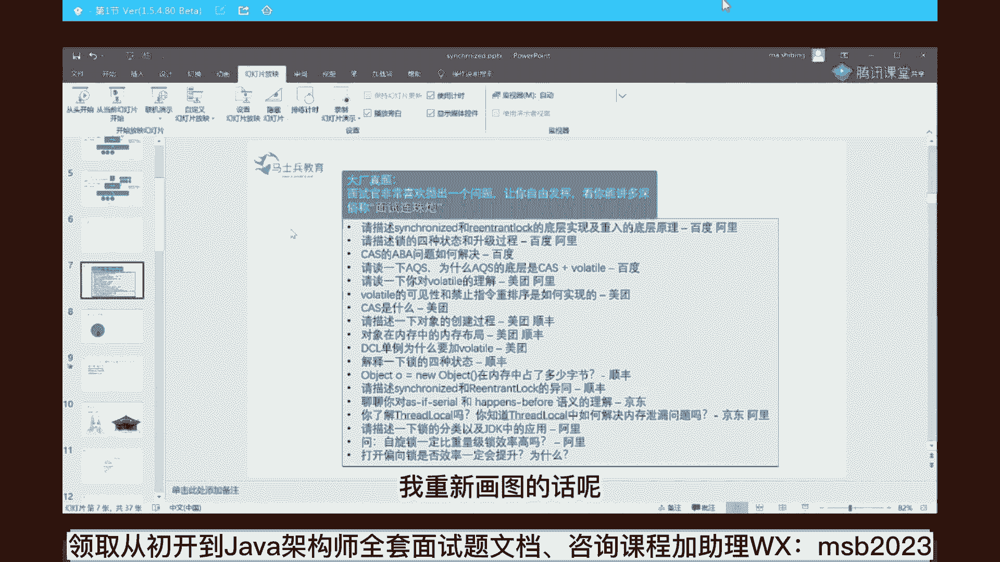
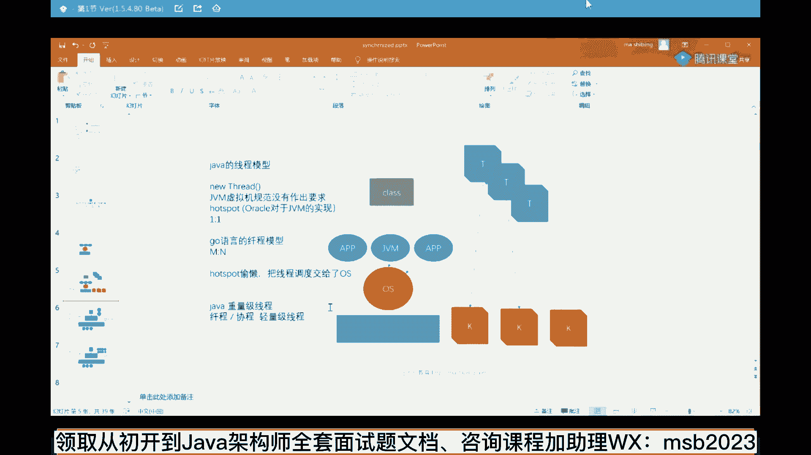
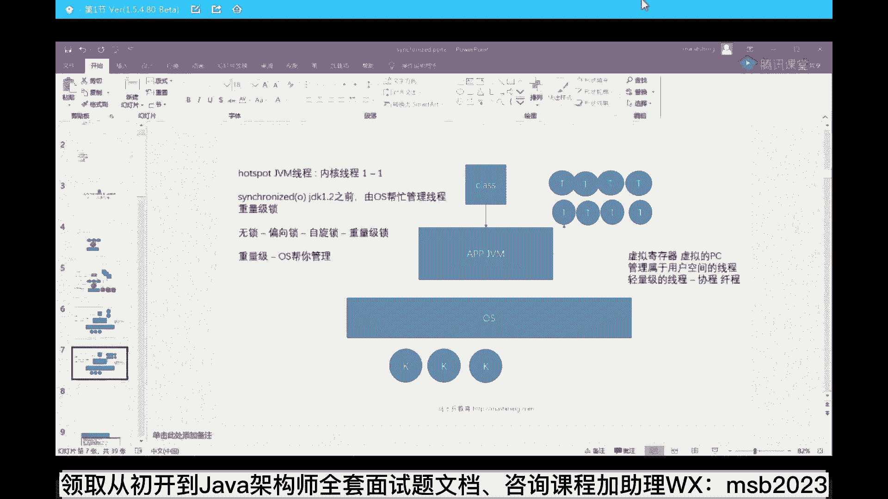
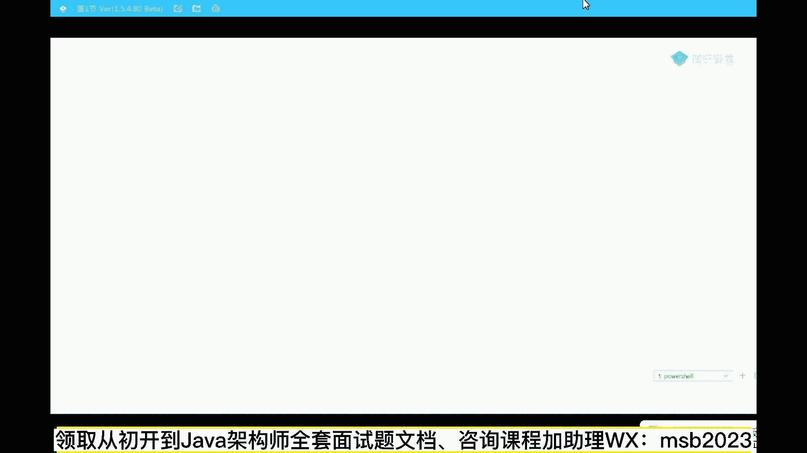
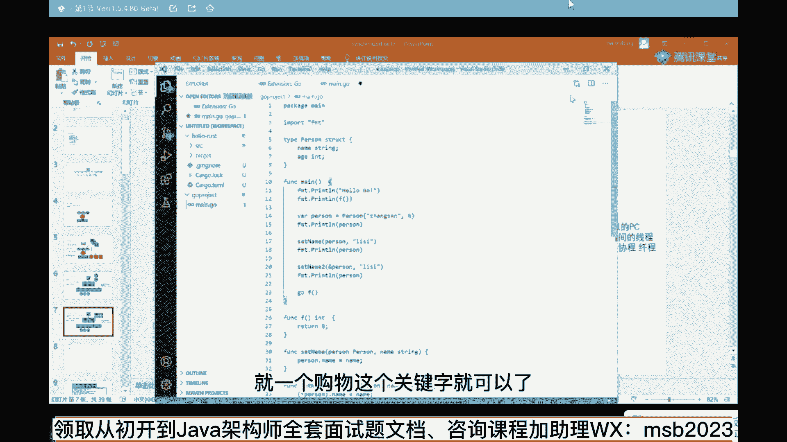
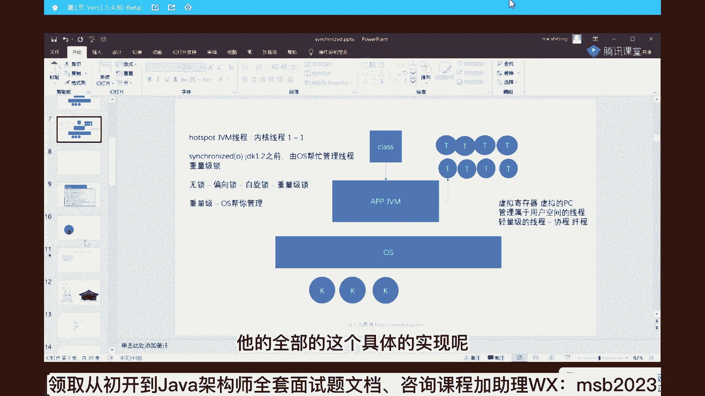

# 系列 6：P11：Java线程模型 - 马士兵学堂 - BV1RY4y1Q7DL

在这里讲的一些个内容呢，感觉都比较深入一些，大家凑合听啊，能听懂多少是多少，你也感受一下，现在大厂的问的都是哪方面的东西，其实凡事你只要能够打好的话，现在涨个薪水什么的，那跟玩一样，给大家15秒钟。

你扫一下这些题，尤其是没有呃读过的那些同学，对于底层，对于锁，对于多线程不是很了解的，读一下，这是19年到20年一线大厂的，他们的关于多线程和锁这方面的面试题，黄老师还在吗啊，黄老师，黄老师还健在。

怎么了，他才25岁，正常的情况下，52度都会在，lucifer，这个和b站一样，这个和b站不一样，好多陌生词汇是吧，steam，25怎么了，25不行吗，25也可以有牛人的，周志磊，周老师什么背景。

他是原来民生银行的架构师嗯，我25的时候还是个废物，如果不学的话，52也是个废物，讲讲吧，太磨叽了就不讲了。

使劲儿磨叽，聊会天嘛，讲着玩嘛，不要天天讲技术，我现在把技术都讲的，我自己都快讲吐了，如何才能当架构师，嗯需要有一系列的努力路径才可以啊，不废话了啊，我们开始讲今天的内容，看都有人着急了。

开始给我带节奏了，好看这里啊，不开玩笑了啊，呃我花两天呢给大家讲一些，现在面试之中问的非常多的这一类的问题，由于它牵扯到很底层的内容，牵扯到很基础的内容，所以呢我想从基础和底层来给大家讲起。

首先呢在这呢我先给大家解释一些基础的概念，如果这些概念你不理解的话，估计大厂的面试就跟你说拜拜了，看这里。

嗯我重新画图吧，我重新画图的话呢。

大家会看的更清楚，拿手工给你画一下，好看这里啊，我我呢首先给大家解释一个最基本的概念，这个概念呢叫用户态和内核态，关于这个概念，那个不清楚的同学给老师扣个二，我看有没有必要讲多少好吧，嗯好大家看这里啊。

这个呃如果把这件事要讲清楚的话，实际上得从那个操作系统的历史开始讲起，呃，我玩操作系统呢当然玩的比较多，因为我的年龄比较大了嘛，最早的操作系统我是玩过那个os two。

然后最早那个苹果机的making top，那些个操作系统，当然大家比较熟悉的应该是dos操作系统，不知道有没有同学玩过，当然还有win 31文九五啊，文文文文2000，win 7 win 8。

win 9 win 10，各个各个操作系统呢，以前的操作系统有这么一个特点，什么特点呢，就是一个是应用程序，能够直接把操作系统给干掉，啥意思，如果我们从专业一点的角度来说，相当于什么呢。

相当于这是我的操作系统程序，然后呢，这是我的应用程序，然后这个操作系统的程序和我们的应用程序，它们两个是同权的，什么叫同权的，就是我也可以访问同一块内存，你也可以访问同一块内存。

那我这个程序要是不怀好意的话，我就能直接把你操作系统内存给你给你干掉，把里面的值给你改了，还有一种呢是我也可以控制硬件，我的我的应用程序也可以直接控制硬件，那我把某个硬件呢给你干掉。

把格式硬盘给你格式化了等等，总而言之，那个时候呢，应用程序和操作系统这两个软件没有区分开来，所以就会诞生，经常的操作系统运行运行某个程序就死机了，就蓝屏了，这块大家能不能能不能够理解这个，理解到这一点。

大家伙都比较年轻嘛，没有经历过那个时代，但是你能够想象得到吗，唉能应该能想到现在呢，作为一个应用程序来说，很少能把操作系统给直接干死，原因是什么呀，原因是他们做了一个分权处理，分权处理的意思是。

把这哥们儿的权重等级给提高了，这个操作系统能干的事，好多应用程序是不能直接干的，比方说什么事呢，直接跟硬件打交道，去接收网络的数据，去访问，直接访问内存，比如比如说跟那个键盘，跟显示器等等打交道。

这些操心都能干，应用程序干不了，那有同学会说，我应用程序写的程序也可以控制你，你那个显示器上显示什么呀，我也可以读网络数据啊，那这时候怎么做的呢，这个时候由于它的权重降低了，就变成这样子了。

app啊是跑在可以认为是跑在操作系统的外围的，需要和硬件打交道的部分，都是要经过操作系统的帮忙才可以有一老大啊，这就是你们的老大，你写的应用程序都需要调用操作系统，对外所提供的那些个库函数，系统函数。

你得需要通过操作系统提供的，这些个核心的功能，你才能完成自己想要的一些操作，所以我们可以简单说，操作系统是工作在内核态，而应用程序是工作在用户态，这样的话，我操作系统能管理的东西就会比较的底层和直，接。

不让不让我们的应用程序直接去干掉，我们那些个硬件，从这个角度来讲，我们操作系统就会更加的安全，所以现在的操作系统很少有应用程序，直接能把它给干掉，给卡死掉的，来，能get到这点，同学老师扣一。

那有同学说老师这跟高并发有半毛钱关系吗，这是高并发的底层的核心，大家知道作为java来说，我们我们讲清楚是第一个问题之后，我们来讲第二个问题，第二个问题是什么呢，第二个问题是看这里。

第二个问题是java的，线程模型，有同学说老师这个java线程模型，那还有什么特殊的吗，不就是有一个thread吗对吧，或者是new一个rnable，再new一个thread。

或者new一个colorable，再new一个thread，无论如何不都是要new一个thread吗，这东西有有还有什么模型吗，有它的模型在于哪里呢，在于是作为java来说，同学们，你们想一下。

它是用来运行class文件的一个虚拟机吗，而我们的jav程序对于操作系统来说，它就是一个普通的应用程序，站在操作系统角度，你jvm和你的qq啊，和你的office啊，没有人没有半毛钱区别。

都是运营在我用户态的这样的一些个应用程序，那现在这个问题又来了，作为这个class里面，它能够启动好多好多的java的线程，这个大家应该知道，嗯随便画个图吧，来简单说啊，用这个来表示线程。

这是java里面的一个线程，一个thread，第二个第三个作为一个java整理来说，它可以启动好多个线程，那现在的问题是，这些个线程在操作系统的这个级别，它到底是怎么运行的，这就是java的线程模型。

它的一个底层机制好听我说作为这个东西，jvm虚拟机规范并没有做出任何要求，这标题拟机的规范呢并没有做出任何要求，他什么意思呢，就是说你这个一个线程在这，你扎到里面的jvm级别的这种线程。

这是jvm级别的线程，好作为这种线程来说，它在操作系统的级别底层到底怎么来实现，它并没有做出具体的要求，那么hosport是怎么实现的呢，这几个名词都不用我解释了，什么叫jy m虚拟机。

什么叫hosport，应该是不需要我解释的，对不对，那可以继续的给老师扣个一，这不是不是，这不是内存模型啊，这是线程模型，hosport是java虚拟机的一种具体的实现。

目前也是应用最广泛的是oracle公司的实现，hot sport是啥，jvm虚拟机的一种具体实现，oracle对于jm实现好，你们练到这种程度的，下次就别问问题了，好好安安静静的听就行了，你们不开口。

没人知道你们好看，这里，作为jpm来说，一个线程启动的时候对应的是什么呢，对应的是操作系统级别，也有它的内核线程，操作系统呢有它自己级别的内核线程，就是操作系统底层要实现的时候。

管理的是一系列的内核线程，这线程呢我们简单简单称之为k，这是操作系统级别的建筑，好好好听，我说目前java虚拟机的实现也就是hot sport的实现，它是怎么实现的呢，这个时间叫做一比一。

就是一个内核线程对应一个操作系统，对应一个虚拟机级别的线程，好久不一一画这箭头了，大家理解什么意思就行了，目前它的实现是一个一比一的关系，有同学说老师难道还有除了这个东西之外，还有别的对应关系吗。

有go语言的是什么，有多少同学知道go语言的，go语言的线程模型是什么，当然它的线程不叫线程，叫什么叫线程对吧，腾讯的面试县城和县县城的最准的区别，我一会给大家讲几道腾讯的面试题，它也比较好玩。

go语言的编程模型它是什么一个实现呢，注意它和具体的操作系统内核的线程，它是一个m比n的关系，当然还有其他虚拟机的实现，还有其他虚拟机实现什么，就是我的用户的虚拟机级别的线程。

对应的可能是底层的一个线程，m比一的关系，n比一的关系也是有可能的，当然也没有那种111比n的关系，这个很少，作为java来说，他就偷了个懒，为什么说go语言叫天生支持高并发，是因为go呢。

我一会儿给大家讲啊，go语言呢呃它底层的这种m mba的模型呢，就相当于一种自自然而然地实现了java的线程池，这样一种关系，而作为java来说，他就偷了一个懒，这个偷懒的意思就是说，hosport。

透露了，线程调度交给了操作系统，啥意思，就是hosport特别懒，hosport一个实现就是我jvm级别出一个线程，我就在我的jvm实现里面，直接去启动一个操作系统级别的线程就可以了。

我不需要在用户空间里头做一些线程，这方面的管理，比如说县城所，比如说线程调度好，所有的这些事情都交给操作系统，老大来帮我完成，这是一个很核心的概念，但是go语言不是go语言，它的线程是在操作系统。

是在我的用户空间，这个级别做了很多很多的管理操作，他们之间的同步，他们之间的通信都是发生在我们的用户空间的，所以站在这个角度讲，就有这样一种提法，这个提法是这样的，认真听重要的概念来了。

这个提法呢叫做java的线程模型，叫重量级线程，而go语言的编程模型本身的线程它也叫什么呀，叫轻量级线程，线程呢也是一种线程，但是它属于轻量级的轻量，在什么地方，重量又在什么地方。

轻和重的最主要的核心的点就在于，要不要通过老大带我管理，再强调一遍构造携程是吧，哦ok ok你说的很对啊，没错他说的很对啊，这个我错了，对不起，勾脚携程go routine啊，专业名词叫routine。

就是我需不需要操作系统参与调度，这个就叫重量和轻量级的最根本的区别，再说一遍，所以后你看到重量级，轻量级，还有还有一种一些一些专业的名词，叫什么重量级锁，轻量级锁，这都是什么概念，什么叫重，什么叫轻。

非常简单，记得这个概念就可以，就是需要操作系统参与调度的，这个叫重量级，不需要操作系统参与调度，只需要我自己的在用户空间就可以搞定的，这部分内容叫轻量级，需要内核态，不不能说需要内核态啊。

就原来这个概念我讲的太粗了，不是说需要内核态，因为好的内核态你总是要翻译成汇编语言的，但是你像这种java这种线程模型，就需要操作系统来帮你管理，帮你做现成这方面的一个调度。

帮你做出锁之间的一个同步来帮你做这事，我的虚拟机没做，我把麻烦事都交给我老大了，ok这种实现叫重量级，因为你需要经过一个老大的处理，但是有一些叫轻量级，为什么叫轻量级，因为我不需要经过老大处理。

不需要请出这么重要的人物出场，这个叫轻量点，好了来能get到这一点，同学老师扣一，那看这里，大家明白这个概念之后呢，有同学说老师那说了半天go语言，你能不能聊一聊这个go语言的，它的一个携程的一个实现。

go routine的一个实现，它到底是什么样的呢。

听我说歌手听的一个实践呢，算了，这个图我就不放了，节省时间，歌手听的时间是这样子的啊，勾入定的时间，看这里作为go语言来说，它的一个一个的线程称之为携程，专业名词叫go routine。

如果学过go语言呢，这个我需要给大家写一个go语言程序吗，应该不用了吧，go and我刚刚给过期了，还准备用vs code了。

但是不管他。

呃作为go语言来说，如果你有一个函数，想让它启动一个不同的呃，这种携程的话应该怎么处理啊，比方说我有一个函数，是不是就这么写啊，go f哎就可以了对吧，同学们就这么来处理，平时我们调用的时候。

我们写f就是对于函数的调用，而我也是个f呢，就相当于我开启了另外一条通道，开启了传统意义上的一种另外的线程，f在这边执行我的mamain函数呢，继续往下执行，ok所以它的叫做go语言叫什么。

天生支持高并发吗，天生支持高并发啊，这字写的好难看，这是我的字吗，天生之至高秉范就在于这儿，就是它特别简单，注意这个天生支持的意思，并不是说java不支持，而且java要实现这个功能非常麻烦。

但是呢作为go语言来说呢，它就特别简单，就一个go这个关键字就可以了。

非常的简单，那它的底层模型到底是什么样的呢，底层模型的在于它每要启动一个携程的时候，就没启动一个go routine的时候，注意它和我们的内核线程是一个什么关系呢，是一个m b n的关系，bn好。

我们来聊一聊它具体的一个实现，同学们，你们认真听，作为go语言里面呢。

