# 系列 6：P112：组合存储组件，分布式事务如何解决？ - 马士兵学堂 - BV1RY4y1Q7DL

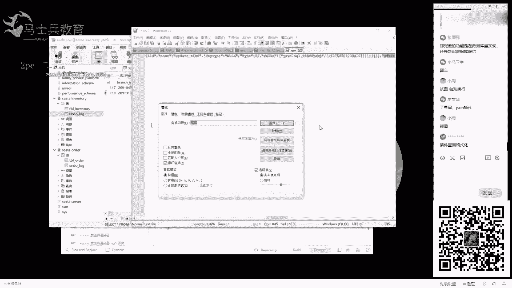

没事，这些东西不重要啊。然后看after image。视图自动换行是吧，视图。自动换啊啊。行吧，无所谓，语言人能选jason是吗？啊。啊，无所谓了啊，让他看一下就就知道了。那个。我不不那么费劲啊。

这不是重要的，重点是看这个beforeim好吧。After。in卖主要看这两个。好了，从这两个名字你们能看出什么什么什么东西来了。😊，能看出啥东西来了，那从这两个名字没关系，工具不用纠结啊，工具无所谓。

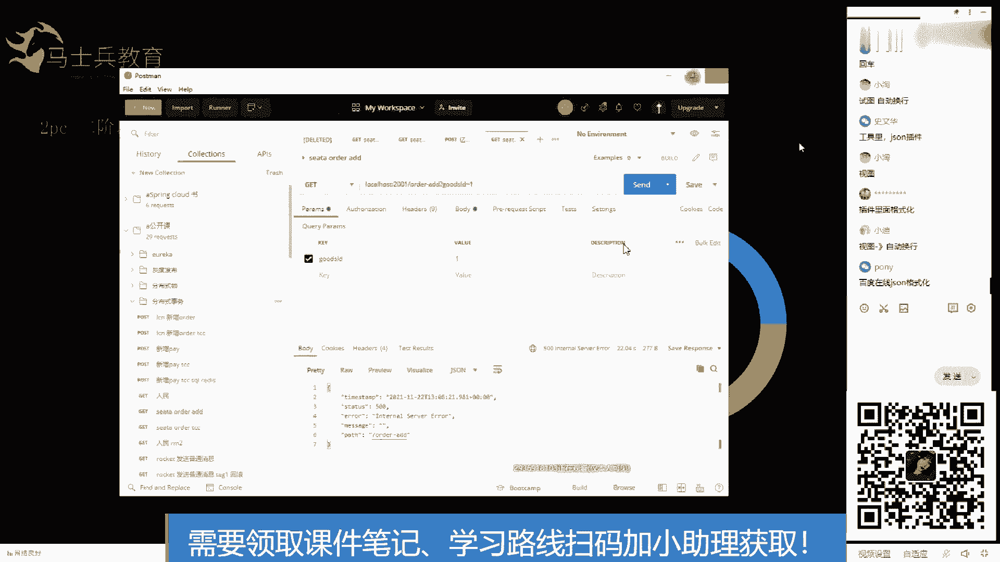

里面有一个befo。有一个after。是不是在第一阶段，我把链接释放掉之后，我放心大胆的去释放。因为我那数据库已经存了，它从哪来的，befo之前是什么样子，after之后是什么样子，我都存下来了。

以后你要提交，要回滚，我这都有记录的，所以我把连接释放掉了。现在理解了吗？理解了是吧？okK这就是这就是西塔对连阶段性能的一个改进。好了。的，到此为止啊，对他把数数据放到了表里。对的，是这个样子的。

O不是不是呃，你说的这句话是对，你说的这句话是对，就是死糖。你这个话是对的。但是大家要记住，它是把全局global全局事物的分支事物的回滚信息放到了表里。并不是说数据库原来的那些日志信息放在表里啊。

能理解吧？这是全局事务分支事物的业务信息，业务的回滚记录放到了表里。是这么一个意思啊，并不是数据库自身的那个read do log and log，还有blog，并不是那些啊。

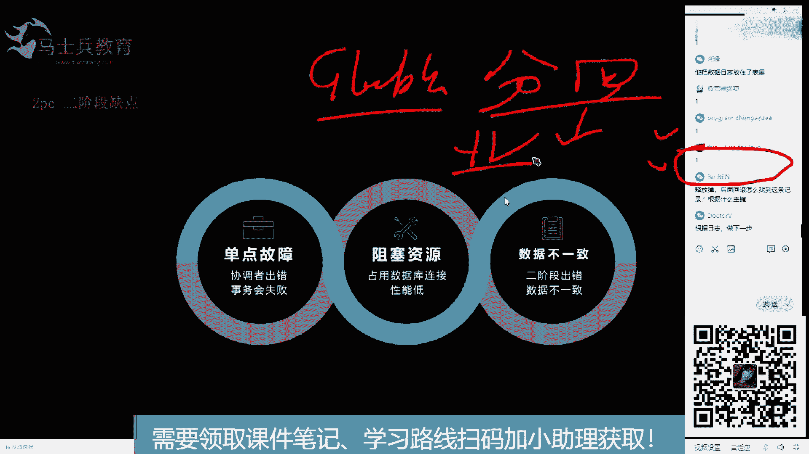

因为你看啊，这里面其实涉及到一个框你要做框架开发的一个一个东西，就是你要做框架类的开发，就是你尽量的不要去改基础组件的一些机制。就是mycyclcle它本来什么机制，你不要改。

你只是基于它的上层去改动它。一般的做呃框架或者中间件的开发都是这样子。人家原来是什么样，几乎不改在上面做扩展OK。好啦。我看一下啊，现在给大家一分钟的时间提问啊，两次提交还要读出来再写吗？

那不会性能很低吗？什么叫两次提交还要读出来再写。这句话没懂啊，没懂，为什么要读出来呢？为什么要读出来？没我没有说读出来啊，回购前，如果有其他事误操作成功呢，如果这样如果有这种情况，那就算倒霉是吧？

那就算倒霉了。这个情况呢也会有处理方式。首先第一个。你的这些业务操作的，比如说update从1到2是吧？你一般的业务操作，这个只是这个业务把它从1到2。如果说其他的业务也把它从1到2。

那你说这个一这两个业务是不是要合并呢？你写两个代码，实现实现一样的sircle语句。首先在实际工程中，这种概率很低。所以你说的这个其他事物操作成功也不是那么大概率的存在。O这是一个问题。第二。

如果说你真有这些问题，那么自认倒霉人工补偿。只能这么做，但是人工补偿的概率也很少很少，几乎不会遇几乎不会遇到。

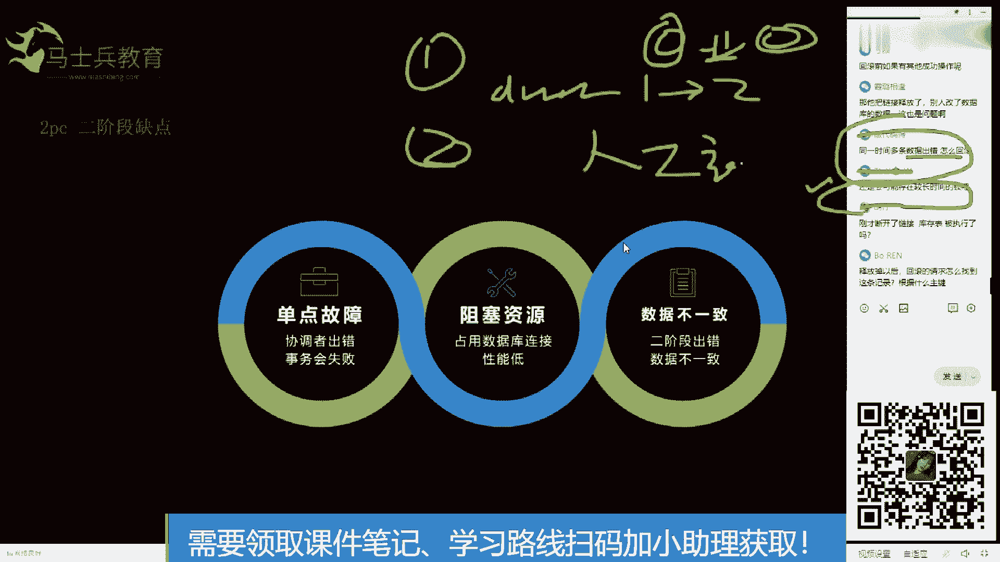

理解吧，刚才那个谁夕岩理解了吗？

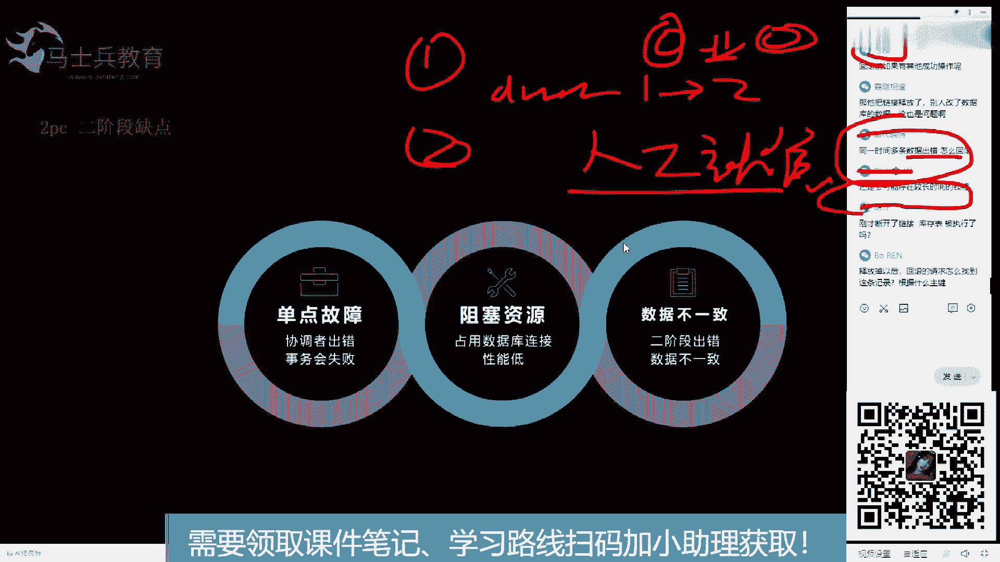

示放掉以后。回滚的请求怎么找到这条记录，根据根据什么键然后然后嗯好了，这个问题啊，这个问题呢呃我在这里不做过多的解释，大家可以你仔细研究一下这张表结构叉D。

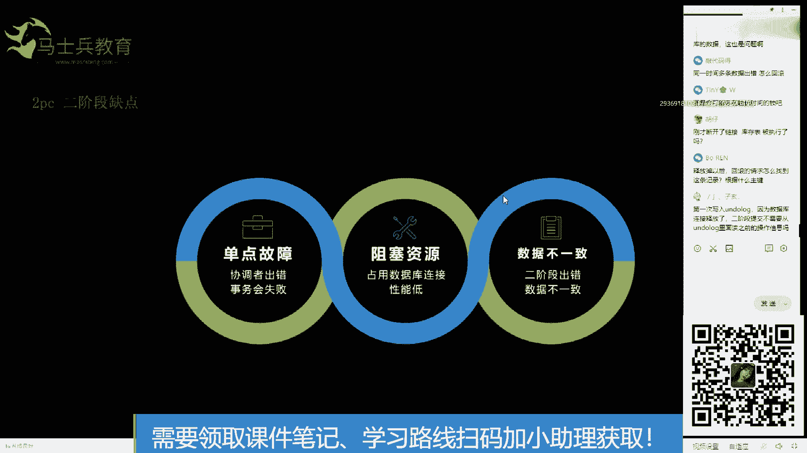

全局是5ID不nch IDD分支是5ID是吧？能确定。这样就能确定是哪个全局事务的，哪个分支事务。改的了吧，是吧你从这个表结构就能就能就能知道啊。Branch IDD叉ID圈接数ID分支数ID是吧？

这这这这个都有。

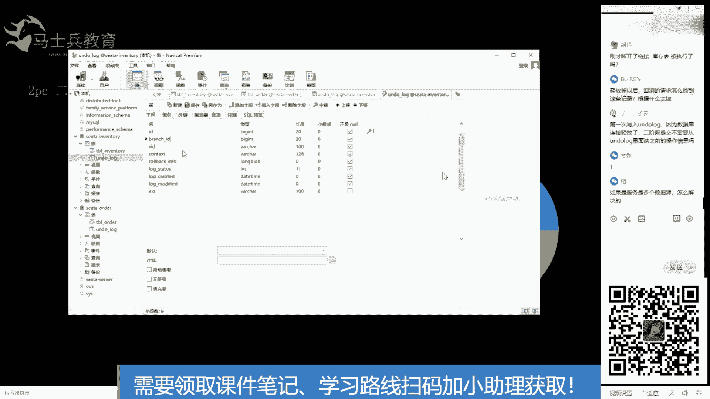

所以这就这个不用担心他怎么查的，肯定是能查的。啊，第一次写入log，因为数据库连接释放了，连接上提交，不需要从underlog里面读之前的操作吗？之前的操作，我刚才就是刚才解释的也是你这个问题啊。

就是你从他这读。

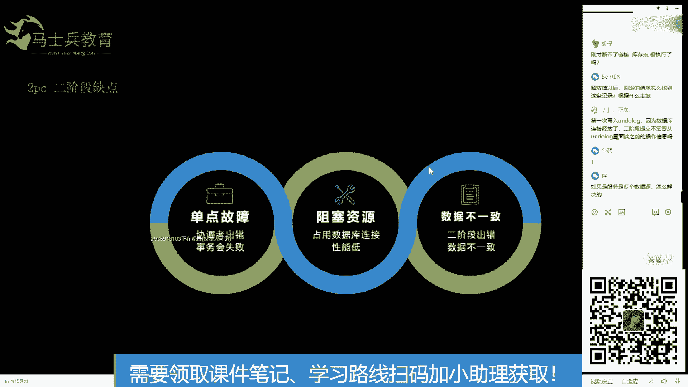

这不就读出来了吗？OK你从他这读也就读出来了。😊，并且还有一个。如果提交的话，大家想一下啊，你想想这个影响性能，如果是提交，你该怎么做？直接把这个数据delete就行了嘛。把嗯把那个。

underdo log这条数据delete就行了吗？这不就完了。😡，な也ば。如果要回滚呢，那就把它回滚了。但是在现实工作中，99%是delete。所以很简单。只有10%可能呃1%要回滚，可能都不到。

可能是99点多少多少多少是吧？是delete，其他的是回滚，这个概率非常小。那你就话。如果服务是多个数据源怎么解决？多个数据源我这里面没有写代码和这个思路类似。ok。因为要再读一次话。

所以刚刚问性能会不会，所以刚刚问性能会不会下降。如果说读与不读来做对比的话，读性能肯定会下降。OK读与不读来对比肯定会下降。但是读也比占用连接占的资源要小。你把连接迟迟把着别人来用用不了。

至少你把连接释放掉，我现在来读一次又能又能咋地？孰轻孰重，我觉得你对比一下就能对比出来。理解了吗？这个叫啥小这个小孩儿小孩啊小孩儿。😊，明显了吧？哦，好了。😊，没想到你就长大了啊。

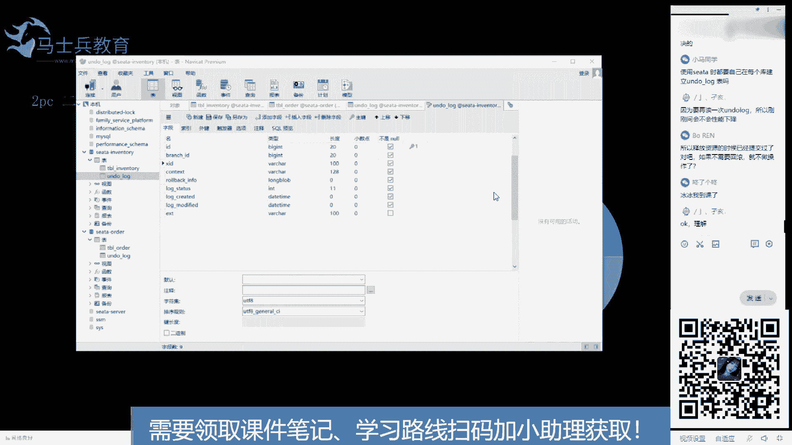

好了，这块可以过了吧。😊，这三个缺点我都说了。听到嘛？能过来就敲个一啊。嗯。我觉得我说的已经够够清楚了。所以涉报资的时候已经提交过了，这里面就不存在不需要回滚了。嗯那个。还需要加本地的售后助解吗？

这个啊HW华为，你下去自己试一下，就这种加的这个代码和不加这个代码的区别，你下去拿到我的代码自己去做。我现在告诉你，你下去也得做一遍，万一我告诉你的是错的呢。😡，能理解吧？

这种这种就是自己马上就能知道的东西，自己试一下啊。严炎是啥意思？我怎。😊，好了，这话可以了吧。😊，我们下一我们下一步了啊。下一步okK。

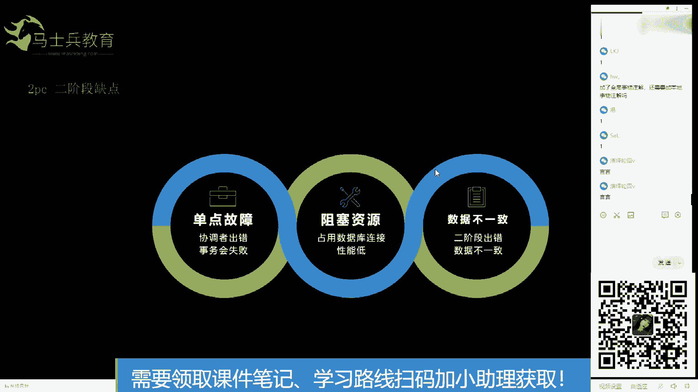

好了，下一步三阶段协交协议。😊。

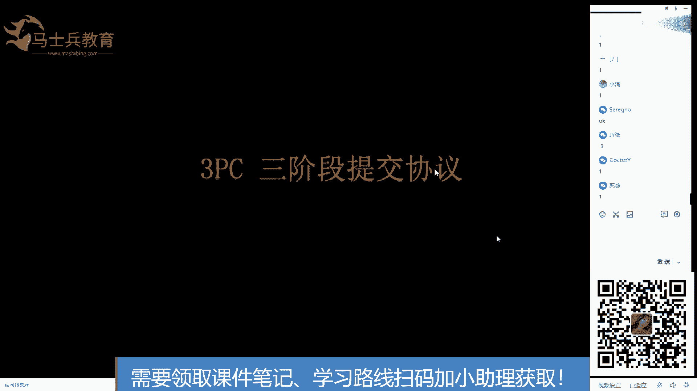

O是吧？好了，三阶段提交协议有了前面的基础，三阶段会特别简单，课前休息吗？不休息。😊，好了，三阶段提交请就会特别简单。单阶段有有这么三个阶段看commit，等会拿着拿着笔过来。😊。

can commit pray commit or do commit三个阶段。为什么要有三阶段呢？大家想一下啊，它有这里面有，其实三阶段在实际中用的几乎是没有。但是他这个理论提出来呢。

也对二阶段有一个改善，就是对二阶段有一些改善，仅此而已改善。大家记住这个词啊，改善没有说全部解决二阶两阶段的问题，这是什么意思呢？😊，就说三阶段提交协议，你看啊和两阶段相比主要的区别在哪？

两阶段提交协议是啥？比如说这个这个猫嘛。😊，我说猫，你去给我干一件事儿去是吧？抓个老鼠去。😡，然后比如说咱俩是两阶段，我说你去给我抓老鼠去，然后你。😡，嗖一下就上房了是吧？开始抓老鼠去了是吧？

我说你去干，你就开始动了。😡，这是两阶段的第一阶段，然后你把老鼠抓来给我摁在爪子下，然后问我主人要不要吃是吧？我说吃是吧？这是提交是吧？这是两阶段。第一，你先去抓是吧？第二。

你回来等我的指令要不要吃是吧？这是两个阶段，这这块能清楚吗？好了，三阶段是啥呢？😊，就是你从两阶段来看，我说你去抓，然后你马上搜就跑了。然后三阶段是什么意思呢？就是说我说你去抓你不动。

你还在那你还在那猫着。😡，你脑子里想了一下，我该不该去抓这个老鼠，我能不能逮得到哦，可以，这个老鼠比较胖，跑得慢，我肯定能抓住，我给主人说一声，我能抓得住是吧？你不动，你知道吗？你不占有任何系统的资源。

你还在那待着。😡，是吧这叫要看肯命的，你先评估一下。是不是？然后你把你的评估给我反馈之后，我说你能做是吧？你能做，那你去吧，然后你嗖你才跑了是吧？这是这是三阶段的第二阶段，相当于两阶段的第一阶段。😡。

这有什么好处呢？就是说。😡，我能把那些。发生错误的情况，对资源的占用给他下降。这句话说的比较绕，能不能理解？就是说你本来抓不住老鼠是吧？你抓不住结果如果在两阶段的情况下，你搜上房了，结果没抓住回来了。

你浪费了。😡，系统的资源。如果是三阶段呢，你第一次说老鼠这个老鼠很瘦很强壮，跑的很快是吧？弹跳力特别好是吧？我就抓不住，然后呢，你呢你也不用动，你告我一声，你抓不住，拉倒，你又没有消耗任何能量。

浪没有浪费系统的任何资源。😡，能理能理解我说他俩的他俩的主要区别在哪了吗？能不能理解啊，猫喵。喵呢喵跑了。你已经执行第二阶段去了，完了。这孩子三阶段三阶段没学会就跑了。哎，又回来了是吗？抓了一下。

没抓着又回来了是吗？啊，理解理解就好啊，开个玩笑啊，不要介意啊。😊，怎么就知道抓不住呢？莫言，你还获诺贝尔奖了，你这你你自己想想怎么就知道抓不住，他看老鼠比较瘦，老鼠弹跳率还比较好，距离还比较远。

猫杆吃饱是吧？如果回到我们系统中，举个例子update一条数据，比如说叫flagflag只能是0或者一是吧？这个记录或者说叫if deletete这个字段。我举个例子啊。

只能是零或者一一是删除零是不删除这个字段只能是这俩，结果你来一个请求，说给我把它干成3。😊，我能不能知道我能不能把它改成3？当然不能了，它只能改成零和一，不能改成3，我就说改改不了。😊，理解了吧？

这只是举一个例子啊，我觉得从这个例子上来说，你应该懂了吧啊，莫言。😡，谁来管理这个谁里库自己去管理。可以结合订单模结合订单模块呢，订单模块if这个订单是否删除。

就是订单表里有一个字段叫if deleteelete，这也可以啊。这样可以吗？是吧。就是先校验一下。对，就是先校验一下。OK这个校验一下，比你去执行业务逻辑占用的资源要少的多。明白吗？

又不是真去改别upate，直接upate一条语句下去了，结果出错了，又回来，是不是这这就这就没必要了。就是从资源的利用率来说，就是对资源的耗费上来说，校验肯定比实际去做耗费的资源要少。😊。

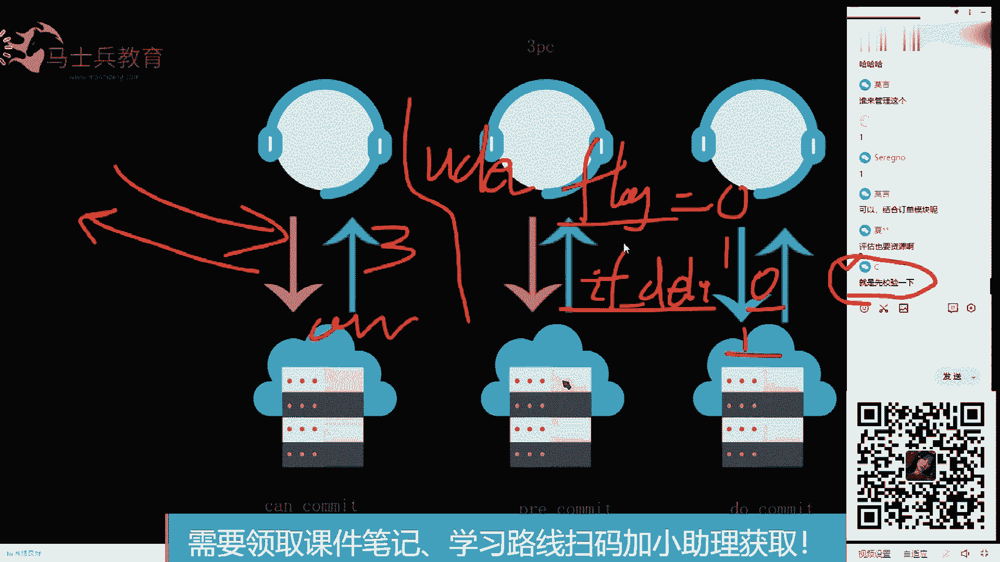

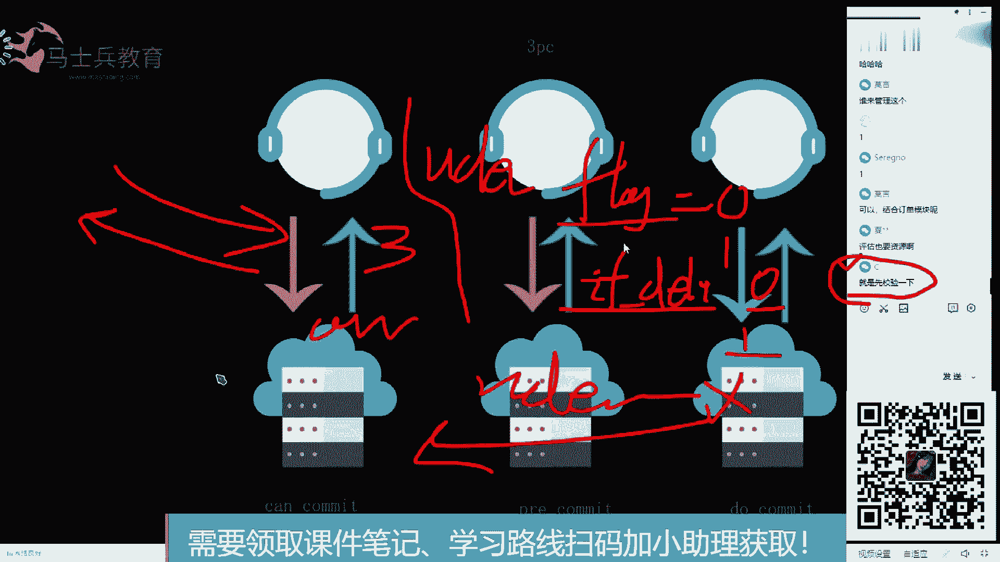

你入话。这个需要资金简代码这样吗？一般不用这个不用，这个不需要。这个一般都是框架给它分装，框架给你分装好的。如果让你自己去写这种这种教验的话，累死了，累死了。OK还要给大家说一点啊。

不管两阶段不管两阶段还是三阶段，就大家觉得很复杂，就这些东西很复杂。什么第一阶段等着等着响应，等着同意，然后等着no，等着超时，考虑各种各样的情况很复杂，因让我把它实现的太复杂了。

大家大家要想一个问题啊，在我们做软件。在我们做软件开发的过程中，你想到很多很复杂的中间件或者组件的原理是吧？这些东西做起来特别复杂，你不用担心越复杂的东西，越有人给你分装好了，让你直接用所以不需要担心。

😊，知道吧？活人还能被不得翠配传到桥头自然值，对吧？就这意思。当你要用的时候，你要实现两阶段，我怎么做怎么做？好了，阿里巴巴给你提供了一个sta，引用一个价包写一行注解搞定。对。

就是这个人说的program对吧？就几行配置而已，所以不要担心啊。好了，这块可以过了吧。😊，但是面试官会问，所以我才给你讲的这一个半小时呀，就因为面试官会问我才给你讲了这一个半小时嘛啊，懂了吗？喵有？

😡，我跟你讲了这么多长时间，是是让你们干嘛的，是吧？如果说讲讲它的使用，引入一个架包，引入一个写一个注解，你你就会用了，是不是？讲了那么多，不就是为了让你理解原理是吧？跟面试官聊嘛。

然后抓抓老鼠的时候先评估一下再去抓嘛，是吧？提高一下自己系统系统的性能啊。😊，好了，三阶段主要的就在这里啊，我们我们下一步啊，下一步三阶段呢我把我只说里面主要的这个第一三阶段的第一阶段看commit。

刚才我说过了，评估这个很简单，是吧检查。😊。

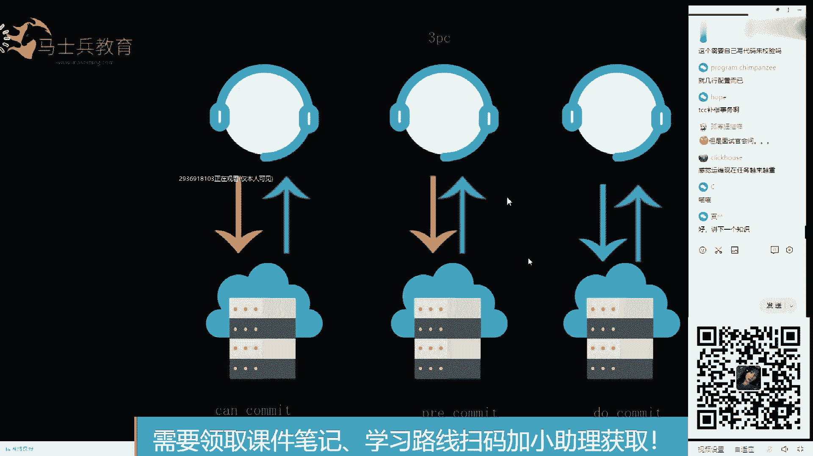

检查circleOK这个评估是怎么做到的？能简单聊聊吗？跟他聊过了呀，莫言。😊，我K刚他聊过了，刚才我已经给你举个例子了，if服delete已经给你举个例子了。😊，好了，第一阶段检查circle往下走。

然后在第一阶段。

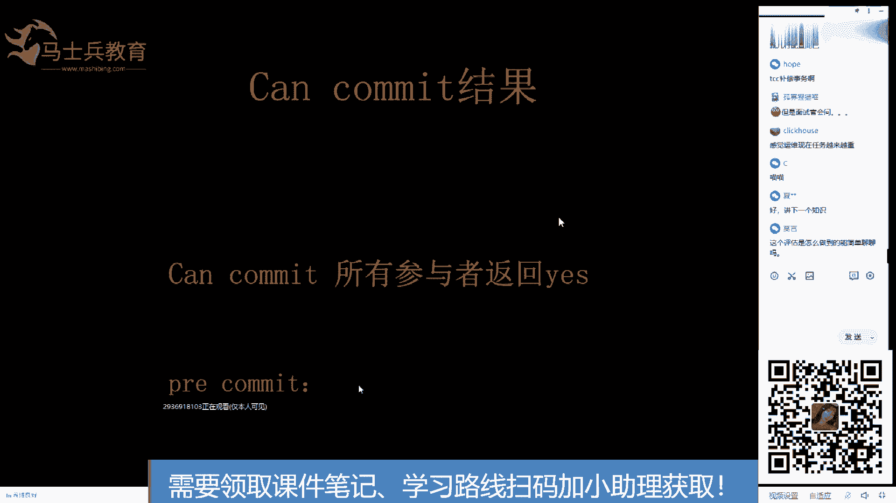

是吧都返回yes的时候，就是第一阶段都没问题的时候，我们再执行第二阶段PRE commitit好了。第二阶段呢就是我们刚才所说的两阶段的第一阶段，这个也很好理解是吧？这个就快速过一遍这个动画。😊。

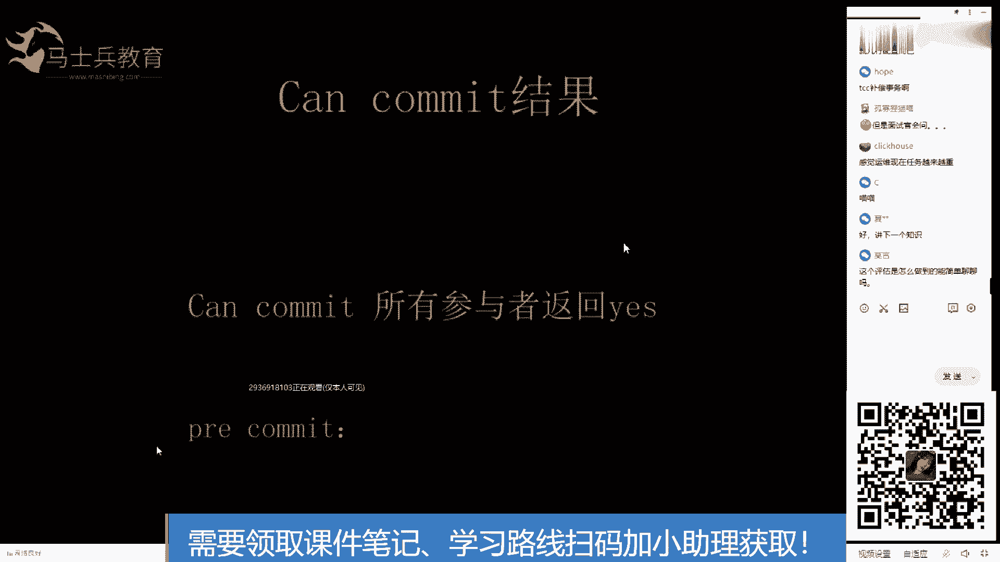

好了，然后这个完了。😊。

然后第第一阶段。有这么三种情况，就是有一个参与者返回no协调者等待超时，参与者没有收到协调者的指令。OK这里面多了一个参与者没收到协调者指令，所以他执行。upshop这里面是放弃提交。理解吧。

这块这三个挑战单从字面意s大家能看出来这三个挑战啥意思吗？😊，能不能理解？能看看的看的看的清楚吗？啊。清楚是吧？清楚就不不做过多的解释啊。因为这个前面两阶段已经讲了很多，放弃就好了，放弃直接回滚。

利用本地的数据库进行回滚OK。😊。

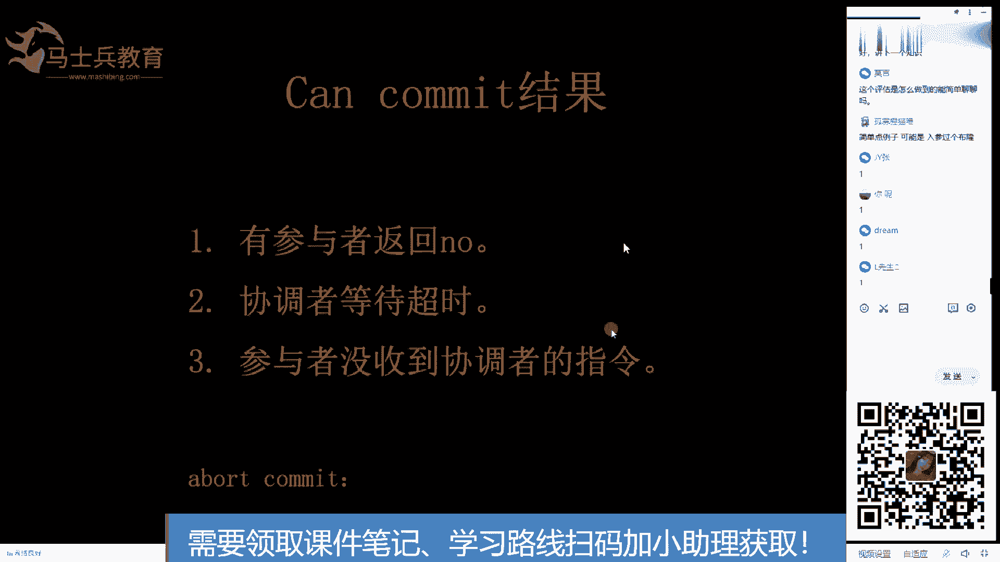

然后这个快速过一遍，因为前面脸阶段说这话说的比较多，好了。😊。

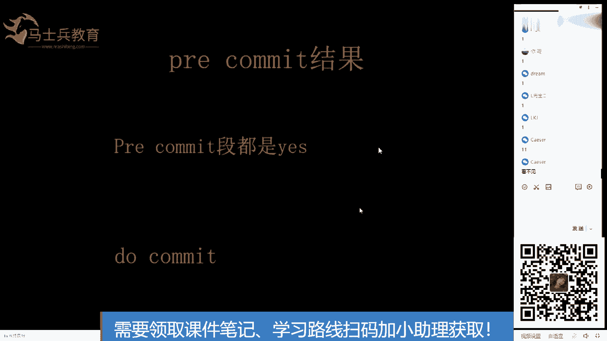

PRE阶段执行的都是yes，那么执行do commit这个也简单是吧？do commit执行完了就拉倒了是吧？执行事务释放资源好了，这是do commit。然后呢我们往下走。完成事务。

那么第二阶段发生这种异常，就有一个参照访问no或者协调者等待超时，我们发送absorcomit。就是说有这两种情况的时候，我们发送放弃提交，也就是类似于回滚。okK好吧。

这就是absor commitit，这也很简单，这个回滚一下，无所谓了。

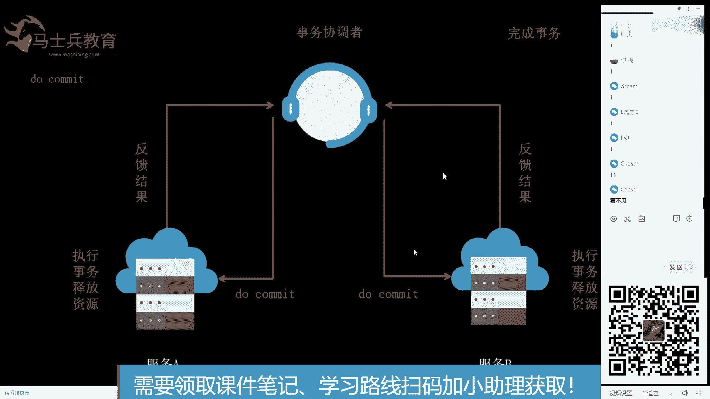

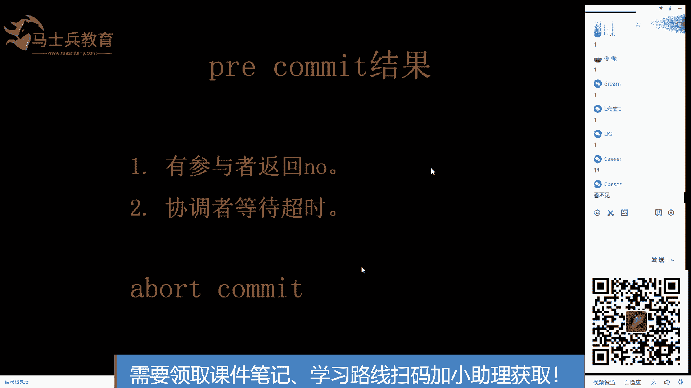

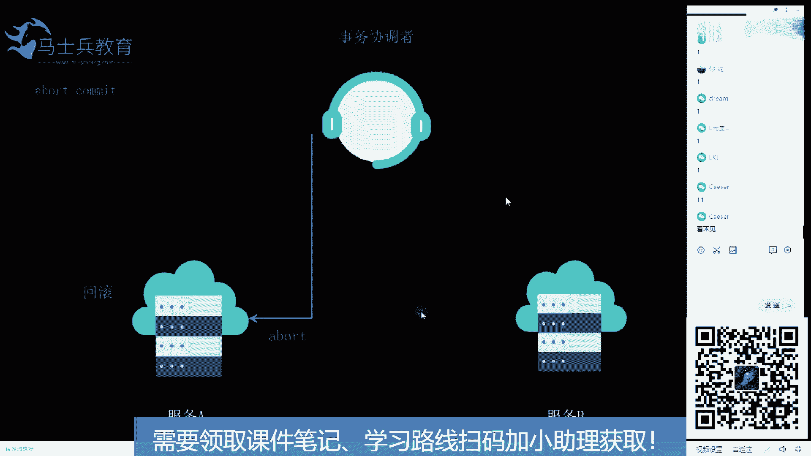

好了，这个动画走完，我们来看几个关键的地方。超时机制的设置。好了，这里面有超时机制，一个是协调者，后面还有参与者。大家可以比较一下两阶段和三阶段他对。性能的一个优化在哪里？

就是说你看啊两阶段在第一阶段发出请求是吧？你去执行去。此时这个服务呢占用了连接，一直占着第二阶段。他第三方要给他发请求，如果请求没来，他就一直等着。

是吧就像可可托海的牧羊人一直在那等着那个等着那个养蜂女的归来，他就一直等着死脑子，一直等着。那么他一直等是不是就占用资源了？😊，一直等是不是就占一直占用着资源，他不懂得超时，等不到了还在等。

所以资源一直在占用。那么三阶段对他做了优化呢，就是说有超时机制，不仅协调者有参与者，也有参与者。在后面我说。这块理解吧？所以说就是等不到了，我释放了。😡，是吧释怀了，你爱来不来，我不用了。

讨论讨论什么月月呢是吧？快点，这块懂了吗？别我在这商量。说呢你还真的在在想莫言和养光女呢，你还想你的月月呢？月月丢了对，月月丢了就别找了，回来是吧，回来接着上课。😊，是吧丢了一个月月。

还有无数个月月在等着你是吧？比如说好多好了，能理解这个超时设置超时的目的吧？你听着呢是吧？好了好了，这是超时的目的啊。PRE commitit超时之后。行调准超市之后，发送回滚的指令。

然后do meet之后发送回滚的指令。节奏快点，时间不多了，刚才让重复讲的也是你时间不够的，也是你放心，时间再不够也给你讲完了。啊，肯定给你讲完是吧，讲不完你别走。到。好了，这这这只超时机制。

协调者超时之后，两个阶段发送的都是回滚的指令。那么大家来思考一下参与者呢。参与者在第二阶段超时就是收不到第三方给我的指令。在第二阶段。我该怎么做？我是放弃还是提交absor，还是接着往下走？

在第二阶段就说我说喵，你去抓老鼠吧，你喵说好。然后呢，第二阶段。你要等不到，我给他说去抓老鼠这个指令。😡，那你说喵该去抓还是不该去抓，放弃，好多人都说放弃是吧？那么喵肯定放弃嘛？是吧？

我说主任我能抓到老鼠，结果主人没告诉我去抓，那我就不抓好了。😡，是吧。好啊，再是回滚。结果呢你看啊到第三阶段的时候，我说喵，你去抓老鼠吗？喵说好，我能抓。然后我说那你去吧，然后喵嗖一下上房了，去了。

那么第三阶段喵抓回了老鼠之后放在我面前了，结果我我走神了，我我我在想回答莫言的问题呢，结果喵不知道我我让他吃还是不让它吃。那你说这只猫老鼠都抓到手里了，它吃还是不吃。😡，是要放走还是吃了他？

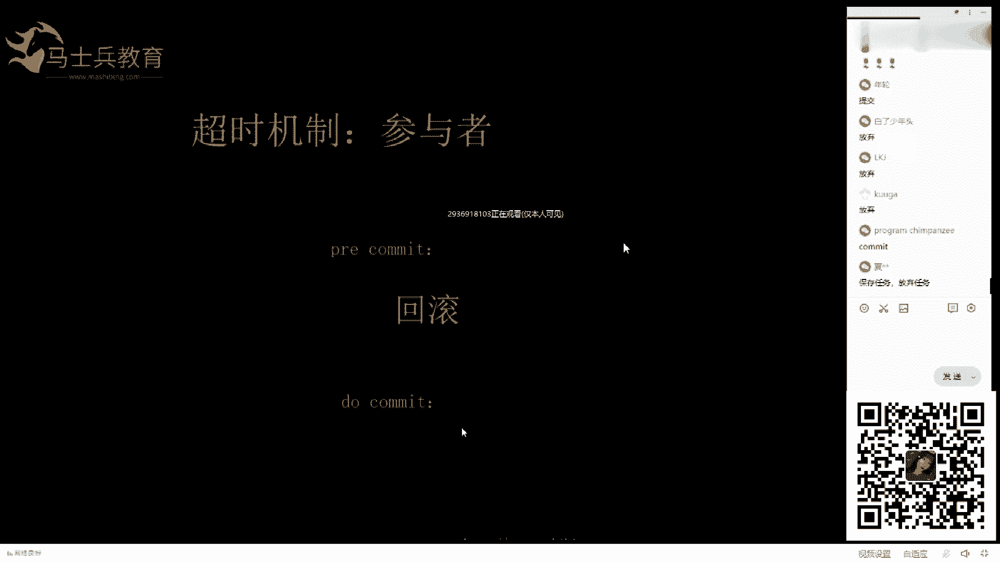