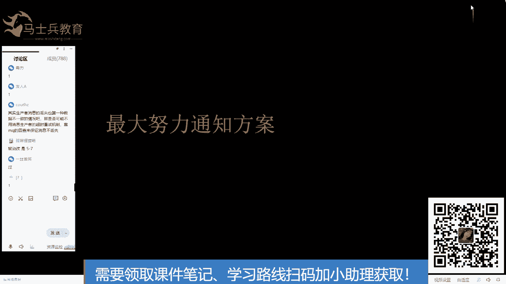

# 系列 6：P114：消息队列+本地事件表+定时任务方案 - 马士兵学堂 - BV1RY4y1Q7DL

这个服务比如说要花10秒钟处理时间，这个服务也要花10秒钟处理时间。我这个用户调用完这个服务，再调用完这个服务，一共需要20秒。但是我用这个方案。我10秒就能返回，我只需要10秒。

是不是用户的平均响应时间降低了？是不是平均显示时间降低，那就是我能接受的用户的请求就更多了。你又嘛。能不能理解有好处也有坏处吗？是不是一个是在同一个服务吗？是啊，是在同一个服务。第二个服务失败了。

第一个服务怎么回滚，不回滚。记住我说的话，这个时候就不回滚，怎么回滚呀啊，为什么我都给你解偶了，你还要我好不容易把这俩这俩在一块打架，我把他俩拆开了，你还让他俩再打回去。😡，这个时候不回滚。不回滚。

你错了，就一直消费一直消费一直消费消费到此。😡，他进入死金对量人工补偿。那你入啊。这个就是只能前进，不能后退。你有啊。嗯。😊，这个处理方案叫啥呀？这个处理方案叫且听分盈，分布式事物解决方案。好了。

如果没有名字，拿你命名。且听叫QT风win银上。是吧QTWS级的方案好了，不用纠结名字。好啦。明嘢了吗。

这个方案的名字呢叫这个。消息对待加本地时件表加定时任务解决方案，是吧？名字太长。那第二个一直不成功不就不一致了吗？第二个一直不成功，叫bug。能理解吗？叫bug大写的BU goBUG bugg。

自己去改代码去。你又话。刚才的新宇呢，新宇还在吗？好吧，这么不情愿的应个好吧，就是bug自己改去。好啦。好吧，这这是这种解决方案啊。😊，好了，我们再往后走，再讲一个解决方案。

rocket MQ事物消息解决方案，直接看图。

看这个图的话。来能不能看得懂？看看代码吧，这个那个还需要看代码吗？就是本地数据库加I。来这个图仔细看1到81到8，从顺序开始往后看，1到8。先自己先看一眼啊，我就不念了。看完之后，难懂的敲一。Yeah。

为爱活着，你懂了？我的天。啊，团团也懂了。没事，不懂的把疑问打出来。😡，不懂得把疑问打出来，因为项目用的就是这个哦。好了，那那那那正好讲对了，但是我不知道ACKACK的话小毁对列。😊，呃，你哎消息队列。

那你看消息看我们消息队列的课吧，这些消息队列的基本操作呀。😊，消息框盖住了，没关系，我挪一挪。我挪一挪好吧。攞一攞可啦吗。先看着嘛，几秒钟啊，让我喝口水。啊，嗯。

本地上是不知道不知道我如何执行ACK插入成功之后，不知道如何ACK。这样吧，你加我们的右下角的二维码，加完之后。我给你找找啊，我原来写过这些代码，我给你找找我们VIP里都有都有这些代码。啊，好了。

这个这个这个东西我简单过一遍啊。第一步发送一个half message。这个half message其实这个方案里面最关键的就是half message。发完hal message之后。

后面的食物是后面的服务是无法消费。h message，就是它是一条消息发到消费堆里，消费对的消息消费不了他，等他把他的事务执行完，然后再给他发一个提交h message，他才能消费。这样这样理解了吧。

这样的话就把消息和这边对数据库的操作绑定在了一起。也就是执行业务和发送消息是一个原子的操作。知道这个方案里面的目的是啥了吗？有消息队列的基础吗？这个需要有消息队列的基础。如果没有这个基础的话。

这个课这个我这么说，估计你也不好懂。来，能理解我说的这个关键点在哪了吗？能理解是吧？okK好了，为了保证它的原子性，还给它有。兜底的方案也有兜底的方案。兜底方案是啥呢？是这个你看啊一条消息。

我发送给消息队列了，就是have message到了。但是呢第四在路上丢了。也就是说这个消息存在于消息队容，迟迟的我不知道他该怎么办，我怎么给它兜底，兜底就是第五步，未收到四步骤的命令，我去回查查一下。

检查一下本地数据库的执行状态。如果。数据库执行的没有问题，那么我就提交。如果数据库执行的有问题，那我就回滚，把have message直接干掉。ok。理白了吧？这是第一步保证它的原子性。

如果说第其实原子性就出问题，出在第四步上。如果第四步出问题，我再兜个底。是吧planlan B。OK现在清楚了吧，您说。😊，Ccle业务的执行。和消息的发送是原子的操作。rapitM好友没。

现在只有rocketMQ有啊，我了解的只有rocketMQ有是我消息。嗯。明有吧？对，第七步很关键，听鬼谷子的鬼谷子说什么关键，什么就关键。啊。可以理解了吧，电话。🤧嗯。能不能理解这块？怎么没人了？

你要不理解的话，你把问题打上来，我给你解答O。😊，这个有意思，把消息和数据绑一起。对的，卡不卡能动吗？卡不卡不能做。half message讲讲half message记住就好了。

half message不能收费。b message其实就是一个一个消息进入到你看啊，就是它里面比如说用它里面有一个队列，队列存储了一个消息，这一行消息，消息里面一个标记，有一个flag。

如果flag是一，能让它消费。如果flag是零，它就叫半消息，这不就这不就得了。是吧就是消息在MQ里的一个标记，我标记你能消费，你就能消费。我标记你不能消费，你就是个慢消息。仅此而已。好吧，是现在选率。

然后消息队列的这些东西呢，你可以扫描这个二维码，找我们的咨询老师给你要一些我们消息队列的公开课都可以的啊。😊，消息没有提交，只是存在MQ里面啥意思？不不不不这是这个意思啊，就是说消息呢都是都是一堆消息。

不过是消息里面有一些状态是不一样的，是一，我就能让消费者消费，是零，我就不让他消费。我提交就是把一把零变成一，我回滚就是把它干掉。就这么简单。第五步怎么做的？第五步怎么做的话，如果你用呃用roMQ的话。

它有。它有一个loc localal transaction，有一个方法就是你实现它的一个接口，那个接口自动会让你实现这个方法。这个方法呢就是做回查用的。这个这个很简单，你要你要用它的售物消息。

它就它就会有这个好了，这里面其实有一个关键点啊，这里面有一个小技巧，就是这个你们一直纠纠结在第五步啊，第五步里面有一个小技巧，我估计你问的也是这个啊包子。😊，好了，就是你看啊。

我执行我的业务的circle是吧？业务的circle我该干嘛干嘛。这这是业务的 circle口。同时。我插入一个事件表，就是一个事件的表。然后这俩C口呢在一个库里。就是在一个库里。OK这是不是一个事物？

先理解一下这个这是不是一个事物。包着。还在吗？嗯。啥情况？负JC了，是是就禁止了。不理解这个是不是一个失误。我跟你说，你们要不不回答，我不讲了。😡，是是吧，那你回查的时候。😡，回一查第五步的时候。

查这个事务表不就OK了。是吧不用，虽然你的业务可能操作了10张表，我没必要把时间表查一遍嘛，我只查这张表里的一行记录就OK了。理解了吧，所以回查也很简单。最怕空气突然安静，真是的，这个安静。理解了是吧？

OK好了，这就是里面的一个小技巧啊，也就可以了嘛。😊，是不是？Yeah。好了，可以过了吗？这个。😡，嗯。如果执行到第四步，程序挂掉了，还能回查吗？当然可以了，回查可以重试，就是回查这块可以重试的啊。

可以重试，就第一次没查出结果，过一段时间再重试。ok嘅。过是吧。好吧，过往下了啊。

好了，我们还差最后一种方案叫最大努力通知方案。好了，那现在为止已经讲了整整两个小时了。😊，然后呢。今天是我们那个呃昨天活动的一次返场，然后我想把今天的就是打个广告晃换脑子，然后过20分钟。

我们再开始讲我们最大努力通知方案，可以吧？先歇一歇啊，我讲的口干舌燥。可有吧。

可以是吧？是吧？谢谢大家理解啊，好了。😊，嗯，给大家看一下PPT。然后。

说一下我们的服务。这边就是我们你就是买我们的课程呢，可以享受到我们我屏幕上的这么多服务。第一是我们的课程内容对标互联网公司的技术站，就是跟呃现在主流的大厂原来的技术是对应的。

甚至比一些呃大厂还要更超前一些。啊，就是就是说大厂计划在用还没用的技术，我们的课程里也有了。OK好了，我讲一下啊，就第一部分我们的课程内容，课程内容有哪些？我们一这8个东西我们一个月来讲。

预计20分钟就讲完了。课程内容我们有哪些。大家可以看一下我们的课程大纲，就刚才在找那个。😊。

呃，找那个分布式事物的时候，我给大家已经看过一眼了。大家可以看一下，我把这个课程大纲收起来。然后你可以把我们的课程档纲缩缩小。看一下我们科程大杆的整体。看一下这是什么东西。

这是我们MCjava后端架构师最新版的一个课程大纲。然后这个课程大纲按什么来组织的呢？按技术项目面试，还有一些不定期新增的内容。OK就是我们我们学课程主要学技术嘛，但是学完技术呢，我们得得有实践是吧？

技术是为业务服务的，得有通过业务去把技术实践一遍。然后这是项目然后学完技术和项目呢，大家都是为了跳槽或者涨薪嘛，是吧？如果说在企业内部涨薪的话，你需要晋升是吧？需要答辩这也相当于一次面试，是不是？

然后如果说你要跳槽的话，这更相当于一次面试了，我们会有。针对短期的跳槽，还有长期的提升，我们都有相应的课程给大家进行辅导，包括简历辅导、职业规划，还有面试突击班。ok这是面试的东西。新增的东西呢。

这包括我们的一些呃比如说新技术，我们会我们会在这里面新增。当然这个内容是不定期新增的。比如说最近的云原生，还有呃大厂bug的处理专题，就是说在大厂里面遇到什遇到什么样的线上的事故。然后怎么对它进行定位。

怎么对它进行解决，这个在我们的课程里都有。还有就是京东618阿里双十一大规模的促销系统，呃，怎么设计的。然后我们也有，还有就是。团队团队的管理课就是技术管理课，团队怎么管理DDD怎么用是吧？

AI然后产品课就是做一个技术人员呢，你也需要懂一些产品的知识，尤其是你以后如果说你的这辈子的目标是当一个高级开发工程师，到此为止，那就啥也不说了。你只会前面的技术就OK了。但是如果说你有更高的追求。

想当一个呃架构师或者说一个技术经理这种岗位的话，或者说更高技术总监技术副总裁你想当这些的话是吧？如果说再远大一些当个CEO是吧？产品的知识，你必须得会是吧？还有原来有句话嘛，产品经理是CEO的摇篮是吧？

就是说你想呃在技术上有一个高维度的突破，产品的知识，你是必须得掌握了。OK这就是我们大的内容。好了，我们来看一下小的内容。技术里面我们有哪些技术呢我们分2块，一块是P6，一块是P7。😊。

我们为什么这里面没有说P8呢？大家知道我们原来有课程的有P8，但是我们我们其实P8和P7，大家知道他们技术上的差别在哪里。大家知道P8和P10基本上的差别在哪里吗？有没有人知道？管理吧。对，就是这个。

其实他们的技术几乎没有什么没有什么质的差别，技术就那么多是吧？差不多就是他能不能带着团队能不能开拓新的业务，能不能调配资源，主要主要就这些了。😡，OK好了，我们那我们来看一下P6和P7需要掌握哪些知识。

P6打开从前往后前置知识。大家可以看一下P6的前置知识其实就相当于一个P5的要求是吧？你需要掌握一些基本的开发工具，将SE你得会然后SSM框架，你得会spring boot，你得会，然后再做一个小项目。

这就是一个P5的水平，前置知识就这么点是吧？P5的水平是一个什么样的水平呢？就是大学刚毕业，不管你是本科生还是研究生，刚毕业，如果你要去大厂，那就是P5是吧？阿里是P5其他的公司呢可能是T是吧？

这个就不说了。我们以阿里为例来说好，这是需要掌握的前置知识，然后。讲问完之后，这个应学院要求新增的这些课呢，这个是我们就是我们学生要求我们实时更新的这些课是吧？

快速上手二手项目怎么重构公司的项目等等等等。这节课是我们临时新加的，就是我们学生，比如说迫切需要什么课，我们也会加到我们这个里面。还有往下走第一个底层知识。大家可以看一下操作系统网络IO呃。

网络min的运维算法是吧？这个是底层需要掌握的知识。第二个并发编程并发编程是吧，需要了解操作系统对并发的知识阻塞队列GUCGMH等等等等这些东西，现征池这些东西你得了解，然后把它说起来。

然后第三RPC通信框架是吧？如那会遇到一些呃第三方协调者是吧？用keeper呀，是d doubleou呀，它也是用的W系统RPC调源方式嘛是吧？resres。规范是吧，ntynty长件也是IPC用是吧？

IRPCremoteproc call是吧？反正是你要调用别的系统，就叫IPC。😊，好了，往下呢前置知识也会讲吗？都会讲的，放心，这里面列的我们都会讲，只要是我们这个大纲里列的，都会讲到。😊，好了。

前置知识不是说你需要你需要先具备这个再学，再来学我们的课，不是这样的，就是你啥也不会，你先学先学前置知识，我们都有对应的课程，就是我们java追学班的课程都有okK好了，然后消遇中间键。

比如说actMQraitMQ卡普卡和rockyMQ这四个消语队列。😊，这四个消息中间键是吧？HDMQ太老了，这是我小时候用的不用了是吧？raidMQ用的少不用了是吧？所以只剩下卡夫卡和rocketMQ。

而我们今天所说的事物消费呢，只有rocketMQ有是吧？所以你知道你该选哪个了吗？这个这个。😊，ok。还有最新出的这个。这个都可以都可以学一学。好了，这是消息中间消息中间键，然后收起来。第五。

缓存中间键reis my catch。等等，就是一用到一些缓存。好了，往下走。然后软件软件设计的基础是吧？UML设计模式、敏捷开发等等等等这些东西。第七，分布式架构的实践。

这个里面啪一堆全是分布式的一些解决方案。是吧分布式锁分布数缓存存储分布式ID分布任命的分布式任务分布式绘画等等。这是第七。第八，微服务架构实践。

这里面有配置中心、注册中心、网络路由服务调用、负载均衡熔断间极限流隔离。奈菲阿里巴巴这两套我们都讲好了。第九系统的性能优化GOM优化，mysl优化tome head n等等一堆优化。第十。

海量数据的存储。是吧ES click个 housemy circle，no circle，这里面都有。然后数据的搜索。Loss了ESEOK。排量数据的处理。ha do map reduce。

然后flink等等等等。have这里面都有好了，再往下走。网络运维的基础是吧？多机房的问题，伊利多活的问题，联地三中心的问题。怎么怎么解决，这里面都有dalops的东西，开发运维一体化。

开发运维不分家是吧？这都需要会。然后测试的东西。OK就是写完代码，你怎么去测试是吧？这个我里面我们都有。然后不过网格的东西，这里面我们也有。

我们用int still去做去做的古网格int still也是古网格呃，现在落地比较广的以比较成熟的一个方案啊，这是P6。OK好了，P6说完，然后P7。😊，P7的东西呢是在掌握P6的基础之上。

需要再掌握这么多基础，分布式理论基础篇是吧？CAP拍个sraftgo这些都有分布式算法，杀丁算法，拍个损做法ZI。漏桶令牌桶这些都有，这些算法都得会，就是分布式解决方案中的一些算法。好了，这是第第二个。

第三。框架原理源码剖析，几乎所有框中间件和框架的源源码，我们的课程里都有讲到。一堆spring的n的MQ的或者sportELK的这里面都有有。好了，第四，分布式架构设计核心技核心高性能架构设计篇。

这个也是我讲的，这是我们的三高项目，软件质量的标准。是吧怎么做DNSCDN多地制质量正反向代理分流。然后服务的并并行并发，整体服务服务内部并行、服务集群。然后再往下走。缓存的设计，缓存的收益。

缓存的分享点，缓存更新清理地址等等等等。然后存储的设计关系、关系数据库、索引、海量数据的优化等等可靠性设计。是吧串联并梁冗余，连内三中心一地多活。然后应用保护类的设计。隔离限流、间极熔断、恢复都有。

好了，这个是我们这个是我们的高性能架构设计片，分布式架构设计片案例驱动。然后这里面就有很多是吧？数十万超高并发的设计N科9是吧，99。999%。😊，那个通用的设计。

还有就是呃基于云的云计算的一些架构的东西，还有就是一级流量多级缓存的专题，这里面都有好了，P7的技术我给大家说完了。ok k。好了，这是上面这是上面的技术点。学完技术点之后呢，我们还有项目。

比如说我们有一个东宝商城，然后这个商城的项目呢里面有前端的架构点开。就是作为一个后端，你也懂一些前后端是如何交互的。如果你懂前端之后，你在工作中会更加顺利一些。就是你知道跟前端该怎么交流。

别前端说我要这么调，你说不行，然后你又说不出理由，这就尴尬了，是不是？然后还有就是后端的架构，这个你当然得懂啊，然后后端架构需要用到这么多东西是吧？包括配置中心注册中心网关路由限流认证。

链路追踪数据同步数据检索缓存。分布式解决方案等等，这里面都会有。好了，大数据。link离线数仓实时数藏数据弧。在这个项目里都会讲到，还有AI数据分析。

用户画像、用户画像、购买预测、购物车分析推荐系统用户行为分析是吧？包括库存的预测，这里面都会有。还有就是云原生架构以后怎么把它放到云源身上。

docker kubernets、国斯fi、普罗米修斯这些都会有ok所以说我们以这个项目为。为驱动把前端后端大数据AI云原生全部在这个项目里给大家实现。好了，还有就是呃其他的一些项目。

比如说游戏服务游戏服务器，然后东宝，这是单体版的东保，这是给没有做过项目同学做做技术储备的一个前置的一个项目，还有网约车，这是我讲的，然后今天所讲的那些内容呢，就是网约车里，我原来在课上讲的一些内容。

比如说今天讲的分布式事务，我在网页这课里讲了。好久是吧，分门书我就讲了后面的十节课。你也课两个小时，还有前面的就是在生产，在工作中项目怎么做的，这里面都有。好了，这是我们的呃课程。这是我们的项目。

还有就是大规模电商个性化追加系统，这个就呃放到了AI数据分析里，放到了东宝商城里面。还有就是流市流市处理平台，这个放到了大数据里面。是吧就是把它都融合在我们的电商项目里了。OK好了，这个收起来了啊。😊。

同们，这些都是自己在线看视频学习吗？这么这么多需要学多久啊？一时苦笑是吧？你也不用苦笑，在我们这里呢，我们会给你根据你的情况给你制定你的专属的学习路线。你也不用说担心东西太多，需要学太久。

其实不用根据我们以往的经验，大部分人学3到6个月就能达到，就看你什么什么诉求吧。你要说明年金三一次涨薪，那你就学3个月了是吧？只有3个月时间，那你就学3个月，我们有面试突击班让你学习。

如果说我要做一个两年的规划是吧？那我们可以从技术的深度技术的广度，从架构从大数据给你做规划，这些都是可以的。对，就是这个冰冰说的学多久，看你的需求，是看你的诉求是吧？你要想一个月是吧。

一周两周、一个月、三个月、半年，一年两年是吧，看你看你自己对自己的规划是多久，我们都有对应的学习路线给到你。OK这个就是我们呃我们课程。哎呀去这个就是我们课程的一个。呃，课程大纲的一个介绍。

如果想要这份大纲的同学呢，扫描屏幕右下方的二维码，找我们的咨询老师去要这份大纲。好了，这是我们的课程内容。第一部分。

还有第二个。学习规划刚才我也说了，就是报名之后，我们有一对一的学习规划，可以给你制定学习路线。OK就是你跟着随习路线走就行了。然后我们的教学方式呢是直播和录播。就比如说我们每天晚上我们有直播。

大家可以看一下我们的课程表，稍等一下啊。

这是我们的一个课程表，大家可以看一下。