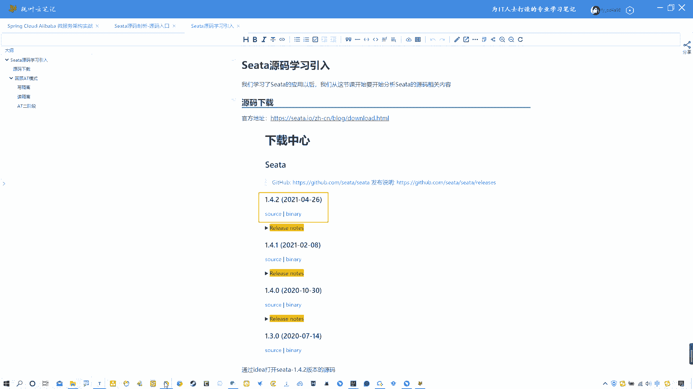
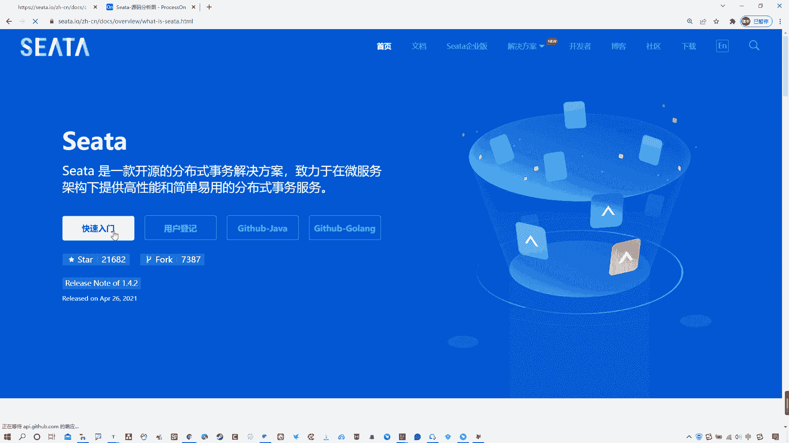
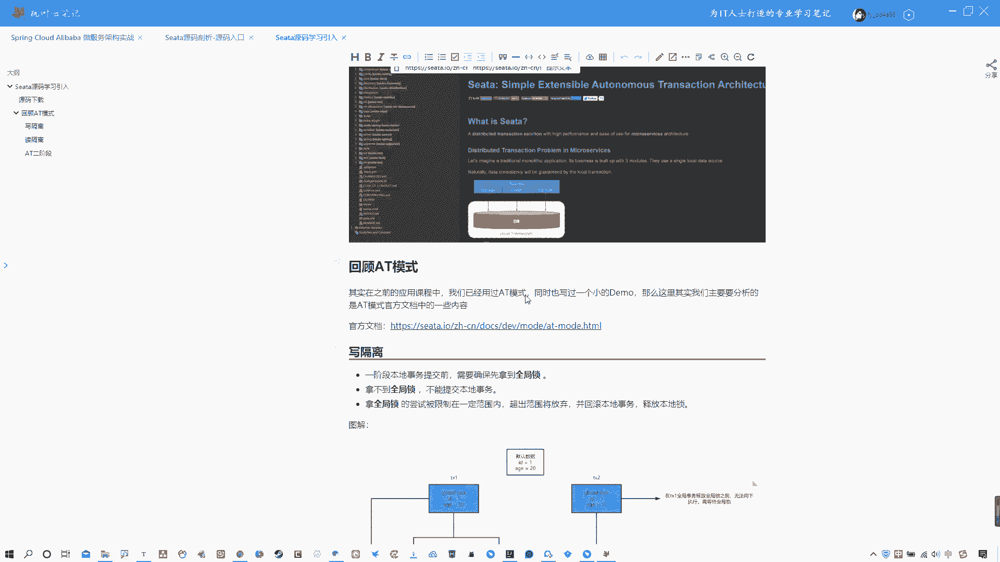
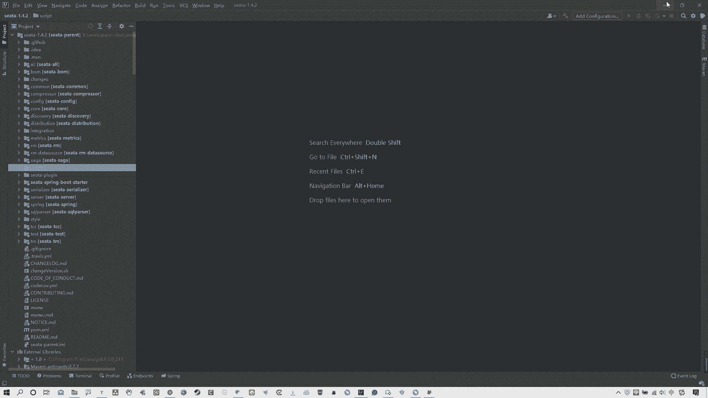
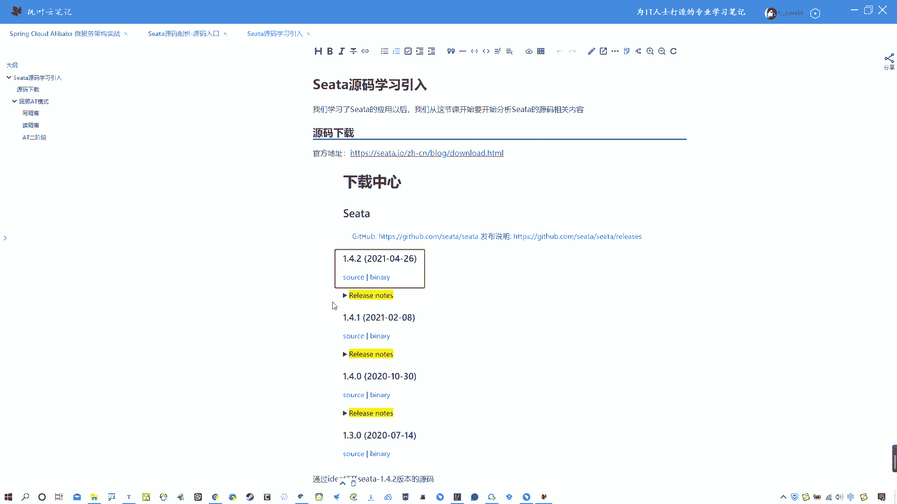

# 系列 6：P115：Seata源码学习引入 - 马士兵学堂 - BV1RY4y1Q7DL

啊，各位同学们大家好啊，那么从这节课开始，我们要开始讲解西塔的源码部分。我们在之前啊学习了cita的应用，包括它的一些呃事物模式啊，包括一些它的一些高高可用的部署，对吧？

包括通过nas作为注册中心配置中心啊，包括使用DB模式等等这些吧。啊，什么sta的各种事物模式，什么AT啊TCC啊这些模式。那么在学完了这些以后啊，大家一定会产生疑问。

就是说这个西塔的源码它是怎么去实现啊这些功能的？那么我们还是要去强调一句话，就是se塔它本身啊80%以上的分布式事务问题。通过西塔的AT模式都可以去进行解决。

而且AT模式也是sta主推的啊这么一个分布式事务解决方案。我们可以从哪儿可以看到啊，从它的官方官方网站中就可以看到。

映入眼帘的直接就告诉你有这么几个模式，然后上来就是AT模式，对吧？它主要是针对AT模式做了一些讲解啊，那么是这样的，各位啊，呃，我们原码部分实际上也是主要是针对AT模式进行展开啊。

这样的话把这会给大家分析清楚了。其实在你的面试中啊，包括在你后续的一些工作中啊，就足够使用了。好吧，各位OK啊。那么这节课是一个sta的源码的学习引入。

那么说白了就是我们需要去啊对源码学习前做一些准备啊。呃呃首先啊第一件事情嘛，我们先说一下，啊就是说源码的下载。那么s塔的源码下载的话，地址在这儿啊，给大家提供好了，我们可以打开一眼来。

其实在哪就可以看到啊，在这儿有个下载啊，在s塔的官网中下载点这。啊，然后在这就是对应的下载中心啊，这就是我笔记里给大家截图的位置。当前我们使用的版本是这个1。4。2，就这个版本。

所以你跟这儿就可以进行下载，好吧啊，O这就不多说了，这个对于你们来说比较简单了啊OK。然后再接着说一下啊，那么再去正式讲之前啊，我先多说几嘴。呃，因为我们都知道。

包括我们学习nauckscentino啊等等这些吧。在学习源码的时候，我们都跟我跟大家说过一个概念，就是尽量我们去啊静态，学会静态的去阅读源码。因为你必须要去掌握这种能够去静态阅读源码的能力啊。

这样的话，你再碰到一些框架的源码，包括你在工作中想去阅读源码的时候会很方便。好吧，各位啊，而且我再说一下，再强调一下，学习源码不要去纠结于细节啊，这个在我在讲ncos源码的时候，就跟大家讲过啊。

源码课程不要去纠结细节啊，比如说某些细小的逻辑啊，某些细小的一种特别特别小的小逻辑，不要去陷入其中。这样的话，你的学习会很慢，而且效率很差。我说白了你真那么学就学不下去了。好吧啊，所以我们要关注源码的。

不是说这源码到底是每个细节怎么写的，而是它整体的思路是什么样。核心点在哪？对吧？啊，所以我们去学习源码，包括老师去讲，也是从大面去给大家去讲啊，从整体的这个呃设计角度去给大家讲，好吧，OK啊。

那么我们去下载好了这个sta以后啊，回到正题，下载好了se塔源码以后啊，我们只需要去通过idea啊，进行打开就可以了。我们可以给大家看一下啊，我现在这个位置已经下好了，我这是这个ok啊，西塔的源码啊。

在这里啊，包括塔的所有的相关的这个项目都有啊，那么可以很明显的发现s塔其实它也是一个类似于nacos的这种sring boot的项目，对吧？那既然是spriring boot的项目，那就好办了，对吧？

这个我们熟啊。

OK好，那接着说。

我们在去正式去讲这个s塔源码之前啊，我想带大家去回顾一下AT模式。当然不光是回顾AT模式。呃，在这其中啊啊我们还要去把AT模式。我们之前没有给大家讲到的像写隔离读隔离啊，这个分布式锁啊，不是分布式锁啊。

就是全局锁的这些概念去给大家去啊讲清楚。因为这个是官网提供的。这个我们当时在应用的时候，只是为了让大家让大家快速上手，所以我没有去详细的去讲，包括这个写隔离啊，包括这个读隔离以及这个什么读疑啊。

这个应该知道啊，包括这个位置有一个叫做。拳局所的概念。这个我没有跟大家说说去细说啊，只是简单提一例嘴。那这节课的话简单去把这回顾，然后呢，我们还要把这去详细分析一下，好吧，OK啊。那么咱们就开始啊。

先说一下啊。我们在之前讲AT模式应用的时候啊，其实我们已经通过一个特别小的案例来啊尝试去完成这种分布式事物的一个应用啊，尤其是AT模式。那么这个我们当时讲这个demo也比较简单啊，我给大家找找那张图啊。

呃，这是咱们后续要看这张图啊，那个图在哪儿？AT模式在这儿OK啊。这是我们当时去讲的个AT模式。呃，当然实际上我们还通过一个案例去给大家去分析了一下，我看那个案例还在不在啊。好像。呃，执行模型。

撒嘎的这你应该就是这个啊，那就是这个。啊，这而且有提交。啊，这个不是，只是讲原理，那就是他啊那就是他OK。这张图啊我们可以再看一眼，再回顾一下啊，我们当时讲的个案例是一个订单啊，一个库存啊。

那么去订单发起的这种全局事务啊，或者叫做分布式事务啊，全局事务。那么实际上就是它有几个角色，我们一定要清楚啊，在这其中，一个是TC啊，一个是TM一个是RM啊。

RM相当于事物的参与者TM是那个啊这个这个这个可以是一个项目啊，它也可以是一个这个。呃，RM啊，它既可以是TTM啊，也可以是RM啊，那么TM相当于这个事物的发起者。

说白了就是啊那么TC就是那个sock server啊，不 server了那个塔 server啊，说错了，口误啊塔 server那这个概念的话，如果各位还不是很清楚的话，一定要把它去分清楚啊。

在塔的官网的术语这个位置啊，TC是什么啊，事务协调者对吧？TM是什么事务管理器它分负责是开启全局事务啊，提交或者回滚全局事务啊，那么RM的话就是资源管理器。那么说白了就是事物的参与者O好了。

最后说一遍不再说了啊。那么我们之前那个案例就是说白了通过订单啊，这个位置去首先啊开启选居事务，对吧？然后呢，它这个位置会注册相关自己的一些啊开启选居事务以后，那么它会去调用我的啊库存去减库存。

订单这个位置生成订单，库存这个位置去减库存，这其中会必然产生分布式事物问题。那么我们的解决方案是通过AT模式啊，在呃订单调取这个库存的时候。开启全局事务啊，然后呢呃首先全局事务中的这种什么。

事物参与者去进行单独执行本地事务或者叫分支事务。同时要记录andlog和redolog，也就是执行前的数据和执行后的数据记录在这个andlog这个表中啊，这是一个呃快照可以理解为啊。

那么记录它的一个前镜像和后镜像，这个前镜像就是之前的数据和更改之后的数据啊，叫后镜像OK把这个数据记录完以后，那么如果当前都没有问题啊。比如说订单也。增加了库存也减少了。okK没有产生分布式数问题。

那好，全局提交okK。这是之前正常思路。但如果一旦出现问题，那么就会进行回滚啊。回滚的话可能就是具体的某一个分支事物进行回滚。比如说库存减一的时候没有减成功，那好。

他就通过之前所记录的安log来进行一个回滚啊，一个补偿型的回滚啊，这是补偿型事务，对吧？OK这是我们之前讲的概念。那么呃这个都比较简单啊，我也不用多说，简单说两句，你们就能懂了。那么在这其中啊。

涉及到点东西，什么东西AT模式我们都知道是一个基于2PC就是二阶段提交这么演变过来的这么一个协议，对吧？那么在这其中，其实还涉及到一些问题，就是写隔离和读隔离的问题啊，看官网上，包括我笔记中有啊。

笔记中有在这儿啊。写个离和读个离，我们先看官网，好吧啊。在官网这个位置啊。他告诉大家说这个整体阶段一阶段二阶段不多说了啊ok那么写隔离是什么？读隔离又是什么？这两点我跟大家说清楚。首先写个例。

我们看概念说，一阶段本地事务提交前需要先确保拿到全局所，拿不到全局所不能提交本地事务。那么拿全局所的啊拿全局所的尝试被限制在一定范围内，超出范围则放弃，并回滚本地事务释放本地所。什么意思呢？

这个东西我们可以通过一个案例来给大家去说清楚啊。但然官方这个位置也提供了案例。啊，这个案例的话呃，我觉得稍微晦涩一些，所以呢我就通过了我自己的方式啊去给大家去呃画两张图，让大家能够好理解一些啊。

咱们先说这个血隔离，其实这个所谓的血隔离，它其实就是去避免这种脏血的问题发生啊，脏血是什么？大家应该都知道。举个例子来说，当前假如说这个位置我有一条默认数据啊，IDV一值是A值为20啊，这是个默认数据。

那么当前是呃两个两个全局事务啊，TS1TS2OK。TSE在开启全局事务的时候，首先第一件事情它需要去啊也就是在一阶段的时候啊，他需要去拿到什么这个啊稍微放大一点。global look啥玩意儿？

全局所它需要去拿到全局所，拿到全局所之后，然后呢再进行具体的commit和ro back啊。那么在这个commit和ro back之前，这个全局所是一直被TXE去掌握的。啊，这是事务一去掌握的。

那么只有整个这个全局事务一在执行之后才会释放本地所啊，不是释放全局所说错了啊，释放全局所。懂吗？那么这样的话，TS2能进行执行。什么意思？它为什么能防止脏写呢？其实如果说啊我们没有这个全局锁的概念。

假如说现在当前IDV一的age是30，那么TS1在执行的时候，当前置位30。那么TS2在执行的时候呢，它呢把这个数据加一了，变成31了啊，那么就会出现脏写。假如说TS1在执行以后啊，30好。

它掉服务币了，那这时候值就是30。但是它如果一旦出现这种问题进行回滚的时候，OK那么值会变成20。那这头现在是在你去正常执行TSE事务的时候，它也可以执行去拿到这个H的值啊，去做一些事物的改变。

比如说把值变成31了。那好了，那这个时候这个值就不对了。啊，就直接变成一个脏血的情况了。那么如何去防止这种情况呢？其实很简单，它在TSE这个位置加了一个拳击锁。

加上这个全局锁的目的就是在TS1这个全局事务执行的期间啊，只要他没有执行完，你的TS2就不能拿到这个全局锁，你就不能对这个A值的值进行改变。所以我这写了一下，说在TS1全局事务释放全局锁之前。

无法向下执行，需要等待全局锁。那也就说白了，在这个位置啊，我现在想把这个值改成31啊，但是我没有拿到全局锁，所以这个位置我只能去重试它这个重试的时候有个细节，就是会释放自己的本地事务啊，然后释放之后呢。

再回过来重试啊。如果还有没有还没拿到啊，再回头释放，再重试，再回过头来重试他会一直重试重试重试。在这儿直到你的TS1全局事务结束以后，那么真正的这个位置拿到了全局锁。第二个全局事务。

TS2拿到了全局事务以后啊，全局全局锁以后啊，它才能去正常的去执行它自己对应的这么一个呃事务。这是当前的写隔离，说白了就是去防止这种是吧啊。脏血的情况出现啊，包括我们这述完了可以看一眼它的官网。

这啊他这也说了说他也是举一个事例来说啊，分别有2个TS1TS2。然后对当前的这个IDVM啊IDV1的这个M值1000啊进行一个更改。你看TS1开始先开启本地事务，拿到本地锁。

这是正常的本地锁这个工作数啊，然后更新操作变成900了。那么本地事务在提交前先拿到该记录的什么全局锁。本地提交释放本地锁，那TS2开始后啊，开启本地事务，拿到本地锁更新操作。

由原来的900减100变成800。在本地事务提交前，他需要先拿到全局锁。也就说白了，你不管这边怎么操作。如果说你的TS2拿不到全局锁，那么它就无法执行。所以在TS1全局提交前该记录全局锁被TS1持有啊。

也就是说全局事务TS1它持有全局锁。那么TS2就需要重试等待全局锁。你看他这个图就在这个位置呃获取全局锁O获取不到怎么办就重试重试重试等着什么时候TS1执行完了，它释放了全局锁。

它拿到了才能去执行它TS2的本地事务去把当前的这个呃900再减100等于800啊，这是这么个情况。OK那么如果说TS1的二阶段全局提交看啊TS1二阶段全局提交释放全局锁啊。

TS2拿到全局所提交本级事务啊，这这是刚才我说那块啊，这刚才我说那块儿。这是他正常提交的情况下。那如果说TSE的二阶段是全局回滚，则TS1需要重新获取该数据的本地锁进行反向补偿操作啊，实现分值回滚。

这是我们正常的AT模式啊，它的一个操作流程。但是如果说全局锁情况下啊，就是TS2在TS1在全局回滚以后，TS2去必须等待该数据的全局锁，同时持有本地锁，说白了就是这个意思，咱就不不用看这个了。

就是看着有点懵啊，简单理解吧，不管你TS1是整体提交还是整体的去回滚。只要你的全局锁在没有释放的时候，你的TS2是无法进行操作的，它只能在这个位置获取全局锁获取不到回滚本地事务，然后再来重试。

如果还拿不到回滚啊，再等着什么时候拿到全局锁，什么时候才能做你TS2的一个全局事务的一个后续操作。这就是啊。写隔离。他其实你看这写的说，因为整个过程全居所啊在TS1结束前是一直被TS1持有的。

那么TS2就无法进行擦的操作嘛，所以这样的话就会避免脏血的问题的发生啊，这就是所谓的我们AT模式的。血隔离其实就是去防止这种脏血的问题发生。O啊，这是写隔离，说清楚了。OK那么还有一点就是读隔离。

这个读隔离是什么呢？呃，我们可以看一下啊，它这个有一个概念，就是说在数据库本地事物隔离级别啊读已提交或以上基础C塔的AT模式默认全局的隔离级别是独未提交。呃。

大家可能会对这个读已提交和读未提交这两个情况，这个隔离级别啊，呃可能不太了解，我简单说一下吧，好吧。我们这个也是看图啊，我要把这个图都画好了。有一个读个里OK看这张图啊。

他这个所谓的读隔离是个什么样的意思啊？它这个我这个图跟上一个没什么区别啊，都是一样，我默认数据为20啊。然后呢，你们要注意一句话的是啊，咱们先看这儿啊，他这有一句话你要注意。

就是他这个位置说读隔离是说呃。如果应用在特定场景场景下，必须需要全局独以提交这种隔离级别。那么目前sta的方式是通过这种代理slect for update语句。说白了就是加行速。啊。

OK那么什么叫读已提交？什么叫读未提交呢？我们来看图啊。哪去了啊，这道。这个图中，当前默认数据为20。然后呢，TS一这个位置一样改成30TS2这个事物2啊，全局事物2啊，这个位置不是30，我就变成31。

好吧，这忘改了。OK好啊。😊，他也是这么一个情况。那么他现在什么叫读未提交呢？假如说当前TSE执行事务以后，这个值变成30了。啊，这个值变成30了，但是它现在是一个呃未提交状态啊。

它现在是一个未提交状态，也就是说没有走到这个全局commit。你这个时候。如果是读未提交的隔离级别，当前的TS这当前这个位置它去获取这个get age的时候，它是能够读到这个30的。啊啊，这不是31对。

它是能够读到这个30的这是读未提交。啊，也就说白了，如果是独未提交的话。没开啊。当前我这头。把这个数据更改为30了，但是并没有去执行全局提交的时候，我这头TS2去获取这个A值的值。

它是可以读到这个30的这是读已提交隔离级别啊，什么叫读已提交呢？读已提交就是指当前的TS1啊，把这个值改成30以后必须执行的commit本地事务提交commit真正的把这个值全部提交以后。

我这头才能读到这个30，这叫做读已提交。隔离级别读未提交，就是它没有真正提交，我也能读到。读未提交就是它必须真正提交以后，我才能读到，就这么点区别。好吧。那么这个读位提交和读位提交啊，我在这给大家写了。

对吧在保证在TS2中能够读到TS1的H30读已提交是在TS2中读不到数据等待全局锁。什么意思呢？它这其中就涉及到一个全局锁，这也是我们当前官网中给大家提供的一个概念，就是说。好，在这儿。

这个它代理的slight for update语句会申请全局所。如果全局所被其他事物占有，则释放本地锁回滚啊，并重试。其实跟上面那个是一样的。它这个过程中是被一个block阻塞的。

所以直到全局所拿到即啊读取的相关数据是已提交才返回。这说白就是去呃staAT模式针对的这种说必须做到读已提交模式的这么一个啊做法。回到我们这个案例中说啊，它的意思是指。当前这个位置位置是为30。

如果当前它是读已提交的级别啊，读已提交级别。那么在TS2这个位置，它通过这个语句去读的时候啊，它会申请拿到全居锁。但是我们之前讲过，如果当前你的全局事务一没有完成整体操作的时候。

那么这个全局锁就一直在这儿啊，这个锁就一直在这，那么你的TS2去通过这个语句申请全局所的时候，由TS1持持有的全局锁，它是拿不到的。那怎么办呢？那他就需要在这儿。等回滚本地事务，并且重试。

直到把这个权击锁TSE释放以后，它拿到了，它才能继续向下走。这就说白了啊，这是我们这个se塔的AT模式的读已提交模式啊，读已提交这个级别的隔离是这么做的。但它默认记住啊，它是。都未提交。好吧。

如果你非得做到对已提交，那就得这么做。好吧，各位OK啊，那这是之前没有去给大家去讲的这两个过程。所以这个位置简单去啊不能说简单就详细把这个事儿给大家讲清楚了。

也就是说staAT模式的一个呃写隔离和读隔离啊，说白就是去防止这种脏图脏写啊，脏图脏写，好吧，OK啊。那么其他的话这个位置我就不看图了，不不看官网了，看笔记吧。在笔记这个位置。

我把AT的二阶段模式啊给大家去再详细的把流程列了一遍。那么如果你忘了的话，你可以看这个当然啊，我这个位置没有人官网写的全，我这是摘摘抄官网呢，只是我精简了一下官网的这个位置，如果你忘了这两阶段。

那么AT模式的一阶段和二阶段在这里写的非常详细。好吧，那么我在这儿啊给大家简单过一下，因为咱们都现在起码现在没忘，对吧？O。一阶段是指的是说解析circle啊。

AT模式的一阶段是解析circle得到对应的circle类型update啊，什么呃语句，说白了就是等相关信息，然后查询前进项。这个所谓的查询前进项，就是第二步，就指的是改变之前的数据。

假如说我们订单那个扣库存。在扣库存之前记录一个数据，就叫做前进项。啊，然后根据解析得到的这种条件语句是啊条件信息来生成查询语句定位数据，然后执行业务circle啊，比如说库存检易OK那么在库存检易以后。

它会生成一个后镜像。就是改变后的数据。库存真正减易以后的数据叫做后镜像。它是通过主件来定位数据的OK。然后第五步啊，这还是一阶段啊，一阶段第五步会插入回滚日志。也就是说把这个andlog。

说白了就是啊前后镜像以及业务业务circle相关的信息统一啊成一条回滚的日志记录，插入到andlog表中。啊，插入到安lo表中，那么这表就是用于补偿回滚的对吧？OK啊。

那么在提交前向TC注册分支申请全局锁。啊，在本地事务提交之前向TC去注册分支，而且告诉人的状态，我现在申请申请本地锁。那么本地事务进行提交OK申请之后，本地事务进行提交。

那么业务数据的更新和前面的步骤生成的andlog一并提交。然后最后一阶段最后一步就是将本地事务提交的结果啊上报给TC你是成功了还是失败了？就这意思。就说你的库存是减成功了而是减失败了，最后告诉TC。

如果说你是失败了，那么就走到了二阶段的回滚。失败的时候，2阶的回滚是收到TC的分支回滚请求。那么开启一个本地事务执行如下操作。通过叉ID啊叉ID是什么，知道吧？跟大家说一下啊。

这个东西我在之前几节课跟大家聊过了，叉ID是指的是我们呃如何确定一些分支事务是在我当前这一个全局分布式事务中的这么一个唯一的编号说白了你这个订单本地事务和你的库存本地事务啊。

包括整个这个分布式系统的本地事务啊，不是本地事务，全局事务，他们有个统一的ID就是叉ID通过这个叉ID来确定这个全局事务中所包含的本地事务或者叫分支事务。然后呢，这个是具体的分支事务ID啊。

通过叉ID先找到整个的全局事务，然后呢，通过具体的这个子或者叫做分支这个这个事务的ID来查询对应的这种日志记录。然后根据这个对应的andlog前进项进行补偿回滚，把修改之后的数据回滚回去，就是补偿回滚。

对吧？OK然后提交本地事务，并且把本地事务的执行结果上报给TC就是回滚成功失败。这是回滚啊，但如果二阶段提交的话就比较简单了。那么收到TC的分支提交请求啊，把请求放到一个异部对立中。

马上返回提交成功给TC。那么异部任务阶段分支提交请求将异步和批量的删除相应的andlog。也就是说你如果整整个的这个比如说库存也检成功了，订单也没有问题O那这个时候会把相对应的之前的所有的资源释放掉啊。

包括andlog记录也会删除掉。这个时候我们在最开始给大家演示过了，然后最后整个的进行提交就完成了。好啊，那么这是我简单领大家去回顾了一下AT模式，以及我们之前的案例，包括源码的一些开篇啊。

像源码的下载以及AT模式。我们之前没有讲的读个离写个离。所以这节课啊就先讲到这儿，这是为了我们后续讲源码做一个铺垫。下节课开始，我们就正式的开始去讲啊源码相关内容。

