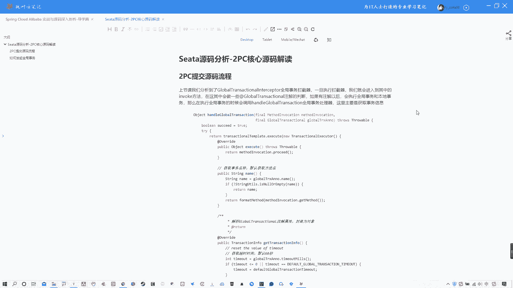
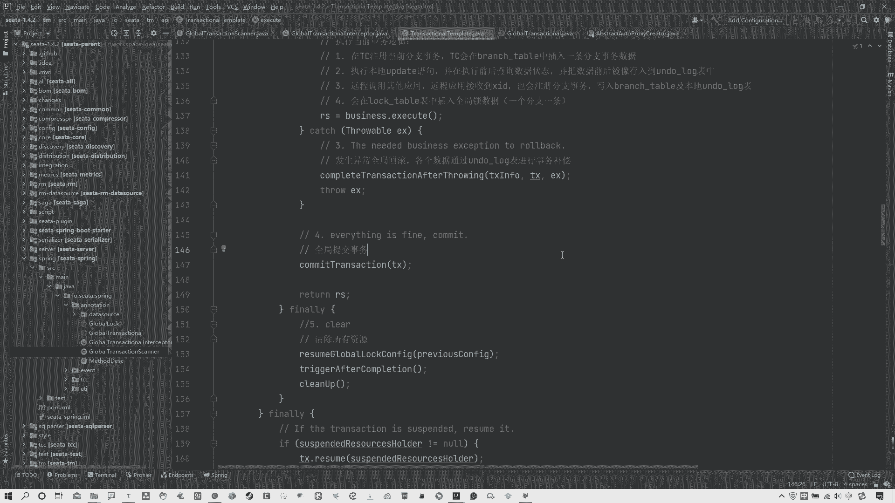
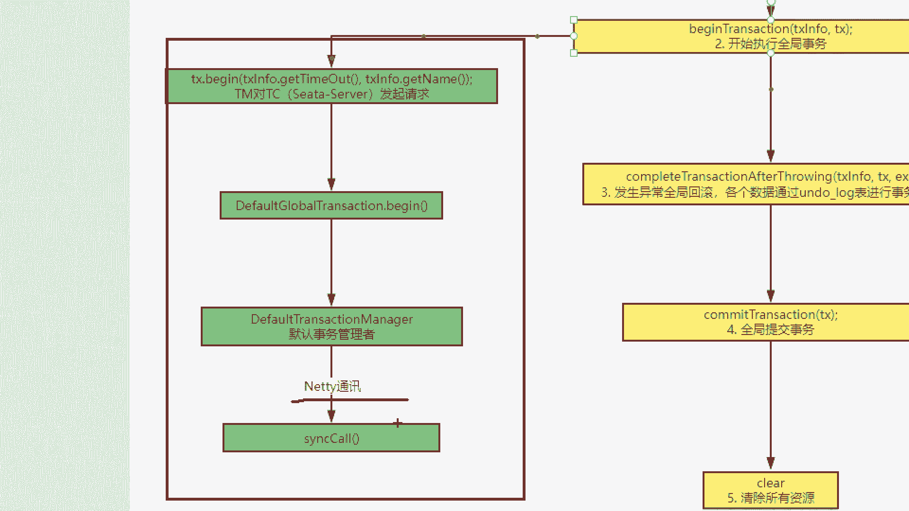
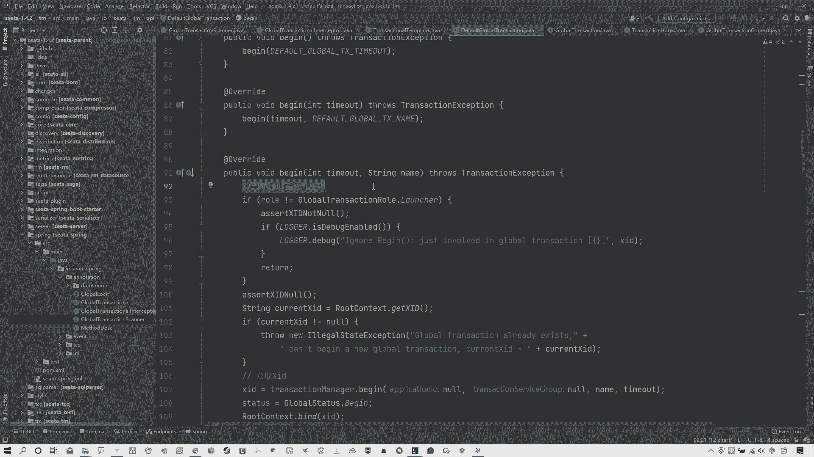
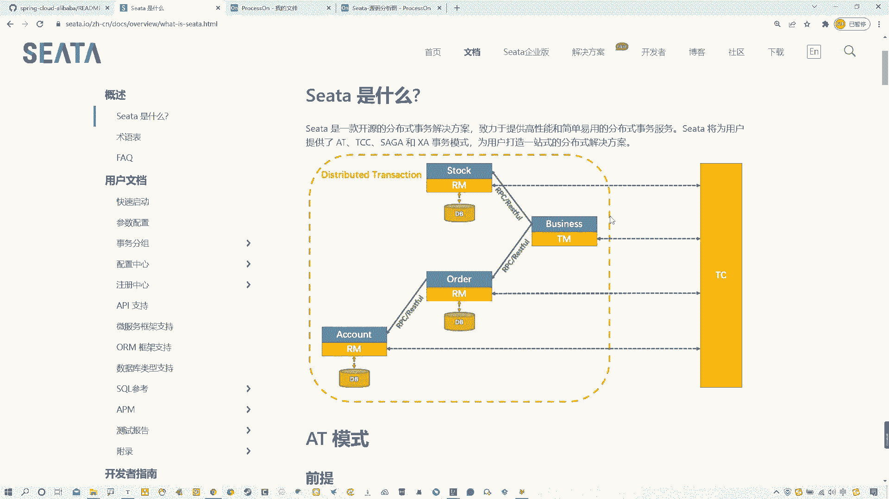
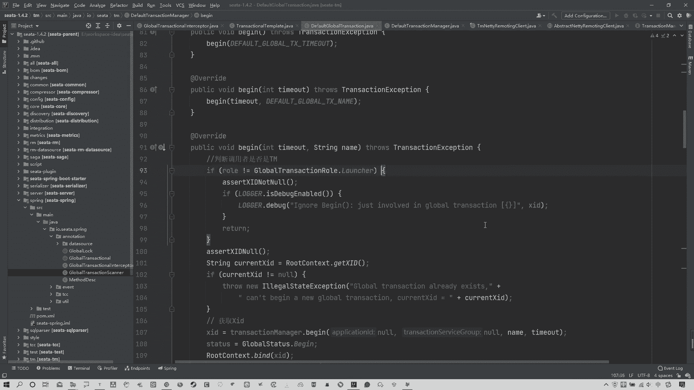

# 系列 6：P117：Seata源码分析-2PC核心源码解读 - 马士兵学堂 - BV1RY4y1Q7DL

OK各位，那么咱们这节课来接着学习s塔的源码相关内容。呃，上节课的话我们讲到了说这个global transitional intercap这个全局事务拦截器，说一旦执行这个拦截器啊。

就会进入到啊其中的这个in work方法。那么在这其中会做一些什么注解的判断呢？有注解以后会执行全局事务啊。那么呃其实在这儿啊，我去给大家纠正一点啊，我们先看先复习一下吧啊。

呃，上节课包括上节课给大家去画一些图啊，那么这个图的话呃后续我还会去增加一些内容。这个还有没有增加完啊，这个咱们先咱们先不看这头啊，就还是看这儿，咱们简单去复习一下说这个。从哪儿开始？

我们是从这个例子的角度去分析的。其实我们这节块要分析的就是整个的这个AT模式的2PC的这个请求的一个流程整体流程啊，那么这个全局售务端整体流程。其实这个流程的话是一个比较关键的点。

所以我们要等大家去复习一下，上节课我们也说过啊，包括我们之前一直聊说这个呃ta它分为三个比较重要的角色，分别哪三个记着吧对吧？有TC啊，这个TC这个替的啊，这个TC指的就是sta server对吧？

我们安装那个塔 server啊，那么它是那个最大号的对吧？它是那个服务端，或者不能说最大号，它是那个服务端啊，那当然还有客户端客户端包含有TM。还有RM就是它三个非常重要的概念，对吧？

那么TM呢是指我具体的这个事物的开启，它从这去开启全局事务，告诉TC，我开启全局事务。RM是具体的事物的参与者，说白了就是具体的一个个的微服务。那么我们之前也写过对应的案例。

那么写过像alder serveroldder server，包括写个alder，写个t订单，由订单去发起请求啊，干什么创建。哎，订单啊那么对应的要减库存，那么这其中存在分布式是用问题。

所以现在谁去发起的这个全局事务，谁就是那个TM。那么明显outder server order server啊就是TM。所以从这开始。

我们找到了对应的spring boot启动的时候所啊这种自动配置的这个啊自动装配的这么一个类型，叫做global transitional auto configuration。可给大家找一下啊。呃。

我甭甭着他了甭他了，往下走啊，这就甭找了，那个还得看那个啊，甭找他了，反正最后走到哪儿呢？它其中一个非常重要的点啊，就以它会注入一些bin组件，一个非常重要的 bin组件。

就是这个global transitional scanner，也就是它啊那么它是干什么呢？它是全局事务扫描器，用来扫描啊，我可以告诉大家，他扫描什么。现在我可以完全告诉大家。

它扫描的就是你当前啊这些啊所有的 bin组件中哪些是带什么的那个at transitional注解的。如果你带，那么它就会扫描到，并且添加对应的代理来进行增强啊，完成一系列的功能。😊。

okK所以简单复习一下吧来看。那么在这儿啊，我们现在啊呃要知道是这个global transitional scanner，它实际上继承了abstract auto to pro呃。😊，呃。

蒙住了啊obstract auto proxy啊c那实际上这就是AOP嘛，对吧？AOP的比较核心的一个类型。那么AOP的话干什么进行增强并动态代理，对吧？啊。

包括它还有一些其他的什么什么啊confiration change listener，这是一个机这个这个监听器的一个接口啊，包括什么呃以这个这个这个这个。interizing bin啊bin初始化。

包括什么applicationation context award啊，包括等等这些吧。那实际上这三个其实你们看到以后会发现它比较眼熟的而这三个实际上是是什么？我可以明确的告诉大家，它其实就是。

spring容器啊。它其实就是spring容器。所以说白了我们这个当前的这个global transitional scanner啊，在最开始的时候给大家捋流程的时候，没有告诉大家。

它实际上天生就自带spring容器。啊，这点要知道，那它这个位置说白了你你找到了有这个东西，它的作用就是去呃初始化相关的。而这个最后这个它是sprint容器销毁的时候走它。

所以它对应有个desstroy方法啊，而它的话也有一个对应方法，就是after proper test set啊，在所有的 bin执行了配置以后会找它会走它啊。ok首际先这不就是spring嘛，对吧？

这不用多解释O啊。好，那么在当前这个类型中，这不是重点，重点是它在干了什么啊，我们都知道它继承这个obstract auto topro cl的时候，它对应有一个方法。找一下啊。呃，这个方法哪去了？呃。

他有一个非常重要的方法，我看一下啊嗯。这个方法。喂。啊。算了，咱看这儿吧，我找完全没找着啊，就这个方法啊，我我我把它复制一下。😊，哦，在这儿OK啊。OK在这儿啊，我翻过头的啊，这个非常重要的方法。

也就是说白了，我们只要有对应的这个AOP，它必然会执行这个方法，对吧？说白了为什么是执行它呢？就是因为你去继承了这个对应的抽枪类型，你在底下就必须重写这个方法啊，这也要注意。😊，啊，必须重启这个方法。

那么它就实际的那个代理增强spring所有的bin都会经过此方法啊，那这里会有一些锁啊，包括去检查是否是TCC模式，还是不如果不是TCC是干什么什么什么什么对吧？

包括这里面啊去什么啊发现当前全局数注解并啊，拦添加拦截器。其实上节课的候，我们就分析到这儿，说添加蓝截器，对吧？

你看我这画着呢说啊这有一个global transitional啊intercap不就在这吗？啊，添加链接器。对吧啊，添加来近期。那么这个是我们这节课重要往下分析的一个地方。但是咱们先不着急看它啊。

先把这捋完啊，往下来看的话，它这个位置会盘去检测你当前是不是代理对象啊。如果不是的话，就返回负极spring掉的方法，就是负极那个调的方法。如果是的话啊，那么就呃。😊，这个去添加了些细节组合等等这些吧。

这个就比较简单了啊，这个其实不是什么重点，我就不多说了OK啊，那么这其中啊嗯我刚才说过了，比较重要在哪儿？😊，在这儿。啊。

thelogo transitional啊intercap这块是非常重要的一个地方啊，为什么说这里非常重要呢？因为啊大家要注意。呃，它是怎么来的？为什么会有这个拦截器，它怎么进来的？

其实我们可以看图这个拦截器啊，它的作用就是去调用in work方法。那这个我们都知道，拦截器会必然调用这个inwork方法。那么什么时候调用的它拦截的又是什么？

这点要说清楚它拦截的实际上是在你用户请求发到这个alder之前，也就是浏览器发起全局事务的时候，它会进行拦截啊，调用in work方法，先走你对应拦截器的一些流程啊。

一些逻辑走完以后再走你对应的一些啊自己的业务。😊，对吧所以上节课实际上分析到这儿，就是走的这个in work方法。😊，啊，对吧。哎，哪去了？这个inwork方法。也就是说当浏览器发送请求。好。

那么拦截器生效，调拦截器的inwork方法。那咱们就分析一下这个in work方法。其中。干了什么？啊，抱歉啊，呛住了嗯。那么上节课这个位置简单跟大家说了一说他干的具体一些事情。那么我要纠正一点啊。

上节课我也是着急了啊，抱歉抱歉，我刚才我上节课这会讲到啊，我们看图啊，说这个位置说啊啊创建完订单以后解析对应的global transitional注解，也就是全局事务注解。解析完注解以后。

如果包含注解就执行全局事务。如果不包含执行呃，不包含注解执行的是。😊，我说的是本地事务啊，sorry抱歉，这里不对，它不是本地事务，它是执行全局所。嗯，我在最开始给大家讲源码的时候。

跟大家去讲过这个锁的概念。这个全局所的概念，它是为了防止这种脏毒或者脏写的发生啊，AT模式特意提供这么个锁对吧？你必须就是两个事务的时候，举个例子来说啊，复习一下TX1他必须得获得全局所啊。

那么他在执行过程中，这个全局所一直他持有。他必须全部或commit或者执行完成以后，那么TS2第二个事务才能去拿到这个全局所执行它对应的一些事务。如果当前TS1在没有执行完的时候。

TS2是拿不到全局所的。那么他所做的所有的本地事务将直接什么本地回滚，然后一直在这重事重事重试重事什么，等待拿到这个全局锁。O啊，画的有点草图，简单复习一下。所以这是我们之前讲过的一个概念。

那么在这实际上就已经体现出来了。在它这个源码中啊，所以这个位置实际上是需要首先去执行啊，去获取看有没有对应的这个注解，这不是吗？获取个global transitional全局事务注解。

包括这里会获取全局，这就是获取全局锁啊，这句话实际上就是获取全局锁。在获取了以后。在获取了以后啊，执行完在获取以后，如果有这个全局事务，那么他就会执行全局事务。如果啊获取完以后有全局锁。

那么会对应执行全局锁相关的一些处理。全局锁这里我还没有去关注，我们现在关注的是全局事务。好，接着往下走，handler globalbal transactional座套啊。呃，在这其中啊，上节科呃。

我也忘了会给给大家分分析，反正我接着说吧啊，在这里面实际上就是我们要主要分析的一个内容。啊，主要分析一个内容啊，为什么这么说呢？这个handlerg啊transal实际上这块是非常非常关键的一块内容。

我们可以先看图啊。这我写了说判断完以后。handler globalbal transitional它的作用实际上是获取事物信息以及执行全局事务。啊，或记住啊，它是获取事物信息，执行全局事务。

为什么这么说，我们来看源码。走到这以后，你往下来看啊，首先这块咱们先不着急看，你先往这儿看，这是干什么？😊，首先这个位置我可以告诉大家，咱们主要看源码，先看流程，不要去分析细节啊。

它这个位置是获取你当前的事物名称啊，就是获取你当前那个方法名。如果没有的话，就是默认方法名啊。然后它要去解析global transitional注解属性封装为对象。那么有哪些属性呢？

其实我可以告诉大家，就是我们这个。嗯，global transitional这个注解啊这个注解啊，global transitional这个注解它对应是有一些自己的属性的，给大家搂一眼。啊。

这个数解给大家看一眼啊，你看什么time out啊，min time outmin，包括对应的名字等等吧，一些它是有自己的一些啊属性的啊，这些属性的话，说白了是有一些默认值的啊。

它是有一些默认值的那他需要去拿到这些默认值去把当前这个对应对应的这个注解啊，打成一个对象，所以在这个位置看第一件事情，它是获取超时时间，默认是60秒。为什么这么说呢？

你看刚才咱们看到那个time out minutes了，对不对？所以你看啊说呃解析global transitional注解属性封装为对象。那在这个位置首先第一件事情就是获取超时时间。

默认为60秒O可以看到怎么去获取的。😊，time out minutes走，它掉的是哪儿，是不是它？对吧那么你看它默认的是deunt values，这值是多少？这是毫秒啊，6万毫秒，你换算一下是多少秒。

对不对？OK。好啊，这不多说了。然后再回来，那么道理都是一样的。那么这能获取到剩下就好办了，对吧？你看包括构建事务对象信息，它这个事务对象信息，包括什么超时时间，事物的名称，你可以默认理解为方法名。

包括事物的传播啊，那么呃校验或占用全局所的什么间隔等等啊等等等等等这些东西，把这些所有的对应的。😊，注解中的信息啊，不管是默认的还是可以设置啊，当然这个位置可以设置啊，一般都是默认的。

把这些信息打包成一个对象，构建一个对象啊，然后啊进行一些其他操索等等这些啊。然后如果出问题，会执行对应执行对应的异常，这是这块位置的一个逻辑啊，它是一个整体逻辑。那么啊说完这块以后。

我们再往下来看一看啊，下面还有啥看看啊嗯啊这个方法没啥了。那么其实这个位置啊这个位置只是去上来获取了对应的一些啊啊这个这个这个这个。事物的一个信息啊。那么。这其中还有一点。获取完事物信息以后。

它执行的一个全局事务在哪儿去执行呢？其实我们这其中有个非常关键的方法，就它我一直没提到。啊，就这个方法。XQ的方法我们可以搂一眼啊，看他干什么了啊，走。😊，哎，过头往上啊，在这儿来XQ的方法。

那么这个方法它干了什么呢？其实啊各位我们来仔细去观察这方法。上来第一件事情，获取事物信息。哎。拿到对应的事物信息，然后干什么呢？获取当前的事物，主要获取叉ID哎叉ID是什么？还记得吧？

全局事物的唯一标识对吗？OK然后什么根据配置的不同事物传播行为执行不同逻辑大家可能会对这个事物传播行为会有点疑惑啊，这个实际上就是spring那个事物传播行为啊呃，一般它默认就就有这么几种啊，对吧？

OK啊。这个如果说你对这个事物传播行为不了解的话，我建议大家去看看spring源码，或者看看spring课程啊，去把spring的事物传播行为啊，这个这个搞不清楚了。好吧，这我就不多解释。

因为这是老相当于之前老的知识点了啊OK。那么呃这个位置获取完对应的这个事物传播行为以后，再往下来看。还干什么了？在这儿，如果当前没有事物，事物则创建一个新的事物。开始执行存局事务。咱先关注主要流程啊。

发生异常回滚呃，哎怎么这个这个这个字呢个数据啊。各个吧okK各个数据通过under log表进行事物补偿，这是不AT啊？这是吧AT啊，对吧？OK如果没有问题好，全局提交。最后不管怎么着都要清理资源。来。

我问大家，这是不是就是AT模式的一个，或者说说或者说这个C塔比较核心的这么1个2RPC整体的事务全局事务的执行流程。啊，那说白了我们在这儿就能看到这些整体的执行流程。

这就是我们今天要分析的一个非常关键的点。那么说白了也就是任何你的请求进来以后，他都必然会走这儿啊，就任何你的全局事务走来进来以后，他都必须要走这儿，获取当前事务啊执行一些其他的一些呃呃，咱可以大步骤啊。

第一件事获取事物信息。然后。第二点说开始执行全局事务啊。第三点说发生异常回滚啊，各数据通过anttolog进行这个事务补偿。如果没有异常，全局提交。那很明显摆这就是整个的一个事务的执行流程。

全局事入这个流程对吗？当然我们可以看图。这就是我在这标出来的，获取事务信息开始执行全局事务，发生异常回滚，全局提交以最后的清除资源。所以大家说白了这个方法是干啥的啊，大家说这个方法干啥的？

exccuse的方法是干啥的，就是真正去执行整体2PC这个阶段的全部的核心流程代码全在这里。啊，O那大家可能会产生一些疑问。老师这里呢这里有很多细节呀，包括我们最开始去讲这个复习这个AT模式。

它的EPC阶段和2PC阶段的时候，2PC咱们好理解EPC它有很多很多的一些细节事情。那么这些事情我们就可以分析一下了。😊，先看这头。啊，我这标了一些，你可以看到上来获取当前事物，主要获取叉ID。

然后根据什么配置的不同的事物传播行为执行不同逻辑。如果当前没有事物创建一个新的事物，这套流程在哪儿？

就在第一步里吗。上来获取事物信息以后。在这儿获取当前事物，主要获取叉ID从这去获取的。啊，你看叉ID如果为no干什么获取叉ID去。对吧？ok啊，这我就不不细往下看了啊。那么第二点说。

根据配置不同的事物的传播行为执行不同逻辑。那么这一点其实也。看这吧，来。咱们看看这个类型。这个类型是干啥的？for global transitional啊，这里面有对应的一些事物的一些传播行为。

这就是spring那个事物事故什播行为啊，这就是spring的事故传播行为。OK这点我们验证了。那么还有往下来说。😊，这儿1。3。他首先啊去拿这个事物的时候，这个TS代表就是当前这个事物啊。

代表当前这个全局事务。如果当前这个事务没有的话，那么它就要创建一个新的事务来进行执行。那么在这块就是如果没有创建新的。好，那么这就是第一步所做的事情。那么它对应的就是这头流程。

没问题吧，对吧？ok好，然后到第二步，那么第二步这个位置它会发生一些事情。😊，啊，什么事情呢？就是。什么事情啊？往下说一下，一点儿来分析啊，咱们一点儿来分析。首先在第二步这个位置开始执行全局事务。

那你可以先看流程。上来看我这写了1个TM对TC，也就是sta server发起请求。客户端向服务端发起请求，这是那个TC这是那个TM。啊，然后还有什么？有一个begin方法啊。

走到默认事物管理者这个位置，通过nT通讯。哎，其实在最开始我讲这个应用的时候，我跟大家说过，这个se塔它的底层实际上用到了nT。啊，它实际上最终是通过nT通讯和谁发生的沟通啊，和服务端进行的一个沟通。

好，那我们就看看这一步骤啊。第二步骤okK从这开始，我们主要关注这儿说开始执行全局事务走进去。啊，那么在这进去之前，我还要再说多说一嘴啊，再多说一嘴。各位你们先看这个主流程啊，主流程。

第一步说获取事物信息，第二步，开始执行全区事务。第三步发生异常回滚。第四步，全区事务提交。那我想问大家，你们就猜测一下啊，咱们可以看这张图。在这四在这几个步骤中啊，就看这四个步骤。在这四个步骤中。

哪个位置它对。TC也就是sta server发起的请求。很明显，我们获取事物信息以及开始执行全局事务的时候，并没有真正的与TC发生相关的通信。啊。其实我可以告诉大家啊，也不能这么说啊，不能说倒过来说啊。

就这个位置不是说没有发生真正通讯，而是说在这整个这个流程中。😡，啊，这儿其实已经发展通讯了啊，只是在这个整个流程中啊，哪里是EPC，哪里是2PC啊，抱歉，刚才我家猫一叫，我这思路被打断了一下啊。

我重新说啊，在这整个阶段中各位来想一下，在这整个阶段中，咱们先看一下前四个阶段啊，这整个阶段中哪里是EPC哪里是2PC很明显。😊，12都属于EPC阶段。从这儿开始出现异常了，进行全局回滚，没有异常。

全局提交才是真正的这个2PC阶段。对吧明有白吧？所以这一点各位要注意一下啊，这一点各位要注意一下。那么最后它清除资源就不多说了啊，所以说白了从这儿我就可以看到，这就是整个2RPC的一个执行的关键点。

所以现在咱们就看一下第二步这个位置，它是开启开始执行全局事务。那我们都知道。😊，我们这个嗯找一块空白机会，我简单画一下啊，比如说。这是我的。啊，去找他吧。这是我的那个TM。

对吧那么他最开始要发起全局事务，他是不是得需要跟TC，也就是s塔 server进行通讯呢？对吧？OK好，那么什么位置开始通讯开启全局事务的时候，要跟TC进行通讯。那很明显。

我们是不是应该是在第二步这个位置时候啊，跟TC去发起一个通讯呢？也就是setta server去发起通信，对吧？那么怎么去发起的流程在这儿O我们搂一遍，好吧嗯。😊，找到第二步啊。

找到这个begin transitional走。O。那其实这个位置各位啊呃在这儿TC1点begin从这儿去发起的对发对TC发起的请求。但是各位你们要注意看一下，这个位置实际上涉及到了一个。设计模式。

看这方法。啊，这是掉着水哎，等回来啊，这是啊你看啊trigg呃bebe bin啊，trigger before bin和一个trigger after beginin啊，bein啊，最漂了ok。

可以看一下。这是个空方法。看这个after这个。这也是个空方法。那么各位你们看到这儿想到了什么？😡，这实际上就是一个模板模式的应用。这个相当于就是说啊它当然默认没有啊。如果你想拓展的话。

你是可以通过在发起请求前干什么事儿，发起请求后干什么事儿啊，你可以自己拓展的，这是个模板模式的应用。好吧啊，这简单提一嘴。然后我们要真正要去关注的就是这个对TC发起的请求，就是TX点begin这个位置。

好，我们进去看一眼。当然啊。他是需要有对应的什么。重写的我们我们走的是哪一个啊？我们这个位置走的实际上就是默认的deefund。因为我们知道这个sta的默认的这个模式就是AT，所以不用看别的。

直接找deefundgbal transition找它O。😊，由它进行调用，我们来看制定制方法，他都干什么了啊。第二步，这是与TM去发起沟通。这一步啊，回到这个途中，我再说一下，就是在这儿。

这是当前的TM与TC进行沟通，发起请求的过程啊。所以咱们来看一下它真正去发起请求的过程啊，begin。首先上来就有一个判断。他判断你调用者当前是否是TM。那你们来想一下。

如果你是第一次发起全局请求的话啊，全局事务请求的话很明显一定是得是TM发起。啊，为什么这么说，看官网看官网啊。😡。

TM是干什么？他记得吗？😡，事物管理器，咱不看这儿，看这儿来。😡，天M在这儿呢。是不是得由他先去整个发起全局事务？是不是得他发起啊，对吧？你不能说我对应RM发起吧，那除非他也是TM，那这不太现实，对吧？

所以通过咱们图中很明显可以知道TM发起的全局事务。所以在这调用者必然必须第一次是TM。如果不是，那就是直接就拜拜了啊哈，直接就拜拜了。好吧，OK啊，所以这判断是否是TM这是第一次发起全局请求的时候。

全局事务请求啊，然后往下来看，在这个位置。😊。

获取叉ID。啊，transitional manager啊，事务管理者点begin方法在这儿获取的1个叉ID。可以看到吧啊，在这儿获取了1个叉ID。O那没有问题，那我们接着往下来跟啊，走到哪儿。

走到这个获取叉ID呃。啊，这 beginO往下来接着个再往下来跟啊，当然这个位置也是需要有调用的。那么这个位置的调用也不用想，就找deon就行啊。

这个ded transition transitional manager不是他吗啊，trans transitional manager找他啊。

de transition最漂亮transal manager啊，默认的对吧？走ok走到这个位置beginok大家来看这。😊，这个位置就很好看了，对吧？对应的请求以及对应的事物名称、超时时间等等。

然后把请求给他返回一个响应。那么我们往下来跟跟哪儿跟这个。这儿。啊，这个这个这跟这个位置。那你们来看这个位置啊，它有一个非常重要的东西，你看。他通过try开始方式去写。然后你看这儿。

TMnty什么时候ant点get instance实例，send发行球。这个很明显，如果说你对nty比较熟悉的话，各位这一看就知道这是通过nty去发的行球。啊，这是通过nT就发的请求啊，没什么毛病。

对吧？OK那么其实这个TM这个对应的nT类，那么你可以看名字。😊，的TMn clientant它是对应的1个TM的 clientant一个客户端。所以从这去发起的请求，这也不用多说什么了，对吧？

所以现在我们就分析清楚了啊，我们回过头来再捋一下啊，咱不看这看图吧。

我们刚才去找到了这个啊这个这个对应的一个执行全局流程的一个全局事务流程的一个方法。然后在这其中有几个步骤，我们看到了有获取事务信息开始执行全局事务，发生异常回滚，或者说全局提交。

那么说白了这个位置整个就是1个AT的2PC阶段。核心核心源码对吧？核心源码。那么在这过程中，一和2。这个位置是EPC。三和四是2PC2PC阶段啊，所以当前。我们第一次开启旋军事务的时候。

它一定是从第二步开始的。为什么由TM。发起全局事务找TC跟TC沟通OK所以现在我们清楚知道OK第二步这个位置是要发起全局请求的那第一步他说获取事物信息，那怎么获取的？主要是获取了一些什么叉 IDD啊。

包括事物的一些信息来去创建。如果你没有事务，我要去创建新的事务，你好，第二步能执行啊，对吧？所以这是第一步。那第二步它要执行的时候，就需要去真正的跟TC去发起请求，发起通讯发起连接。

那么它使用就是begin方法啊，一层层的走dede最后走n通讯完成对TC的请求。😊，当然这是整体流程。这是整体流程。那么具体它到连接到服务端以后，服务端所干了什么事，这个咱们后续分析。

但这节课我们就先分析到这儿，起码我们这节课把这个2RPC的核心源码，核心流程这个位置搞清楚了。😊，当然大家一定会问我说老师第三阶段这个什么全局回滚怎么回滚的？对安log怎么生成的对吧？

包括这个全局提交这个位置啊，这事可能好理解一些。主要是这儿啊，那这个的话我们就要去通过下节课去分析了啊，这个位置还涉及到一个点，就是大家先记住一句话，我们之前说过啊，讲差异模式的时候，我也提过。

包括讲AT可能我没提过啊，但讲差异的时候，我一定提过有这个数据源代理这么一个事儿。😊，其实你们要想一下AT模式，我们再搂一眼啊。AT模式我们之前说过它一阶段的时候。😊，我下来看啊。

它需要解析circle得到circle的这些数据，对吧？拿到对应的前镜像和后镜像。那其实你想它怎么去对应拿到前进像后镜像，说白了，它需要去把原有的这个连接对象变成一个代理对象。通过这个代理对象来完成的。

它对应的一阶段的一些操作。所以，针对于数据源代理这一块儿。

啊，我们要进行分析分析以后才能知道啊，这第三步它怎么进行的整个的一个安log表，这个事物补偿回滚，这表怎么出理，数据怎么来的等等这些。所以下这节课我们先把整体流程研究透。

然后下节课来研究一下这个事务这个事务代理去了啊，数据源代理这块。好吧，各位啊，OK那么这节课就先讲到这儿。各位那么自己可以去，如果你不信邪的话，你可以去按照我这个流程自己去debug一遍。好吧。

各位okK啊，但是我建议大家最好能够去通过静态阅读代码方式把它阅读透了，这个才是能力。好吧，各位啊，OK那么呃咱们这节课就先到这里了。各位啊，那么我们下节课继续。😊。

