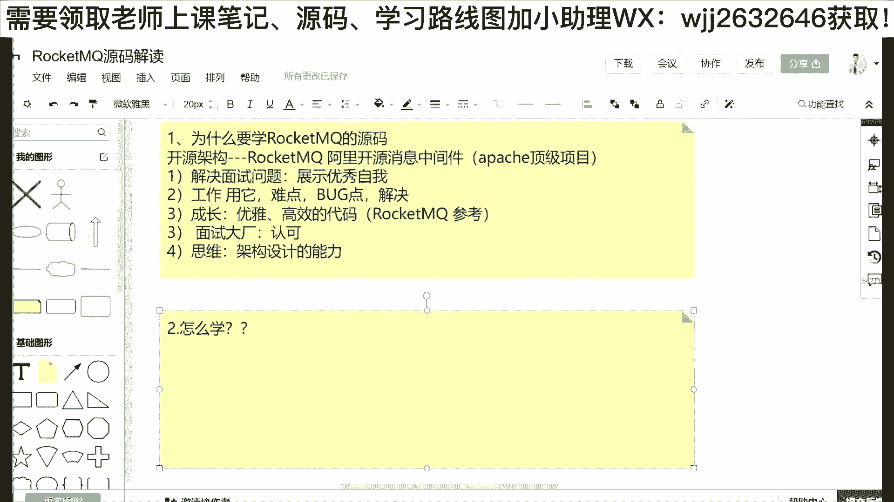
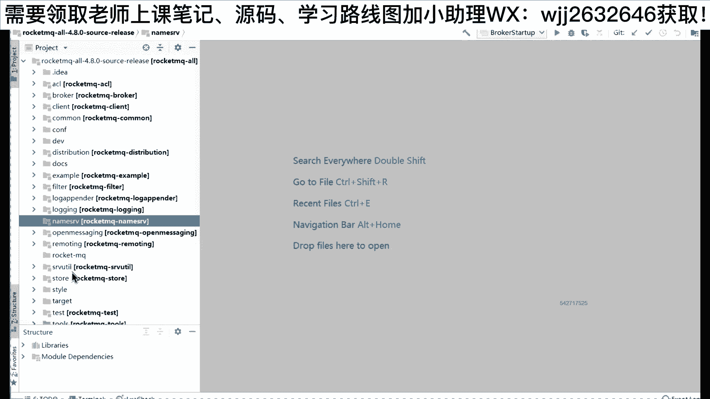
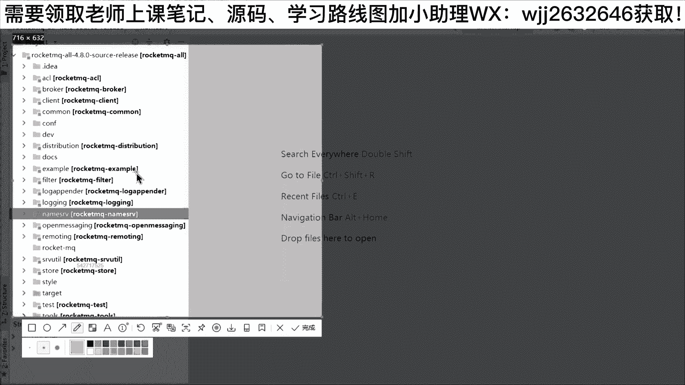
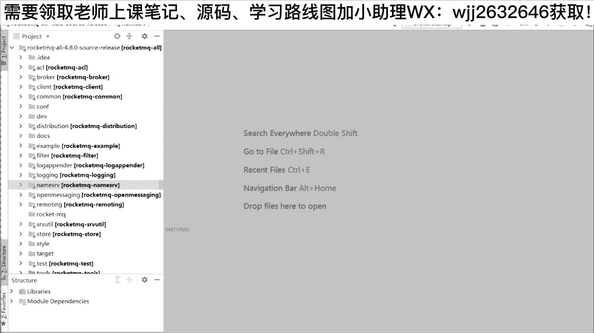
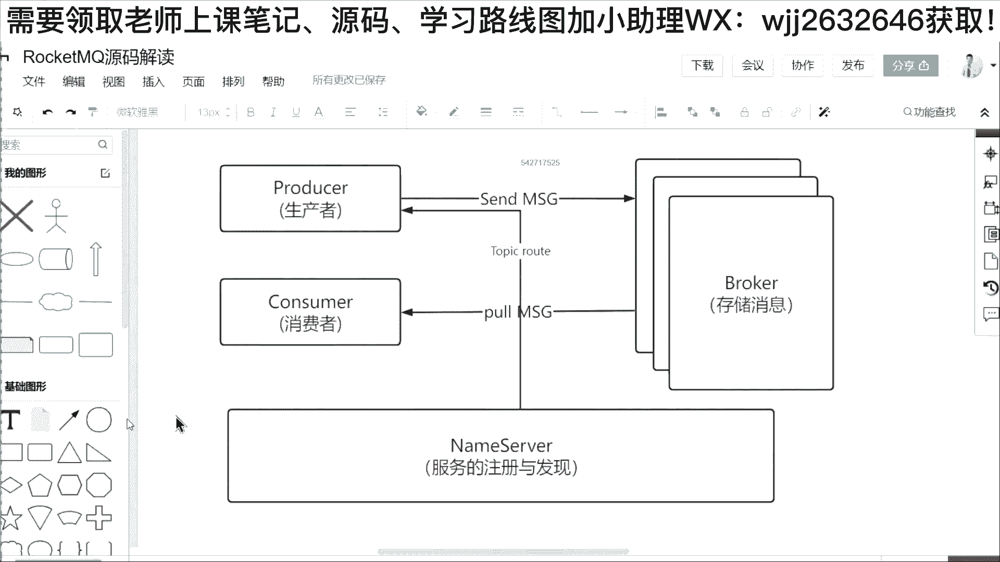
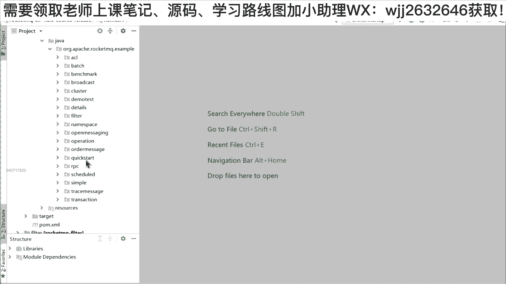
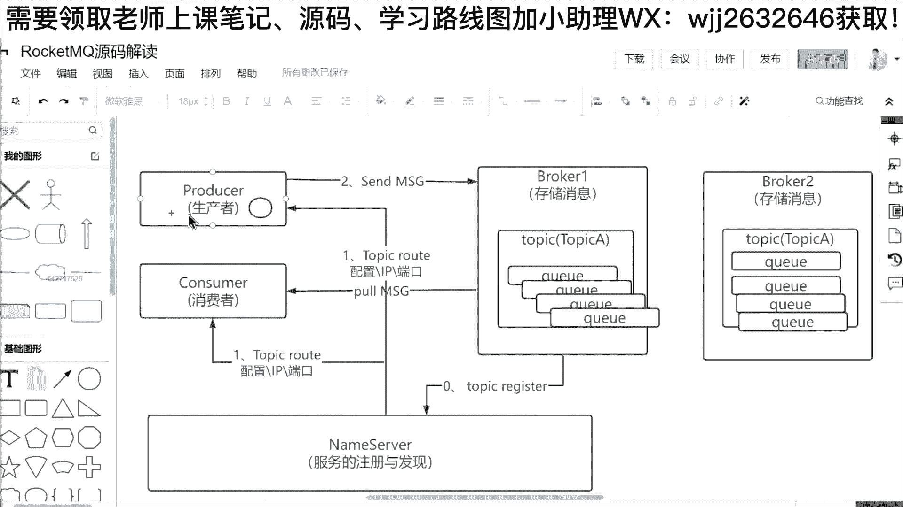

# 系列 6：P122：RocketMQ源码之JUC锁优化 - 马士兵学堂 - BV1RY4y1Q7DL

OK那首先的话呢，我们再进入第二个问题。第一个问题就是我们为什么要学，对不对？然后第二个问题的话就是我们该怎么学。😡，好，怎么学这个问题？首先的话呢给大家看源码好不好？😡，我李建老师的话呢。

特意给大家把这个runq比较新的版本啊，叫4。8。0的这个源码给大家下下来了。大家可以看到在这个源码里面呢，它有很多的子工程，什么ACL的bro的c的，然后comode configurefid的。

还有了一些什么叫呃exle，还有像loin，还有像name server，还有像stone，还有像其他等等之类的啊。所以大家去读源码的时候。😊。

第一个困难点会是什么？就是我把这个源码全盘下下来，你会发现这个源码里面大概有几千个类。然后工程的话有十几个。所以这是我们遇到的第一个问题点，就是我们无论去学这种什么像spring也好，像那种reQ也好。

对不对？或者只要是一个比较完整的大型的项目，那一定会遇到这样的问题。那首先。😡。

啊，我给大家一个忠告啊，李老师给大家一个忠告，如果你去想去学圆嘛，首先应该要进行一个梳理。这梳理什么了？梳理它的主线。😡，啊，那么首先梳理这个主主线该怎么梳呢？啊。

这个时候啊请在听的各位小伙伴跟着老李的这个思路，好不好？😊，OK跟着老李的这个思路啊，首先我给大家给画出来啊。第一个的话，我们要知道，如果说你要去了解rock源嘛，你必须要知道roq它是怎么运转的。😊。

好，那首先。大家知道。😡，在rock andq里面，他首先肯定会有一个叫做bro的东西。啊，这个b用来干嘛了？😊，给大家说一下，它主要就是负责存储消息啊，就是因为作为一款消息中间件，它的这个目的是干嘛？

就是有消息来了，然后发给我，我来存进去。所以在这个req里面有一个非常核心的角色称之为broker用来存储消息的。然后除此之外的话，我们知道一个消息中间键，它肯定不是说啊它单独的存在。

它有一个消息的来源。所以在一个消息键消息中间件的组成里面，还有一个叫做proder。😊，好，这个proder是什么？是生产者。😊，我们常说的生产者啊。😊，生产者这个生产者用来干嘛去发送消息。

所以呢大家可以看到啊，在我这里面我把这个箭头改一改。😊，就是有一个生产者，他要向我们的broer叫做send message，对不对？发送一个消息，或者是发送批量的消息，他都可以。好，那除此之外。

作为消息中间键，它的作用是什么？我把这个消息从生产者，然后发给这个broker之后，那是不是还有一个角色叫做consumer叫消费者。所以我再拉出了一个角色叫做consumer。😡，好。

这个康索码呢是我们常说的消费者。那消费者的话呢，其实在rock conQ里面啊，它是进行消息的拉取，我们称之为普尔消息。😡，喂。Poor message。OK大家可以看到啊，在我的这张图里面的话。

其实已经完成了一个消息中心件最基本的功能，对不对？就是进行一个消息的发送，以及进行一个消息的消费。好，那么在其实在真实的rockQ里面。😊，他还会有一个角色。

这个角色呢我们把它称之为nmo server。😊，就是如果你玩过。那个rocon的话，你会知道它有一个name server的角色，这个负责什么叫做服务的。😊，注册与发现哎。

为什么会要有一个 server这样的一个角色呢？啊，我给大家说明一下啊，就是我们在进行消息生产和发送的时候，往往你可能这个bro，它不是一个单体，因为大家都是追求分布式微服架构啊。

追求这种什么多主多层的这种架构。所以在真实你去部署的时候，这个bro它可能会有很多个，对不对？比如说我这个地方就画出三个，那三个的话，它可能部署在不同的机器上面，如果我作为一个客户端，对不对？

就比如说你的这个订单系统或者是你的这种比如说你的这种什么业务系统，然后你是一个proer，你是个生产者，你像我们的这个broer发送消息的时候，你发现它是个集群，它有多台。

啊这个时候的话啊我怎么去知道每一个bro它的IP地址，它的端口呢？所以啊在里面它还会。😊，还有一个非常重要的组成，就是这个name server。

这个name server就是类似于我们之前讲的这个ZK做 keep啊，它是一样的，它完成服务的注册与发现啊，所以这里面我要再画一条线啊。

就是我们的生产者和我们的消费者在正式去发消息或者是进行这种拉消息的时候，首先他必须做一点，就是把这一个相关的路由拉到。😊，ok这个地方我画一根这样的线啊。这个称之为什么？叫做topic。Root。

给大家说一下这个topic road是来干嘛呢？我们可以打开源码里面啊。😊。

像李老师的话呢，给大家解释一给大家介绍一下，在这个源码里面的话呢，它其实写了一个一些事例啊，这些事例的代码呢就是告诉我们怎么去使用roq。那么使用rock q的话呢，我给大家举个最简单的例子啊。

比如说像我这张代码叫做步发送生产者，就是我写这里面写了一个简单的man方法，这个man方法把它运行的时候呢，如果你要去向roq发送消息。那么你引入它的API引入它API的时候呢。

然后你 new出一个de m producer new出这这样的一个东东，对不对？然后在这个pro里面啊给他命个名字啊，比如说叫做g下划线。然后第二步的话大家可以看到你在发送消息之前。

你要针对这个proer给它设置一个的地址。😊。

啊，这就相当于是说我如果向rock q里面发消息，其实本质上面你只要设置name server的ad，设置它的地址。比如说我设置成本机127。0。0。1，然后端口是9876。这个9876啊。

其实就是我们刚才给大家画的这一个namemo server默认情况下面，它起的端口，就是你要在你的服务。😡，服器上面启动一台的话，首先你要把这个namemo server给它启动启动起来。

然后除此之外的话，你还要把bro启动出来。当然，namemo server和bro它都可以是多台。O那么这个name server的话呢，本质上它的多台是完成这种副本或者是完成这种备份。

就是它多台里面保存的信息是一样的。但是针对这个bro的话呢，它可能会有不同。就是一个bro对不对？它可能会存主题当中的一部分消息啊，比如说你定定义了一个主题叫做主题A。那么主题A底下如果有8个队列。

然后我有两个bro的话，可能在进行分布式部署的时候，四个队列在这一台bro一，然后4个队列在我们的bro2。😊，OK他可能有这样的一个设置。所以我们在进行发送消息的时候，大家可以看到，在我们的代码里面。

你如果向rockq发送消息，你只需要设置name server，然后设置完name server之后，然后再去进行一个叫做prod点star就是。😊，让我们的roQ进行启动。😡。

那你调了它这个方法的时后，请注意，在我们的这一个流程里面，你只要启动了一个prodduer生产者，或者是说类似的启动了一个consumer。

那首先它就需要从我们的lemo server当中去拿相关的路由信息。这个这个路由信息，我们把它称之为topic root，就是我们的相关的主题相关的东东。这个东西会包含什么呢？给大家解释一下。😡。

这个东西会包含，比如说。啊，我们的一些配置。啊，包含一些IP包含一些端口。啊，这个配置比如说我这个地方啊先不画集群，我把这个变形方画大一点，然后把这个线提上去。😊，好，把这个线提上去。

然后在我们的ber里面呢，把这个标题啊提上去。大家知道你在发送消息的时候，本质上面在我们MQ里面，它会有一个Q的概念。😊，大家知道MQ它就是messageQ，它就是一个消息队列，对不对？

但是在MQ的这个定义范围之内，它其实还有一一个更大的概念叫做topic。😊，叫做topic主题。啊，这个主题为什么去定义呢？就是在阿里里面或者在你们的这个业务场景里面，我们很多情况下面。

我可能要定义一类消息。比如啊如果我把rock andQ把它部署在淘宝，那么淘宝里面它会有各种消息。你比如说你作为一个生产者，对不对？这个生产者是一个什么应用呢？是我的订单系统，你像淘宝下了一个订单。

然后这个订单它属于服装类的，那是不是有一个对应的主题叫做服装的消息，你去下一个订单，这个时候它就会发送一条消息到我们的ro。😊，comp的，然后告诉你，我要写入一条服装的消息。然后除此之外。

那我可能下了一比如说下了一个叫做手机的订单。那这个时候那可能我发送消息的时候，还是发给rock q。但是在这个地方我会另外再创建一个主题，它标识着一类消息。然后这个主题的消息呢。

可能就是我们的这个手机相关的主题。OK好，所以呢这是我们讲的第二个概念啊，就是在rock q里面，哪怕是卡夫卡里面，它都有这样的一个概念，叫做topic。好，在top底下的话。

一般来说我们底下会划分成很多的这种Q队列啊Q。😊，1234啊，它有多个Q，就是在一个主题下面啊，像reconq默认情况下面，它最少会有4个Q。好，那么我去发消息的时候，比如。😊，说我举个例子啊。

我用这个东东表示一个消息，把它变小一点。😊，这个消息首先在生产者启动的时候，他需要去从我们name server当中干嘛要去拿取相关的配置路由信息。为什么拿到这个信息呢？我们来看代码。

在我们的这个demo里面，对不对？在我们刚才看到的这个demo里面，我把这个proder把它启动完之后，剩下来我就是写了一个for循环。这个for循环用来干嘛呢？就是for循环10次。

然后每一次new出一个message，这个message呢是re里里面提供的一个API啊，就是你如果要发送消息的话，在它原生的API里面。😊，就是这个里面引用的API里面啊。😊，ORG阿帕奇rockq。

然后coma，然后message，然后一个大写的message啊，这是一个类啊，你把这一个类然后扭出来，扭出来的时候，你需要去定义你的这个消息是发到哪一个主题所以在它的第一个参数里面，对不对？

你可以写上对应的主题啊。比如说这个地方我可以改一下我发送的时候，我改一下叫做topic test。😊，或者是top个A，对不对？那么就是这条消息，你就告诉rockQ，我要发送到topic A。

然后除此之外的话，在我们每一个消息里面还会加一个tg。😡，这个tg的话呢，它是一个二级标题。因为你像淘宝里面如果要发送消息的话，你衣服那衣服的话，那我有男装女装，我还有童装。

是不是我们虽然是归到一个主题，但是很多时候我还要做一些消息的过滤，做一些消息的这种分类。这个时候你就可以用上二级主题。这个二级主题呢，我们把它称之为tg。好，那么发送消息的时候，它会有两个核心的点。

就是核心的数据部分，一个叫做kis。这个key的话呢，一般情况下面可以把你的订单作为送物。就是我们刚才如果下了一个订单，有一个订单ID那么你可以把这个唯一的ID作为key送到roq啊。这个key的话呢。

以后如果说你要去查相关的信息，你可以根根据这个K。😊，快速的定位。但是这个消息它的主体是。😡，哪个部分是最后的这个参数，就是你发消息，对不对？那这个消息的组成，比如说你购买了一一台手机。

或者是你买了一件衣服，那么是不是它会要生成一个消息体，那这个消息体的话，在roq或者是其他的任何MQ，它都是这么规定的，只会做字节数组啊，就是你如果想传一个str。

可以比如说传一个hello word没问题。啊这个时候你把它转成一个by数组啊，然后呢把它的这个啊其他东西设置一下，这样的话呢就完成了我们一个消息的创建。😊，好，所以完成消息创建之后。

我们的生产者发送消息就变得非常简单了，就只需要去调用它的send方法，就是把这个message把它 new出来之后，把它作为一个第一个参数送入到我们的send方法，然后呢如果这个消息有没有发送成功。

对不对？这个地方我可以起一个异步的监听，所以我你了一个send call back的这样的一个回调方法，或者称之为回调函数啊，这个里面呢会有两个方法，第一个方法叫做un success。

就是如果说你这个消息发送成功的，那么它就会触发un success啊，给你进行打印，你可以拿到send result的结果，如果说中间发生异常了，对不对？还有一个unex啊，把这个相关的异常进行捕捉。

到底什么地方处发生了问题。所以这个类呢。😊，就是你在去学源码之前，你必须要知道的啊，我作为一个生产者，我要去发送消息，对不对？这个时候首先前面的步骤就是new出一个proder。

然后设置name server的地址，然后再启动，然后再分别new消息，然后再进行发送。好，那么基于这个点大家发现没有？你去往roQ发送消息的时候，本质上面它只配name server。😊，对不对？

他只配name server。因为在rockkenq里面，它还有一个非常重要的角色是什么？是bro。就是你实际上这条消息它并不是发给name server的，不是发给他的。😡，因为那么so他只做什么？

😡，他只做服务的注册与发现，大家可以看到这张图，他只做这个服务的注册与发现。所以大家可以看到，首先在我们这个流程里面这个步骤。😊，他一定是发消息前面的步骤，比如说他是第一步，对不对？

然后第二步你才是发送消息。😡，OK就首先我们先不讲启动，对不对？比如说我把这个name server把它启动了，把我的bro把它启动了。那启动完之后的话，作为我生产者发送消息的话。

那首先是不是第一步要去从我们的name server当中获取相关的路由，然后拿到这个路由之后，我才知道哎，你刚才比如说你要去向topic a发送消息啊，因为它有了路由。

那么我就知道这个topic a应该在哪一个bro上面，因为刚才老李讲过这个bro，它可能是个分布式的，它可能会有多个，对不对？比如说这个是bro一，那这个地方有个bro2。😊，甚至像reQ里面的。

它还可以这么玩。就是你如果定义的这个主题叫做topic a。😡，啊。topic A好，那这个topic A呢，它在定义的时候，可以说把它跨到两个bro里面。哎，就是在我们的每一个。

相当于是每一个主题底下。每一个broty。像他都有topicA。并且你发送消息的时候，它默认情况下面在两台broer上面创建一个topic A，并且它都是主，它都不是从，他都不是备份。他发消息的时候。

我们展示出来的这一个topic A，它就有8个队列，就4个队列在我们的broke一四个队列在我们的broke2，就是你发消息的时候，如果中间像这个broke一，它挂了，没关系。😡，挂了的话只有4个队列。

对不对？没了，但是我还有4个队列，对不对？就是我整个去往这个top game里面发消息的话，那这个时候我是不是还有4个队列，这个时候它就可以确保高可用。😡，所以呢他就通过这个name server啊。

结合我们的bro完成整个消息的一个发送。同理你可以退啊。那么做我们的consumer，对不对？我们消费的时候，他其实也是这么玩的。😊，因为这作为这我们的生产者和我们的消费者。

它本质上面它都属于我们的客户端。😡，嗯，比如说这个地方哎。😊，Okay。就是你生产者和消费者启动的时候，生产者就是往里面发消息。然后消费者的话呢就是从里面去拿消息。😡，它只是一个过程的相反。😡，啊。

因为作为消息中间介的话，他要完成一个叫做异步解偶，还有销风填谷的功能。本质上面呢它是做一个消息的中转啊，就是你发消息发给我，对不对？然后这个时候的话呢，我就相当于中介一样的。

然后再把这个东西呢推给我们的消费者。这样的话呢，就可以确保我们之间完成一个结偶。这消息只要到了我的这个地方就OK了。剩下的工作了，消费者他会监听我，然后我把消息推给他，这样的话呢。😊。

也可以完成我们的一个异步，完成我们的结耦功能。😊，好，今天只讲roQ吗？今天你想听其他的我都可以讲啊，但是我们的还是抓核心，抓主干好不好？然后大家可以看到在这个图里面呢，其实还少了一个步骤，什么步骤呢？

😊，就是我问一下大家，作为numb server和broer。😊，谁先启动？是name server启动的，可以在公屏上面刷个一。😊，broker启动的可以在公屏上面刷个2。😡，谁应该先启先启动。😡。

有刷一的，也有刷二的。有的小伙伴说，bro重要一点，那他当然要先启动。😡，哎，那问题来了。如果它先启动的话，那么这个路由信息你要知道name server里面的路由信息并不是自己去生成的。

而是说一般来说你启动一台，就像我们的name server去注册的。😡，所以我这个地方再把这个启动流程给大家回顾一下。😊，就是其实很多这种有什么服务注册与发现的这种东东的话。

你首先应该要把服务注册的这个插件，它的这个组件先启动。😊，啊，因为呢他需要去获取一些路由信息，对不对？你broker如果先启动的话，我问个问题啊，如果这个东西先启动，那他是不是要把这个路由信息发出去。

发给谁呢？你这个没有起啊。😡，对不对？所以大家如果去玩这种double也好，玩这种什么一些其他东西也好，对不对？他如果有服务注册组件的话，一般是要先把服务注册的组件先启动。

所以这个流程是先把name server启动，为什么要启动它？因为先启动我的话。😊，这个时候你的broke一b2bro3broke4，对不对？哪怕你跑了一段时间，过了两天，你们老板说哎。

我再给你分配5台机器，你可以再部署两台rebro啊，来了一个5来了一个6，对不对？你再往里面加就可以了。所以它的流程是我们bro如果启动的时候。

它就需要向我们的这个name server去发我们的注册相关的信息。所以这里面还有一个流程。就是当我们bro启动的时候，我们要向name server里面去发起注册。😊，啊，所以这一步应该是第零步。

就是在我们去发送消息之前，对不对？他要干嘛进行一个topic相关信息的reg。😊，就是进行一个相关主题的注册。因为这个东西如果不注册的话，那么我生产者，我消费者，我再去发消息，或者我要去消费消息的时候。

😊。

