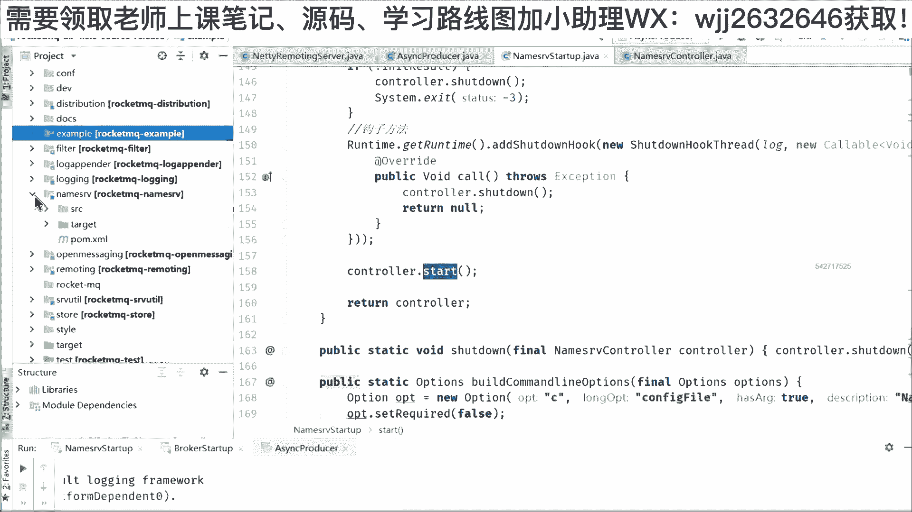
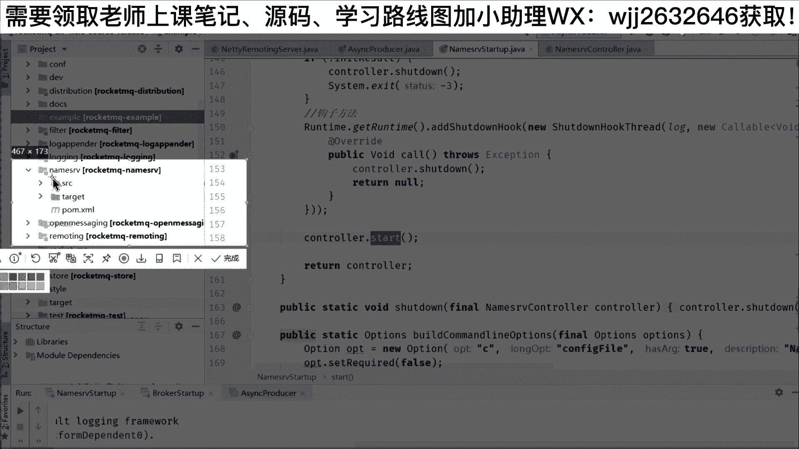
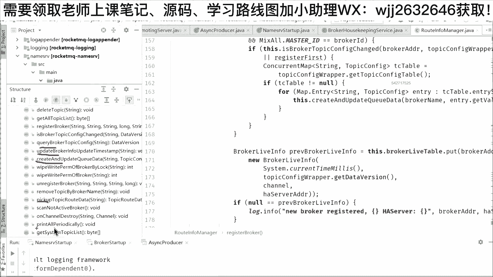

# 系列 6：P123：RocketMQ源码之GC优化 - 马士兵学堂 - BV1RY4y1Q7DL

哦，我的这个路由信息从哪里来呢？😡，所以啊大家记得的一点，所以在我们源码里面，我可以给大家演示一下啊，给大家把这个romeQ打开。然后一般情况下面，我这地方配了两个啊，一个是bro的启动啊。

就是在源码里面启动，其实很简单，就是找到它的一个源码启动类，叫做bro start up，还有了一个叫做n server啊，这是一个n sRVn server的一个简称。

然后它也一个star up的一个启动类啊，比如说如果我要把它启动的话，首先。😊，需要把name server先把它跑起来。😡，好，然后把它跑起来之后的话。

它会返回一个the of boot success，对不对？然后的signchizable就是他们进行这种传导数据的序列化，采用的是jason格式啊。然后第二个我再把这个bro把它启动。😊，Yeah。

Okay。所以它不是这个bro的服务先启动，而是说注册中心先启动。你看到当我们的这个bro启动的时候，它自身启动的端口，对不对？我的IP地址，然后我的这个机器的名称，除此之外。

它后面and加了一句number的地址是多少。所以当他打印这个的时候，就说明在我们的这个bro启动的时候，除了自身把这个服务把这个当端口开始占用。那么还要去向n server发起注册。好。

那么发起完注册的话，这个时候大家可以看到在我的生产者的这里面我就可以进行发送消息了。比如说我像这个top gate里面发送一条这样的消息。好，发送10条啊，我就可以把它运行起来。😊，Yeah。

大家可以看到。😊，我发送完之后的话，调到这个send方法，然后通过这个回调函数叫做send call back里面返回的都是send ok就是send，就是我们的这个状态啊。

就是我们打印的其实都都是这个点，就是on success里面，然后打印里面返回的一个对象叫做send result里面的内容。这个reult里面会包含哎你的这一条消息有没有发送成功。

成功的标识是send ok。然后你这个消息在我ro里面，它有一个唯一的message ID。😊，啊，这个ID的话呢是一个很长的序号，就代表它是唯一性的ID。然后除此之外的话呢，还有一个消息的偏移量。

就是因为消息要去进行存储的话，它必定会有一个偏移量，这是一个offset。除此之外的话你。😡，可以看到在我发送消息里面，他还告诉我这条消息，它的相关的Q，就是因为我发送的是一个topic a的主题。

但是在这个top a主题底下，你可以看到有Q IDD等于一的，代表它是这个top a的一个Q有ID等于零的有ID等于二的，还有ID等于三的，也就是我们刚才的这个10条消息。

它会均匀的分布在我们的Q0Q1Q2Q3就是总共是4个Q，然后在每一个Q里面，我们可以看到啊它有一个Q的of。因为Q就是我们的队列嘛，在队列里面的话，每一个队列它都是从零开始，对不对？所以像第一条是0。

然后呢如果在跑到Q一的话，这个地方变成一，然后再跑下去就变成我们的2所以这是我们可以返回相关的东西。好，我们就今天不去讲太多的应用啊。我们今天首先讲的为什么要学源码。然后讲了中间的一个点。😊。

怎么去学rock的源码，先把它搭起来，先把它的整体的东西把它运转起来，对不对？然后这样的话大家才会对我们rock的整体有个概念。那么这里面我再来讲一点，就是如果你想去读rock的源码。

其实只要读三个方面的内容，哪三三个方面呢？大家知道第一个核心就是刚才我们所说的启动流程。😊，就是你任何的一个，比如说源码框架也好，对不对？那首先是不是我要去了解里面的启动流程。😡。

所以第一个点非常核心的叫做启动流程。然后第二个的话，我们知道作为roQ里面它只有两个功能，一个功能叫做消息的生产。所以我们看消息的生产过程。然后第二个就是消息的消费过程。所以大家知道啊。

就算我们下载的roQ里面有这么多类，对不对？几百个类几千个类。但是大家其实需要读的无非就三个流程。第一个怎么启动的？第二个的话，消息怎么生产的？第三个的话，消息怎么消费的。😡，好，那么。

首先呢我们给大家说一下啊，我们可以看到前面启动的几个类。第一个里面我找到这个name叫做name server start这个类。我们来分析它的启动流程好不好？

然后大家可以看到在这个name叫做name server这个类里面呢，其实本质上面跟我们写的一般的类它没什么区别它里面呢也是一个man方法，只是man方法里面调了一个man，然后把我们的里面送入进来。

对不对？然后在这里面可以看到我这个地方加了一个注释，这个注释是理解老师写的啊，就是我讲课的时候，我讲的时候。

我写的然后它在man方法里面拿到了一个叫做name server的 controllertroll，也就是在里面呢，它的这个写法跟我们写的这种叫做 vc啊，写这种什么 boot非常的类似。

它也使用到了一个controll类啊，只是说它通过一个叫做gr server就是这个服务的注册与发现的这个启动类里面啊，本质上面。😊，也就是他用的controll啊，大家可以看到前面这些内容。

这个东西就是设置系统的参数，然后判断一下我们的命令行啊，就是我们是就是进行启动的时候，我可以在一些命令行里面加些参数啊。所以这个地方呢也可以判断一下。然后除此之外的话，大家可以看到。

其实在rockQ里面它的端口是绑死的。😊，啊，就是如果有面试官问你roq怎么去改他的name server的启动地址啊，我可以告诉你，外部改不了，就是他没有配置参数去改他的name server的地址。

因为这个端口写死的就是9876。😡，OK所以大家可以看到啊，这个地方的话呢是写死的。如果要改的话呢，必须要去改它的原嘛啊。然后除此之外的话呢，就是我们一些启动的杠C的参数的一些解析。好，紧接着往下面走。

都是一些判断啊，就是它加了一些什么启动的杠P的参数的解析。然后除此之外的话呢，来判断一下它的一些什么它的一些后相关的信息，对不对？然后再接着往下面走啊，这些东西你都可以理解成它都是解析一些参数。😊，啊。

就是我们在配置的时候有pro的参数，对不对？然后呢，它可以把它打印出来，把它把它设置进去。然后最关键的一点，因为本质上面他要去用一个controller。

所以呢它扭出了一个跟他同名的叫n server的controller。😊，啊，大家可以看到啊，这是一个构造类啊，这个构造类里面呢就是分成了一部分的信息，都是前面的配置配置，对不对？

name over的配置late因为 compute本质上面用late体启动的，所以它late体的配置，还有呢包括里面的一个叫做key value configurefi manager它的配置。

还有包括我们的root in manager。😊，就是我们的路由相关的信息，还有一些什么叫做什么keep alive吧，这是一些什么我们的主机相关的一些啊心跳啊，一关相关的服务信息。

还有一些配置相关的信息，对不对？所以你可以看到这个le server，它其实启动的时候，它无非就是带了这些参数，然后通过它的构造方法，然后拿到这个controller。

然后拿到这个controller之后，对不对？然后紧接着。😊，大家可以看到我们就可以返回了。😊，可以返回到我们name server controlt的这一层啊，返回到我们的前面。😊，好。

完成了我们的核心步骤，一就是new出一个conttroroll，让但是它启动真正的地方是在我们的star方法里面。😊，啊，就是从源码的启动流程，大家可以看到啊，其实它最核心的还是这个star。

在这个star里面呢，大家可以看到，我们前面只是把这个controller new出来，但是它并没有对它进行初始化。所以呢我们可以看它的in这一个初始化的方法。然后在这个初始化方法只要干完之后。

其实整个流程它就结束了。看到没有？整个流程最后面初始化之后，最核心的第三步，就是除了去设置一个叫做钩子方法，什么叫勾子方法呢？就是我们启动完之后，我们要通过外部的命令把它关闭的话。

那么我就需要去通过这个钩子方法啊，你向我发个命令，这个时候我就可以调controll点 down。😊，啊，所以这个地方呢设置一个钩子，设完之后，把这个controllr初始化之后，它就会到最后一步。

叫做它的star方法。😊，好，首先我们看初始化的这个方法。在初始化的这个方法里面，我写了很多的注释，就是作为一个name server作为一个服务的注册中心。

其实本质上面它肯定要去嵌叫做什么启动网络监听网络。所以呢它要去创建我的remoing service，就是相当于我要去监听一个网络，它里面用到了一个laty的主件啊，这个东西我们就可以先不看。

反正就是相当于是说我扭出一个laty remote service，到时候我把它注册上去，我就会去绑一个端口。比如说我们之前讲的9876这个端口，然后除此之外，我还要开启一些定时任务。

这个开启定时任务给大家说一下，因为这个服务的注册与发现这个中心，它要干的活，不单纯只是完成服务的注册与发现，它还要完成一些我们常说的集群相关的功能。😊，就是我们有broke一注册上来了。

有broke2注册上来了，有broke3注册上来了，对不对？那么有可能你的这一台，比如说像broke3。😊，他可能发生了故障。那发生故障之后的话，那肯定跟我name server之间。

我可以感知到为什么我们中间肯定会有心跳机制。所以这个地方我就可能要采用扫描的方式。😊，就是我定期扫描一下，如果发现这个brook3，它的心跳信息已经超时了。比如说超过120秒，我没有收到了。

这个时候我就认为啊这个broke3它已经是掉线了，它已经是宕机的状态啊，所以我就需要把相关的路由给剔除掉。😊，啊，就是我原来在注册的时候，我这个top a底下有可能有有什么有12个，对不对？

除了这里面的4个，这个4个之外，还有一个brorke3的4个。那当我的broke3如果宕机了。😊，那是不是我要告诉我的proder，还要告诉我的consumer，告诉他们，哎。

第三台broker他已经不在线了，对不对？他已经是下线状态了，你发消息的时候或者是监听消息的时候，不要再从这一台bro三上面去进行处理了。OK所以这叫做故障的转移啊，然后我们继续走代码啊。

再走代码的时候，我们先把这些东西慢慢的放啊，本质上面它都是启动了一些什么定时任务，定时任务，定时任务，对不对？去扫描去打印，然后呢去扫描OK然后做完这个事情之后。😊，他就会返回一个te，然后返回一个t。

我们再来看。😊，初始化的方法仅仅只是初始化，对不对？最终运行的话要调它的star方法。所以在这个star方法里面呢，它其实只完成一件事情，就是把我们的reming service点star。😊，啊。

这个地方我给大家说了叫做启动NRS组件。这什么叫NRS组件呢？就是它本质上面是基于累体。😊，La体。So what。🤧啊，然后。这叫做latetyso啊remoing server啊NRS。😊。

remoing RRET。So。这个组件。啊，所以它是NRS的一个简称，就是把它然后点star。大家可以看到把它点散的时候，其实内部呢它就会去调我们lateate的服务啊，这一节他用了封装。

用到的是我们lateate当中的serv but strap。😊，在里听课的同学有没有玩过laate的？😡，如果你玩过lay的话，你会发现这样的代码非非常熟悉了。就是当你要去启动一个lay服务的话。

就会用到lay里面的叫做servver butstr，然后调它的点group方法，然后调它的点什么channel方法，然后设置相关的参数。设置完最后的话呢，就调我们的这一个叫做差的hand，对不对？

然后调完的话往里面去添加相关的什么pe添加相关的这一个handler，然后进行对应的处理。一般来说，最核心的就是这一个serv handle。😊，就是相当于只要说把启动之后，一般来说有请求来了。

就交给这个serv handle进行最核心的业务处理。好。😊，那么再回来啊再回来。😊，再回来啊，刚才其实我们已经把rockq的这一个启动流程，对不对？给大家差不多讲了一个大概啊，但是其实大家发现没有？

在读源码的时候，最核心的并不是我们把这个源码给跟了。😊，就是这里面我给大家一个这样的建议啊，就是读员嘛。😊，他最关键的点。或者是大家最有收获的点是什么？😡，在这里听课的几百位同学，你给老李说一下。

你们觉得读圆嘛？如果说你想读，那是不是不是说简单的把这个流程给过了？😡，而是说要去找源码当中的一个亮点。啊，赞不赞成老李这个观点啊，赞成的话可以刷个一。😊，啊，这是我们读源码的时候。

其实本质上面不是把这个源码哎呀，第一步、第二步、第三步、第四步、第五步、第二步把它列举出来，然后就OK了。本质上面是要抓亮点。为什么？因为读源码最关键最核心的点。😡，我们要面试啊，我要展现优秀的自我啊。

你不可能跟面试官说，我读了ro的源码，他的第一步，然后启动什么？第二步又拿了个组件，第三步又拿了另外一个组件，第四步又走这个流程。面试官听到的话，昏昏欲睡，对不对？他想听哎，你读了ro源码。

你到底从这个源码里面收获了啥？好，我们就讲他的一个亮点。😊，大家可以看到，我把rockq里面最核心的一个包叫做namemo server给它展开。

是这个包。就是刚才给大家介绍的这个服务的注册中心啊，是它的一个子工程叫做name这个工程。然后在这个工程里面，我们打开它的SRC，打开它的代码，你会惊奇的发现，其实这里面的代码总共没有几个类。😊。

啊，它只有那么几个类。第1个keyY6confi很明显就是一些配置。😡，就是我name server，我在启动的时候，我可以设置很多配置，所以它是一个key value的confi。

然后第二个叫做postpost搜是什么呢？啊，post搜就是有请求来了。😊，啊，就是我们刚才所说的。😊，你在这里面是不是要像我namemo server发起topic的注册？然后像我生产者。

还有像consumer。如果说你要去启动的话，你也要从我这里拿取相关的路由。所以我是不是要有一些进程，或者是有一些postso来处理。所以第二个部分就是proso里面也只有两个类，并且还有一个是测试类。

😊，一个集群的测试的类。然后最核心的其实就就是这个deport request错。然后第三个部分叫做remote inform，就是我们相关的路由信息。然后在路由信息里面呢分成了两个部分啊。

一个叫做broker housekeeping啊，这个service，这是我们常说的bro的一些也保持相关的信息。但是最核心的应该是这一个叫做ro in manager。😊，就这样的一个类。

大家可以看到这个类非常非常的大非常非常的长。我给大家解释一下，就是所有的路由注册相关的信息保存的其实最核心的都是这一个管理类。😊，为什么是个管理类呢？因为在这个管理类里面，它定义了很多map。😡。

看到没有？比如说这个地方有个哈y map叫做topicq table，就是我们主题对应的队列信息。然后还有一个叫做broker address table是什么？也是一个哈西 map。

里面存储的是broker相关的信息。好，下面的话，如果你搭建了一个集群。那又有一个m，叫做cast address map。😊，对不对？也是一个哈希麦。然后还有包括我们的一些心跳，哎。

这个地方也有一个哈希麦。还有包括你要去，如果说你要去过滤消息，因为我们刚才讲到这个tg的话，是个二级目，它可以它可以过滤消息。那你也可以设置专门的过滤消息的服务的列表。😊，所以本质上面啊，你可以发现。

其实name server。😡，他有没有进行磁盘的存储？他是一个纯内存的，对不对？就是他除了定义这些map之外，你可以看到。😡，下面。下面这个。给大家看到啊，把它构造出来。😊。

就是调大了调它的这个构造方法的时候，把这个map扭出来，并且new出来的时候，它也会去初始化的容量。就是它不是默认的这个哈西map。因为大家知道默认的这个哈西map一般情况下面，它的数组的长度是多少？

😡，是16。对不对？所以他在new哈西 mapap的时候，因为你要知道一个rockq启动的时候，它的什么Q啊，它的bro address啊，还有包括它的一些心跳相关的信息啊，一些过滤信息它都很大。

所以它 new出哈西 mapap的时候，默认它让它的容量，比如说像它的Q相关的信息是1024。而像它的地址相关的信息是128，而像它的一些什么心跳信息是256，对不对？那除了这个集群啊。

因为集群里面呢一般数量不会太多，所以的话呢它的这个容量就是32。😊，所以大家看到没有？哎，这个地方跟我们平时写代码就有差别了。😊，如果说你是经常去写代码的小伙伴，我你有一个哈信 mapap。

我一定会什么把它的初始容量就这个地方我不会设置。😡，啊，就是如果你能够去预估它的数量。😡，如果有这样的一个业务场景，我建议啊可以把这样的数量设大一点。其实大家知道我在这个业务场景当中。

我把它启动往这个map里面放的肯定是几十上百个数据。那么当然我在第一次初始化的时候，我就把它的容量变大了。😡，去减少我们什么扩容带来的一个开销。好。这个还并不是关键点啊，这个是老李随机点一点的。

其实在这个m的关键点是什么？大家发现没有？它里面提供了很多这种get方法，还有提供了dele的方法，还提供了一些set方法，还提供了一些什么其他7788的方法。

就是我们把这个方法的列表可以拉出来给大家展示一下。😊，它其实本质上面就什么quarral。😡，get对不对？reg还有一些什么remove，还有什么update，还有quarrual。

还有一些什么pink，还有一些什么其他的东东就是。😊。

其实你看一个类看一段代码的时候，你会发现本质上面。😡。