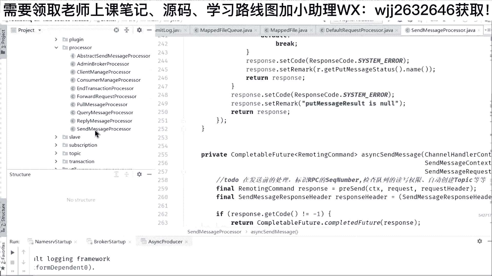
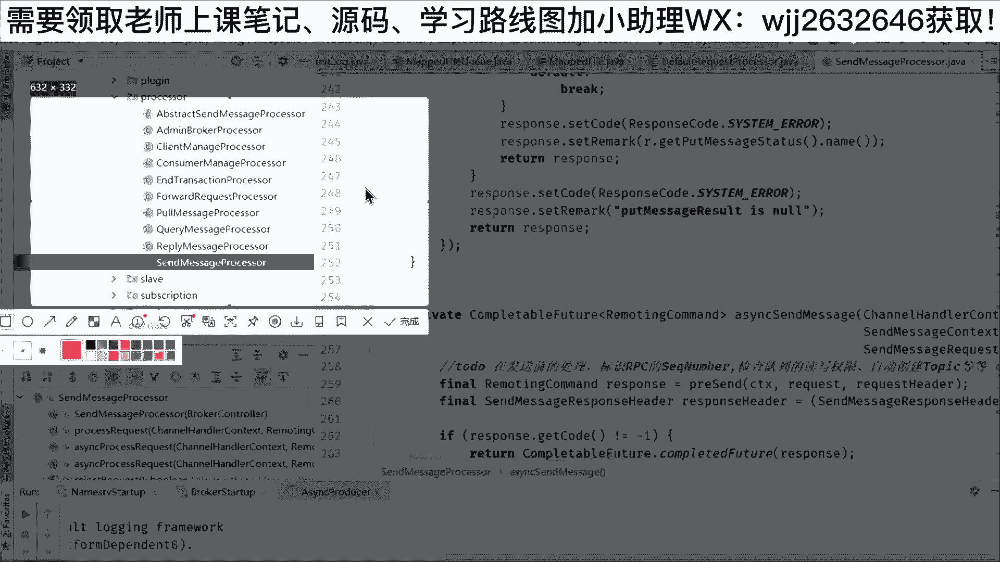
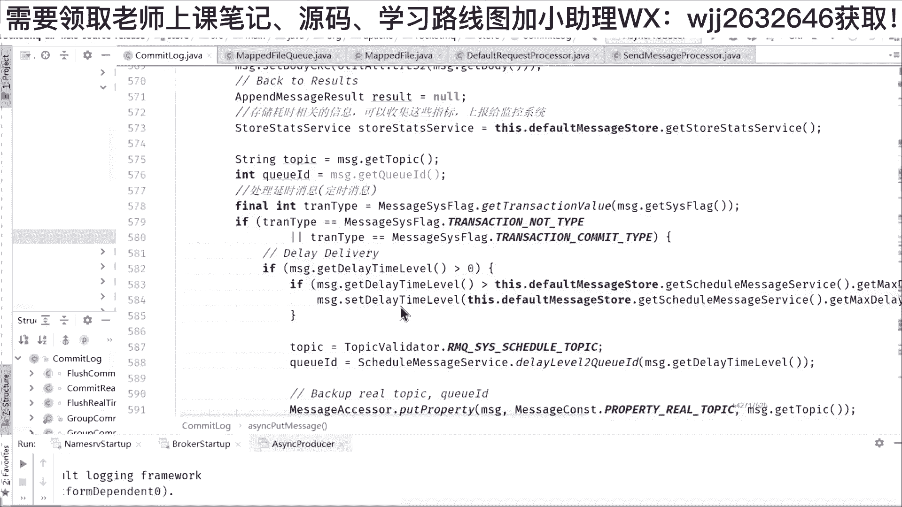
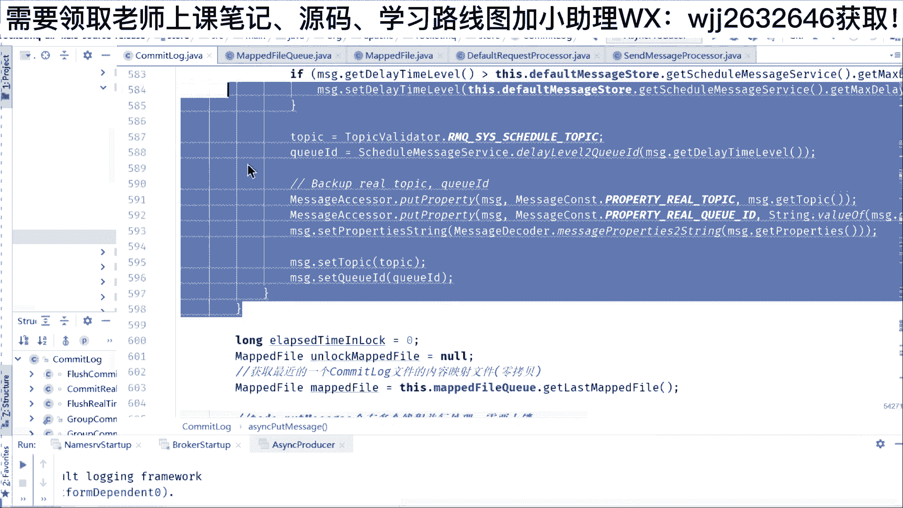
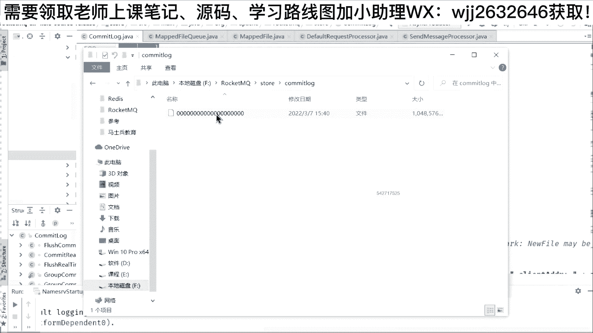
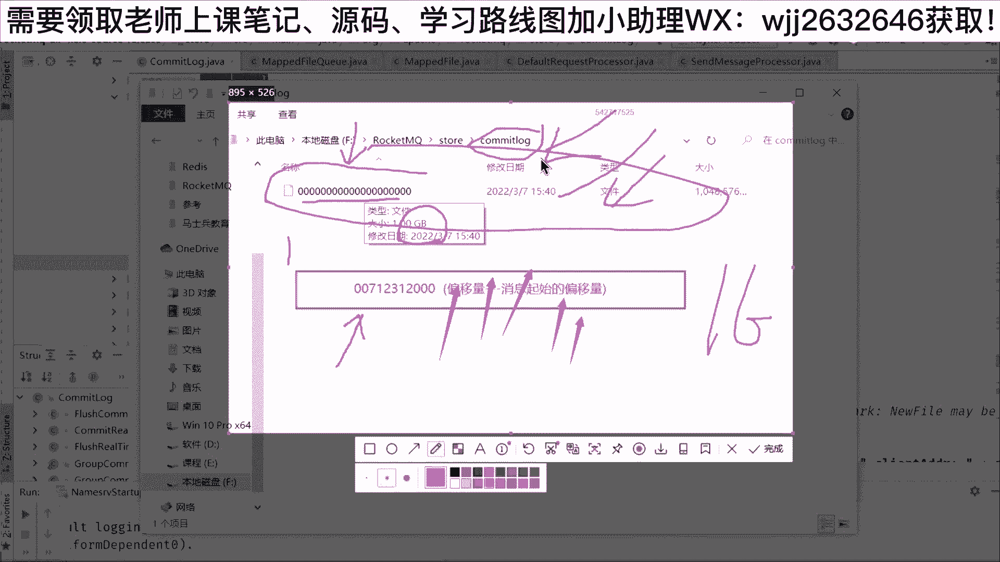
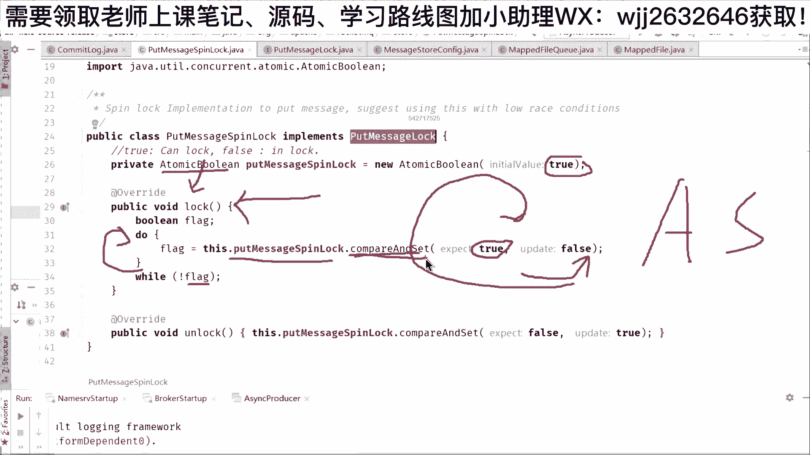
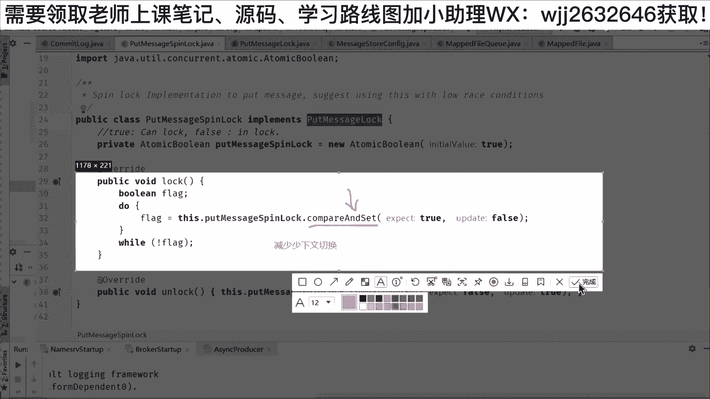
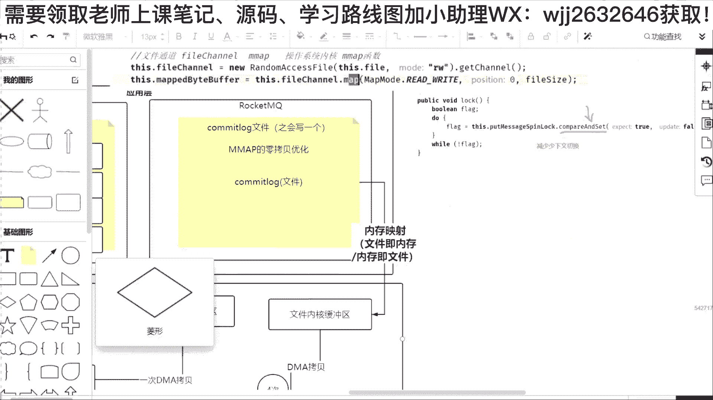

# 系列 6：P126：RocketMQ源码之Netty的运用 - 马士兵学堂 - BV1RY4y1Q7DL

可以看一下它的效率，就如果采用了这种M map。按照我们之前的这个推算，就是老李做的这样的一个测试，一次DMA2毫秒。😊，然后再加一次DMA2毫秒，再加一次CPU拷贝200等于204毫秒。Yeah。啊。

就是我们如果进行了这种零拷贝技术优化的话，大家发现没有？之前是404。😡，如果没有零拷贝技术，但是如果我们使用的零拷贝技术就变成了204毫秒。所以在这个点是不是可以极大的提高我们的效率？😊。

所以我们通过读原嘛的时候啊。你可以看到在我们的这一个mified的这个init这个方法里面，明显就进进行了零拷贝。然后拷贝完之后，请注意拷贝完之后，这个点m方法。

它就会把刚才的这个文件fi文件和我们的一个叫做map beat buff给它进行一个一一映射。然后映射完之后，我们再点哎，这个地方。😊，哪个地方用到它？哪个地方用到了他呢？我们可以接着往下面走。

看到这里。啊，应该是。往下面走。这是mb fat要到我们的。Community logger， community logger。这是追加。对。啊，往下面走，有一个专门存储。わ下面た。

OK这个找不好找啊，我们换一个思路，好不好？😊，我们再往下面换一个思路，换一个什么样的思路呢？就是刚才讲到我们若。😊，QQ里面。我们讲到了。😊，我们消息的启动流程对不对？我们讲了亮点，中间是内存。

还有包括我们的这一个le server里面呢用到了读写锁。然后作为消息的生产过程，我们讲个过程好不好？就是消息生产过程的话呢，我们先跟个流程，什么流程呢？就是当我们的这一个生产者，如果发送消息的时候。

它中间会通过lay里面的协议啊，它自定义的协议，然后发送到我们的bro。我们bro接收到这个消息之后，是不是要把这个数据写到我们的磁盘。😊，对不对？所以我们就跟这个流程啊。

当然作为生产者中间这个地方它涉及到网络通讯，我们就先把它过掉。我们需要找到的这个出发点就是作为run good broker。😊，他怎么去接触他？所以我们可以找一个这样的类。叫做。Pro搜索。

Requester。Default a request proposal诶。大家看到这个类。啊，大家看到这个类没有，叫做defa request per。哎，这个类代表什么啊？

就是代表我们经常所说有消息来了，我们怎么处理？当然这个类你会发现它是namemo server当中的那肯定不行。😊，Message it。

request proposal default message proposal，然后有一个。往下面找啊。

quaual message proposal应该叫做send message proposal。你去行消息发送嘛。所以我们找到一个跟我们名字差不多的啊，叫做send a message。

其实这个地方我给大家把两个东西copy出来啊。😊，三嗯。找嘞。send message processor大家可以看到这个类的话呢属于rock的bro processor里面提供的。😊，也就是说。

如果你去找目录也比较简单。就在recon的源码里面，我们可以找到它一个包叫做broer。这个包。这个包的话呢就专门负责我们bror的一个相关处理，对不对？然后在里面我们可以找到。😊，嗯。

找到这个目录叫做prooc这个目录啊。然后在这个posts目录里面。就有我们刚才所说的send a message proposal。请注意在这里面呢还有一个叫做que messagepost啊。

就是我把这两个东西给大家贴出来，然后放到我的架构里面。😊。

好，给大家指一下啊，就是最终生产者发送消息的时候，接收到他的这个处理是send message per。因为你要发消息，而如果你是消费者，那么你是不是要去查消息。

所以的话呢它主要的一个类叫做query message per，你去拿消息的时候，就是调我们的query message per。😊，啊，就是通过我们的架构，通们的图，大家知道一个是生产者的入口。

一个是消费者在我们bro的一个入口。好，那找到这个之后，我们紧接着干嘛？😊，就是有消息来了，首先会调它的第一个方法叫做po request，然后里面会带上我们熟悉latey相关的东西的一些参数啊。

因为它网络传输用到的是lay，所以呢lay里面有一个叫做china handle了 contest cTX，然后它消息放哪里了？放它的一个叫做reming command，就是放这个request。😊。

就是一旦说生产者也要发送消息，那么消息就会到我们的bro里面的这个方法里面来啊，中间经过了late体的一些处理啊，就是经过了lateate的一些什么handle，handle handle处理。好。

那经过这个处理之后，大家可以看到。😊，他为了提高性能。大家发现没有？大家平时写代码的时候，有没有这种方式，我去调一个方法，然后拿到这个方法之后，再调它的get这个方法。😊。

这是一种典型的多线程异步调用的方式啊，玩过异步调用的这种方式的同学，可以在公屏上面刷个一啊，没有的话，你可以刷个2。Yeah。ok。😊，啊，在听圆码的各位小伙伴，你们没有玩过多线程异步调用吗？😡。

Okay。而 synchizer request哎，这个地方为什么这么去写？就是你看到这个方法的时候，你觉得有点诡异，根本跟平时写的代码的方式不一样。掉了这个方法，为什么还要掉它的点get？😡。

我是拿response，其实本质上面就是发request的请求，我要去响应response。😡，对不对？😡，然然后紧接着大家往下面走。这个地方跳到哪里？Cotableable future。

就是你在进行方法转跳的时候，你一旦看到里面用到了con future，你就知道这个地方采用的是异步调用。😡，就是这个方法里面，它本身返回的参数应该是一个叫做reming command这样的类型。啊。

但是呢它是通过一个叫做con future来包装的。所以说当我们去调用这个方法的时候，本身就采用了异步的线程调用啊，这个地方交给一个异步线程来处理我这个方法。然后这个方法如果处理完了。

它是不是会返回一个reming command，然后我我我在刚才这个线程里面，比如说有个方法进入我的processor request，我怎么去拿了，调它的点get方法，然后去拿。😊。

就是我的主线程在这个地方启动的时候，是runckq的主线程。😡，对不对？然后一旦转跳进去之后，剩下交给我a synchronizer proposal request的话，它就是子线成的。😡。

然后子线程的话呢就来处理各种东东啊，根据它的消息的类型，对不对？然后可能是批量消息，可能是一般的非批量消息。那么调到我们的a synch said message，然后调这个方法里面。

大家可以看到它所有的名字前面都加了一个a synchron。😊，啊，就说明他是异步的。😡，其实这个在新的版本里面，它全部这么写。但是我告诉大家，在4。6以及4。6以前的版本，它都没有这个as。😊。

就是在新的版本里面，4。7及4。7以后，它全部加了呃sch，全部加了con future。为什么就是为了提高它的性能。😊，啊，包括你可以看到为什么要提高它的性能。因为你如果让主流程参与的话。

里面涉及到很多步骤啊，比如说要去检查读写权限，自动创建topic，对不对？然后调这些东。😊，东西。然后的话呢，如果你发送消息的时候，没有指定你这个消息的QID也要指定一个。还要呢给你这个消息包装一层。

因为我内部的message跟你发过来的mesage，那还是不同的。同时的话呢，如果是死性消息逻辑，那也要进入死性队列，还有包括这些消息头的包装啊，这一个message in里面设置体设置标识。

设置我的诞生时间，设置我的一些存储的host设置我的一些重事消费的时间，对不对？😊，然后干完这个之后，哎还有可能有分布式事务消息的处理，或者是普通消息的处理。普通消息的处理交给谁？到了这步之后。

还要交给存储。😊，因为你消息最终是不是要进入到文件，所以通过bro controlt拿到它的messagestone，然后再调它的a synchizer to message。就是到了下面的步骤。

全部走异步，就是你消息传导的时候，全部用conemp future来传导。😡，然后传到这里之后，进入default M。叫做message stone。请注意啊。进入这个地方之后。

大家可以看到我把这个东西截出来。😊，ok。截出来啊。这个地方有点不同的。😡，有什么不同呢？就是从我们刚才所说的都是bro类。现在它进入了另外一个组件，叫做runckq杠stone。😡。

就是他有一个专门负责存储的类，这个存储类的入口是default message stone。😊，啊，就是你要知道，其实在我们的。Rucking cute。刚才给大家画的这个架构里面，在每一个bro底下。

或者在它的里面，或者在它的这个复数里面，它还有一个s。😊，存储。啊，一个这样的组件。好，那么这个存储的组件干嘛？我们接着可以掉进去。掉进去了，前面的这个参数都是conable future。

为了去提高我们的效率。好，请接着往下面走。😊，往下面走，大家可以看到前面这些东西都是if else，就是if的判断是说如果中间发生了异常，对不对？你不O，那当然就直接把异常信息抛出来。

或者是检查的时候发现你的这个消息的参数不合不合理，也把这个相关的消息抛出来。对不对？然后紧接着最终它会进入com log里面的消息处理流程。

就是我们所说的消息的生产所有的东西它都会进入一个同名的类叫做com log这个类，然后调它的a synchizer put message这个方法。好，那么再调进去。😊，再掉进去之后的话。

你会发现本质上面都是什么？再把消息去加一些参数，就是你送过来的这个message，我还要加一些时间戳，加一些CRC的校验，防篡改，对不对？甚至我还要去上监控系统收集数据，还有包括一些延时消息的处理。

事物消息的处理，啊，这个意服可以过掉，然后最终。😊。

通过这个东东叫做this点mifierqget lastifier，就是拿最近的一个comelog文件。😡，哎，为什么说拿最近的一个comme log文件呢？😡，再回来。😊。

这个common log默认情况下面，在我bro conq创建的时候是一个G。

但是大家要注意了，就是在我们启动之后，我不断的往roq里面发消息，发消息发消息，这一个既满了会怎么样呢？它又会去创建一个这样的文件。只是说这个文件的话呢，它不会是全部是0，那可能是什么007啊。

可能是这样的一个数字，这个地方它代表的是偏一亮。😊，就是在我们消息的偏移量。啊，这个偏一量叫做消息的起起始啊启始。啊，就是你第一条消息，你起始的偏移量，而前面这个文件为什么是零？😡。

因为你还没有数据过来，所以第一个文件它叫00000。当你如果说这个地方写的最大一条消息是712311，那么它的下一个文件就叫做712312。😊，对不对？我就比你多那么一个偏移量。

然后接着往这里面写写写写。所以在ro设计里面，它始终只会取一个最新的最近的。😊，就是如果这个文件写完了，那么最近呢就会变成另外再新建了。😊，所以我在写的时候，我始终只会写一个。

那这个东西历史文件它只可能查了，但是不可能写了。😡，OK就是你查的时候，如果说要去拿消息，那还可以查到。但是如果说你要写的话。😊，金增的全部会放到另外新建的一个G的文件。好，就是默认创建一个G。

如果一个G写满了，再写一个G，一个G再写满了，再写一个G，对不对？所以随着我们roQ，如果说你在生产当中消息特别多，你会发现com log里面它并不是只有一个，可能有两三个，可能有上十个，但是没有关系。

😊，他始终只有一个活跃。

啊，所以在我们这段代码里面，大家可以看到。😊，当我们拿到这个。他们log之后。大家可以看到这个地方去调呃 synizer to message对不对？然后拿到最近的一个m fan，拿到这个之后的话。

还要加锁。😊，哎，这个地方又会涉及到并发编程当中的锁了，为什么？因为我们。😡，传过来的它都是异步调用，可以多个线程进入我们的方法。我们在前面看到它没有任何的锁，包括方法前面包括方法的代码快，它都没有锁。

😡，为什么没有锁？高并发架构就不应该上锁。😡，就是同学们有过经验啊，就是你如果说你想写一个架构，就轻易的不要在一个方法前面加锁，不要什么加schizer，不要加ner，好不好？原因在哪里？

就是当你如果把这个东西干完之后，哎，在关键部分加锁，你要开始写文件了，已经拿到这一个文件了，我要进行写入，对不对？进行写入的时候，其实很简单，因为m前面经过了零拷贝，所以。😊。

一在你写入之前点nock方法上把锁。然后干完这些事情之后，在finally代码里面unlook解锁标准的look锁的方式。啊，这个地方一定要写到finner里的代码块里面。😊，因为他有可能会抛异常。

如果你不写在这个地方会有思索问题。好，在代码当中的话，我们再来看。😊，这个地方叫做append message，就是进行消息的写入了啊。😊，这个步骤我们可以先不管。

但是你会发现我这个地方包括它的原版的代码里面就写了一个叫做splink orreent knock。😡，然后取决于存储的配置，depending on stone configure什么意思呢？

就是这把锁的话，还不是你想的locker锁。为什么它叫做自悬或者是可重入所，可以中间选择一个。那这个锁是怎么出来的？我们可以看一下它的定义，在这里定义的。😊，那这里定义的话，必然会在它的构造方法里面。

同名的com log这个构造方法里面把它初始化。😊，啊，所以前面快速过，然后找到最后。看到这段代码。诶。😊，这个put message knock就是去写消息的锁。😡，他通过一个配置文件。

然后这个配置文件的名字叫做is user reent not when put message。啊，比较长啊比较的中式英文啊叫做你是不是使用reentn。当你去写消息的时候，然后我可以告诉你。

这个地方的配置值默认的是forth。哎，看到没有？就是你不去配的话，没关系，它默认里面就是个forse。那for的话就意味着默认情况下面就不使用reent knock，而使用什么？

而使用这个叫做put message speak knock。😡，诶，你会发现。本质这个地方它不是reentern的锁，而是一个自选锁。看到没有？

这个put messagepin knock是用来干嘛的？😡，它虽然实现了一个put message的接口里面有lock方法啊lock方法，但是他在写的时候用了一个atomicbuing。

用了一个原子操作类。这个原子操作类默认情况下面是te。我去加锁的时候，那么这个时候我来进行一次比较和交换。针对这个原子操作类，如果比较和交换，期望你的值是te，我就把它改成force。😊，好。

改成forth之后，我这次循环就结束了。如果说改不成功怎么办？再来丢看到没有？这个地方有一个外的取反判断。😊，就这个地方的话，如果我的flag变成force就结束了，就说明你已经拿到锁了。

如果这个值是错的话，说明没有抢到锁，它就会在这里自旋自悬。😊，所以这个地方要注意啊，就是它实现锁的方式，它也是通过配置文件。😊，这种锁的话呢，我们不能称之为锁，因为它是无锁化的机制。

叫做CAScompare and swipe。

这个地方是个典典型的compar andwipe。啊，compare and swipe叫做compare and sit。啊，swipe的话呢是基本数据类型啊，如果说你是一个sit的话呢。

就是一个我们的啊buing值，它是一个大写的buoling值。OK所以这个地方它都可以。好，那通过这样的设置，大家发现为什么这么做，很简单，就这个地方它可以去减少。😊，上下文切换。OK请记住这一点啊。

就是我们。😊。

看源码，看代码的时候，我们非常注重的一点就是性能。😊，因为run它能够成为一个阿帕奇的顶级项目，我再去往这个文件里面写的时候，请注意我们拖到上面。😡，拖到这边，把它变小，把它变粗。看到没有？

我去写一个文件的时候，如果我去加一个n锁标准的reentn。它会涉及到上下文切换，并且这把锁的频率是非常非常高的。为什么？因为我只有一个文件。😡，生产者我有10个，有100个，我往里面写的话。

都要去抢这把锁。那抢这把锁的话，那必然竞争很激烈。所以为了去减少我们的上下文切换的话，这个地方使用到的是CAS机制。😡，所以本质上面你看ro个源码，我建议你可以把多线程的知识补一补，像什么锁的知识啊。

像什么哈西 mapap的知识啊，对不对？还有像一些我们的这个底层相关的知识。如果你能够补好的话，你读它的源码会轻松很多。😊。

Okay。