# 系列 6：P130：RocketMQ源码分析：并发消费流程 - 马士兵学堂 - BV1RY4y1Q7DL

他的话其实他在很多这种生产消费的这种场景当中会经常用到啊。所以这里面呢我就把三个角色列举出来，一个叫consumer，就是我们的消费者，一个叫broer，这是主机。

还有一个叫做name servername server就是负责服务的注册与发现，也能够拿到相关的路由信息。所以首先我们来看第一个。在并发消费的时候，我们来看第一个啊，就是当我们消费者启动之后。

我们要做的第一件事情是什么？第一件事情，除了去就是注册这个方法之后之外，我们是不是还需要从namemo server里面去拿到相关的路由信息啊？啊，你作为一个消费者。

你刚开始你来你来看一下消费者里面配的是什么，配的是name server。😡，消费者他也不知道主机在哪里，因为你的主机有可能是单个，有可能是集群。但是它统一都是由name server来提供的。啊。

由这一个服务的助付费中心。所以的话呢这里面它就会要涉及到一个东西去拿消费。这个消费怎么拿呢？回到我们的这一个主流程MQ clean instance它会启动定时任务，启动定时任务里面。我们往下面走。

看到没有？第一个拿到我们的路由地址，第二个拿到我们的路由信息，是不是这两个定时任务就做做到了？对不对？拿到我们的路由信息。比如说路由地址的话，一般来说是从。就是从我们的这个啊刚开始配的里面去拿。

因为我配置拿，它不涉及到网络通讯，对不对？因为我配我启动这个消费者的时候，我就会去配置name server。所以这个东西还是比较简单啊，路路由地址，对不对啊。

通过我们的name server然后拿到相关的东西啊，然后第二个的话呢就是拿到我们的路由相关的信息，就是这个update remoteing in fromname server。好，这里面的话呢。😊。

他会去调我们的update这个方法，再跳进去，跳进去之后再调到这里，调到这里之后再调到这里，调到这里之后啊，这里面我特意写了。啊，进入这个方法，这个方法就是一个叫做request code。

就是我们请求的时候包装的一个coded，这个coded叫做。Girl， get remote info by topic。就是根据我们对应的主题，我们要获取路由信息，当然它的编号是105。啊。

但是的话呢它在里面定义了一个变量，叫做getchremote inform by topic，对不对？就可以拿到相关的路由信息啊，这个地方返回的就是一张主题的路由信息表。啊，这地方就知大家就知道了啊。

就是你的主机的相关信息，你的队列的相关的一些信息，你就可以拿到。OK所以在我们进行并发消费的时候，第一个流程就是获取主题的配置相关信息，然后去调name去拿到的。当然它是通过一个定时任务。

这个定时任务的时间是多少？定时任务的时间在这里。一个s excuse service。OK然后这里面的时间间隔是。30秒30乘以1030行30秒。啊，这是一个主流程啊，我们梳理主流程。然后第二个的话。

你既然已经拿到了主题相关的配置信息。还要做个什么事情？那第二个事情是不是我们要去拿取到对应的消费者的列表？因为你这个消费者启动的时候，有可能你之前已经启动过，尤其是对于那种群组消费。不是那种广播消费。

对不对？如果对于群组消费的话，我的持久化的信息保存在哪里？保存在broker上面。所以我们需要通过远程过程调用，就是通过这种我们常说的这种NRC的这种功能号的接口去调一下broker。

你来告诉我我对应的这个topic它以前的消费进度是怎样的。或者它的一些消费的列表信息是怎样的。所以这地方有个功能叫做get consumer list group好，那这个地方怎么调的呢？

这个地方再回来。啊，再回来。回到我们的这个star方法。他在我们的负载均衡里面。啊，就是我这个地方放了一个d balance。这一块都属于负载均衡啊，它在这里面。叫做re service star。

re service star的话呢，我们要找它的run方法。找这里，这是它的run方法，因为它是一个runable，然后丢rebeance。然后de re balance掉进去。调进去之后。

因为我们默认使用的是default mQ pushush consumer im。所以我们用它用它调再调进去。再带进去之后啊，然后。嗯。嗯，再看啊。嗯。到这里啊。这里啊。就具体的话呢。

前面是拿到一些列表，拿到一些列表之后的话，再通过一个for循环。for循环最终是不是掉到这里？因为有可能啊就是你们在进行消费的时候，他可能不单纯是订阅了一个主题，他可能会有多个。所以你要考虑这种情况啊。

所以我们也是走了一个货循环。啊，因为你去订阅的时候，它可能会有多个主题。这个地方我们就做了rebance by topic。好，再进入这里，你就会发现。他就会有两个判断。

会根据你之前设定的message mode消费者的模式啊，或者是广播的。啊，广播的我们就可以先。嗯，不怎么管嘛，一个是广播的嘛。还有一个的话就是广播的话，大家应该知道广播的话就是把他把它存储在本地。

所以呢这里面基本上都是对本地的一些文件，本地的一些缓存进行处理啊。这个部分东西我们可以先不看，我们看的核心是我们的集群，对不对？通过集群的话，你会发现集群他去获取消费进度的时候，他会拿到1个CID2。

这个CIDO是通过1个MQ calendar的factor。点fin consumersumer ID list啊，这个方法最终。来看最终的话会去调到。这里。因为这个地方是个非空判断啊。

最终通过MQ calendar APII im叫做get consumer ID list by group。哎，再跳进去。再跳进去之后啊，还是我们非常熟悉一段。

通过NLC的组件组件送入一个叫做get consumer list by group。

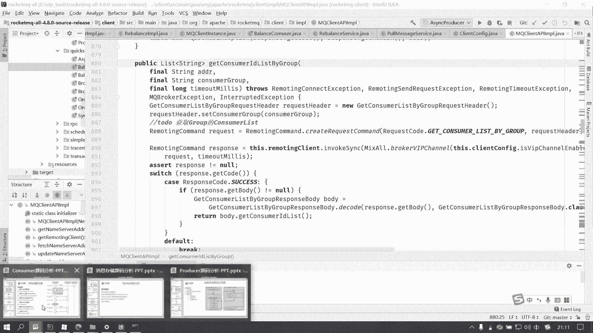

所以这段代码就是对应我们刚才的这个交互流程。第二个步骤。第二个步骤的话，我们要去拿取对应的消费的一些列表信息。就是我们对应的这个分组里面你的消费列表啊。如果说你还不太清晰的话。

其实你就可以去找这个消费者。

嗯。就是我们通过控制台很明显，我们知道。控制台它连接的是主机，对不对？主机里面它就会保保存各种消费者。比如说我们刚才的g下划线 console啊，这里面就会有一些消费的详情信息了。

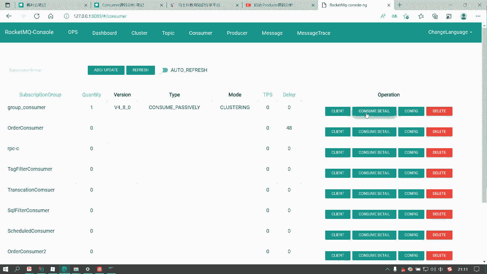

看点进去能不能打开啊，有时这个控制台。有啊有啊。啊，这个地方你是不是就明了了？他就呃点的太多了啊，这个反应比较卡顿。他就知道我们刚才的这一个呃这一个消费者。对不对？它定义的是book a主机地址是这个。

然后你看到这里面就有不同的一些，比如说pro access consumer access。啊，这是不同的队列，Q0Q1Q2Q3就是这4个队列。主机上面的偏移量是多少？你消费的偏移量是多少。

中间的差别是多少？啊，有时候我们可以去查看这个consumomer的相关信息，我们也知道现在还剩多少消息没有消费。所以刚才这个功能号。😊。

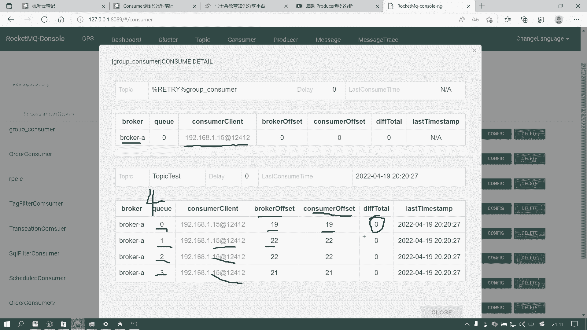

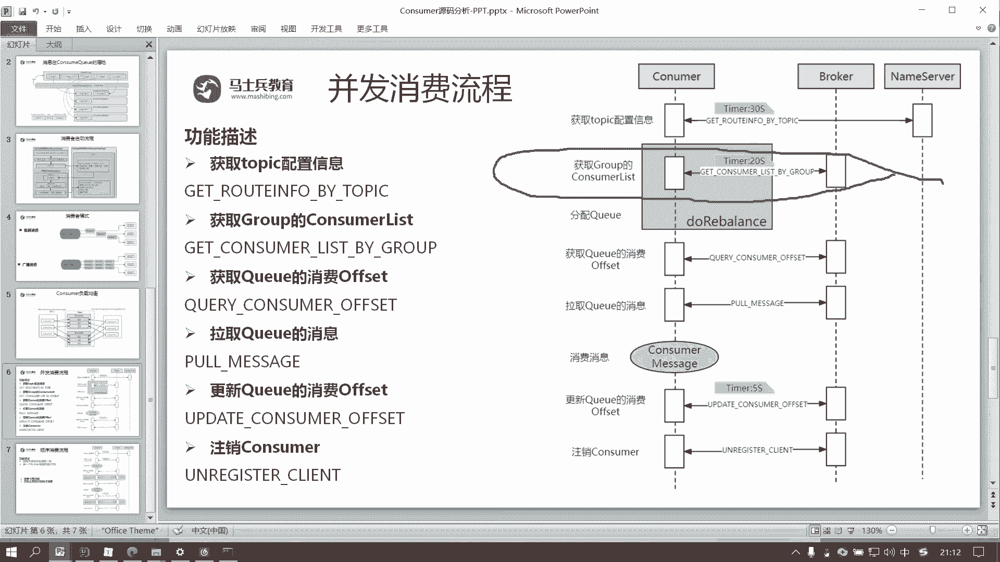

这个功能号拿到的。就是我们这个差不多这个东西。有没有问题，没有问题，刷个一。好。有问题可以提出来。那这样的话就比较清晰明妙啊。Yeah。Yes。我互动一下。嗯。咦，这个聊天窗口是不是刷的很慢？没有问题。

可以刷个一啊，这个过程应该就非常清晰明妙。我们去拿到的这一个对应的topic test，对不对？然后你对应的这一个consumer这个消费组，然后底下主机的偏应量是多少，你消费的偏应量是多少。

他拿到一些相关信息，不然的话，你就不知道下一次启动的时候，我到底是消费了一条，两条还是10条还是三条是5条呢？🤧嗯。这个恶龙咆哮同学，我们先讲原嘛，好吧，你这个是属于实战部分的东西，待会儿我跟你讲。

讲完这个主研嘛的课程以后，我跟你讲。我们不偏离课题啊，偏的太多的话，我没有时间没有精力给大家去解释。因为大家还有60位同学在听课。

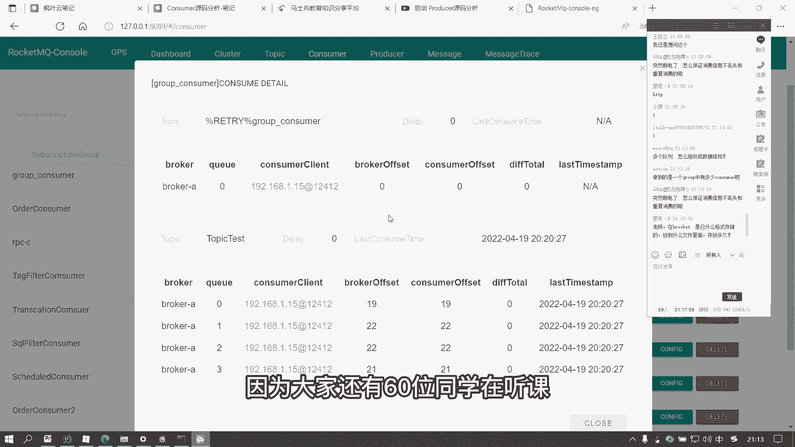

所以你就相当于是这个地方拿不到是这部分东西。啊，如果说你的主机又在这里面写，那这一个主机比如说变成了20了，那你下一次启动的时候就知道我要从我要把这个20叠下息消费给你，对不对？

那就只剩下一条没有消费了。😡。

这就是我们的主机端，或者是我们的的这一个集群消费啊。好，那么我们回归到这个流程啊。那前面的东风哦，不是，就是万事已经具备了，对不对？我们就把主题呀，把对应的消费的一些列表信息都获取了。

那剩下的工作是干嘛分配Q了。啊，剩下的工作就很明显了，就是要去分配Q。😊，对不对？剩下的工作其实呢分配Q的话呢，一般来说我们把它称之为负载均衡啊。负载均衡的话。

默认情况下面是一个arrange了这样的一个方法啊，就是如果就是啊这里面我多说一下啊，如果我们的topic里面的队列比较多，比如说这里面有6个。那你的消费者只有3个的话。

一般情况下面我们的消费者他就会去消费2个Q。好，如果说你的消费者比较多，消费者达到了8个，那是不是就会有两个消费不了？这就要注意啊。就是说如果你的消费者数量多于我们的Q的数量之后。

多余的消费者他就消费不到。一般情况下面多了，你就一个consumer最多只能消费一个Q。然后呢，没有被分配到的那你就在里挂起阻塞的。因为没有消息给你。当然如果说你的Q比较多。

这个主题下面有6个Q分布分布在broke A和分布在broke B。那么默认情况下面是走我们的平均法则。平均的话呢，有种非常简单粗暴的，就是6个12划给你34呃3跟下面的这个Q1划给你。

还有1个Q2和Q3划给你。这个东西也比较简单，就是通过我们主机去拿的时候，我们把这一个6个合并成一个list。啊，然后的话我们算出来算出你的数量，3个三个刚好的话呢可以平均。所以的话你拉两个，我拉两个。

我拉两个啊。当然还有一种叫做bicycle。 bicyclecycle的话就是转圈圈。啊，就是跟经常我们的一轮。啊，这个轮大家应该知道啊，就是这一个轮给你这一个轮给他这个再轮给你，下面这一个又轮给你。

下面这一个又轮给你，对不对？lets。就是摆一个圈嘛。😡，就是我们啊大家来分赃的时候啊，你一你一块我一块你一块我一块对不对？然后发现哎东西还有多，那就在你一块我一块，再你一块我一块啊。

两个呢稍微有一点细小的，或者是有一点细微的差别。但是默认情况下面呢是走这种最简单的。当然你也可以设置策略啊。好，这就是我们刚才讲的这一个负载均衡啊，这个负载均衡呢就我们就不看远嘛了。

因为负载均衡里面的东西呢，说实在啊，它里面涉及到一些复杂的东西。或者是很难去看的东西啊，我们就先把这种东西快速过了。😊，那复载均衡做完之后，我们指定的这个consumer。他是不是就应该知道了？对不对？

他是不是就应该知道相关的信息了？就知道我要去分配到一个对应的Q了。啊，我知道分配到对应的Q之后，现在还要做的一个事情，就是我需要去获取到对应的这个Q消费的off。

就是作为前面这个功能仅仅只是拿到这些列表，就是它不会像我们这个控制台刚才看到的这个consumer detail这个详情这么详细。

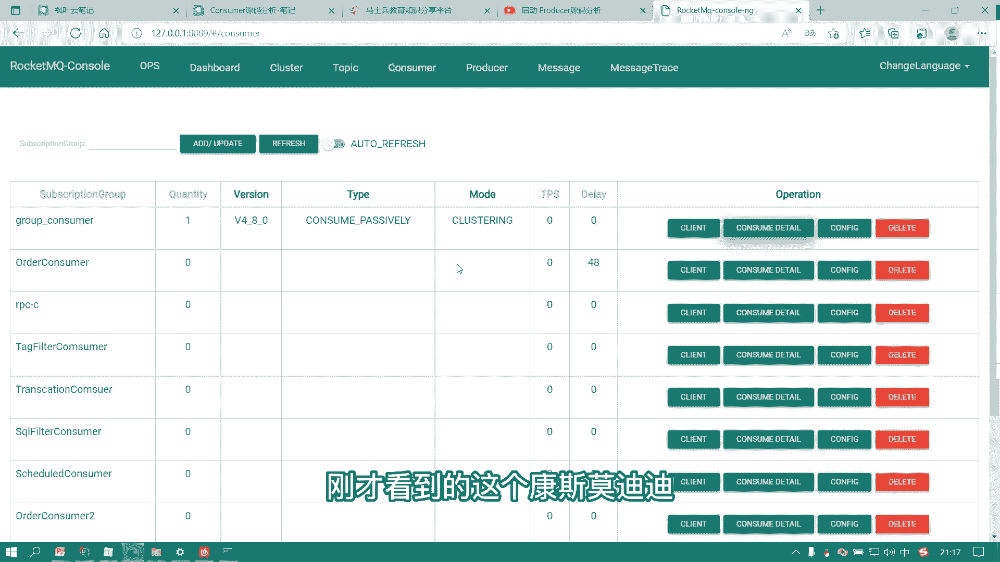

他仅仅只是拿到相关的一些列表。比如说拿到这些对应的表。但是他没有拿到每一个对应的Q上面的对应的opsite。

所以他在调用的时候呢，后续还需要去调一个功能号，叫做quarrual consumerer of。去获取对应Q上面的消费的偏移量。OK所以这个步骤的话呢嗯。大家可以看到在哪里呢？

还是在这一个rebeance。嗯，还是在这一个rebinance by topic。这里。嗯，前面干完这些东西之后。拿到一些对应的消费的队列，对不对？这个里面呢也仅仅只是只是一些队列的名称啊。

你可以看到一个list子的里面存放一个str。好，拿到这些之后，在这里把它排序。啊，其实通过一个我们的集合类啊，把它做一个排序啊。排完序之后，嗯，紧接着这一个部分就是我们前面讲的那一个分配策略了啊。

它有一个专门的分配策略的类，这部分东西的话呢，一般你把这张图记住也也就差不多了。一种是默认的，一种是bicycle。好，那走完这个之后。紧接着我们就需要去获取Q消费的offet了。

所以这里面呢根据前面的主题，根据前面分配的一个对应的结果，根据你是不是顺序的去进行一个获取Q的啊，不是这里啊，是哪里是。看错了，不是这里。不是这里。Rebinance by topic。

The queue said。Q a set Q a set。哎，在哪里？来看圆嘛，看的很蛋疼啊。这里Qa of data in。sorry啊，等一等啊。然了cate分配完之后，分配完之后添加。啊。

这个地方搜一下啊，写了注释的。下次消费的可以呀。是这里啊。Oh。哦，是这里啊。是这里啊，跳进去。跳的很深啊，是这里。跳到这个地方。跳到这个地方之后的话呢，嗯，然后我以为前面这个外处就结束了啊。

这段东西呢，还是前面的一些。就是一些我们队列的处理啊，队列处理完之后的话，紧接着。啊，我们是不是就要去从每一个队列里面去便历啊，便历完便利的事情。其实说白了就是我们前面拿到一个队列的列表。

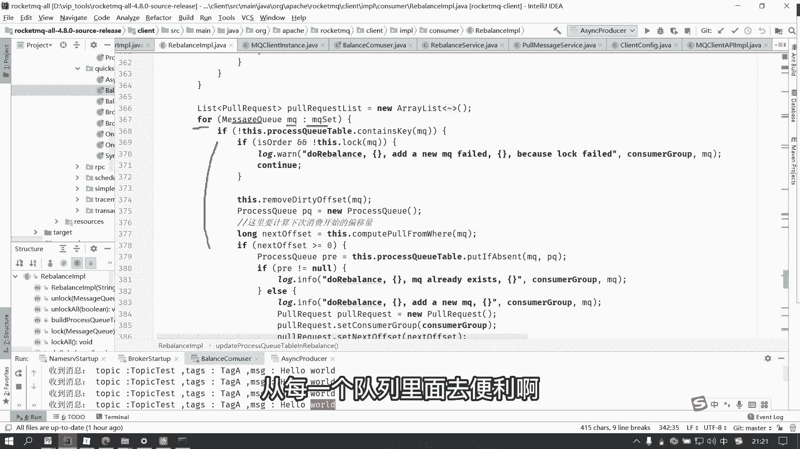

然后拿到这个对列率吧之后，现在变论的事情就是要拿到这个consumer of。

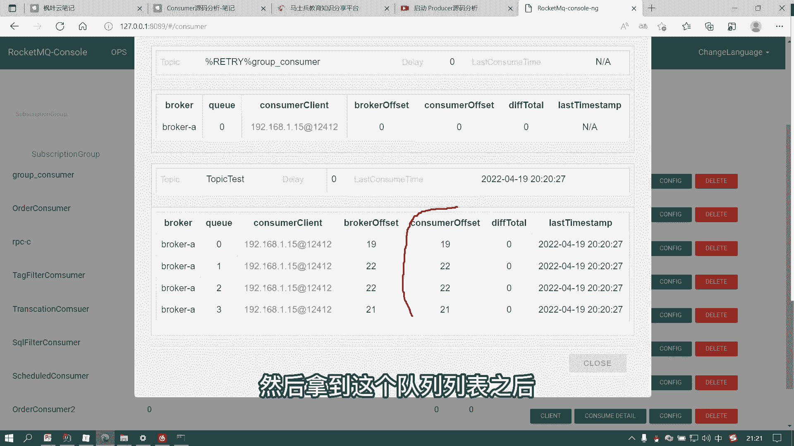

啊，所以我们刚才的这部分代码做的事情就是说便利每一个Q。因为这个地方是一个messQ嘛，它是一个Q的集合。啊，Q的结合之后，我们从每个Q里面计算computer poor from where。

就是中式英语啊，就是计算出我们应该从哪里开始去拿消息，对不对？很明显。这个地方我们用的是rebinance push implication。然后我们经常提交的时候，我们去消费的时候。

什么叫做consumer from last。啊，就是我们去定义消费的时候呢，往往默认情况下面嗯我们把前面的这一个哎。跳转就确实多了，我把前面的东西关掉。这个conl码它可以设置一个。东西。看书嘛。

应该sta。啊，对。就是一般情况下面，它可以s from where，就是我们的这个函数里面。就是你默认情况下面它叫做什么？😡，consumer from last of就是我默认消费的话呢。

都是从上一次开始消费。啊，就是配配置参数里面，大家应该也要熟悉一些消费者的配置参数啊。所以我们为什么默认情况下不去配呢？因为默认情况下面，我们就是从上一条已经结束的，我们接着消费。😊。

当然这个里面它还有很多，比如说还有从大家可以看到这个里面的这个computer计算。啊，它什么重新开始啊，从最小的啊，从最大的啊对不对？还有一些其他的处理，但是我们往往只关心这个好。

只关心这个之后的话啊，大家就会发现了前面我们的offset的这个存储。😊，他就有作用了。对不对？啊，这个地方进入到这里之后，我们就会去有一个offset stone reader ofet就是读。

但是读的时候，我们前面是不是说过，一个是本地，一个是远程。如果是广播则本地。如果是集群消费，则 remotembro of。所以这个地方就要跳到远程的remotebroer of，然后在这个方法里面。

我们再来跳转。再来跳转的话呢。叫做它带了一个参数啊，叫做read from stone啊，从存储来读。所以然到到这里就是根据你送的t类型。如果是read from stone的话。

那么调这一个fiitch consumer offset from book顾名思义，从我们的主机里面更新消费的offet。所以再跳转就到了这里。啊，前面是是个判断，具体去找我们的这些相关结果的话。

是这一段代码，然后。到了我们非常熟悉的一个叫做NRC的一个类了，就是构建1个NRC的通讯，创建一个quarrual consumer of的一个功能号，然后把相关的信息查出来之后，把这个结果进行返回。

啊，结果他只需要返回一个n类型，就是你指定的这一个队列，对不对？指定的这个队列里面，然后。它的这个消费的偏移量是多少？所以呢这个代码就是我们的获取Q的消费的偏移量。

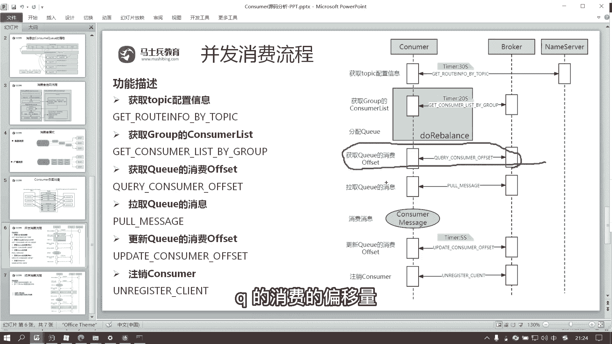

好，也就是我们前面看到的。虽然这个控制台功能很多，但是他拆到这种消费者的时候，首先是拿到这个队列的相关信息。第二个功能再去远程一下，获取consumer的offset好，做完这个之后。

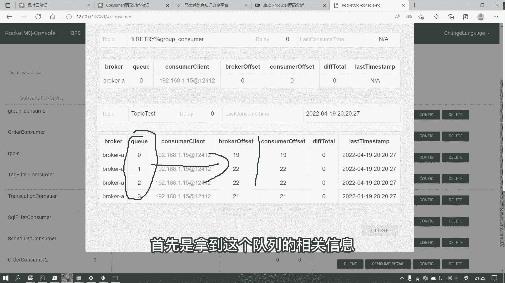

接下来就是去拿消息了。因为前面我们已经知道哪个队列了，甚至我们已经知道我们需要去拿取哪个队列从哪个地方的消费片移量呢，包括你的主题，包括它的一些主机，什么东西，我们都已经拿的非常非常清楚了。

所以最终消息的获取是叫做拉取我们的小Q的消息。所以这个地方呢就会进入一个啊我们的叫叫做p message。大家知道啊p message怎么实现。又要回到我们的这个。啊，把前面东西东西都关掉。

又从我们消费跟起。Yeah。然后消费跟进之后，我们又要到那个。客户端的实力。啊，就是到我们的这个MQ calendar instance的实例。ins的实例是启动一个定时任务的线程。啊。

启动一个定时任务的线程去开启拿消息，就是这个pro message。所以这个pro message它本身是一个runundable。啊，然后这个线程线程在不断的去拉我们的消息去运行我们的run方法。好。

运行run方法的时候，调put messageput message到我们的实现内叫deform mQ pushush pushush consumer的 implication的实现内。然后到这里。

我们再点击啊。这个地方就会相对来说会有点有一点点长。前面的这些判断，我们可以把它稍微的忽略啊，就是一些一服判断一服判断衣服判断衣服判断一服判断一服判断对不对？

一服判断一服判断一服判断一服判断一服判断OK前面一大堆的一幅判断。然后叫做p message，这个地方确实比较长啊，往底下走找走走走走走走走走走走走。嗯。找到哪里了？要找到比较后面的位置啊。到了最后。

这个地方。它才是真正去拿这一个消息的核心内，看到没有？p corner implication去拿消息的核心内。前面根据我们拿到的message的队列，还有对应的一些嗯offset偏移量。对不对？

还有一些我们常说的就是下一个的偏移量，还有一些我们订阅的相关信息，还有包括一些子子的这个版本呢，还有一些其他的一些东西啊，什么模式啊，对不对？所以通过这个方法，我们就可以去完成这个功能叫做拿取消息。啊。

拿取消息。经过我们的这个p corner的implication跳转。好。最终。到了这个方法叫做MQ clfactorge。我们MQ clean APII的一个时间内叫p message啊。

到了这个类其实就很明显了啊，地址request头对不对？time out，然后一些模式，然后它的call这个消息的头就是我们包装的。包装一个request handle，你订阅的组，你的主题。

你队列的ID，你需要去拿取的偏移量，每一次拿取的最大数量，还有一些提交的偏移量，对不对？还有一些我们的子的一些版本，还有一些失效的一些类型啊，还有一些其他东西。然后所有东西都会封装成一个request。

hand等，然后进入我们的这个p message。进入我们这个prom之之后的话呢。啊，他就会要根据不同的模式去拿了啊，同步异步，还有我们的这一个望位啊。但是一般情况下呢。

我们是通过这一个异步的这种通过这种同步或者异步的方式去拿。OK然后到了这个地方。我们就会进入。这个地方。啊，就这个地方就就差不多了。就是看你的这一个默认的格式吧，这个默认的格式看一下。

前面根据参数来设定。默认的格式。格式啊，这是要根据前面默认格式走的。默认的格式是一步。大家可以看到啊，他去拿消息的时候，默认的格式走的是alynchize e，对不对？😊，然后最终会跳入这。啊。

前面这个地方也是去封装一个功能号，叫做 pull message的功能号。所以呢就跟我们的这个叫做功能号的调用跟跟你的差不多就是对应起来了。啊就是启动一个线程，不断的去拉我们的消息，拉我们的消息。

拉我们的消息OK然后拉我们消息的时候，对不对？最终就调到这里，通过一个异步的响应。😊，啊，这些东西呢就是可看到就到了这里嘛。这里的话呢就会去执行一些拿消息的一些封装的啊。啊。

专门去封装了一个拿下去的处理啊，包括一些对象的头啊，包括一些其他的处理呀。好。这就到了我们刚才所说的拿下去这个环节。这从Mm去拿吗？从那里去拿客户端，我们前面讲过。前面讲存储的时候是不是讲过？嗯。

那你你你要看，其实很简单。你要看的话，看到这部啊，这个地方不是有个pro message吗？你可以去搜一下。😊，pro message如果在我们的客服务端，就是客户端，我们是不是封装的一个类？

叫por message找啊pro message。To message。看到。这是我们的bro controller，还记得bro controller吗？bro control它属于我们存。

这这是我们的主机启动的时候。如果说你去往这个功能号面发，那么它有一个叫做NRC的，就是native的remoing service端。它会注册一个poster，注册一个任务。如果有请求来了。

他就会把它交给这一个p message的。所以p messagepo最终。是不是前面我们讲过一个入口方法？啊，然后交给这个现程池pro message per。然后这个地方呢，大家应该也知道。

就是为什么前面我们说常用的消息会到我们的叫做prooc的 request。就这么来的。就会把我们前面的这个消息的存储的处理啊，就是这一节。给你串起来。应该当然应该是这里。啊，穿起来。

那他在最终到了任务的时候，会去调这个send message per，到了这个procesor request，到了消息的一个息啊，不是这个不是消息的写入流程，到到这个quary per。

它是一个消息的查询，生产的时候是写。然后的话如果是消费的时候，就是叫做query message操操去查。OK就跟我们的写入流程就是有点类似了。😊，好。消息写入使用的雷雷体嘛，当然是雷体啊。

就是在rockQ里面，你通过看源嘛，它除了一些非常简单的功能，用的是这种HTTPc其他的只要是涉及到就是请求频次非常高的，它都使用的是雷体。😊，就是你一旦看到这种组件。

就是要封装一个remote command。就是一旦看到它的参数是什么remote command就一定是layO。😊，这一点应该是比较容易啊。嗯，就是一旦你比如说你要去发消息的时候。

他通过lay一定是通过这个reming commandd去组建一个请求的command，就是组建一个请求的包，这就是走的la体同他自己就是相当于是在lay上面做了一个简单的包装包装的一个la体框架。

OK。好，这就是我们刚才讲到的这个拿消息的一部分啊。拿完之后的话呢，当然他要进行对应的消费了啊，消费完之后紧接着还要注意两个事情，一个事情就是你消费了，你还要去更新。😊，Ce upset。

那么在这里面我就提个问题啊，因为我们根据前面知道，虽然我们并发消费者的是一种推模式，但是本质上面他是去拿消息，并且去拿消息的时候，我还告诉你了，他每次去拿消息。他还去拿一段。对不对？你拿消息之后。

他设置的我找到这一个topic，找到对应的队列，从哪个偏移量开始，他还要设置我这一次可以拿多个。所以你如果要提交偏移量的话啊，好像在我们这里面去做是不行的。就是什么拿一条去提交一条是不行的。

因为它是通过一个GNT处理，所以怎么办呢？所以在rockq里面，它又会启动一个定时任务，去更新我们Q的消费者的一个偏移量。

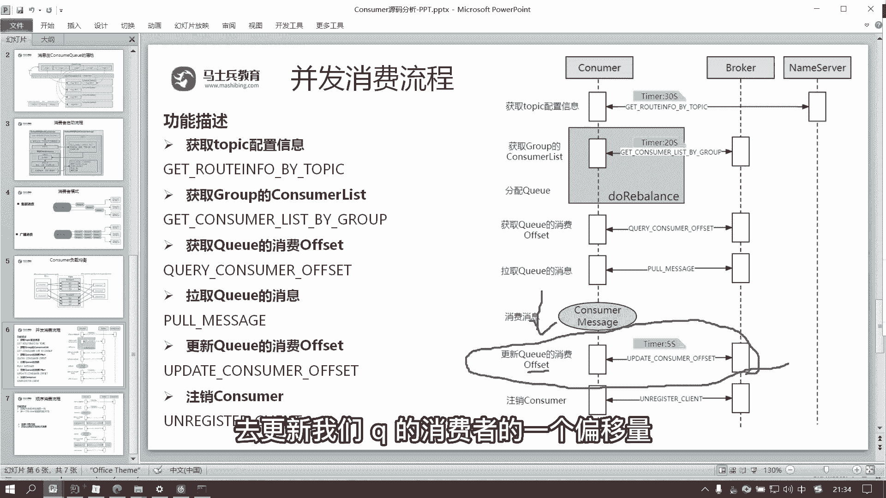

就是大家看到的。在我们管理后端，他会去拿到我们每一个消费者消费的偏移量。这个数据哪里来的？这个数据就是我们通过这个功能号去更新的。这个功能号是通过一个定时任务来处理的。

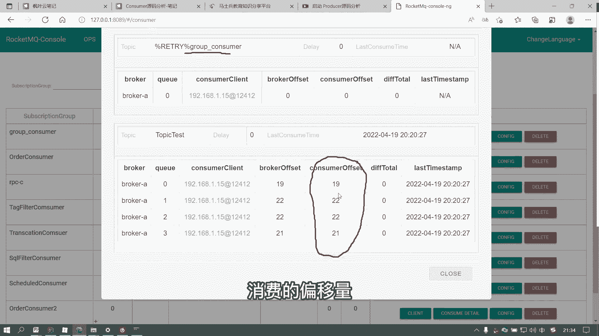

OK然后大家可以看到更新我们Q的一个off的时候，因为并因为我们的消费者他虽然是推模式，但是基于拉模式实现的拉模式是一批批拉，所以你不可能做到一PP去提交。

所以这个地方要用一个定时任务去更新我们的偏移量，怎么更新的？再回到我们最核心的一个类就是。😊，MQ calendar instance对不对？这个类里面有一个star方法。

star方法里面呢再来看它就开启一个定时任务，开启一个定时任务。我最后面这个东西没讲，就是在前面的时候没讲这个地方说了是每隔5秒钟，它会去持久挂一个消费进度。当然。这里面的参数为什为什么是5秒钟？

因为这是1000乘以5，然后这个单位是毫秒，所以它就会去运行到我们的叫做MQ clean instance点叫做proit or consumer of到这个方法到这个方法到它的实限内。实现内的话。

因为我们是pushconer，所以是default mQ pushushconser的实现内。然后到这里之后。哎，到这里。这里的话就是前面。是根据我们去分配的一些队列，分配的MQ的一些队列，对不对？

然后下面。就是我们具体要处理的。如果说你的是广播消费走本地的这一个，如果你是集群消费，走远程的这一个。所以这地方当然是走远程的。好，走了远程的这一个之后啊，大家可以看到。前面又是个破循环呢。

因为你去更新的时候，你不单纯只是更新一个队列，它有多个队列，所以这是个队列的集合messageq的 messagesage Q的一个set。然后根据这个集合。

大家可以看到这个地方有个方法叫做update consumer of to book顾名思义就是修改我们消费者的偏移量给broke端，一个是MQ，一个是消费的偏移量，就是两个参数。然后这两个参数到这里。

然后到这里之后。也把它去进行一个封装，封装成一个request handle。对，这个request handle，就是因为你去更新的时候，它还有对应的主题呀，消费者分组啊，对列的ID呀。

消费者偏移量啊，对不对？所以把这个request handle封装，封装完之后。嗯。调这个方法就是看你设置的模式是不是到底是望位啊，这个玻ing值的话。看一下默认是t，那就是单向的。

就是oning is only way的话，单一下呢就就到这里。😊，到这里。在。啊，到这里以后就非常明显了。😊，又是一个la体的远程调用，功能号是update consumer opposite。

就是去修改我们的这一个消费者的偏移量。所以。到后面这个环节就是启动一个定时任务，然后每隔5秒钟去更新我们Q消费的偏移量，功能号叫做update下划线consumer下划线opposet。对不对？

就到了这里。这个功能号就是对应的。然后就是客户端去调一下。Yeah。好。这就是我们并发消费的一个流程啊。然后最后的话一个注册我就不用去讲了。注册的话呃就是注销的话其实就呃就相对来说比较简单了啊。

我们主流程就讲的差不多了。注销的话就是你去消费的时候，你还可以走一个consumer的说down。说down的话，它也要去远程调用一下，这是一种优雅的关闭。😊，也要去告诉我们的客户bro端。

我们去取消注册我们的can端呢，它也会有一个功能号啊。好，这里面我们就把整个的并发消费的流程讲清楚了。我们来回顾一下。第一个的话，并发消费的流程的话确实步骤比较多。

就是如果说你要去每一个环节都跟原码的话，肯定是看不下来的。所以我们把它通过一些核心的调用啊，把它看完，就是你们去看一个流程的话，其实你们知道几个角色。比如说cons对不对？

你如果说要涉及到一个数据流转的话，往往就说如果我们要完成消费，你中间怎么交互的。这相当于一个并发消费的数据的交互流程。第一个拿到主题。第二个拿到我们的消费者列表。第三个分配Q分配Q完之后。

我们还要根据每一个Q到我们的包上面去拿到偏移量。然后有了偏移量，我们就知道我们从这个Q里面可以拿多少条消息啊，拿到消息之后，我们完成对应的消费这个消费的话，就是我们的那个注册方法。完成这个注册方法之后。

我们就会要去更新。因为我们做完消费之后，我们还要定时的去更新我们消费者的一个偏移量。然后最后如果是一个优雅的关闭的话，那个 down。😊，去调用我们的这种叫做注销注册的一个方法。

也是把我们的主机上面的一些东西给释放掉。当然了，就是如果说你不去调这个的话呢。

