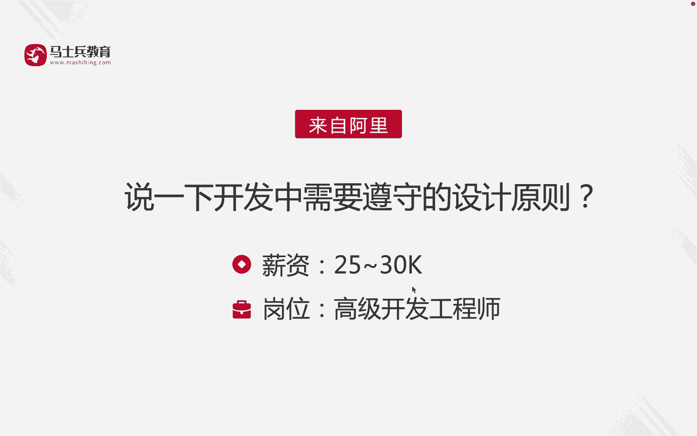
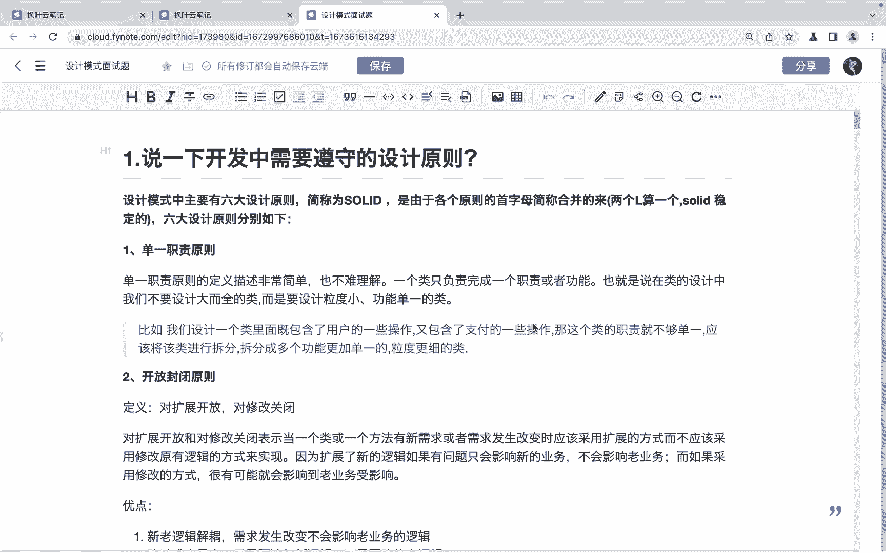
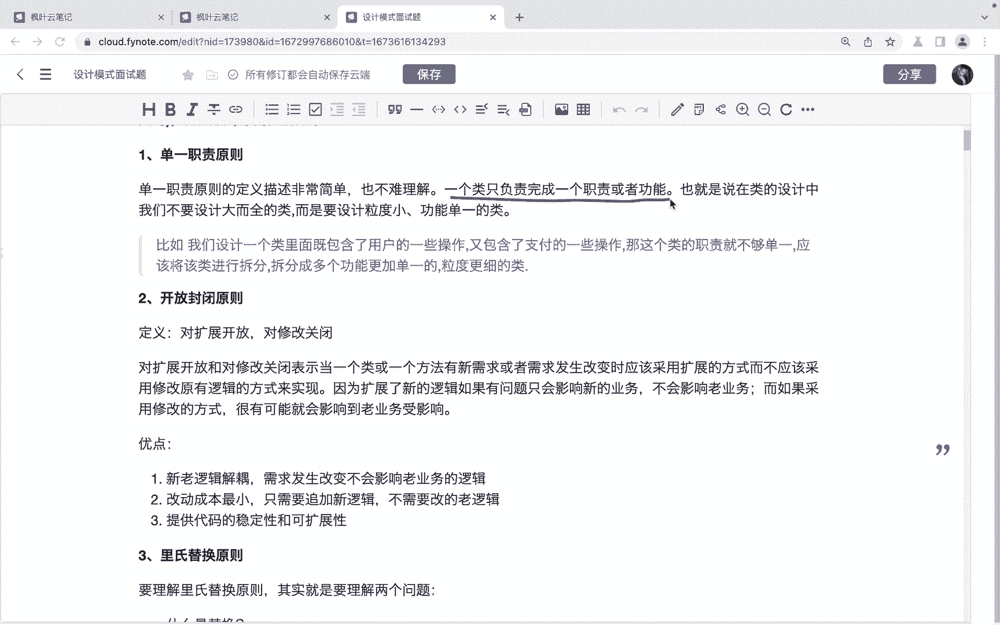
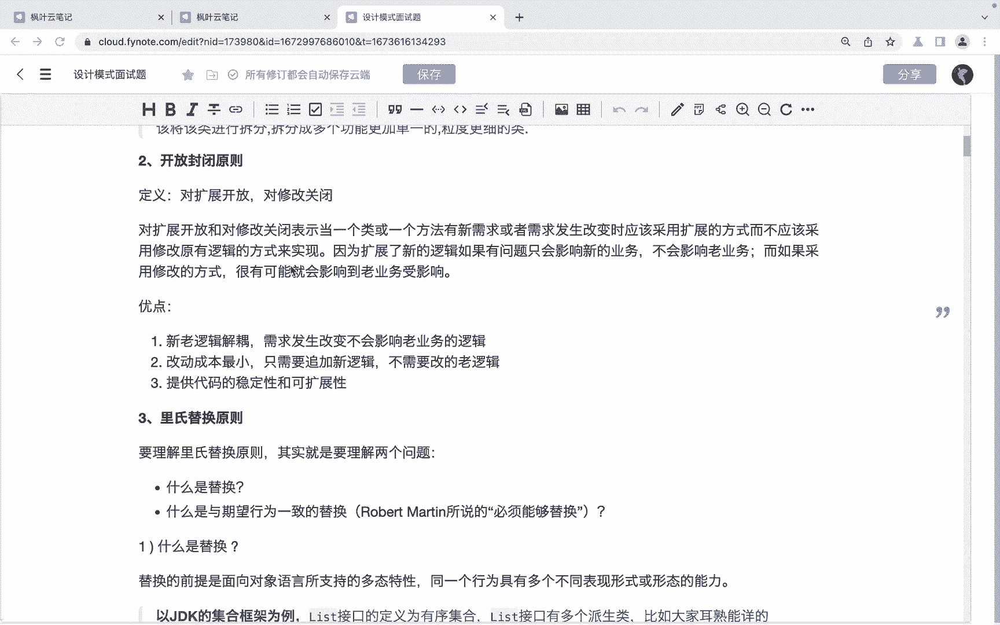
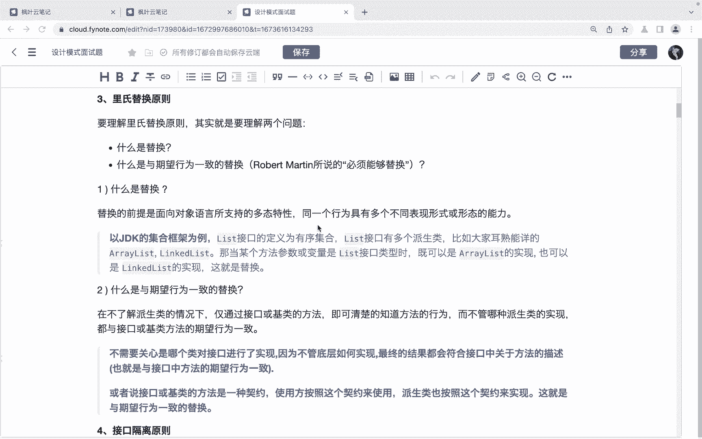
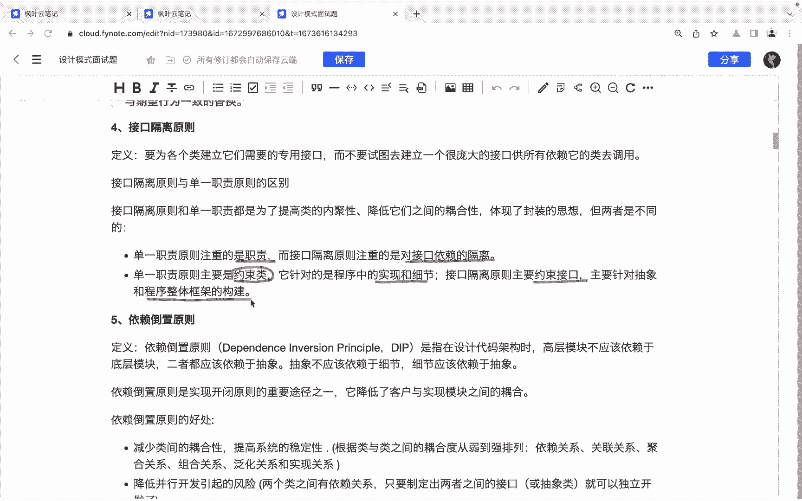
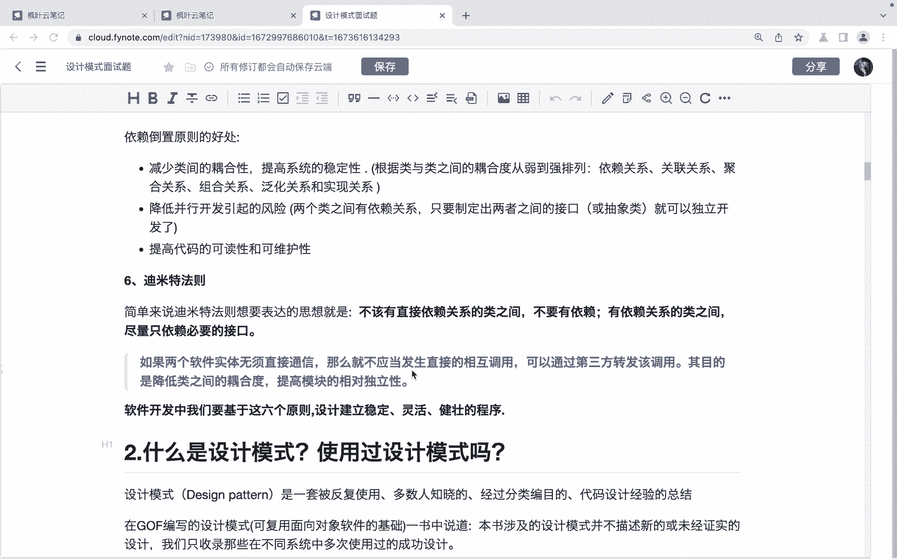
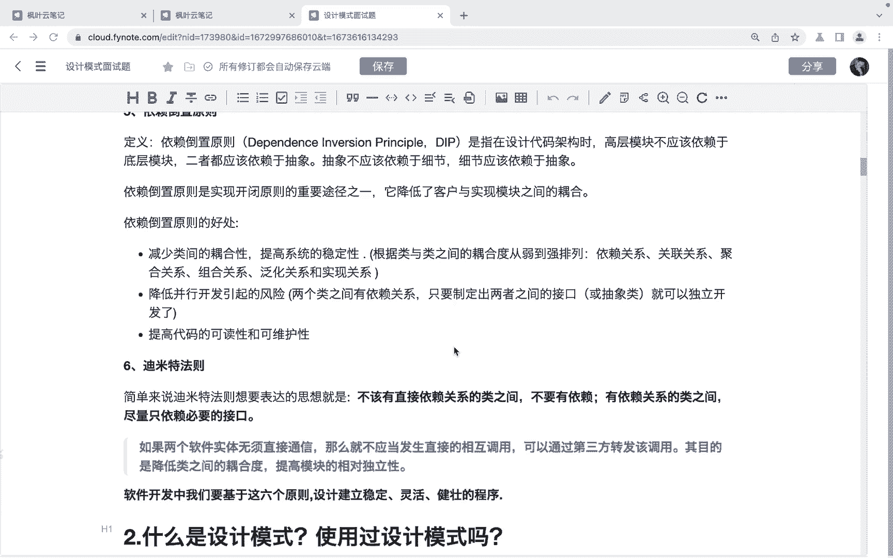
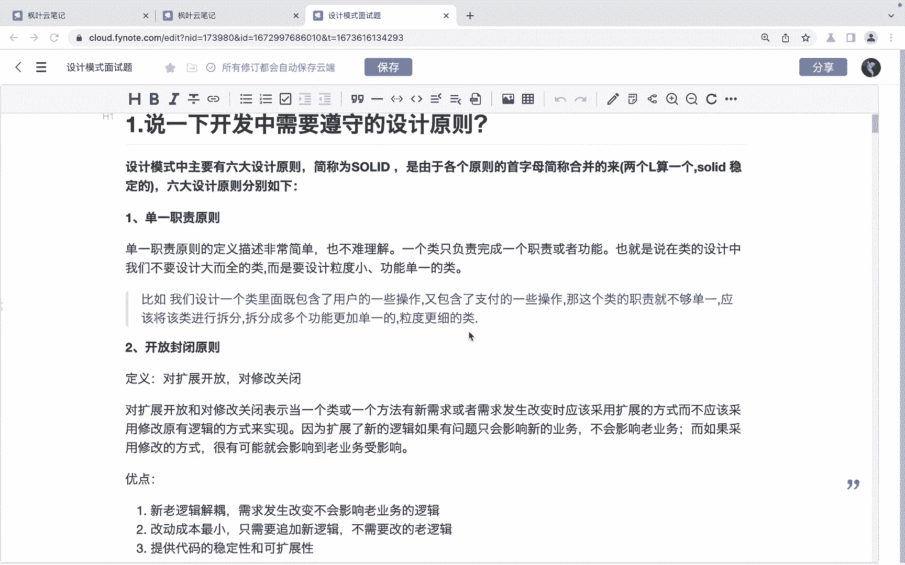

# 系列 6：P137：说一下开发中需要遵守的设计原则 - 马士兵学堂 - BV1RY4y1Q7DL

同学们大家好，接下来呢我们来看一道来自于阿里的面试题。😊，说一下开发中需要遵守的设计原则，对应的薪资呢是25到30K。对应的岗位是高级开发工程师。那么我们先来看一下。

其实这个开发当中所需要遵守的设计原则呢，通常的话呢我们要回答的是设计模式当中提到的六大设计原则。那么。

我们可以来去一个一个的看一下啊。首先第一个就是。单一职责原则。那所谓的单一职责原则呢，它指的是一个类啊，只负责完成一个职责或者功能。也就是说，在类的设计当中呢，我们不要设计大而全的类，而是要设计什么呀？

力度比较小，功能单一的类。这是单一职责原则。

然后就是这个开放封闭原则。啊，也就是我们常说的对扩展开放，对修改关闭啊，对扩展开放和对修改关闭呢表示，当一个类或者一个方法有新需求或者需求发生改变的时候，应该采用扩展的方式，而不应该采用什么呀？

修改原有。😊，逻辑的方式来实现。啊，那么遵守开辟原则的话呢，它的好处是首先新老逻辑呢它是解偶的，需求发生改变的时候不会影响老业务的逻辑。第二个呢就是改动成本是最小的，只需要增加新逻辑，不需要修改老逻辑。

第三点就是。

提供代码的稳定性和可扩展性。

第三个就是理氏替换原则。那么这个理式替换原则啊，相对来说呢不是很好解释。那么如果我们想想要去理解它的话呢，我们先要知道什么是替换啊，所谓的替换呢啊替换的前提是面向对象语言当中所支持的多态特性。

注意多态特性。😊，那么同一它多态的话，其实就同一个行为具有多个不同表现形式或者形态啊。那么以我们的ZDK集合框架为例呢，list接口的定义它是为有序集合。那么list接口呢有多个派生类。

比如说relink list。那当我们某个方法的参数或者变量是list的接口的时候呢，我们就可以传入它的什么子类，比如re released，对吧？比如link list，那这个就是我们说的替换啊。

替换。然后。😊，还有一个呢就是。

第二个问题啊，就是什么是与期望行为一致的替换啊，什么是与期望行为一致的替换。那么在不了解派生类的情况下呢，仅通过接口或者积类的方法，既可以知道方法的行为啊，而不管什么呀，哪种派生类的实现，都与什么呀。

都与接口和积肋方法的希望行为一致。😊，啊，这话的意思就是我们不需要关心是哪个类对接口进行了实现，也不管什么这个底层是如何实现的。因为呢我们最终的话呢。

它返回的结果一定是符合这个接口当中所关于这个方法的描述的。OK吧，这是我们说的理是替换原则。😊。

啊，然后呢就是接口隔离原则。接口的隔离原则呢，它指的是要为各个类建立他们需要的专用接口，而不是试图建立一个很庞大的接口，供所有依赖它的类去调用。啊，那么也就是说我们要去什么呀？

按照每个类它的职责不同来去建立对应的接口。那么接口隔离原则和单一职责原则好像看起来比较像，对吧？但是他们之间其实有区别的啊，那么单一职责原则注重的是职责，而接口隔离原则呢注重的是对接口依赖的隔离。😊。

啊，单一职责呢主要是用来约束类的啊，针对程序当中的实现和细节。而接口隔离原则呢，它主要用于约束接口，主要是针对于抽象和程序的整体架构设计啊。

然后第五个呢就是依赖倒置原则了。那么依赖倒置原则呢指的是在设计代码架构的时候呢，高层模块不应该依赖于底层模块，两者呢都应该依赖于抽象。啊，抽象呢不应该依赖于细节，细节应该依赖于抽象。啊。

这里边其实重点的就是这个抽象，对吧？啊，那么。😊，呃，这个依赖道字原则呢，它其实是实现开辟原则的一个重要途径啊，那么降低它降低了客户与实现模块之间的一个耦合啊，依赖道字原则的好处啊。

首先呢它减少了类类之间的耦合性，提高了系统的稳定性。😊，第二呢就是降低并行开发引起的风险。啊，还有呢就是提高代码的可读性和可维护性。

这是我们说的依赖道德原则，然后就是迪米特法则。😊。

简单来说呢，迪米特法则想要表达的思想就是不该有直接依赖关系的类之间就不要有依赖。有依赖关系的类之间呢啊尽量只依赖必要的接口。啊，它指的是通常情况下指的是，如果两个软体两个软件实体无需直接通信。

那么就不应该发生什么呀？直接的相互调用，而是通过第三方转发啊，其目的其实就是为了结耦啊，提高模块之间的这个独立性。

那么以上呢，其实就是关于这个我们的这个六大设计原则的一个介绍。那么关于这个面试题呢，就是开发当中需要遵守的设计原则呢，我们可以啊通过回答这个六大设计原则来去进行一个啊。

通过这个六大设计原则来去进行一个讲解。当然了呃也还有其他的一些设计原则。如果同学们在开发当中还用到过其他的设计原则的话，也可以进行一个补充。😊，好，以上呢就是关于这个面试题的讲解啊。

希望呢能够帮助到同学们。😊。

