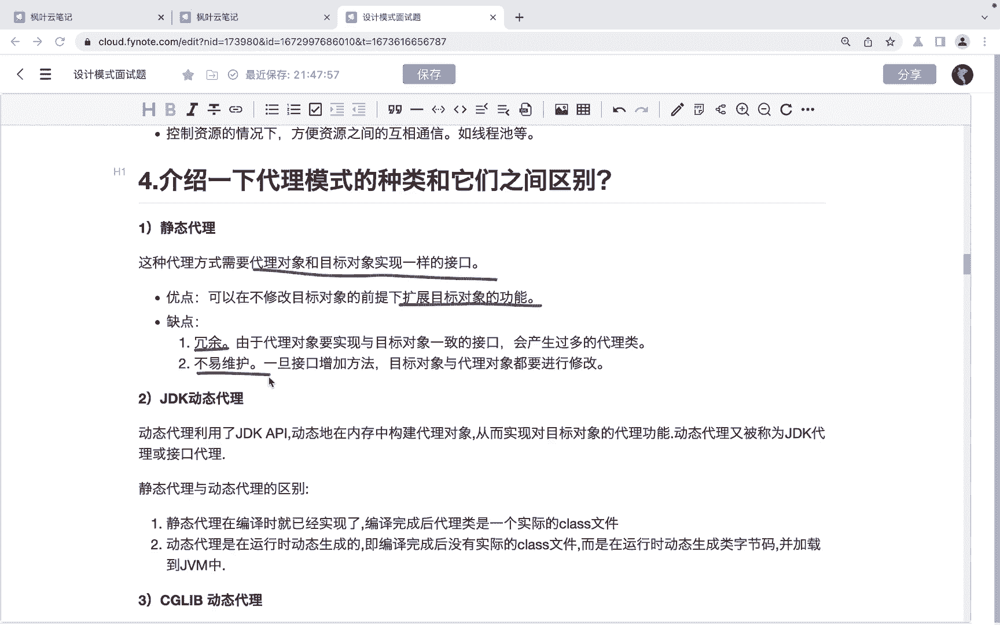
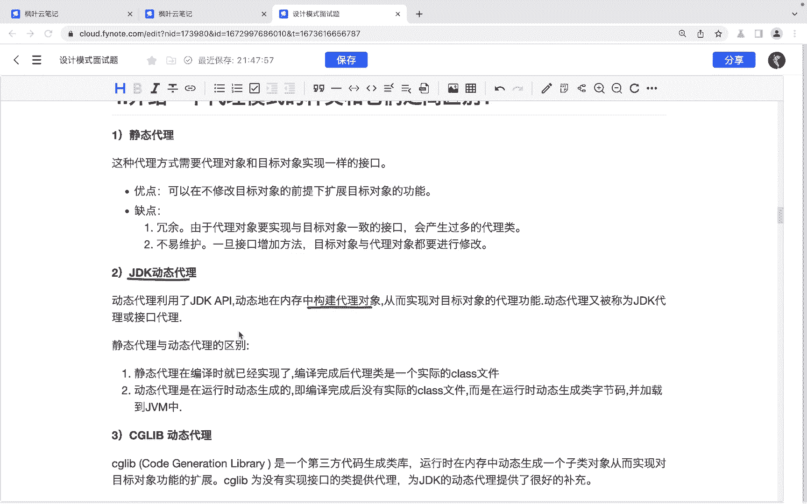
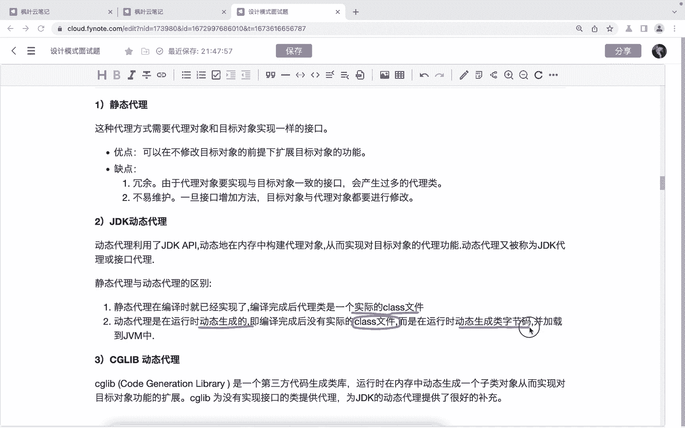
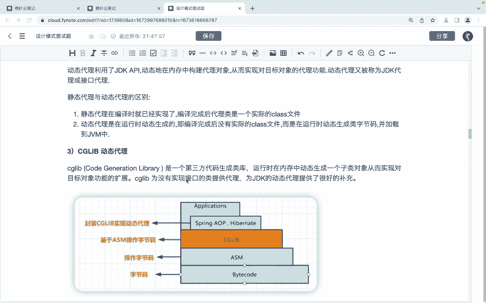
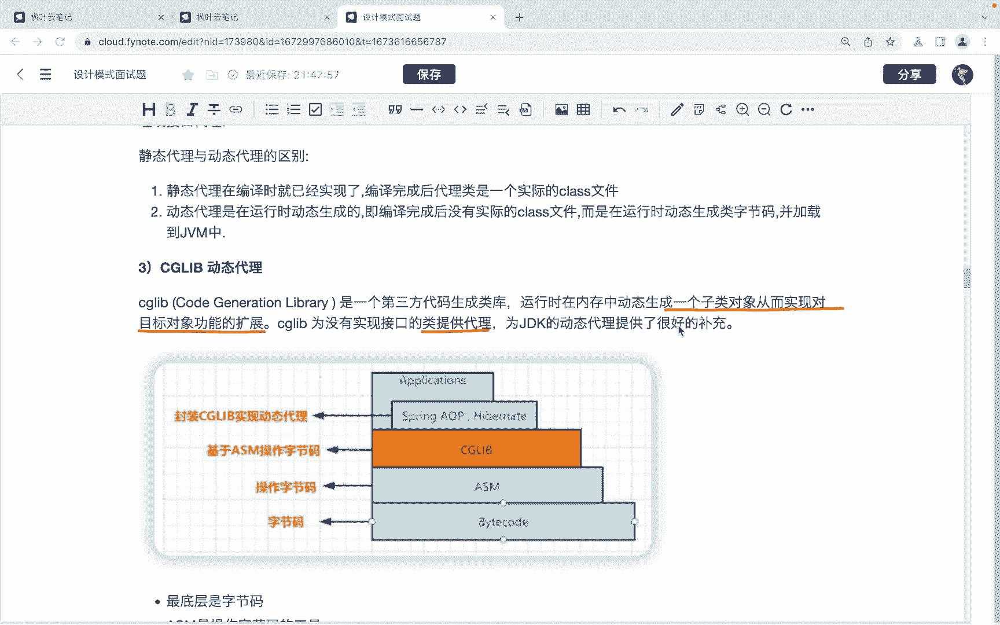
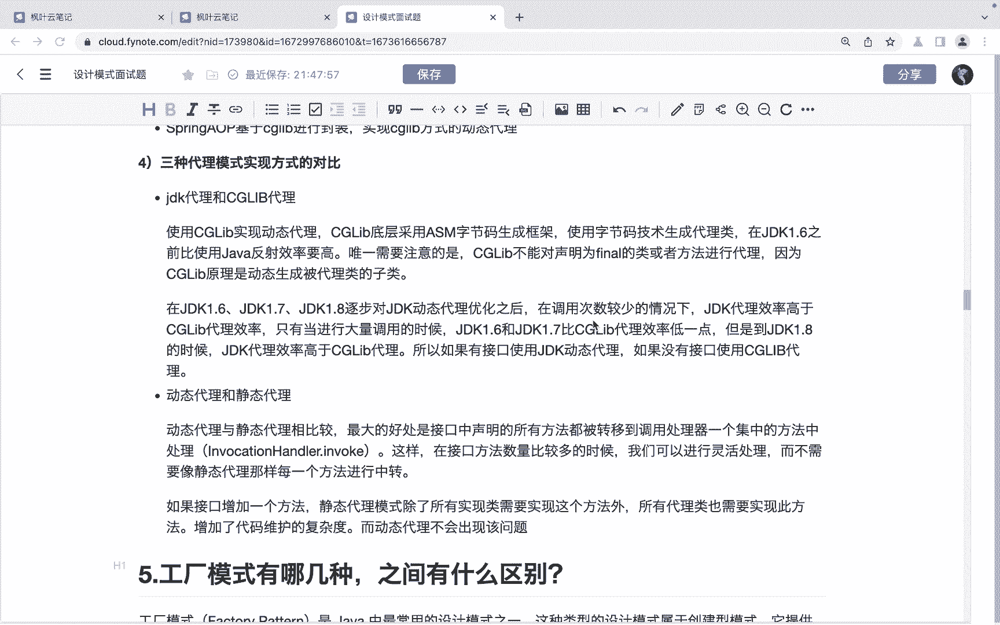
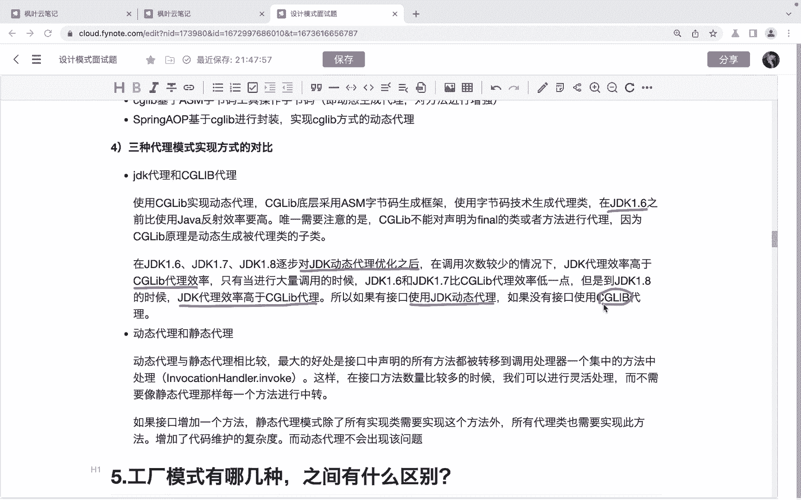
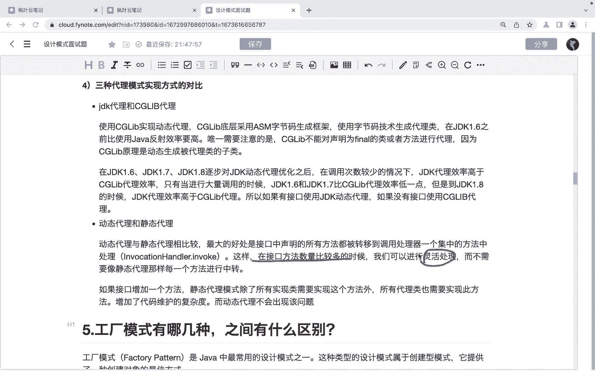
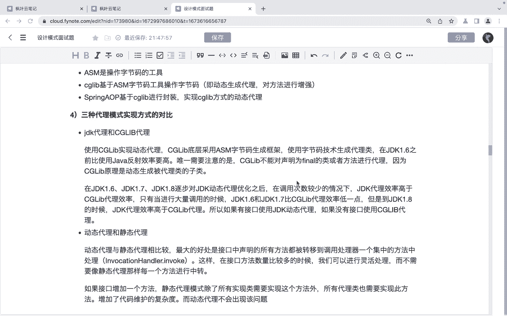
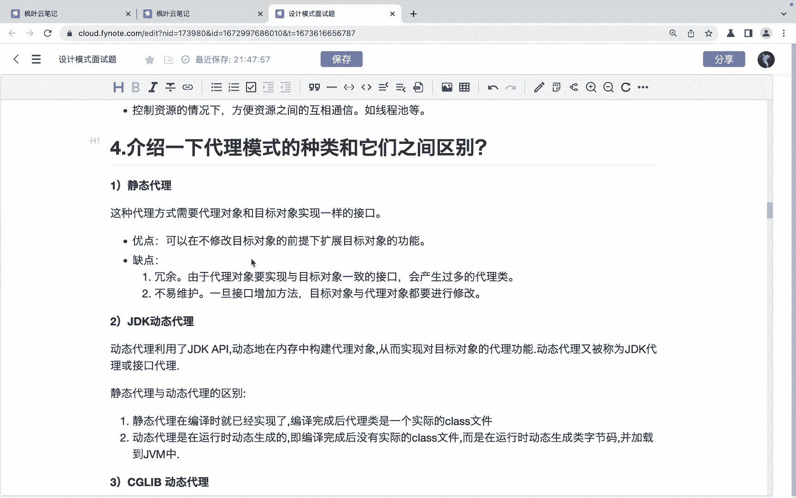

# 系列 6：P140：介绍一下代理模式的种类和它们之间区别 - 马士兵学堂 - BV1RY4y1Q7DL

朋友们，大家好，接下来呢我们来看一道来自于美团的面试题。😊。

介绍一下代理模式的种类和他们之间的区别。对应的薪资呢是30K，对应的岗位是高级开发工程师。那么我们先来看一下这个静态代理啊，那么这种代理方式呢是需要代理对象和目标对象实现一样的接口啊。

代理对象和目标对象实现一的接口优点呢就是可以在不修改目标对象的前提下扩展目标对象的功能。缺点的话就是冗于冗余啊，那由于代理对象呢要实现与目标对象一致的接口。那有可能会产生过多的代理类。

第二个就是说不易维护啊，一旦接口增加方法那么目标对象和代理对象呢就都要进行修改了。😊。

然后就是我们说的动态代理了。其实动态代理呢我们用的是最多的对吧？那包括了ZDK的动态代理。😊。

那么这D类动态代理呢，它利用了JDK的API动态的在内存当中构建代理对象啊，从而实现对目标对象的代理功能啊。

那么这个静态代理和动态代理呢，它的区别就是静态代理呢在编译的时候就已经实现了，对吧？编译完成后，这个代理类呢它是一个实际的class文件。😊，而动态代理它是在运行的时候去动态的生成的。

也就是编译完成后呢，是没有实际的classclass文件的。那么在运行到对应的内行代码的时候啊，再去动态的生成该类的字节码。OK吧。好，再一个就是我们说的CGCD labb这个动态代理。

啊，C lab这个动态站里呢，它是一个啊。😊，第三方的啊代码生成内库。那么这里边呢呃它的特点就是在运行的时候啊，在内存当中动态的生成一个此类对象，哎，从而实现对目标对象的扩展。

啊，那么这个C lab呢，它是为没有实现接口的这个类提供代理的，相当于是对于CDK动态代理的一个补充。

啊，那么我们再来看一下三种代理模式的实验方式的对比啊，那么JDK代理和C labb的代理的一个对比呢。首先。

咱们的C lab啊使用C lab来去实现动态代理的话，它底层是通过ASM字节码生成的生成框架啊，采用的是这个啊一个字节码生成框架，那么来去生成这个代理类的。那么在1。6之前。😊，他要只有在1。

6之前啊呃那么要比扎哇的反射效率要高一些。OK吧，然后呢，在1。61。71。8逐步呢对ZDK动态来做优化之后。😊，啊，那么ZDK代理的效率呢要高于。😊，C lab的这个代理的效率了。OK吧啊。

所以呢啊就是说只从1。8开始吧啊，从1。8开始，这个ZDK的代理效率就高于C labb了啊，所以呢如果有接口使用，如果有接口的话，就使用ZDK动态代理。如果没有接口，我们再去选择C labb代理啊。

还有就是动态代理和静态代理了。这里边呢其实啊动态代理与静态代理相比较呢，它最大的好处就是这个接口中声明的所有方法呢都被转移到什么呀？调用处理器一个集中的方法当中去处理了。这样的话呢。

在接口方法数量比较多的时候。😊。

啊，我们就可以灵活的进行处理了啊，那么不需要呢，就是像静态代理那样，对吧？然后去做一个都去做一个实现啊，那么。

这是我们说的这个关于这个代理模式，它的种类和它们之间的一个区别啊。那么总结一下就是首先种类就包括了静态代理和动态代理两种。然后呢啊动态代理呢又包括了ZDK的动态代理和CGlab的动态代理。

好，以上呢就是针对于这道面试的讲解，希望呢能够帮助到同学们。

