# 系列 6：P141：工厂模式有哪几种，之间有什么区别 - 马士兵学堂 - BV1RY4y1Q7DL

同学们，大家好。接下来呢我们来看一道来自于阿里的面试题。😊。

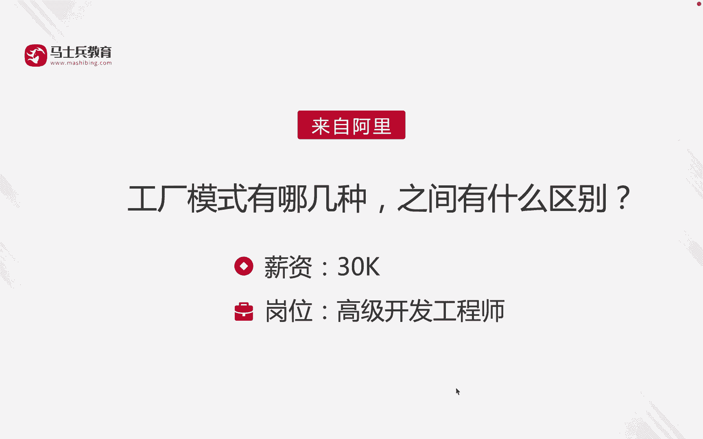

工厂模式有哪几种之间有什么区别？对应的薪资呢是30K，对应的岗位是高级开发工程师。那么在工厂模式当中呢，我们在创建对象的时候，是不会对客户端暴露创建的一个逻辑的啊，我们只是直接通过啊工厂这个模式。

然后呢提供的方法，我们直接去获取这个实力。那么。在设计模式艺术当中呢，它是将工厂模式呢分为了三种，包括了简单工厂、工厂方法和抽象工厂。

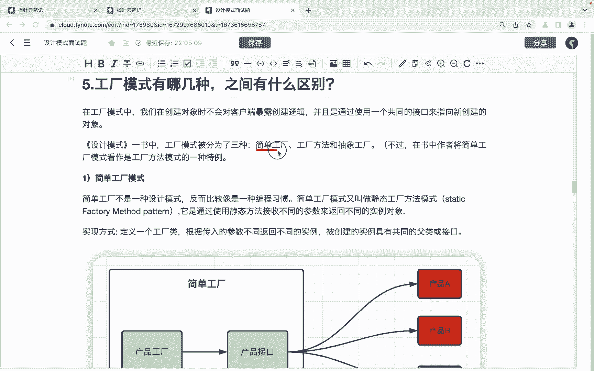

那我们先来看简单工厂。其实呢简单工厂它并不在23种缩计模式当中。

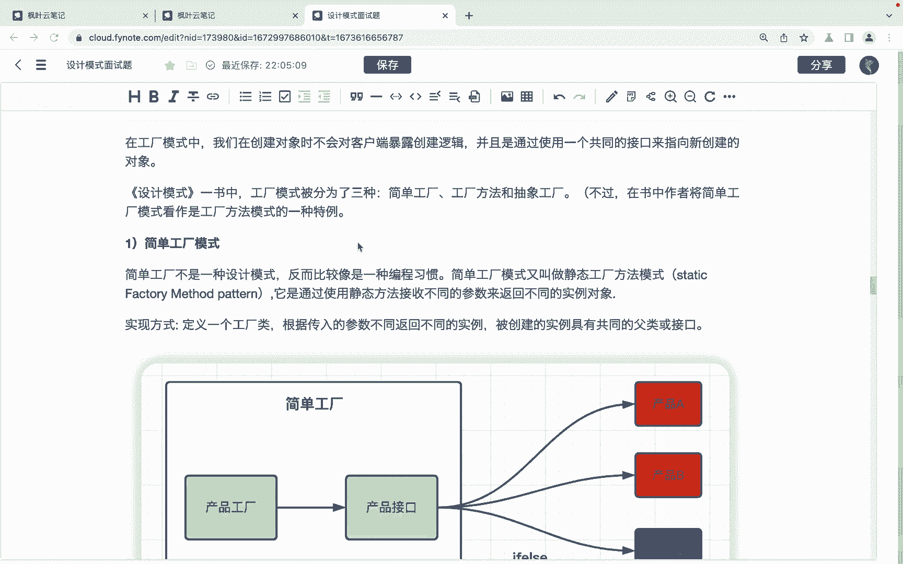

这个简单工厂模式呢，我们可以把它看作是一种编程的习惯啊。简单工厂模式呢又可以叫做静态工厂方法模式。它的一个特点就是它将这个。😊，方法的这个返回值呢设置为这个我们的这个是一个接口类型啊。

那么我们在这个样的一个工厂当中，比如说我有一个产品工厂，那么我的方法的返回值其实是一个产品的接口类型。然后呢，我会根据你的传入的这个对应的参数的不同，然后给你返回这个接口的对应的实例。比如说返回产品A。

如果是一的话，我就返回产品A。如果是二的话，我就返回产品B啊，这种方式来去什么啊，这个生产这个对象的。然后我们再来看。

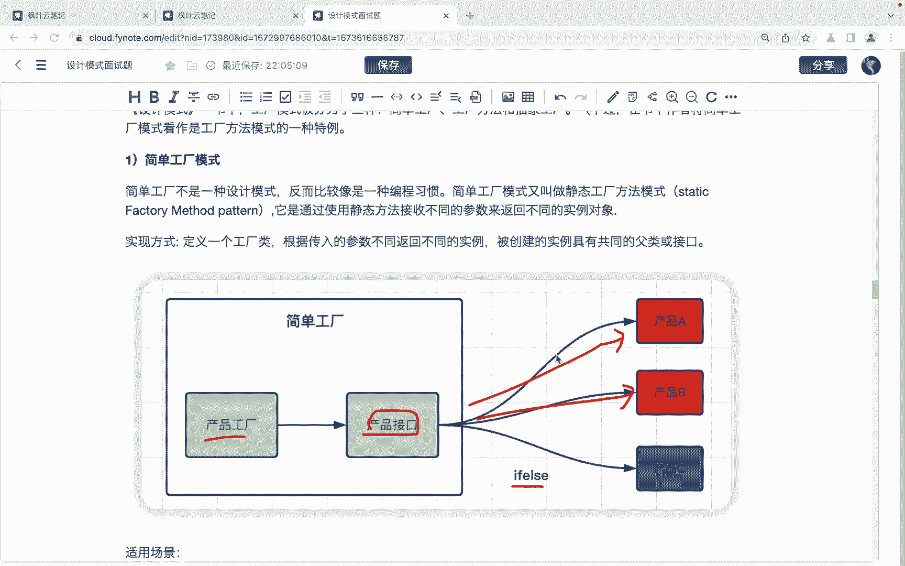

这个它适用场景就是需要创建的对象较少。啊，然后呢客户端不关心对象创建的过程。啊，优点呢就是封装了创建对象的过程，可以通过参数直接获取对象啊，把这个对象的创建和业务逻辑呢给大家划分开了。😊。

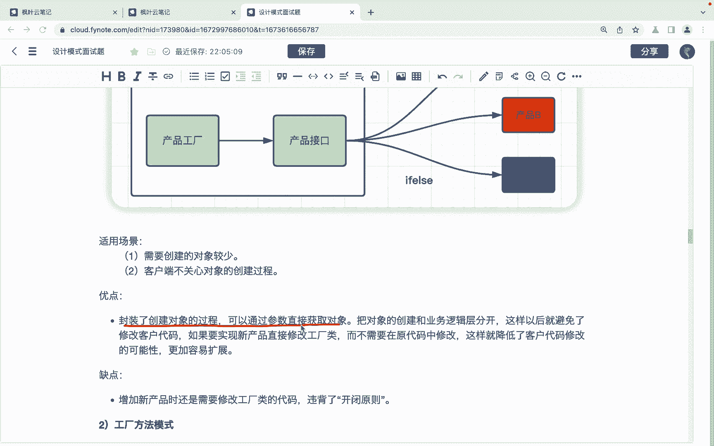

缺点的话就是在增加新产品的时候，还是需要修改工厂类的代码，违背了开辟原则。因为我们是通过参数来去判断啊要去生产的产品的类型的。所以呢这里边如果新增产品就需要修改代码。

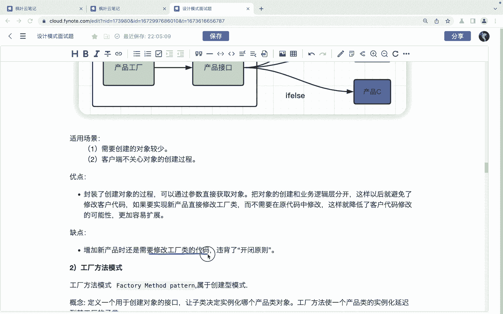

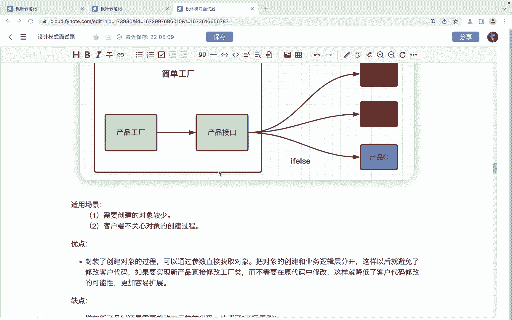

然后我们再来看工厂方法模式。

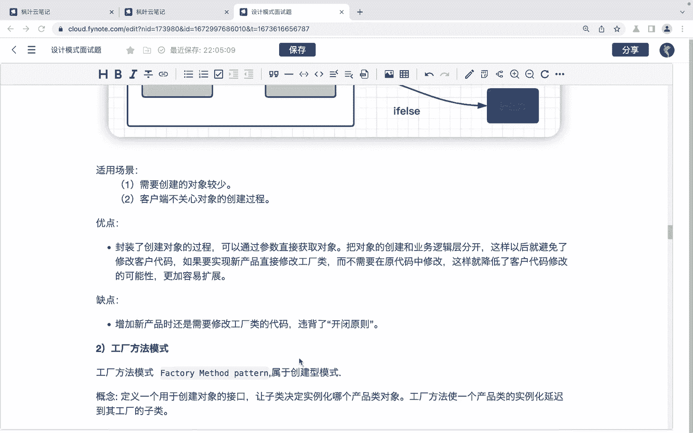

工厂方法模式呢，它的定义是这样的啊。😊，用用于什么定义一个用于创建对象的接口啊，让子类决定实力化哪个产品类对象。那么工厂方法呢使一个产品类的实力化呢延迟到了其工厂的子类。

这里边呢这句话的含义其实就是在我们上面简单工厂的这种模式当中呢啊它是。😊，只有一个这个工厂对吧？而在工厂方法当中呢，它其实是将工厂也进行了抽象，然后呢就抽象出了这个一个工厂抽象工厂和一个产品的接口。

那么对应的话呢，我们就用工厂A的一个实现类来去生产产品A，然后用工厂B实间来来生实验类来去生产产品B啊，那么这种工厂方法模式，它的特点，就是啊用户呢只需要知道具体工厂的名称，就可以得到所要的产品，对吧？

无需知道产品的创建过程。因为呢我们知道工厂A的话，我们就知道它生产的是产品A。知道工厂B的话，我们就知道它生产的产品是产品B啊，那么在系统增加新的产品的时候。

只需要添加具体产品类和对应的具体工厂无需对于什么原有的工厂进行修改。😊。

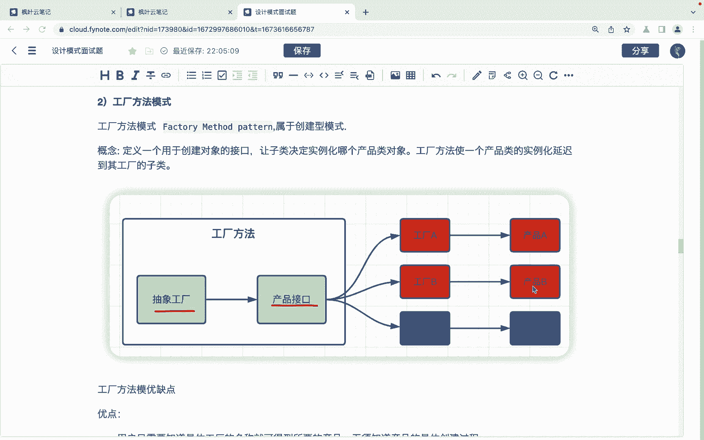

因为都是面向我们的接口的，所以呢它是满足开辟原则的。如果有新增的产品。首先要去实现这个收用工厂，再实现一个产品接口就可以了。好，然后呢对应的缺点就是每增加一个产品，就要增加一个具体的产品类和一个具体的。

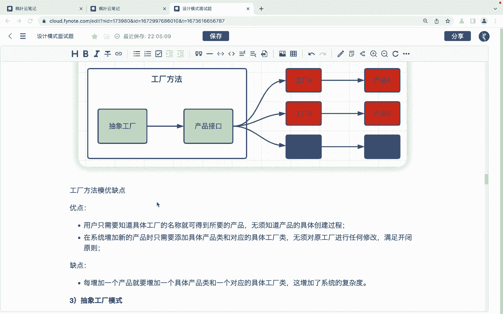

工厂类啊，那这样的话呢会增加咱们系统的复杂度。

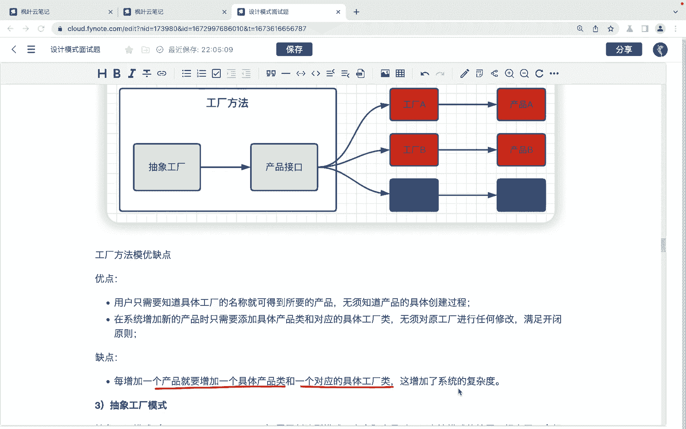

好，第三个就是我们说的抽象工厂模式。那么抽象工厂模式呢，它呢。

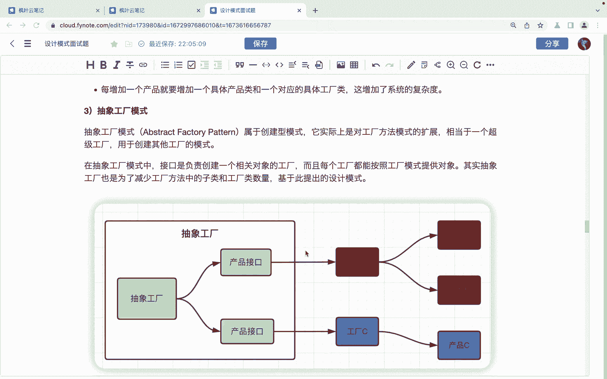

实际上呢相当于是对工厂方法模式的进一步扩展。啊，进一步的扩展。那么可以把它看作是一个超级工厂啊，它呢。😊，啊，在我们的抽象工厂模式当中，接口是负责创建一个相关对象的工厂的啊，而且。

每一个工厂呢都能按照工厂模式来去提供对象啊，那么这里边我们在工厂模式当中呢，它的一个最大特点就是每一个具体的工厂都提供了多个工厂方法，用于生产什么呀？不同类型的产品。大家可以这样理解。

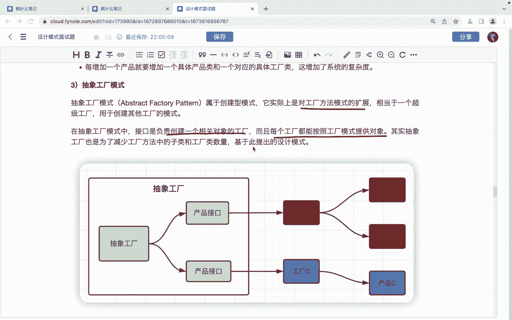

那么我们还是一样，会有抽象工厂，会有产品接口，也就是我们的这个啊。产品的接口和这个工厂的一个接口。那么首先呢我们会有这个工厂的实现啊，工厂的一个实对于抽象工厂的一个实现。然后呢。

我们这个在抽象工厂模式当中，我们的这个工厂的具体的具体类。那么它在生产产品的时候，它就不再指生产单一产品，而是生产某一个品类的产品。OK吧，比方说我就生产一个这个海尔品牌的这个它的，比如我生产一个电视。

我就可以生产海尔的一个电视，也可以生产海信的这样的电视啊，是这个意思。那么。

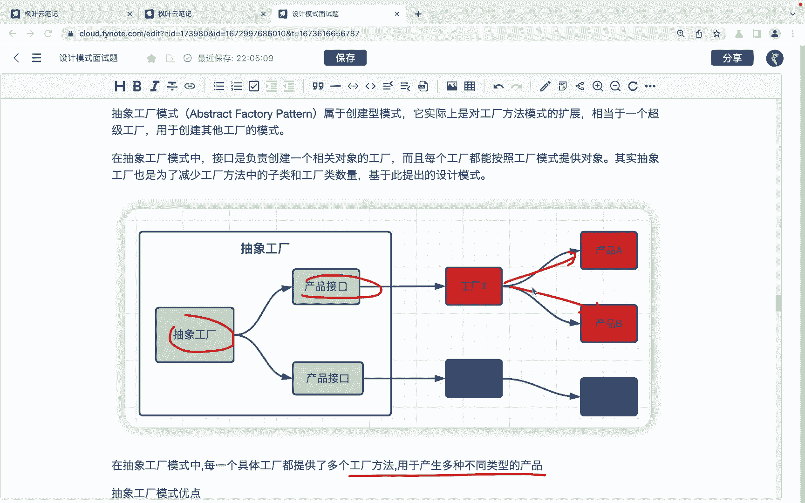

抽象工厂模式它的优点呢就是在对于不同产品，不同产品系列有比较多共性特征的时候，比如说我是某一个品类下的某一个品牌下的一个呃产品啊，那么我们可以使用抽象工厂模式。这样的话呢可以有助于提升咱们组建的复用性。

那当需要提升代码的扩展性，并且降低维护成本的时候，我们可以把对象的创建和使用过程分开啊，当然这个也是其他工厂模式它的一个特点啊优点。还有呢就是解决跨平台带来的兼容性的问题。那么抽象工厂模式的一个缺点。

它的最大缺点就是我们在增加新的产品等级结构的时候是比较麻烦的啊，整个的话需要对我们的抽象工厂来进行一个呃重新的体系重新一个呃设计。那么。😊。

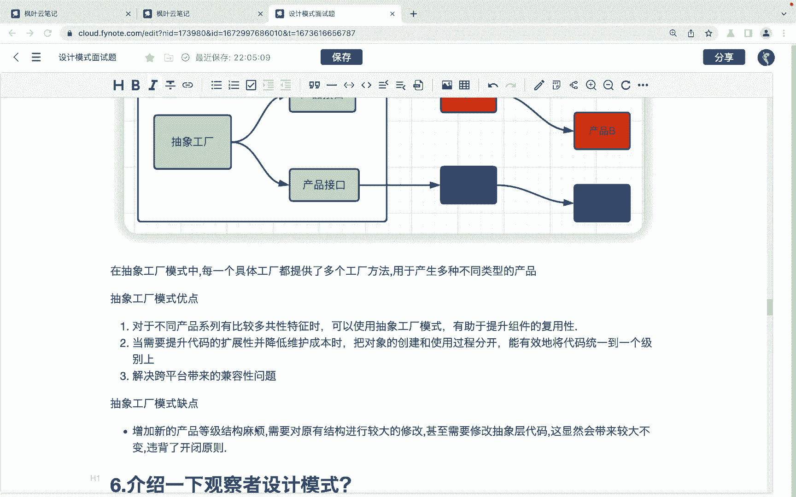

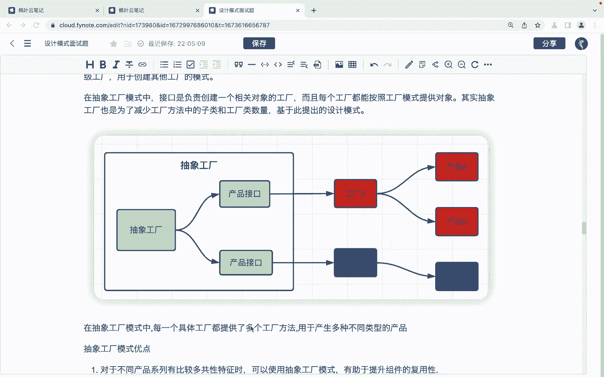

使用抽象工厂模式的时候，就要求我们对于当前业务的理解一定要是比较透彻才行。所以啊那么在我们说的这以上这三种工厂模式的这个当中呢，其实我们最常用的就是简单工厂和工厂方法模式。

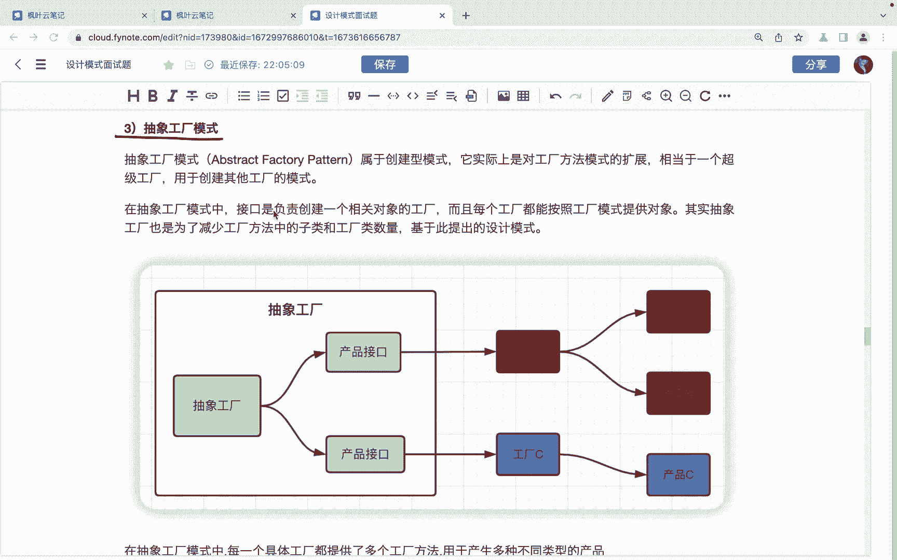

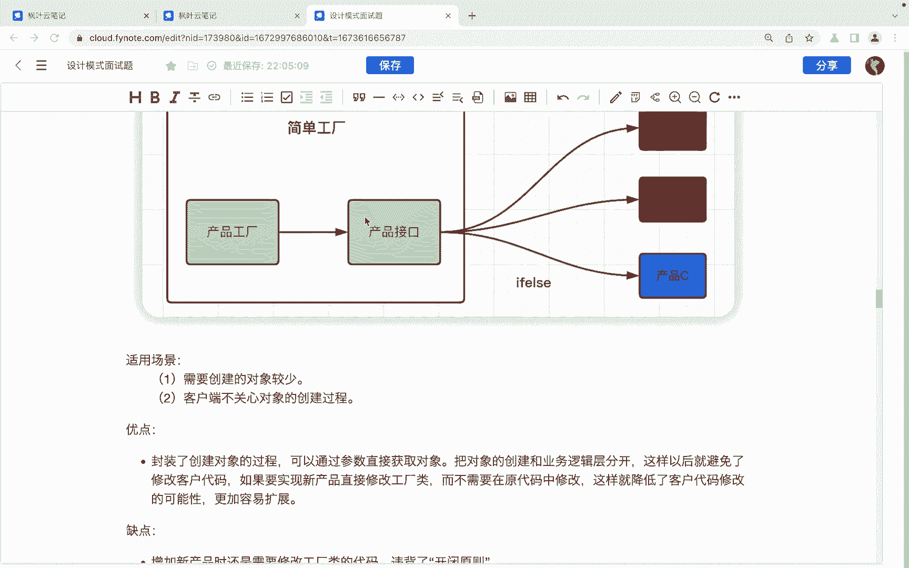

OK啊，以上呢就是针对于。😊，工厂模式有哪几种之间有什么区别？最早面试的一个讲解，希望呢能够帮助到同学们。😊。

