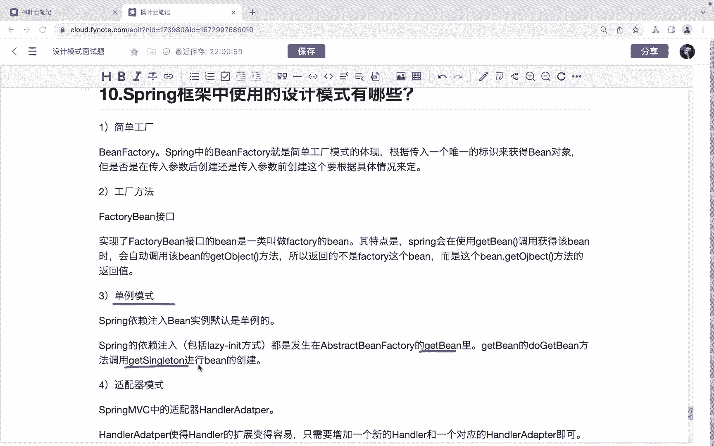
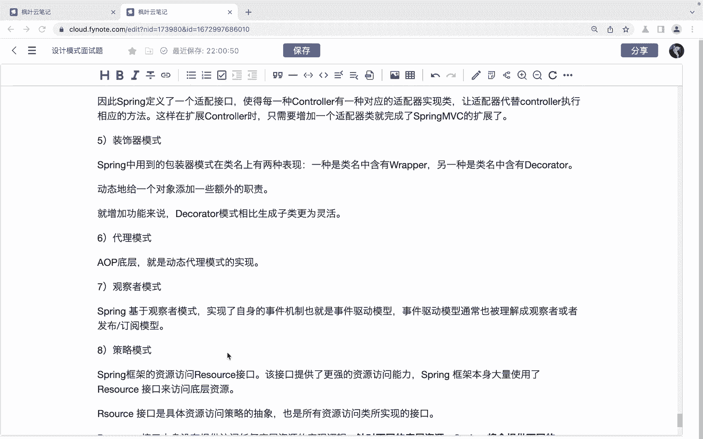

# 系列 6：P146：Spring框架中使用的设计模式有哪些 - 马士兵学堂 - BV1RY4y1Q7DL

同学们大家好，接下来呢我们来看一道来自于百度的面试题。😊，词人框架中使用的设计模式有哪些？定的薪资呢是30K。对应的岗位是高级开发工程师。那么首先呢我们先来看第一个就是简单工厂模式。

那么简单工厂模式对应的就是我们的这个B factory。ssp当中的be factor呢就是简单工厂模式的体现。😊，根据传入一个唯一的标识来获得并对象啊，但是。啊，是否。

在这个传入参数后创建还是传入参数前创建。这个呢需要根据具体的情况来去决定。第二个就是工厂方法模式。那对应的就是我们的factor bin这个接口。实现了这个factory bin接口的 bin呢。

它被叫做是factory病。它的特点是我们spring会在使用get病调用获得get病时，那么会自动调用get病的get object方法。😊，所以返回的并不是factory这个 bin。

而是这个bin的什么get。

哦们这个的方法呢返回置。然后呢，就是单立模式。那spring依赖注入病，它的实力默认呢是单立的。spring的依赖注入都是发生在这个abstract binfactororyge bin里面。

get病的多get病方法，调用get single。sing，然后呢进行什么bin的一个创建。

还有呢就是适配器模式。

springMAC当中呢，它的适配器handle adapter。😊，那么。handler adapt呢使用handler的扩展，使得这个handler扩展呢变得更容易。

那么只需要增加一个新的handler和一个对应的handler adapt就可以了。😊，因此呢，spring定义了一个适配接口，使得每一种conttrol呢有一种对应的适配器时间类。

让这个适配器呢去代替conttrol去执行相应的方法。这样呢再去扩展conttrol的时候呢，只需要增加一个适配类适配器类就可以完成什么sprintMC的扩展了。😊。

还有就是这个装饰器模式。装饰系模式。那spprint当中用到这个装饰系模式或者是包装系模式呢，它类名上有两种体体现啊，一个是一个是类名当中包含这个rappper的。

还有呢就是类名当中包含这个deator的，我们都可以啊这个。😊，认为他是使用了这个装饰器模式。那么使用这个装饰模式呢，可以动态的给一个对象呢添加一些额外的。这个职者。那么。对于这个增加功能来说呢。

我们使用这个装器模式呢要比生成子类呢更加灵活。

还有呢就是代理模式。那么AOP的底层就是动态代理模式来去实现的。然后呢，观察者模式。spring基于观察者模式呢，实现了这个自身的事件机制，也就是这个叫做事件驱动模型。

实验驱动模型呢也通常可以被理解为是观察者模式或者是发布订阅模型啊。

然后就是策略模式。

s框架的资源访问这个ressource接口呢，这个接口呢提供了更强的资源访问能力。😊，但是这个接口呢它本身没有提供任何这个访问任何底层资源的实现逻辑。😊，针对不同的底层资源呢。

spri呢它就会提供不同的是吧，提供不同的resource的实现类。然后呢，不同的这个时间类呢，他就。负责不同的什么资源的访问逻辑。

这是我们说的策略模式。OK以上呢就是针对于这个sm框架当中的使用的到德这个设计模式的一个这个面试题的一个讲解。😊。

那么针对于这样的一个面试题呢，其实如果同学们想要回答的更好的，就应该深入的对其中的某一个设计模式呢来去进行一个详细的解答啊。如果说我们只是把每一种这个设计模式呢给它介绍出来，介绍出来的话呢，那么。😊。

可能呢并不会让面试官去满意。所以呢我们可能要花费一些时间，对其中的某几个或者某一个这个设计模式呢进行一个深入的一个了解，看看这个sp当中是如何去使用的。然后在回答的时候呢啊。

基于源码呢更详细的去给他进行解答。😊。

OK以上呢就是对于这道面试的讲解啊，希望呢能够帮助到同学们。😊。

