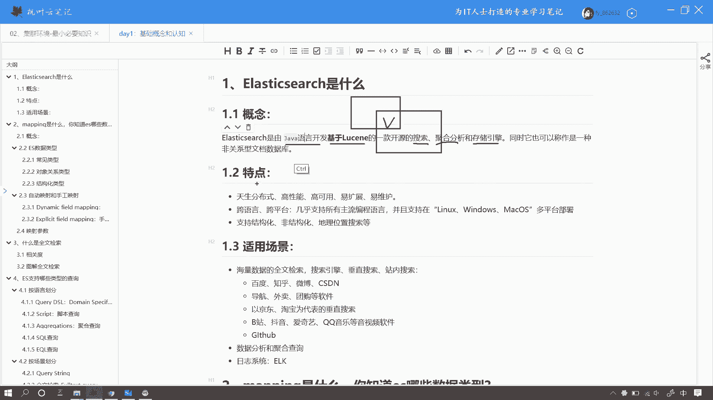
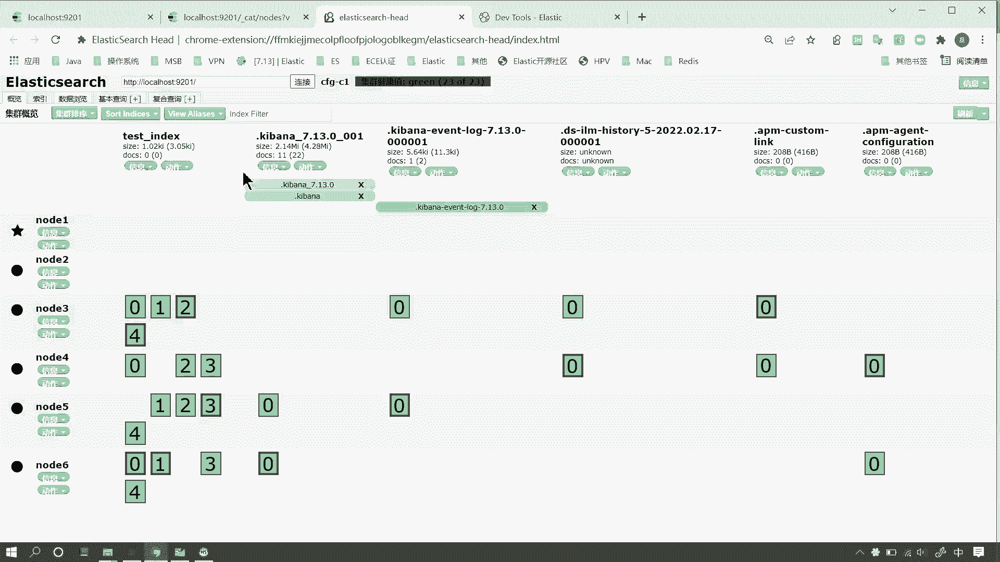
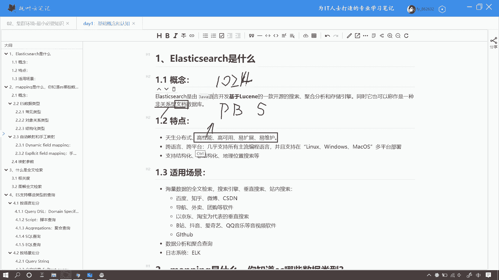
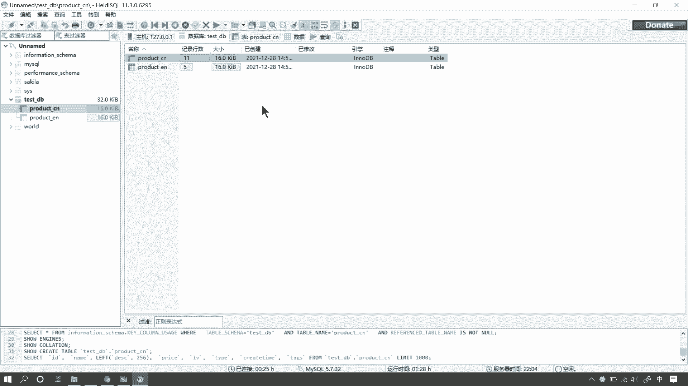
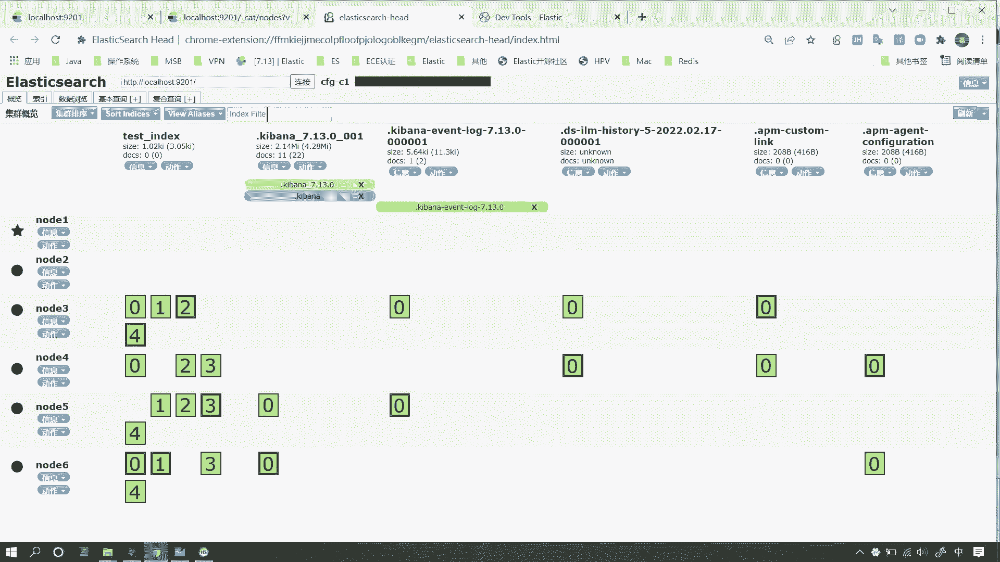
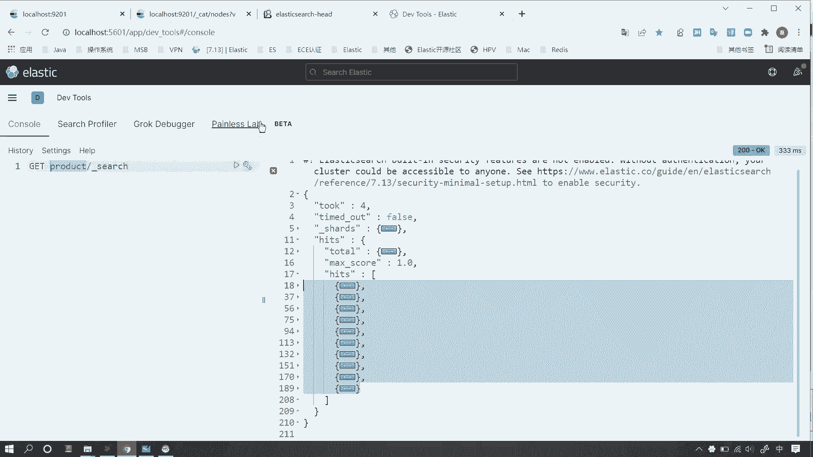
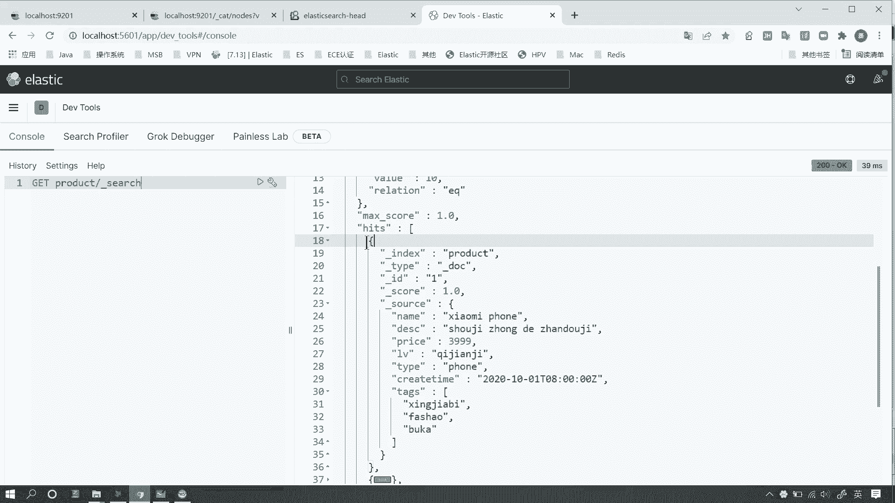
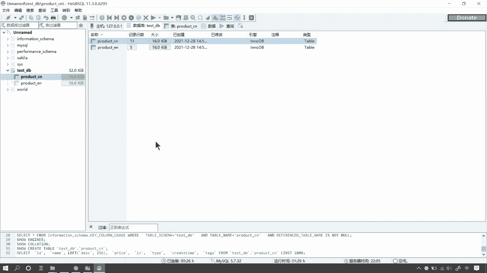
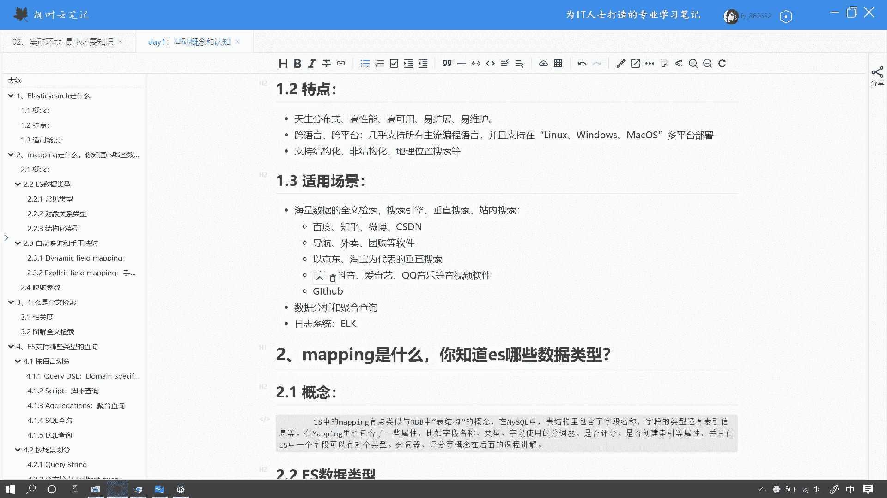
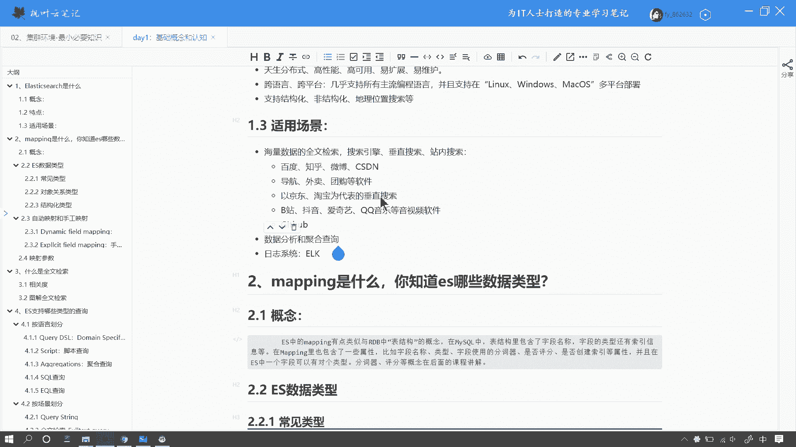

# 系列 6：P147：Elasticsearch是什么 - 马士兵学堂 - BV1RY4y1Q7DL

好，我们来看下面一个问题，ellect search是什么啊，相同的问法呢，还包括你对ellect search的理解是什么，或者介绍一下ellecticse。那么这道问题呢来自国美。

那对应的岗位薪资呢大概在15K左右。那下面我们来看一下这个问题如何来回答。呃，首先呢这是一个比较简单入门的问题啊。如果面试被问到了此类问题呢，呃我们切记啊呃切记去。啊，是这个忌啊是忌讳的忌。

我们切记呢去死记硬背它的这个概念啊，不管是你从互联网上或者说官方网站啊搜到的这个概念啊，咱们千万不要去死记硬背。呃，这样给面试官的感觉呢，就是你在考呃你在面试的时候呢，是一时突击的啊。

没有真正的理解拉se是什么？好，那么我们在呃回答此类问题的时候说呃要注意以下几个点呃，我们可以从不同的层面来回答这个问题。首先呢比如说我们可以呃从概念层面呢，我们抓住几个点就可以了。呃。

首先呢比如说呃拉 search呢，它是一个由java语言开发的。那么基于losing的这是两个点啊，一款。分布式的这个存储引擎或者搜索引擎。呃，那么在这里边呢抓住这两个点，首先是java语言开发。

第二个是基于lu。那么它同时呢又是一个搜索引擎。呃，网上有很多说呢拉se呢，它是一个搜索引擎其实是不太全面不太严谨的比如说呢这是拉 search那么搜索引擎呢。

它应该跟拉 search呢是一个这么这么一个关系啊，因为搜索引擎呢不单单是包含了这个搜索还有它其实还包含了聚合分析和存储这三个大的功能啊，也就是说呢搜索只是其中的一小块功能。那么搜索引擎呢啊。

就是下边这个方块呢，它其实除了搜索啊除了这个搜索服务之外呢，还包含了一些细分的学科，比如说thon爬虫啊，比如说RP啊自然语言处理，比如说大数据处理BI等等等等。么正确的这个如果严格的来说呢。

应该是这么一个关系啊。那这些呢其实你在面试的时候呢都。可以和这个面试官呢去聊啊，这些都是没有关系的。呃，理解了他的概念，然后你可以在你的理解之下呢，用你自己的语言去描述。

描述的不那么那个全面是没有关系的。呃，如果面试的时候呢，被问到了此类问题，一般来说呢都是作为呃非搜索岗位呢呃问到一些关于la search。那dela search呢，它会作为一个加分项啊。好。

那么理解了这个el拉 search之后呢，呃咱们除了这个。呃，除了这个概念层面啊，你还可以把它理解为一个分布式的数据库。好，我们来看啊，我们来看我这儿呢启动了一个lar search的服务。

好，那么如果我们把它类比呃关系性数据库呢，好，我们来看啊，我这画了一个红色的方块。好，我们可以把这个方块里边呢，这个叫test index的啊，这个索引呢理解为my circle中一张表。

那么和my circle不同的是我们的ellect search呢，它是天然支持分布式的。好，我们看到左侧的这里边呢有6个节点。也就是说我们的这个表呢是分布在不同的呃节点上呢？好。

里边你看到这些绿色呢是分片啊，我们后边会说好，这就是它的天然分布式的特性。那除此之外呢，它还具备了一些你像高性能啊高可用啊易扩展易维护等等这些特点。何为高性能呢？好。

我们的ES呢是可以在PB级的数据前提之下呢达到一个秒级查询啊，秒级的查询。这个呢是可以这个和面试官去聊的啊，PB级的数据啊，就是TB就是1024TB。

啊，10啊1024TV就是1PD好，那这是它的一个高性能。那么高可用呢就是说我们在不同的我们在呃很多个集群呃很多个节点组成一个集群的前提下呢，我们可以方便的去进行。呃，一系列的这个高可能策略啊。

让它保证它的服务的可用性。那么易扩展呢是它的另一个特性。就是说当我们的这个服务呢呃达不到我们的性能要求的时候，我们可以非常方便的进行横向扩展。

那么易维护呢就是呃先天的ES为我们提供了非常方便的这个运维的一些支持啊，基于这些特性呢啊我们可以把这个ES理解为一个天生的支持高可用分布式的啊，呃支持高可用高性能易扩展的这么一个分布式的数据库。好了。

它还有一些你像这种跨语言和跨平台的特性呢，使它支持了目前呃几乎所有的这个主流的编程语言。你像java、 faceshoppythonGP还有go等等等等啊，并且呢ES呢它是天生支持这个跨平台的啊。

你可以非常方便的在linux windows和mic OS啊，这这个多个系统上进行部署。呃，同时呢它又是支持多呃多种数据结构的。你像这个结构化的或者非结构化的数据啊，还有地理位置搜索等等。呃。

这里边呢有一个非需要大家去记住的一个叫啊它是一个非关系型的。嗯，非关系型的这是需要注意的啊，它和myro最大的区别就是它是非关系数据库。还有一个非常重要的概念啊，叫文档型数据库。啊。

看啊注意是文档和数据库图为文档和数据库呢。好，咱们呃还是拿my circler来举个例子。那么这是咱们看到的my circlercle呃非常简单的一张表啊，就是一个商品表。那么它有名称啊，有描述有价格。

那么呃在my circler中呢，我们存储数据的方式呢，是以行为行这个行的方式来存储。那么当行啊就是你的数据的这个字段数量确定了之后呢，其实你的行的宽度就确定了。

因为我们在my circle中呢去创建数据之前，我们首先要对每一个表呢去呃创建它的这个表结构。

喂。啊，在这里啊，那么每一个字段啊，当字段的数量确定了之后呢，每一个字段的宽度啊也就确定了。也就是说你行的宽度也就确定了啊，这样的话就是说呃。

也就是说这个我们my circlercle和这个ES最大的区别就在于它存储方式的不同。好，我们可以看到当前啊我打开一个界面。那么当前这个界面呢叫做d tools啊。

咱们可以把它类比为我们my circlercle的客户端，也就是比如说啊以我当前打开的这个 circle或者说把它理解为咱们经常用的这个叫啊都是可以的那这个 tools呢是可以我们可以在里边去写我们的查询语句的。

比如说我们当前啊写了一个非常简单的语句呢，我们可以看到当前的这个返回的上下文，这里边呢是给我们返回了一些查询的结果。好，我们可以非常方便的看到这里边返回了10条数据啊，当然这是默认它返回了1条数据好。

我们打开一条数据呢可以看到这里边的数据呢，它实际上是一个jason的格式啊，是一个jason的格式好，那这个是和我们作为关系数据库一个最大的区别啊。啊，它的存储方式是不一样的。

好。好，那这是关于它的一个呃使用的一些特点啊。那么下面呢ES呢，其实它有一系列的这个使用场景啊。呃，这个是关于此类问题啊，我们也可以和面试官去聊的一些话题。那首先呢呃。那个比拉迪 search呢。

它是支持呃搜索呃聚合以及存储三大功能的。那么其实它最典型的功能就是全文检索啊，也就是搜索呃，它在搜索这一方面呢，其实它的性能是无可撼动的啊，可以说是呃无人可以那个无人可以出其右啊。

就是这么一个绝对的霸主的地位。那么它的性能呢是达到了一个PP级的秒级PP级数据的秒级查询。那么几乎可以这样说呢，就是在目前的互联网公司呢，几乎没有一家公司，它是用不到这个搜索功能的。

那么而如果只要你有这个搜索功能呢，你几乎就可以用ES来做啊，甚至可以说ES是你做搜索功能的不二之选啊，毫不夸张啊。那么你像你打开你的手机APP打开你的手机呢，你可以看到你手机的APP呢。

几乎没有一个软件呢是没有搜索功能的啊，甚至你可以比如说你在你的负一屏或者你上滑，很多地方都可以看。到啊搜索的影子啊，那你比如说咱们经常用的这个全文搜索引擎，百度知乎啊，vivo CSDN的像一些呃。

垂直领域，比如说导航外卖啊，这种团购软件。那么他们都有一个地理位置搜索。比如说基于一个定位呢，搜索方圆10公里范围之内啊，对吧？这种搜索场景是非常常见的。比如说当前一个呃你的手机APP打开呢。

呃我们都会首先确定你的位置，那么基于这个位置呢，我们可以查找方圆，比如说10公里范围之内啊，我们去可以画一个圆是吧？好，我们可以判断一系列的这种地理位置搜索的这种呃这种业务啊业务场景。

那么还有呢比如说以京东啊，淘宝为代表的这种电商类，或者说其他的品类的这种垂直搜索，还有咱们经常用到的这种呃音视频软件啊，像B站抖音啊，或者说腾讯课堂这种软件呢都是啊一样的。

还有咱们最常用的pi hubub。

好，那么除此之外呢，你像咱们经常用到的这种ERK日志系统啊，呃这个也是非常常见的一个典型的用场景。呃，当然了还有咱们的这个聚合分析。你像一些比较大的公司呢，都有数据分析部门啊。

就是商业智能business intelligencetel啊，这个有兴的有兴趣的同学呢也可以了解一下。

ok。