# 系列 6：P148：Mapping 是什么？你知道 ES 中有哪些数据类型 - 马士兵学堂 - BV1RY4y1Q7DL

OK我们来看下面一个问题。ES中的m品是什么？呃，在这个问题之上呢，其实还可以衍生出第二个问题。那你了解ES中支持的数据类型有哪些呢？这是一个来自阿里一面的面试题啊。

那对应的岗位薪资呢在15到20K左右。呃，下面我们来看一下这个问题，我们该如何来回答。好，那么很多同学呢不太理解makinging的呃概念啊到底是个什么意思？那么字面翻译呢m是映射。呃。

如果我们硬是把它翻译成中文呢，可能不太好理解。呃，我们可以把它类比为关系型数据库中的表结构啊这么一个概念。

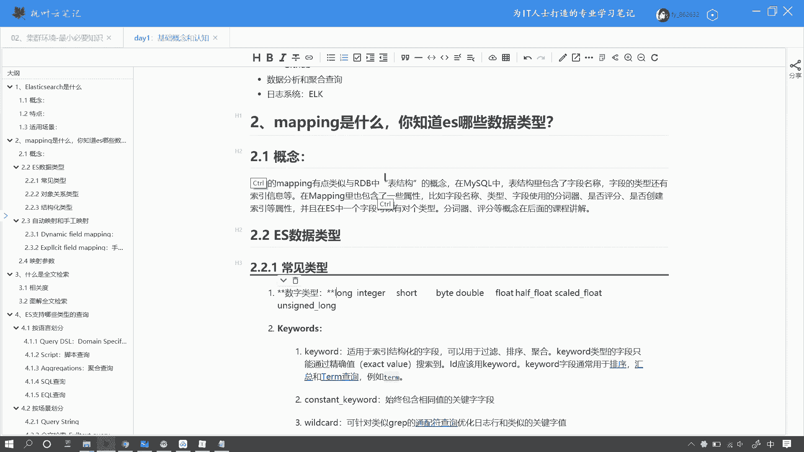

好，那么我们还是以my circleq为例啊，我们看一下my circle的表结构中呢，包含了你像咱们经常见的一些呃像字段名称呢，数据类型啊，还有这个字段长度啊。

还有这个是否主建呢等等等等一些这个呃字段的属性啊。那么在ES中呢，其实它也是包含了以上概念的。你比如说数据类型啊，咱们来看一下ES中的my了。

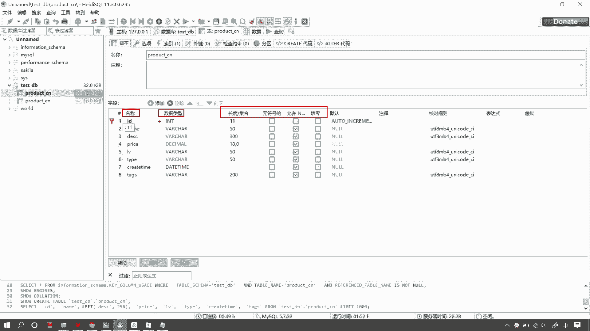

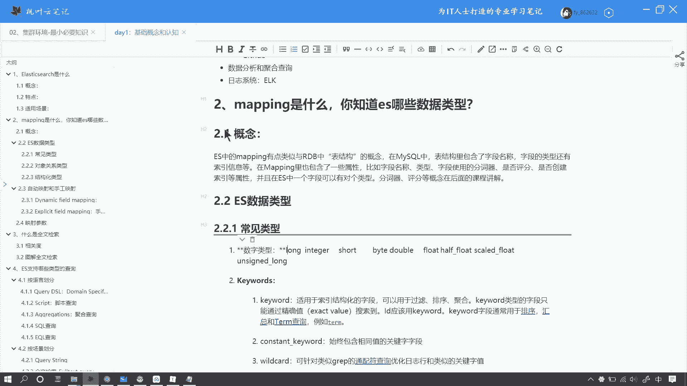

好，那么我们当前看到的啊就是我们通过这个脚本查到的啊，这个结果里边包含了你像ming里边包含了propro呢里边其实就定义了一字段的一些常见属性比如说啊我们先把所有字段呢折叠起来。

比如说当前的这个索引中啊，包含了pretimeICLV name等等这些字段。那么每一个字段呢啊又包含了一些其他的属性。你比如说type这个字段类型是什么？好。

我们打开DIC呢里边呢又包又会包含一些除了t啊，我们看到还有一个field，那么field呢这个就是除了字段类型啊，在关系型数据库中没有的一些属性啊，就是子字段啊，甚至呢我们还可以往下看啊。

我们除了这个呢其实还有一些在关系型数据库中不会见到的这个属性呢，比如说啊分割器，比如说是否打开索引等等等等啊，这一系列的这个属性啊，那。最大的区别呢其实还是我们在定义的时候啊。

存储的数据结构呢是以这种jason的格式存储的啊，那这是和关系型数据库中最大的一个区别啊，那比如说还有分制器这个概念啊，ES中呢，就是在那个卖关系型数据库中呢啊也是没有的啊。

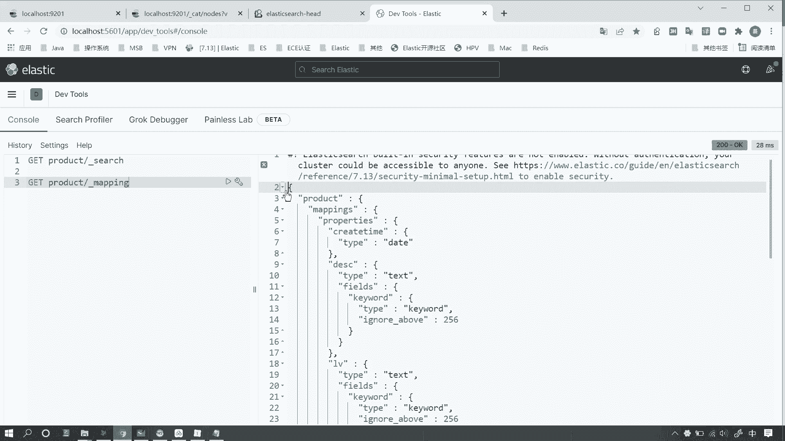

呃，咱们在面试的时候啊，如果被问到了腐类问题啊，咱们就抓住这几个点。首先呢呃它的文档格式是jason的。另外一个你可以提几个在关型数据库中没有的概念啊，比如说分配器啊，比如说这个子字道的概念。呃。

这些都是my circlel，它和my circle的一个区别啊。如果说呃让你去描述它是一个什么东西啊，你就可以这样跟面试官说，那么它有点类似于呃关系型数据库中的表结构，但是又有区别。

然后你把区别说一下就可以了。那么我们来看一下ES中ming它常见的一些参数啊。首先呢这个数据类型呢，咱们常见的数据类型呢。

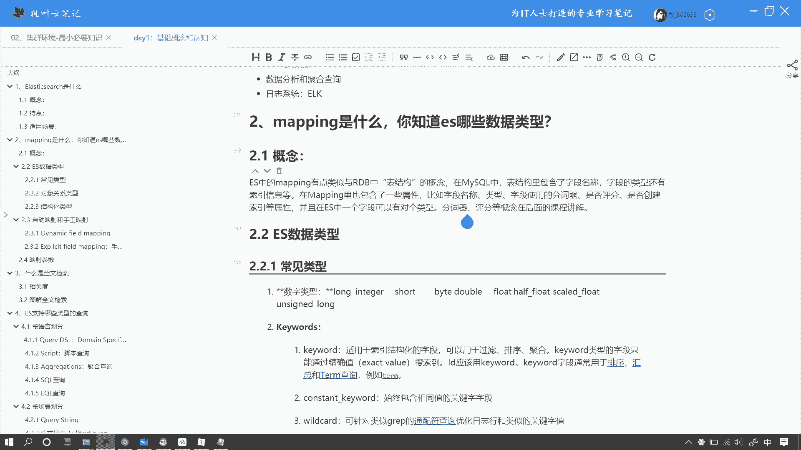

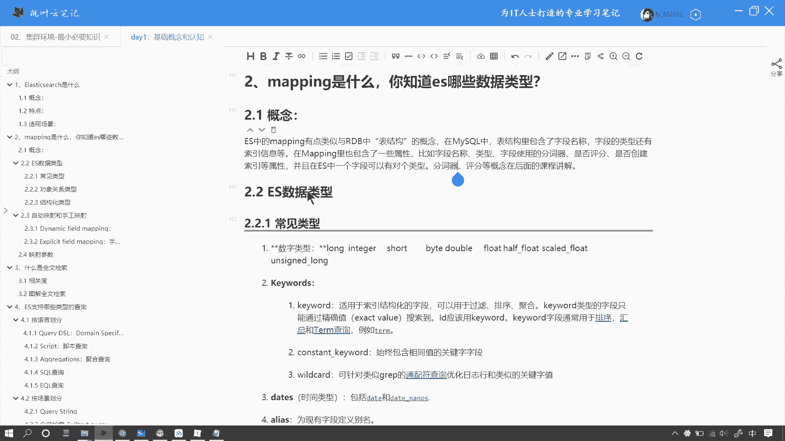

当然了，有数字类型啊，数字类型呢和咱们呃java中常见的一些类型很像啊，你像long类型，int short类型，还有这个get类型，double类型等等啊，浮点型。那么最常见的类型。

第一个呢叫keyword啊，keyword呢其实又分为三种啊。那么咱们最常见的叫keyword啊，keyword呢它适用于精确查找而不适用于全文检索啊，就是它是不分词的啊面试的时候呢。

你能答上这一点就可以了。好，那么咱们还有这个content的 keyword和willcard，这个是那个用于通配符查找的。这个这个其实很那个是很不常见的一个东西啊，啊。

咱们记住有一个keyword类型呢，还有一个时间类型，时间类型呢就是data类型啊，还有这个别名，别名能答上来就行，答答不上来也没关系啊。那么最最最重要的类型呢就是tex类型，也就是文本类型注意啊。

这里边呢不是str啊，而是text。那么每一个tex类型呢默认都是要被分词的啊。

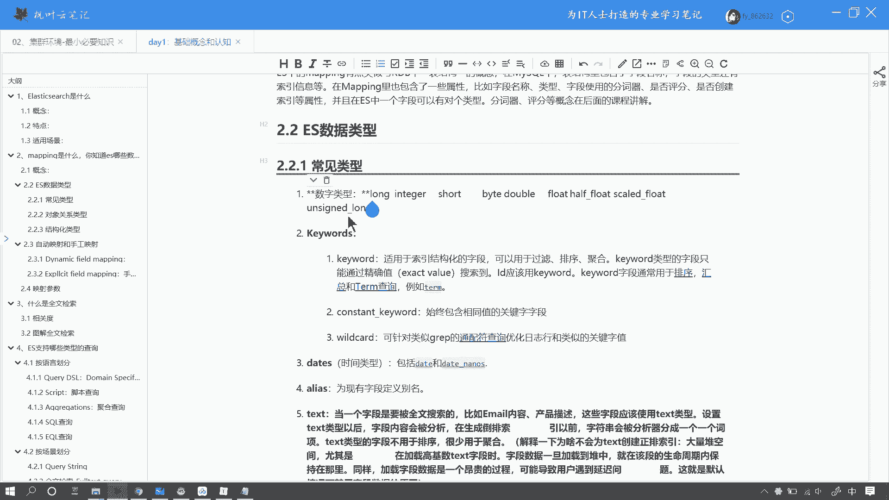

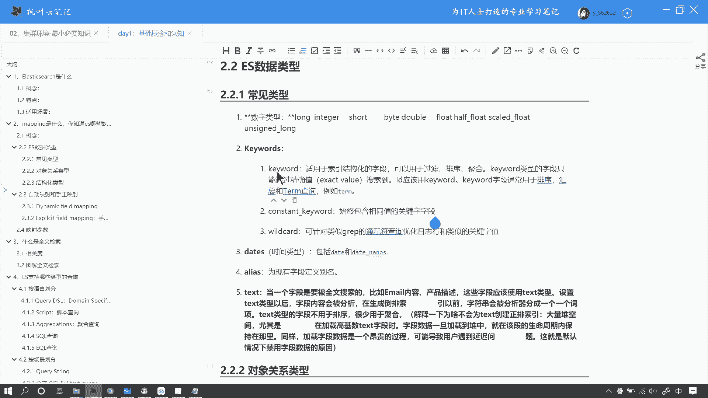

也就是说它的作用呢就是为了创建倒排索引，而倒排索引的作用呢是为了方便我们进行全文检索。那么这也是ES4啊，就是el拉 searcharch。它最最最最重要的一个功能，没有之一。OK好。

这是它最重要的一个类型啊，也是最常见的。那么下面呢除此之外呢，还有三种比较特殊的啊这个对象呃这种嵌套类型或者说是复杂类型啊。第一个呢叫object啊，第二个呢是max啊用于嵌套类型。

而joy呢是用于父子及关系的查找。那么三种啊三种这个类型呢，它们的性能是依次下降的。呃。

这个呢咱们不需要知道太多啊，那么这个因为其实用的不是相对来说，相对于t来说不是那么多的啊。那么达到这里其实就可以了。嗯，你要知道这三种特殊的这个对象的对象关系的这种类型，还有还有一些比较不是那么常见的。

你像如果我们用于地理位置检索呢，你像GUpointGU shift呢，这两种类型呢是用于嗯地理位置坐标啊，坐标这种查找的，还有cart啊，不是还有这种point存储点，还有shift存储几何图形。

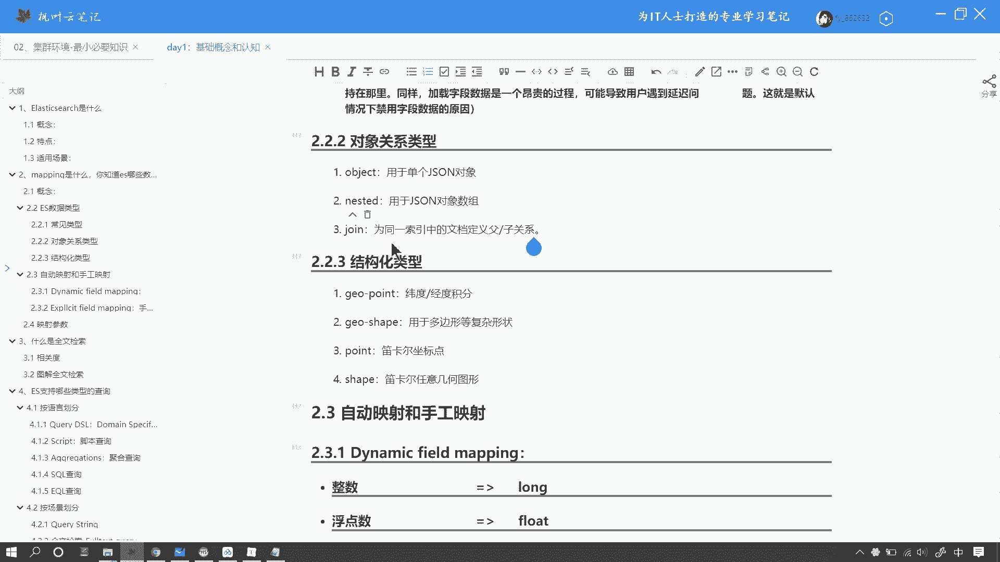

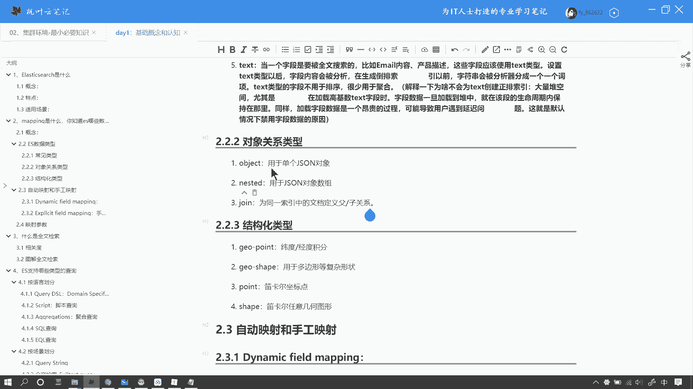

好了，那么在ES中还有一个和嗯关系型数据库中一个比较大的区别啊。就是说咱们在创建关系型数据库的时候呢，我们在创建表之前呢？首先我们要定义表中包含哪些字段，其实表的字段固定了跟我们的行宽也就固定了。

那么和my circle最大的一个区别啊，不能说最大一个区别，一个很显著的区别呢？就是我们ES在创建数据啊，数据表之前，也就是索引之前呢，我们是可以不定义每个字段有什么类型？

就是说我们甚至可以不定义字段的数量。

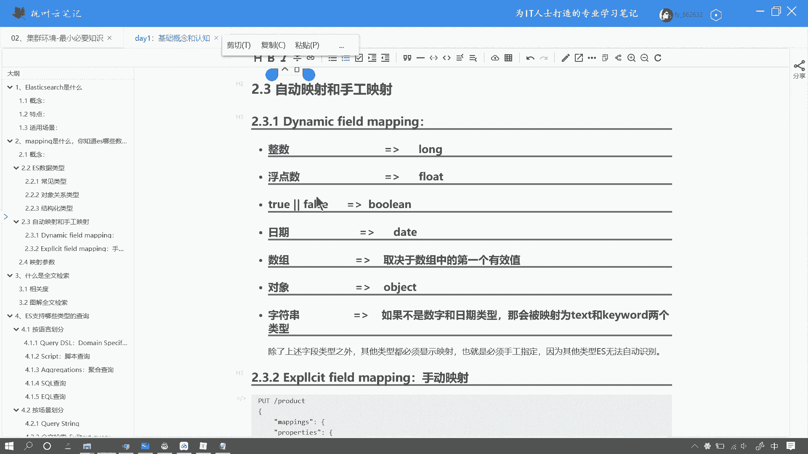

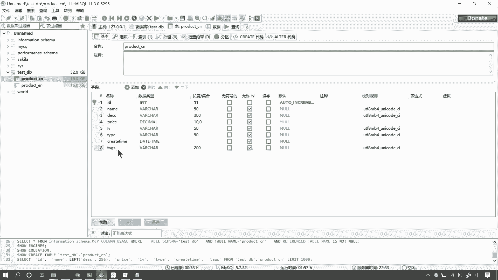

好，我们什么都不用定义，直接就可以向数据库通啊，向索运中写入数据。比如说我们当前我们来查看一下get。

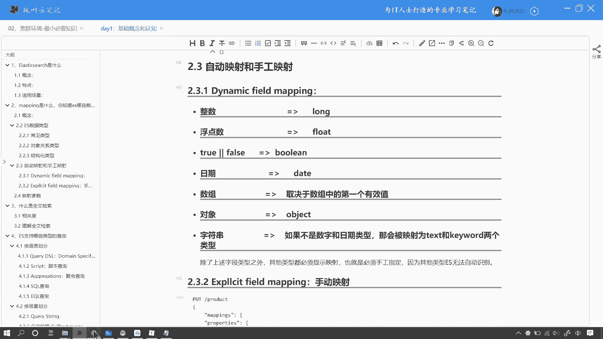

Cat。到NDIC我们当前这个命令呢是查看当前呃，集群中呢包含了哪些索引。我们可以在右侧啊很清楚的看到，那包含的索引呢一共有这么多。呃啊一共有这么多。那么我们比如说我们可以当前呢。

我们可以随便创建一个索引put，比如说叫test。啊，index啊随便给它起一个2，没这个肯定是没有的啊。DOC杠啊，那么大家如果不熟悉这个命令是在干嘛的啊，这个也没有关系。

只需要知道我当前呢是在创建数据就可以了。好，随便给一个value啊。那么我们创建了。好，我们可以看到当前的数据呢就已经created啊，已经创建成功了。那么我们可甚至可以查看它的表结构啊。

也就是ming。啊，它的表结构呢就自动创建了。那么这个自动创建的这个字段类型呢啊会根据你输入的这个内容呢动态的去判断啊，包括呢你看它有一个子字段呢叫keyword。

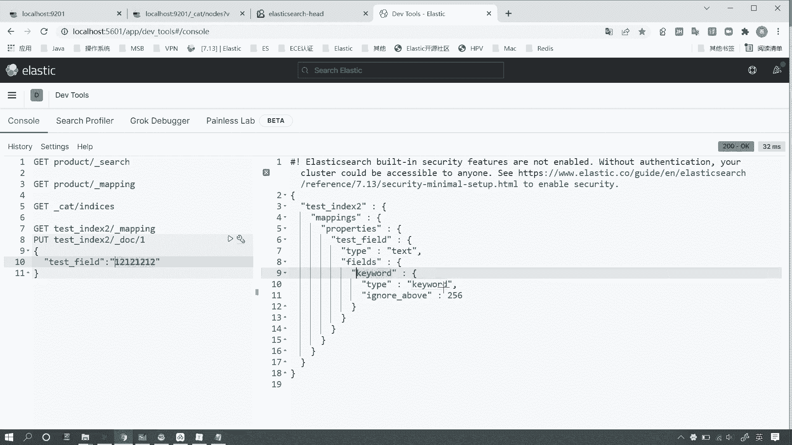

那么我们这种叫dynamic fieldmaking呢就是自动映射，也就是根据你输入的字段的值呢，自动的去创建ming啊，这里边呢如果我们输入的是数字类型呢，会给你创建一个浪类型啊。

如果你输入的是小数点类型呢，会那个创建一个f类型啊，这个映射的规则呢，就是我们当前屏幕上看到的这些啊，那这个呢叫dynamicmicmaking，这个是两种呃映射类型的，其中一种叫自动映射啊。

叫dynamicmic making。还有一种呢叫手工映射。如果面试的时候呢，问到了这两种映射类型的啊，那么我们要知道呢在生产环境中呢，我们一般用于手工映射啊，我们一般用手工映射。

因为啊如果你采取自动映射呢，它给你呃自动映射的类型呢，可能会有一定的资源浪费啊，不能完美的匹配我们的业务场景啊，也就是说可能会导致你的这个性能下降好，所以我们一般使用手工映射，就是在。

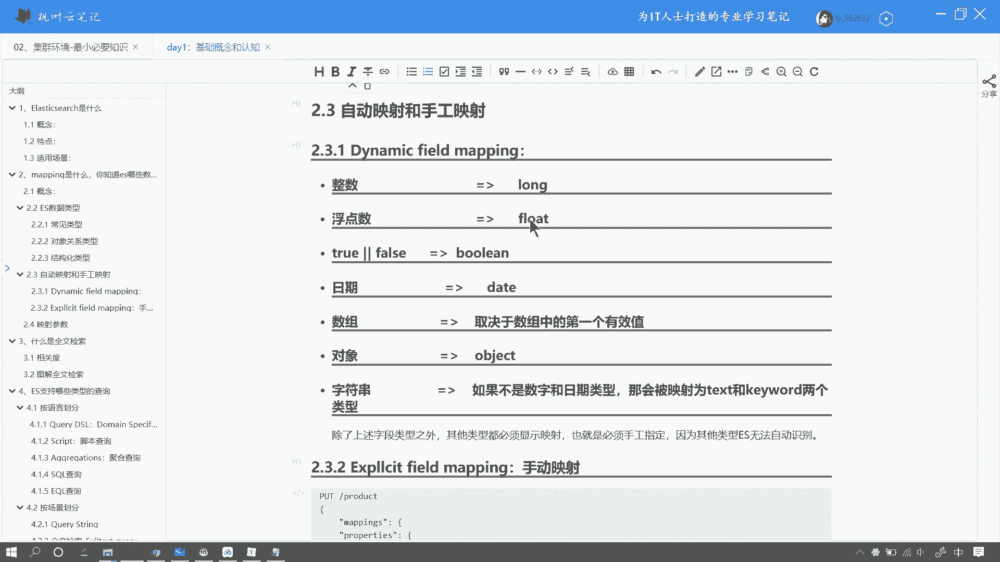

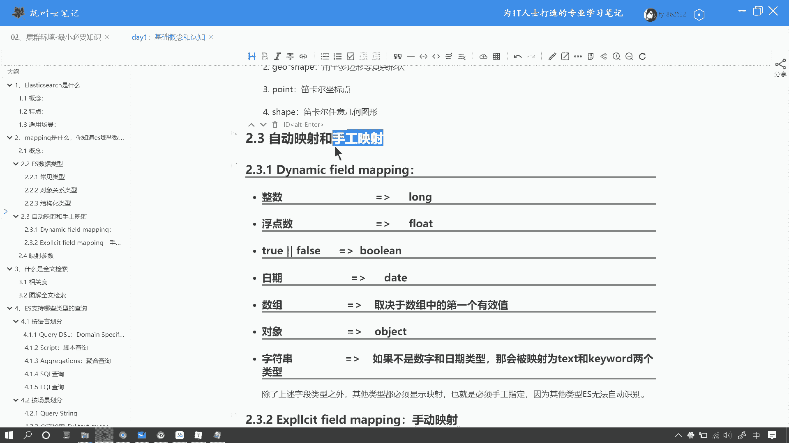

创建字段之前呢，我们手工去创建ming就是这么简单。好，这是关于ming的两种啊映射类型。还有呢就是映射参数。

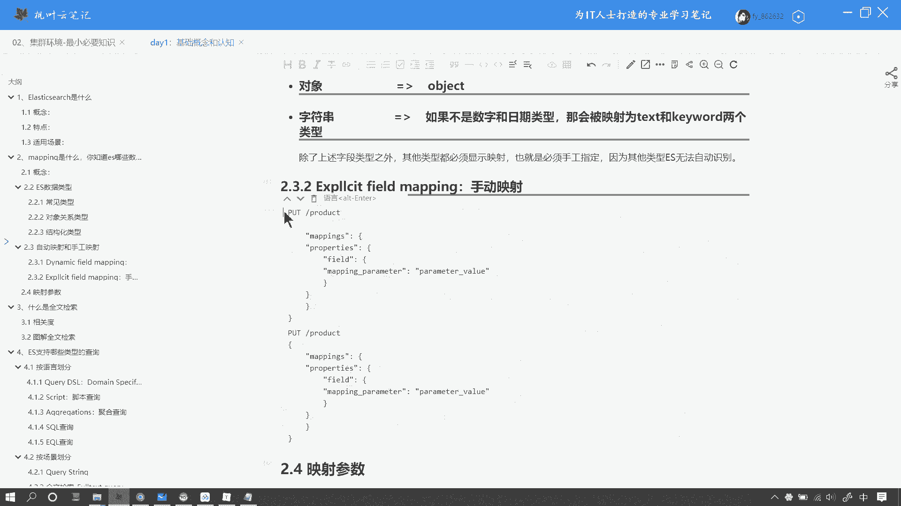

那么这个映射参数呢不要求大家呢那个把每个字段都记住啊。那这里边呢像咱们可以动态的关闭嗯这个一些属性。比如说我们当字段上不需要进行检索的时候呢，我们可以把它关闭盗牌索引啊。

这样呢会节省一部分存储索引的空间。你像我们可以在每个字段上呢指定分词器，或者说指定评分的权重啊。当然了，这里边呢需要记住的有几个呢。好，我看看啊，其实这些呢呃咱们都没有必要呢去死记硬背啊。

甚至说你记不住的没有关系啊。呃，在使用的时候参看文档就行了啊，这个参数呃你只要知道就可以了。那么咱们关于ming的几个重点呢，首先呢是这个两种映射方式啊。第二个是咱们常见的数据类型。

第三个是你要理解ming它的一个含义是什么？它的作用是什么，以及呃这个参数啊，你们看我们看这个映射参数呃，什么时候会用到呢？在索引的调优啊，就也就是说呢咱咱们在后边这个题呢，我会详细的来说。

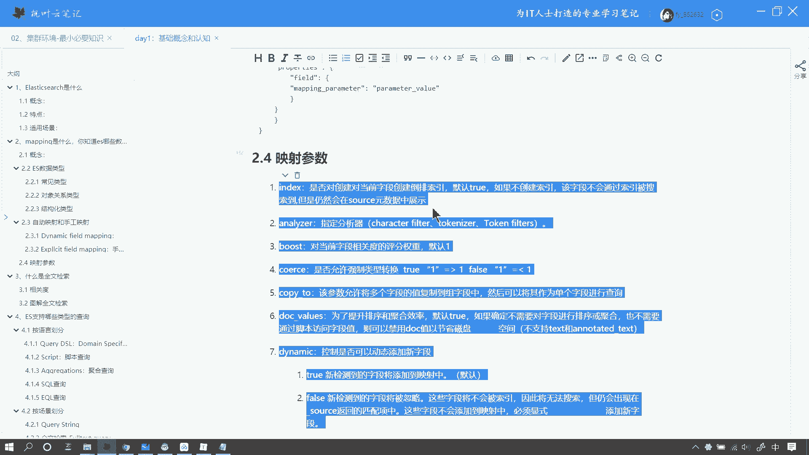

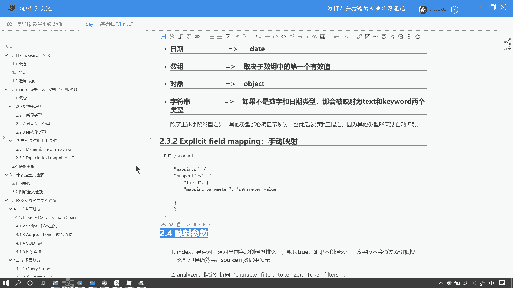

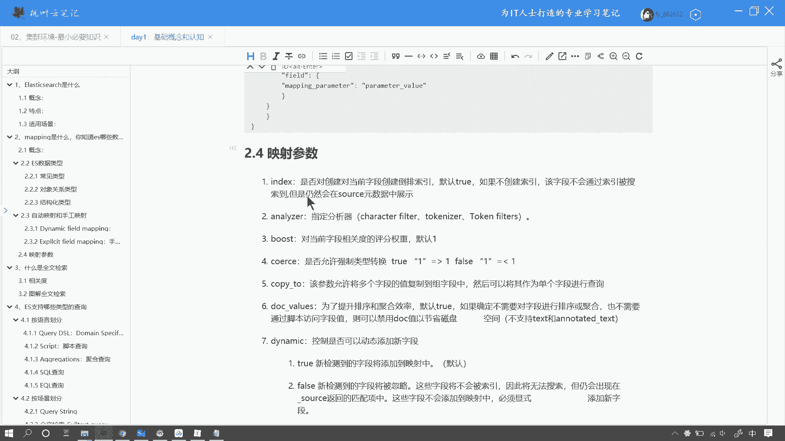