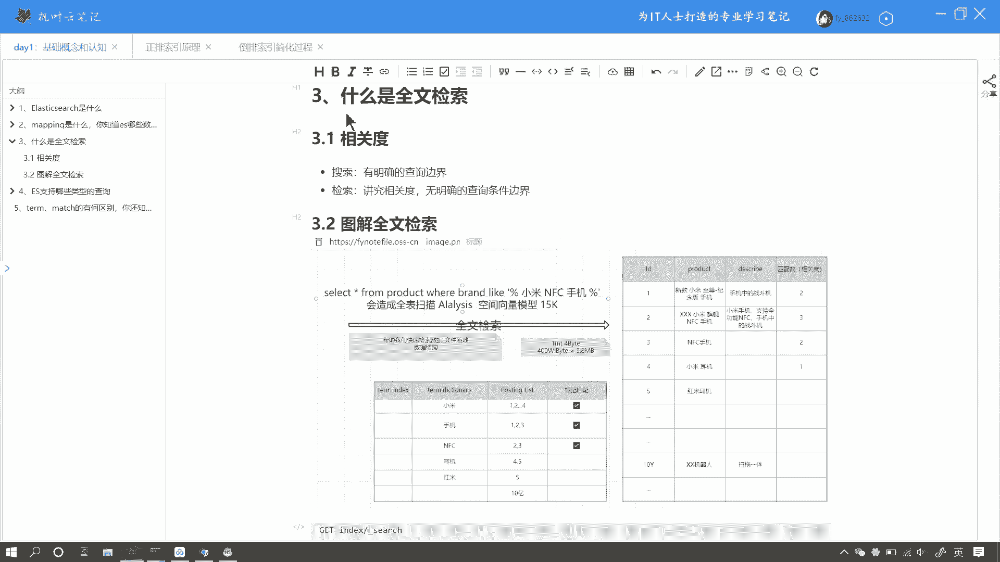
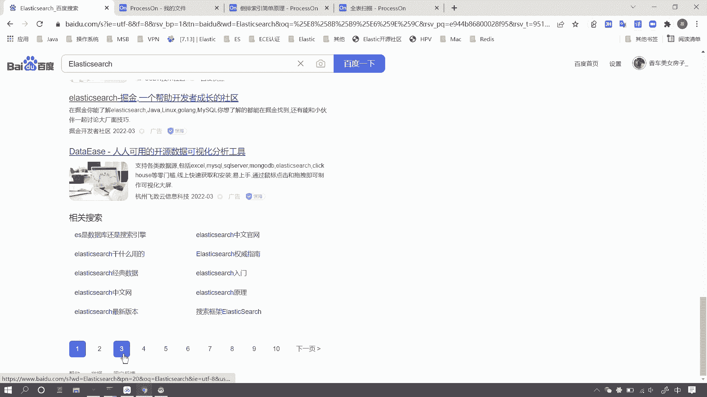
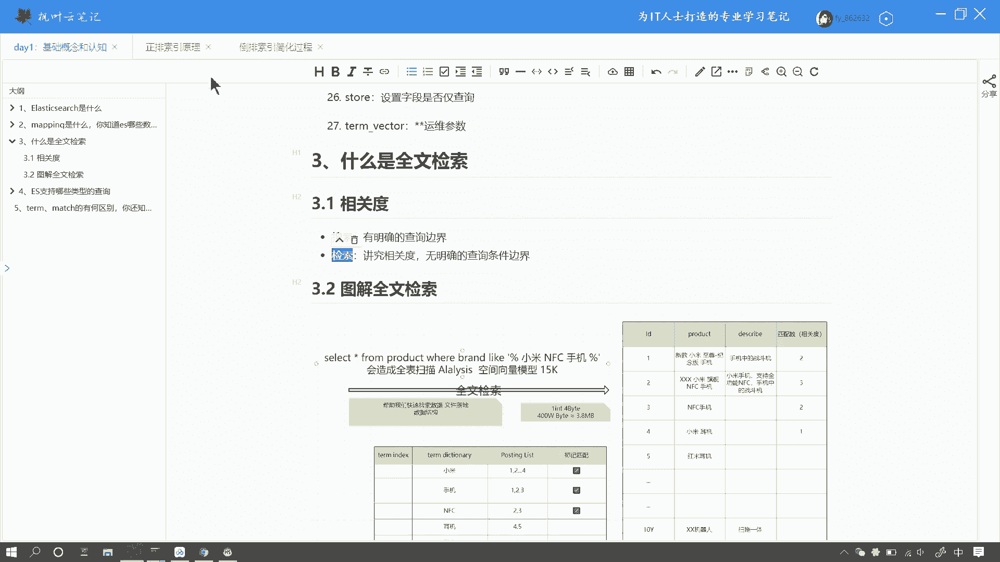
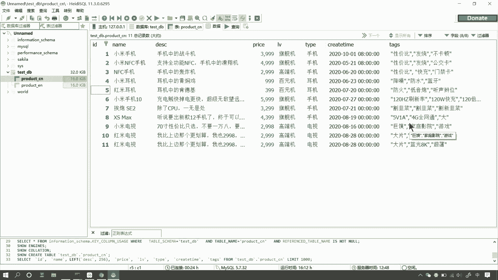
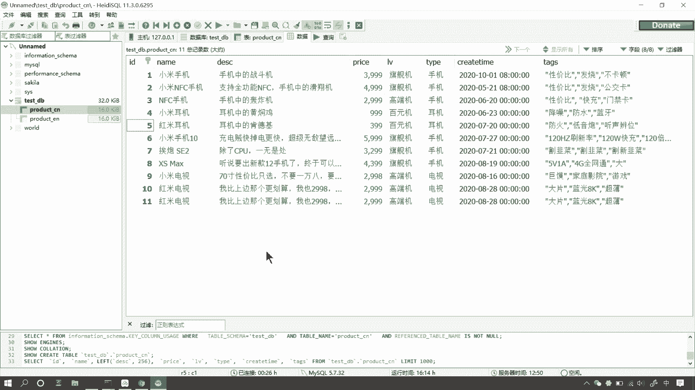
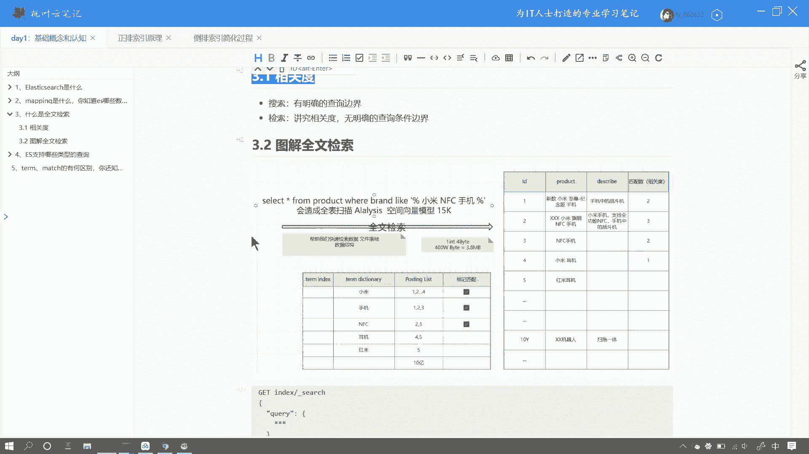
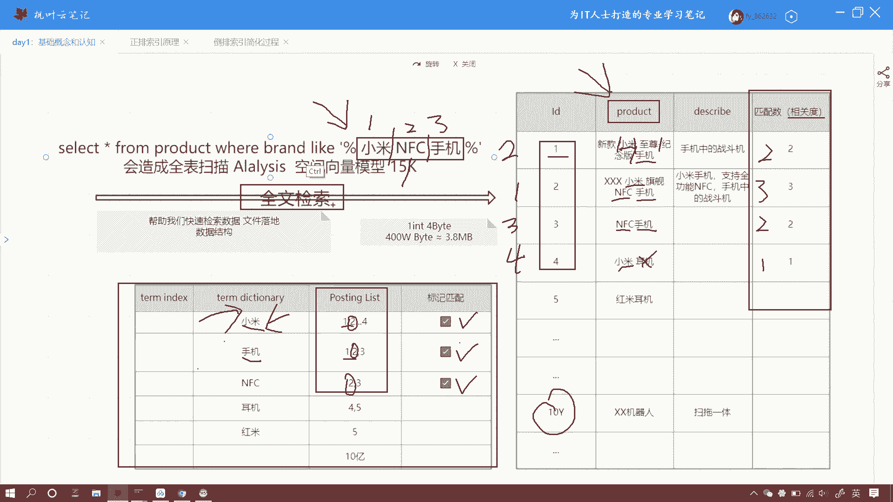

# 系列 6：P149：什么是全文检索 - 马士兵学堂 - BV1RY4y1Q7DL

好，我们来看下面这个问题。什么是全文检索？那这是一道来自百度的面试题。那对应的岗位薪资呢在25到30K左右。好，那么下面我们来看一下这个问题，我们该如何来回答。啊，那什么是全文检索呢？在面试中。

如果被问到了这个问题，我们应该怎么回答呢？好，那么首先如果你被问到这个问题呢，你可以先抛出一个观点。好，全文检索就是会背分词的检索。好，那么我们经常啊使用的这个百度呢，还有google呢。

其实呢都是全文检索类的搜索引擎哈。那么比如说我们在呃百度中呢，我们以搜索一个关键词。比如说我们搜索一个alex search。

好，那在百度搜索返回的这个结果啊，这个结果列表里呢，上面呢有一行很小的文字。好，看这里。🤧。百度为您找到啊相关结果约1亿个。好，那这里边有两个关键点啊。首先呢这个1亿这个数字呢。

有没有人去质疑过这个结果的准确性呢？好，那我相信大家嗯几乎所有人呢都没有去质疑过啊。那么其实质一也没有用啊，也没有什么意义。因为这个数字其实对我们来说呢是不太关心的。

而另外一个关键点呢就是这个相关二字啊何谓相关的啊，我们看百度为我们召回的这个结果列表啊，有很多条这个网页的这个t头。那么最下方呢又有很多个分页啊。

我相信大家呢啊几乎所有人呢可能啊最多呢也就翻到第一页第二页第三页，甚至很少有人啊去访问到10页以后的数据啊，那么对于老师而言呢，其实我只看第一页第二页数据啊，甚至第三页我都没有看过。

好，那么除了广告啊除了广告之外呢，其实那么搜索引擎呢默认为我们返回的结果就是召回的这个列表。那么它是按照相关度进行排名的。那么何谓相关度呢？那么简单的来说呢，相关度呢就是搜索引擎。

按照这个结果和你搜索关键词的预期结果的匹配度。好啊可能抽着听着比较抽象啊，我们来看一下这个相关度的概念。

好，那么提到相关度呢，我们不得不提到两个呃这种概两个关键词，一个叫搜索，一个叫检索。它们两个的区别。那么它们两个的区别在于哪儿呢？其实呢呃他们的主要区别呢就在于这个查询条件边界的界定上。

呃，面试的时候啊，你可以先把这个词啊，先把这个概念给它抛出来。何为查询条件的边界界定呢？好，我们来看一个例子啊，呃，比如说我们有这样一张那个mysl中的有这样一张表。呃，如果说我们执行是查询。

就是搜索啊搜索，那么搜索呢是有明确的查询条件边界的。比如说我们搜索呃价格在1000元以下的这个手机。那么其实呢这个priice的区间，就是有明确的上下边界的，就是0到呃1000嘛。

因为这个价格是没有负数的。就比如说我们要搜索千元机，那么可能千元机的这个界定范围呢就是1000到2000元，或者说价格5000元以上的手机。

或者我们搜索类型为手机或者类型为耳机或者时间在2022年2021年或者2000年。好，那么每一个条件呢它都是有一定的查询条件边界的。即便你使用like查询。那么其实呢它也是有边界条件的好。啊。

因为那个你即便使用这个某个查询呢，它匹配的结果也一定是一个固定的值。而我们啊如果使用检索，检索是什么呢？检索是讲究相关度的。也就是说呢你查询条件可能是完全相关，也可能是部分相关。

那这个相关度呢设计的这个领域方面呢就有很多。比如说我们换一个搜索词啊，我们搜索一个叫霸道。

创造啊。

，那么霸道的本意呢其实是一个比较凶残，比较不讲理的这么一个意思啊。那么但我们在搜索结果里边呢，排名最靠前的居然是这个普拉多这个车。那么大家很多人可能那个对车比较感兴趣的同学呢，都知道这个普拉多呢。

就是啊这个霸道就是普拉多的一个别名啊，就是喜欢车的人呢，喜欢这么去叫。呃，那像此类呢词呢就是你像呃这种霸道呢是它的一个昵称或者别名。那么相关度这个概念呢，除此之外呢。

还有你比如说英文名字啊呃拼音呢或者是混淆词啊或者是错别字啊啊，这些呢可能都是他们有一定的相关度的。你像霸道和普拉多这个相关性呢，就在于它是它的呃或者叫别称。好，那么这个其实呢就是一个相关度的概念。

那么比如说我们打错一个字。那么它也能搜索这个结果，或者说我们搜索苹果手机。那么给出的结果列表里呢，不仅仅有苹果手机，还有。

苹果这个吃的这个产品啊，就是这个水果嘛。那么其实呢如果按照此类说法呢，其实苹果手机，那么它的分类是手机，而这个苹果的这个吃的这个水果呢，可能它的这个分分类呢就是一个水果，按照这个搜索来说呢。

那么你搜索的要么就是手机，要么就是水果。因为这个分类的这个条件是确定的。而如果我走全文检索的嘛。那么不管是手机啊或者水果呀，或者说一些其他的啊，或者在颜色上有相关性呢，或者说在别的昵称上有相关性的。

它都会被展示出来。那么但是每一个呃品类的这个搜索结果，它的相关度啊，它的权重是不一样的。啊，这个就是所谓的相关度。

好了，提到这个概念，就是说如果说面试中啊，提到全文检索，你可以先把这个概念给抛出来。那么下面呢我用图解的方式呢给大家讲解一下什么叫相关度啊，什么叫全文检锁啊。那么比如说啊我们当前有这么一个例子。好。

我们看到呃屏幕中呢右边呢有一个二维的表格。那在这个表格中呢啊在这个表格中呢有一个字段叫ID啊，还有一个字段叫product。那么咱可以把这个表格呢理解为它是一个电商平台的产品的信息表。

那么这个产品每个产品呢有一个商品标题啊，就是product，还有一个描述字段。

好，那么在这个字段中呢，假如在这个表格中呢，假如说我们要呃有这么样一个需求。呃，假如说用户在你的电商平台呢顶部搜索框呢搜索了叫小米NFC手机这个关键词，那么我们势必要拿着这个关键词呢。

在当前这个字段叫pro这个字段呢去做全表扫描。好，如果我们使用这种呃my circleq的like查询是吧？那左边右边加版分号，那其实它是存在一系列的问题呢？全文检索是怎么做的呢？

首先全文检索会在当前这个字段上啊，在你创建数据的时候去创建分词。那这个分词的创建过程呢，咱们来简单的去描述一下啊，当然这里这个过程呢我是简化了的啊。那么后面在讲到牌索引的时候呢，我们会详细来讲。

那么全文检索呢，首先创建倒牌索有这个过程啊。那么假如说呢这个title字段就是咱们刚才那个电商表格中的这个。产品的那个标题字段啊，那么咱们这儿呢以英文为例来举个例子。那么面试的时候呢，你也可以这样去说。

好，首先呢咱们把倒排索引的创建过程简单的描述一遍。首先呢第一步呢倒排索引呢会在你当前检索的这个字段呢进行切词啊，就是word segmentation啊，你可以把这个概念抛出来。

word segmentation呢会把你当前字段的value一个一个的切成词项啊，就是按照这样啊英文默认的分词器呢，就是按照这样分词。那么每一个单词呢就是一个 termTERM就是词项。好。

那么把我当前字段所有的这个呃这个值呢全部拆分之后呢，好，那么我们就形成这么一个一堆词项啊，那这个不是一句话啊，它是一个一个的词项。那么第二步呢。🤧好，我们的ES呢啊其实底层是loing啊。

那么它会把当前这所有的词项呢进行normalization，就是规范化。何为规范化呢？nmalization呢会把当前的这个分词啊大小写统一，包括这种时态进行统一。那大小写全部统一成小写。

那么什么现代分词过去分词呢全部统一成现代式，就是没有什么ING啊ED啊，全部去掉。比如说像这种made啊会给它变成make，你像有china，有chese通通变成小写的china。

那这样的话我们就会降低我们的搜索成本。好，这是它的第二步。好，那么第三步呢就是去重。那比如说我们这儿有一个china，那这儿有一个china。那其实在我们汇总成词项列表的时候呢，只有一个词项。

然后最终按照字典序进行排序啊，放在一个叫pro diction叫词项字典的这么一个列表里。既然是字典肯定显然是不允许重复的啊，那么这个无视就行了啊。那么词项后边呢有一个叫posting list。

这里边啊这个东西呢叫倒排表。那么所谓倒排索引啊，咱们可以简单的理解为词项到。项字典啊，到这个倒牌表的一个映射关系。好，我再用大白话说一遍呢，这个postsing list里边存放的这些数字呢。

就是包含了当前这个词项的原数据的ID集合。好嗯。😊，倒排索引呢，咱们可以简单的理解为词项倒包含当前词项的这个文档ID的一个映射关系，它就是道开索引。好了，咱们知道了倒牌索引之后啊。

咱们再回过头来看这个全文检索呢。如果说还是咱们刚才这个需求呢。好，那么首先呢这里边是中文啊，咱们姑且认为分词器呢会按照这样一个逻辑进行分词。好，用户搜索词呢叫小米NFCP手机会被分成三个词项。

那么我们当前这个倒牌表啊，这个原数据呢这个字段呢也会按照一定的规则进行分词。好，那假如说左左下方的这个表格呢，就是原数据分词的一个结果。好，那么假如说我们包含了若干个词项。好。

那么当用户搜索请求打到我们的索引上来的时候呢，首先呢ES会把你当前拆分的123这三个词项分别在倒牌索引中进行检索。比如说我们当前第一个那个词项呢叫小米。那么命中了这个倒排，命中了这个词项之后呢，好。

我们当前只用了一次查询，就查询到了。比如说我们原数据有10亿条数据，对吧？那么这10亿条数据包含当前词项呢，可能123578910可能有上百万条数据或者说更多啊。那么我们只需要一条数据。

我们就查询到了这10亿条数据，哪些数据和这个词项有关系。对不对？好，那么第二次啊第二个查询呢就是拿着第二个词项，小米NFCC这个词项进再次进行啊在这个倒排这个词项字典里边进行查询。好。

那么比如说这个NFCC呢啊在这儿呢匹配到了，我们也是标记个对勾。当刚才也是标记的对勾，以此类推啊，手机第三个词项，我们依次啊在此项字典里边进行检索。那么假如说啊这个手机在这个位置我们也进行匹配啊。

并且命中了索引。好，那么也就是说呢我们只用了三次查询啊，三次三次查询，这是最呃最理想的一种情况。三次查询呢就命中了三条索引，并且得到了10亿条原数据的表中，哪些数据和我们当前这个查询有关系。对吧？好。

那这样的话，我们把这些ID呢做一个统计。好，在右侧这个啊注意看啊，右侧这个字段呢叫匹配数。我们来标记一下当前匹配了多少。好，那么我当前说的这个匹配数呢，咱们可以把它简单的理解为相关的这个概念。

当然相关度它是比较复杂的啊。呃，咱们只是把这个过程简化了。好，我们来看。ID为一的这条数据呢，在此次请求中呢被匹配到了几次啊，一次吧，两次吧。好，那么我们标记为2。

那么ID为2的这个数据呢哎一次两次3次。好，也就是三以此类推，我们被匹配到的原数据呢一共也只有1234这么4条数据。那么他们被匹配到的数量呢分别是2321，我们按照匹配数进行早序排名，匹配的最多呢。

我们把它排在第一位。也就是说它被排在第一位。然后它被排在第二位，它被排在第三位，它被排在第四位。好，那么我们就可以把当前这个排名呢理解为相关度的排名。好。

我们可以按照人类的思维逻辑来看一下这个结果是不是最符合我们的预期结果呢？首先用户搜索的三个关键词，小米NFCC手机，也就是我有三个用户有三个需求。牌子要小米公能要有NFCD，并且我搜索的产品手机。

那么我们可以看啊。🤧那么当前呢右边这个产品呢，只有第二条数据同时满足了三个条件。品牌NSC和手机。而一和三这两条数据呢分别只满足了。第一个只满足了小米这个牌子。好，并且它是手机，但是没有NFC功能。

而IDID为三的这条数据呢，它有NS这个功能，并且也是手机，但是没有小米这个牌子。那么第四的最后的一个呢，它只有小米这个牌子，甚至连产品就不是手机。那么我们可以看到呢。

其实这个排名呢就是这个顺序呢就是呃我们当前这个和我们当前用户搜索的这个请求相关联最密切的一个顺序啊。那么首先那ID为一的ID为2的这条数据排在最上面，就是最符合我们当前用户搜索的这个预期结果的。

那么也就是说这个也就是所谓的相关度了啊。那么当前这个检索的过程。你看首先。我当前这个原数据字段呢是会被分词的。我当前搜索词这个小米AFCC手机它也是会被分词的。

我们依次拿啊每一个用户搜索词分词的结果去匹配到开索引。这个过程呢就是全文解索。好，那么到这儿呢，全文检索我已经给大家讲明白了。如果面试的时候呢。呃，你跟那个监考官聊的时候呢，可以用自己的语言整理一下啊。

把这个话把这个招牌索引啊怎么创建的，还有全文检索这个过程呃，是如何去检索的那这个问题就已经差不多了。好。

