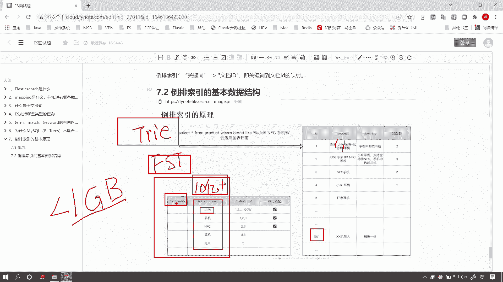
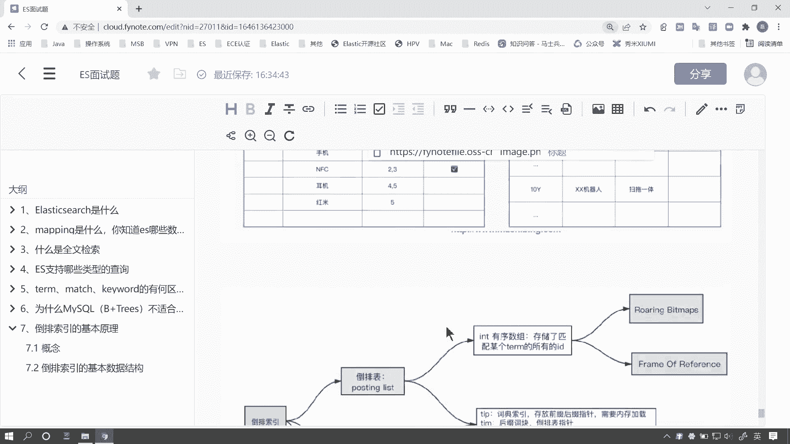
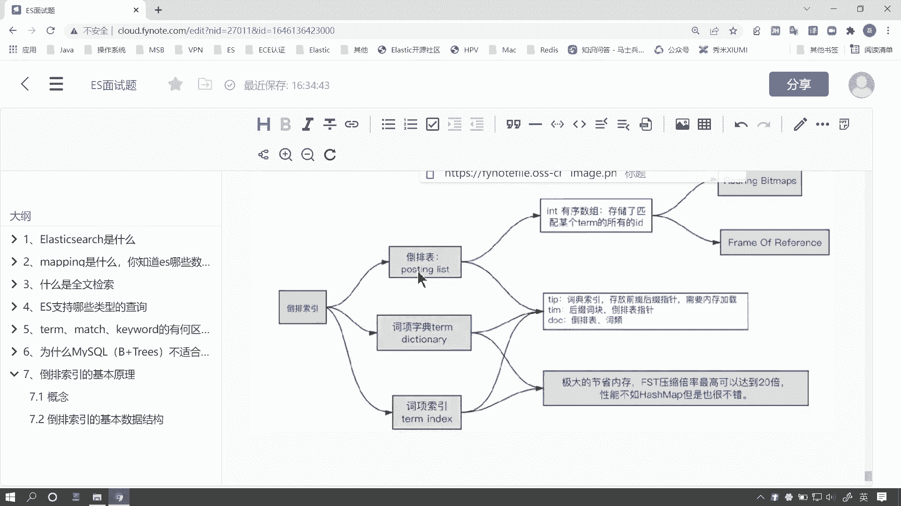
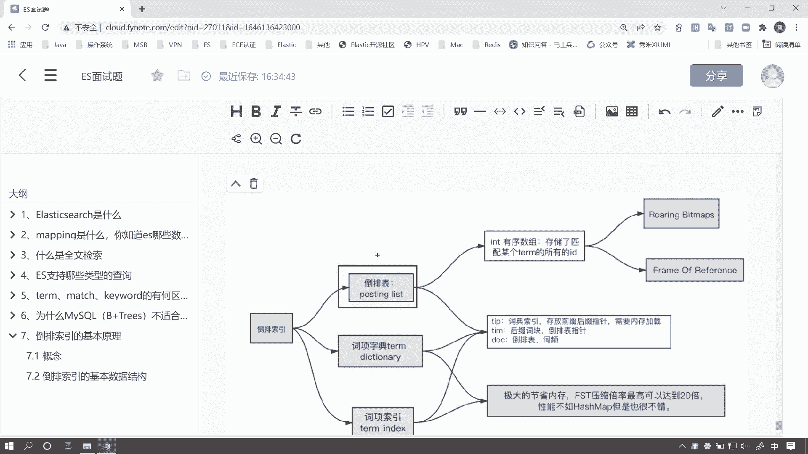
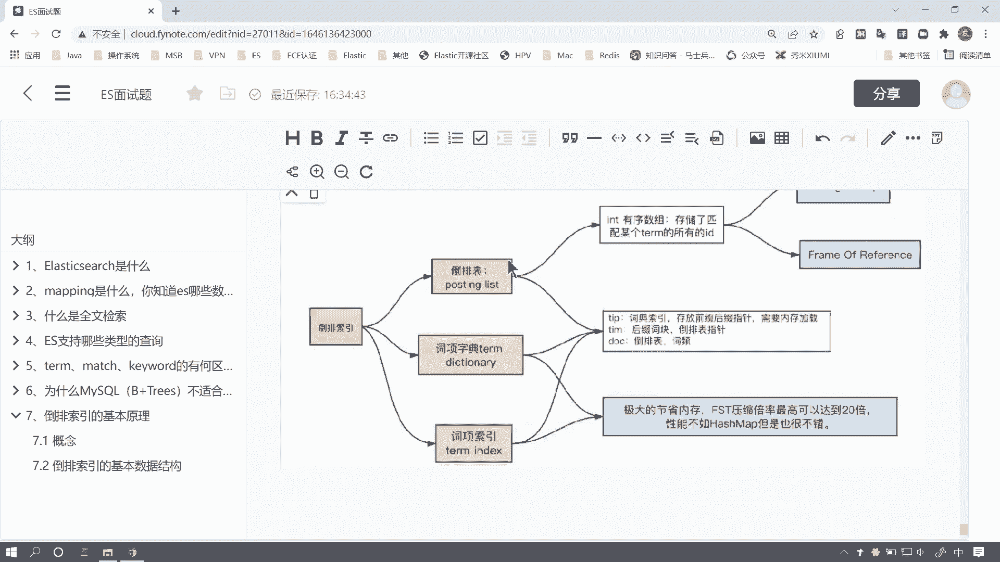
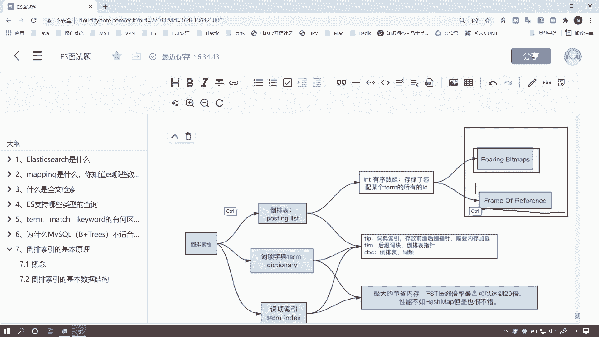
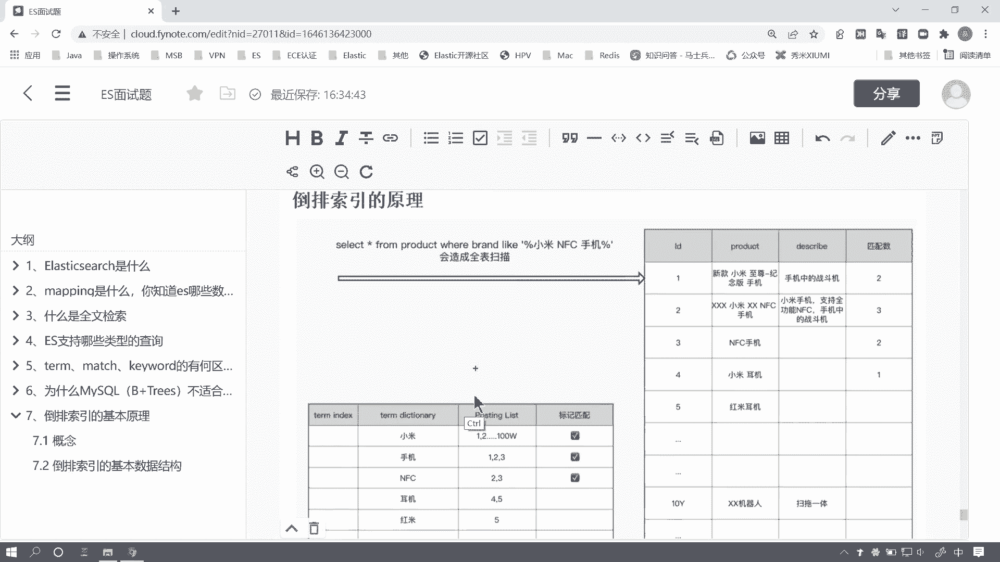
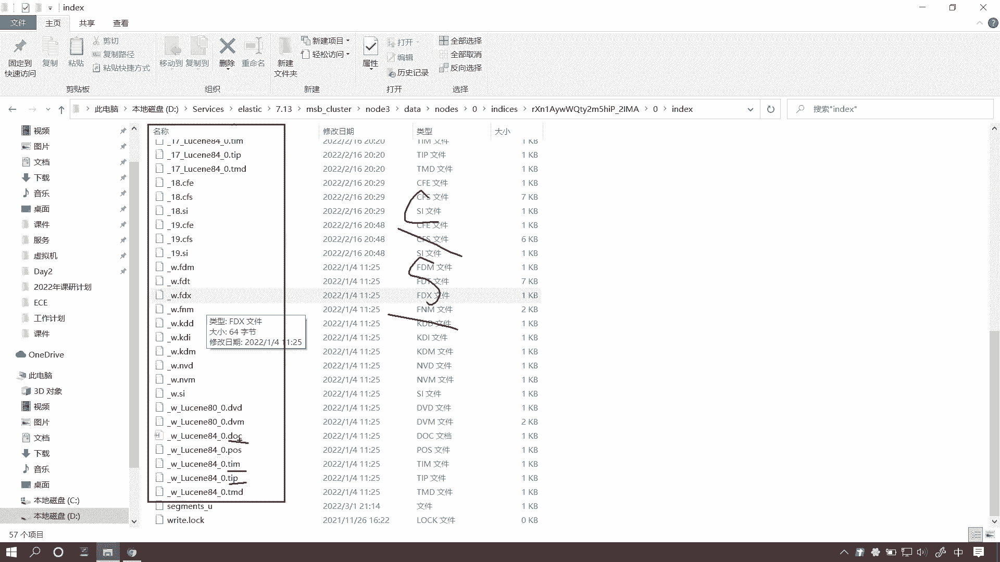
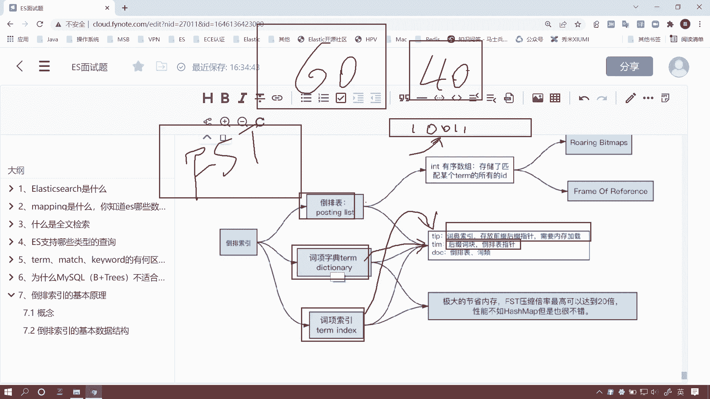

# 系列 6：P153：倒排索引的核心原理 - 马士兵学堂 - BV1RY4y1Q7DL

好，我们继续来看下面这个问题。倒排索引的基本原理是什么啊，这同样是来自百度的一道面试题。那对应的岗位薪资呢在30K左右。倒排索引可以说是ES面试题中的重中之重了啊。那么下面我们来看一下这个问题。

我们如何来回答。好，那么关于道牌索引这个问题啊，在ES的面试题里边呢，几乎是必备问到的一个问题。呃，原因其实也很简单。呃，面试官针对你对倒牌索引所回答的一个程度呢，基本上可以断定你对ES掌握的一个程度。

那，尤其是ES的底层原理的掌握程度。好，那么关于这个问题呢，我也会拆分成多个小问题来由浅入深的逐步讲解。呃，我对大家的建议呢是根据自身的需求和呃你要面试的一个岗位的不同呢。

来呃决策自己需要掌握到一个什么程度。呃，那大家呢在百度上或者在这个搜索引擎里边呢，可能会搜索到盗牌索引这个概念呢，大多数呢其实呃对于盗牌索引的讲解呢可以概括概括成一句话。

就是所谓关键词到文档ID的映射啊这么一个关系。那之前呢其实我在讲全文检索的时候呢，举过这么样一个例子。那假如说右侧呢这个表格呢是我们呃一个原始的数据。

当前呢这个表格里边可能有大量的啊就是有一个非常大的数量级的数据。比如说那么这里边呢就达到了一个10亿级别的一个数量级。

那么我们要在当前这个呃表格里边去文档的这个product就是这种文本字段上去创建索引的。好，由于性能的原因呢，我们通常呢会采取盗牌索引啊，我们抽象了一个呃盗拍索引的一个概念啊呢。

实际上呢盗牌索引底层并不是这样的啊，我们以二维表格的形式来理解盗牌索引呢，也是为了我们方便其。

由浅入深的理解套排索引。你在面试的时候呢问啊，如果面试官要问到你这个问题，你也可以这样去回答。好，我们由浅入深来回答。那么所谓强文检索呢，就是我们针对倒牌索引呢逐个去匹配。那么倒牌索引呢。

实际上我们来看啊，在这个案例里，那么我们当前的这个呃原数据就是原始字段呢，这个product被拆分成一个一个词项呢，就是我们的ction这个字段啊，那么它呢有另外一个字段叫posting list啊。

那这个字段存储的就是包含当前小米这个字段在原始数据中所有ID的一个集合啊，实际上它是一个有序的in类型的数组。那么从词像到这个posting list叫倒牌表，我们有一个术语叫倒排表。

这个映射关系呢就是所谓的刀排缩引。当然了，这个招排表，还有词祥字典，它的一个底层的存储逻辑呢并非这么简单啊啊，包括你看po list呢，除了这个文档ID呢，它还有一些其他的，比如说次频啊这些数据。呃。

我们后面会讲，那么咱们目前呢只需要知道有这么一个映射关系就可以了。它就是刀排索引。OK那么针对于招牌索引呢，其实呢它有这三个呃非常基础的我者大家都要知道啊，就是面试中我们一定要能答上来的三个数据结构。

首先呢我们的词项很好理解，它有一个专业的术语叫Tm dictionary，就是词项字典啊，叫词项是项目的项，项羽的项字典。啊，顾名思义，它既然是个字典呢。

它就是一个它实际上它是一个字典去存储的一个不重复的一个字段。那么posting list呢叫倒排表。啊，倒排表里边存储的是包含当前词项的所有的文档ID的有序数组，并且是int类型的啊。

int类型的最大的这个数据量是多少呢？是2的32次方，对吧？所以我们int类型啊，其实我们倒排表为什么单个的这个分片里边，它会有容量的上限呢啊，也其实就是这个原因啊，好，那么了解了这两个数据结构之后呢。

其实还有一个呃比较特殊的，叫T index，这个是什么呢？其实呢呃倒排索引，咱们如果把问题回答到这儿呢，面试官呢其实可以在这个基础上衍伸出一系列的问题。比如说哎比如说面试官会提这样的问题。

那么我们当前呢这个原原数据呢，有一个是一个10亿级别的数量级。那么我们把把这个字段，你要创建倒排索引的字段呢拆分成一个一个的词项，那么它是有可能假如说我们这个词项呢是一个高级的啊。

就是高基数的一个呃这么一个数据。就是他重复的数据非常少。那么我们有可能这个t dictionary就是词祥字典呢，它也是一个非常高的数量级。因为这里边没有重复的嘛。啊，当然这是一个比较极端的情况啊。

那么当然这种情况是有可能发生的。比如说它是1个10亿级别的数据是有可能的吧。因为我一个字段就拆分成了好几个词项嘛。好，那么甚至有可能它是一个更高的数量级，这都是有可能的。那么我们在电力倒牌索引的时候呢。

虽然说啊我们知道了一个词项啊就是说1亿个数据啊，我们通过一条索引呢就可以知道这11条数据包含了哪些索引啊包含了这个词项，但是我们这个词项字典的检索，它又是一个问题。因为什么呢？

因为我们这个词项字典又是一个很大的数量级。那么在这儿呢，其实就衍生了一个底层的数据结构叫FST。那么FST呢，实际上是一个呃。TRIE就是前缀数的一个变阻。啊，或者叫字典数。

这个我们后边就会讲这个这些东西呢，其实都是可以跟面试官来提的。那么FST呢就把这些呢把这些数据呢。把这些数据呢做了一个高效的压缩，甚至我们可以把它压缩到1个GB。

就是说我们10亿甚至更多的这这种更高的数量级，我们能压缩到这个把它的总体级压缩到1个GB啊以下就小于GB。那么当然了这个后后期我们再来讲解FST那这个呢是其实是倒拍索引最底层啊，最核心的一个数据结构啊。

它也比较复杂。那么词项字典呢，我们可以把它理呃词项索引啊，就是 index呢，我们可以把它理解为这个图可能有点小，我把它放大一些啊。

🤧嗯。🤧嗯，叫tm index啊，可能有有同学可能看不清，我再写一遍啊，叫term。

领带。好，我们来看这个从字面翻译上来来说呢，它叫词像索引是吧？其实索引是什么意思呢？索引本来就是帮助我们去检索数据的。那么我们从这儿呢其实就可以判断出呢。

它的作用就是为了方便我们去检索term dictionary。我们看到下面我这儿有一张图啊。那这张图里边呢，其实呃用一张图呢就概述了我们当前倒牌索引呢，它的一些基础的数据结构，包括每一种数据结构。

它的作用啊，你像倒牌表就是存储了我们当前。

这个图。那么招牌表呢，这里边呢其实就是存储了我们当前呃词项字典，词项字典的所有数据，就是它也就是这些ID的数据啊，包括此频的一些数据啊，当然了，它是一个有序类型的数据，这些都要回答回答出来啊。好。

它其实在这个招牌表上呢又可以衍生一些问题。好，比如说我们来看上面这个图啊。

比如说呢我们11个数量级是吧？11个数量级这些数据呢包含当前小米这个词项。假如说我们当前呢这个商品表里边有大量，因为是小米商城，小米商城可能有大量重复的这种词项的数据。比如说小米这个词项呢。

它出现了100万次。那么这100万字呢，就代表当前这个posting list的。我当前这个词词条里边呢存储的这个招牌表里边有100万个ID每1个ID呢它又是一个int类型是吧？

那么int类型呢占4个字节。那么四个字节，100万条数据呢，相当于占400万个多少啊字节。它其实就约等于4个兆B吧啊，这个数量级就是4个兆B啊，其实准确一点是3。8。那么没有关系啊。

这就这个数量级咱们知道就可以了。那么4。8这个兆B呢，它的这个空间占用的大不大呢？啊，实际上咱们在单独来看这一条数据可能觉得不大，对吧？那么如果说你的数量级是10个亿呢。好。

那么第一个面临的问题呢就是存储压力。第二个面临的问题呢就是好当我的数量级特别大的时候，我的减索性能会特别下降。因为要设计之前咱们讲过一个问题叫什么叫磁盘IO好，我的IO上去之后呢，我的性能必然下降。

所以我们通常呃在这种ES在这个底层呢是做了一系列的这种优化的，其中呢有一个就是啊我们的数据压缩里边涉及到两种算法叫一个叫呢FOR就是roll那个frameme of reference这种压缩算法。

第二个呢叫呃rolling map这两种压缩算法呢都是呃一些比较底层的东西啊。当然这些可能是呃关于盗盘索引。

面试官可能会衍生出来或者或者说延伸的一些问题啊，比如说面试官会怎么问呢？好了，你讲解了倒牌所有的数据结构之后呢，面试官会问你哈，那么面试官呃这个倒牌表里边有这么那个多的这个数据。

他是怎么样去优化它的性能的？

或者说好我的数量级磁项字典这么大，我是怎么样去保证它的检索性能的？好，等等等等。当你了解了这些数据结构底层的这种存储方式之后呢，这些问题就迎刃而解了啊，所以到这为止啊。

到目前就是说本就是当前这个视频为止啊，咱们需要了解到哪哪个地步呢。首先是倒派索引它的这些基本的数据结构，你要知道每一个数据结构，它存储的是什么东西啊。

你要知道词项字典存储的就是一个呃非呃非重复的一个词项数据叫叫词项字典啊，这个名字你要知道还有这个词项索引它的作用啊，你要知道它是为了辅助我们去理解而抽象画出的一个数据结构。好，那道派表咱们已经说过了。

那么包括这三种数据结构，它其实在此盘中都有对应的这种文件来存储的。比如说我们打开当前的一个文件夹，我这已经提前打开了。那么看到当前呢是一个ES集群中的一个节点啊。

这里边我们打开了一个节点其中的一个索引数据。好，我们看到这里边呢有很多很多后缀名不同的数据。其实它和my circlel一样的，我们的数据。

其实无非就是什么呢？啊，一个客户端是吧？啊，客户端clet，还有一个什么，还有一个服务端server是吧？CS架构，那么底层还有什么叫存储引擎。我们ES中呢这些数据文件和my是一样的。

里边也是一些文件来存储的。这就是基于磁盘的数据库和基于内存的数据库的区别啊。我们这些文件啊持久化到磁盘里边呢，有不同的后缀名。好，我们这儿呢需要关心的前三个就是我们第一个呢叫TIM。你。

第一个呢叫TIM，第二个叫TIP还有一个呢叫DUC好，我们这个视频啊，我们需要了解的这三个文件呢叫啊就是这以上三个文件。好，这三个文件分别是存储的什么内容呢？首先呢。

posting list的倒排表啊，就是里边存储的是此项的这个倒排表的这些ID数据嘛？ID啊这些ID是存储在一个叫TI叫DOC的这个文件里。就是DOC存储的是高拍表，还有磁频反磁频等等这些数据。

那么此项字典啊，这个是存储在一个叫TIM的这个文件里，它存储的是FST的公共前缀和公共后缀。好，那么此项索引呢，它存储在一个叫TIP的文件里。啊，TIP文件里边它存储的是啊这个啊不对，刚才我说错了啊。

这个呃这个是什么呢？呃，词项字典啊，它存储在TM文件里边，它存储的是呃。这个倒牌表的指针什么意思呢？就是我们倒排表这个ID的数据呢，实际上是一个二进制的字节数组。而我们词项字典。

它里边存储的是呃我们这个二进制数组里边的这个下标啊，比如说01010101啊，存储的其中的一个这个数组的下标啊，这个是词项字典而倒排表它是叫而这个词项字典这个字项索引，它存储在这个TIP文件里边。

它存储的是FST的公共前缀和公共后缀的指针啊，这个FST公共前缀和公共后缀的指针啊，不理解没有关系啊，我们后边还会详细的来讲好，那么到此为止呢，咱们其实就已经把倒排索引的一个基本数据结构讲完了。

那么一般来说呢你能回答到这儿呢，其实面试的时候呢，这个倒排索引你能拿60分就已经可以了。但是呢你别看你拿到60分，其实剩下的40分呢，你要花更多的时间来理解，就像一个长跑30千米呢最后200米是最难的。

你往往要花出更多的时间呢才能进步一点点。

ok。