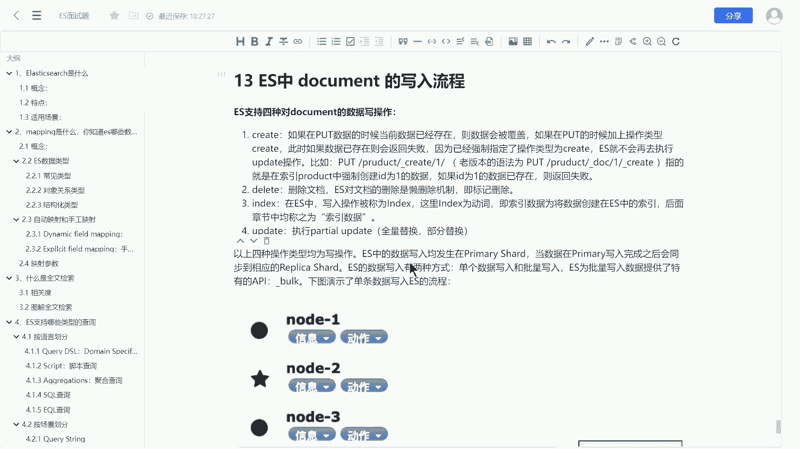
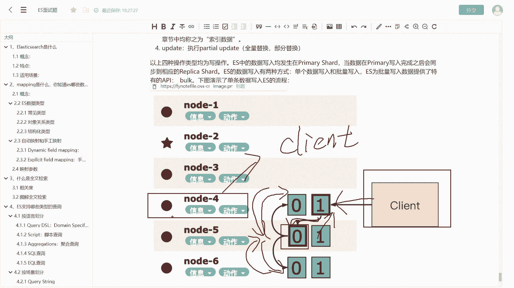

# 系列 6：P160：文档的写入过程 - 马士兵学堂 - BV1RY4y1Q7DL

OK我们继续来看下面一个问题，document的写入过程啊，区别于写入原理。那么写入过程呢是一个宏观的过程。那么这是一道来自阿里的面试题，对应的岗位薪资呢在30K左右。好，那么下面我们来看一看这个问题。

我们如何来回答。关于这个问题呢，其实网上有很多不同的问法。比如说你对ES中数据删除。或者数据的修改，它的执行流程是什么样的那。关于此类的问题呢，其实都是同一个问题。因为ES中对数据的写入操作呢。

其实包含了以下4种。首先第一种呢叫create。嗯，cre呢其实咱们可能用的不太多。平常咱们在使用put写入数据的时候呢。啊，如果说你使用create APII来执行。

那么当前你要创建的数据如果已经存在了，那么ES呢会给你抛一个异常，告诉你数据已经存在了。如果数据不存在，则会执行成功。那么第二种叫dele。delete呢就很好理解。

删除文档ES不管是删除文档还是修改文档，实际上都是一个懒删除的这么一个机制。呃，换句话说呢叫标记删除。比如说我们原始版本呃，原始的数据在刚创建的时候呢，是1个1。0的版本。好，不管我对其删除也好。

或者说我对这个数据进行任何的修改也好。首先呢我会把这个数据1。0的版本标记为一字dele。好，其次我会比如说我如果执行的是修改操作呢，我会创建一个新的数据。比如说。呃。

比如说原原先的这个性别由男改成了女，那么男就会标记为is delete，然后创建一个女，然后给他个版本号2。0。啊，这是ES里边一个懒删除机制啊。那第三种呢叫index，那这个是最容易出错的问题。

因为ES中很多术语呢它都是重名的那这里边这个index和我们的这个索引文件啊是不太一样的啊，和我们的索引那个概念是不太一样的。这里边的索引，它其实是个动词啊，索引数据指的是像ES的索引中写入文档数据。

啊，所以这里边指的是写入文档。好，那么也就是说它是一个动词啊，呃，在ES中，如果我们执行的是index呃呃，就是你要称之为index一条数据呢，你就把它理解成写入一条数据就可以了。好，那这是他的第三种。

操作啊写入操作。那么这个可能不太好理解啊，你要反复的去呃琢磨一下啊。那么第四种呢就是update啊，这里边指的是partial update，就使用使用posts去更新数据啊。好。

这四种操作呢都指的是它的写流程啊。好，那么针对这四种操作呢，呃其实我们涉及到这个写入问题呢，就要考虑到一个它的一个写入一致性问题了啊。我们以下面这张图为例。那在这张图里边我们演示一下。

当我们客户端发起请求的时候啊哎。

好，我们来演示一下啊。这是我们的客户端。当我们要向这个集群中写一条数据的时候，首先呢客户端的请求打到了这个note4上面。note4呢此时作为一个客户端节点。啊，首先它是作为一个客户端节点。那么其次呢。

它还是一个考D内的节点，就是负载均衡节点。那么当写入到，比如说我们要修改note4中的一条数据。那么首先note4呢通过在路由表中的映射信息呢，确定当前你要修改这条数据或者删除这条数据。

它不在note4这个数据分片里。因为首先你是写操作。那么写操作呢只能在主分片上来完成。那么note4呢又判断你这条数据它不在note4上面，而在note5上面。

那么它就会对你当前这条请求转发至note5上面。好，那么下面一步呢，数据在note5中好执行删除或者修改。成功之后呢，会把数据同步分发至它所在分片的两个节点，也就是note4和note6。好。

等待note4和note6这两个副本数据都写入成功之后，那么note4和note6会把这两个数据的同步结果啊告诉note5。然后由note5最后转发给这个note4，就是把结果报告给note4。

那么此时呃note4数据写入成功。那么在整个过程中呢，note4充当了两个角色。第一个角色呢叫客户端节点。第二个角色呢叫c，就是负载均衡节点啊，这个词我忘了怎么拼了。好，呃。

这个呢就是一个ES的数据的写入的一个完整的流程。

