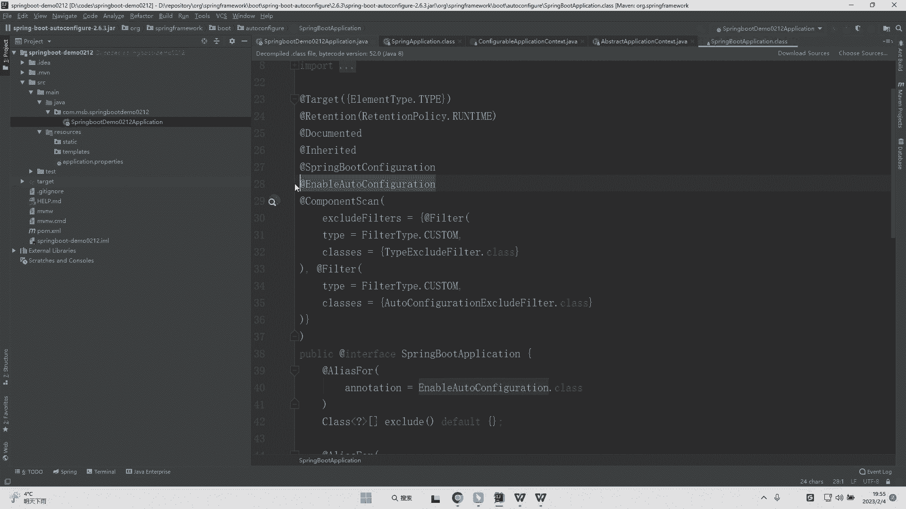
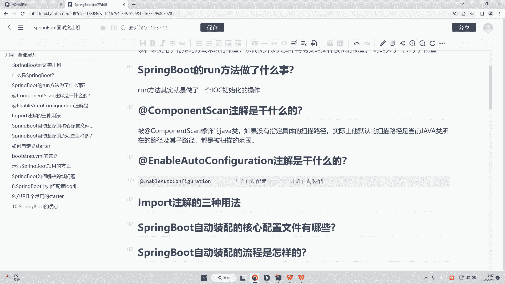
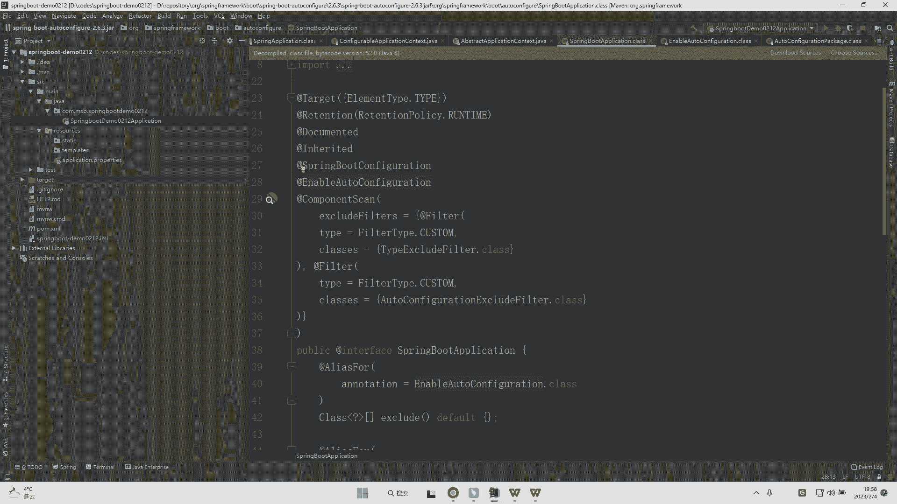
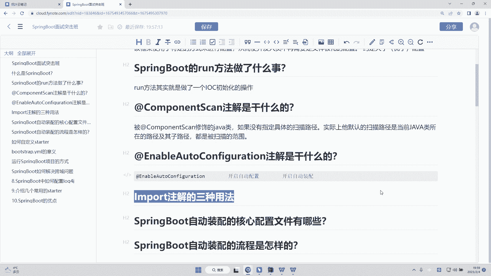

# 系列 6：P168：@EnableAutoConfiguration注解是干什么的？ - 马士兵学堂 - BV1RY4y1Q7DL

题呢是来自于美团的一道就是春招的题目啊，说是 to configuration解是干什么的。呃这道题目主要考察的是你对于 boot源码的一个理解啊。那么这道题呢会在面试终级开发工程师的时候会面到。

对应的薪资呢是15到20K。那么我们可以直接来看一下咱们的一个源码。而源码当中，其实我们会看到这样的一个spring boot application这样的一个注解。

它存在于spring boot项目的启动器当中。而此时我们可以直接点进去点进去了之后，我就发现了n able audio configuration这样的一个注解啊，而这个注解是干什么用的呢？

其实很多同学他会有疑问啊。他说老师这个注解我没见过，它是干嘛的。

实际上我们其实可以在非常多的这样子的一个spring的使用当中，我们可以看到enable开开头的这样的一个注解。什么注解呢？比如说大家经常看到的叫做enable catch。或者说还有一个注解啊。

我相信大家应该是不陌生的，叫做NAableNA。嗯 able schedule。C6的是SCHEDULED。🤧OK那么这两个注解呢其实也是以N开头的对吧？那么这两个注解什么意思呢？一个是开启缓存。

一个是开启定时任务，对吧？那么我们很显然就能够去得知啊，我们的N是干嘛的呢？它是开启某种功能的，开启什么功能呢？它是用来开启咱们的一个什么au to自动的意思。自动的一些配置。

实际上呢它就是开启自动装配的这样的一个核心注解啊，那么开启自动装配，其实它是非常重要的面试点之一啊，我们可以去看一下这个注解。N configuration点进去。

点进去之后呢，最上面的四个注解其实大家都知道啊，这四个注解是什么注解呢？这四个解注解其实是我们的一个原注解啊。

首先第一个注解它代表的是当前的我们的这样的一个注解用在什么地方然后呢可能的值在这样的一个枚举值pa直接O比如说我们的方法级别字段级别，包括我们的上下文级别loc本地参数级别等等啊，O其次呢。

第二个注解是用来干嘛的呢？第二个注解是在什么级别表保存该注解的信息，这个可选的值呢是在这个枚举当中，比如说我运行时保存对吧？在类编译时保存或者在源码编译时保存啊，O三个级别。

而再往下呢doment它是可以去干嘛呢？将其抽取成文档。而第四个注解呢是表示了这个注解允许子类继成副类中的注解，表示可传递性以及可继承性。

再往下就会有两个au to configuration package这样的一个注解，以及import这样的一个注解。很明显，import注解它是用来导入某一类东西的。

包括我们的out configuration package，它是用来干嘛的，听名字都知道自动的配置装配我们的包，对吧？那么点进去之后呢，我发现上面四个原注解，对吧？

其实它也是用来导入某一些类的这样的一个注解啊，说白了，其实我们的自动装配，就是为了导入某一些类，而这个import注解，其实呢又什么就衍生到了我们下一道的面试题啊，就是import到底有哪几种用法呢？

我们接下来看下一道面试题。

