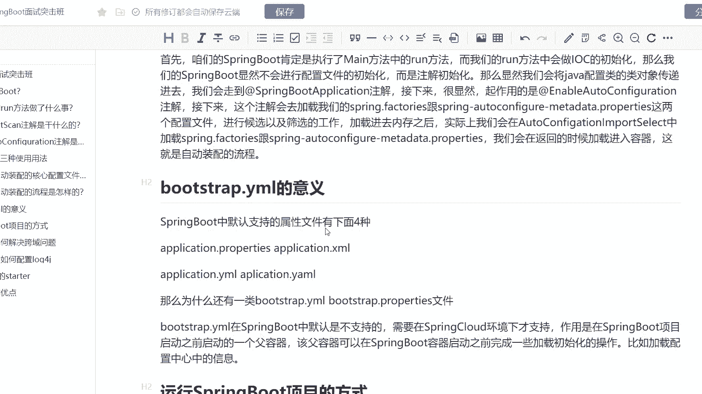
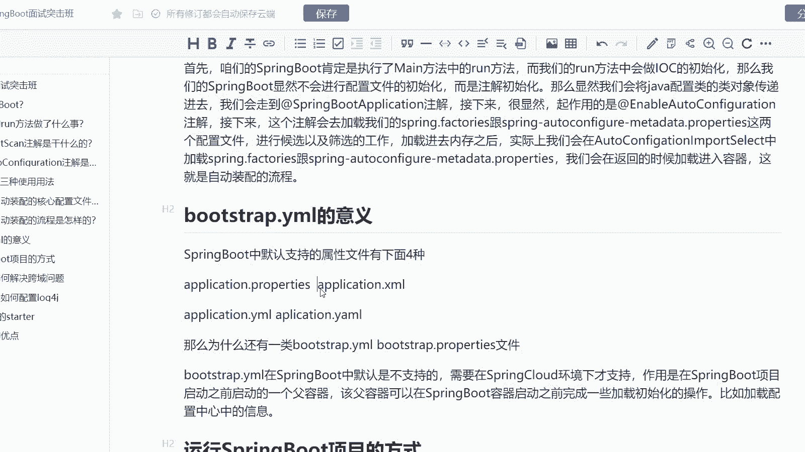
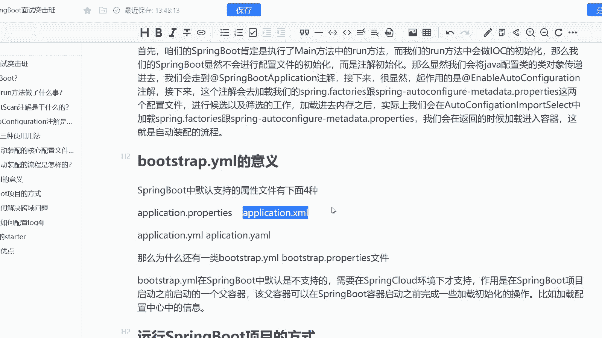
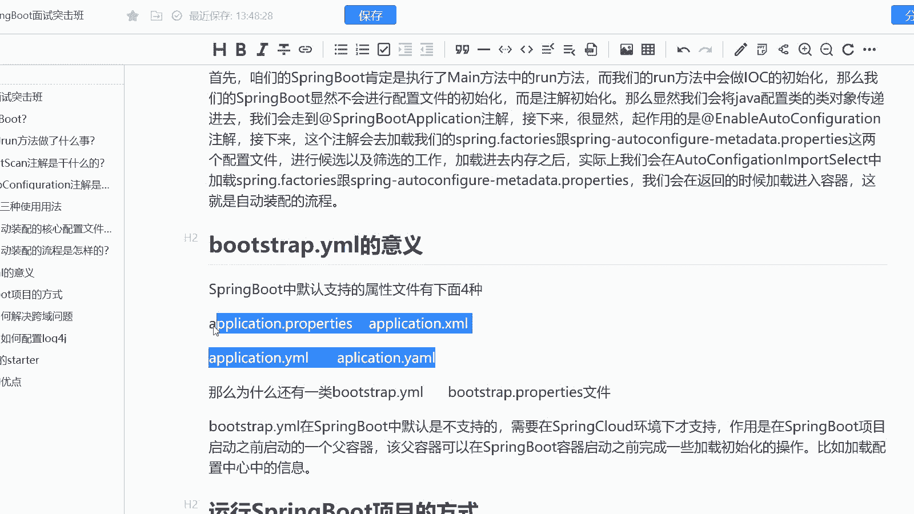
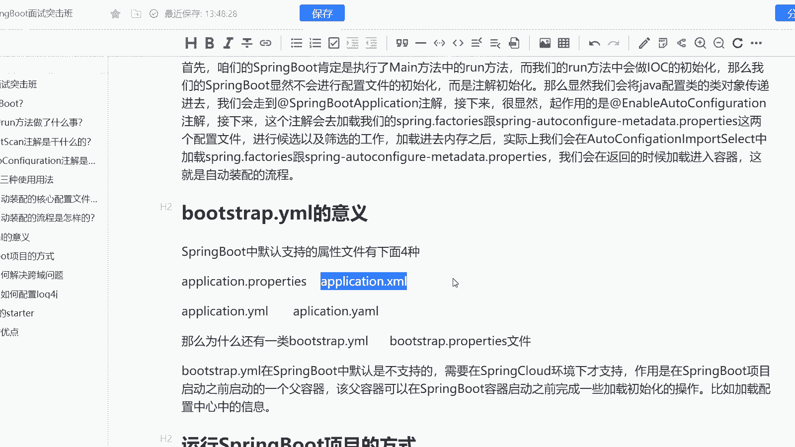
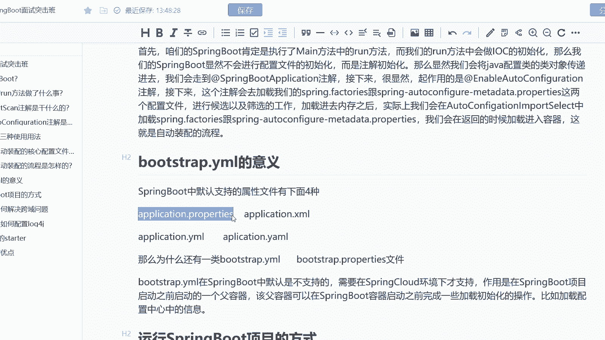
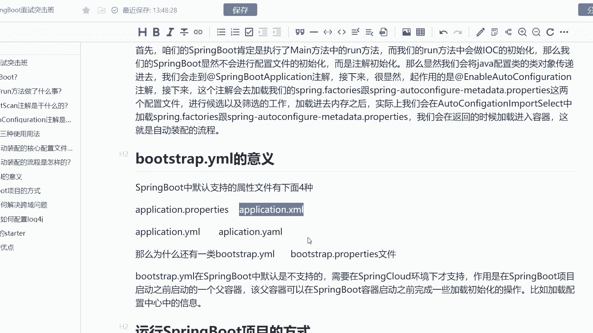

# 系列 6：P169：bootstrap.yml的意义 - 马士兵学堂 - BV1RY4y1Q7DL

是来自于阿里巴巴的一道7月份面试题啊，说是点mail它的意义是什么？因为我们都知道啊，在咱们的ring boot当中其实是有默认的配置文件的。

而默认配置文件是plication点或者点那么这道题主要考的是们配置文件的一个理解。而这道题呢在面试中高级 java开发工程的一个岗位当中会遇到然后呢对应的新资是15到25。

实际上呢给大家去一这个话题我们ring当中他默认支持的这样的一个属性文件其实有4种种呢点点叉其实我们ring当中可能有些同学用的比较少，但他确实是支持的包括我们的两种文件。

这个才是我们ring中默认支持的一个属性文件。而我们为什么还会有。

but strap点压mail或者but strap点pro文件呢，这是因为啊在我们的spring cloud的一个环境当中，其实呢它是作为spring boot启动之前的一个副文件。

所以这是我们的一个副容器副文件，它会优先启动先与我们的一个obplication点叉mail或者obplication点pros去进行启动。

而这个容器它可以在spring boot启动容器之前完成一些加载初始化的操作。比如说我要加载配置中心当中的信息。紧接着我再把配置中心的信息给加载进来啊，这是我们 drop点mail的含义，对吧？

它可以优先去进行这样的一个加载啊。OK这是我们这道题。

