# 系列 6：P170：Import注解的三种用法 - 马士兵学堂 - BV1RY4y1Q7DL

下来呢给大家讲解一下来自于腾讯的一道面试题啊，说是呃咱们inport注解的一个三种用法，可以给我简单聊一聊吗？呃，这道题其实考察的是你对于spring boot的一个源码的理解。

因为如果你对于spring boot有一定的了解，你就会发现在spring boot的原码当中，其实也有用到inport注解的两种方式。

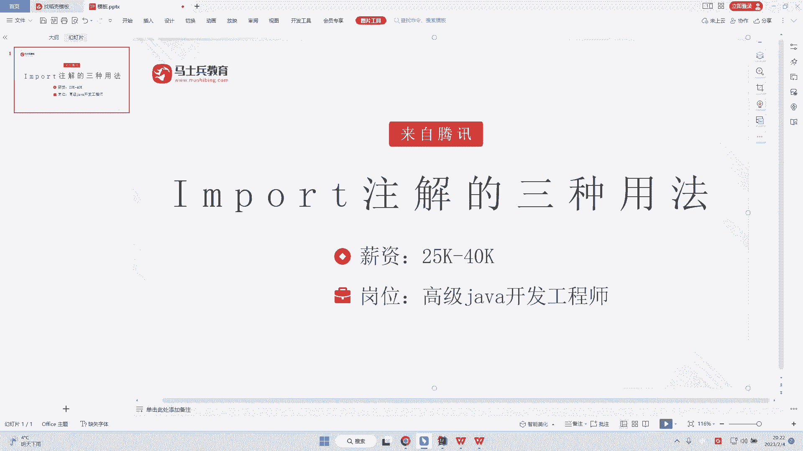

那么这个时候呢，我们就开始正式来进行一个学习。首先咱们的一个inport的注解呢。它在哪里出现的呢？给大家看一下啊，它是在咱们的ableau configuration注解。

也就是说我从这个什么我从这个启动器对吧？走进来之后我就会发现nable configuration注解，再点进去就会有这样的一个import注解啊，而这个import注解。

大家可以看到里面是一个au configuration input select，这样的一个类，那么很很明显就是我的一个import注解，它去就是说导入不同的类是会有不同的一个区分的。

首先最简单的方式是什么呢？最简单的方式就是相当于比如说我想要去注入某一个类啊，那么这个时候我直接就import注解。然后比如说这是我们的一个java并，我直接想注入catch，对吧？

那么catch点class，或者说我想注入person person点 class。OK或者说咱们还需要去注入多个personus，好吧。电脑大小写没开吗？Useer。OK user点class。

那么通过这样的方式了之后呢，我就不需要再用病注解去进行一个注入。那么这个时候我可以把这个病注解给稍微的注掉啊，我可以把它给注掉。那么这个时候我们直接去运行。很明显大家看到的结果对不对？

这是我们去使用inport注解的第一种方式啊，这种方式叫做静态注入。

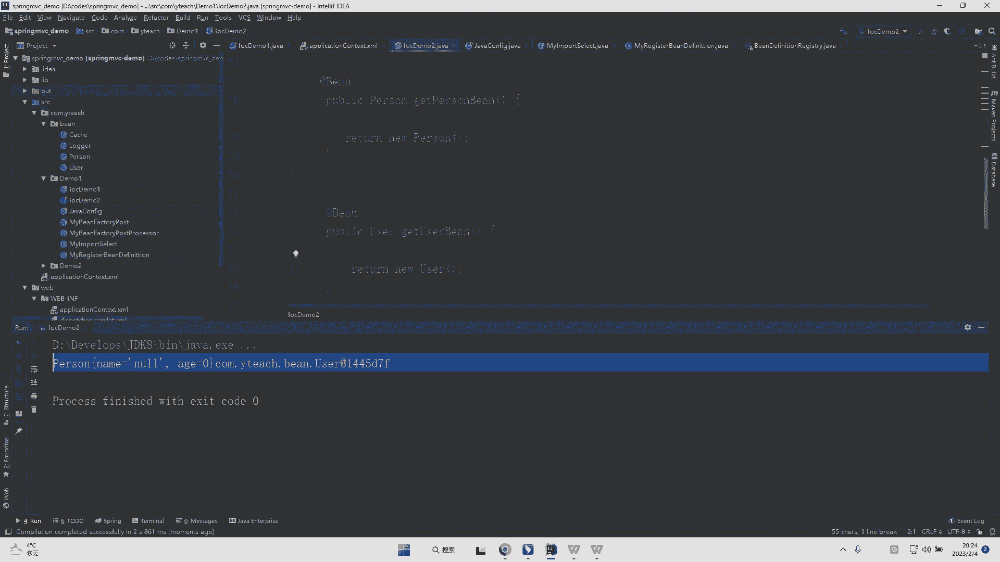

这种方式呢相对来说灵活性会比较差一些。所以呢一般来说是不会推荐这样的一个方式的。包括如果我们要注入的对象很多，比如说我要注入十几个这样的对象，那么这个时候我是不是后面会给你很长的一挂。

所以这样会有局限性，所以我们的inport注解，还有第二种使用方式。第二种使用方式是怎么样子呢？第二种使用方式，首先我们要去创建这样的一个java配置类啊，而创建了java配置类之后呢。

我们需要去创建一个自己写的类，而我们在自己写的类当中会去实现inport select这样的一个接口。此时它会让我们去实现一个select import的一个方法。而在这个方法当中，我们需要去干嘛呢？

去将自己的一个需要加载类的名字给返回。其实此时我们在jafi当中去导入当前我自己去写的这样的一个类，比如说my import select，此时我们就会去发现一件事情啊。

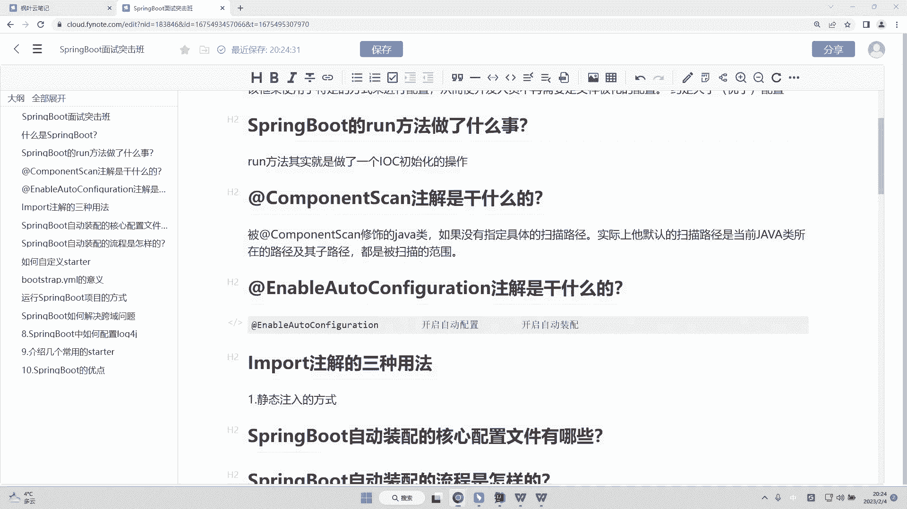

事情呢就是我们此时其实会干嘛呢？会注入的是当前这个类的它的一个类型的返回值啊。OK而我当前返回的是我们的名字的权限定名，对吧？所以它在这里就显示了我们的权限定名啊。而通过这样的方式。

我们可以很简单的在我们的select的 input当中去添加进入一些，比如说我们自定义的一些方法，对吧？比如说添加一个判断逻辑ifOK那么除此之外呢，这是我们的第二种方式啊，第二种方式。

那么我们写一下啊。

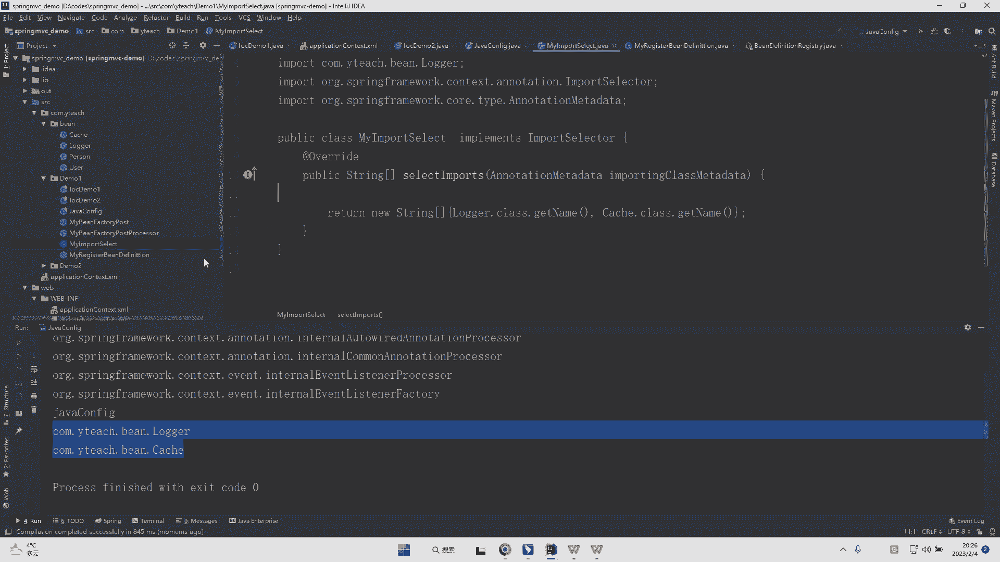

第二种方式是添加了呃呃实现了我们的。

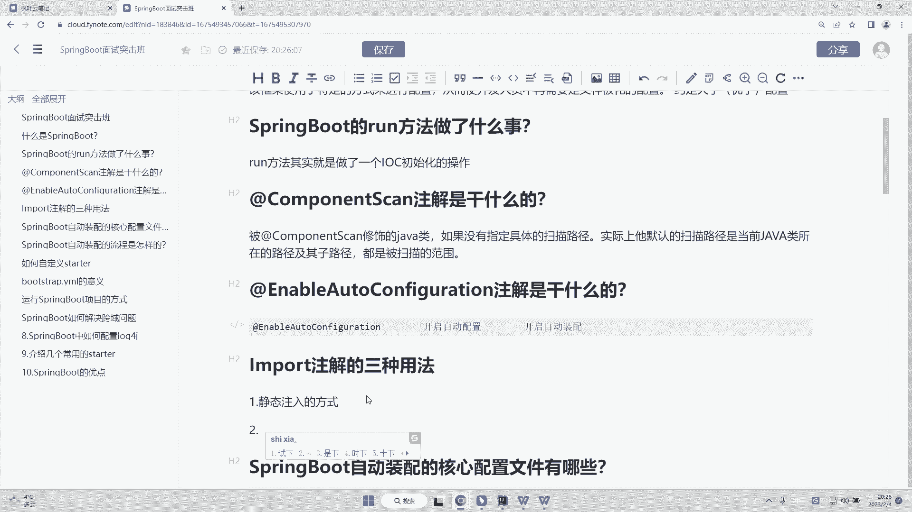

什么嗯，看一下import select接口。

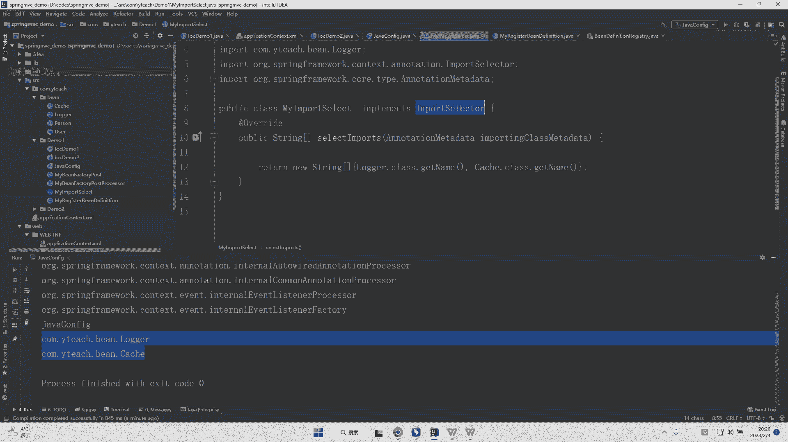

并且呃实现了。Select import方法。ok。那么我们的返回值。

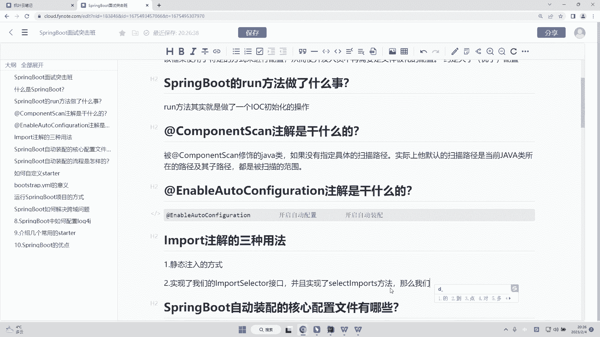

就是。

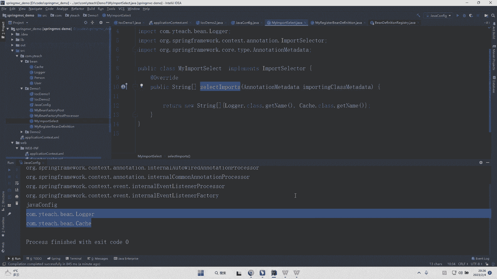

select import的方法的返回类型。OK这第二种方式啊。那么第三种方式呢，实际上是我们需要去干嘛呢？我们需要去实现import definition啊，这样的一个就是说接口。

那么这个import definition啊，它很明显是一个注册器，对吧？所以说我们需要去实现的方法是re definition，它会有一个注册器的存在，而这个注册器是用来干什么呢？注册器。

我可以在里面去做任何的一些操作，就相当于它跟第二种方法的区别是什么？它跟第二种方法的区别，就是当我如果去实现的方法，它可以去实现这样的一个注册器的话，那么我可以手动的去干嘛手动的去进行一个注册操作。

所以它就相当于你去银行取钱，这个是自动取款机，而这个呢是手动的方式啊，手动的方。

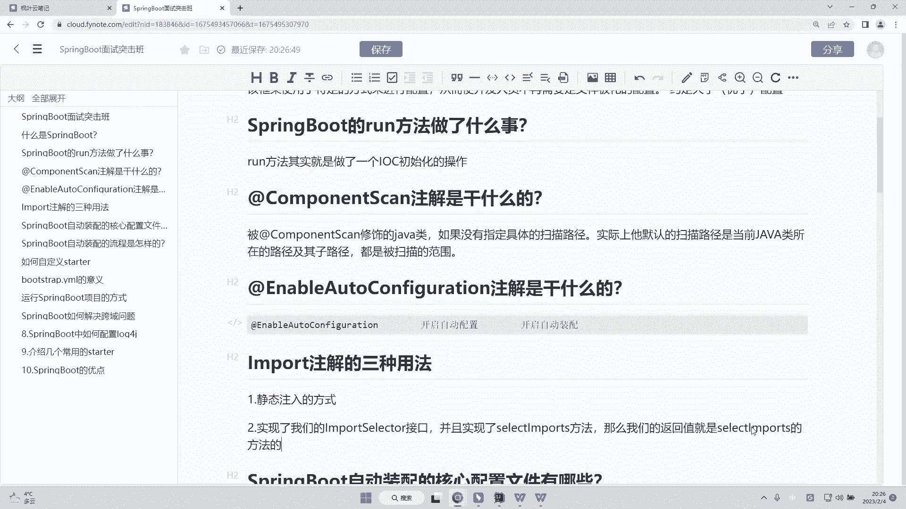

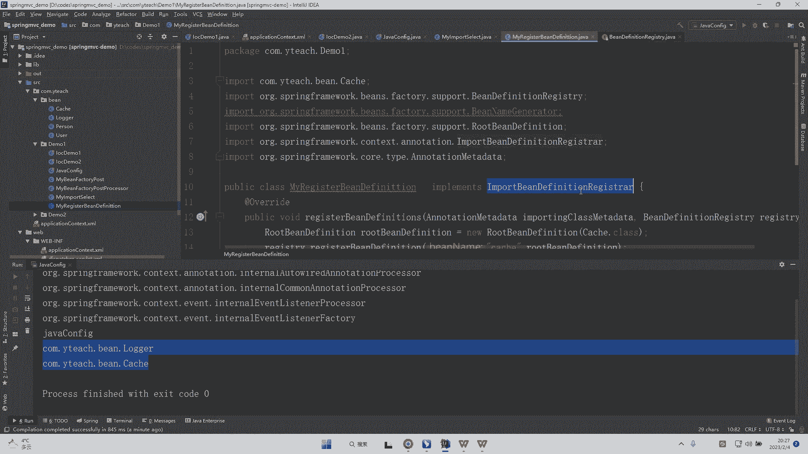

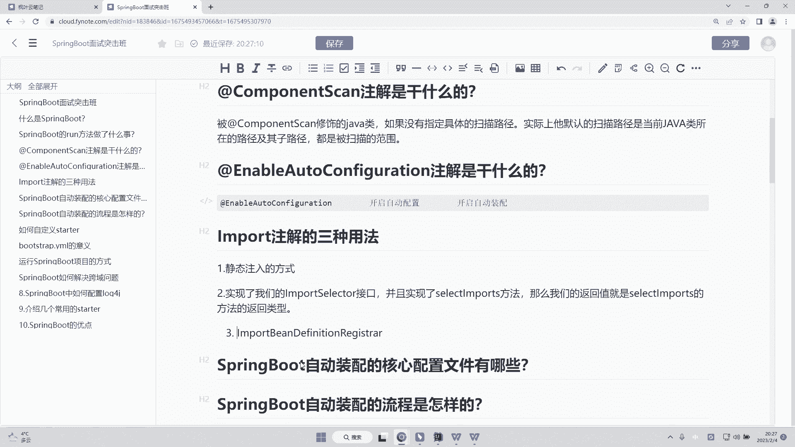

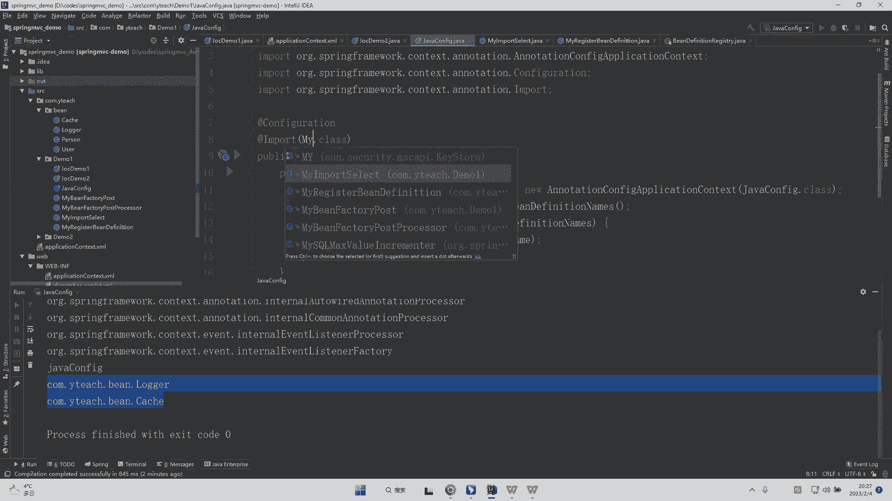

所以这就是他们两个之间的一个区别。所以这里是实现了。Iport bin definition re接口。

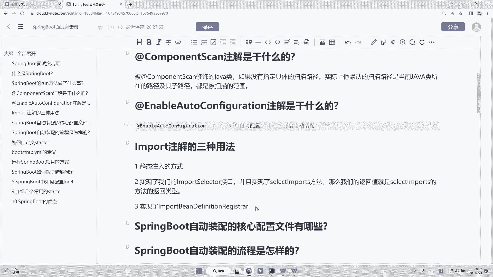

并且实现了什么方法呢？实现了咱们的一个region定 definitionfin方法。

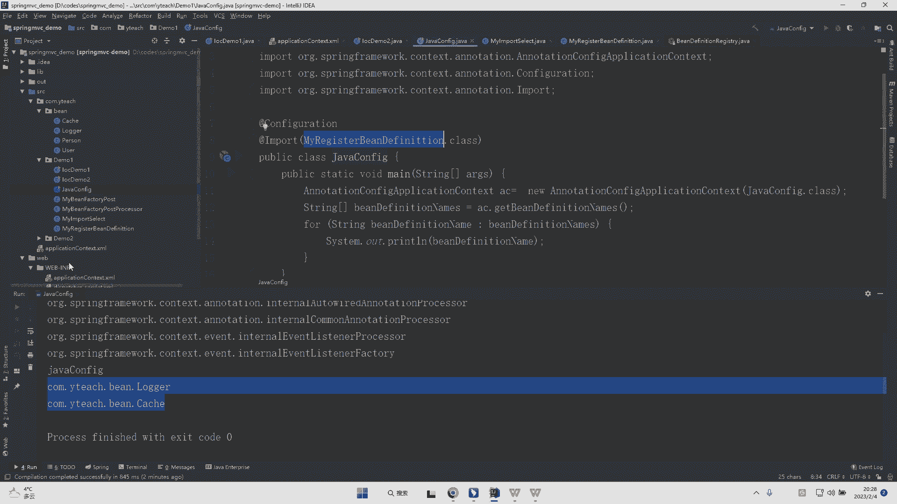

O。那么这个时候我们可以。自行封装并 definitionfin。同样也可以达到我们的一个效果啊，这是我们的一个inport注解的一个三种方法啊，三种使用方法。O写的完全一点，三种使用方法。

那么在这三种使用方法的情况下面，很明显咱们的源码当中会使用到这三种方法，对吧？那么这个时候通过它不同的一个体现，我可以把灵活度去进行灵活的一个调整，包括我们的一个使用权限，有注册器的跟没注册器的。

我都能够去进行一个实现，对吧？所以它相对来说会比较灵灵活一些啊，OK而它呢inport注解，它实际不是业务开发所需要使用到的一个注解。而是你在写组件或者选源码当中，你会去使用到了这样的一个注解啊OK。

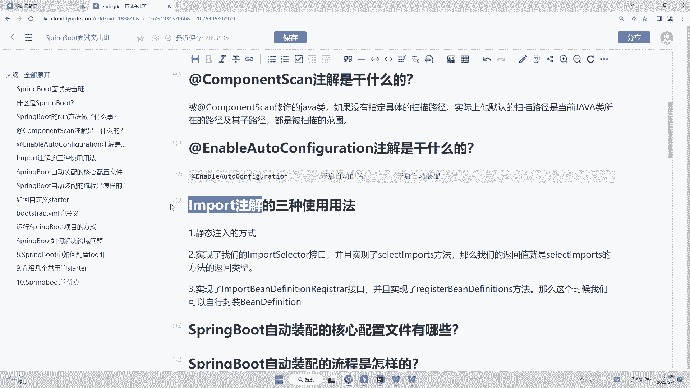