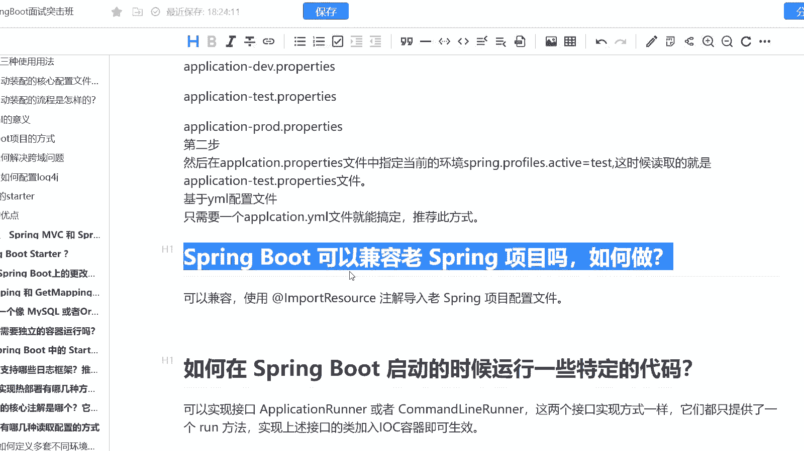
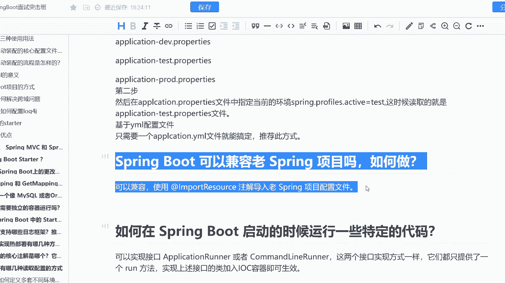

# 系列 6：P173：Spring Boot 可以兼容老 Spring 项目吗，如何做？ - 马士兵学堂 - BV1RY4y1Q7DL

听呢是来自于阿里巴巴的一套面试题啊。而这个面试题呢，它说的是spring boot，可以兼容老的spring项目吗？其实这个题是考察你什么点呢？它是考察你有没有做过一个新老项目的一个切换。

或者说有没有去做过一个新老项目去兼容我们新技术的这样的一个事情啊，那么。这道题呢对应的是中级 ja开发工程师。也就是说其实它是在业务层面的。而这道题呢对应的薪资是15到20K。也就是说其实你到这个薪资。

你就应该会做这样的一件事情了啊。那么呃在这里啊其实这道题它是很简单，你只要把它的关键核心点说出来就可以了。首先第一个spring boot可以兼容老的spring mVC或者spring的项目吗？

是可以的，对吧？你要回答可以，那么需要怎么样呢？你可以用import resource注解来导入老的一个spring的一个项目的配置文件。这样的话我们就可以新老项目兼容，并且呢你也可以1。1。

1点的去替换你的一个老的项目。这样的话，它兼容性的问题就不会就是说出现，同时呢包括有一些我们的一个新老项目或者新老版本的一个切换。大家可以就是说去使用一些比如说蓝绿部署啊，灰度发布啊。

类似于这样的一些策略。其实它都是可以做的啊，它都是可以做的。

没有说哪个项目升级了之后完全跟老的项目不兼容。这样的项目一般来说是不会长久的啊。比如说你发个新版本，老版本的东西全部用不了了，这肯定是就是说不行的对吧？

