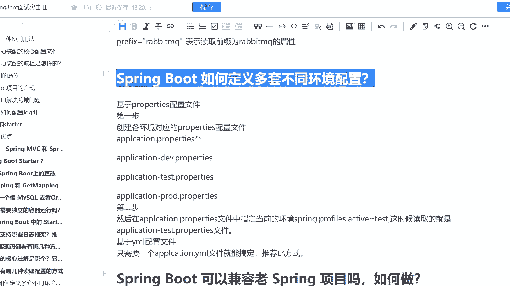
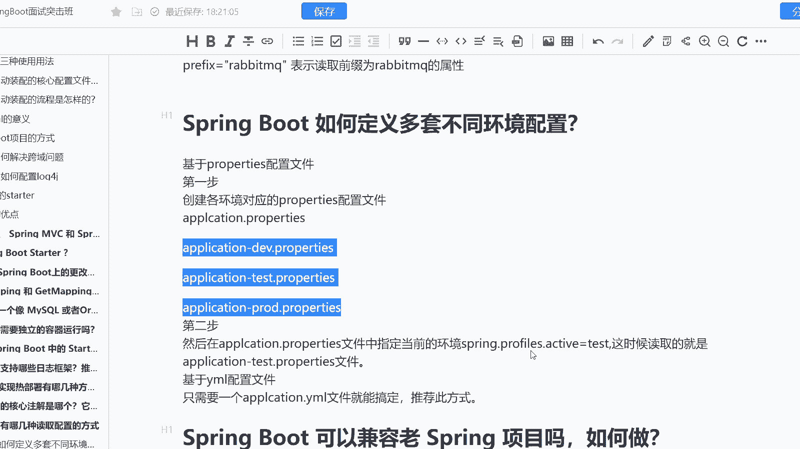
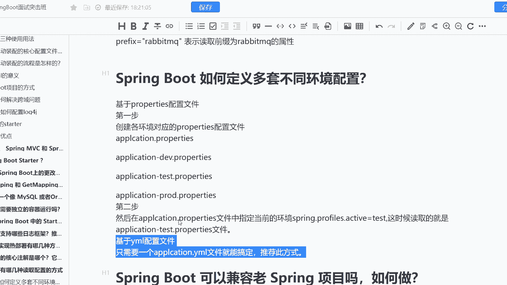

# 系列 6：P174：Spring Boot 如何定义多套不同环境配置？ - 马士兵学堂 - BV1RY4y1Q7DL

来自于一个阿里比较基础的题目啊，是spring boot如何定义多套不同环境的一个配置呢？这道题目主要考察的是什么？主要考察的是对于各位程序员，你真正的一个开发经验。

包括你如何去定义不同的环境的一个配置。这个一般是什么呢？这个一般是由高工去完成的。但是呢呃对照出工啊，或者说对照中级工程师，我们最起码看着别人，对吧？没见过没见过没没吃过猪肉，还没见过猪跑过嘛，对吧？

所以呢这个东西也是我们需要去掌握的，它对应的岗位呢是中级java开发工程师对应的薪资呢是15到20K。那么接下来呢我们就去看一下啊，首先第一个首先我们是知道的啊，咱们的环境我们一般情况下。

比如说他一定是基于pro的一个配置文件，或者说基于mail的一个配置文件。而此时呢就会有一个问题，什么问题呢？我是需要开发出多套的一个环境的配置。让他用以适应比如说。

像我们的开发环境，developer测试环境test以及我们的生产环境productduct，或者说像有一些公司比较有条件的，可能还会有UAT的一个环境。

那么首先我就要去给对应的这样的一个环境的配置文件，去加上它的一个后缀啊，加上了后缀之后呢，接下来第二步，我需要去干嘛呢？

需要在我们的applicationpro文件当中去指定当前有个属性叫做spring点pre点active一个激活的标识位，我要把它对应的一个文件给写进去。

比如说develop我就把developer给写进去product，我就把product写进去。这个时候我们读取的就是对应环境的一个配置文件啊。

也就是说你只需要去改到application点pro去加一个属性就O了。而如果你需要基于压mail的配置，那只需要干嘛呢？一个application点压mail就不需要plication点pro。

所以呢一般情况下像我们的sring boot是推荐mail的一个方式的，而不是推荐我们的pro的这样的一个方式啊O这是我们的这道题。

