# 系列 6：P18：偏向锁 - 马士兵学堂 - BV1RY4y1Q7DL

下面我来解释偏向锁这个东西啊，轻度竞争就是来两个线程就叫轻度竞争，重度竞争就是刚才我所说的那个超过jvm，自己控制，就是那个adaptive programming，好看这里，那么这个偏向所有同学说。

老师我没有观察到偏向锁呀，你看刚才这个时间对比我们刚才那个小程序，这小程序我一上锁，直接上的就是轻量级锁，我没有看到偏向锁的状态啊，原因是什么，原因是偏向锁的启动有一个启动时延，这是啥意思呢。

就是当我们看到这张图的时候，这张图这张图啊，如果一个普通的对象，在你偏向锁没有启动的时候，会直接进入自旋锁，他不会说中间有个偏向锁过程，那什么时候才能看到这个偏向锁呢，看这里啊。

这个偏向锁呢呃它默认是有一个启动的时延，启动食盐时间延长有啥意思呢，就是我这个jm启动之后，过多少秒钟之后，偏向锁机制才会启动，这个是如果你想观察到偏要素的机制非常简单。

默认的这个值是四秒以后启动偏向锁，所以如果说你想观察到偏向座，你让他上来先睡五秒钟，你在new object的时候再new再给上锁的时候，你就观察到这把偏向锁了，试验一下好吧，预热对考一下。

这里面隐藏了一个比较深的面试题，嗯看这里对比，看到了吗，这是我们刚刚new了一个对普通对象的时候，偏向锁一旦启动之后，new出来的普通对象就是101，还记得吗，我们偏左没启动的时候是001对吧。

然后偏向组的状态101，这是101啊，那有同学会说我你有一个普通对象没加锁，为什么也是101呢，ok这种状态叫匿名现象，偏向锁已启动，只要偏向锁一旦启动之后，你new出来的对象那都叫做匿名偏向。

就是匿名偏向的意思是我还没有偏向谁，但是我已经是偏向锁状态了，所以刚才有同学说，问我，那个详细的说底层偏要素到底怎么实现的呀，其实很简单，上来一看你是一个匿名偏向状态，那我就直接给你上偏向锁。

我就不会给你上轻量级所，就这么实现了一个简单的判断而已，有这么难想象吗，好了，任何对象都是匿名的，对一旦启动偏锁机制之后，当你new出来的普通对象默认就是匿名偏向状态，前面老师，你卡了都卡了吗。

刚才没听到，what，其他人呢，我还在吗，am i still here，没看没卡啊，ok刷新一下刷新就好啊，卡了的话刷新就好，ok，好那现在问题就来了，这里面有两个隐藏问题。

第一个问题是他为什么要延时，当然延时你是可以通过参数来控制的啊，各位大哥不要太看重这玩意儿，因为这个参数你可能记不住，没有关系，你知道去哪查就可以，百度1搜也能搜得出来。

听我说这个延时呢是通过这个参数来进行控制，叫vlotus jdelay，读一下biased偏向的locking锁，start up，启动delay，延时偏向锁启动延时默认是四秒，你可以给它改成零。

那么在这种情况下呃，整个dvm虚拟机一启动就会启，动前要做the best locking jdelay，bias the locking start of the belk，这个值呢你能去控制它。

它默认是有个四秒延迟，第一个问题是为什么要有这四秒延迟，第二个问题是，偏向锁的效率是不是一定比自旋锁效率高，我刚才说过，像这种一定还是什么各种乱七八糟的问题，我跟你说，回答的答案一定是不一定。

唯一一定的事情就是不一定打开偏向锁，效率一定是否会提升，偏向锁为什么要延迟这四秒，本质上是一个概念，下面听我讲，第一点打开偏向锁，效率是不是一定会提升，肯定是不一定，关键的点在于为什么y，刷新啊。

卡了卡了之后啊，各位小同学，你们卡了之后刷新一下好吗，刷新就好了，ok现在可以了吗，我可以继续了吗，可以继续给老师扣一，今天要讲速度比较慢，主要原因有一些那个小伙伴基础稍弱一些，这也很正常啊。

我不可能照顾到每个人的速度来这听课的，有可能是大学水平，我照顾的是初中高中的水平好吧，所以各位自己对应什么水平，不要要求老师只对你一个人讲，这个肯定是不合适的啊，大家看这里打开片子的效率一定会提升。

为什么，肯定是不一定，为什么，原因是什么，原因在于同学们，你们想想看，偏向所的最底层的机制叫做没有竞争，没有定妆，我上来二话不说就把自己往上贴，那我想问他一句，假如我明确知道。

我非常明确的知道一定会有竞争，好多县城一定会参与竞争，那我这个时候还有必要启动偏向锁吗，我启动了偏向锁，是不是得有所撤销的这个过程啊，我得把偏向锁那个那个那个人名想的多，给他撕下来。

这个过程他不需要消耗资源吗，肯定也需要我明确知道一定会有竞争，我干嘛还要启动这把偏向锁，我显然就没有这个必要了，所以在jvm启动的时候延迟四秒，原因是什么，原因是jvm的启动过程一定会有所竞争。

为什么最简单的jvm启动会有启动，好多好多好多线程，如果你用jdk观察过的话，你启动任何一个虚拟机，只执行一个main线程，它里面都有十好几个线程在里面运行着，所以最简单的好多线程都要往空间里头分配对。

象，分配对象的时候要不要锁竞争这个竞，竞争这个位置啊，分配到哪个位置上了，轮到我了吗等等，所以jvm启动过程一定会有所竞争，因此我就没有必要启动这把偏向锁，等jm启动完之后，我再启动线下锁就可以了。

现在其实有的最新的java的jsr，他们已经在探讨，要不要把这个偏向所给它取消掉，好像效率上没有显著提升，那四秒就启动完了，四秒只是一个可以设置的值，你如果你们家机器超级牛叉，你完全可以一秒钟。

你机器超级不牛叉，你写4万秒有有关系吗，所以这东西你还用问吗，你说问这么初级的问题，好意思吗，好了，呃这个刚才能get到这点，同学老师扣个一来，祭司饿了是吧，持有那把锁啊，这不是有一把锁吗。

没想到讲这个东西能把你讲饿了，这个品味有点重啊，好开个玩笑啊，嗯那第二个第二个第二个问题是，就是这个为什么要启动这四名，其实就很简单了啊，就搞定了，呃当然我看刚才有同学问一些特别详细的问题。

就是老师他里面记录的不是线程id，而是lock record索记录啊，没错老师这个锁的重录又是一个什么概念，到底是怎么实现的，这里面呢其实笔记里面全有，但是呢到讲到现在为止。

觉得最基本的概念已经给大家解释清楚，如果每一个细节都要扣到的话，没有四个小时肯定是不行的，不可能的好吧，有一些东西呢我就放在嗯整个的这个笔记里面，然后你自己拿去钻研好吧，呃当然我们vip课程里头讲的。

实际上是非常非常详细的啊，节目相锁撤销啊，然后那个从天降啊，基本上都给大家讲到呃，像那个锁重入啊，呃sychronized的最底层一个实现呀，都给大家讲到啊，所消除啊，所所降级啊，所粗化。

所所细化超线程到底是什么等等，当然我觉得我们的课程呢这么说，如果我们课程在整个培训界，我们我们要说自己排第二的话，估计应该没有人没有人敢说排第一，一个是老师比较牛逼，我给你介绍过了，大厂的老师。

在咱们这全有ba提高的老师，你随便去哪个培训机构问问没有，这第一个第二一个呢，其实课程我今天不太想给大家详细介绍，我们的那个那个课程，如果有时间，明天我可以介绍一下嗯，最主要的一个看疗效还是这句话啊。

现在我们7月份已经开始了，一个叫金九银十的涨薪养成计划，9月份10月份马上就到来，我们课程有一个很重要的点，就是大概两三个月就让你涨薪，像这种东西呢，这是我们自己自己自己内部的一个简历指导群。

这是昨天晚上刚刚有小伙伴告诉我的，说课程牛不牛，我觉得值不值的呢，主要看疗效好吧，这是昨天小伙伴刚刚跟我说的，我就觉得特别高兴，每天都会收到这样的消息，就觉得她美美的开开，开开心心的给大家提供的服务啊。

觉得是很值当的，得到工作吧，一直没告诉我对，有好多小伙伴找到工作之后就懒得跟我们说了，就是他拿把药拿走，然后自己自己自己有了疗效了，然后接下来呢就不会跟我们说说，这药药挺好的，但其实到现在为止。

基本上我们听完我们课程的听一个呃，按照我们的按照我们的学习学习学习路线，听完我们课程的涨薪这件事就超级简单，进大厂相对难，但有我也能给你指出一条路线来，所以课程最重要的解决的点在于第一个涨薪。

第二个保持竞争力，保持竞争力的意思就是你可能好长时间在那里，温水煮青蛙，没有参与过什么面试啊，没有参与过什么这种跳槽啊等等，没有参与过，你不知道现在的跳槽，跳槽面试都已经到什么深度了啊。

或者你到一定年龄，你自己呢感觉也不需要什么进步了，其实这件事是很危险的，这个疫情完了之后呢，有好多那种降维打击的，原来一线的好多呃人被裁员了，回到二线去打，你原来那个那个那个那个呃。

像是那个在大厂里头工作的很好的哈，回到小厂去打你，所以你自己不进步，你这个竞争力肯定会慢慢的会弱化呃，第三一个叫进大厂这件事，我们百分百保障，就是听完我们课，涨薪这件事非常轻松，保持竞争力完全没问题。

进大厂相对难，这是一个技术活儿，不仅仅需要那个你的技术水平到了，而且还需要我们各种各样的比较好的一个服务，呃，这件事呢，原来也是有好多好多人呢，已经取到这个疗效了啊，也就是刚才那个什么状态。

有好多好多事呢，好多好多人已经已经有这个疗效了，大家感兴趣的话，可以看看我们的就业的案例，六这是那个面，六六点过了4。3。5，两个14，就是刚才那小伙，刚刚那小伙儿啊，嗯当然还有一些其他的。

只听这班郭建成收获两个offer啊，我就不一一给大家展现了，如果大家伙有这个需求，那今天技术的内容我就讲了，我就讲到这里，那么我看同学们有没有什么一些相关的问题呢。

不管技术问题还是其他问题都可以找老师问啊，先聊聊天好吧，剩下一点点时间，今天十点，明天我们依然是八点开始，明天我们讲什么内容，先说一下，今天讲的内容大家感觉还有收获吗，怎么这么低，才14k。

你说的很对啊，第一他4月8号报名时间很短，时间很短。

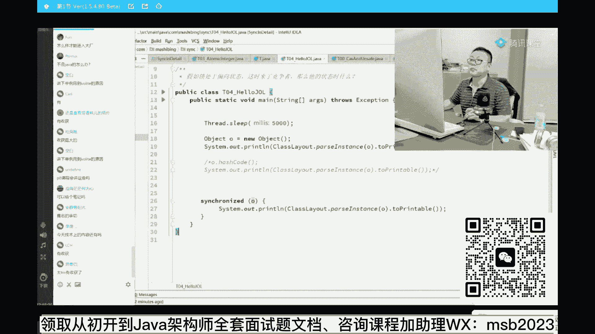

就是每个人不同情况不一样，嗯你说的对。

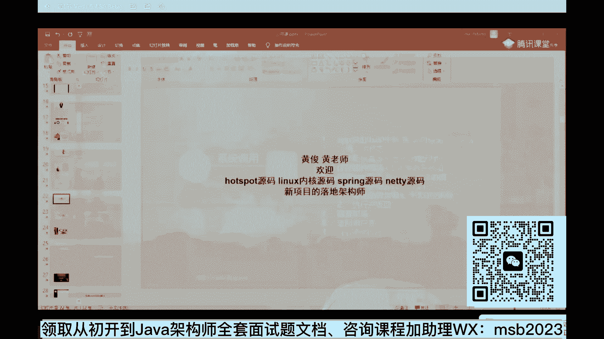

你看啊，我们是0408，是这小伙做的做的做的简历的面试辅导，所以8号报的名，然后大概是不到6月份，注意啊，那个值钱薪资，看之前薪资，你看了他之前薪资，还觉得14k那个什么吗，还觉得14k低吗，啊。

进大厂的话，需要你全系列的努力才可以，就是技术底层外加算法，如果你是社招生，还要加项目架构，明天我们接着说，明天讲什么好吧，有点用呢，是留是有两天的时间啊，明天我们讲什么，明天我们讲这些内容。

我们高新养成计划的第二天主要讲这些内容，这是一道最近刚刚在阿里这边面试的时候，一道面试题，这道题呢需要通过线程池来实现，明天我们主要讲这些内容啊，相持牵扯内容太多，我可能明天会稍微略讲一下。

我们主要讲的内容呢，是另外一个各种底层的东西，现在主要问太多，而且只要你答出来薪水就蛮高，只要你答出来薪水就蛮高，这个东西值得给大家，你值得拥有嗯，tr你是vip学院，直接问林老师，因为你们记录的话。

那要看你存在哪里，是存redis存储系统，问一下林老师啊，直接问就可以，为什么a q i n c s加volatile，去看源码就知道了，他的那个stay那个值是volatile的。

他对于队列的管理是cs的，所以它叫做cs加volatile，丁程云，今天给面过了，阿里的外包可以进吗，你是不是在微信上问过我了，阿里的外包没有更好的选择，当然可以进啊，老师偏向锁可重入锁有什么区别。

偏向锁是锁的一种类型，可重入锁是锁的一种机制，这是两个不同的概念，你相当于在拿什么做比较呢，拿那个馒头和桌子在对比，这俩这俩是一个概念吗，不是一个概念，可重入锁的意思是可以锁定两次。

比如说我synchronized的这个对象，里边又掉了synchronized的同一个对象，这叫做可重入，能get到吗，嗯今天的笔记明晚会发对，今天笔记明晚会发，明晚八点就在这儿，依然是这个直播间。

依然给大家聊底层的东西，高并发底层的东西，成员35这个坎儿怎么看，有一个小伙伴是我们心灵老师的一个朋友，他是38岁了，在那个唯品会38岁转的行，哈哈记住啊，让自己变得更强。

你才能够在这个世界上有一定的生存空间，所以只要你在网上持续的混响，就让自己变得越来越强，有的是你的生存空间啊，丁程语音可以再说一遍吗，没听清为什么qs是cs加volatile大哥。

我那本书上写的很清楚了，我课程里vip课也讲的很清楚，教你读源码，你去读一遍源码，别问了，去读，因为a q s里面state那个值是volatile的，要保持线程可见性。

第二因为他管理的一个队列是拿什么来管的，是拿cas进行的尾插入头插入，锁不就是一个状态，再加一个队列吗，这个队列拿什么管的，cs往尾巴上插这个state的值，volatile，要保持线程可见性。

还是还是用完还用说吗，with a  menu，老师你你怎么这么厉害，那怎么办，因为老师天天在做专业啊，专业啊，你不学习，主要你不厉害吗，我我要给你讲一课，我你知道我参考多少东西，我旁边都是书啊。

来给你装个叉，我我我我给我我给你讲一课，比如说jbm的课，这本书j v m g y g c，实战jvm虚拟机，hosport的实战，cdc设定实现，这把虚拟机精讲，java故障性能故障诊断性能优化。

深入理解这个虚拟机，哎呦还掉了一本淡化，这这把性能优化好不好，还有一些我都故意拿了，就是你会发现老师讲的东西是从头贯穿到尾，从底层一直给你贯穿到怎么应用，原因是我要给你讲一个东西。

我真的要参考的东西太多了啊，所以你听我课就不用去看那些书了，爽不爽，说了，加了钱对视老师能开个书单吗，我讲一课，基本上市面上的书都会买下来，j o l啥意思。

jo l l叫做java object layout，但是java高并发的时候还可以领吗，vip有，看书太慢了对，因为书里面讲了很多很多，不具备参考价值的东西，他为了凑数，这些书都会看吗，对呀。

五阳厅哈，武阳厅啊，你那个是不是中奖了，这个来键盘，就这个，好像好像奖品是五羊厅了啊，没想到你还在啊，书哪里领，知道班主任对对，class上锁锁信息保存在哪，class也是一个普通对象啊。

大哥你这个class就是个普通对象，你说它保存在哪啊，class c等于比方说t一点class，这不就是一个普通的class类的对象吗，他就是个普通对象，它是不是也有四部分啊。

mark word collect point等等，他说不要了，重新抽啊，武阳亭是这样的吗，挺好啊，一直很膜拜王老师，你可以继续马老师领域模型怎么看，d d d现在呃偏理论居多，落地的其实比较少。

大致了解就可以了，祭祖帮忙推荐一本，就是那本，很经典的那个那个那个那个计算机组成原理，深入理解计算机系统嗯，老师所有教你吗，可以认为没有，但其实是有的，有线索那个呃，比如说他进入到一个gc的状态之后。

如果证明只有一个只只有一一，只有什么线程在访问它呢，只有些那个gc的线程在访问，他，这个时候可以进行锁降级，可是你想想看，只有gc线程访问它了，它都已经要回收了，你降级还有个屁用啊。

有这样几个class类信息存放什么来，你拿大腿想一想，class类信息应该应当存放什么，你告诉我一下，gc后面会讲了，公开课没有了，vip课我们有讲，其实你对涨薪有需求，对你这就是学生。

这课就涨薪水就这么简单，那为啥叫unsafe，unsafe呢，主要的原因是java里面访问一个对象，分配内存，这些都是save操作，就是安全操作，你不需要去干嘛，不需要去释放他的歌。

如果你直接用unsafe这个类，他能够干一些什么事呢，干java干不了的事，c加加能干的事，直接访问内存，直接开辟一块内存，但是这个时候你都需要手工回收，所以它叫unsafe，我说清楚了吗。

我只知道你好牛逼，我啥也听不懂，你只要知道前半截就行，觉得什么是一线，什么算是二线，你说的是一线城市还是二线城市，还是一线厂的二线厂子，请教一下，偏向锁状态还是扣的存档存在lock record里面。

细节的是这么来实现的，每生成每每对这个对象加一次锁，就在县城站里面生成一个lock record的对象，这个locker record对象，会把前面的这个状态保存下来，再把后面的状态给它覆盖进去。

每生成一次，每加一次锁就生成一个lock record，所以锁重入是在这实现的，老师可以解释一下，对外内存概念比较模糊，jvm管理的内存叫堆内存，j w m虚拟机管的jim的操作系统层面。

它就是一个非常普通的应用程序，这个应用程序所分配的内存叫堆内存，由于一些效率上的需求，他需要去访问一些堆外内存，这个不不是jvm管，是由谁来管，是由操作系统直接管理，但是jvm可以去操纵它。

这个叫堆外内存，什么情况下需要这种的，这个需要讲的，什么情况下需要对外内存，好听我说比如说说一个最简单的操作系统级别，接收到了闲呃，这个网卡传回来的数据，他会把这个数据存到一个buffer里。

存到一块内存里，缓冲区这个数据如果你jvm想用的话，原来的模型是需要传递，或者叫拷贝到jvm的堆内存里面，你才可以用，现在不需要了，为什么，因为jvm可以直接访问这个对外内存。

这叫做zero copy shei和ni o，它的底层实现这块讲的最牛逼的人叫周志磊，周老师是我在清华的小师弟，也是我们这儿的老师，好这块就要用到对外内存，对外内存的回收是另外一个概念。

堆外内存的回收叫做虚指针，虚引用啊，强软弱虚四种引用这块是另外一个概念啊，这个这个这只能再说了，引用计数法，这跟引用技术没有半毛钱关系啊，刚才cs中比较的时候是ok的，set的时候如果把线程值改变了。

这次up我已经说完了lock吗，你管你管他哪段呢，你lock完了之后，只有一个cpu能访问底层的一个锁定了，lock，compared exchange，偏向组可以关了吗，问的很好啊。

渡前的你拿大腿想一想，也可以把它关掉，这个关闭叫use best locking。

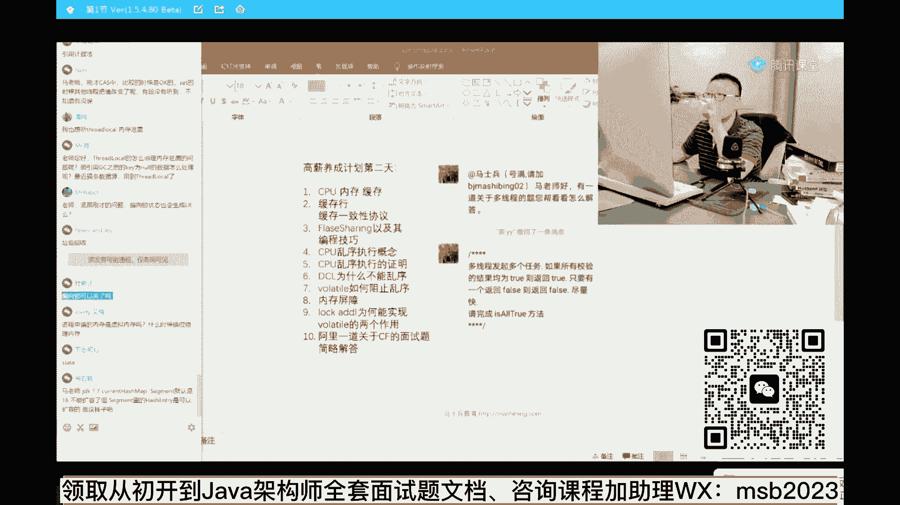

好吧，看这里你们的问题细节问题还是比较多。

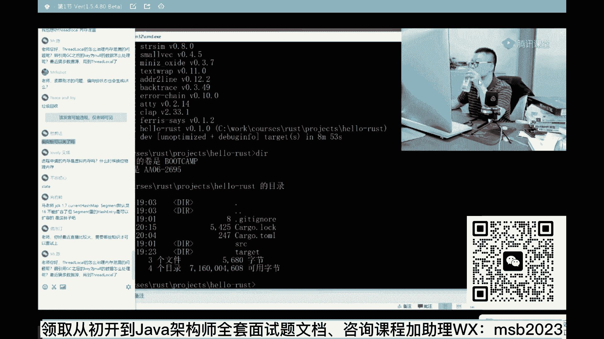

说明你们认真思考了。

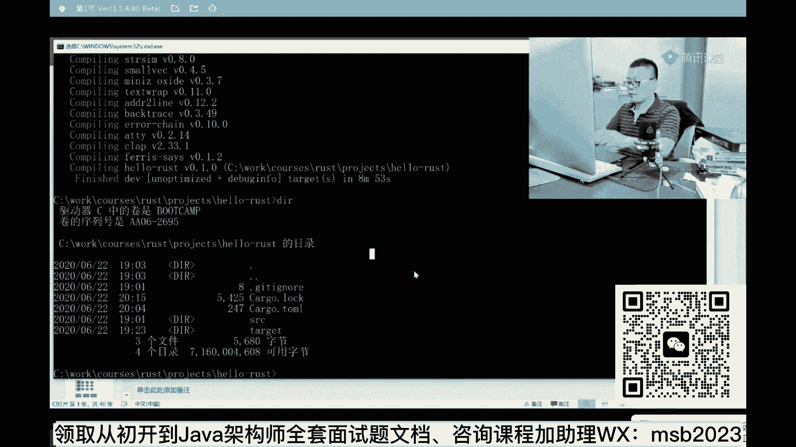

valleg。

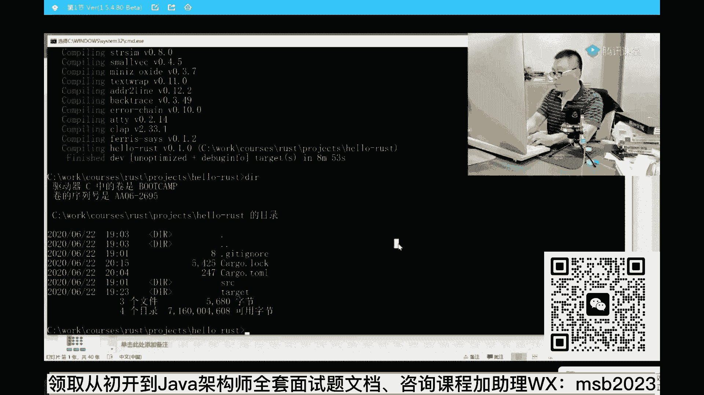

右边下一个，java version。

这里呢是那个呃，就能跳出来这个java虚拟机的版本号。

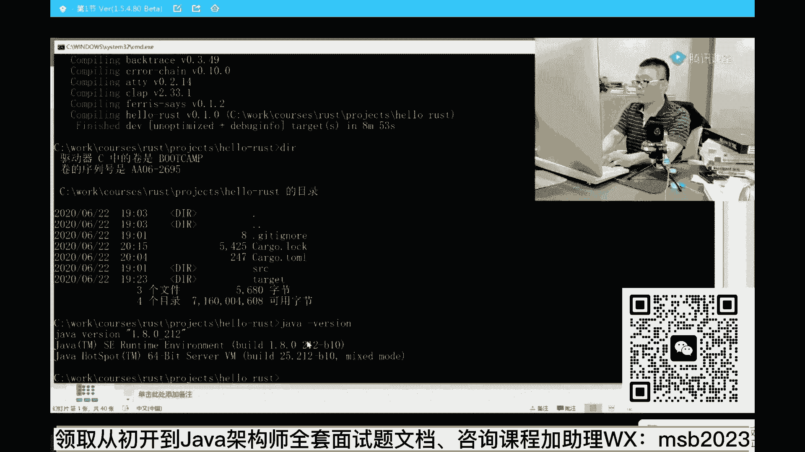

这个version呢它叫做一个标准参数，这边有好多好多的参数，java cox x，print print打印flags，final conversation。

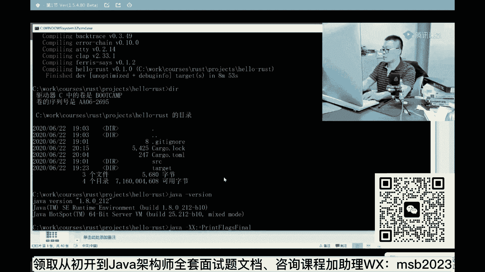

这啥意思，他就会把参数全部都给你打印出来。

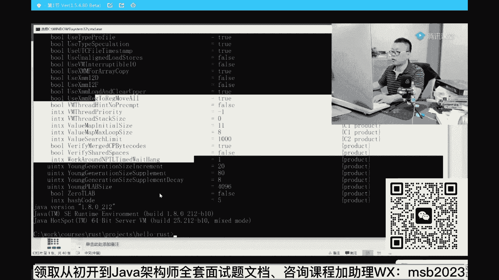

这个大家自己去看啊，这参数大概700多个参数，这就是你jvm调优的时候需要大致了解的。

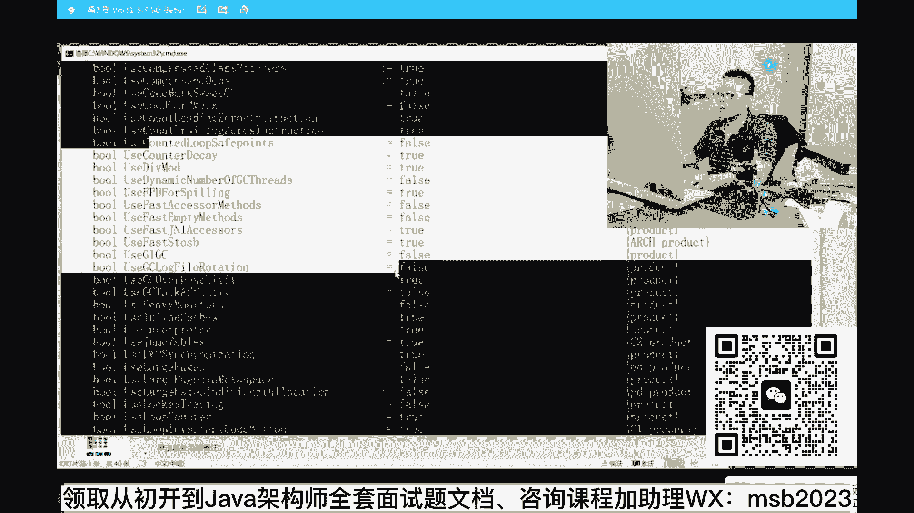

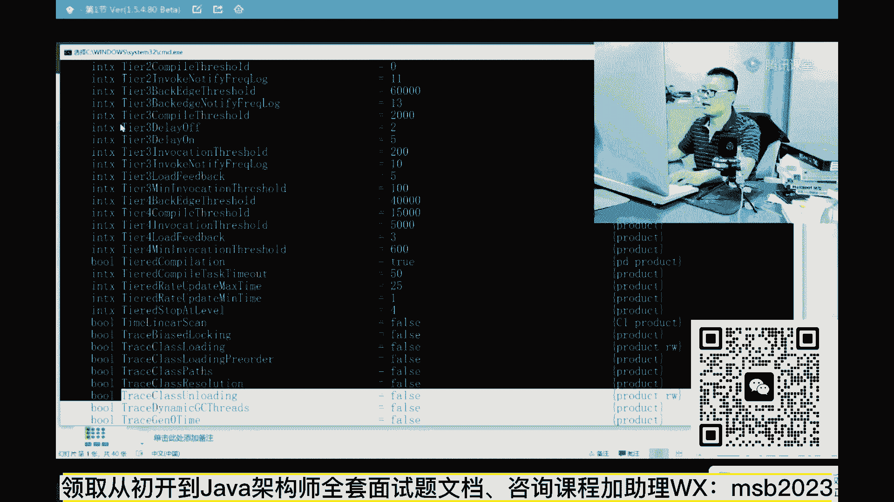

就是你涨薪水50万以上年薪，告诉你这些东西就需要你了解了。

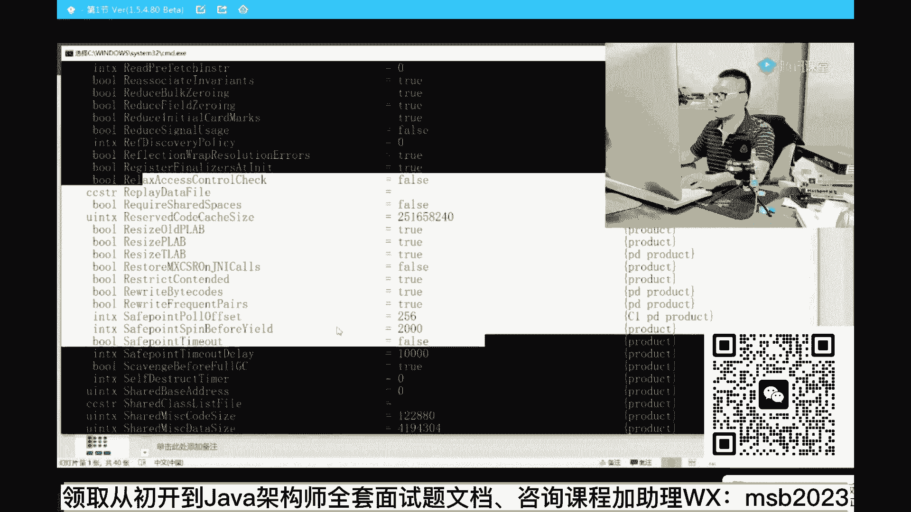

当然也没那么难，因为我讲的时候，一般会把那个常见的垃圾回收器。

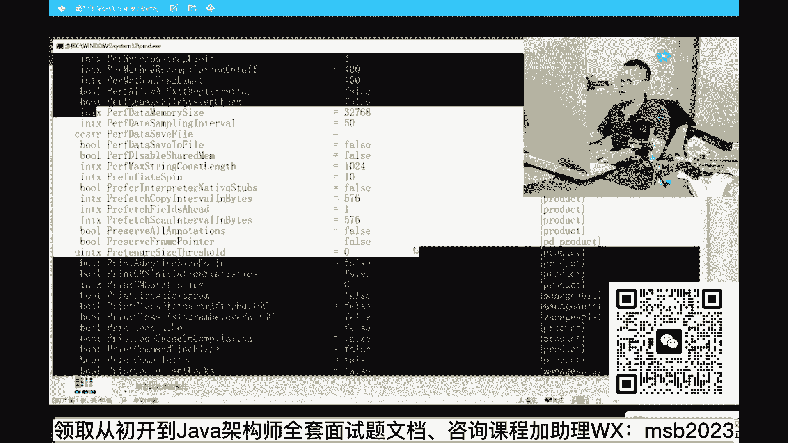

每种参数是慢慢就是最主要的，应该设哪些参数，每个参数应该怎么设。

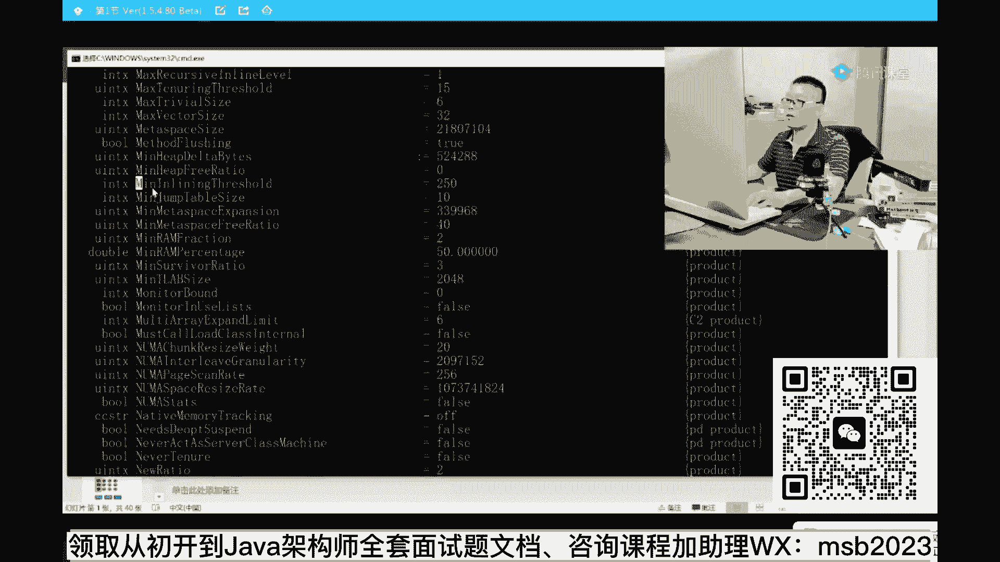

会告诉大家呃，作为blocking来说，你自己去找就行了。

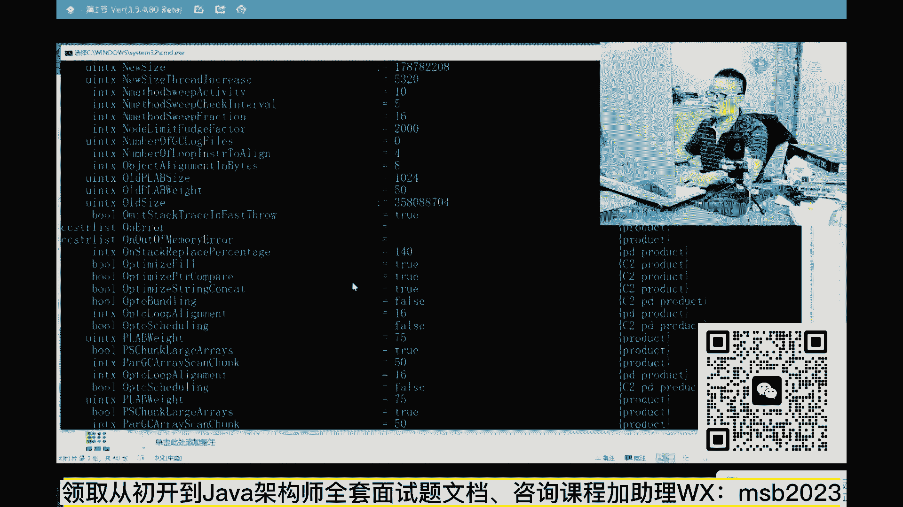

有一个参数叫use the best locking，ut u use the best lockett。

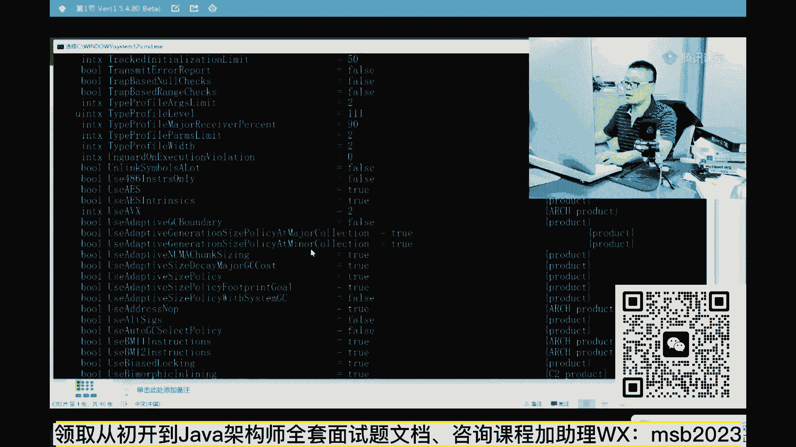

看了使不使用偏向组。

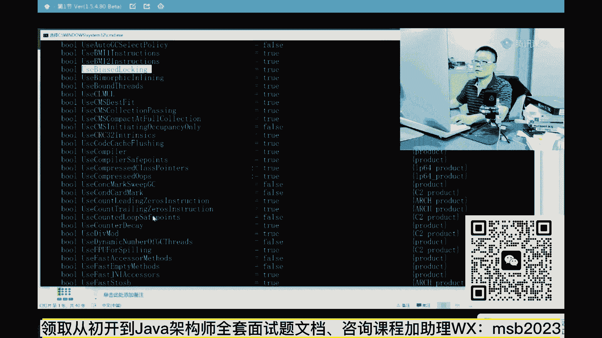

默认值是true，这是默认值。

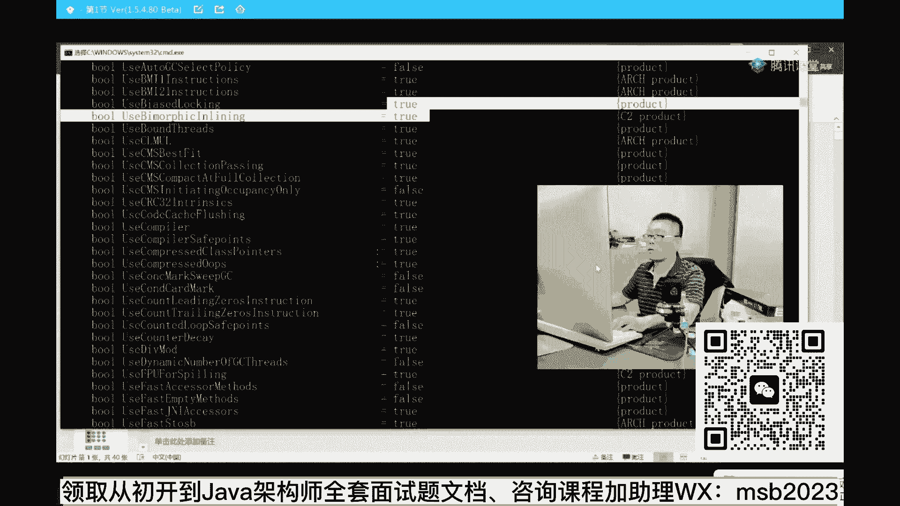

你当然可以把它设成false啊，我就不用了吗，ret logo怎么把人数据是六六内存可见性，大哥，你底层有一个东西，cs cs底层叫lock指令，你去查一下那个x86 的，他的操作手册。

lock指令什么概念，lock指令就能保证线程可见性，它进行了一个线程与内存的同步，这个就已经保证了，你好像最近直播比较火，需要哪些支持才可以面试上，那你得看你那个你面试的是哪个职位啊。

欧阳厅虽然你中了奖了，但是你也未必能够面上直播的东西，直播间你要看你在写server，还在写服务端，还是在写那个管理端，还是在写直播的服务器，就完全不一样哇，感谢老师回答啊，不客气了，两位小天天啊。

我不知道有没有同学有没有领到，有没有没有领到那个预习资料的，如果没有领到预习资料的。

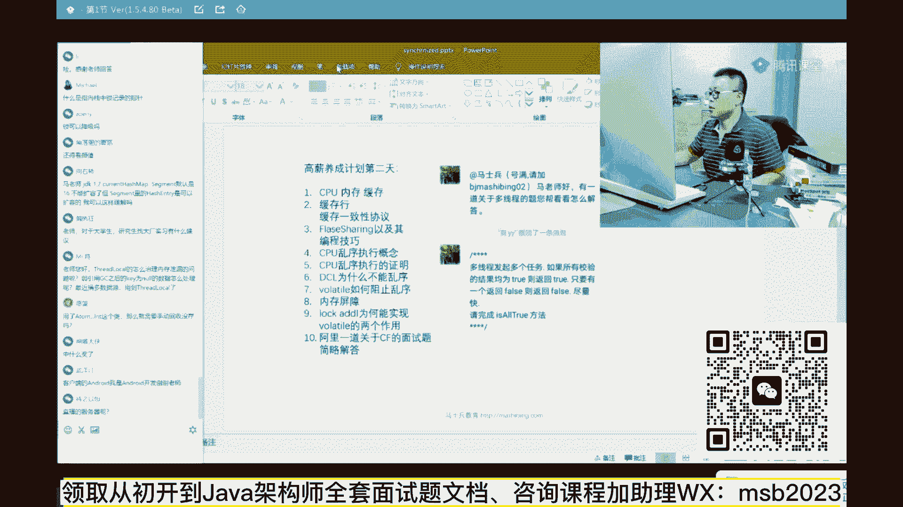

或者等12x40分钟了还没进，也不太清楚啊，但是咱们这都是直被调，因为他们自身就在群里啊。

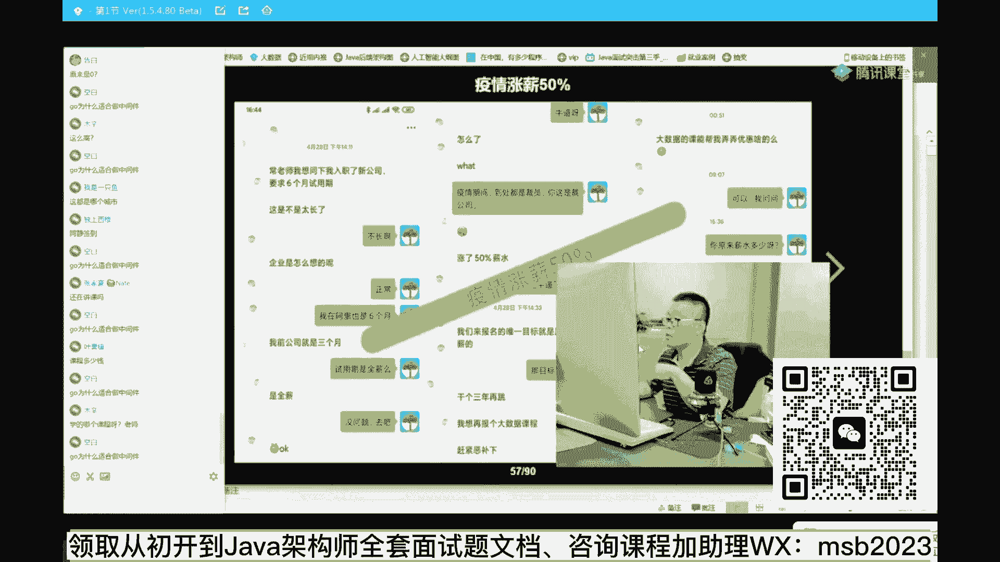

这1年期间干了百分百，干了50%的涨薪，八家公司五个offer，牛逼不牛逼，感谢我们的，其实作为老师来讲，我觉得有的人呢嗯做培训呢主要是为了盈利嘛，这个盈利的话呢就会使用另外一种讲法。

还有呢不会给他给他请更牛逼老师，因为牛逼老师比较贵，我们愿意给大家请教牛逼的老师，阿里出来的曹老师，从那个阿里和美团出来的黄老师呃，一线的讲讲算法讲的比较牛逼的，左传云，左老师。

最近的阿里的p7 程老师，那个给要给大家讲kim就是java里面的线程的实现，是那个京东的孙老师，那个讲的是那个activity的时间，和那个具体的shield的呃，京东的落地落地呃。

就这些经验呢可以说你很多时候花钱买不来的，你知道吗，百度上的信你都可以百度到，但是人家在京东这种平台上，它到底是怎么落地实现的，这种东西你是花钱买不来的啊，我们想做一门好课，就这么简单。

而好课评价一门课好不好，最关键的点在哪里，在效果，在疗效，从现在我们的效果看相当牛逼，来就让你掌心，你不来，我就我就让你的竞争对手掌心哈哈，colin，有课程，对不起，没有没有calling啊。

老师你这么做是为了啥，为了一个爽感，听到学生们说我涨薪水了，我就觉得特别爽，而且适合测试学的课程，是在p8 这个课程里面专门讲了测试开发，但是并没有，目前并没有专门的测试提高课，主要这个需求太少了嗯。

什么水平，农地法人民教育教书大厂背景一线一线大厂，并且你得在一线大城市做一线开发的do，课时1500~2000课时，课时数比较高，这课程比较特殊啊，我大家问的话，我就稍微解释两句，就这课程比较特殊。

我们课时数非常长，因为只有特殊特别长，才能给你讲的特别深，呃然后呢呃课时课时的东西，课内东西比较多，主要分四大块，主要分四大块，这四大块呢分别是敲2年前，大家稍微敲敲敲敲俩字儿吧，聊俩字的话。

感觉不是很容易受精，融课程比较复杂，就内容太多了，呃我们有那个课程的那个体系图，作为课程来说，我们主要分四大块，第一块叫底层，这块主要是用来面试用的，什么叫底层呢，比方说的操作系统组成原理。

然后再加上什么呢，多线程设计模式，那个呃j a m g m调优，然后mysql的优化分库分表，所以优化c q语句的调优性能调优，redis the keeper到分布式nt的原理，源码解读。

就各种源码对，凡是你看到的那个这这些东西，基本上全都给你讲的源码，这是底层，这个主要这个主要是为了应付面试的同学们，第二块，第二块也是很大的一块，第二块是什么呢，叫算法，算法就是从基础数据结构。

基础算法，大厂刷题，力扣热点局，这块呢应届生想进大厂，不好意思，你得必须得给我掌握这块东西，作为社招生来说，这个权重还不算还不算特别高，第三块呢叫做大数据，这个就是大数据的全系列，这个你你你你。

2万多内克全系列啊，在这全要从那个最基本的a d f s啊，那个呃呃呃h base，然后那个have，然后到flink到killing呃，到实时的计算，到那个推荐系统，就是牵扯到ai这块好。

还有最后一个要架构，互联网三高的设计实现，所以目前课程有四大块构成，跳槽涨薪最快的，把这块儿拿下，把架构的一部分落地实现拿下，就可以了，互联网三高哪三高来同学们说一下，跟我说一下互联网三高说啥。

没一个说对的，咿呀累死我了，说啥啊，高并发错了，高并发高性能高，可用错了，我去高扩展高性能高，可用对了，这不哭，死神死神说对了，high，availability呃，availability，高可用。

高性能，那么高性能呢包括两项hi，through proach，怎么读来着，叫做高并发好吧，高并发，through through through，so so so put，少了。

这copy怎么还有还有第二项叫什么low latency，低延迟，所以高平时你们所说的这个高并发呀，只是高性能的其中之一啊，高吞吐低延迟，yes，互联网三高的设计，实现，互联网三高设计实践。

是在我们的p8 架构师课程里，这块这块主要是一个落地实现啊，就是p8 架构师这个课就是讲的高可用，高并发，低延迟，可扩展多级缓存，分布式微服务网格就是service。

就是那个那个那个service mesh和surface，这块呢最主要的点是在这啊，最主要的点是一个落地实现，就是我们是亲手有，有一个团队来帮你实现一个落地淘宝，就这个淘宝的这种分布式到底是怎么实现的。

怎么支撑那个双11的这种特别流量的，大大流量的并发，怎么支持高可用，而且这东西呢是呃从那个最基本的开始搭呃，搭那个分布式提升中心，搭配置中心打索尼群到事务集群缓存网关。

注册中心监控m q e分布式任务调度，tiny的麦秀的集群，就是这些集群不像是很多那个就是咋说呢，就不像是很多问题，成为了赚钱的那种那种那种培训啊，就是全是理论的，这些全是实践。

因为很多人听完理论之后听着一时爽，但是实际怎么做，还是不知道这个实践是啥意思，这些服务器我们真的会买下来，我目前大概有60万左右的服务器，大概几十台吧，然后最后大业务节点的话。

差不多大概100~200个节点，就这东西你是在企业里头，你学不着的，好吧，value讲的百分之多少，没有百分之多少的概念，每一个节点都在不断的自动升级，我们是一个大学的选课体系，入学之后呢。

老师会根据现成的，根据你的你的你的需求，你比方说你是想跳槽跳槽涨薪，我帮你设计条路线，你是想全系列的提升，我帮你设计一下路线啊，这么是这么来做的，不适合原来一个概念啊，张睿行行行，这次我报名，我跟你说。

你早报名早提心就这么简单，晚报名没折扣，这这这广告了啊，今天主要聊技术，不聊广告，7月份是最适合金九银十，抓紧时间跳槽涨薪的月份，错过了再等1年，等着金三银四了，就得再等半年，嗯老师看我一眼，回我一句。

我就报名了，你的名字都没有，怎么回啊，他无名之辈，无名之辈，我是谁，年纪大了，醒梦呃，如果你要提，让自己的变得更更强，有竞争力学就行了，无名鼠辈，零基础转行架构，ai算法落地落地。

还有零基础转行架构是有的，就是你得从我们零基础的课开始学，那个你有点时间比较长啊，你要做好心理准备，一般的情况下，仨月我就能让你涨薪水，涨个5000，很正常一件事情，像你刚才看到的好多案例。

就是两三个月就直接那个薪水就翻了倍了，或者怎么样了，自考的专科学历能进大厂吗，可以进这几个大厂，可以进京东，滴滴顺风好像是可以的，什么马蜂窝，携程啊这一类的吧，他不是很在乎学历的啊，阿里这些是可以进的。

有一些大厂你进不去，百度华为，腾讯快手这些你进不去啊，晚上授课对pgp要学多久，短期跳槽涨薪3~6个月，长期全系列提升，就所有东西要全学下来，1年，老师包含前端课程吗，前端入门的是包含在里面的。

前端入门，工作10年的这种就还有机会吗，什么什么机会进大厂吗，有机会你得去拼，但是机会明显比那个35年的要少很多嗯，安卓转这个系统，后台可以，那当然可以，java后端开发课程学起来要多久，这块是吧。

你看你原来的基础啊，因为这是一个提高课，就是我要求你原来有s s m基础，如果没这个基础的话，你得去学我们零基础课程，零基础，零基础课，这个就看你个人的一个对咋说呢，就是你个人的一个基础和那个学习的。

每天的时间的投入，课程多少钱，12000多块钱吧，12000多块钱啊，如果你们就是想找一份初级的工作，原来是零基础的，我不建议你报这个，我们现在12000多块钱的课呃，有一个六七千块钱的课。

那个课适合你，你就先先先怎么说，先拿到一个最基本的一个最基本，最基本的，那个那个那个那个这种这种这种工作啊，这个主要是为了给大家涨薪用的好吧，工作1年可以报名吗，感觉讲的好深大哥，你工作1年是最适合的。

你要不要涨薪水啊，1万多，1年赚多少钱，12000，包括全部对，12000，包括这所有的，其实我们课程不贵，你不要算这个钱，因为俩月就让你涨回来了，12000多块钱，包括啥四个全有，然后那个。

全线升级七八个项目那个嗯，大概每个课15块钱，你这么给你算计，你就知道了吧，就是别人家人家确实便宜点五六千块钱，但是人家给你300个课时都算多的，知道吗，我们给你的是1500~2000个科室。

每个课时我们得五块钱啊，便宜真要为了赚钱就给你来回的循环播，其中一个就可以了，大多数的课只是我们这其中的一部分，算法基本也没有，有的话讲的也特别浅，大数据就更没有了，架构师就给蒙题了。

大多数p p t架构师，放心报啊，报名课程放心报，这个课，这里没坑，就是别人你可能别别地报，我们可是有点坑之类的啊，这个在这没坑啊，放心在这没有坑，报名就提心，我公司现在没需求做怎么办，啥叫没需求做。

我没搞懂什么叫没需求做，有导播课程，零基础到p8 ，有问就可以，刚刚有点java基础的在职人员，2~3个月涨薪要求不高，三个月涨薪就行，三个月涨薪，你每天投入，你每天就业余时间投入的话。

最简单的就是6+1就够了，有c加口没有c加，目前会被将来会被谁抢够了，关键是还有一个语言抢他，rus的go语言抢起来还没那么没那么迅猛，rus的我感觉啊c加将来危险，你懂吗，没需求做，太闲了，学习啊。

大哥你很快就被裁掉了，课程目前落到多少了，我再跟你说一遍，没有多少这个概念，我们的课程是每一个单独的都在升级，比如说我2019年讲过一版多线程高并发，我今年就要升级，而且要或一倍。

基本上就是每一个课程在升级的歌，没有多少这个概念啊，怎么个6。1设计模式，多线程jvm，mysql优化，redis dukeeper 6项加我们三级里头的spring cloud。

全系列全系列一就加这个一就可以了，就spring cloud的全系列，就这这这篇这篇，就微博全家桶，spring cloud，奶奶飞，spring cloud，基本上spring cloud。

阿里巴巴spring cloud，高级持续集成，就这块儿，只要只要把这块内容讲完就可以，呃内容太多了啊，给你念完就没完了，你去你去拿这个拿去拿这个图去吧，其他机构培训和大数据还用来这里培训吗。

想提升的来，不想提升的就算了，有没有二线城市涨薪案例，二线城市涨薪的态度直接跟你说一个，说一条结论一点不夸张，我们课程大概学70%，我不信你不需要你学完，二线城市整全全top top top 10了吧。

这种职位平套随便挑，三四线的基本就到top 5的top一的这种吧，这种岗位你就你就可以随便挑了啊，二线涨薪太多了。

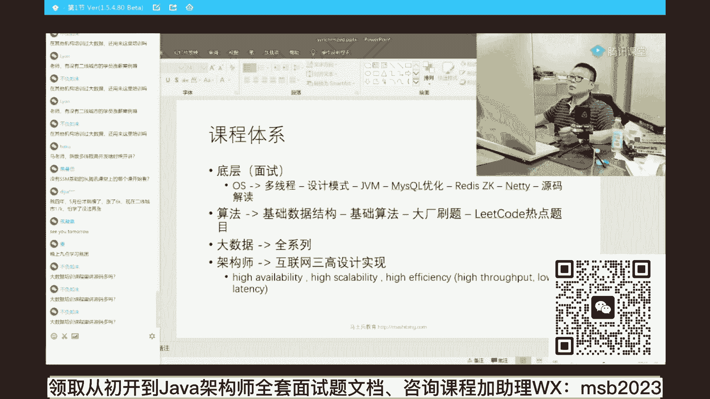

举举举例，举不过来了，好多好多二线的，你再去看就行了，你像那个拿下阿里顺丰，那个刚才那个是双大厂的，那那是大专生啊，您10万的，这不是成都的吗，成都严格来讲不能算二线，只学spring cloud。

成都1818k。

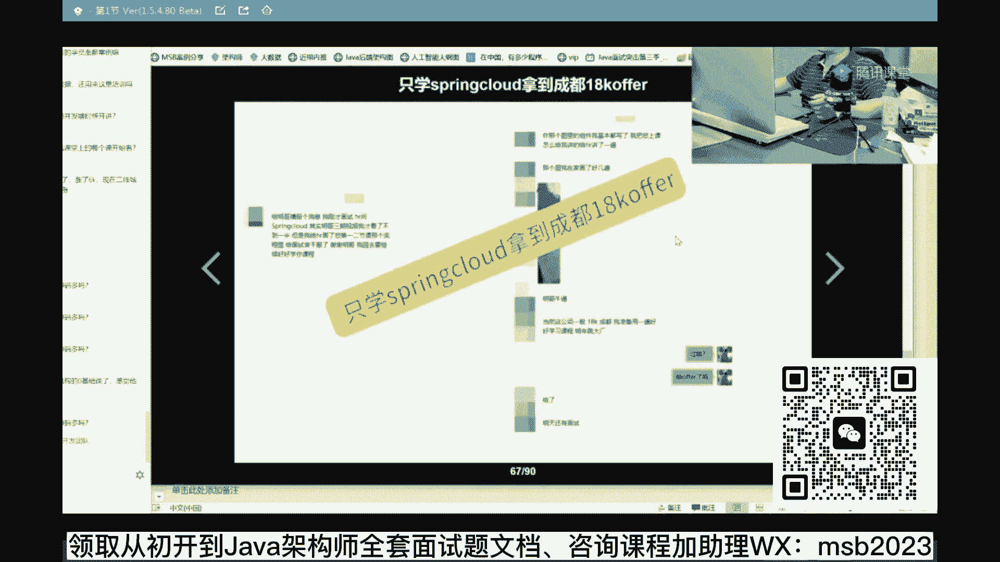