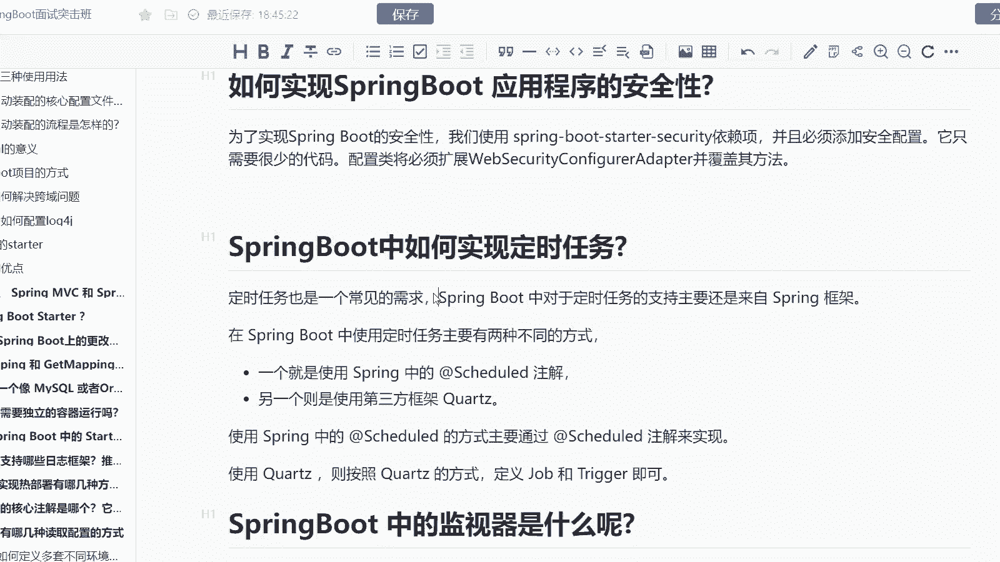
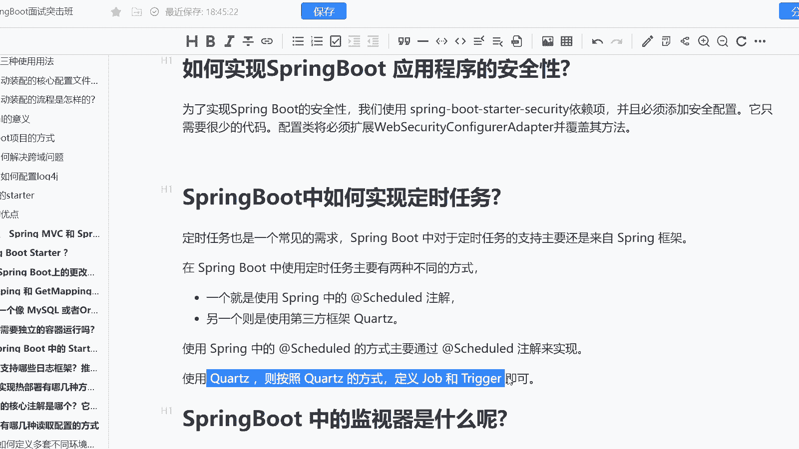
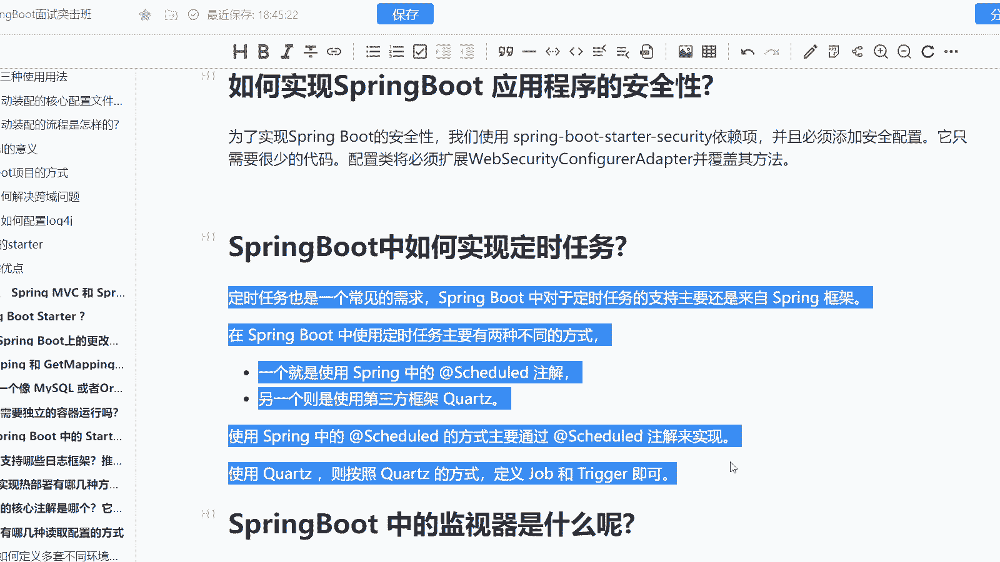

# 系列 6：P185：SpringBoot中如何实现定时任务 - 马士兵学堂 - BV1RY4y1Q7DL

呢是来自于阿里的一道3月份的面试题啊，说是spring boot中如何去实现定时任务。这道题主要是考的你的对于定时任务的一个理解啊。这道题在面试高级java开发工程师的时候会遇到。

然后呢对应的性式是25K到40K之间。那么我们来看一下这道题目啊，首先第一个呢我们来看一下定时任务其实它是一个常见的需求啊。

而spring boot当中对于定时任务的支持主要来自于spring的一个框架。比如说spring当中，其实我们可以用两种方式来进行一个实现定时任务。当然首先第一种呢就是咱们最常规的sule注解。

而我们可以通过在s注解上去，比如说添加me表达式来进行。第二种方式呢则是使用第三方的框架啊，包括一系列基于去衍生的第三方定时任务调度的框架。像 job job等等等等啊。

而使用spring的一个的注解呢主要通过。

我通过在方法上去加添加schedule注解来进行实现。而使用quis呢，你需要去定义它的触发器，它的呃调度器以及它的任务啊。所以呢一般情况下单s注解呢，它实现在单体架构下。

而我们的quis或者说相关的一脉相承的框架啊，像叉叉 job啊 job在分布式情况下可能会用的比较多一些啊，OK这是对于我们的一个就是说是spring boot去实现定时任务的一个讲解啊。

