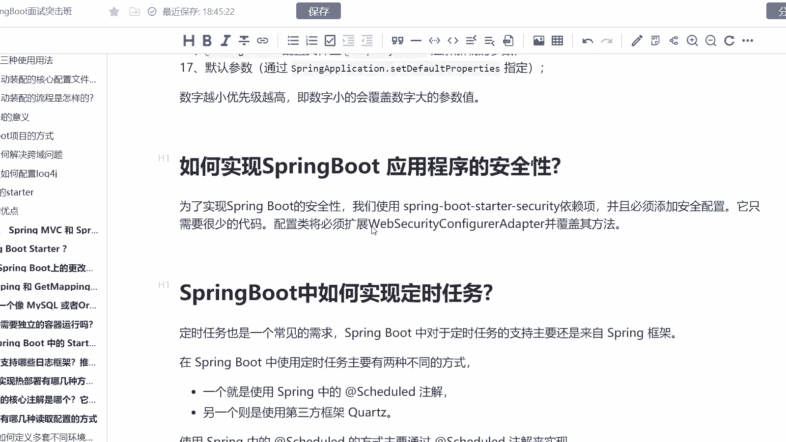
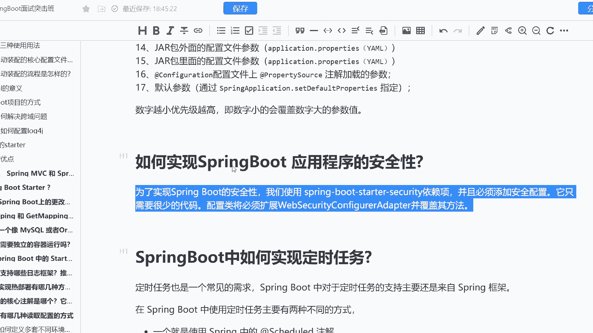

# 系列 6：P190：如何实现SpringBoot 应用程序的安全性 - 马士兵学堂 - BV1RY4y1Q7DL

这道题呢是来自于阿里巴巴的一道9月份的面试题啊，说是咱们如何去实现spring boot应用程序的一个安全性呢？这道题主要考察的是你对于spring boot的一个源码的理解啊。

这道面试题在面试高级加工程师的时候会去进行一个碰到啊，然后呢对应的薪资是25K到40K这样的一个区间，实际上呢很多熟悉，就是说咱们spring boot的一个小伙伴会知道啊。

就是咱们的一个spring boot它应用程序的安全性，实际上是需要去依赖一些组件的，比如说像我们的spring security。所以呢如果你需要去干嘛呢？去实现咱们spring boot安全性。

我们需要去使用到spring boot杠star杠 security的这样的一个依赖，并且加了依赖，还不行，我们还需要添加一些安全的配置。

而我们配置类必须扩展we security configurationfiration adapt这样的一个方法，并覆盖其原生的这样的一个方法啊。

所以呢这是我们去实现sring boot应用程序的安全性的提中的一个操作之一啊OK。

