# 系列 6：P21：CPU乱序执行 - 马士兵学堂 - BV1RY4y1Q7DL

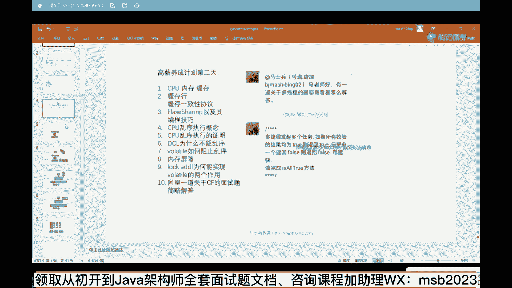

我给大家画个图，小小的图，好听我说这是我们的第一颗cpu，现在呢我假设这个cpu呢目前正在执行指令，执行两条指令，这是第一条，这是第二条，仔细听，现在呢大家写程序的时候，我上面写一条指令。

下面写一条指令，我们往往会认为说我的，我的前面这条指令应该是先被执行，后面这条指令应该是后备执行，我们往往是这么来认为的，这个很正常对吧，你第一个写的写的代码和第二行写的代码，你往往会认为第一行先执行。

第二行后执行，但实际当中是这样的吗，我先告诉大家，结论，在你实际在cpu里运行的时候，很可能第二行先运行了，很可能第一行跑到第二行后面来了，这种呢叫做乱序执行，当然乱序执行的时候呢。

需要他有一点点的呃这种约束条件啊，就是你前后不能有依赖关系，你不能说第一行代码是x等于一，第二行代码是x加加，这肯定不行，因为我x加加需要依赖于你前面这个值，所以在你编译器经过了一系列的优化之后。

认为你前面前后这两条指令不存在，依赖关系的情况下，这两条指令有可能会被换顺序，这叫乱序执行，为什么要有这个东西，是为了提升效率，为什么要提升效率，我们假设第一条指令，第一条指令是去内存里头读一个数据。

而第一条指令是一个简单的计算，第一条指第一啊，第一条啊是一个内存里读数据啊，y等b第二条指令x加加好，我这是一个左简单的计算，我x这已经缓存进来了，我直接做计算就可以。

y等于b我需要找到b那个位置赋值给y，我需要从内存里头把这个b这个值读回来，大家应该知道我刚才说过，我们cpu的速度比内存的速度快100倍，那我等你回来，这个速度我有99个时钟周期，我是在这里浪费的。

如果在这个99个时钟周期，我就在这干等着，我的效率当然就低了，那我可以怎么干呢，我发现后面这条指令，这哥们儿跟前面这条指令没有直接关系，怎么办，先拿你过来执行，这个很简单。

一个道理，好这块能理解的同学来给老师扣个一，有问题你直接说啊，有同学可能会说，老师真的会存在乱序吗，真的会存在，老师你能证明吗。

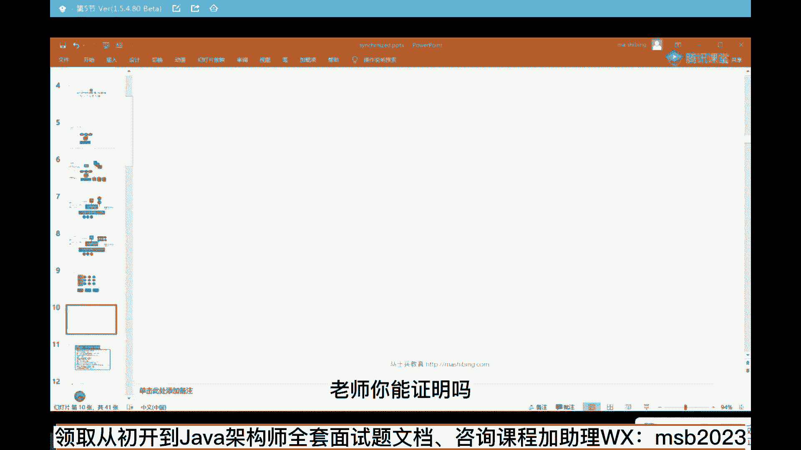

完全可以，凡是不能被证明的理论，那个都不是理论啊。

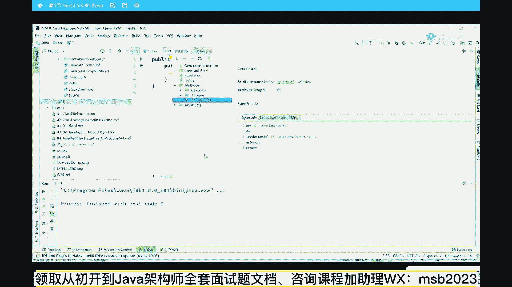

都不是很好的理论，看这里。

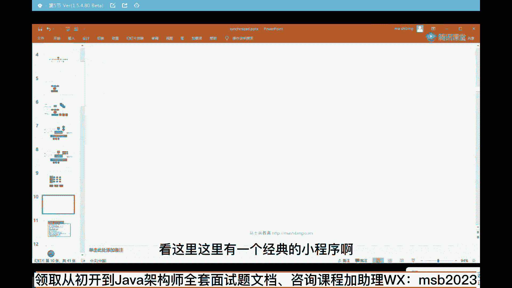

这里有一个经典的小程序，我先跟大家一个小程序，这个小程序不是我发明的，这个小程序是以老外写的，是最早是拿那个c语言写的。

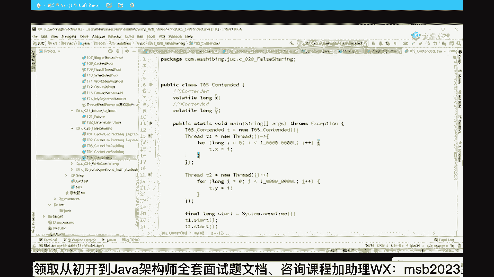

最早是拿c语言写的这个m那个项目里头。

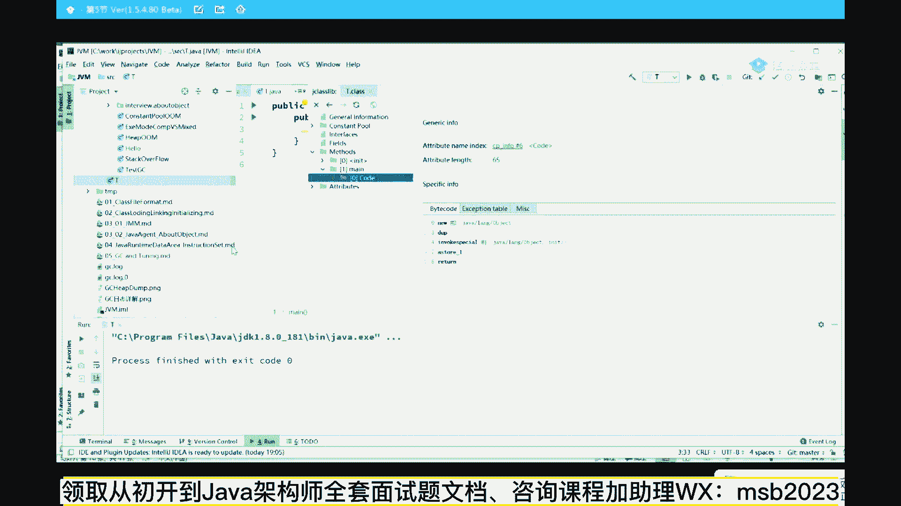

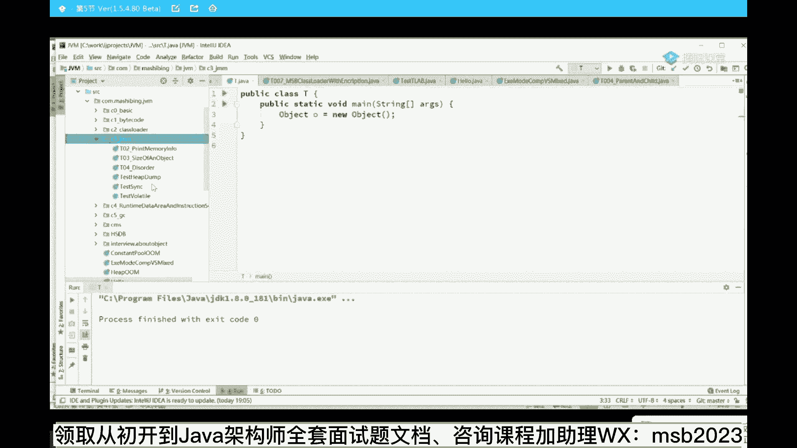

好看这里啊最早是拿c语言写的。

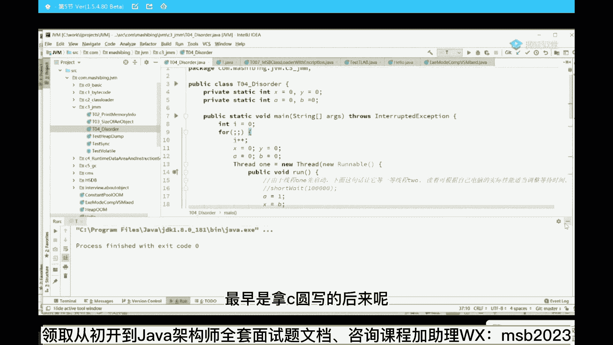

后来呢嗯有人拿java它修改了一下，然后我拿过来给大家做演示而已，我觉得小程序设计的非常的精妙，我再说一遍，下面这个小程序向你证明有乱序存在，如果这里面会牵扯到一点点的逻辑推理，如果这话你听着费劲的话。

你就记住结论就可以了，就是确确实实会有乱序存在，好仔细看这个小程序是怎么证明的呢，他这么来证明有四个值x等于零，y等于零，a等于零，b等零，然后不停的死循环启动两个线程，这是第一个线程，这是第二个线程。

第一个线程干了件什么事，设这个值a等于一，x等于b，第二线程干了一件事，b等于一，y等于a，好证明来了好听证明是怎么来的呢，才这么来的，那个就说我们来推算一下，如果这两个线程放在我们cpu里执行的时候。

最终出现的x和y的结果会是多少，会有可能是多少，我们第一个假设叫不存在重排序，就是不存在乱序，不存在乱序的意思就是a等于一，一并发生在x等b前面，b等于一定发生在y等于a的前面，那么我们来推推算一下。

这四条指令最终执行的结果会是什么样呢，有可能是这种这种组合a等于一，x等于b，接下来b等于一，y等于a来推算一下这种结果的情况下，最终的结果值是多少，x等于零，y等于一，没问题吧，y等于a吗。

a已经等于一了，当然哇，杨琪琪啊，翔啊，这这个杨茜茜同学果然快啊，这带翔的东西太快了。

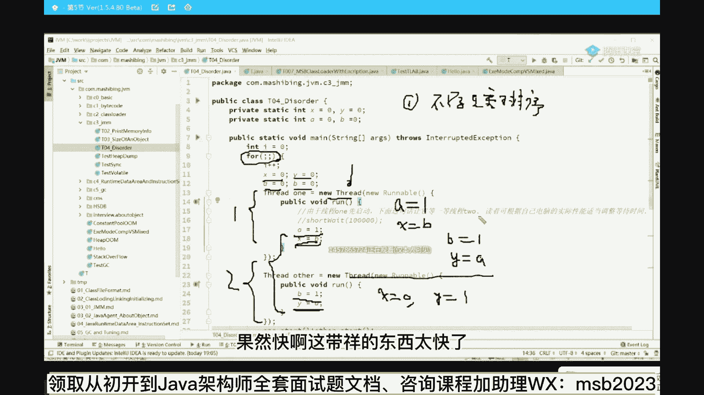

哈哈杨茜茜，对排列组合00011011啊。

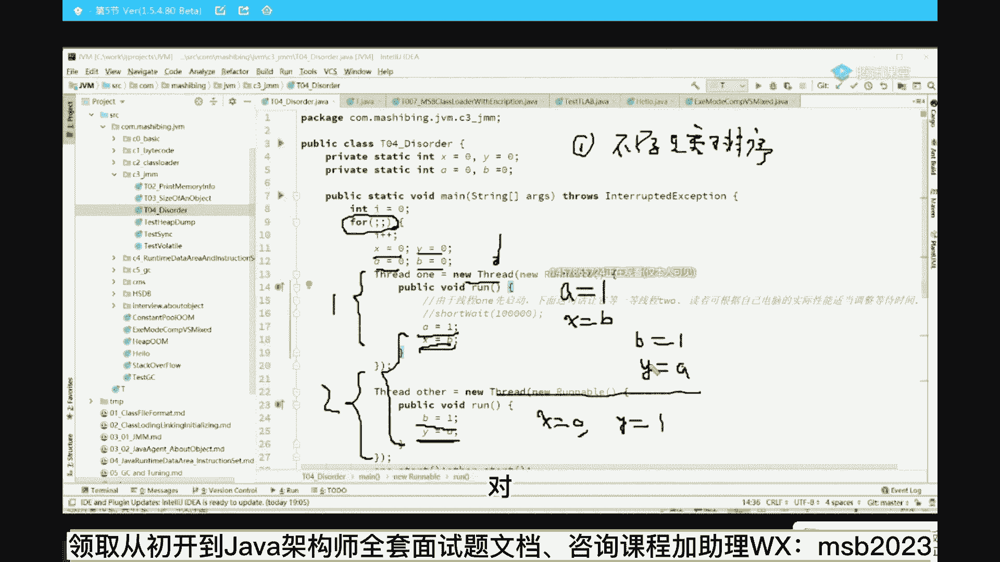

你虽然很快不便秘，但是不好意思，你的结论不对，为什么，因为我们排列组合一下，只要不发生重排序，会是这种情况或者是什么情况呀，a等于一，b等于一，x等于a y等于b啊，x等于b y等于a无所谓啊。

反正这种情况总而言之，x值或是减x等于一，y等于一，当然还有其他的组合情况，还有其他什么组合呢，就是呃b等于一先执行，然后呢就反过来嘛，这哥俩最后你算来算去，会是这么几种组合，011110。

绝对不可能出现x等于零，y等于零，那反过来说啊，我讲到这儿能跟上吗，能跟上同学给老师扣个一，没问题吧，你你只要认真听啊，就这块都是这个推，这个推理呢，差不多就是一个初中高中的一个水平。

当然你实在听着费劲就算了啊，这总而言之，这四条语句你就当成四条指令，这四条语句有可能发生重排序，但是我们假设它不发生，如果不发生的情况呢，绝对不可能出现最终x等于零，y等于零的情况，不可能出现这种情况。

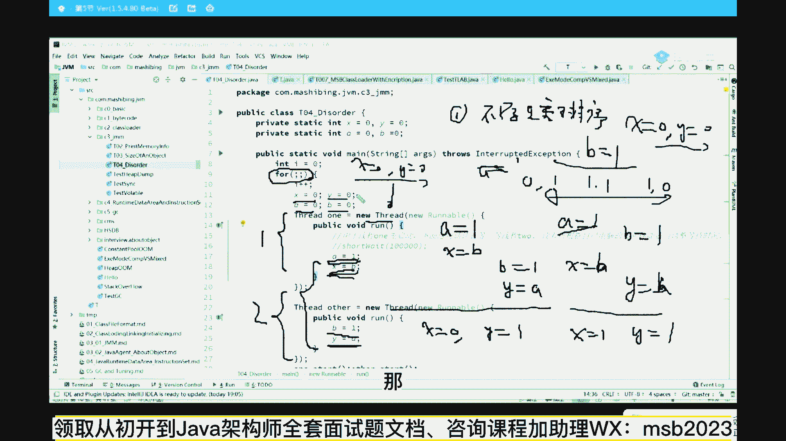

如果出现这种情况了，那只能证明一点，要么x等于b跑a等于一前面去了，要么y等于a跑b等于一前面去了，要么这哥俩都跑前面去了，听懂这意思了吗，那它会出现x等于0y等零吗，跑一下，这个看运气，运气好的话。

分分钟就出现了，运气不好的话，十几分钟才能出现，今天运气不好，这两天水逆，直接给大家看结论吧，就是我原来曾经跑的时候啊，大概我我曾经我截过截过两个图呃，第一次跑的时候，272万次的循环才出现了零零。

第二次呢是11万次的循环就出现零零，所以这个东西呢就得看看看人品了好吧，我们可以放在他这边，先让他等着他执行，一会儿，一会儿你会亲眼看到零和零零的出现，o说一下catch，ok啊，不论如何。

通过这个小程序，你完全可以证明一点，就是确确实实cpu会存在乱序执行，那有同学可能就会说了，老师这乱序执行会有什么问题吗，当然会有问题，以前有好多那个特别面试的时候，特别变态的程序啊。

我在这儿我就不专门给你讲了，主要就是由于乱序执行的存在，今天讲一个比较变态的面试题，这边变态的面试题呢叫呃，d c l要不要加volati呃，这个是超级变态的一道面试题啊，特别恶心。

因为这里面概念特别多，什么叫dc l，你要知道volatile禁止重排序，就是volatile呢可以禁止指令，让他不要给我重新排序，这两条指令我先写的，必须给我先执行，我后写的不可以给不可以跑到前面去。

好吧好仔细听这个过程讲给大家听，诶今天运气这么不好吗，这么长时间了，还没执行出来，放一边吧。

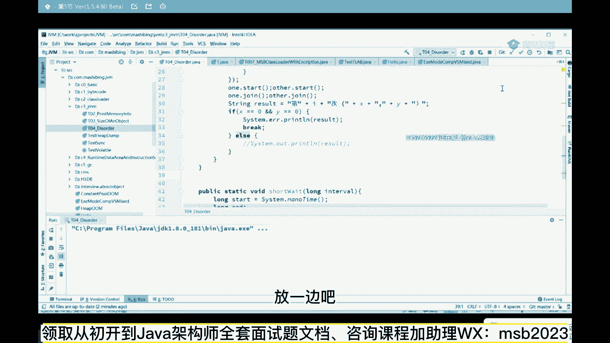

先让他跑着好，一会儿我们就会看到结果啊，不管你好听，这里面有好多好多非常麻烦的概念。

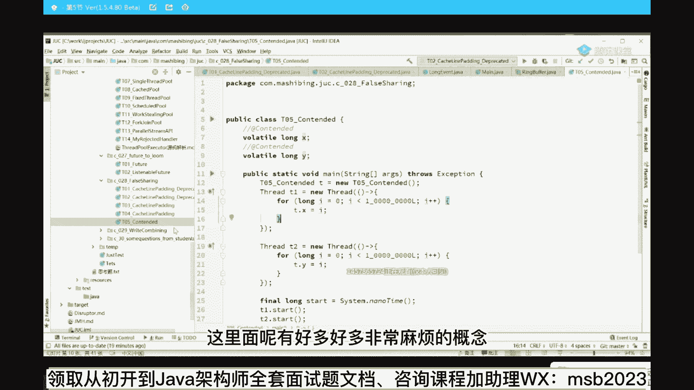

我一点点扣给大家听，什么叫d c l啊，什么叫那个呃volatile是怎么禁止的，为什么要加volatile等等，好看这里。

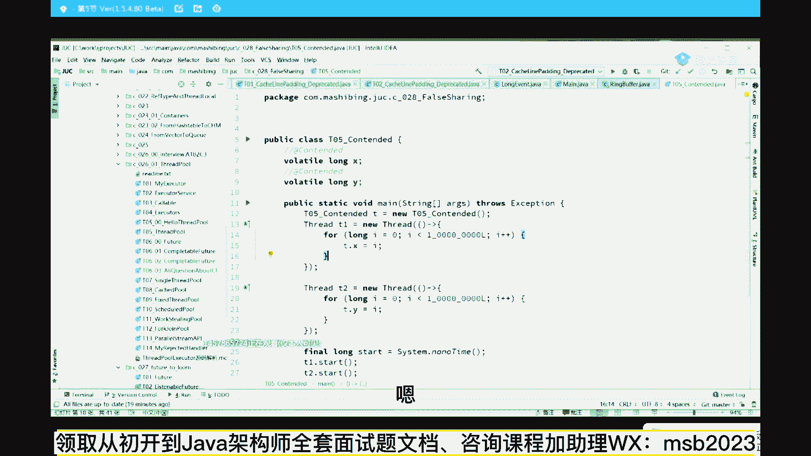

感觉有点多啊，你做好心理准备，不要走神，我先解释什么叫tcl好吧。

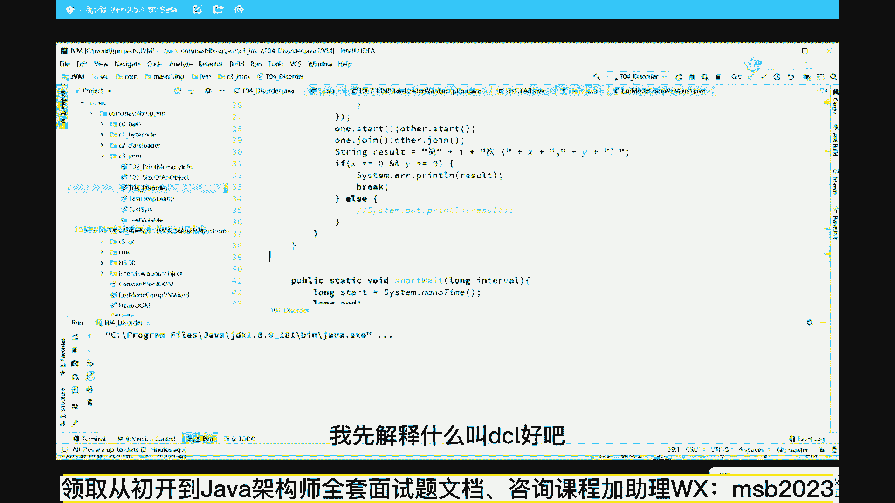

dco呢是双重检查单例哈。

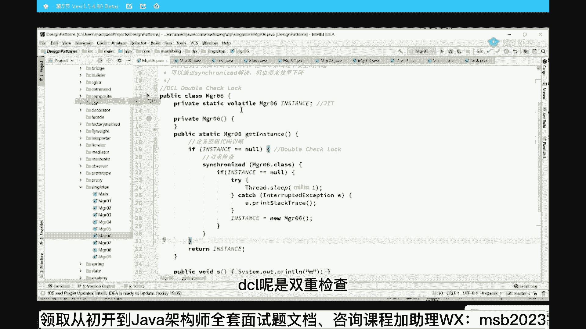

deca double check lock，为了给大家解释清楚。

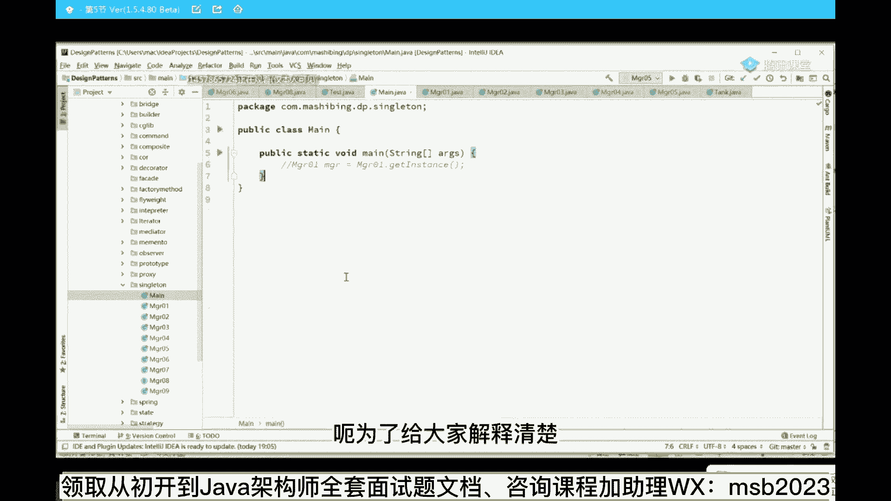

我从那个从最开始开始给大家解释什么叫单例，需要我需要我讲吗，需要我讲的，给老师扣二，什么叫单例，单例也需要什么，各位大哥，你们真的需要加强了，技术太弱了啊，大家看这里单位是啥意思，单例是最简单的解释。

当我有一个class，我不允许他new好多个对象出来，我只能允许他new一个有且只有一个对象，这个叫单例，单例模式，好单例模式是什么一个概念呢，大家看这里单例模式的概念就是诶，你看啊最简单的一个写法。

manager 01定义一个instance，new一个manager对象出来，我上来二话不说，先把它new出来，这是最简单的写法，你不是要一个单例吗，我就把它给弄出来。

然后我把它的构造方法设为private，我不让别人扭，只让我自己，我自己已经扭完了，那么谁来访问我这个对象呢，访问我这个对象的时候，提供一个方法叫get instance，谁要是访问的时候。

麻烦你调我这方法就可以了，我返回的永远都是同一个这个对象，所以不管你调我的方法调多少次，一次两次，最后得出来的结论一定是同一个对象好，这是单例的最简单的写法，来读懂这个小程序的老师扣一。

这个比较相对简单一些对吧，应该都能读懂，这就是单列最简单的写法，但这个单列最简单的写法呢会有人有意见，尤其是我们处女座的人，他们比较龟毛，然后追求完美，他会挑毛病，他会说大哥我还没用到这个单位了。

你干嘛就直接把它给弄出来，你new出来不要消耗资源吗，不要占空间吗，不要占时间吗，能不能等我用到它的时候再给我new，不用到它，你不要给我new，所以就诞生了第二种解法。

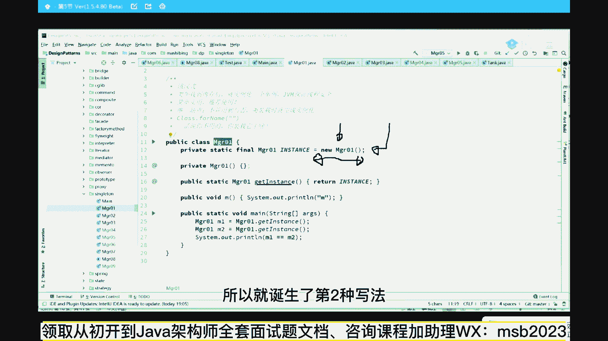

第二种解法什么意思，第二种解法就是就是这样来玩。

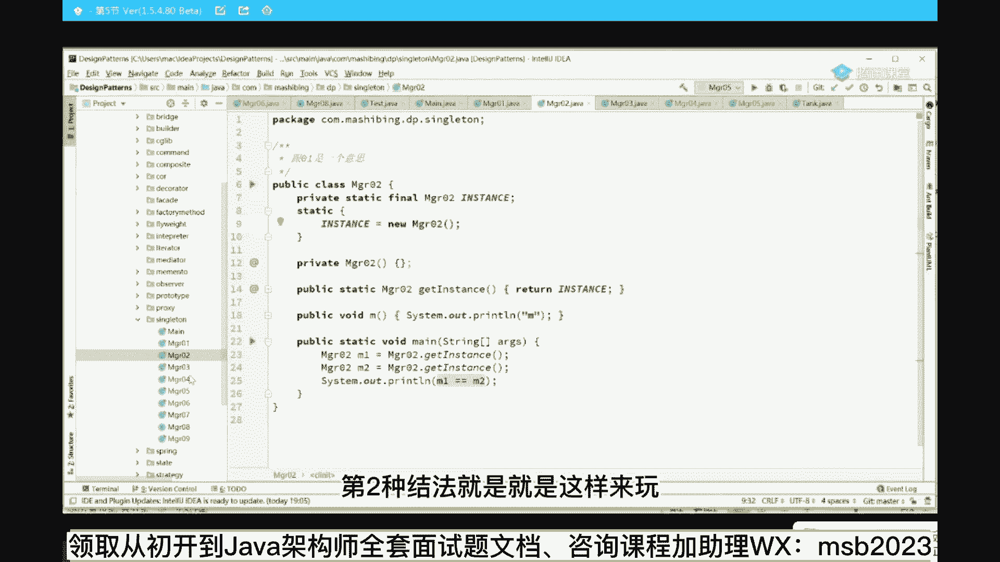

我给它定义这个变量。

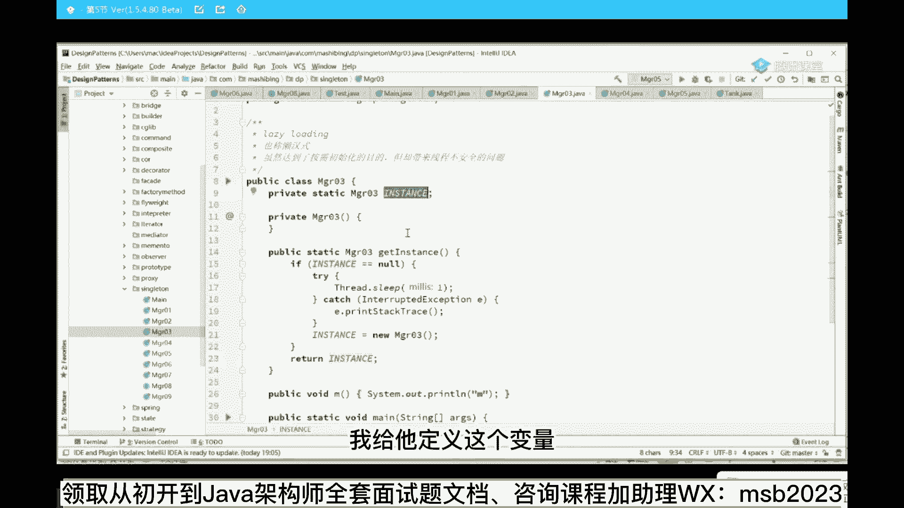

但是我并不把它new出来，什么时候把它new出来呢，谁要是调用我这个get instance方法，我上来先判断哥们儿，你是不是依然为空呢，没有人溜过你啊，如果没有人扭过你的话，我把你弄出来。

如果有人扭过了的话，我直接返回就可以了好了，这种就叫懒汉式的，我特别懒，什么时候用到我了，我才把它弄出来，ok这是懒汉式的，这是第二种写法，这个写法没问题吧，当然这个写法的问题在于在于什么呢。

处女座的人又来了，说哥们儿，你这个不能保证线程多线程的一致性啊对吧，这你能保证一致性吗，不可以，最简单的道理嘛，一个线程一个线程来了，判断你是不是为空，是为空，一个线程先暂停，第二个线程来了。

判断你是不是为空，依然为空，所以第二个线程new了一个出来，第一个线程继续执行的时候又new了第二个出来，因此在多线程访问的情况下，很难保证你拿到的是同一个实例，那怎么保证多线程的抑制性。

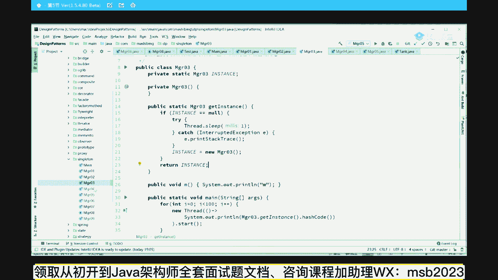

拿大腿想想最简单的办法不就上锁吗，所以我给这个方法上把锁，synchronize，get instance，这个就保证了谁要来访问这个方法的时候，同一个时间段只能有一个线程，那等得等我这个方法执行完了。

另外一个线程才能继续去访问，这个肯定没问题，10000%都没问题，但是处女座的人又来了，他会说哥们儿，你这把锁的力度太粗了，什么叫左右太粗，就是你锁定的是整个方法，如果你这个方法里面有些业务逻辑。

这些代码是完全没有必要，放在我们的被锁的代码里边了，你能不能把锁的力度给它变细，这叫锁的细化。

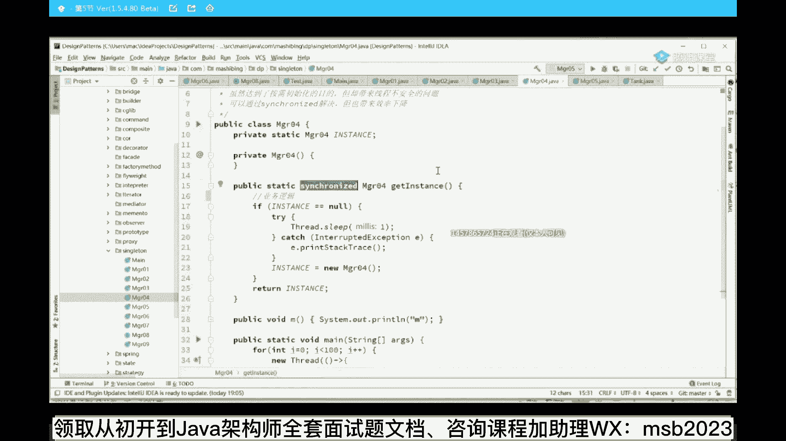

所以就诞生了下面这种写法，我相信大家这块应该能读懂，给大家十秒钟，你读一读这个力度就放弃了，就是我拿到这个数值的时候，get instance，拿拿这个对象的时候，判断它为空，诶，你为空，我在上锁。

我上把锁，接下来我们还new出来，我不在整个方法上锁，你如果你原来有些业务代码没关系。

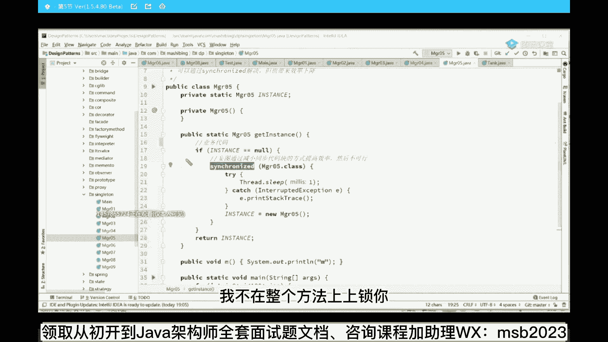

我不给你锁定，ok我想问大家的是。

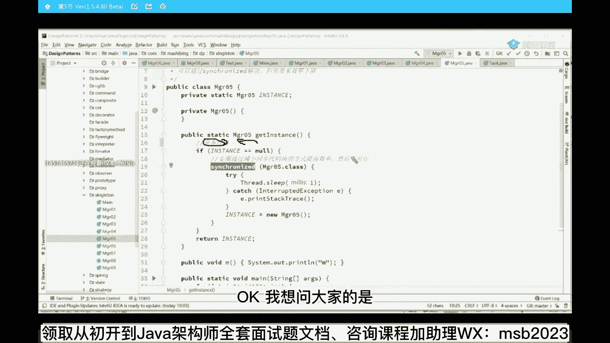

这种方方案能不能解决一致性，可以不可以，我拿到的对象是同一个吗，唉大多数人都知道是不行没错。

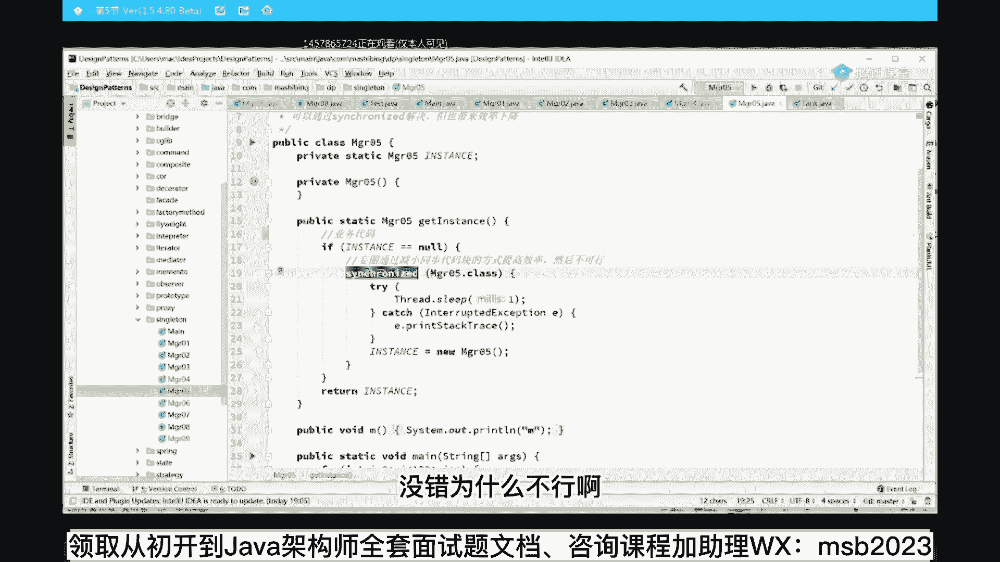

为什么不行啊，想一下嘛，第一个线程来了，判断哥们儿，你是不是依然为空，是为空，第一个线程先暂停，第二线程来了访问哥们儿，你是不是为空啊，是为空，然后第二个线程继续运行，申请这把锁，没有人跟他抢，没问题。

上锁锁住new了一个对象出来，所以这哥们已经new了一个对象出来了，ok没问题，然后释放锁，第二个线程退出，注意它已经初始化了，第一个线程继续往下运行，第一个线程继续申请，这把锁能锁住吗，完全可以。

为什么，第二线程已经释放了呀，完全可以，所以第一个线程继续往下运行，又new了一个对象，因此这哥们儿扭了俩new了两次，最后执行的测试结果也能够证明这一点。

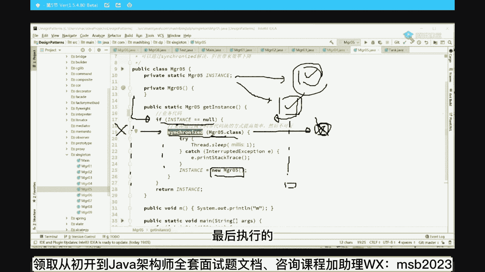

我起了100个线程，每个线程都调用get instance方法。

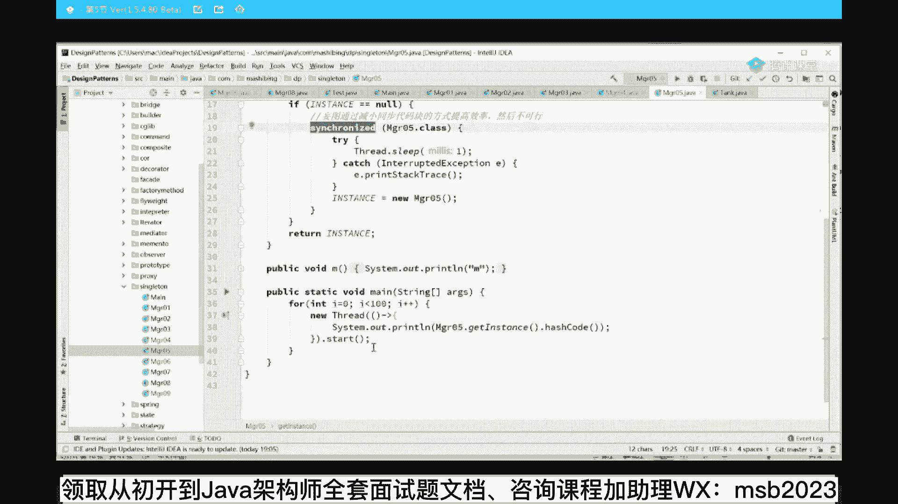

然后把他的hash code值打印出来跑一下。

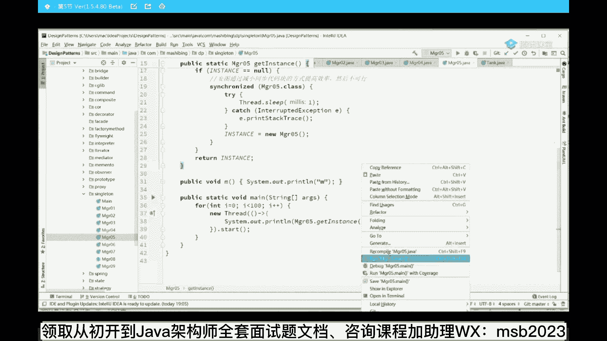

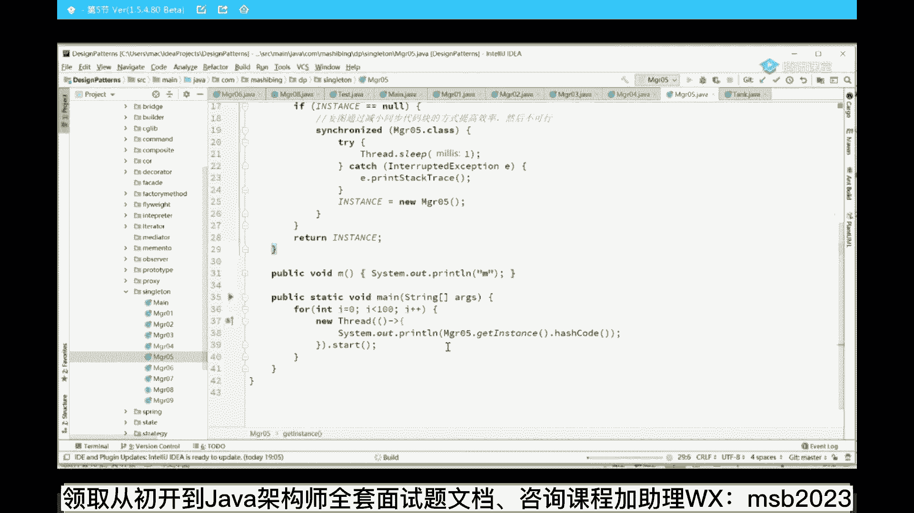

最后你看到它不是一个high code值，肯定不是同一对象。

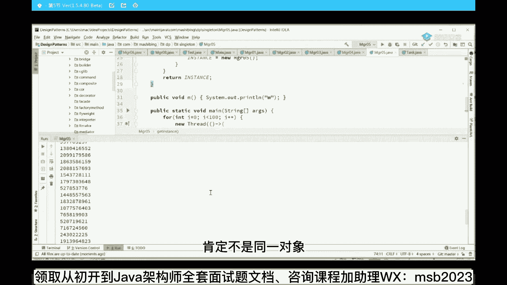

好了，同学们这块能跟上来给老师扣个一，那怎么改进这个代码呢，既要求要的效率要高啊，还是得懒汉式的，还得那个线程安全怎么改进呢。

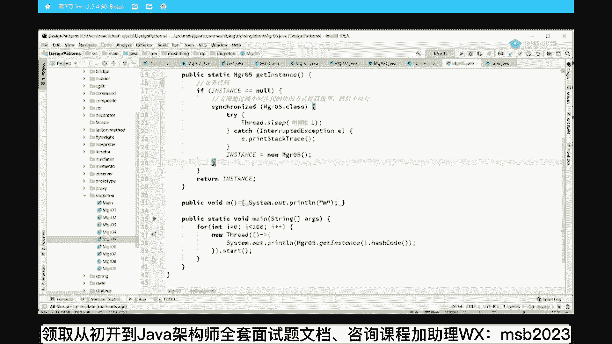

好改进就在于下面这种写法，这种写法听我说啊，这种写法呢就是d c l这种写法，你可以认为它就是一种模式吗，好多好多的呃，这种这种开源软件用到的都是都是这种模式，比cl用的用的挺多的。

这tcl的杠杆是怎么干的，就是我一个线程来了，我判断哥们儿你是不是为空，是为空，我上锁，上完锁之后，我再判断一个底片，哥们儿，你是不是依然为空，如果你依然为空，那么说明我在上锁的这段过程中没有人改过。

你没有第二个线程把你给弄出来好，这样的一个方式是完全能够解决问题的，反复确认你是不是依然为空。

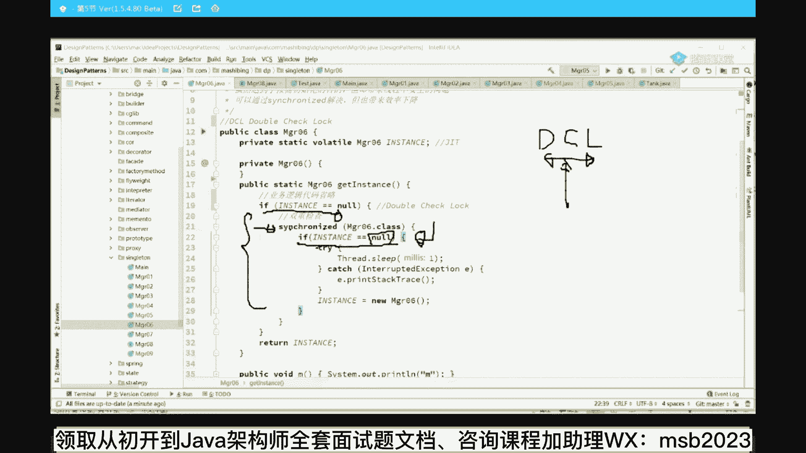

说为什么叫d c l啊，大哥double check lock。

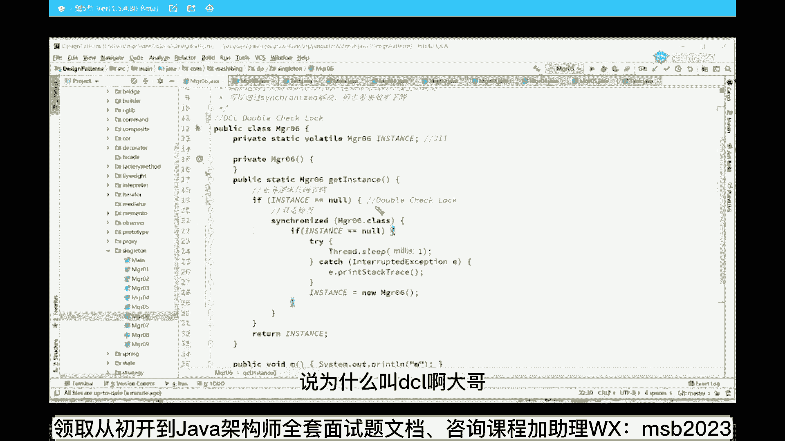

check检查第一重检查，第二重检查两个check，中间加了一个lock，这叫double check lock，叫d c l，就这意思好，这是dcr单例，我相信大家应该能理解。

d c l单例到底是什么意思了，当然关于d cl单例，以前有同学有好多有疑问的地方，说，你干脆就别判断外面这层判断了吗，你不要判断了吗，你直接上锁不就完了吗，你上厕所之后判断它为空。

然后搞定不就可以了吗，来有这样疑问的同学，老师扣个一，有没有，给大家十秒钟思考一下，运用你们的大腿，听我说一句，这东西呢主要是为了提升效率的，你们知道吗，上锁这个操作它是一个非常重量级的操作。

判断这个操作只需要几个纳秒，非常简单的一个操作，现在假设有1万个线程同时来调用这个方法，同学们，你们拿大腿想一下，最终的结果会只有一个线程得到锁，把它给弄出来，如果上来我们就加锁。

剩下的9999个都要参与上锁的过程，效率就低了，但是如果我们在前面加了一重判断，那么剩下的9999个只用判断一次，我加锁的过程就可以省略了，因此效率就高了。

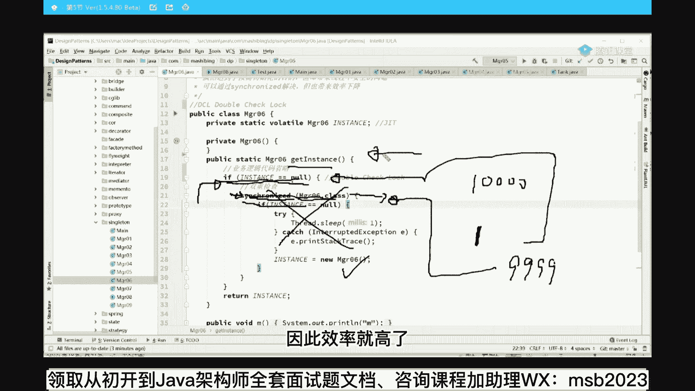

来能get到这一点吗，可以继续，同学老师，可以，好我们继续，但是这道题你只是明白了dcel单列也不行，这道题问题就出在他问你要不要加volatile，要不要在这里加volatile，为什么结论必须要加。

为什么这里边就比较深入一些，你们先得就等着这个答案，我先把代码呢给大家复制一下。

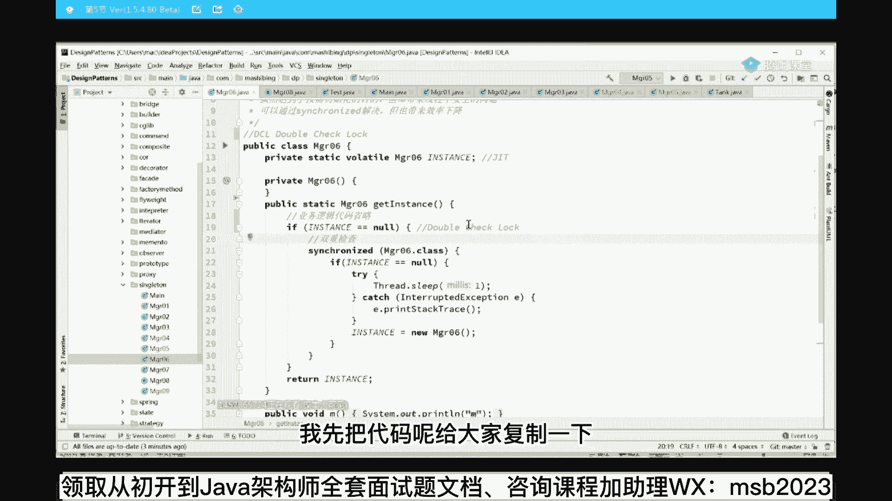

一会儿我们拿这个代码做参考。

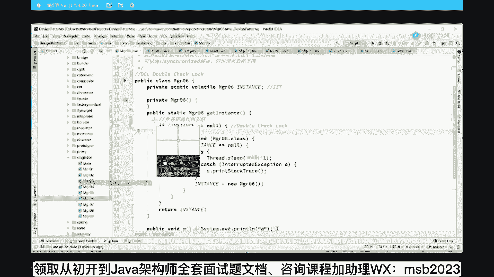

好代码我先放一边，为了讲清楚这个问题，我们还得讲一个比较简单的理论啊。

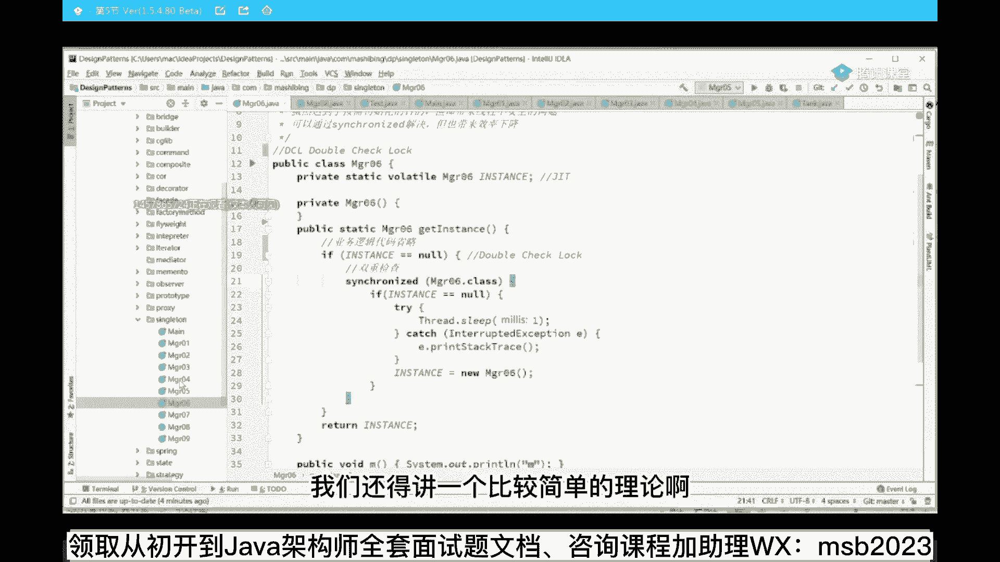

这个小理论非常的简单，讲给大家听就行了。

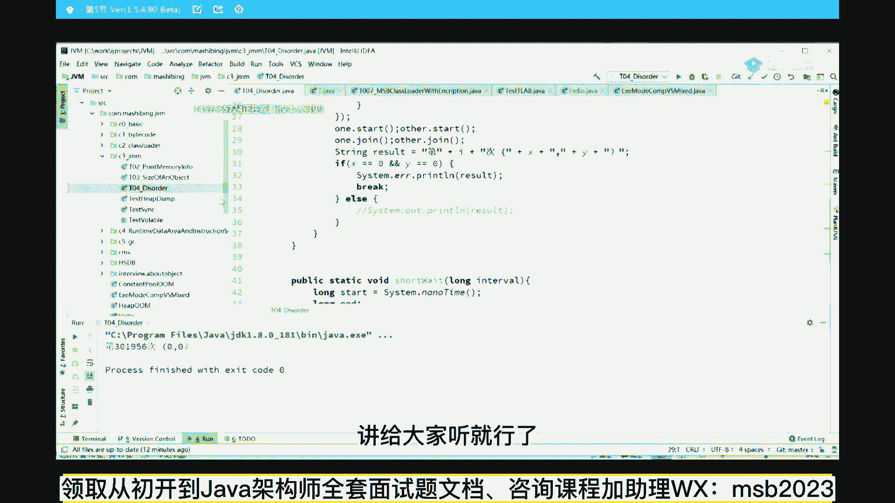

随便写个小程序，就这个小程序啊，来这个诶，同学们看到了吗，第30万次循环的时候出现的00k，所以已经证明了乱序存在了，这个就不多说了。

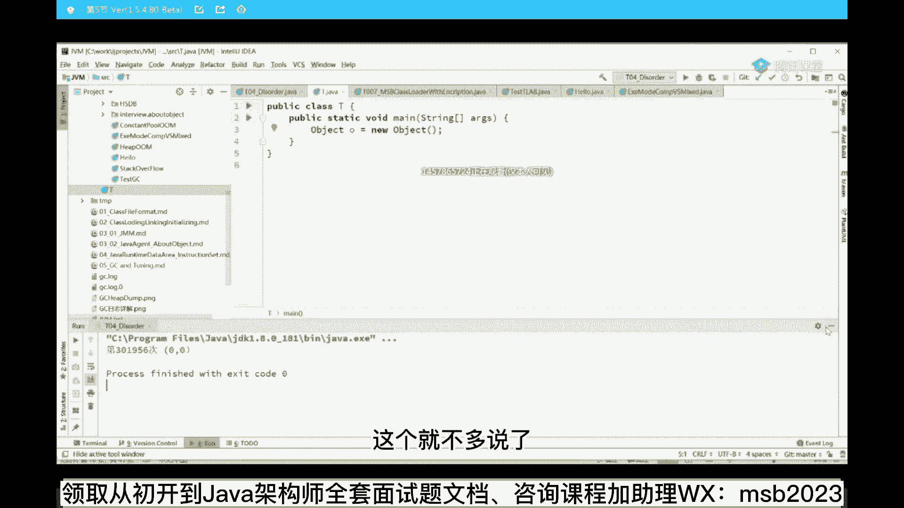

总而言之，你只要让他跑，他肯定能证明往这看，现在呢我写了这样一个非常难的一个小程序，小程序特别难，看看你能不能读懂，ok，好的，看这里，这里面也是一道辩论题，叫做创建一个对象的过程是什么样子的，好听。

当我们new出一个对象来的时候，背后他到底执行了哪些操作呃，为了观察到这个过程，我需要看到它的二进制码，它的字节码by code。

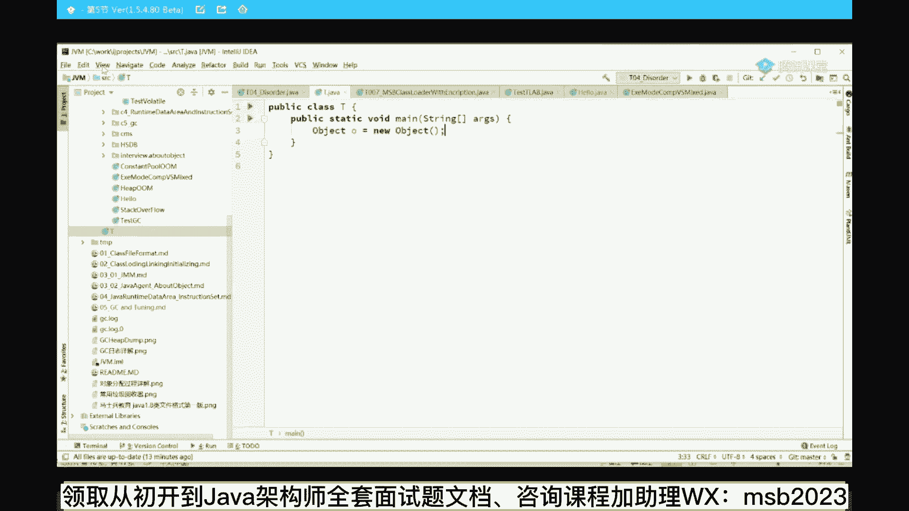

view show by code with the class library，这是一个小插件啊，直接拿来用就行，比较简单，这是main方法。

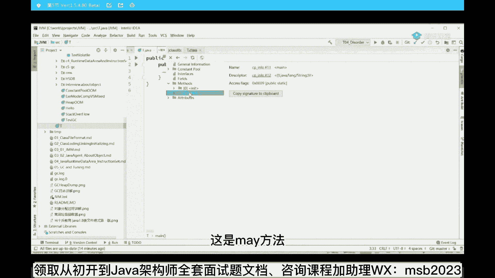

找到我们的方法里面的main方法的一个实现，code好，这是翻译成字节码之后的这么多指令，就是java里面的这些指令，五条new一个对象需要在java内部执行五条指令，这五条这点字体比较小。

我给大家复制到ppt里。

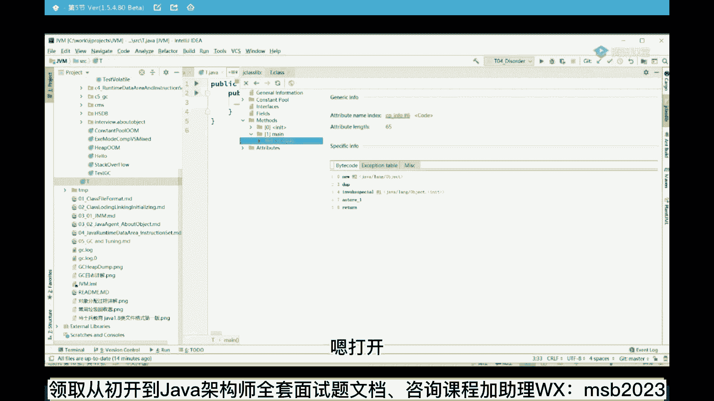

打开，就这五条指令啊。