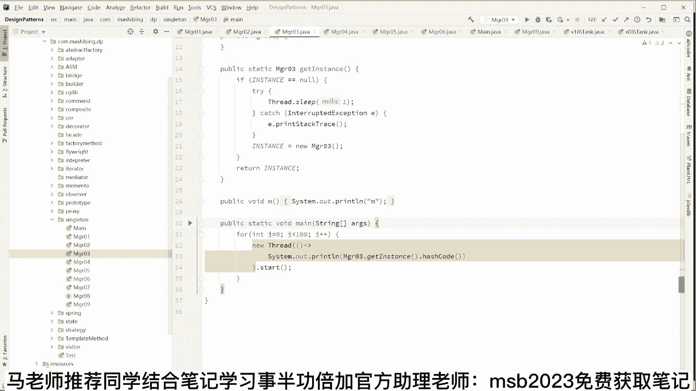
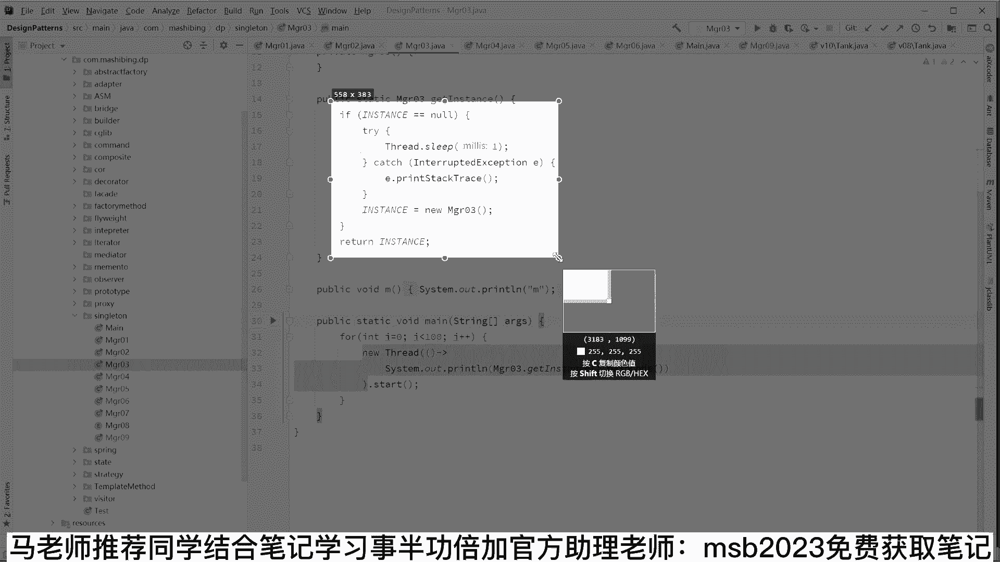
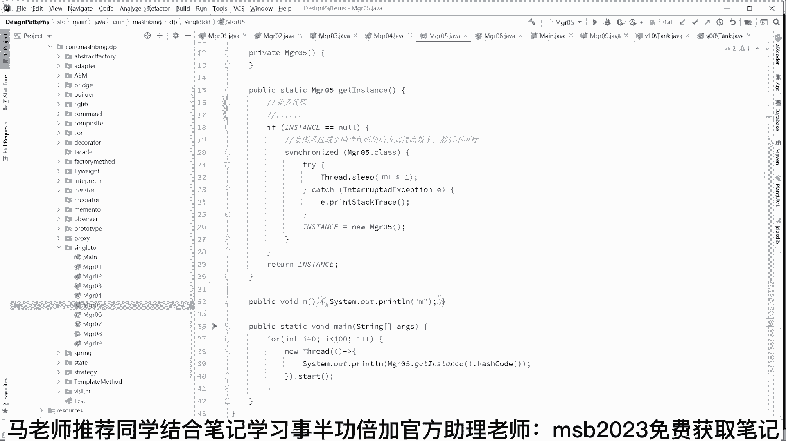
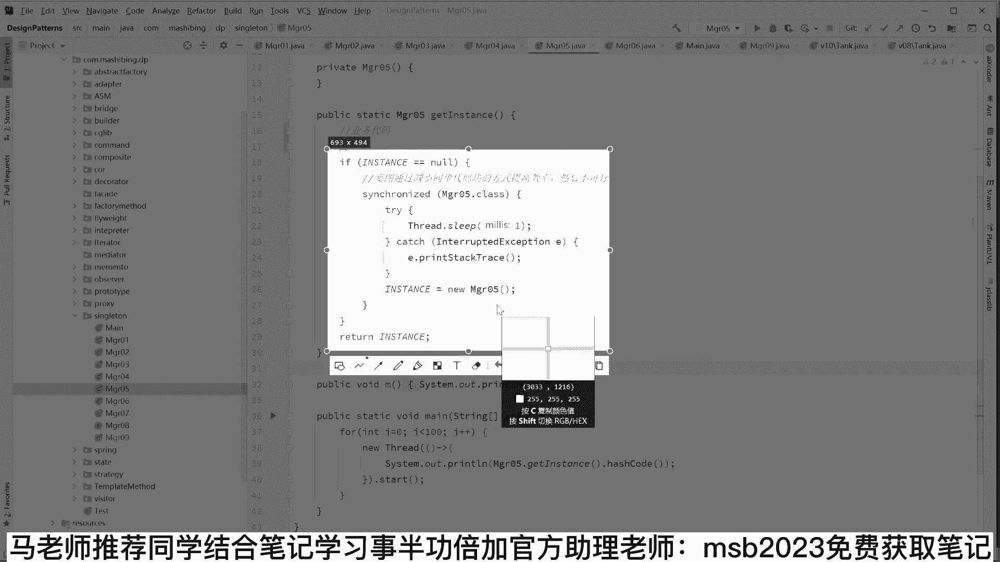
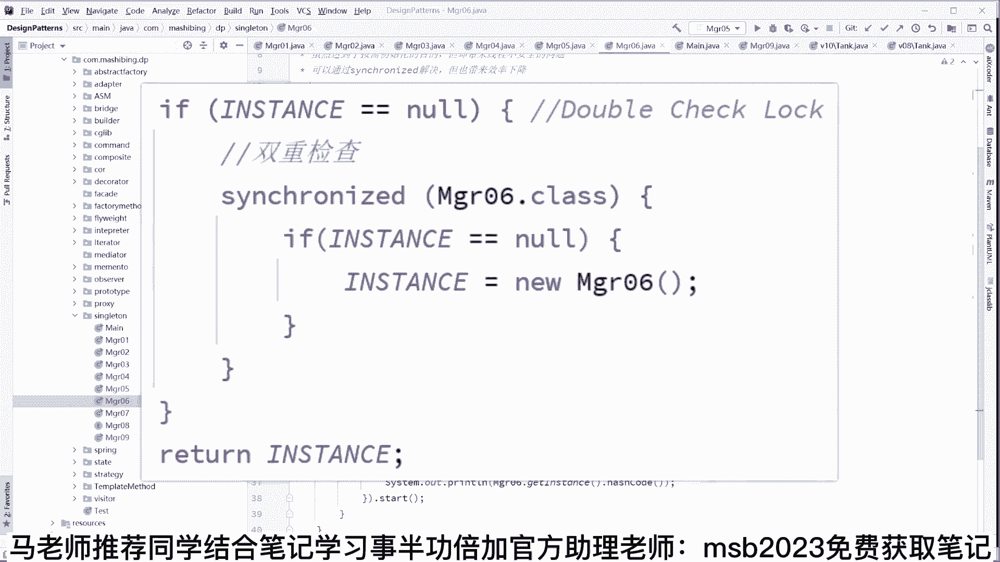

# 系列 6：P28：并发编程底层原理（二） - 马士兵学堂 - BV1RY4y1Q7DL

我让大家看清楚这个东西来画一个图啊，这个也是美团的其中的一道问题，就是构建一个对象的过程，对象的构建过程，好我们来看这个对象的构建过程，具体的class t m等于八，然后呢t小t等于6t啊。

我们怎么把这个t给构建出来，这个汇编码呢，我给大家写在这儿了，这是第一句话，叫new new是什么意思啊，兄弟们很简单，就是t有多大，就在内存里面给他分配多大的一块空间，o不给他放这儿好吧。

就把这个t的大小的空间给它放，大家都知道t里面有一个成员变量小m好注意，当我们把这个东西给它分配出来之后，我就现在问你没有执行后面的时候，这个小m的值等于几，等不等于8=8吗，等于几，这小m值等于几啊。

兄弟们来告诉我一下，末乘车等于零，没错啊，说的很对，就是最开始的那个默认值吗，你不给它赋值的时候，它默认值不就是为零吗，是不是这小m值等于等等于零，好注意执行到这句话的时候，这小m值等于零。

那什么时候这个m值才会变成八，是调用完这句话叫invoke，invoke是调用的意思，special叫特殊调用，调用了哪个方法呢，t initialize，也就是t的构造方法，只有调用完构造方法了。

你才这个值才能确保它变为八，ok好，第三句话叫什么，第三句话叫建立关联，a store，就是这个小t说明一个指针指向了这个对象，建立管理好看，这个动画看这个动画，这里有个小t。

我们现在要new这个对象了，首先分配一块空间，m值变等于几呢，注意m值等于零，接下来什么时候才会变成八呢，执行完这句话，invoke special这个值才会变成八，看懂了吧，那最后这句话是什么。

a store，什么小t和这个对象建立关联，好，我们讲到这儿，讲到这里，大概呢有呃，new一个对象三步构成，第一步分配空间默认值零，第二步调构造方法，附初始值八，第三步建立关联，记住了吧，再说一遍。

首先申请一块空间，复默认值零，接下来调构造方法，赋初始值八，然后建立关联，通过这个指针就可以访问这个对象了，这块听懂的给老师扣一，那这个this指针又是什么东西啊。

this指针就是这个对象里面有一个this，它指向的是谁啊，指向是他自己是吧，大概就这么个意思啊，好认认真真听我说，当你理解了这个过程之后，我们下面再来看看刚才的那个小程序，它的bug点在哪里。

回到刚才这个小程序，著名的类似指针的溢出问题，在这个呃溢出问题里面呢是这么来写的，t03 ，this escape number等于八，构造方法，这是它的构造方法，构造方法里面我启动了一个线程。

new thread，在这个线程里面有执行什么东西啊，打印this number，打印this number，我我我正常的期望值，应该它打印出来是个八，是不是我在我的主线程里面，直接new了一个对象啊。

就可以了，ok大家仔细读，就这么简单，小程序有没有bug，bug在哪里，有没有，上号说零对嗯，为什么有可能会是零啊，兄弟们，这不对呀，我这点number为什么可能会是零，我刚才讲过。

是不是构建一个对象的时候申请一块空间，首先把number值，这个时候值是几啊，兄弟们是零，假如说啊我还没有来得及调用完我的构造方法，注意我们说我们调用完构造方法之后，才能保证它变为八。

我还没有来得及构变这个构造方法给给他，给他那个那个调用完成，但是呢由于我执行了其中的一句话，这个线程已经启动了，线程已经启动了，整个方法构造方法还没结束，既然县城已经启动了。

我这个这个这个number值还没有变成，我期望的这个初始值，我这时候去访问的number，是不是非常有可能读到的是它的结果是零啊，就是读到了一个我们不想让别人看到的那个值，来这块听懂了，老师扣一。

来各位听懂了，老扣一了，就这块没问题吧，这就是说，当我们还没有把这个对象构建完成的时候，我这个this指针啊就已经被其他线程所用了，这个就是所谓的this溢出，好听，我说听我说来这块应该没问题啊。

比较简单啊，有同学说这就3万了吗，没没没没有没有啊，这个离3万还差一些，离三四万的面试还差一些，大家看这里啊，认真听啊，这个呢我们呃就是说this，等于说我对象构建了一半。

但是我这个this已经被被被被另外一个显著，拿去用了是吧，这个肯定是不对的，那么怎么改正这个这个这个东西啊，怎么改正啊，这玩意防不胜防不胜防啊，呃在这儿呢，如果你读过这本书的话。

其实你就应该知道这本书的名字呢叫effective，你知道吧，有同学读过这本书的，给老师扣一，我认识一下effective java有没有读过这本书，很有名，effective java出版了之后。

由于这本书造成的影响特别好，结果后来又出了一系列的effective，这个effective那个effective c加加啊，effective c，effective python有没有不知道啊。

反正出了一系列的，它里面讲的其实很多东西呢也比较简单，就是你编程序写程序的时候一些基本原则，其中有一条规则，其中有一条规则就是注意，不要在构造方法里启动线程，为什么，因为你在构造方法里面启动线程的时候。

有可能会读到初始化了一半的对象，叫半初始化对象，其中有一条原则，我再说一遍，叫不要在构造方法里启动线程，以前有同学不理解为什么，现在是不是能理解了，像这条这条习惯犯错误的人特别多。

尤其是写那些个游戏游戏服务器的，好多游戏服务器就new一个game，其实在在那个game的构造方法里，就直接把现场给启动了，不出错是不出错，一出错你永远也查不着原因是什么，好记住这条规则了吗。

ok下面我们来看一条面试三四万左右的难度的，和这个有关的问题，好吧，也就是美团的第二问，这位兄弟拿下美团这个七连问之后，大概嗯拿了应该是拿到了50万的年薪，呃美团大概。

这个当时问问题的时候就是围绕这句话，围绕这句话就看你的基础到底深不深，围绕这一句话，大概问了七个问题啊，第一个问题是对象的创建过程，这个我已经给大家讲过了，不重复了，第二个问题，这是第二问。

答出这个问题来，唉，基本年薪四五十万了，dcl要不要加volatile这个问题，这个东西我估计好同学，有的同学可能不知道什么是volatile，有同学可能不知道什么是d c l。

这个呢我需要给大家慢慢解释啊，呃同学们听我说这个d c l不懂得它的全称呢，叫double，double check lock，叫双重检查锁，听懂了吧，double check lock叫双重检查锁。

来这个概念，如果你没听过，你给老师一个反馈，你扣个二，我看有多少人没听过的啊，我需需不需要解释一下，嗯基本上每次都得都得解释啊，那个其实这个问题呢，其实要花费的时间还比较长。

大家伙认认真跟跟着我的思路走啊，这里呢需要打开我讲的另外一门课，这门课呢叫做设计模式，设计模式一共有23种，是提升你的设计实力的，一般来讲我们是刚开始那个入行的时候，是做落地啊，别人给我设计好了。

我去把它实现那个呃当我们的能力越强，年龄越来越大，就越应该变成有一定的设计能力，设计模式是最初级的设计能力啊，我再说一遍，设计模式呢是最初级的设计能力，ok，我们在这里的呢一共有23种设计模式。

组合搭配使用，这里呢我给大家讲最简单的一种，这种这种模式叫做单例模式，这个比较难的呢，像telemethod strategy这些observer proxy，这些都比较难，应该说proxy是最难的。

single呢就是我们现在要讲的这个单例是最简单的，单例的这种设计指的是什么东西呢，就是我们需要有一种机制保障某一个类，不管它类名叫什么，它有且只有一个对象，一一般都知道我们构建一个类的时候。

t我们想要它两个对象怎么办，我扭两下new t一个再new一个t又一个，但是我们能不能设计一种机制，在某种情况下呢，我们让这个类啊只有一个对象，不能有多个啊，这种情形呢其实用的比较多。

嗯我相信稍微有点经验的成员里边用，应该是用的都非常的多，他说某一些做配置管理用的类，只需要有一个就够了，举形象点的例子，就是说你作为一个man或者你作为一个woman。

那么你只需要有一个你的husband，或者只需要有一个wife，你不能让他弄好多个，你不能想new多少个多少个，这不行，那么怎么在机制上，怎么在语法上来构建出这个东西来呢。

啊最简单的实现方式大概长这样啊，就是我们有一个类，我们首先呢对这个类进行一个初始化，构建一个对象啊，instance，这就是它的一个有一个对象，构建完了之后，注意我们把这个它的构造方法。

major 01设成private，大家都知道我设成private，就只能我自己用，其他人就用不了了，ok那别人用不了了，别人想用我这个对象怎么办，我给他提供专门一个方法叫get instance。

ok当别人想用的时候，你就调我这个方法就可以了，这样啊在我们的主程序里面，无论你调用多少次，你get instance，你get instance，无论你调用多少次，最后呢我们得到的这两个对象。

其实都是这个对象，都是instance，这大家能看懂吗，就非常简单的实现单例的方式方法，那这块也能看懂的，老师扣一啊，比较简单，这个不难不应该看不懂啊，好你能跟上这件事之后呢，呃就是我们来进一步探讨。

实现单例模式的更好的一些方法，这是最简单的方法，也是最实用的方法，如果没有，如果有人要求你实现单例模式，没有特殊情况下，你就用这种简单安全容易理解，其实越往后越麻烦啊，当然麻烦有它麻烦的一点点好处。

好处就在于效率高，注意看，现在呢大家注意看，我们首先这个单例它是这么来实现，就是不管你有没有用到这个单例，get insense，有没有用到这个对象，我们在这里呢二话不说都把它new出来了。

客人想过一种情况没有，万一我们把它new出来了之后呢，没有人用它，没有人用，你是不是把这个对象弄出来，白白占了一块内存，这个东西吗，那这个事儿不太好是吧，那不太好怎么办好，吹毛求死的成员们就开始追求说。

那我能不能有一种方式啊，我要用到这个对象的时候，我再把它初始化啊，如果没有用它的时候，我就不把它初始化了，这样子可不可以，答案当然是可以，所以就诞生了这种写法，这种写法非常的简单好看，这里我在这里呢。

我构建了一个对象，但是注意看我没有让它初始化啊，我没有把它设成new什么，在什么地方把它弄出来呢，在这里谁要调用我的get instance的时候，也就是要使用我的时候，我判断一下，判断是不是冷空。

那如果等于空，说明没有人把它初始化，接下来我把它初始化，中间，这个sleep是为了在多线程的实验环境之下，让错误展现出来用的，没有什么其他的业务上的意义好，我首先判断判断这哥们如果等于空。

那么就把它扭出来，那如果不等空，我就直接return了，直接你直接你就拿去用了好了，这样的方式看上去比刚才的那种要好一些啊，是吧，咱们要好一些，就是我什么时候用它，什么时候new它什么时候不用呢。

什么时候就不new，那但是这个方式有致命的缺点，这个致命的缺点就在于并发的时候，就在于多线程的时候啊，看这里，现在呢我这里有100个线程，每一个线程都调用了它的get instance。

拿到这个对象之后，打印了他的hash code，就是把它的hash code打印出来，唯一码啊给打印出来，我们跑这看啊，不能说唯一码就是把它的哈哈希码打印出来啊，100个按理说应该是同一个对象。

但是我们往上拉你会发现这都好多类型，468结尾的，三二结尾的，264结尾的，434结尾的，看到了没有，你会发现实际当中我们用了好多个，这可不是单例，这些人好多例了是吧，多例为什么呀，这个能理解吗。

简单解释吧，好不好，避免有同学。

水平太差，同学们，你们想一下啊，现在我们假设有两个线程去访问这段代码，这是第一个线程，然后呢，第一个线程执行到这里，if instance等空啊，判断确实等空，第一个线程暂停还没有来得及往下执行的时候。

sleep了吗，sleep了没有来得及往下执行的时候，第二个线程来了，第二行程判断instance等空等空吗，没问题，还是等空，第二线程继续往下执行，然后new了个对象，注意这时候对象已经new出来了。

放在这放这儿了，第二线程结束好，第一个线程在这个时候继续往下运行，注意他已经判断完了，所以他又new了第二次，来这块能看懂的老师口音，有没有问题，ok所以这个以后我们就用了好多个对象。

当然第二个线程为什么没有sleep大哥，他sleep我只是让大家伙看到的，你这个你问出这个问题来，我只能说明你对于程序的理解到位啊，就是你如果理解程序在cpu里面，就线程的cpu没运行机制的话。

你就要知道中间是有可能随时暂停的，随时暂停啊，我放在这里让暂停时间长一些，只是为了让大家伙更容易看出这个毛病来，好了，我们就讲到这里，上锁，什么叫上锁呀，就是我们写synchronized就可以了。

synchronized的概念是什么东西啊，最简单的理解就是，一定要这个线程执行完整段代码，其他线程才能执行，能看懂吗，就同样一段代码一定是这个线程先执行，完完完成了。

这个线程必须结束了另外一个线程才能开始，所以这就保证了，无论如何，我一定要把它给构建出来了，另外一个行程一开始发现他已经不等空了，ok那就直接拿去用，这样的话只要有一个线程完成就可以了，这个叫上锁。

没有问题吧，就是枷锁对，但是当我们把锁加在整个方法上的时候，我们通常讲呢说这个锁的力度比较大，为什么呢，因为它你可以简单理解为叫锁住的是整个方法，就是一定是整个方法全部执行完，另外一个线程才能执行。

整个方法效率太低了，因为其中有一个有可能有一些单独的业务逻辑，比方说数据库里面读个数据，文件里面读一个数据，就是就是打着输出一些数据，就是打印和和读取，没有没做任何修改。

那你有没有必要把它放在锁定的代码里边儿呢，没有这个必要是吧，同学们，本来呢你咱们说上厕所是吧，上厕所应该是你上完我上，他上第四个人在上，本来就就这么就这么点事儿，结果你非得在前面加好多业务逻辑是吧。

先吃饭睡觉啊，吃饭睡觉是吧，然后上厕所就变成了你吃饭睡觉，上厕所完了才能轮到第二个人吃饭睡觉上厕所，你这个时候的效率就变低了，来各位能听懂吗，这应该没有问题啊。

这专业名词叫critical section，临界区就是临界区越小越好，o就是我一个线一个线程单独执行的，这个代码的量越少越好，效率越高越好，ok那大家理解这件事之后，我们怎么解决这个问题。

其实也非也就非常简单了，我们不要在整个方法上上锁，我们放过那些业务代码啊，放过某些那个不用上锁的业务代码，我们在这里上把锁就可以了，if instance等空，然后上锁，然后new对象，这样子就可以了。

好这个小程序能看懂的，给老师扣一，没问题哈，过不错挺好那好，那这个小程序能不能解决，我们多线程访问之下会出现多个对象的问题呢，能不能实验一下，跑一下你就知道了啊。

看这里又输出了一大堆的hash code，你会发现还是有好多个六四结尾的，三二结尾的，六八结尾的，434结尾的是吧，还剩好多个，这就奇怪了，明明我上了锁了，他最后的结果还是不是我想要的好，我告诉你。

这就是多线程编程的比较难的地方，断轴编程难就难在这里，很多时候县城之间开始互相影响的时候，如果你的逻辑稍微有一点点不对，你认为你上了锁，也有可能你得不到你想要的结果，我看这里，那为什么他会不对呢。

为什么会这样呢，我们看这段代码。

同学问我们仔细读这样的代码，虽然说它上锁了，但是我们依然通过刚才那个方法啊，第一个线程来了，判断等空，第一个线程暂停，第二线程来了，判断等空没问题，也是也是等于空啊，第二个线程呢上锁申请上锁锁的问题。

明天我给你详细讲锁的问题叫做原子性啊，那当你理解了这件事之后，上锁上锁成功了，没问题吧，然后呢new了一个对象出来好了，这时候第二第二个线程啊，new了个对象出来，new完了之后呢，第二个线程结束。

注意线程已经new出来了，对象已经new出来了，那第一个线程是暂停在这个位置了，那第一个线程继续申请上锁，能不能成功，可以，为什么第二个线程已经把锁释放了呀，第二线程已经结束了呀，上锁成功哎。

又new了一个对象，这样的我们就溜出来俩，这里就是在代码不对的地方，你会发现呢，为什么不对，其实主要就是指的是我判断完等空之后啊，我在申请上锁的这个过程之中，还没有上锁成功。

其他有的线程已经把它给弄出来了，所以我们要改正这一点呃，所里面在做非空调验，没错是说的非常对，这就是我们最终的代码，大家应该都能理解了啊，这次就对了，没错啊，这种写法就没问题了。

这就是我们啊最终的这个写法，这个写法就没问题了，就是我们首先检查它是不是冷空，如果等空上锁，上完锁再判断一遍，说我在上锁的过程中有没有被其他人改掉，再判断一遍，你是不是依然为空啊，如果依然为空。

把你丢出来啊，那么通过这个呢，我们再来把这个刚才逻辑的跑一遍，一个线程来了，判断等空没问题，暂停第二线程来了，判断等空没问题啊，第二个线程继续往下执行，上锁成功，依然为空，new了对象new出来了。

好第二线程结束好，第一个线程继续往下运行，上锁成功，又进行了一次判断，是不是等空，注意已经扭完了，不等空了，你就不会再用，第二下直接拿来用，o这个东西就是外面一层检查，里面一层检查，中间夹了一把锁。

所以叫双重检查锁，叫double check lock，好这个技巧在各个开源软件里面广泛运用，麻烦你好好掌握，多多的掌握，来这块能听懂的d c l的概念我就解释清楚了。

double check lock，能听懂的老师可以啊，但是关于double check lock，double check lock，听我说它里面的问题还挺多的，其中最常见的一个问题是这样的。

第一个问题是这样的啊，有两个最常见的问题，第一个问题是这样的，比较简单，就是我外面这层检查为什么需要，我明明是可以不需要的，反正我都要上锁检查，我先上锁，然后再检查不就搞定了吗。

我外面那层检查为什么需要分析一下啊，其实我是外面那层检查是不需要的，为什么为什么要外面要写成检查，从业务业务逻辑上讲，我只要上锁，然后检查它等空，反正这段代码只有一个线程，为什么要。

提升并发言说嗯说的很对啊，沙华说性能对，说的很对啊，减少加速次数，yeah that，说很多的啊，细粒度使用跟那个没关系啊，减少竞争线程，省省队员对，说的很对啊，就是我们来思考一下。

如果说外面这层检查没有没有就意味着什么呀，比如说现在有1万个线程过来，我这种智能代码，注意1万个线程要上1万次，所要上1万次，上锁解锁是很耗资源的过程，是效率不高的过程，能省则省，尽量的不要上那么多锁。

听听懂了吗，那如果有这层外层检查呢，如果有一个线程，如果有一个线程已经是把这个对象new出来了，我们只要做一次判断，就省了一次上锁的过程是吧，同学们就不用上锁了，避免了不必要的枷锁，效率大大提升。

你要愿意，你们可以试试啊，你执行个11次，你看看他要多长时间，如果你外面这层检查没有的话，执行11次，看了多长时间是吧，如果说外面可以有的话，你看多长时间，你会发现效率上的明显区别之后就不展开了。

来这块听懂了，给老师扣一，这是第一个问题，但是关键是第二个问题，关键是第二个问题，这第二个问题才是要命的，这第二个问题是说就是一段这么简单的代码，居然还有隐含的bug，ok那这个bug就是美团的第二问。

这就是美团第二问d cl要不要加volatile，什么意思，我们首先分析啊这里面的bug到底是什么，分析这个bug，分析bug之前，我们先复习一下一个对象的创建过程啊，分析一下。

因为这个第一问和第二问是呃，强烈关联在一起的，呃，我们说第一问呢，就是说这个对象的创建对象创建的话呢，首先是吧，然后申请一块空间里面那个值呢所默认值为零，调构造方法得到初始值为八建立关联。

所以它由三部构成，new invoke和a store，注意这三步啊。