# 系列 6：P30：并发编程底层原理（四） - 马士兵学堂 - BV1RY4y1Q7DL

呃对于课程有疑问，要下面我们回到技术继续来聊，怎么样才能解决乱序的问题，ok下面这段还比较难啊，你认真听，来准备好的同学给老师扣一，下面这段还比较难，认真听，好听我说听我说。

嗯我在这里给大家简单画图讲解，仔细听，就是同学们你们认真想啊，说我们现在的多线程的情况下，引起问题的麻烦的原因，其实原因就在于这两条指令呢，你不能够控制它换顺序，或者说你不允许他换顺序，能不能做到呃。

我们先讲最底层的，去限制两条语句换顺序的这个逻辑好吧，我们先讲最底层逻辑，它跟语言无关，在这呢你忘了各种语言，不管你是学够学java，学学c，学c加底层的呢，它都是一样的，掌握底层就掌握一切啊。

仔细听就是同学们，你们想一下，这里来了两条语句，这是第一条，这是第二条，我如果想阻止这哥俩换顺序，你该怎么办，从底层上讲，就好像说我们排队去买咖啡，我我我必须阻止，说这哥们儿呢插队插到前面去。

怎么阻止他，就是我把这两条语句之间，或者两个人之间给它射度强，能听懂吗，就是我把这个这个已经执行完了，我这堵墙我才放开，我再把这墙拆了，再让再让第二个人过来，这样他就永远换不了顺序。

所以呢所以呢实际上是在这里啊，兄弟们，这两条语句如果想从底层来讲，不想让他换顺序怎么办呢，我们在它中间插一个插一条特殊语句，他也是一种语句，这种特殊语句呢起到一个一个强的作用。

好这种语句呢一般我们称之为叫屏障，叫内存屏障来这块能听明白的，给老师扣个一，建个墙，对，不是阻塞沙皇加锁，我勒个去，你为了换两条语句，你可以加个锁，你累不累啊，而且加锁。

你能你能限制得了他这个语句的顺序吗，你每条语句都加个锁啊，你想啥呢，那那那程序你还怎么执行，是屏障指令，一般呢它是称为叫屏障指令，这个屏障指令呢比较特殊啊，这第一句话，这是第二句话。

我不想让这样换顺序怎么办，加一个屏障指令，屏障的一般我称之为叫barrier是吧，嗯或者叫fans fans呃，篱笆barrier啊，篱笆大概都都就是这个意思，屏障好，这个屏障指令呢请大家记住不同的。

不同的cpu有自己不同的屏障指令，我们是没有办法给他统一的，ok这个屏障指令呢，呃你在如果你涉及到了不同的这种这种这种cpu，不同的硬件，你会做，你会看到它屏障指令不一样。

你比方说像那个英特尔的air fans，load fans读屏障，这个m fans写屏障是吧，modify修改，还有s fans，对不起，这个应该是全屏障啊，fence是save，是修改的意思等等。

反正我忘了啊，就具体的指令也就意味着当我们cpu执行的时候，执行的，只要看到这种凭证指令的时候，他就前后两句话就不让他换水去了，来各位能听明白的，给老师扣一，这是底层的逻辑，这是底层的逻辑啊。

啊这会大概能听懂，那老头还能还能跟上吗，这个难度还能往上加一点点吗，能跟上，我就在难度里稍微加一点点，每次讲到后半截，我我争取给大家解释清楚，因为我觉得我讲的东西啊，它再难，老师还是能给你解释清楚的啊。

呃只要你认真跟上就可以，除非你基础贼差贼差，那就有点够呛啊，仔细听，那么这是底层，我们说不同的cpu有不同的解决方案啊，这是底层，ok好，下面我们来再往上挪一层，这层是这一层是哪的，这一层是jvm。

就是虚拟机，这层java虚拟机，那在java虚拟机这层里面呢，虚拟机啊就是一台虚拟的机器，一台虚拟的机器也有它自己的指令，这个我相信大家都能知道你你实际当中的机器，实际当中cpu有自己的指令。

那么虚拟的机器呢也有它自己的质量，当然当我们得到这种指令的时候，需要翻译成为下面不同的指令，才能具体在具体的硬件上运行，那虚拟机里面的这种屏障指令是什么呢，注意啊，这个并没有一个cpu支持啊。

听我说目前没有cpu支持，因为它是虚拟的，是软软的模拟出来的啊，那jvm要求的虚拟的，你你谁要是给我写一个jvm软件，你必须给我实现这种指令要求的，虚拟的指令长什么样呢，在jm虚拟指令里面呢。

大概有四条指令好，后面的呢你就能听多少是多少了，因为呢这个大厂也就连大厂都很少考的东西了，目前为止只有一个同学去面那个阿里国际，一共面了七次面试，阿里面七面面进去才考到了这种深度啊。

所以呢你就大体理解理解到什么程度算什么，算什么程度就行了，好吧，我只是讲给你听啊，能听懂就听，听不懂就算了，就是jvm级别的屏障啊，大概是长这样，跟happen before没有半毛钱关系啊。

目前还没有关系，jvm的屏障大概长这样，注意看，它有四条屏障指令构成，这四条呢叫load load store，store，load store和store，load叫load load，load。

store，store，load和store store，其实就这么简单啊，几个的排列组合而已，有同学说了，老师我想这太难了，一分钟给你解释清楚啊，老师只用一分钟时间解释这四条指令非常简单，对一个数据。

如果你前面有一条读指令，下面这条也是读指令，你不想让这俩换顺序，中间加一个load load，这哥俩就换不了了，听听明白了吗，好剩下的还需要我解释吗，想一下下面这些还需不需要我解释，来听懂的给老师扣一。

啊不用一分钟是吧，搞定那store store指的什么，解释一下吧，你看看大家伙，那个那个是不是学到了上面一条store，下面一条是store，如果中间不想让这俩换顺序怎么办，store store。

ok就这么简单，那好了，这是我们的jvm级别，那我们再上升一层，刚才呢我们解释了最底层，解释了jvm这一层，我们再上升一层，上升到我们源码这层，java这层。

因为java编译完了class交给jvm执行，jvm再翻译成为本地的是吧，大概是这么一个执行过程吗，好，我们来了解java这一层是怎么样，不让语句换顺序的，好java层不让语句换顺序是怎么做到的呢。

很简单，加一个volatile就可以了，ok，从语句上来说，大概就长这样啊，你找找一下语句吧，看这里，如果你你不想让他换顺序，刚才不是由于换顺序，构建过程之中的顺序调换引起的，是不是。

因为他这个换顺序引起的各种各样的麻烦事，你不想让他换怎么办，好对这个变量做一个修饰符，写volatile搞定，好了，这就是解决方案，可是有同学啊，如果你进行认真思考的话，如果你认认真真思考这件事啊。

还还在吗，兄弟们还还在跟着我的思路走吗，还在的给老师扣一啊，越到晚上的时候，你越得越得给我点反馈啊，可是你认真思考这件事的时候，这件事很吊诡，吊轨的点在于什么地方啊，吊轨的点是instance是个变量。

你只是给它加了个形容词，你可以这么加了个修饰符嘛，就加了个形容词，这个变量是一个volatile的，就是就是这么一件事儿，居然阻止了对它构建的时候，以及其他方方面面的时候的这种顺序，这不是很吊诡吗。

而且这个volt还可以修饰简单变量，你说修饰简单变量他都没有构建这个过程，你怎么阻止对这个变量的访问，前后不能换顺序，这事儿是怎么完成的是吧，同学们，所以这里头中间还差了一个环节。

就是当我在java源码里面写了volatile，它翻译成为jvm的时候，jvm的class代码的时候是翻译成为什么样子的，好各位同学认真听他翻译过来，大概长这样，这块呢能听懂就听，听不懂就算了。

没有什么关系啊，关系并不大，应该说好吧，使劲儿听就行了，大概是长这样的，就是当我们用volatile去修饰一个变量的时候，那么对于这个变量的任何的写操作。

前面都会加一个store store store store意味着什么，写这个变量先写完，我在写，后面对于这个变量再加一个store load，我写完别人才能读，这就是对于修饰变量的时候。

对于修只要是任何只要是volatile修饰的变量，那么对于这个变量的任何的写操作，前面有屏障，后面有屏障，别人写完我再写，我写完别人再读，你不能随随便便的给我改顺序，对于这个变量的任何的读操作。

我读完别人才能读，我读完别人才能写，好了，这个图呢能记住就记住，记不住就算了啊，基本没人考，好吧，就到这ok，呃这样的话呢，我就从那个底层，java层加volatile，volatile翻译做的变量。

在我们jvm这层会给我们自动的加屏障，而这些屏障只是一个虚拟的屏障，这些屏障最终会被我们翻译成为底层的屏障啊，这些屏障呢才是真正的具体的实现好了，这块能跟上，能听懂的，给老师扣一。

其实嗯还有一些更深入的博克就不这么深了啊，没有这个必要了，好吧好，讲到这里的时候呢，呃你翻回头来再来看美团的题。

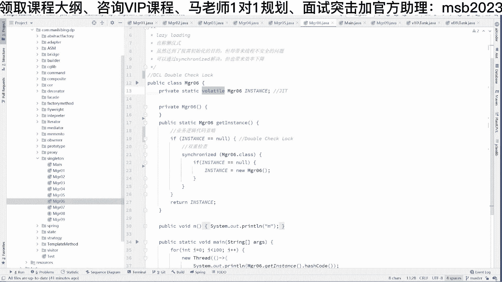

你就会觉得比较透彻啊，清晰明了很透彻，一夜就具备了去拿一个50万年薪的想法了，至少，好同学们嗯，我大概的内容呢，我基础上的内容，今天我就讲到这儿，笔记里面我做了详细的记录，关于笔记的内容呢。

同时呢我也对我们课程的这种达到的效果，我相信课程的深度你应该能理解了啊，基本上都是这种深度，这也是就这种深度，再加上我们老师呢是为学员们一对一的定制，学习路线，因为有的人掌握了a没掌握b掌握b了。

没掌握c，有的人快速要进行业，有的人呢是要快速的涨薪，有的人呢是快速要回到行业，其实每个人的追求的内容是不一样的，所以呢我们做到内容全非常全的，同时200多门课啊。

我们整个mc呢是提供了目前是200多门课。

mc目前提供200多门课。

从第一节开始，我们大概提供了是200 229吗，我记得是啊，大大小小229门课程，涵盖了绝大多数程序员所需要的所有所有内容，然后呢在我们老师的指导和定制之下，可以进行一个优先先学哪部分，其次再选哪部分。

然后再选哪部分，我们进入到行业或者转完新。

接下来进行系统化学习这么一个过程，来各位听懂的给老师扣个一啊，c加加做内存屏障，c加做内存屏障，使用汇编语言做的啊，这如果要是感兴趣的话呢，明天我给大家可以打开来看看，其实我们也是能读到的嗯。

这个达到的效果呢，大概在我们这个公开性的网页里，这里的网页里，你看到的所有的内容都是不给你p，非常真实的信息，除了隐藏了一些隐私数据之外，其他的全都是非常真实的数据，我目前我有学员呢。

这里头给大家展示出来的1500位学员，这里是1500位学员的数据，兄弟们，这些数据呢到目前为止三个月左右，基本就达到效果，达到效果呢当然跟自己的追求不一样。

它达到效果就不一样，有的是拿到offer 3个月，有的是涨薪水8000，涨15000。

有的是呃原来的年薪33万，然后呢到达了年薪40万，而且呢这个还是在咱们近期不好找工作的前，提之下啊，嗯最终也是按年薪40万算13个啊。

名义上那么多，实际也是惨淡断嗯，涨了20%吧，呃有的是大龄的乘以二，这个呢也是我们的一个特色，好多大龄都搞不定的，咱们这儿搞定了一大堆。

总之呢就是那会儿我我我创建这家公司，做这些课，其实呢一个核心的想法是，让程序员的生活过得更美好一点，没有入行的能方便他入行，入行的多赚点钱，年龄大的我教他怎么样去进行养老，怎么样去进行这种更长远的。

能做到退休的这样的规划啊。

方方面面吧，这是ood的嗯，找几个薪水略高一些的，这是秋招，多数达成最终入职压力了啊，年年报是47万，算签字费，这是很嗯非常就是最近的数据啊，短期的是吧，这是咱们的一个大龄的女同学。

这个大连的女同学是从50万涨到了75万，这事呢给他内部建议的一个过程，呃其实我就这么跟你讲，为什么建议大家伙要报名马老师的课，如果说这个课程只给你提供了一些硬件的东西，教你a b c d e啊。

教你一些应用知识，那我觉得这个课程的有有有价值，但价值没有那么高，我觉得我们还有很重要的一个价值，是帮大家梳理好整个职业生涯，就是有的时候你遇见难题之后，你可能自己不知道，不知道该怎么解决的。

你过来找咱们比较有见的老师来聊一聊，你就会发现李老师过去从山顶上下来的经验，一两句话，可能能让你就像这种的年薪涨了25万，这是一个什么概念。

每年涨25万，在以后的20年里，每年25万凭空多出来500万，把牛逼两字给我打出来好吗，这种案例不在少数啊，不是少数好吧，这个嗯，我们呃近期2月份的报名活动。

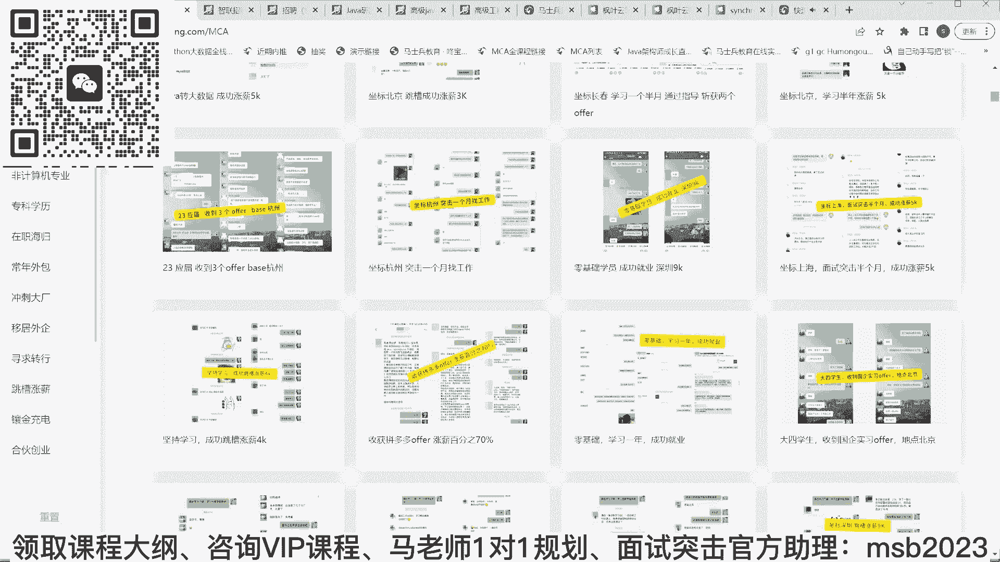

也就很快截止，就是今天是26号了嗯，今天是26号，对26号，27号，28号我们就截止了，我们在整个活动期间，2月22号到28号结束，我们进行了学费的补贴，然后报名的同学降了价，作为完整的一门课。

马老师这里提供了一系列的老师来为大家服务，这个应该也是大手笔了，就是有很多很多的机构讲一门课，其实就那么几位啊，两三位老师已经讲完了，但是我认为呢一是我们讲得非常的全，在所有机构里是最全的。

大概是排名第二的机构的课程内容的十倍十倍，兄弟们，这不是闹着玩儿的，我们价格比其他人最贵的，也就比他高个百分之几十而已，但是我们内容是它的十倍，为什么我们价格要稍微高一点。

因为我提供的老师数量比他的要低要多得多，我们现在有多位老师来陪跑，大家，多位老师帮助你进行面试突击的提升，多位老师全程指导你项目的实战，如果你需要录音分析的找咱们老师，如果你需要内推的，找他们老师。

这就是我们提供给你的服务，这个活动呢后面可能会打折扣，可能会随机分配，ok可能会你有有限的进行自主的学习啊，因为我们扶不过来了，要啊每个月的人数，我们现在呢逐渐开始设定限了，抓住咱们22号和28号的。

整个的活动期间好吧，有同学说老师哎呀，太卷了，卷的我搞不定啊，其实卷这个词我觉得是另外说，说白了另外一个那个层面就是努力嘛，卷呢其实就是有一个人努力了，其他人没有跟上，人家搞定了，所以其他人又想努力啊。

但是人家更努力啊，大家一块努力的这个过程，卷十十都有随时存在呃，不仅中国目前很卷，国外现在也开始面慢慢变卷，美国的大厂也开始玩命裁员了，这个大家可能了解过啊，所以呢现在的机会在于你是不是掌握的更深入。

是不是掌握的更细致啊，你的简历呢是不是更牛，你的技巧是不是到位，你是不是有一个优秀的导师指导的，你听懂了吗，到9月好找工作吗，你这个是预测啊，这个不好说，但我觉得呢与其你担心大的形势，是不是好找工作。

我觉得你不如把你的精力用在提升自己上，就是我们俗称的一句话，你呢不要用为那种改变不了的东西而烦恼啊，我就问你一句话，你说这个说外面的大形势不好，你能你能改变吗，你肯定改变不了，对不对。

那你改变不了的情况下，你就不如改变你能改变的东西，就是你自己的水平，机会就算少，是不是卷的更好的同学，掌握更深入的同学拿到的概率就越高，所以提升你的概率就可以了啊，不淡定，小青春怎么报名。

到官网上找我们咨询老师报名，或者在这里扫码报名，报名的话终生能有老师教学，你这个不能聊终生啊，现在就是各种广告上都不能聊终生呃，我这么跟你说，潇洒天下呃，做线上培训的，有一些机构倒闭了。

基本上都是玩终生的，你可以去了解了解玩终生的，我不可能说，因为你付出了这点成本，我覆盖你终生的成本不可能的，如果谁这么玩，最终的可能就是卷钱跑路捞这么一结果，所以没有终生，但是呢马老师这里呢。

就是说你你呃交完学费之后，如果后续有更新，比如说我们每年都在进行直播吗，直播的内容在不断更新，更新的内容，我们是这么定的，188亿年，正常的我们是收1808亿年，因为我们更新内容非常多啊。

我们更新一个内容，很可能是排名第二的机构的，所有的内容，知道吧，就就就更新的内容，就是这样，就一个增量就可能干过他所有呃，所以你申请这个188亿年，这句话的意思就是说，当你报完名之后。

1年之内你是收到了这个，如果你第2年继续想听我们更新的课，交一个流量费，因为我们从服务器上传上去，到下载到你手机里，这个流量很大，目前整个网站的流量，每天的数据流量大概在五个t左右，五个t。

这是对我们来说是一个巨大的费用啊，兄弟们，所以呢我们就收一个流量费就可以了1年，所以你不要跟我聊终身好吧，当然说你说那个嗯在后面，你比方说你你学完1年之后，你还有什么大的问题需要问老师的，这个没有问题。

你放心啊，只要咱们老师在你有什么问题的话，你都随时可以问，可以等有钱付款吗，先学这个不行，想先学后付款的，到马士兵教育的线下线下我们接受，因为我们见到你真人，确定你的信用能力没有问题啊，你确定你呢。

我们培养完你之后，你可以赚到钱，我们能接受你先学后付款，但是线上不行，要给情人说最近简历投了没反馈，是想饱和了吗，你怎么不在你自己身上找问题呢，为什么你不是说你你你简历不行吗，大哥要给情人。

你要是愿意的话，把简历发给他们一位小姐姐，你打开来，我给你看看简历，简历没反馈，很简单，是你的简历问题啊，跟人家市场关系不大，我也是没有反馈，刚工作1年一样的问题，永久这个说法大部分是骗人的。

对你认识到这一点的时候，你就离韭菜远了一步，4月份换工作，这个过程来的几步呃。

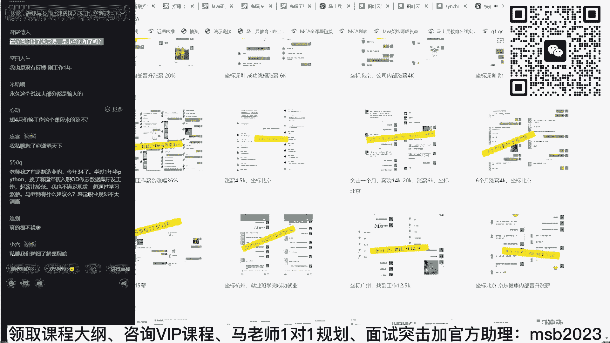

一个月时间我给你看几个一个月的案例，你就知道他来不及来不及了，走突击啊，我需要你走突击。

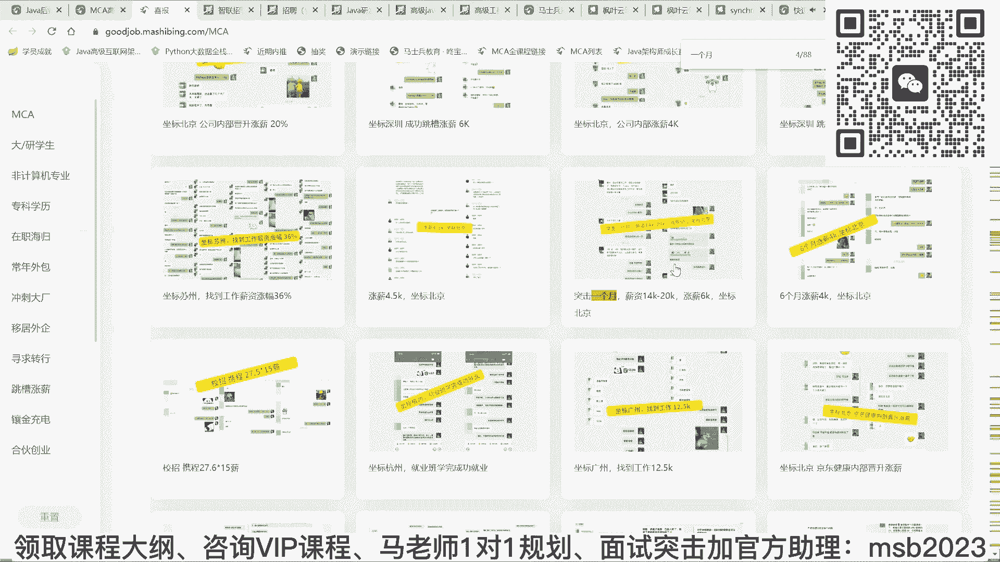

知道吧，这是突击一个月的效果，我不知道你现在的薪水是什么水平。

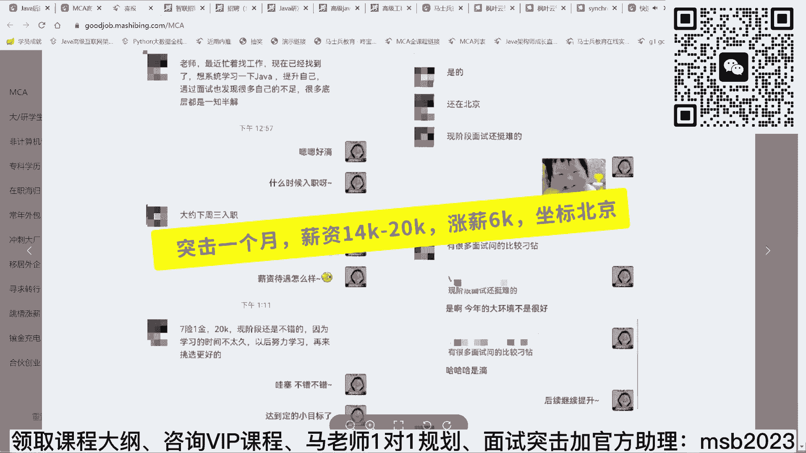

我给你看几个一个月的案例好不好。

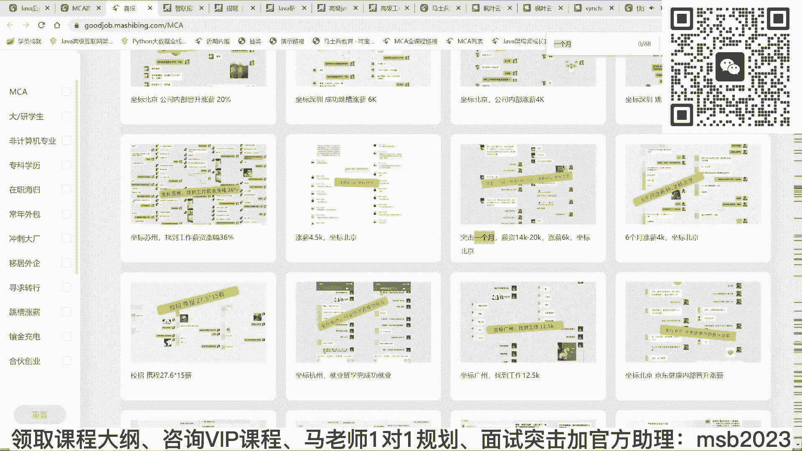

你看这有88个和一个月有关系的，这是这是报名血迹的啊。

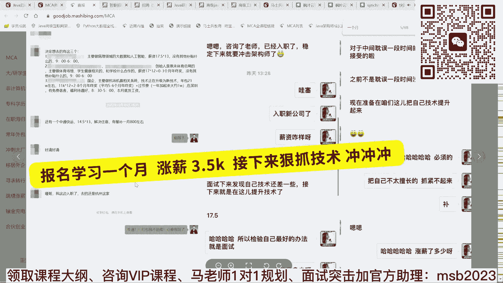

一个月涨薪涨了三三千五，不多啊不多，这是一个月涨了4000，虽然不多，1年5万不是白来的吗，白来的啊。

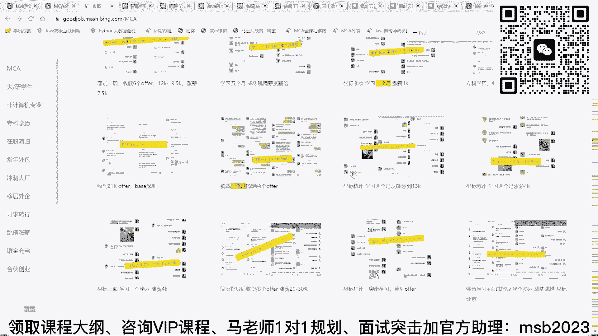

被裁了一个月，搞定两个offer了，就回到行业的，短期一个月在成都这边涨了4000，24岁的大专生，好吧。

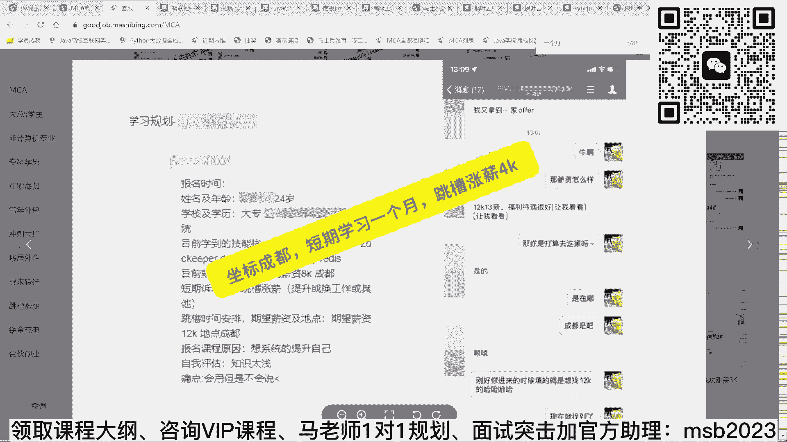

呃这是突击一个月，然后45万年薪，一个月找到工作的，11~13的，合肥的涨了3000的，整体涨了32%，12~30的一个月，找几个一个月吧。

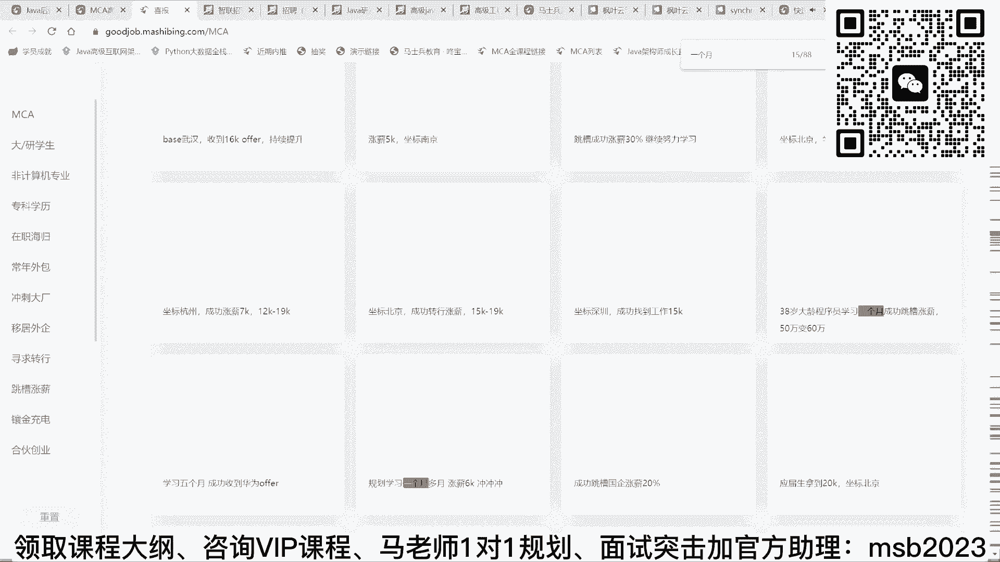

随便找一个啊，这是一个月涨了8000，跳槽上海。

涨薪是一定的，就是你用一个月的突击，注意是突击啊，兄弟们，突击的学习方法和我们刚才讲的，从头到尾的系列化的学习方法是不一样的，这个由老师来帮你把控就行了。

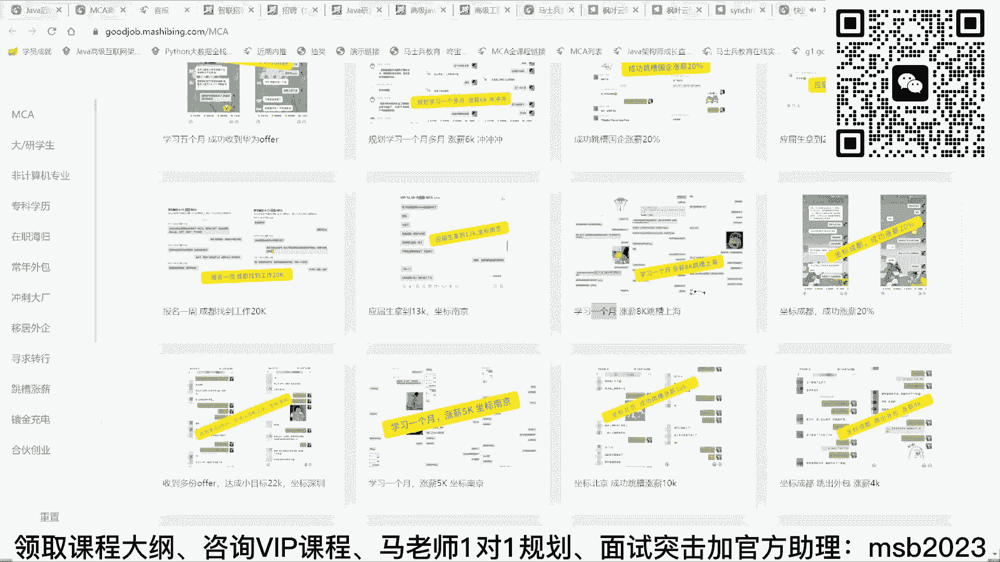

让我们来看看，老师我之前是制造业的，今年34了，学过1年半python呃，欢乐赛道，年初入职o d云数据库开发，起薪比低，我不满足现状，通过学习掌心有什么建议，职业规划不太清晰，首先首先选择哦。

你34岁了，34岁，你34岁相对麻烦一点点，你认真听啊，550q，如果你年轻的话呢，其实就是从头开始规划，换比较好的赛道就行了，但是呢你刚刚换了赛道，做o d云数据库开发呃。

你这个的话呢怎么去找这个薪水，你认真听这个比较难，就是你首先要了解这行里头薪水比较高的人，长什么样，听我说，这行里头呢大概是入行的时候，基本上有两种入行的方式，如果从后只单纯的后端来讲。

第一种是用java后端入行，第二种是用大数据入上big data这两个方向，然后呢沿着各自的路线发展，初级程序员，中级程序员，高级程序员，然后拿到一定的薪水之后，突然间都会遇到天花板。

想突破这个天花板的时候，二者合二为一，成为一名优秀的技术架构师架构，这就是咱们mc课在这里，那么成为一名优秀的架构师之后，你的薪资啊就可以大幅大幅度突破，听懂了吧，然后这是技术序列。

然后这个技术序列如果说做不太好，不是不能说做不太好吧，就是技术序列，还有一个选择就是管理序列，技术管理，技术管理，技术管理一般要求的是整个的呃技术的宽度，这宽度意味着什么呀，宽度意味着。

因为你要将来是带领完整团队的宽度，意味着你要对完整产品的，整个技术链条上的东西都要大致明白，包括前端，后端大数据，云原生ui设计测试运维产品，大致明白这个东西呢，我们用一个完整的项目教了大家。

叫咱们的马士兵严选，这个项目呢是我们大概花20 20多个人开发，来研发完成的，在这个里面涉及到了不同的团队怎么配合呢，在这里面讲的很清楚啊，如果你想了解这一块的话呢，到这个项目里面去了解，听明白了吧。

那像你的话呢，其实我觉得啊你可以你现在是走云的呃，云的话呢。

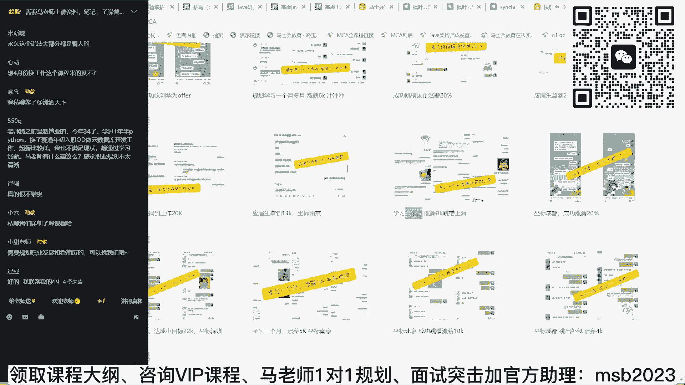

我不知道你现在所谓的云数据开发，指的是个什么，是只是写sql语句吗，如果你只是写sql语句，那就啥也别说了，那肯定薪水不会太高，天花板也比较低，很容易到天花板呃，如果是云的话呢，你你你你呢。

你打开咱们网站之后啊，你仔细去看。

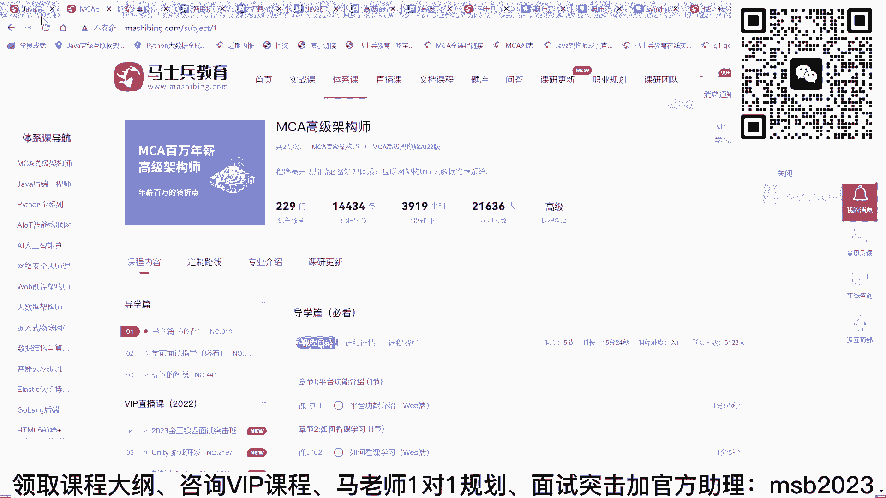

仔细去看这部分就是容器云。

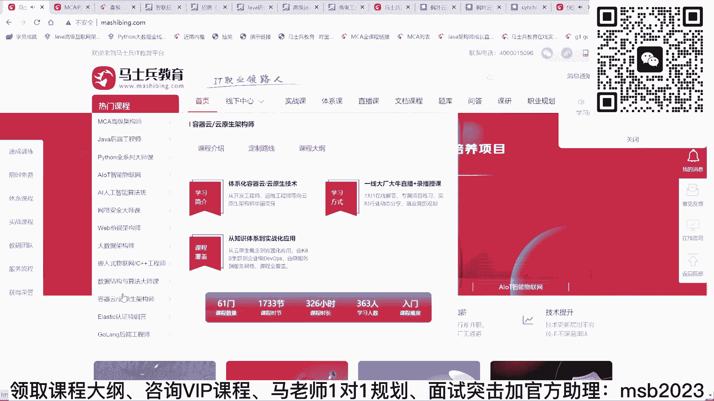

云原生架构师这部分，这里就是容器云这款，其实容器云这块呢呃所涉及到的东西还挺多的，就是虚拟化和云计算这块啊，以k8 s和docker为核心，然后进行一系列的开发和配置，当然也包括了运维开发的一体化。

云计算的技术啊，呃怎么说呢，你呢如果以sl为核心，还有一个方向，还有一个方向云的话呢。

可能有点偏韵味，这个不一定你想要的，还有一个方向是这里就是大数据。

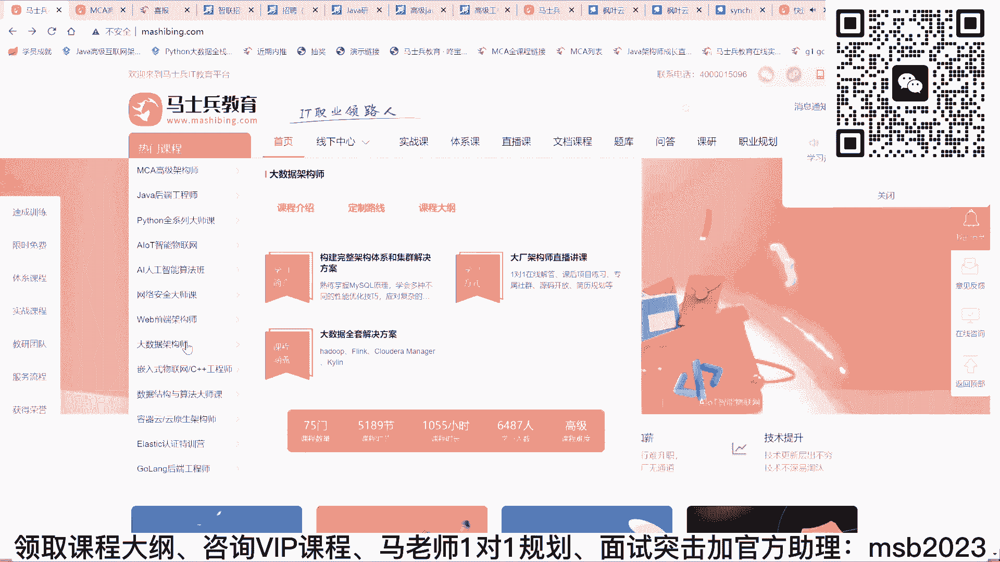

就是你以云数据库为核心，大量的数据的处理过程啊，这块的话也能提升你的，这就是你的你的薪薪水的涨幅。

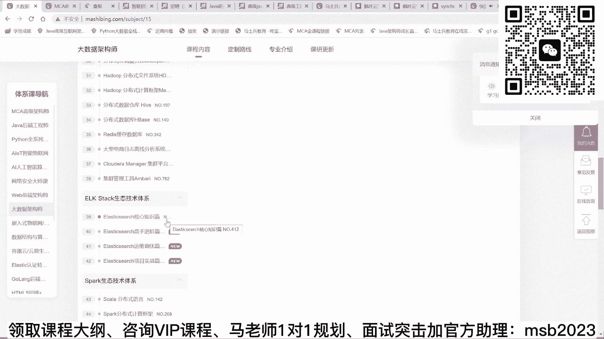

听懂了吧，大概这两个方向啊，你可以你可以跟可以选。

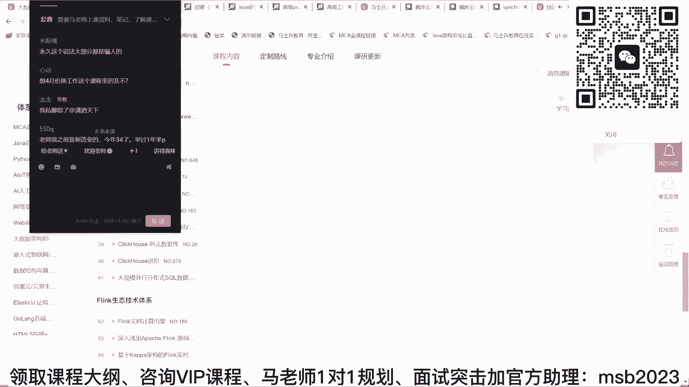

不知道说清楚没有，15k到20，咱们学突击也可以达到吗，可以，基本上问题不大啊，刚工作1年，12k本科二本三小时突击能到多少，二本本科1年不要跳槽，我告诉你后面怎么进大厂呃，突击的话呢。

你就别突击一下了，你就别突击一下，因为空白人生你还在吗，空白人生在不在，空白人生在的，给我扣个一，你还在听吗，给我扣个一，因为我想多跟你说几句，空白人生，你还在不在，你不在了，我就不想说了。

说起来就比较远了，不在了是吧，不在了不说了啊，没有意义了嗯，185 32岁，java后端13k入职，后期怎么规划，那个185你还在吗，给我扣个一出来，人还在不在，1853是吧，好认真听啊。

185我不知道，你现你现在你现在给我再敲几个问题啊，就是第一个呢你现在是在哪个城市，在哪个城市啊，给我敲出来好吧，第二个呢你告诉我你的学历是一本二本大专，985211什么什么的，你告诉我一下好吧。

把这两个告诉我一下嗯，185是在乌鲁木齐二本，其实你乌鲁木齐的话，据我所知薪水还是偏低啊，你32 32岁，13k我不知道在乌鲁木齐是一个什么水平，这个你在那个招聘网站上应该能看得出来。

如果是一个正常水平，那后期怎么规划呢，其实很简单，听我说你应该重点围绕我还是那句话，记住以大并发量和大数据量这两个核心点，围绕这两个核心点展开的系列下的系统化补充，在我们的课程里面的一个项目。

就会把这两个点全给你弄出来，就是大并发量和大数据量，然后围绕展开的点呢，我前面列了一下，简单跟你说过，我不知道你还记不记得大病发量来讲的话呢，就是高弹高扩展呃，各种的中间件分布式相关的理论。

微服务的落地与原生的落地，这是以大病发量为基础，而大数据量为基础呢，打开我们的大数据课，你从头到尾读完就行了，大数据的存储，大数据的清洗，大数据的调度，大数据的处理，大数据的实时计算。

p two p计算数据湖数据仓库，其实这两个核心，这两个核心点拿下，我这么跟你说，以你的学历和年龄，你应该在乌鲁木齐叫恒汤，啥意思啊，就是乌鲁木齐只要有机会，不管他的薪水是多少。

老师都有办法能让你拿到这个面试机会啊，当然能不能面过，是取决于你学习的深度细节程度，但是呢肯定能让你在乌鲁木齐横汤，这是没问题的，围绕这两个核心点听懂了吧，二三线仍是恒康啊，这个肯定没有问题好。

我看看还有没有其他同学有问题的，这东西有问题找老师问，我们家有12分钟，12分钟老师就下播了，不客气啊，150嗯，啊12分钟啊，12分钟老师就下播了，看有没有同学有疑问的，好如果没有问题的话。

那咱们明天见好吧，准备咱们明天见了啊，潇洒天下，咱们明天见啊，兄弟们，明天我给大家讲原子性啊，see you tomorrow，各位晚安好，谢谢大家，谢谢米斯特，299坦克车，summer出游。

thank you，拜拜。

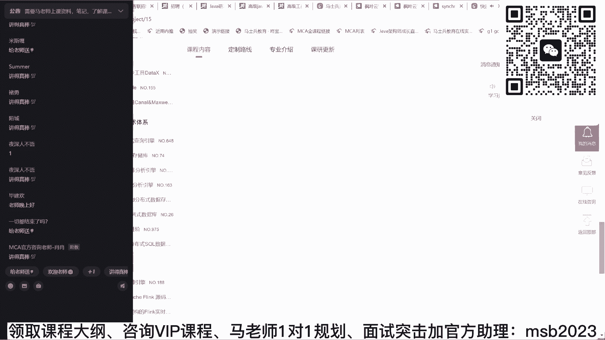

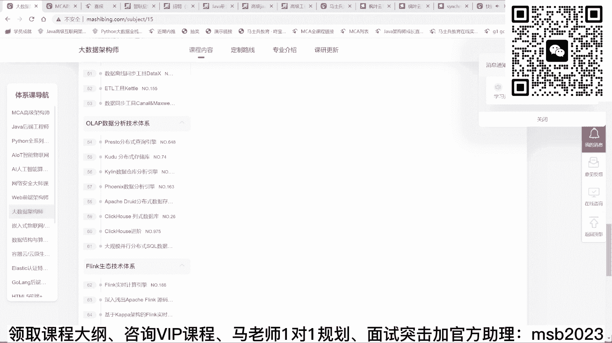

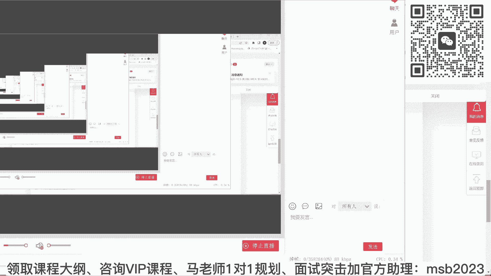

什么时候潇洒天下，说什么时候能进行简历优化，你是报完名了吗，你报名之后就是你找工作的，大概前两周开始进行简历优化，这个是最合理的，不要太着急。

不要太早，因为如果你太早的时候，你你你简历里面还有很多东西没有没有学完，没有学完，你就写不进去啊，这个时候是最合理的。

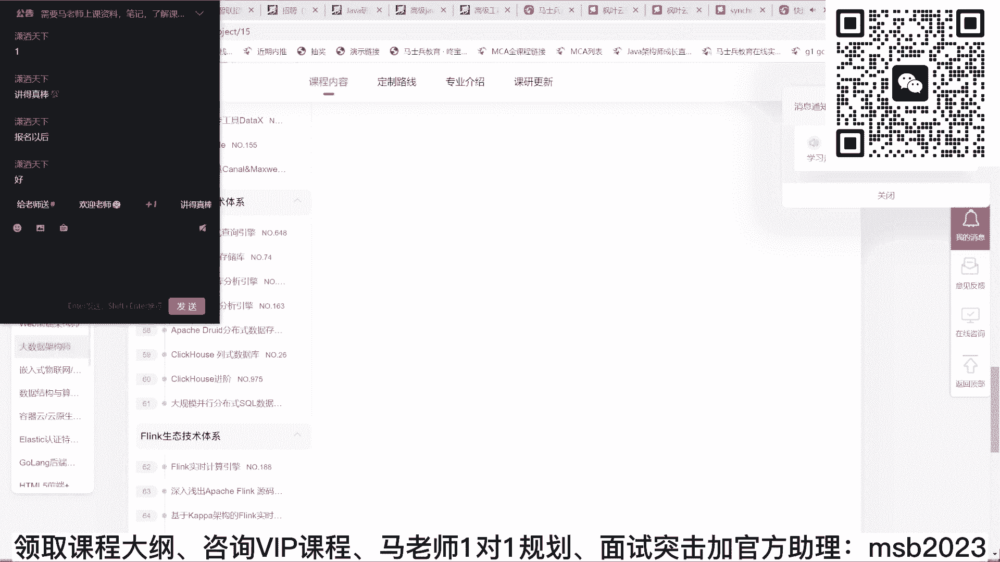

不要着急。

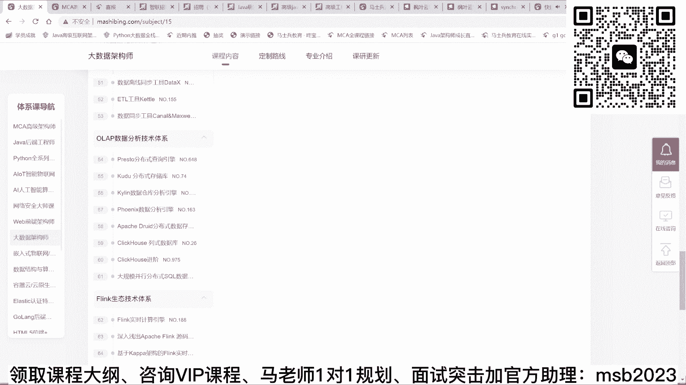

答疑怎么办，对于呃我们是多个老师多对一的呃，多对一的意思呢是这样的，如果你有技术问题，你建议你提问，在咱们的问答系统上，正常情况下呢应该很快啊，我们追求的是一个小时，而实际当中呢有工作时间。

一个小时就会有有人回答你呃，如果非工作时间的话，可能要到24小时，最多最多24小时就会有人回答你啊，这是技术问题呃，如果是非技术的问题呢，是我们每一个人都有一个单独指导群，非技术问题呢扔在我们的群里。

老师就会给你指导，你就说一些规划上的问题，发展上的问题，可以简历指导多少次，这个不限不限数，你只要跳槽的时候，一般简历指导是这样的，孑然一身有限制吗，答疑范围啥的，答疑范围没有限制，山药复苏。

但是你要知道的是，在我们课程范围之内的啊，我们是有义务绝对给你答出来，但是在我们课程范围之外的，我们没有这个义务全部给你打出来，但是我们会会回答山药扶苏，听明白了吧，简历知道多少次，这是不限啊。

只要你什么时候有需要，他们说阿里裁员19000，那个我记得今年是哪个大厂，应该是美团还是谁说是裁员2万，但是招人招多少，24000还是多少，我忘了哈，您查一下，大厂都在不停地裁，也在不停的招。

要不然就不会刚才有那个47万进阿里的了，对不对，老师答疑多长时间回复，最长不超过24小时，正常一个小时以内，但我我现在很难保证，你就是说你你在大半夜的提个问题啊，一个小时真的回答你。

正常工作时间一个小时以内啊，如果你提的那个问题，比方说偏难，有的时候我们需要组织老师来研究，你这个问题走，所以这个时候最长不超过24小时，k美团扩招了，扩招1万多，我看小姐姐发美团开招1万人。

要技术多不呃，应该不少啊，具体技术有多少不太清楚，但肯定不少，想去，但是学历不好学，你什么学历啊，孑然一身，马老师这课性价比怎么样，欢迎你多做比较，你要能找出比我们性价比更高的来看，20课都可以不收钱。

送你就讲这个课，我我我们做这个课，很多时候没有太考虑赚钱的事情，就是赚钱的考虑的不多，我们整个整个那个培训的利润利润里面呢，就是说在我们整个呃做做培训的里面，我们是非常偏低的，你想想看。

可以用十几位老师来讲一门课，然后呢课时量呢是排名第二的十倍左右，你想想看它的性价比什么样啊，自己自己琢磨琢磨，美团队学历要求高吗，呃现在你要开发的话，那我估计二本以上就二本，包括二本，大专会难够呛。

然后三本的话呢，嗯偶尔的机会苦中苦人上人，web two太卷了，我three也可，我three也也卷，你不要认为我web three就怎么样，web 3的话呢，目前的工作岗大多数时候集中在什么呢。

要么是区块链方向，要么是那种ar vr这个方向一样的卷，中国但凡有不卷的东西，不是很卷，赚钱还高，你认为中国人会怎么样干，你好好想想，马上扑上去，所以找一个更宽的方向去卷，这个是大家避不开的，正视他。

也许你有冲上去直面它的勇气的时候，其实你就会发现没那么难，很多人是被吓死的，连战场都没有上，不要干这种傻事儿哦，还有问题吗，看看刚才我要下播了，都突然间有有一堆人在这问问题，321好，各位同学再见。

