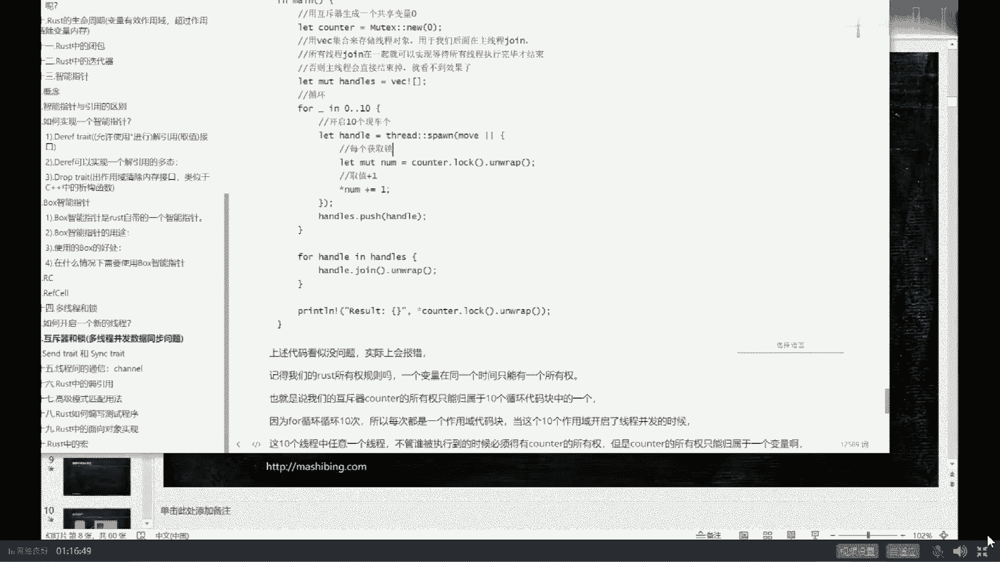
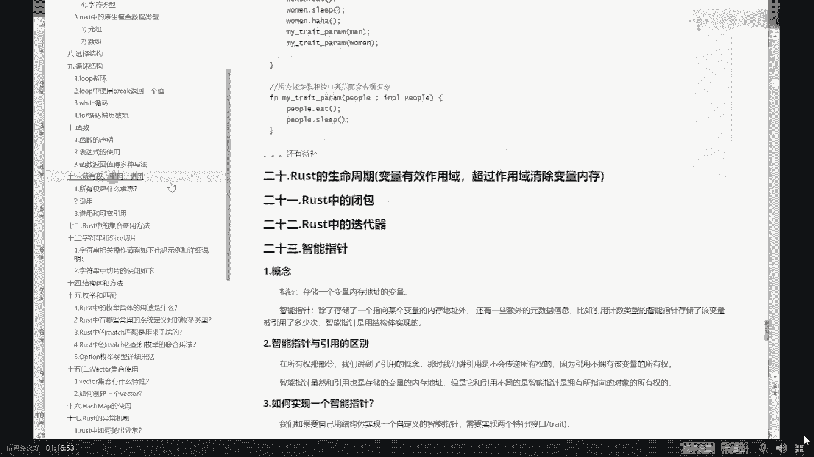
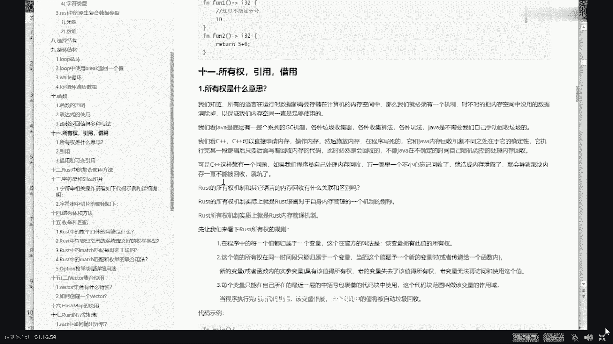
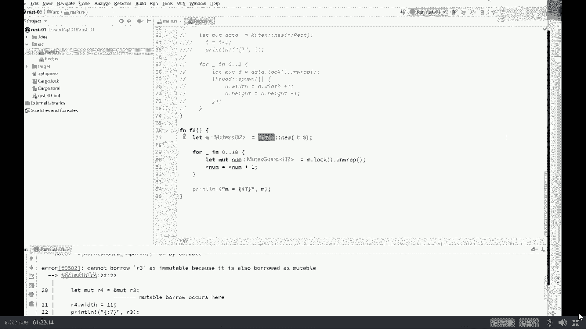

# 系列 6：P37：站在巨人的肩膀上：且看语言的发展史 - 马士兵学堂 - BV1RY4y1Q7DL

可以这么说，在最开始的语言的发展的历史上，都是沿着对这种bug来来来，更加容易调试的这个方向不断发展，像原来c和c加加的话，大家应该知道这种是什么事实，怎么怎么管理这块内存啊，怎么管理这个指针的呀。

叫手工吧，手工管理，不知道有多少同学是学过c或者是c加加的，有没有有的话，老师扣个一来cba里面分怎么分配一块内存，a memory allocation对吧，当然他有好多好多函数都可以分配啊。

这其中一个reallocation的意思，我就是开始诶，在我们的内存空间里面找了块内存，但是你总得释放它呀，你怎么释放free这个函数就可以把它给释放了，但是我告诉你啊。

也许因为程序里面充满了各种各样的分支，循环啊，各种各样的不同的岔路，它并不是说只有一条路线，所以只有一条路线的话就简单了，我这边分呃memory allocation完了之后呢。

后面马上就把它free掉，可是在很多情况下，我是需要判断的，在这种情况下我要把它删掉，在另外一种情况下，我不要把它删掉，我告诉你，这就造成了各种各样各种各样麻烦的bug，所以手工管理内存。

无论是c里面的memory allocation，或者是c加加里面的new和delete，本质上他这这这哥俩是一回事儿，这两段是一回事儿，都是需要你进行手工管理。

手工管理最麻烦的事情就是你不小心忘了删了，你知道吧，这空间你分配好了，但是你不小心给忘了，你把它给忘了，忘在这了，这时候会会产生什么，告诉我一下，忘记删除，忘记释放，这个呢叫memory lake。

这叫内存泄露，不要不要叫内存溢出，大哥他没有溢出，它只是泄露了，泄露是什么概念，泄露的意思就是这块空间呢虽然说留在这里，但是所有任何其他的程序不能去访问它了，不能使用它，他留在这儿，他没用了。

但是别人也不能用，这就叫泄露了，如果泄露越来越多，会发生什么，泄露的越来越多，泄露越来越多，会发生一种现象，就是当新的内存空间要申请的时候来了，我需要申请这么大一块。

我突然间发现这里面充满了一个一个洞一个洞，而且中间我找不到一块连续的内存，来为我这块内存分配空间了，完蛋这个叫内存溢出，泄露过多的时候容易产生内存溢出，但它本身不叫内存溢出，保存memory。

当然这种的还算是不是不是很严重啊，大不了我重启一下是吧，你又能跑好长好长时间，所以调优jvm调优最重要的一点叫做重启，每两周重启一次，玩过游戏吗，有的游戏是不是就这样，各位指挥官。

我们的游戏服务器将在五分钟之后启动，进行维护，在此期间不得互相攻击，good，你们已经学会了第一种调优的常用的方式，当然你不能跟面试官这么说，做过调优吗，做过怎么做的，重启面试官一个大嘴巴子给你抽上来。

哪凉快哪呆着去，这是第一种有可能会产生问题的地方，叫旺季是吧，第二种是什么，第二种叫做，释放多次就是你释放了一次，你delete了他的一次，由于有分支判断各种各方面的情况存在。

也许有可能你free了好多次，delete了好多次，这个有同学说没问题啊，这块空间我不是干掉他一次，没关系啊，我再干他一次吗，不就是尸体让我又干了他一次吗，鞭尸而已，没错你只是编了个诗的。

问题倒是不是特别大，但关键是当你干掉他第一次的时候，有另外一个人已经把这块空间给重用了，人家已经又放上有用的空间了，结果呢，你第二次回来又把人这个有用的数据给干掉了，结果另外一个线程就会发现莫名其妙的。

你发现没有，莫名其妙的，你的数据就没了，所以这是为什么说我们多线程这种bug，特别难调的，原因就在这里，你的线程好好的没bug，你懂吗，甚至说你的进程啊，如果是进程之间共享的话，你的进程没bug。

没有毛病，你的程序也没有半毛钱毛病，可是很不幸的是，由于有别人家写的bug的存在，他会很容易的把你占有的这块空间给你干掉，你找谁说理去，好了，这个叫释放多次，产生，极其难以，极其难以调试的bug。

一个线程空间莫名其妙被另外一个释放来，写过c和c加加的人遇到过吗，遇到过的，给老师扣个一，对装装备你莫名其妙的就没了没错，后来呢后来啊就是谈gc呢，开始聊语言的发展历史，我们我帮大家梳理一下这个语言呢。

c和c加加呢它运行起来的效率非常非常的高，呃但是呢它的开发效率很低，有的时候呢有的人呢是片面追求运行效率，但是听我说呃，现在呢有一些大规模的软件，它并不是追求你的开。

并不是追求你的你的你的运行效率有多高，也许你运行效率稍微慢一些，我拿那个硬件给你怼上去，我能接受，但是你的开发效率特别低，我就不能接受，别人用python语言，用java语言，用go语言写一个程序。

仨月写完了，你拿c c加加写，你写1年，等你推出来的时候，市场都没了，黄花菜都凉了，有用吗没用，所以后来产生了很多很多的，对内存管理比较友好的，知道吧，方便内存管理的语言，它方便方便在什么地方呢。

大家注意它方便呢并不是方便，在说那个多线程的情况下啊，没有不会产生什么不一致了，没有野指针了，不是这么回事，它呢主要方便在引入了dc这个概念，这里的dc呢指的是garbage collector。

garbage collector的意思是说哎我说哪儿错吗，garbage college是叫垃圾收集器，垃圾收集器是什么概念呢，我给大家举个形象点的例子，就是我们平时写写一些小程序啊。

就是在这块内存空间里面不断的分配对象，分配对象，然后删除掉，删除掉啊，再继续分配，再删除，这个对象呢有可能指向另外一个对象，这个对象的成员变量有可能指向另外一个对象，好在内存空间里面不断的扔这种小线团。

这小线团之间的建立各种各样的关联，也许它上下面有好多好多的成员变量，建立建立好多好多的关联等等，会形成一颗对象树，这个对象树呢在不断的动态的产生变化，如果站在内存角度来看这幅图的话。

这个图景就是这样子的，原来我们必须得小心翼翼的管理，说这块没用了，我就得小心翼翼的把它删掉，不能多删，不能不删，但是像这些语言，java语言，python语言，go语言。

以及原原来老早的这个list语言啊等等，他呢引入了一种gc的概念，gc的概念就是说我自己这个程序，我的业务程序我自己不去维护删除这个过程了，我只管分配，只管分配，那么就有必须得有人负责帮你删除。

不然你的内存不就很容易就被占满了吗，好我引入另外的另外的线程，另外的功能好，这个功能叫做gc，叫做gbletter，叫垃圾回收器，java python go都有这个这个功能，它的程序一起来之后。

它并不是说只启动你的业务线程，它会同时启动好多线程，这里面的线程就包括垃圾回收线程，ok这个垃圾回收器的功能是什么，就是你不用你再也不用管这个，你你你只管分配内存啊，应用写程只管分配。

垃圾回收器负责回收，当然这是一个很复杂的过程，因为垃圾回收器回收那些线条，不是你自己分配的，你怎么知道他什么时候就不用了呢，所以你首先你得首先找出来谁是垃圾，然后再采用各种各样的方式去回收它，我这么讲。

不知道大家能不能理解，能跟上雷老师扣个一，然后像这些程序写起来就比较简单，你就不用去管这些特别难以调试的bug，这些呢特别难以调试bug呢相对难难以产生，当然多线程的麻烦就在于。

不是说呃你这个指针被别人删掉了，这只是其中一种办法，多线程还在于说我们去共同访问的时候，数据的不一致性，这个了解过多线程的，应该我一说你就明白啊，并不是说他会把所有的这些问题全部给解决了。

不是这么回事儿，呃因此呢这些语言一旦诞生之后就开始流行，为什么，因为它开发效率非常高，大大的降低了程序员的门槛，java语言诞生之后很快就流行呃，原来学c的，学c加的很多都是转向java了，为什么。

因为它简单，在这个方面，起码在这方面比c和c加加简单的多好，这是这些语言的诞生，当然呃，每一种语言都有它自己的垃圾回收的内容啊，都都不太一样，我呢在我们的vip课里讲过，java是怎么样垃圾回收的。

讲过go是什么，垃圾回收的python相对简单，python就是使用的这种这种叫叫引用计数啊，它它的算法相对简单，但是讲到这儿呢，我也得朝我们我们我们是讲到了现在，从过去讲到了现在。

现在的这些语言很流行，但是呢这些语言有很大的问题，他也没有解决什么样的问题呢，就是java空指针的问题依然没有解决，你能保证你传给java的任何一个引用，它不是空指针吗，很难保证你有一个参数。

你接收过来之后，你是不是在java程序里面还得跟那判断判断啥，if你传给我的参数不等于空，怎么怎么办，就说这个你依然不能保证它是不是控制针，虽然java呢呃有各种各样的什么option啊，什么什么呃。

对于空指针的这方面管理的类啊，但是他依然没有解决这个问题，就是野指针的问题，依然会存在也指针问题在java里面依然会存在，ok，python里面go里面我告诉你依然会存在，这是第一个，第二个呢，同学们。

你们拿大腿想想看，作为我来说，我只管分配有另外一个人来帮我回收，那么他回收的时候一定会占用cpu的执行时间，一定会占用cpu cpu资源一定会的，所以它的执行效率相对低，所以我们说java写的程序。

python写的程序，go源写的程序相对于cc加加来说，你放心，没有人能超过他，他们的效率在长时间运行的时候一定会低，当然这些语言都自己都自己都会吹牛逼啊，说我java采用了g i t是吧。

just in time compiler啊，叫及及时编译器，采用了之后呢，我跟c和c加加差不多，你废话，你采用了之后就就是那么一小段程序和cc下，这差不多好吗，并不是说在比方说我7x24小时。

365天不间断运行的这种服务器程序上，你总体算下来，1年算下来和c和c加加的执行效率差不多，不可能好，第二一个呢，python那就更不提，更甭提了，go语言呢号称啊我是替代c的，所以我的执行效率特别高。

我比我比java还高，扯淡，go也有严重的这种垃圾回收器占用的时候，停顿时间叫s t w，就是我垃圾收集，垃圾收集起，开始干活的时候，你其他的线程都得给我停住，生产环境之中。

有人遇到过的go语言的垃圾回收，停顿时间长达数个小时，所以大家千万不要迷信一种语言，我呢讲东西呢，我是喜欢站在架构师的角度讲，我并不偏向某一种语言，但是我需要用某一种语言来落地，最流行的是java。

现在呢呃有一些地方在开始用购，所以呢我有讲价，我有讲够，其实站在一个牛逼架构师的角度来说，语言呢只是一个工具而已，作为一个结构结构化设计师，哈哈架构是吧，你要盖一座大楼的时候啊，这个柱子该用水泥。

用水泥，这个门该用木头，用木头，然后这个洗手台的该用塑料，用塑料啊，该用化工的其他化工材料，用化工材料呃，如果是从软件角度讲呢，你做你造一个非常非常复杂的软件，你这个地方该用c加加，用c加加。

该用python，python，该用够用够改用rust，用rust，所以我希望大家呢，在以后你的学习和成长过程历程里头，超越语言，站在一个更高的角度来考虑问题，建立架构师的思维。

你的薪水才能够做更高的突破，可以这么说啊，任何一种语言，包括这样的，包括python，你如果只是局限于这些语言的时候，告诉你你的薪水，一线城市目前差不多三五十万到头了，超过这个数的很少。

但是如果站在一个架构师的角度，他的心率会达到多少，120万以上，ok来认可老师这句话，给老师扣个一，java还没学明白，没关系啊，语言这东西呢，你就理解为它是一把大砍刀，你学会用斧子砍柴了。

下一步你就是用菜刀切肉，如果用菜刀切肉，你学会了，下一步你是用水果刀削水果，你说它很难吗，不难很类似，需要，你就是就是熟练度不同而已，好吧，所以这两类语言叫做有什么特点呢。

这类的特点就是它的执行效率非常高，但是他写容易特别容易产生bug，你得手工去管理自己的内存，好这是这类语言，这类语言是什么，这类语言是它开发效率特别高，但是你管理内存的时候。

你你你你你你呢它执行效率就会比较低，这个内存的管理上呢，它就会引用另外一个让别人去管，我自己不用管，我省了很多事好，那么有没有一种语言运行效率又特别高，运行效率超高，对标的是汇编c c加加。

不用手工管理内存，没有dc，ok恭喜你啊，现在它已经诞生了，这个语言叫rust，但是他也有他的毛病，学习曲线巨高，ok，这是rust呃，有同学非常的好奇，说老师这事儿很神奇啊，运行效率特别高。

what跟c和c加加差不多，然后你你你只管自己去往内存里头分配，就可以了，你不用管回收没有g c a哇，他是怎么做到的呢，rose没听过是吧，你罗你太落伍了啊，你是这行业混的吗。

你稍微稍微关注一点最新的技术的发展，大哥希望大家伙儿的学习叫做与时俱进，这词儿呢非常的重要啊，咱们入了这个行业，你要想不学习就能持续不断往前发展，不可能的，那就是温水煮青蛙，把你自己慢慢煮死，好吧好。

大家看这里啊，这个rest呢是比较新的一个语言，它的特点就在于这，它运行效率超高，和c和c加差不多，但是开发效率也并不低，原因是什么，原因是你不用手工去管理内存，你只管去分配就行，你不用管回收牛刀吧。

好他主要是怎么做到的呢，你想听吗，今天其实主要讲jvm的gc的，要顺带着给大家讲一讲好吧，看这里，我我告诉大家一个特别，他特别特别牛的一个概念，他特别牛的概念叫什么呢，叫ownership。

叫ownership，所有权，所有权的概念，这个所有权概念是什么意思呢，所有权的概念就是这里面的每一个值。

rust。

就是这里面的这，这这这个这个这个这个任何一个值啊。

任何一个值都归属于一个变量，就是一个变量代表一个值，一个变量指向一个值，任何一个值都归属于一个变量，然后有且只有一个，不可能有多个，这句话什么意思，我形象一点解释。

我告诉你在这张图里面我们会有多个变量哈，这叫一个变量，o是一个p是一个啊，这里o是一个p是一个，还有多个变量指向同一个值，或者叫同一个对象，在rust里面这件事情不可能发生，哈哈听懂了吗，我再说一遍。

go on的gc，z b c的一种算法，接近于它啊，类似，好大家看这里我再说一遍，重新重复一遍，就是多个变量指向同一个对象，这件事不可能发生，只会发生什么呢，同一时刻只会有一个变量指向这个对象。

这就是所有权的概念，叫做我们这个值的所有者只有一个一夫一妻制，哈哈不知道大家听清楚没有，那有同学可能就会说了，老师这有什么好处吗，来你们拿大腿想一想，小伙伴们，假如我在占空间。

任何一个战争里面的变量指向的这个空间，如果确保是一夫一妻制的话，那我这个我们叫她丈夫吧，她的丈夫消失的时候，他的妻子是不是顺带着就殉情了，听懂了吗，再说一遍，她的丈夫死掉的时候，什么时候死掉了。

还记得吗，他的妻子就跟着殉情，自动就给你回收了，你发现没有，没理解是吧，听我说还记得占空间里面它的特点是什么，占空间特点是当我这方法结束了，我这占空间就不存在了，我这方法结束了，占空间不存在了。

哎我们假设如果这个p你已经确定它不存在了，同时是一夫一妻一妻制，没有任何其他人指向这个对象，你们好好想想看我这个对象是不是可以回收了，方法结束站空间里变量指向的任何空间，跟着回收就可以了，听懂了吗。

也就是说我不需要gc，为什么不需要dc大哥，你你这边你这边消失了，我给你加几行代码，把这个里面关联的编译器帮你自动加的啊，关联的内容ok直接就给你干掉了，所以，这是rust的它的一个核心的设计理念。

rust的这个特点诞生之后啊，同时在和堆叠加了它的这种对于多线程访问的，呃，共共共共享变量，必须你得你得需要采用它特定的书写机制，才能够写得出来，它会产生了一个特别奇妙的东西，叫做你写不出bug来。

好说一下，这是rust语言特别有意思的地方，叫做，ok不知道的，不知道大家听清楚没有，你只要程序的语法能过，就不会有bug，当然他语法非常特殊，这讲着讲着怎么讲成rust了。

逻辑bug是任何语言都存在的，任何程序都躲开了大哥，逻辑bug是啥，你本来让你计算这个程序的一个人的年龄，你给计算成为一计算成为一个人的体重了啊，本来让张三娶了李四，你非得让他娶王五。

那这种bug我你这跟语言有半毛钱关系吗，是吧，所以这个语言没关系啊，咱们说语言层面的bug，rust呢消给你消失，消了很多，除了我刚才说的这个ownership之外，除了还有呢就是在多线程的这种写法。

多线程写法叫做固定的，你知道吗，你就得这么玩，你不这么玩的话，你根本写不出来，你想让多个线程去访问同一个值吗，我告诉你，你只有这种写法，你不用这种写法，你根本就写不出来，所以只要你写出来就没bug。

就是这么的牛叉，啊我不知道我大概说清楚没有啊，但是咱们今天还是还是得说回来啊。

今天并不是讲rust的，不感兴趣对啊，不敢去算了，反正你们对新的东西也不太感兴趣，我们讲老的吧，咳咳咳咳，讲这边啊好了，这是语言的大概的一个发展的历史，你要你要明确啊，现在这个语言呢大概分这么多类。

那有同学说老师那js这种东西是什么，其实这些都是带垃圾回收器的好吧，就js这些啊，还有像什么，还有还有想其他的啊，这colin等等，这不说了，他本身就是运行在jvm上的，所以他肯定是带了就回收器的啊。

还有像什么scala，就老师给你讲东西呢，我希望讲那个层面太低了，我希望你站在更高的角度上来教你认识啊，就整个一个it界的一个发展，还有呢整个语言上的语言层面上的一些东西。

你站在更高的一个角度上建立起来，你的知识体系。