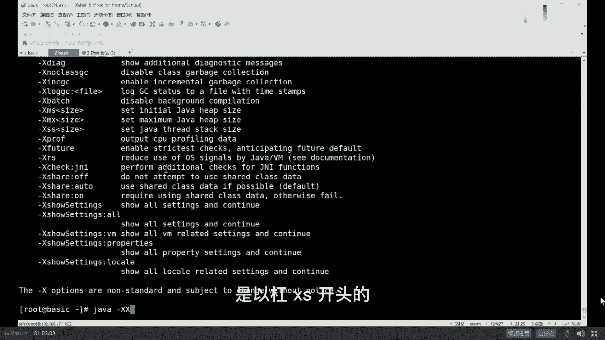
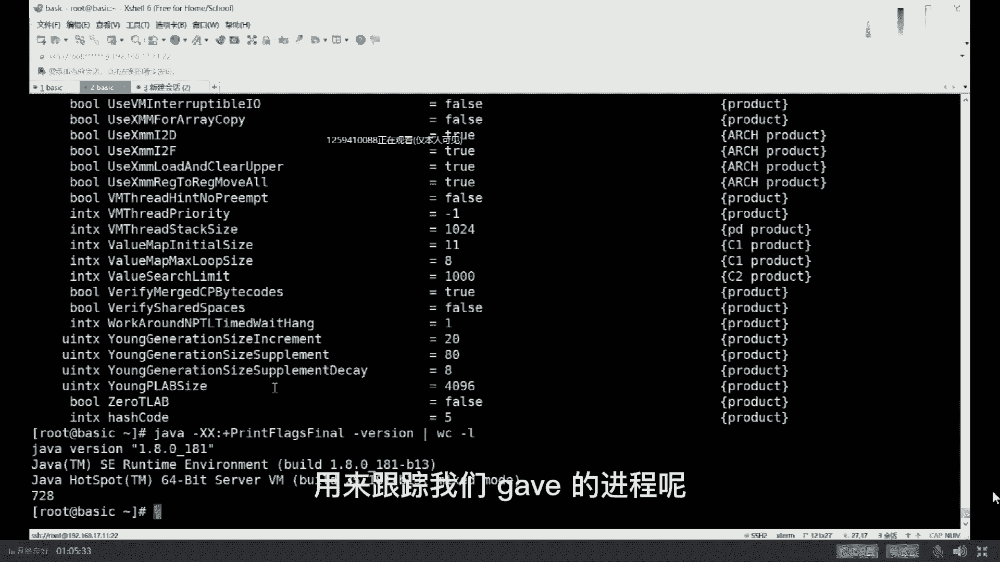
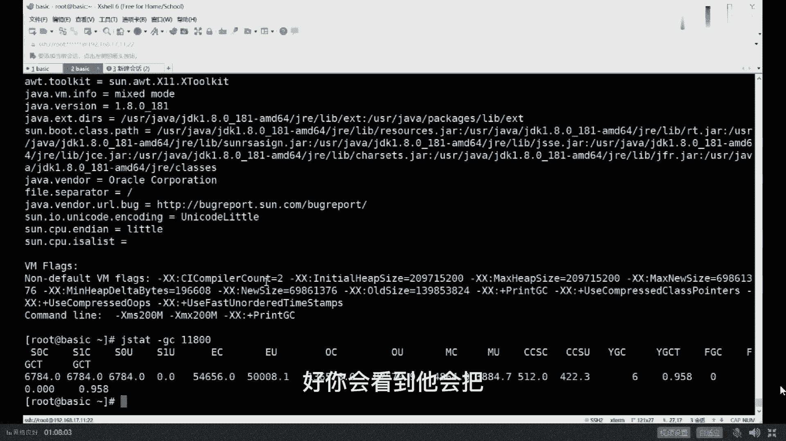

# 系列 6：P41：JVM调优实战（上） - 马士兵学堂 - BV1RY4y1Q7DL

首先讲一点小小的概念性的东西，到底什么叫调优，我跟你说调优这个词啊，用的太烂了，所有东西都叫调优啊，随便弄点什么参数也叫调优，调这个词实际上是如果严格意义上来讲呢，它包括好几部分，什么叫调优呢。

从jvm角度，它包括三大部分，第一大部分是根据你的需求进行，j版的规划和预调，有，这是什么意思，比方说我规划之中，我要每天支撑100万的下单量啊，我这时候要用什么样的机器，用多少内存。

这东西呢我们可以叫预规划，也可以叫预调用，第二个呢是优化运行，这版的运行环境，比如说你现在这外面运行环境运行特别慢，卡顿好，这个时候你需要定位到一个系统的瓶颈，来进行调优。

因为一个系统平瓶颈呢基本上要进行压测，要进行全链路压测，那么如果是单机的话呢，你只要通过方法进行跟踪就可以，那么如果是分布式的话，你需要用zk skywalking啊，这一类的进行全链路压测。

来找出来到底哪个服务特别慢，然后再进行调优啊，这块我我解释的不知道大家还能不能跟得上，能跟上老师扣一英文叫ching，yes，你说的太对了，英文太好了，来我们继续。

还有一种调优呢是面试之中one特别多的，就是解决这个运行过程中出现的各种问题，什么问题呢，比方说memory leak，比方说o o m o m的全称叫out of memory。

内存溢出内存报表是这个意思，今天呢我用一个小例子来教大家解决这类问题，你会用到哪些工具和它们怎么具体的使用，好好听我说，如果说调优你需要理解很多很多东西的，你需要理解怎么去设设定日志的参数。

你需要理解呢，怎么啊，这个日志日志怎么去解读它，呃今天呢我给大家略过一些细节，就像昨天我说的，希望各位小伙伴们先学最粗犷的东西，然后树干再学树枝，再慢慢去抠每一片叶子，你才会变得越来越牛。

关于日志这块呢其实还是挺复杂的，每一个日志你怎么去解读它，我们暂时先略过它，今天也用不太上用到的地方，我大概跟大家说一下，另外呢在工业生产环境之中，一个java程序应该设置什么样的参数，这块也特别重要。

有些参数很多人从书上得来的，实际人家工业环境不可能，那么设，比方说你设置日志文件就设一个，这不可能的好吗，一个日志文件你很快硬盘就占满了，所以这根本不可行，必须是循环的好多个日志文件不断循环。

比方说你根本就不设hip dump on out of memory error，就是说如果说他om之后，你不把堆导出来，那你完蛋，你定位不了问题，所以这个也不行，这块呢我们暂时先把它略过。

所以我来说呢，我用一个具体的例子来给大家来讲，大家看这里啊，我们那有个小程序，这个小程序呢业务逻辑上我大致解释一下，这个小程序是这样一个业务逻辑，小程序来源于实际，我们有一个小伙伴在工作之中的一个问题。

的模拟jvm调优这一类问题，比较麻烦的问题在于我很难跟你模拟真实环境，因为真实的环境很可能一个月才出一次，我给你这模拟一个月，然后为了出这个问题太累了，所以我只能用模拟的环境。

用最快的速度让它fell over，叫快速，feel fast是吧，快速的让他展现出来他的bug之所在，在这个小程序是模拟的，虽然是模拟的实际场景之中，它就是这样的，你好好听看，是不是大致能理解好。

这个小程序模拟了什么场景呢，这个场景是在银行体系或者是互联网金融体系，里头进行风控的这样一个模型，风控简单说我要给一个哥们放贷款，这哥们儿叫博传玉，他们家有祖传的玉石，藏在柏树里头。

ok说明这哥们信誉比较高，信用额度比较高，我可以给他贷100万好换，另外一个哥们，这哥们儿叫rist，啊这哥们儿的名字起的太怪异，他的信用度很低，我只能给他带1000块钱啊，这东西怎么算出来的。

是根据每个人过去的一些信用情况，信用卡还还还还款的这种及时性啊，借了多少钱，有没有其他的债务啊，是怎么消除的，以前有没有接待过等等啊，有没有借债不还的好根据这些算出来的，这叫做风险控制模型。

风险控制这个小程序就是模拟了，从数据库里面取出每一个人的个人信息，来套用一个风险控制模型来计算出来，他到底可以给不给他的代，或者说他的贷款额度到底给多少啊，这个背景大家听明白的，给老师扣个一。

啊李军长也来了嗯，去找找一下那个叔叔，让叔叔把你送出去啊，嗯拜拜嗯，好嘞我们继续啊，看大家看这里这个小程序呢，每一个人的个人信息呢，我用了一个cateer来模拟它，只读了信用卡信息。

实际当中比这复杂好多，信用卡呢包括他的信用卡额度，包括他的名字，包括他的年龄啊，包括他的生日等等，然后我们用一个，有一个方法，他呢每次呢都从数据库里面读出100条数据来，求出100条数据来之后呢。

加入到我们的test list里面，加入到我们的任务列表里，我们起了一个线程池，线程池呢叫schedule thread to executor，这你学过的话，你就学过，没学过的话，大致理解就行了。

它是固定时长，固定频率的来执行任务的这样一个线程池，在这个线程池里面有50个线程，然后每隔100个毫秒执行一次任务，在这个任务里面以固定的频率，拿出每一条数据来，每一条数据拿出来来进行计算。

大概就是这么一个模型好，这个程序呢你理解也行，不理解也可，无所谓，我现在给你把这个程序运行起来，我直接告诉你这个程序里头有毛病有bug，我举的例子稍微复杂一些，我不想举那种特别简单的。

你比如说拿一个list不断的往里扔对象，然后一会儿就内存溢出了，这个太简单了，你要跟面试官说，你说我有实际当中调优经验，面试官肯定会问你啊，你实际当中什么情况下需要调优呢，遇见了什么问题呢。

你跟人家说说，有一程序员反正不是，我写了个list不断往里扔，从来不往外取，很快om了，面试官肯定拿大嘴巴子抽你，这也太简单了，好意思拿出来说吗，可是即便是这样，确实在实际生产环境之中。

真的有人犯这种错误，由于业务逻辑混杂在其中的时候，程序就会显得特别复杂。

就有可能会产生这种错误，就没招了，但你尽量不要说这个太low太low了。

好我刚才讲这段能跟上吗，能跟上给老师扣一来，你不要太low啊，虽然local内存泄露那个太高大上了，我觉得你未必能cover得住，你做什么，写了thread local，它怎么产生的内存泄露。

这个你未必能cover住，好大家看这里，我先把这程序给刨下来，这小程序呢我加了几个参数，看看能不能认识啊，第一个参数呢叫杠x m s最小堆大小，第二个呢叫杠x mx叫最大对大小。

print gc运行过程之中，把我们垃圾回收器的日志输出打印出来，最后是我们的程序，这里问大家一个问题，为什么我设最小堆和最大堆设成同一个，都设200兆，最小跟最大不一般的情况下不设成一样的吗，为什么。

辰辰前面没听着，太遗憾了，没关系，不耽误后面听，不用扩容没错，防止内存抖动，既然你明确知道，我的应用程序会占到200兆内存，直接给它分配200，不要让它没事，涨来涨去啊，长一点长一点长一点。

长到最大之后，如果用不着了，又往回缩，缩，完了之后又往回涨，太消耗资源，ok该到这点之后，我们敲回车这个应用程序啊，我们的java这个进程就开始跑起来了，下面呢我开始是教大家纯实战的内容，嗯排列一下。

好我们排列它一下啊，这样我们看得会更加清楚一些，呃，我们右最右边的窗口里头是我们呃，现在正在运行那个程序，这个小程序呢时间一长，它会出各种各样的问题，目前为止还没出问题，目前呢它只是展现出来了。

说我产生了一次gc，这次一次gc，这是什么意思呢，这个应该是怎么给它放到最大的。

我把这窗口呢还是，垂直排列。

水平排列合并所有吧，这样我切切一切吧，让大家伙看的更加清楚一些啊。

重新运行一下这小程序，为中，回车重新运行一下程序啊，这个排成三个窗口，不能把信息信息显示完全，看上去很别扭，当我们运行起来这个小程序之后呢，你会观察到的小程序呢会产生一些日志输出。

这些日志呢你看大概大概是能看明白，我稍微解释一下，这个输出日志输出的是比较粗的日志，并没有说出很详细的，如果输出很详细的，我需要跟你解释半天，还是那句话，我们先略过一些细节，大家看这里。

他产生了一次gc，gc产生的原因叫allocation failure，什么意思啊，分配失败，那意思就是说我有一块内存被占满了啊，这个这个dc叫y d c在年轻代dc，然后这次回收产生了什么效果呢。

原来我的年轻代占了54兆，接下来回收一次之后，回收成为一兆，说明回收了53兆哇，这次回收的效果很明显啊，然后我们总的gc的呃，总的堆大小是20兆啊，200兆sorry，200兆时长是多少。

这块我大概说明白了吧，有没有谁在这块有疑问的，没问题吧，没问题的，给老师扣一啊，来我们继续，我教大家一些最基本的一些常用的命令，先作为java来说，最常用最常用的命令当然就是java是吧。

好我们下面来聊一下java参数，java回车你会看到作为一个java命令，它后面可以跟哪些个参数，我先说第一点，就是当我们一敲java的一个命令的时候，它就会启动一个java虚拟机。

以前老同学在这里头犯糊涂，说老师我起了一个java t1 ，又写了一个java t2 ，这这是几个虚拟机啊，两个只要你敲一个java命令，就会起一个jvm。

这个jvm专门给他服务，这个jvm专门给他服务，你调优的时候不能两个混在一起调啊。

这件事很难很难理解吗，很容易啊，好大家看这里，作为java来说，他本身有好一堆的参数，这种以横杠开头的叫标准参数，标准参数没有多少。

看上去也并不太难理解，但是你不要忘了，这里还有一个杠x开头的。

这叫什么，n standard nonstandard。

非标参数非标准的。

所以你敲java杠x回车的时候，他会把非标参数全都给你列出来。

像刚x mixed杠s interpret，这个我的vip课程有讲过。

像什么diagnostic啊，non class dc啊等等等等这些globdc。

这都是设置你的gc的文件的等等，杠x m x m x我们都设过了。

好听我讲这个叫非标参数。

像这些参数都是可以用于调优的，但是真正调优用到的东西是以杠x x开头的。

但是很不幸的是呢，这个杠xx开头的这些参数。

它是没有一个专门的文档给你列出来，如果你想知道这些参数到底包括哪些，用这个东西，print flags，final，print flash final。

叫打印所有的参数的最终值，我们后面不跟class文件名直接敲一conversion。

我们看它有多少呢。

当然你是不知道它有多少，来试一下这个杠xx开头的参数非常多。

ok大概是有这么多屏。

到底有多少，wc杠l为正好一共有728哈。

扣除我们这些特殊的信息。

大概有700个参数左右，恭喜你了。

知道为什么这样的调酒比较值钱了吧。

不过呢你们也不用心慌。

作为老师这么体贴的男人，肯定会告诉你到底有哪些个常用的，常用的，就这么多，几十个而已，parallel常用的参数又有哪些，cm常用的参数又有哪些，几万常用的参数又有哪些。

所以加起来呢也就几十个而已，不用担心。

ok比今天可以发吗，可以啊。

没问题啊，皮在哪儿聊聊小姐姐就知道了。

好我们可以继续了吗，可以继续，老师扣一了。

好玩啊，我跟你说，实战的东西还是比较简单又比较好玩的。

太多了，我就给你几百个参数里头，我已经摘了几十个出来还多，你还要怎么你还要怎么着。

好，你看程序呢已经开始慢慢的在不断的产生gc了，由于它不断分配对象，所以他不断的产生gc。

下面呢我教大家一些。

常见常用的命令用来跟踪我们java的进程呢。

到底有没有什么毛病和bug，第一个命令叫做gps。

大家同学们，你们呢也不用记。

作为老师这么体贴的男人，你猜我给你记下来了吗，一定是记下来了，所以不用挤了，常用的工具我都给你记下来了。

好吧好吧。

好我们先来聊第一个工具，第一个命令叫做gps，这资料可以领吗，没问题啊，第一个工具叫gps，gps全称叫java processes，什么意思呢，就给我列出来整个系统里面java的那些进程。

我们这有两个进程，第一个就是jp本身，第二个是11800的t15 福利，就是我们的程序哈哈就是他好，这是第一个命令，第二个命令是什么，第二个命令是j infer，你看一眼他的名字叫java infer。

很容易就能理解这东西是个啥呢，这东西是java进程的一些相关信息。

后面当然要跟我们进程的名称11800，在这他会把11800。

这个进程相关的一些属性全都给你列出来嗯。

比如说separator是什么啊，比如说那个我们的java虚拟机是谁来提供的。

等等等等吧，其他的比如说我们的boot class path。

里面包括了哪些站文件等等等等吧。

比如说我们它的默认的这种启动的参数是什么。

kama参数是什么，ok这一份这个通过这些信息呢。

你可以定位一下你的程序到底哪有问题啊，这两个命令非常简单。

我就快速过了，ok下面呢我来教大家另外一个命令。

这命令的叫j state。

this late late的嗯，statistics叫做叫做java的统计信息啊。

或者叫java的数据的跟踪信息。

this data最常用的。

你要跟参数，jd的杠gc就是跟踪他的gc的一些信息。

后面的跟11800。

这是什么东西呢，跟上我们的进程号，然后回车好。

你会看到它会把内存里面的每一块区域。

占有的大小全部给你列出来，当然这些区域呢其实它代表的什么意思。

上网一搜你就知道，但是这个东西呢读起来特别的特别的不爽，不顺啊，这东西读起来特别抽象呃，这个命令还有一个参数可以跟后面跟一个500。

指的是什么呢，每500个毫秒刷新一次，你能观察到你内存的动态的变化。

这个命令在不装，我们后面我要讲的超级的工具。

之前这个东西呢完全是有用的啊，你可以用它来跟踪你内存增长过程。

你注意看这块内存它会不断的往上增长啊，中间这块这块从二七直到313233。

当然你跟踪了之后。

你就会知道哦，原来我的程序已经在不断吃内存了，会产生这样这样的一个直观的认识，好听我说啊。

就是这里面的每一个参，每一个名字代表什么，我就不给你解释了，因为后面的我会教大家。

在实际当中能够用起来的，工业级的特别棒的一个工具。

阿里开源的阿尔萨斯好吧，ok你知道人为命令就行，这些命令都是jvm自带的，jdk自带直接拿来用就行好，除了这个之外呢，我教大家另外一个命令，这命令是什么呢，jdk clear j stack。

这也是一个非常重要的命令，j stack的意思，stack叫战，这是谁来拥有来着，还有印象吗，是不是线程线程才会拥有，这所以jdk就是用来跟踪线程的11800。

他干一件事会把11800里面所有的线程，所有的线程啊。

a more吧，一瓶两瓶，三瓶四瓶，你就会看出来它会把所有的线程，线程名的线程编号，线程的优先级，操作系统级别的优先级，线程的状态啊，这是现成的状态，包括现成的调用堆栈，stack trace。

就是这个方法调了哪个方法，这个方法又掉了哪个方法，a方法调了b方法，b方法调了c方法调用栈，把这个调用栈给你打印出来，这有很重要的作用，比如说你观察到某一个线程或者某几个线程。

一直是waiting在某一个锁上面啊，这个condition看了吧，就这个线程一直是waiting on condition，如果很多线程一直wait在某一把锁上面，那么这时候是有可能是说。

你的你的程序产生了死锁，还有在面试官问问题的时候，有一个经典的问题，这个经典的问题是同学，如果你的jvm cpu爆了，请你告诉我怎么去查这个问题，怎么追查这个问题，如果你的jvm cpu爆了。

比如说你jvm 90%的cpu持续居高不下，怎么查，有谁遇到过这个问题吗，面试的时候，面试官问你有遇到过吗，你看打小打小就遇到过，因为他打小长大的向死而生，他遇到的问题比较多，top gun hp。

top gun hp呢是说你已经知道这个jvm已经占据，占据占据比较高的cpu了，他问你呢是知道你的jvm已经占据很高的cpu，你怎么去查他呢，怎么去定位问题呢，飞火牛羊，马老师别闹。

马老师什么时候闹了，马老师作为中国正经老师，number one严肃课程，number one的老师怎么能闹呢，一般是某个线程在发傻，如果一个线程在发傻，他在weight，它是不需要消耗cpu的。

大哥采样分析，最后是加密算法问题小结，前两天咱们联系过是吧，好听我说啊，好听我说cpu比较高，拿什么看，其实你呢得去查这个线程，它呃就是什么样的线程在占用cpu，那么这东西怎么查呢，教大家系统级的命令。

所谓系统级的命令指的是听我说，所谓系统级的命令，指的是linux系统提供的下一个命令和top，所以这当我们一条top回车的时候。

它会有显示出来当前系统里头的哪个进程。

占的cpu是多少，占的内存是多少，如果你top多观察几次的话，你就会发现它的内存会不断增长，它的cpu呢有可能是忽高忽低，这是我们程序产生的问题，当然如果你只是观察top这个命令的话。

你只能观察到某个进程占的cpu比较高，如果你想知道这个进程里面，哪个县城站的cpu比较高，小伙伴们，你得用另一个命令，就是那个叫top依然是top。

但是gone hp 11800回升。

他就会把你这个线程里面的，你这个进程里面的所有的线程给你列出来，然后他的cpu你列出来，所以如果你要是玩这个的话，得得怎么办呢，啊得是这么办，得这么干，你仔细听我讲啊，就这块呢如果不采用先进工具的话。

你得这么干，首先top找出来哪个进程占cpu比较高，接下来top hp，找出来这个进程里面哪个线程占cpu比高，然后根据这个线程编号，用jdk对照j stack执行的结果。

jdk大家知道这会跟踪出来好多好多线程，把这个线程编号跟jdk结果对应上，看看这个线程到底是哪个，一般来说我讲到这儿还能跟上吗，能跟上给老师扣一了，可以吗，good这块不难啊，就是一些思路和工具的运用。

很简单很简单啊，你放心啊，再难的问题在老师这都是很简单，so easy，看这里找到这个线程之后，需要定位这个线程有两种情况，第一种情况，这哥们儿是v m thread，一般就是gc垃圾回收线程。

这哥们是业务线程，那这二话不说，去看这个业务线程里调了哪些方法，是哪个方法不断的循环占cpu呢，这就是业务进程，你怎么去查，这跟业务相关，假如你定位的是gc，那么它一定是在频繁的g c不断的gc。

所以他的cpu才不会不断飙高，这时候就干嘛读g c的日志，看看日志里面是不是在频繁gc，原因是什么，有可能压力突然间爆表了，双11正好赶到12点，那那那那那一秒哗来了一大波的流量报表啊，这是正常的。

你应该能撑住，撑不住的话，你扩机器还有一种内存回收来，回收去总是回收不掉，那么这种情况就是有内存泄露，这个过程我说清楚了吗，听明白同学老师扣一了。

good，你看他现在cpu已经占百分之九九十3。9了，看到了吗。

好我们看这里，当我们看这个呃我们程序的输出的时候，你会发现它已经在不断的f d c了，注意看最关键的是呢，我们来读他的这个输出信息啊，你看一眼他的输出信息呢会明确的显示出来。

这哥们呢f g c的过程是这样子的，它每次的回收内存是从20秒开始回收，198015，回收结束之后还占多少内存，198098009就回收了6k，我们总的大小198016，回收一次就回收了6k哎。

这哥们儿还特别的坚持，他呢也不报啊，内存也不报，每次就回收个6k哈哈，好那说明什么，说明我的内存里头，一定有一个有人在不断的占内存，而且我回收不掉它，再说一遍，当你看到频繁f g c的时候。

这个呢就叫频繁fdc，一秒钟好多次，或者你内存比较大的时候，几秒钟一次，十几秒一次都可以认为是比较频繁，还要听我讲频繁fdc怎么定位，这个也是面试官经常会问的，频繁f d c怎么定位。

观察你频繁f g c的每次回收过程是不是正常，比如说你这里显示的是，从每次都从200兆回收到20兆，good，这个是正常好吗，这是normal，是正常，没毛病，不要给人家吃药，他频繁的原因。

你的前端的压力太大了，他的那个负载太重了，它必须得处理，这个很正常，但是如果是说像我这种的，每次200兆回收完还是200兆，那么你想想看它发生了什么问题啊，一定是在我的内存里头，有谁把这内存全给占住。

而且呢都有引用指向，垃圾回收不掉，没问题吧，听听听懂，听懂我的意思了吗，我们可以继续吗，kdj老师扣一这小程序，牛叉就牛叉，在它呢是不断的产生毛病，他还不报哈哈，他偶尔会报，偶尔不报，就是这么的牛程。

clear，我们再把这程序跑起来，不然我没法定位呢，下面我教大家在这个小程序里面是由谁在调用，在占用我们的内存，谁在占用我们内存呢，教大家另外一个命令，这个命令叫做，come on baby。

好这个命令叫做。

著名的gay mad gmap呢，这个命令有两大作用，第一大作用是帮我查一下堆内存里头，哪些个对象占用的情况，就是不同的类的对象占用内存的比重，占用的情况，这是第一个，第二个呢叫产生堆转储文件。

啥意思呢，什么叫堆转储文件呢，当你怀疑这个jvm的内存里面有bug的时候，你用这个命令可以让整个的这块内存导出来，存到硬盘上，存成一个文件，然后你可以把这个文件拿出来分析，大家听明白这意思了吗。

来再说一遍，这map有两大作用，我一个一个给你演示，我们先说第一大作用，gmap的第一大作用，histogram生成对象，图四六，我们我们我们得看我们那个进程号是什么啊，gps民的进程号是12049。

sorry，不是11988，说不定账号gmat gm historm跟进程号11988，或者它会生成什么呢，它会当前你在正在运行的这个jvm里面，它会对你进行一个整体的分析。

从头给你分析到尾哪种类型的class。

里边有多少个对应的对象，我们看脑袋就知道了。

看这里大家注意看有这种类型的对象，333个占了这么多字节，有这种类型的对象，什么类型呢，叫chedufate task，还有一个叫big decimd，还有叫cut effort。

这是我刚才读代码的时候，读到过它有多少个对象呢，这个类有多少个对象呢，11万个占了多少个字节呢，这么多个字节，然后呢它是从大到小排列，大家看懂我意思吧，当然其实大多数的时候。

我只需要观察前面的部分就行了，and取取取前20行就行了啊，我不需要观察下面这些，就只有一个对象的，他一定是占不了多少内存，他不会说让我回收不掉的，可正好从这你就能看到。

这个呢是目前为止在我们整个的jpm里面，最占内存的那些对象就产生了，这是gmap的巨大的作用，不知道大家get到没有，所以同学们你们想想，有一些东西我回收不掉，我执行完gmap之后做个对比。

比如说就拿这个big decimal的对象来说。

big decimal对象你的前面是18万个，我又执行一次就变成20万个没回收啊，来再继续变成22万个没回收啊，变成哈依然是22万了，23万个，不知道大家观察到没有，有一些类的对象在不断的产生。

而且回收不掉，所以会产生什么问题啊，你是不是get到了我的内存被占用，回收不掉。

就是由这些对象引起的。

好这块还能跟上吗。

能跟上，给老师扣一，这是int数组，char数组，bt类型数组，这种的一般都比较正常，不会出大毛病，那这事是不是就简单了，既然你知道哦，原来是我的scattered fire task，或者是node。

或者是big demo，或者更有甚者是cut inf。

是由这些类的对象不断的产生，而且回收不掉造成的，那怎么办，简单你去查你的业务逻辑吗。

你去查你业务逻辑不就完了吗，很简单，查业务逻辑，这作业留给大家吧。

我告诉你，我教你定位的东西，超级简单，他再难在老师这也是嗯小菜一碟，豆芽子长一防高，他也是根菜，想咋吃咋吃，但是呢真正在业务环境里面，就算你定位到是由于cfa这个类不断产生对象，吃内存造成的。

可是它原因是什么，你能知道你试试看我的小程序给你，你们自己去调，看看能不能把这bug给调出来，我告诉你，如果你不懂线程池完蛋，你还是调不出来，就算你懂线程池，你也未必知道问题出在哪。

更何况在你实际工作环境之中，这些毛病啊，你的业务逻辑呢是分布在很多特别复杂，代码比这个要长好多的那些文件里面，所以定位问题并不能解决问题，才是真正的难，好我们稍微的复习一下。

我今天呢给大家讲了几个常用的命令。

回顾一下，一个叫top，第二叫top gone hp。

第二个呢叫gps，很简单，这infer列出信息来，第三个继续啊，叫distack k dist，ok还有一个呢叫j mp j map的一个作用，把里面的每一个最常用的，最多的这些个类给列出来。

所以当面试官问你的时候，你就可以说了啊，我实际当中写了这么一个程序风险普查模型，然后它产生了内存的泄露，我们频繁频繁gc，但是回收不掉，后来我一定位，我发现了carly info，经过我的努力，搞定。

听清楚了吗，来跟上磊老师扣个一，面试官问你谁当时什么情形，你就像我这样噼里啪啦说一遍搞定，当然怎么改怎么改，你自己去自己去找，当然你这么说完呢，估计面试官会一个大嘴巴子抽上来，告诉我你生产环境之中。

难道可以随便执行gmap命令吗，如果你告诉面试官说，我gma命令是在生产环境之中执行的，面试官估计就是要请你出门右转，拜拜，还有为啥嘞，关键是怎么搞定的，哈德森还搁那纠结呢，怎么搞定的。

是你的业务逻辑问题，大哥，我今天给你讲的是jvm调优，你的业务逻辑出的问题，别人能知道吗，只有你自己知道，就是说就是说这map的命令，会产生一个很严重的后果，产生什么后果呢，我们现在内存啊就200兆。

真正运行起来了之后，就中间我开始运行的估计就占了几十兆的时候，我就开始把它运行了，j map会让整个jvm卡死，卡死在某一个状态，stop the world，然后把里面的对象全都输出出来。

very good，真正生产环境能让你卡死吗，大哥能吗，能不能，你现在双11正搁那秒杀呢，上来一个你j map啊，卡死十次，关键人家内存还特别大，128g傻了一个gmap命令两个小时以上。

所以大哥别这么玩，别这么说，这是一定有问题的，跟面试官聊的时候怎么说呢，我先卖个关子，你听我讲，我先把gmap的另外一个作用讲出来，还能跟上吗，不能强制停止吗。

你看super king多牛那边双11正在秒杀呢，直接把电源给拔了，牛刀佩服，你猜马云会不会拿大鞭子抽你，上次不是说半夜执行吗，可以啊，没错，半夜执行是一种说法啊，这个没问题啊。

就是你是在半夜的时候执行的，可是半夜执行他万一不是f d c特别频繁的，呵呵是吧，嗯总而言之呢，要说的你要跟面试官聊，这些一定是要聊的。

