# 系列 6：P43：【2023】大厂职级晋升体系 - 马士兵学堂 - BV1RY4y1Q7DL

呃我就从大厂的职级体系聊好吧，呃想对阿里的职级，我觉得拿阿里的这一体系，实际上阿里的职级体系呃，跟这个阿里阿里是双序列啊，就p系列和m系列，一个是技术，一个是管理，呃咳咳咳。

对其他人的那个人机体系我没有拿嗯，但是我告诉你啊，那个你像阿里的，腾讯的，百度的，京东的基本职级体直击体系都差不多，无非就是说这边是l7 ，那边是p6 ，大概是这样的一个含义，这边是t5 。

那边是p6 ，就这点区别呃，这是一个嗯，职级体系它怎么设计，为什么是这么什么这什么这么设计成这样的，我就不多说了，我主要聊大家比较关心的呃，就是什么样的人会是p级，然后呢。

他主要是那个那个那个那个主要的能力，是在是在哪个层面上，好吧，那么关于这个的话呢，你可以完完全可以到我们的网站上啊，就是嗯找到我们m c a的这个课。

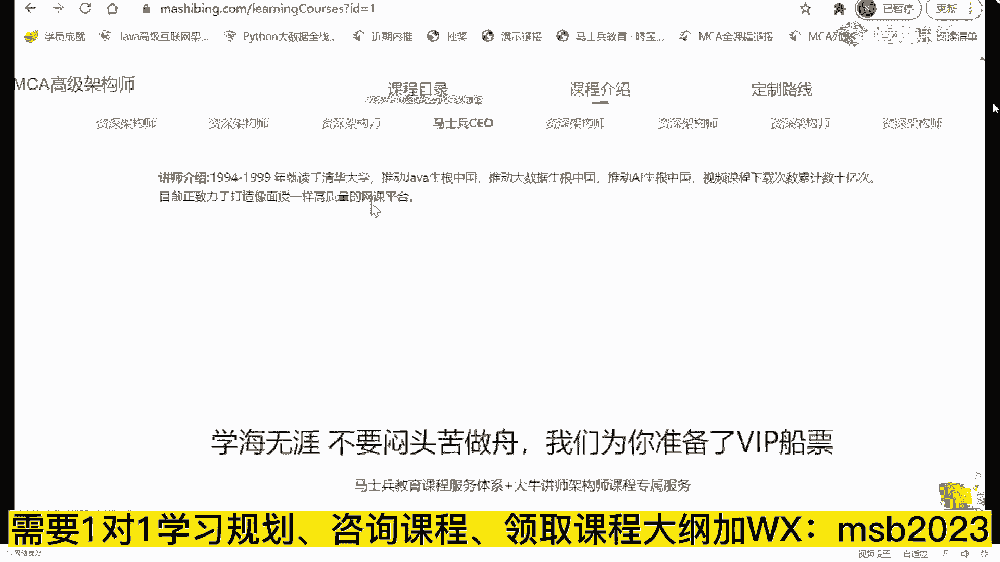

他的课程介绍里面，我们在这里呢做了一个自己的，非常粗浅的一个总结，但是大家伙可以作为参考呃，首先我跟大家说一句啊，这个p5 是一个什么，直接p5 是一个入门级别的大厂，入门级别的直径。

实际上以前阿里是有p4 的实习生呃，但是后来p4 这个直接就不招了，现在基本上就是p5 ，p5 是什么样的人，会是p5 呢，按理说应该是0~3年，他们认为你是p5 好，也就是说你社招3年以上的。

那直接就是p6 了，但是到在目前的情况下来说呢，大多数的情况下，作为p5 是你刚刚毕业的应届生，应届生往往是定级p5 呃，不管你是本科生还是研究生啊，我这里没有提专科，因为专科批我这个直接你进不去好吧。

刚刚毕业的应届生，然后呢大概在你工作，你比方说你最开始的时候没有进到大厂里面，你进到了一家中小厂工作3年左右，哎你社招通过社招进到大厂了，这个时候往往是p6 ，然后你在你项目组里头。

慢慢成长为带那么四五个人，这个时候你往往是p7 ，当你负责完整的整个的项目组的时候，我告诉你，你这个时候大概你手底下是几十个人的，这样的一个一个一个规模的时候，大概就是p8 了。

当你手底下有不同的技术团队，包括业务团队的时候，你这个时候就是p9 ，那个如果从呃薪资的角度来说，p5 的薪资的话呢，大概是20万~40万左右，那么如果是从。

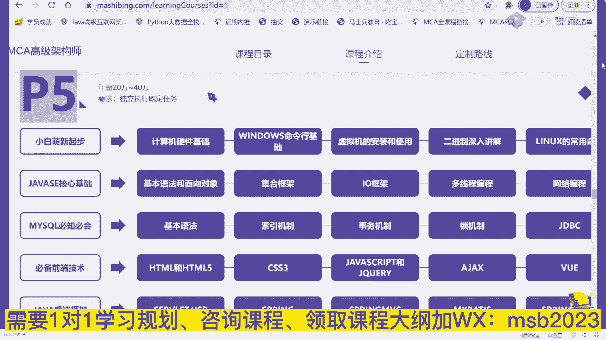

p6 的薪资来说呢，大概是40万~60万左右啊，呃如果是p7 的话呢，大概是50万~70万，但是这时候是有股票的，就是大部分p7 是有股票的，只有少部分没有，因为阿里有一种文档，p7 也比较好玩啊。

他专门写文档的，他那个薪资就低很多，50万~70万，大概再加上800~1200股啊，那个股票比较值钱的时候呢，这个差不多p7 的薪水能拿到120万左右，顶薪，哎我讲到这。

有没有同学想想看看那个p7 的简历的有没有，有没有，有的话，我给老师扣个一来，3年以上还可以面p5 吗，3年以上你就要奔p6 去了，你为什么还要面p5 啊，干嘛这么看不起自己。

我我我给大家看一个非常牛逼的简历啊，这个是顶薪的，120万年薪的简历，我找一下，这个呃这哥们儿当时是29岁，拿到的是阿里的p7 plus，它不叫p7 ，这个叫p7 plus。

我一会儿给你解释什么叫p7 plus，p7 plus那个呃100就是80万的正常薪资，外加40万每年的股票，就类似于大概的估算的值啊，120万年薪呃，你们也可以呢读一读，看看看这个简历呢。

自己能不能罩得住这个简历呢，如果你仔细读的话，其实你会看得出来，那个这里面最重要的最值钱的点到底在哪儿，5年java开发经验，其中3年以上全是大型系统架构设计经验，3年以上团队管理经验，分布式高并发。

高可用大数据量的系统架构设计和研发经验，好了，这是最值钱的，当然目前政府的什么注册用户多少，日活多少，日访问量多少，这种的比较吹牛逼的啊，这实际当中的数据很可能到不了这么多，对开源源码有过深度阅读，好。

从这儿呢你大概可以看出来，p7 到底是一个什么样的水平，架构设计，源码阅读，这就是为什么我在课程里面，会给大家这么设计的原因，明白吧，嗯就是老师的课程设计，不是说随随便便给你设计的啊，为什么要读读源码。

读原理，为什么要做架构的设计，其实就在于这就是希望你们能达到这样的水平，但不是说每个人的薪资都能达到120万，不是那么容易的呃，取法乎上得乎中，取法乎中得乎下，你的目标定的高一点，哪怕没有到。

你跟其他人相比，你都是赚的，你的目标本身就定得非常低，我今天就吃掉一个饺子，你就算达到了，你也就吃了一个，我今天要吃100个饺子，然后就算没吃完，我吃了50个，那我比你这一个也要牛逼的多得多好。

这是它的一些个技术站，这些技术站咱们课程体系里全有呃，可以这么说，我的很多的课程的设计，是根据咱们同学们遇到的各种各样的问题，来设计的，那个这这这这全是一堆一堆精通了啊，这个你放心啊，呃其实看上去很难。

但是呢不是想象中的那么的难，无非就是你需要掌握架构的一些个技术，选型是吧，当然最新的还有power啊，然后呢搜索上的一些技术选型啊，这种那种呃这个持久化的一些技术选型，缓存的一些技术选型等等，就这么多。

加上一些底层的知识啊，呃他这个呢还没有写算法，写太多啊，其实还需要有一点算法的知识就ok了，这背后究竟付出了多少，不要不要羡慕别人，我有的时候会说可以拿别人来举例子，但是呢每个人的路啊。

每个人的人生路它都是不一样的，你不可能完完全全的复制另外一个人的人生，跟自己比就ok你比自己更强了，今天我比昨天强一点点，明天比今天强一点点，时间稍微一积累都不用长，几个月的时间。

你就会发现你已经脱颖而出了，其实就这么简单，那个，你们你们你们，你们想知道那个那个那个他现在的一个状况吗。

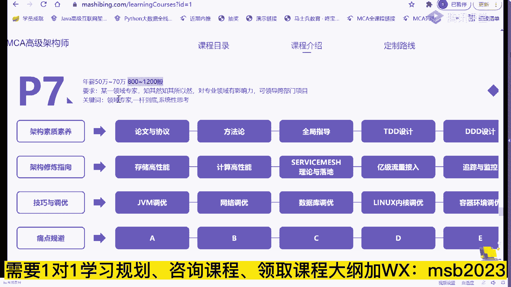

这个这哥们儿，是是咱们史上最牛逼的一个学生啊，史上最牛逼的学生，你找一下他现在的一个状况，呃这里是大概有1000多位我的学生，然后做的一些个小小的总结和聊天的这个过程，你找一下啊，嗯就是他。

呃这个呢是他那个最近然后拿了5000万的股票，套现之后，然后从公司离开啊，做了一个小小的总结，就是p7 的一些一些一些内容啊，p7 说到底是硬通货，是个分水岭，这里面需要你掌握什么，需要你掌握什么。

需要你掌握什么，k大家可以到这个网站上去访问访问看看，这里面都是很多同学非常真实的聊天啊，你们看看就知道了，那个呃当然还是那句话啊，就是这种的比较极端，我也绝对不会说奢望。

说我们每个人都能达到这样一个水平，我在他这个年龄的时候，也达不到这样的一个水平，好吧，所以大家呢也不要说太羡慕，这个也没也没有意义，但是呢最起码这份简历会给你指出方向来，我们可以朝这个方向去吧。

我们今天啃下来，其中的一小点儿是不是就进步了一点点，我说今天我们甭啃别的，我今天啃了一个分布式事务，这东西不难的，咱们一堂课里头呢，差不多你花个三天，顶多花个三天左右的业余时间，就能把这搞。

就能就能够把这个搞定，你知道吗，我们是不是搞定一条，我今天不干别的，我就聊一个自动化部署，我今天不干别的，我就把docker给搞定了，你想想看这个三天，这个五天，然后那个七天加起来的话能有多长时间。

最重要的是你根本没有必要每一个都全部精通，面试的时候，我说过了十家乘两家就可以了，不用面面俱到，这大家能听进去吗，天神下凡对什么学历啊，学历相对比较好，985，浙江大学，浙江大学是985吧，嗯肯定是啊。

当然我说到这很多学就开始给自己找借口了，老老哥，我是大专，所以我不如他很正常，因此我又可以安心的躺平了，我说我再给你说一遍，我说他这个案例不是要你跟他比，而是要你建立起来跟自己比的感觉。

你今天要比昨天强一点，以他的这个技术为目标，你能听进去吗，就是你天天跟比尔盖茨比，那你这辈子永远完蛋，你天天跟埃隆马斯克比啊，你这辈子就别活了，所有人都别活了，对不对，跟自己比，我今天比昨天强一点。

明天比今天强一点不就成了吗，能忽悠大钱的背景肯定背景必须放光，这就是背景背景决定论吗，来我想问你那个马云背景怎么样，马云985的对不对，马云是杭州师范的大专生吧，如果没记错的话，任正非是原来当兵的嘛。

对不对，英语老师对啊，所以不要找借口，我跟你说，你所有的这些这么说的，其实都是在暗示自己，我没有他的硬件，所以我有自己的不成功的借口，其实就是这个给自己一点心理安慰吗，我是种田的，对，好了。

但这个就比较夸张了啊，我们想想想起来了，拿这个举个案例呃，这是一个p7 的薪资，那p8 的薪资的话呢，多数人应该是到不了的，呃到目前为止，我直接培训的学生里头还没有，还还目前啊我跟大家说。

确实我还没有能把一个人直接嗯，学完咱们课给干到p8 的，i'm sorry，我这个还确实还没有干到，因为p8 呢真的就很难培养了，他的这个薪资呢大概是200万呃，就是按照官方的说法。

应该是120万~200万啊，这是这样的一个薪资，那么这里面呢就有很多很多的非技术的因素了，技术层面我完全可以让你到这个水平，但是非技术层面我也在尝试，目前呢也有一点点好一点的的好消息了啊。

就是这这这这种层面的也，我我也在给大家做尝试，就是课程体系里面，为什么给大家要增加团队的管理课，产品的管理课，其实呢就是想让大家在你以后的职业生涯里头，走到高端的时候，也能够还有空间呃，到现在为止。

我是我们现在有一个学生啊，我在我的微信里已经把它给置顶了，我只有一个学生，他已经灭了七面了，明白吗，他现在念p8 ，他灭了七次了，已经灭完这七次之后呢，还有第八轮的交叉面。

就是为什么说那个那个那个那个那个那个哥们，说那个我靠，这灭了，灭了七次了，还没这个p8 定级太难了，确实非常的难，然后呢还有最后一轮的交叉面，因为什么，因为他要求的定级太高了，所以就一一轮面一轮面。

一轮面一轮面，然后很多人都认为你确实到这个程度之后，才会给你这个职级，当然这个职级到来的时候，就意味着200万年薪了，ok，据我知道的，从京东呃跳到高德的，就是那个有一本书叫一级流量。

我不知道你们了解过没有，那本书，它的作者就是从京东跳到高德啊，我当时微信联系了，说给咱们来讲讲课，然后呢高德实在太忙了，高德可能是阿里里面所有最忙的bo，然后那个没没有时间讲课啊。

不然的话呢把他请过来讲讲课呃，从京东跳到高德，大概是据我了解，应该是这个数400万，所以小伙伴们你首先要敢于想，就是你要知道呢，这个世界上是有好多好多潜力的，你首先你你的潜力呢也不要想那么高。

我现在拿12万好，我明年的目标能不能拿到18万，听懂了吧，这就是一步一个脚印的扎扎实实的，今天比昨天强的，非常科学的一个一个目标的顶级，ok怎么说呢，机会有的是啊，在这里呢大概是1000多份。

1000多位的同学啊，好同学说，老师你做假放心，老师这里的全部的案例要有一份是假的，十倍学费赔付给你，你随便找，你想找任何一个人，说他的那个那个找他联系方式，只要他同意，我都可以给你联系上啊。

嗯怎么说呢，这里面的案例呢就是不同的人，不同的案例都多的是有顶级的，我刚才介绍的都是顶级的案例，当然也有呢刚刚入门级别的，我还是那句话，就是路是一步一步走的啊，比方说入门级别的像什么样子的呢。

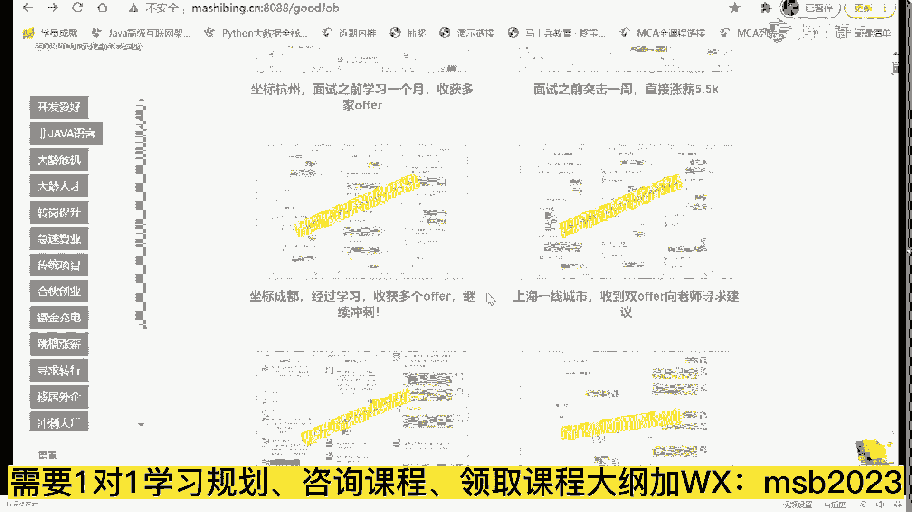

这种的最开始呢原来是拿8000块钱，然后学学四个月给拿到1万，14000还可以吧。

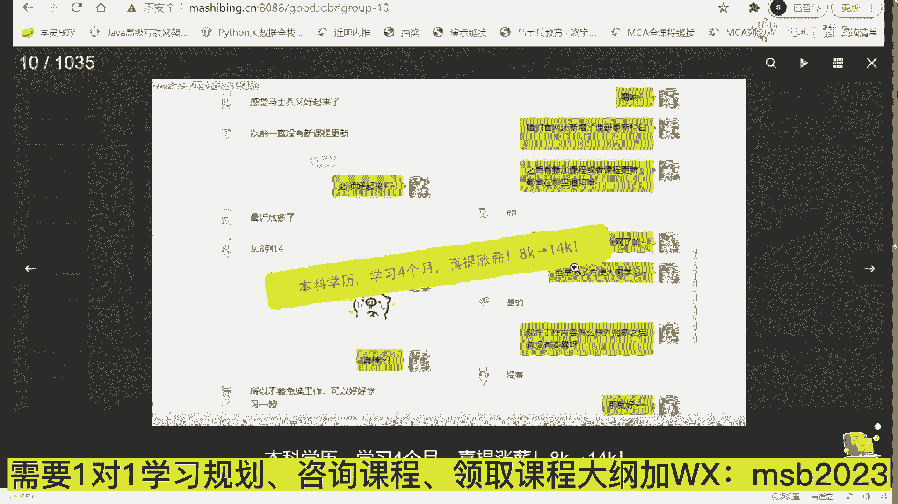

1年就7万多呀，这就是学习的收获啊，当然扯得远了，我们翻过头来再来看看啊，就是什么样的人可以到p5 ，什么样的人呢可以到p6 ，什么样的人可以到p7 ，他到底是都需要哪些哪些东西。

呃我刚才呢给大家讲了一个概念，这个概念呢叫什么呢，p7 plus，你们这个你们知道这个plus是什么意思吗，有没有知道这个plus是什么意思，s p p最高嗯呃我想问大家一个小小的问题。

那个这里有一堆p6 ，1233个p6 ，我要在这三个p6 里面挑一个人做晋升，升值为p7 ，来你告诉我谁会升上来，谁会升上来，当然有同学跟我就开玩笑了，开始是吧，长得漂亮的，平跟那个考考评官有一腿的。

跟考评官关系好的，首先第一点呃，高级别的晋升并不是只有一个考评官，也不是只有你熟悉的那个呃，第二一点，长得漂亮跟漂亮，长得漂亮确实有点优势啊，但是呢他肯定不能不是决定性的因素，好好听我说。

如果我要在三个p6 里面挑一个p7 出来，那么我一定会找那个优先，已经开始做p7 事情的人，能听懂吗，我再说一遍，如果我要在一堆p6 里找一个p7 出来，我一定会找那个已经开始在做p7 事情的人，好了。

这个就是p6 plus，同理那个就是p7 plus，就是我为什么说在你们平时工作的时候，要多承担一些，多做一些，不要老搁那斤斤计较，我给我这点钱，我就干这点活，我多干点我就亏了。

我我是真的遇见过这个这样的人，这样的人最终的结果就是滚蛋，没有别的，所以让自己就是简单说提前一步好吧，来听进去的，给老师扣个一啊，讲点儿，今天感觉讲的比较碎，因为主要我没有给大家解释为什么自己体系。

典型的自己体系什么样，以及呢他的一些个各种的说法啊，我简单跟大家说一说，也就是大概是一个什么样的，什么样的，什么样的一个一个一个，一个水平吧，就是p5 呢他大概做了一些哪些事情啊，p5 大概是这样的。

它叫做，直职级的入门就是新兵啊，给你一个模块，独立完成就是给你个程序，在别人的指导之下，我告诉你啊，这个这个东西要完成这个业务诶，然后告诉你用什么技术好了，你能独立完成这个基本上就是就是p5 。

听懂了吧，然后呃作为p6 来说，就是你独立开发某一个这个不能叫模块啊，就是p5 来说就是某一个模块的分支，就是一个小程序啊，独立完成你自己的一份呃，编程的工作就这样简单。

那么p6 呢可以独立完成一个模块模块级别，那么p7 的话呢实际上就是项目整个项目级别，你可以带领团队来完成整个项目，好吧，呃基本上大多数人呢是集中在这三个职级啊，我目前只有一个学生在冲p吧。

他冲不冲得下来，冲不下来，我会告诉大家冲不下来的话，我也不会跟着吹牛逼啊，那个呃作为p5 来说呢，一般来说我刚才说过了，就是应届生，所以呢你社招生呢也就别搁那玩。

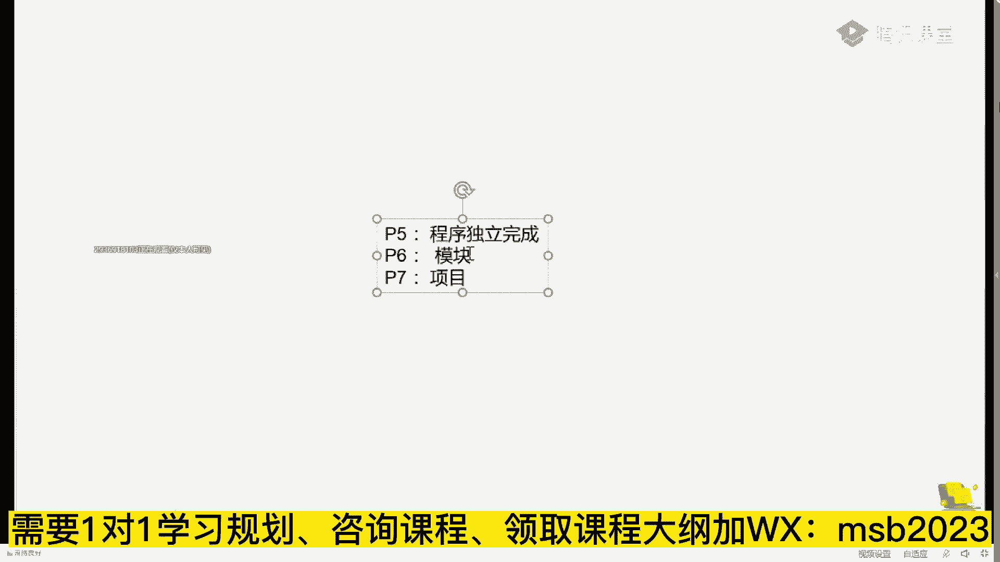

什么这种这种这种玩玩屁股了，这个外包能去吗，来同学们外包能去吗，每每天都会遇到这样的问题，老师那个外包面了一家公司啊，中软国际这个能去吗，有同学说不能工资高就去，还有同学说，各位同学们。

我觉得问这种问题的呢，这就是我我我再推荐大家一本书叫批判性思维，批判性思维，那这不是输了，就是一种思考方式，同学们听我说那个呃，你你们了解批判性思维的本质是什么吗，就批判性思维的本质好多。

好多人说说我看到一个想法的时候，我要怀疑他到底对还是不对，我要做一个对对对，杠精啊，这个hahy说的特别对啊，杠精批判性思维就是杠精，但实际上这不是批判性思维的本质，批判性思维的本质叫做批判自己。

注意不是批判别人，是批判的自己，是你自己有某一个特定想法的时候，一定要多方印证，好好考虑一下自己的想法，有没有什么pillow和bug是批判自己的思维，大哥这杠精是批判别人的思维。

所以好多人把批判性思维这件事情理解错了，所谓的外包到底能不能去，我就觉得特别好玩，问这问问出这句话来的人都觉得特别好玩，你知道为什么吗，我就想问你为什么不能去，难道去外包会死人还是怎么着。

所以这句话本身问的就有问题，所有问这句话的人都被我怼回去，我说你有没有其他选择，听懂了吗，假如他说我有一个外包中软，我另外还有一个东南亚的机会，那我应该选哪个，那我外包能不能去，你得这么问。

你有没有其他选择，如果你只有一个选择，不要提外包啊，你就是凤姐儿，你也得老老实实的该进洞房，进洞房好吧，但是你有两个选择，一个是凤姐，一个是杨超越，那你该选谁，老师给你提建议好，不开玩笑。

我们说外包这件事情到底能不能去，当然能去，为什么不能去，外包的很多很多人的这个呃，他进大厂之前的经历就是外包，那还需要你建议，万一有人选封顶呢对吧，外包当然能去啊，就是有好的外包的话。

他做的项目也是非常不错的，他的技术也不是白给的，天天还加班是吧，给的工资又低，使劲让你加班，你说你的技术能不练吗，得使劲练，听懂了吧，所以可以去，但是能能不能去，其实要有对比的，就是你有没有其他选择。

没有其他选择一定要去，为什么不去外包有方方面面的形式，比较有名的，像中阮了博宴啦这一类的，其实好多大厂也是认可的，当然还有一些，比方说有一类外包华为的ood德科，这个大家知道吗，德克主知不知道。

嗯华为的ood，现在华为的社招，不好意思，都从德克走，华为是让你想进，必须先进o d必须先进那个那个外包，ok外包能不能去，当然可以去，为什么不去啊，多个选择的时候再来问这个问题好吧，不要歧视外包。

外包没有问题的，他的好多的技术，用用的技术跟你真正的甲方没有区别啊，最重要是技术过硬，就完全可以去，华为社招不是停了吗，呃准确的解读，我给你解读一下华为的社招现在什么样，想认真听的，给老师扣个一。

我给你准确的解读华为的社招，华为社招现在是这样的啊，第一应届生没有停，985长呃，那个常春藤好吧，第25年以上的没有停，就是那些高端岗没有停，技术专家这种级别的没有停，停的是什么，0~5年。

大一11~5年这些，那么这些如果想去的话，先去德科，先去o d，然后ood呢，每年有百分之多少的机会进到华为本部，我忘了啊，大概是有百分之几十的概率进去，听懂了吧，权威解读啊。

因为我们刚刚跟华为达成的协议合作协议啊，给他内推，老有同学说我现在年龄大了，今天聊一个大的话题，就聊最后一个吧，就是你年龄大的，我跟你说年龄还大，技术还差，管理也不行，空间已经被挤得非常的小了。

我该怎么办，来同学们有没有，这其中有一个或者多个问题的老师，扣个一好吧，年龄大有多大，你们来来来，各位各位认为自己年龄大了，敲出来，我看你们有多大，年龄30 33，34，22 22，你搁这扯淡呢。

46 29，28，25，49，34，43，ok呃同学们，那个36岁以下的，你就别跟我这聊，年龄大了好不好，那个年龄还很年轻很年轻很年轻啊。

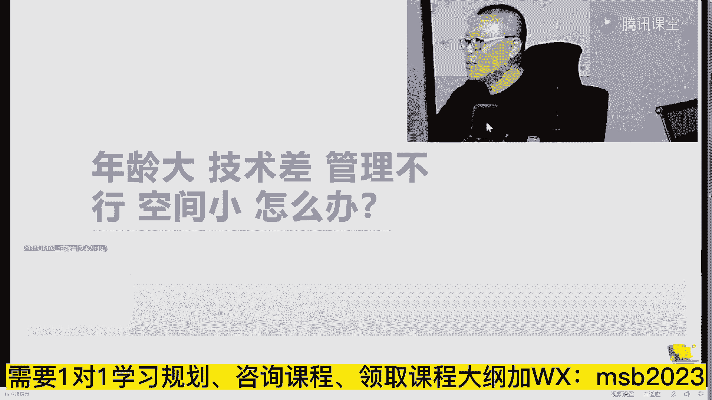

呃我们厂长别别的，我就不跟你说什么褚时健啊，不跟你说什么邓，然后不就不跟你说，任正非40多岁才创立华为，还差点破产，对不对，那个那个那个马云cs才30多岁。

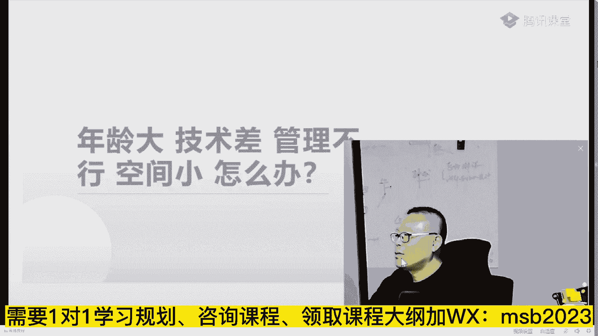

就是你正当年是正当年的时候，麻烦你不要放弃啊。

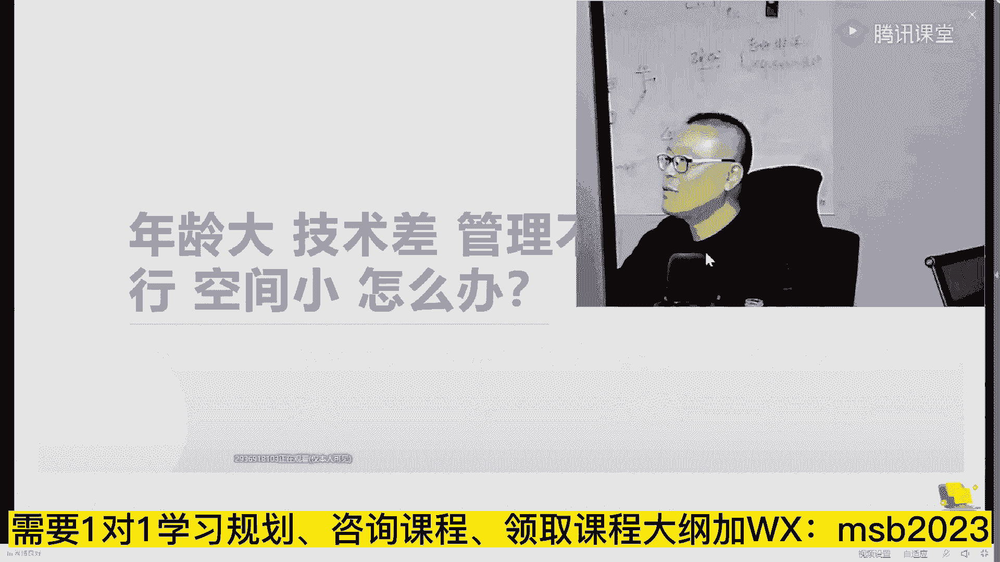

有好多人说我35了，我以后怎么办，感觉要死了似的，以后就得去开滴滴，开饭馆了，大哥远远不是这么回事，课程体系里面有两位老师啊，我推荐你们去听一听，听一听。

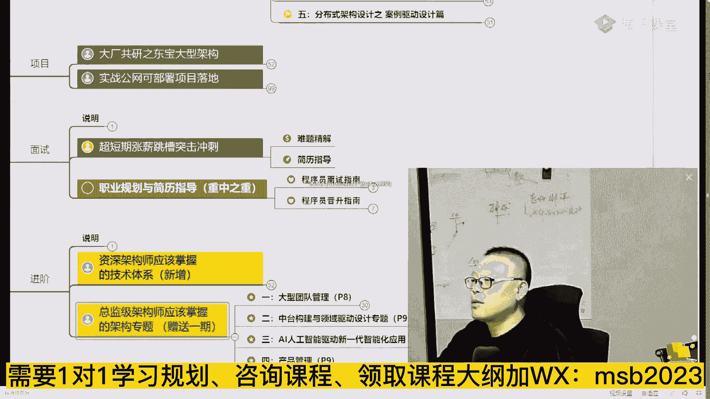

跟他们跟他们交流交流，首先第一个是讲这个课，就是大型团队管理的p8 课，它本身就是p8 ，然后呢那个现在是38 九岁，应该快接近40好吧，现在依然是在那个团队里担任很核心的角色。

然后年薪依然是那牛逼的很啊，那就不不跟你说了，然后这哥们儿是已经40多岁了，ok p9 p9 的老师已经40多了，呃目前呢在那个也是一家大厂，我就不说他的那个那个那个背景，就是离开阿里之前p9 。

然后到新的大厂之后担任更加牛逼的角色，还是这句话，就是我最最开始就跟大家说过一句。

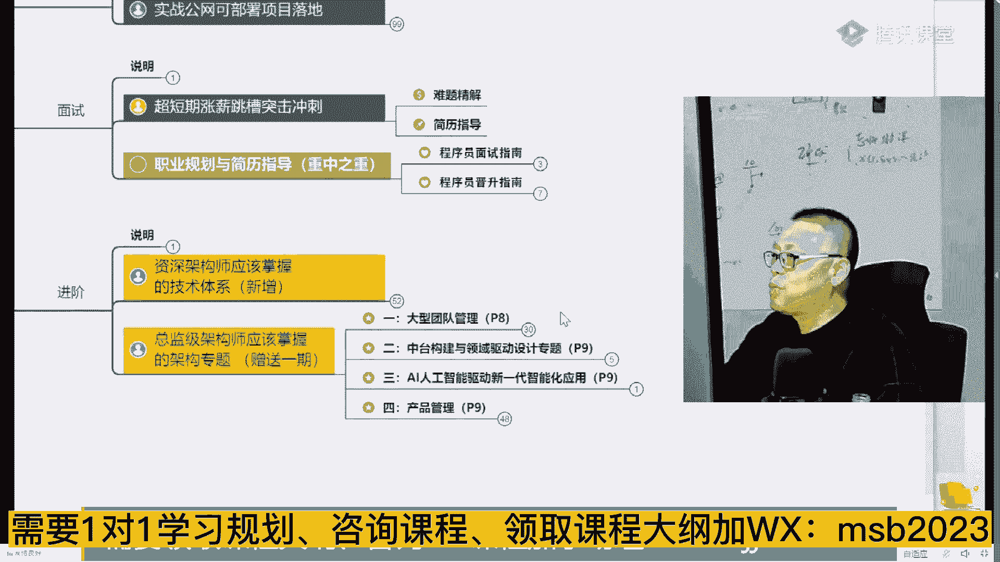

年龄大这件事情一定如果你现在有危机，一定是你原来规划的不够，学习的不够，提升的不够，这点大家能认可吗，如果你学习够了，提升够了，你现在具备了你这个年龄的人应该具备的水平，你怎么会没有空间。

他一定是有空间才对，当然有同学说，老师我已经这样了，我下面该怎么办，首先调思想，你还要一定告诉自己，我还有的是空间，哪怕就是这对你来说，这个鸡汤它也是一种正面激励，我再加一个年龄又大，技术还差。

管理也不行，空间还小，还是女生有没有感觉没有年轻人的活力了，还是女生对。

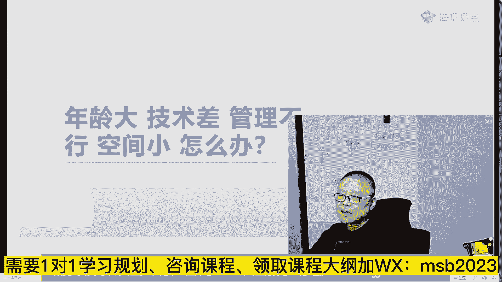

看几个小案例，看几个小案例啊，我找找几个女生的案例，女生进入美团拼多多京东，这是35岁的，40万年薪，也干到了70万，还可以吧，其实35岁的很年轻很年轻的啊，啊这个这个超级印象深刻啊。

这个这个是38岁的这个这位这位这位姑娘，我们是印象超级深刻，因为是给她费了太大的劲儿了，才把她给带出来，但是她带出来，他现在很牛逼的，现在又跳第二次槽，然后还嘲笑当时他们项目组的人特别弱，你你明白吗。

这是他当时的肺腑之言，我当时那个还还还挺感动的，非常感动，说说这句话，就是老师的成就感，就在于这特别想在公开课的时候多影响一些人，职业生涯中尽快走出迷茫，但人家会以为我是托儿哈，暂时只能忍着。

如果你觉得你的比他还差，那我就也就没什么太大脾气了啊，那个你们说，这个是39岁的大龄的程序员，我首先给大家一点啊，给大家做一个就是大龄的小伙伴们，给大家做一个做一个呃，这个这个这个小小的建议。

你们一定要听进去啊，嗯大龄大龄的女程序员，我觉得应该有一个这是大龄程序员，34~50的，也有一个40多岁的大龄的大专生，大龄的跨行程序员疫情的嗯，有一个40多的，但忘了是40几来着，43，43万。

还有一个40 40几岁的来啊。

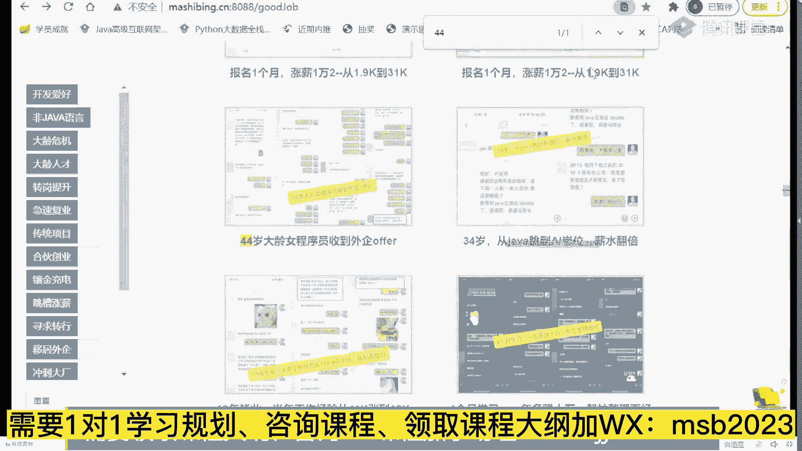

这个这个呃，这个姐姐是44岁女成员，然后收到外企的offer，那个，这这他他搞定工作之后呢，也是肺腑之言啊，我希望给大家敲响一个警钟，你可以不跟老师学没有关系，但是麻烦你保持进步好不好。

这次找工作时间提醒提了醒，不会在温水煮青蛙了，他的这个，怎么说呢，他最后啊实际上还涨了新了，我不知道大家看看出了没有，鼓励一下那些大龄成员，我43岁女生薪水跟大厂不能比，生活工作已经拿了外企的研发薪水。

差不多选了这个，ok我问他就是那个薪资达到了预期没有是吧。

我说达到预期了，怎么说呢，你相信我一点，就是当你开始正视自己，心态放正，然后呢放积极了之后，开始改变自己之后，你一定会有收获，这个收获可能会大，可能会小，可能你自己没有涨，甚至没有涨薪。

但是呢你是不是心态上已经放好了，人是一个很好的心态呢，人这一辈子就这么几十年的，你保持一个很好的心态，也是一个很好的一种收获的，但是你只要心态好了，好多事情就会变好，你不信你试试看那个。

作为大连的小伙伴，我给大家一个建议，我不希望大家伙儿呃年龄很大的同学，38 九岁找到我，说老师你能不能给我找条路线，让我进大厂，大哥这是这是这是这是非常难的，老师目前规划了好多好多人进到大厂。

这个确实是啊，我们我们就从这里面搜大厂的名字，你就你就能找得到啊，就比如说你就阿里，这俩是五五十三五十三个呃，阿阿里的就是我们公布出来的啊，搜字节这个打12个，然后搜那个那个呃呃美团就是36个啊。

搜京东啊，43个，就是说其实呃进到大厂这件事情，在一个合适的年龄，合适的背景的情况下，老师帮你稍作规划，稍作指点，你就进了，但是呢有的人是强人所难，他非得说我学历又不怎么样，然后技术积累还不行。

现在年龄还大，38 九岁，40多了，老师你能不能帮我送进大厂，如果你送进大厂，哎，我就报，我就报名学习，你别跟我这扯这蛋，你爱报不报，你行就行不行就不行，你不行，你报了也不行，你行的话，那老师判断你行。

他他就概率就高的很，就一定能行，呃，同学们听我说那个理智一点啊，如果你提出这样的要求来，说明你没活明白，38 九岁了还没活明白，你这是人生的失败，这时候你应该对自己的最理智的说法，是一个什么样子的。

认真听，应该是建立在提心上，提高收入上，这是最简单的提升你生活质量的办法，就是提收入，当然还有一种呢就是你追求你下一步的呃，更好的职业的规划，比如说我想进外企，我想进到甲方企业。

我想进到那个非it类的这一类的企业里头去，然后考虑我后面养老的事情了，这个也很也很务实，也很科学，也也相对靠谱一些是吧，提收入这件事情，老师有的是办法啊，你年龄多大，老师也能够找出办法了。

能让你把收入提上来，这是比较简单的，不难，可以这么说，报名马士兵教育的还没有说薪资涨不了的，就是多少的事儿，少的也是5000以上啊，低于5000的就太少了，时间维度3~6个月左右还可以吧。

打个牛逼出来好吗，没有一个啊，没有一个w，说说完完不成这个任务的，那个，怎么说呢，就是你你把你的当，你把定位定位在题型上的时候，老是办法和手段就多了去了好吧，哪怕就是让你搞点副业，你也能把薪资提上来啊。

当然前提是你要保持正向的进步的积极的心态，这样才可以，做出改变，有一些那个年龄比较大的小伙伴啊，每个人的情况跟每个人的情况不一样，所以年龄比较大的时候，我就没有办法找到那种普适性的东西了。

就是没有办法说，我给你一个像那个嗯那个那个计算，计算机系的这种这种学生啊，这个呃本科的这种二二本的三本，二本的，一本的这种的进大厂的路，我们是没有办法找到，找到这么一条普适性的路呢。

这只能是每个人的问题，每个人分析啊，当然这个就比较麻烦了，麻烦一点好吧，进大厂不也是为了钱吗，我觉得你这个人生的格调，麻烦你稍微往上提一提，不然你这辈子会活得很痛苦，钱是赚不完的，也是赚不够的。

有多少钱你永远也是够不了的，你如果只是盯在钱上，那我觉得这就是你将来痛苦的根源呃，让你这一生活得充实一些，格调高一些，你会发现钱是自然而然就来了，好不好，把你的目标稍微定的高一点点啊。

进大厂的目标是什么呢，实际上是为了你更好的一个职业规划，职业的学历啊，就是职业的职业的一个经历，你的你从大厂出来之后，有好多中小厂抢着要给好多钱，也也要明白吗，嗯给大家看一个内推的。

111个一个一个小案例，内推呢我一般都不怎么给大家展示，主要是什么呢，呃内推这件事情并不能够让大家伙儿说，我降低学习难度，注意这是两回事儿，呃，这是字字节找我们做内推啊。

最近只要我们做内推的其实已经非常多了，就全国的一线大厂呃，我们都有都有渠道内推，这不是说那种吹牛逼的啊，就老师这儿不跟你们吹这种不靠谱的牛逼。

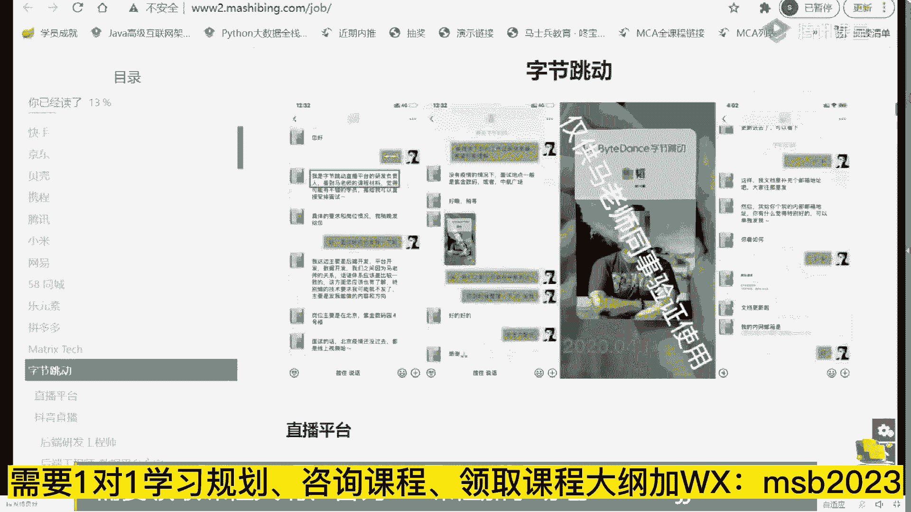

这是我们大概3月份那会儿。

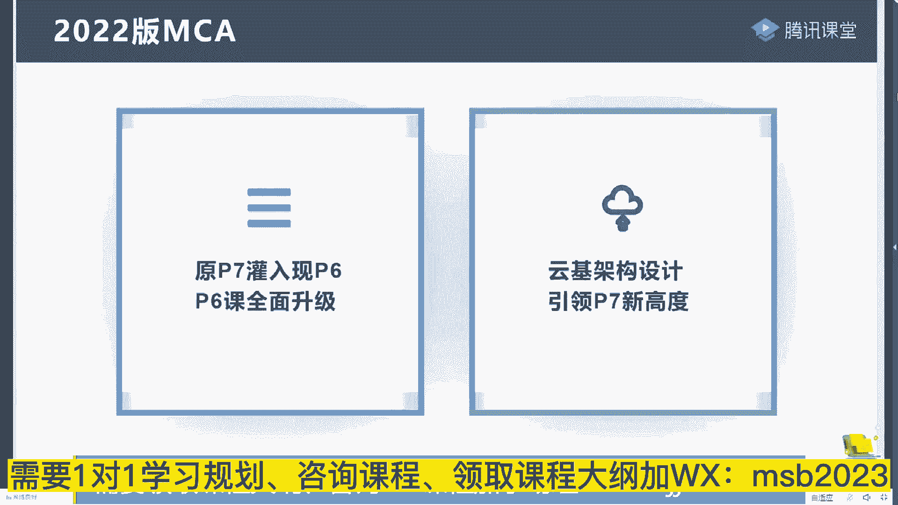

疫情还没有这么严重的时候，我们跟那个呃微软，amd和京东联合举办了大学生的编程大赛，然后呢这个呢是我们带给京东做培训，呃，这是呃编程大赛的现场，然后在3月份的时候，我们和小米和百度，还有京东啊。

京东当时没有没有没有来人，因为他们疫情不允许出来，当时就在我们的现场啊，我们自己公司的内部现场做的招聘会呃，有的人呢应该是参加过啊，就是内推的渠道呢，老师这有一大堆一大堆一大堆的，就是你想进哪个大厂。

只要你水平够，我判断你水平够，这个内推的渠道非常的通畅，但是前提是你的水平要高，能听懂吗，所以内推呢我一般不太使着劲儿的说，我们有内推，我们有内推之类的，不一般不一般不会说这个那个怎么说呢。

他不会降低你的学习难度，你也不要指望着说你学习的程度不够，老师能把你推进去，这不可能的，一定是建立在你应技能过硬的基础之上啊，我刚才说的是什么呢，我刚才说的是，当你有了大厂的背景之后。

像这一类的非it类的大厂，那给的年薪是相当可观，龙湖地产年薪150万以上，你说他是t类的吗，她也不是谈工作会很累吗，也不会很累，但是你你要是有大厂的背景，我是美团出来的，我是阿里出来的。

我是和他这个比较相关的，比方说e r p拥有出来的，ok这是特定相关了，就属于ok我是平安出来好，你就有机会能够到这种企业里头，拿很好的年薪了，这是年龄大一些的人的，另外一条比较不错的路线。

不知道大家听进去没有，作为咱们年龄大的小伙伴啊，我就在这街上字节上班嗯，那咱们离得很近啊，我在蓟门桥，你如果是在防空中心这边，那我们直线距离就23百米，老师联想可以算镀金吗，我个人认为不算啊。

联想i i don't think，联想是一个镀金，呵呵我在学院路这边，那离得很近啊，可以过来坐坐，聊个天，喝个茶，字节，最近离职了不少呃，我们曹老师跟字节的人大概住一个楼，住的比较多，t m e算吗。

tm是谁啊，银行算吗，嗯银行的用的技术其实真的一般般，所以不能算科技公司参观吗，可以啊，我们搞线下活动啊，因为近期的也在规划线下活动，只要疫情过去，我们会找一些咱们大厂里头的高p啊。

p8 p9 p7 这些人来跟大家做见面会啊，你就会知道呢，深入的了解，就是他们的职业发展到底是什么样子的，并不是所有人的学历都特别好，呃，我给大家讲那个架构设计的老师曹老师嘛，他就是二本的学生呃。

黄老师24 五岁，今年是25岁了，黄老师25岁呃，离开美团的时候，85万年薪牛不牛逼，这就是技术牛的人啊，他的一个他的一个可以达到的宽度，好吧，t m e啊，腾讯音乐，酷狗k歌，这不就腾讯吗。

腾讯当然是大厂了啊，25岁对，25岁，想看看他的简历吗，他当时到阿里的时候是24岁啊，大概是60万年薪，那会儿拿，大家来看看好吧，呃我我我隐蔽了一些他的那个隐私啊，当然他这个是属于纯硬核，非常硬核。

ok非常硬核超级硬，这个全是基本全是精通，怎么说呢，他在大学4年没谈恋没谈恋爱，没有出去玩儿，不打游戏就学习了，听懂了吧，所以他付出努力了，当然就会有收获啊，他24 五岁的时候，比我24 五岁的时候。

那那那牛逼多了，ok，嗯怎么说呢，就一分耕耘一分收获，老师能向你提供的就是让你少走弯路，讲到这儿呢，其实我们的课呢其实我介绍也差不多了。

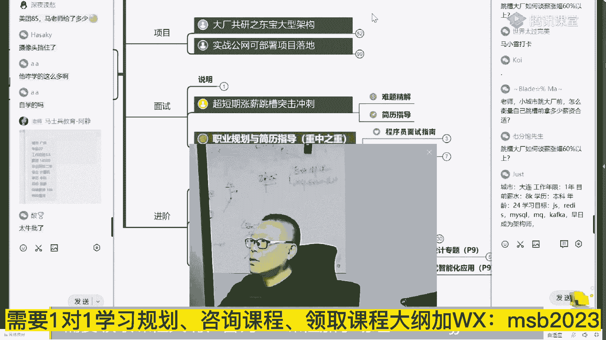

我也就不专门做什么特殊的广告了，简单说你想提薪的，你想进大厂的，老师早就帮你想的方方面面都已经非常透彻了，你也逃不出那1000多人的案例里头去了，你也没那么特殊，想多涨点薪水的。

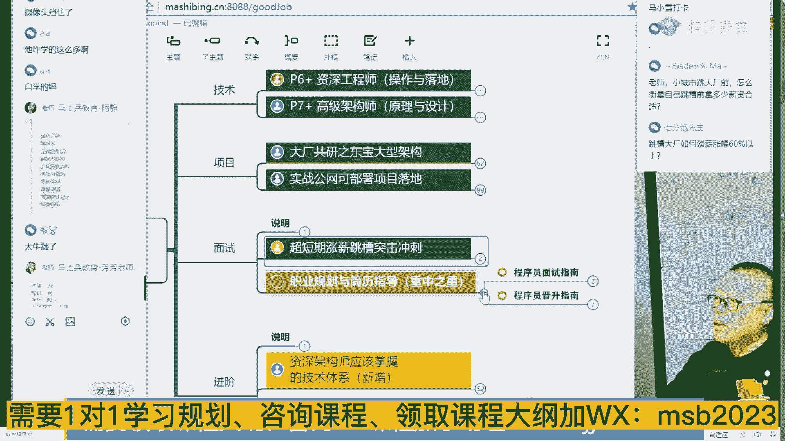