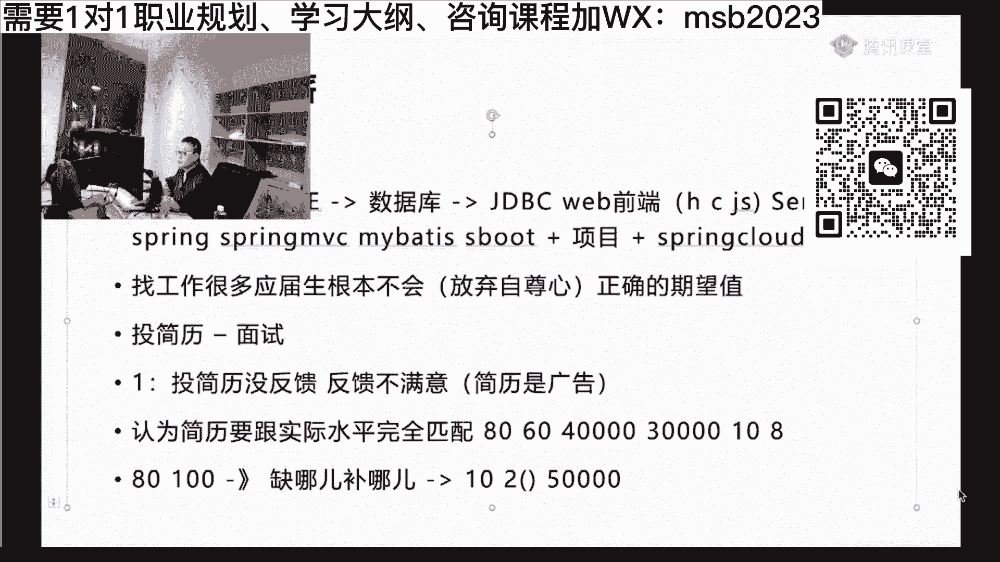
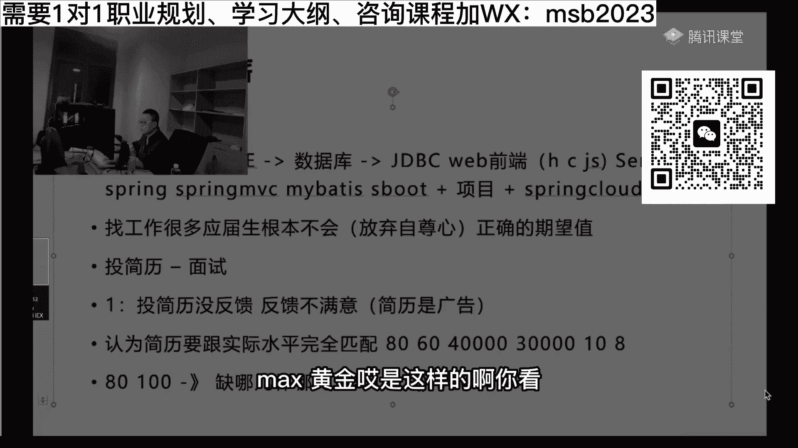
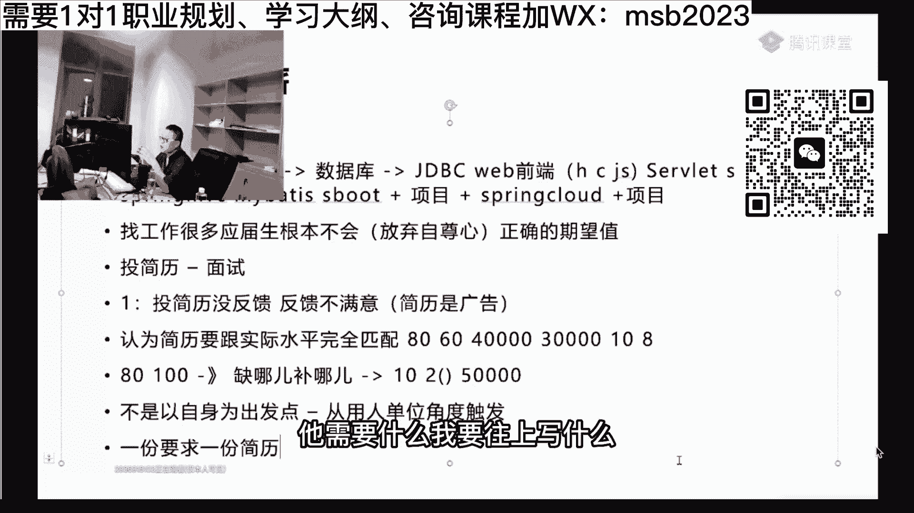

# 系列 6：P44：【2023】如果进行高效投简历？ - 马士兵学堂 - BV1RY4y1Q7DL

整个这件事情呢你一定要听进去呢，他的其实非常的简单，在我看来非常的简单，他只需要两步两步就够了，第一步叫投简历，第二步叫面试，各位兄弟们，你们好好想是不是本质就这两步。

但是呢很多人呢他第一步做出去之后呢，没反馈，来有多少同学是这样的一个情况，就说我简历扔出去，我没反馈，海投，如果你你你定你定点投放，没有人反映，你为什么不要还不要海投呢，是不是啊，同学们嗯。

嗯投简历没反馈好吧，一般多久才叫没反馈，多久谈不上吧，就是说没有没有人让你去面试，就是没反馈，能理解吗，这就是这个就是没反馈，甚至不知道往哪投，这个还有人不知道往哪投吗，你最差的是。

比方说你有一些呃公司，你特别想去的，你就找他的，上他的网站，找他的那个那个招聘的那个口子长去投就完了，听懂了吗，嗯第二个最差的你找找招聘网站应该知道吧，什么boss直聘，智联招聘等等，这些是不是呃。

第一个呢就是投简历没反馈啊，当然也包括说反馈不满意什么意思啊，找你的全是外包，全是中小公司，那那我想问你啊，你你们有没有反思过说你投简历，因为很多人投简历没反馈之后呢，他就会自己在那郁闷，他不想办法。

他是他是自己在那郁闷，搁那躺着，哎呀娘的那头角林没人找我，那唉算了，不投了，或者说在海投吧，再使劲投，其实很简单的一件事情，你好好想，简历的本质是对你自身的一个广告，就说明你广告打的不好，明白吗。

简历是你自身的广告，说明你广告打得不好，简历投出去没反馈，就是简历书写问题，没有其他问题，你们一定要记住这一点，所以你的第一步呢就是说如果投简历没没反馈，如果是这样的，改简历。

我们我我我我们为什么说说这个这个建议，大家呢，你你最好是跟老师练，因为老师没有一项服务是帮大家改好简历，这简历的真正改起来没那么容易，我们改简历的话呢，大概一般来讲啊，反反复复的。

差不多要三天左右才改好了，帮大家改好一份，那这份简历投出去可能就是大量的反馈，就是这个简历呢一定要投出去，有反馈，这个你的简历才算改好了，那有同学可能就会说说老师我简历，我我会的东西特别少。

我写投简历来，那肯定就是没有反馈，这是第二个误区，这是第二个误区，第二个误区是什么呢，第二个误区是认为简历要跟实际水平完全匹配，这是第二个错误认知，嗯这么跟大家说啊。

呃有有的人呢他的水平甚至说他不是完全匹配，他还要简历水平还要放低一点，他放一滴一点的想法是说我真正的水平，比方说是80，我写出来简历呢只有60对吧，那么别人问我的问题都是60的，我作为80的水平。

我回答60的问题，我叫做板上钉钉，我只要有人找我，我我面试就能通过，只要有人找我面试就能通过，我很开心，我受不到任何的挫折，我的自尊心呢也不会受到任何的打击，我不知道有没有同学犯这样的错误呢。

就是你真正的水平是80的，你的简历上只敢写60，有没有有这样的吗，有同学们有没有有的给老师扣个一有吗，有是吧，毛子嗯，然就是今天呢，我们大家111的分析各种各样的问题啊，如果你没有的呃，都没有关系。

你就你就听啊，看看后面有没有跟你匹配的，或者把你等我讲完之后把你的疑问告诉我，好认真听，其实你想想看这件事情你是亏了啊，是亏的，为什么会是亏的呢，比如说你80，我们讲假设你对应的水平是4万的月薪。

但是呢你你面试的时候面60，别人认为你水平只有60，最后给你的会是3万月薪，也就是说你4万变成了3万，你本质上是亏损了，但是你你的好处是什么，你的好处是面了十家，成了八家，你非常开心，这就是你的好处。

你明白吧，你那个脆弱的自尊心啊得到了加强啊，没人打击你，那么我们假设有另外一个另外一个是什么呢，另外一个它的真正的水平呢只有80，但是他写了100，他写了100，但是他写100这件事情呢。

其实他面试的时候会遭受到很多挫折，可能面一家同，不过两家同，不过因为别人问他的问题，很可能是超越他的认知的，那么他下面他下面来做一件事情，当然如果你有老师辅助你，你把你的面试的那个过程录下音来说。

老师哪个哪个问题，我认为回答不好，你听听看这个老师会给你反馈什么地方不好，这个是最好的啊，如果是说没有没有也没有关系，没有你就好好回来反思，今天问了我哪个问题，我现在没有回答出来。

那么也就是说我缺某一个地方，缺我的知识，知识版图上缺一块儿，缺哪儿补哪儿，那我就赶紧补上去，当下一个人再问到我的时候，我我一定要回答的比上一次要好，这点大家能理解比较简单啊，今天问了我个问题。

mysql调优没，我没答出来，那没有关系，下来之后哪怕零基报废掉，赶紧补，补完之后，下次再问到，我一定比上次好，这时候呢大概是会造成一个什么现象呢，差不多你十家里头有可能只能乘两家，这也是很正常的。

那跟上一个比呢，就是人家是十家乘八家，你是十加成两件，但请注意乘了这两家给你的薪资很可能是5万，你真是个水平还是4万，那么你想想看这两种的玩法，这两种玩法到底谁亏了，谁便宜了，第一种呢它的它会很顺很爽。

他会很爽，你懂吗，因为他感受不到挫折，他认为嗯反正就是面家长一点，是不是很会会会会非常的爽啊，那么第二家第二个呢它会不太爽，因为他遭受到的全是挫折，如果他这时候自尊心太过强烈，太看重自己自尊心的话。

很可能面着面着自己就没信心了，所以这是两种不同的区别，但是如果你想想看找工作这件事情，你不是你不是说同时为八个人同时工作，你只要八个人里头挑一件就可以了，这个是我从两家里挑一件就可以了。

所以本质上谁亏了呢，你自己好好想想看，这前后就差了很多钱，3万 5万就差2万出来了啊，现在学校里都在宣传大数据，嗯好这块儿大家听懂了吗，能不能听进去吗，嗯来关于简历这块儿，大家还有什么一些什么样的问题。

等于老师扣一啊，max王心问了个问题，问题说了个问题啊，挺好挺好的，我回答一下。

max王心诶。

是这样的啊，你看，来有多少人有有跟王鑫一样问题的老师，扣个一，他说老师如果铁了心就要去一家公司咋整，我跟你说，我遇见的学生很多里头是有是有这个想法的，有的同学是我铁了心就一心要进华为，我进不去。

我甚至都这辈子我都觉得没什么意义了，呃，还有的是我，我一直要要进那个那个某个城市的某个企业啊，挺好玩的，但是我觉得是这样的，同学们，这就相当于我铁了心要追一个人，追一个姑娘，不管她是校花校草啊。

不管她是那个那个那个，我这个王心凌还是杨超越是吧，你你听我说这是一个概率问题，就是说如果你铁了心要去一家公司，你的最好的办法是第一好好的准备，看看人家的要求是什么，达到人家想要那个水平，这是第一步。

你要干的，第二一步，我真心希望你看待这个结果，原因是什么呢，因为这种的概率性它它是一个概率问题，偶然性太强了，你赶上他，正好他就你想去的时候，他不要人，或者说正好你面的时候，他问了一个特别刁钻的问题。

你就没回答出来，其他方面你都满足，你就正好没赶上，怎么着，你就不活了还是怎么着啊，所以本质上这是这真的是个伪命题，去一家公司，就是要达到这家公司类似公司的水平，然后以这家作为首选，这如果真进不去。

没关系，后面还有一大堆呢，王心凌，后面还有一大堆的姑娘，杨超越，后面也有一大堆的姑娘，咱们选不了a可以选a减好不好，千万别在这上面犯那种轴劲儿好吧，真的没有意义啊，关于简历这一块呢。

所以我简历呢简历怎么写，这件事就呼之欲出了，就简历怎么写呢，下面我教大家一个原则，简历不是以自身为出发点，能听进去吗，你同学们，你们想想，你打个广告呃，一种广告是这么打的，说我有什么我有什么，我有什么。

另外一个广告是这么打的，说你需要这个我有这个，你需要那个，我有那个你需要我有那个要说，一个是站在客户角度，也就是用人单位的角度，一个是站在你自身处罚啊，我会什么我就敢往上写什么，我不会什么。

我就什么都不敢写，你说这两份简历哪个会更容易收到反馈，能理解吗，兄弟们，所以说从用人单位的角度出发，听我说最容易诱发人，让你去面试的简历是这样写的，这是理想的情况，你认真听，就是一份要求，一份简历。

每一个用人单位，他的强调的点很可能是不太一样的，呃你如果打开一份那个招聘的需求，有一有些用人单位强调的点很可能是高并发啊，多线程相关的处理，而另外一个单位强调点，很可能是云原生大数据的处理。

那么最理想的情况是，第一家我就着了重的，赶着使着劲儿的往那个高并发写，另外一家呢我就使着劲儿的往大数据写，能能听懂吗，兄弟们说，这样的简历他就一定一定是最容易得到反馈的，当然这个呢花精力花的是最多的。

所以大多数人都是用一份简历跟那海投也可以，并不是说不可以啊，但是你一定是要以用人单位的大部分需求，为出发点，那他需要什么，我要往上写什么，他需要什么。

