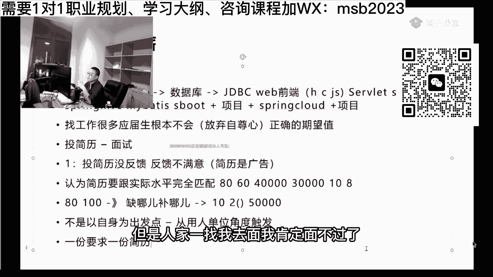
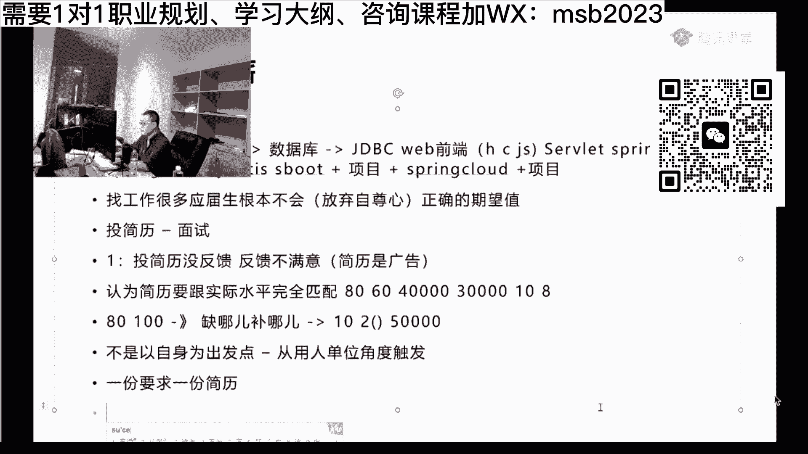

# 系列 6：P45：【2023】如何速成掌握技术点，拿到Offer？ - 马士兵学堂 - BV1RY4y1Q7DL

各位同学呢，我讲到这儿呢，可能有同学说哦，那当然了，人家要什么就往上写什么，那肯定又是容容易受到反馈了，但是人家一找我去面，我肯定面不过了。

因为我还没掌握吗，我知道你们的想法，但是掌握一份一一个技术，一个技术点，这件事情真心想的没有那么的难，我下面教大家速成好不好。

速成啊，最理想的速成呢实际上是你先要囫囵吞枣，掌握整个知识体系之后的速成，但是呢呃有些同学可能没有这个耐心，那没有这个耐心的情况下呢，比方说人家需要大数据啊，我们假设他这个这个地需要大数据。

那你这时速成该怎么办，是不是好听，我说啊，你比方说你简历上你是不会大数据的，我是这么假设的啊，你是不会大数据，但是人家需要，所以你简历上就写了，收集大数据，相关知识，各位同学们把这个写上去了。

然后你收到那个面试通知了，说面试通知之后呢，那个你去灭你，当时心里头会没没底，因为你当时就一点都不懂啊，什么叫什么叫那个那个那个海都不是，什么叫spark，什么叫害你，啥都啥都不懂，对不对。

那这时候该怎么办呢，所以下面要速成，那什么叫速成呢，呃我理解的大数据的速成可能就是七天，拿到面试通过率，二三十吧，20~40之间吧，也就是说面试时间你大概乘能乘个2~4点啊，但是这样这算速成了吧。

大家能接受这个速度吗，可以吗，嗯能不能能接受的，钥匙扣一了，可以是吧，那个可挺好玩的，我今天就教了，今天有个有个同学报完名之后呢，就就是想速成，他想两周之内，两周之内从16k涨到21k。

因为他已经离职了，我就教了他整个的速成的方法，现在他正在努力，我们可以看看结果，我认为我对结果还比较有信心，这个速成该怎么速成啊，兄弟们，这速成啊。

我们我们回想一下我们平时学东西的方式，平时学学东西是怎么学的啊，一定是说按部就班，然后a b c d e一个知识点。

一个知识点完事之后呢，再把整个知识点整合整合成项目，这样的学习方法特别好，他会学的特别特别特别扎实，但是他肯定速成不了，因为大家都知道，你了解it，你就会知道一个细节，一个bug卡你两三天。

那都是非常有可能的，我再重复一遍，就是说哪怕一个小小的细节，你在写代码的时候，一个小小的细节啊，一个bug你说在没有老师帮你带领你的前提之下，你调可能两三天都调不出来，有人遇到过吧，李小文老师扣个一了。

有没有遇到过，真的很有可能，所以你说这样的俗称你是没法速成的，速成的办法只有一个，就是被，囫囵吞枣，放弃操作，只要你放弃操作，你不信你试试，所有的it的知识，你给我放弃操作，你不要去操作，不要写代码。

不要去搭环境，你试试看看你的速度10000%会提上去，你试试看对一步一个脚印，一步一个脚印，在这件在速成这件事情上是行不通的，我讲的是速成啊，兄弟们就是被囫囵吞枣放弃操作，在这件事情上。

实际上七天你只要了解什么呢，你了解专业名词，了解体系结构这句话比较重要，什么叫体系结构呢，就是说当我们搭一个项目的时候，hdp用在哪，spark用在哪，have用在哪，flink又用在哪。

数据库用在什么地方，你在脑子里头的用于形成一个大概就可以了，不要去了解各种细节，你说这几个到底我怎么搭起来，那那你你别想这事七天不可能的啊，好当你了解了这个之后呢，由于大多数的企业呀。

他们去面临的时候呢，实际上只是用嘴说，没有企业让你上来之后让你搭环境的，你们没有遇到过吧，就这几个人在面面你的时候让你搭环境，现场搭环境没有没有吧，应该没有，所以这时候呢你你就你就这么想啊。

问你的专业名词，有可能你背的也也也不了解啊，不是很透彻，第一家问你没打好，回来之后找老师听，或者你自己补，第二家问你是不是要比第一家好一些，第三家，第四家，第五家，第六家，到目前为止。

我的学生里面面的最多，才拿到第一份offer的是30家，我说我们以前是18家，他念了18家才拿到第一份offer，当然后面也有也有同学创建了，他变了30点，这是需要你好好的放弃你自己的自尊心。

放弃你自己的自尊心，所以这个自尊心就放弃这件事情特别重要，不要怕丢人，不要怕丢人呃，作为年轻人来讲，其实最不值钱的就是自尊心啊，那个，现实一点啊，我们拿到offer才是最重要的，丢点人没有关系的。

而且你丢的这个人呢，那个那个那个面试官呀，他也不会记得你是谁啊，他也不会老想着说今天有个人过来面试，没没没面好没好的多了，我没事老记着他干嘛，就是你自己不要老记着这件事儿，能听进去吗，我想无论怎么样。

比如说啊我们从学习七天左右，你学了一个囫囵吞枣，不会操作，就知道点专业名词啊，七天其实够了没，这个完全没问题，然后呢在你在面试的过程之中，这些专业名词会不断强化，你知道为什么吗，因为他们老会问你。

他总会问你的，你说你想想看是不是这样的，总是会问你，然后在你问你的过程之中呢，有不会的呢，你又回去复习，有不会的，你又回去复习，实际上在整个的找工作的过程之中，比如说我们整个的持续时间大概持续了三周。

20天，整个持续了20天。

就相当于你用了20天时间，去了解整个知识体系的这个时间，实际上真的是很高很高的一个时间，也就是说在20天之内，你找到一份这种类似的工作，拿下这个offer是完全有可能的，同学们，我讲到这里。

大家能够接受吗，你早早的虚构一下啊，我知道大家会会很虚很虚很虚，所以我才要求你要放弃这个自尊心好不好，嗯这大家能接受吗，嗯可以是吧，就是我教你的是速成啊，如果真的是我我我。

我让大家伙那个扎扎实实跟着跟着学，那就不存在速成了，就你面肯定是能练过了，就当你就是还是那句话，你个人比较丑是吧，搁不住，有人眼瞎把你招进去了，当你招进去之后呢，你马上会面临一个更严峻的考验。

这严峻的考验就是试用期，试用期，我想你试用期期间啊，你在第一家的时候，有可能是你百分百分之八九十，你是通不过的，很有可能两周左右赶出来了，这是不是同学们你们想想看，是不是非常非常有可能啊。

注意只要你拿下offer的这个过程，在这两周左右的时间，你告诉我你的重点应该是干什么，这两周应该干什么，告诉我一下，哎想想我们想象一下这个过程，就是我们靠背东西，我们进去了，蒙蒙进来了。

这两周用来干什么呀，操作操作，这个能听懂吗，兄弟们，这两周是不是应该操作了，就这两周，第一你上班的时候必须得操作，因为人家要求你操作，然后呢你下了班之后玩了命的赶紧操作，我给大家讲故事。

我给大家讲故事呃，也不是故事跟是我的亲身经历，我当年做成员的时候，我手底下有好几个那个项目组，其中有一个项目组呢是windows的这个vc的方向啊，就这个方向叫vc加加。

就windows的c加加这个方向，那么这个方向呢是招了一个小姑娘，这小姑娘盗墓现在名字我记得都特别清楚啊，我就不说她名字了啊，因为我印象太深刻了，小姑娘长得挺漂亮，但是呢实际上召他进来的时候。

我就不知道他们那个项目的组长，我估计就是看上人家的美色了，招招进来的时候，他只会一种语言叫sp s，这个叫统计语言，懂吗，把我给气的，你招进来了之后，你想想看，他干不了活儿，你干不了活的话。

你出不了东西啊，你这玩意儿你受得了吗，我当时就是就下了一道命令，我就说很简单，一个月之内，vc加加给我上手，如果上不了手就就就滚蛋，就这么简单嗯，你知道这个小姑娘呃，每天基本上就是两个眼睛。

就是大黑眼圈，特别特别黑那种，来上班差不多一晚上也就睡个三四个小时吧，一个月之后上手vc加加牛逼吧，就是人在压力之下呢，他的潜力真是无穷的，我告诉你啊，就上手了，起码是上手了，没有那么精通。

但是他已经上手了，就是可以干那些打杂的活儿了，可以这样真的就在我们项目组留下来了啊，vc加加这个东西我跟你讲，比java难多了，比大数据难多了，你不信你们去了解了解那个语言，就是本身c加加语言就很难。

windows底下的c加加它更难，好吧，就就这样啊，就在我们项目组底下留下了啊，当然还有类似的什么那个有一个英英英国的，那个英国的水硕回来之后啊，我觉得这个英国的研究生还觉得挺好的。

回来一用发现屁都不是，但是不管怎么样呢，他是在这段时间，他是被干，他是在干嘛，晚上玩了命的努力干什么，做操作，跟着视频讲课，跟着直播讲课，做操作，兄弟们，所以在这个时候开始做操作，各位听懂了吗。

那位同学说了，老师我两周能不能坚持到啊，其实正常是能坚持到的，原因是什么呀，一般来讲呢，第一周是你的适应整个项目组的期间，正规的公司还会有培训，他会让你去了解整个项目的各种的流程是什么。

我们的操作环境是什么好，其实到这个时候啊，你最差最差，哪怕你两周被人赶走了啊，你这时候最差最差的，你已经了解什么东西了呢，就是项目组的情况，哎我们使用的开发工具是什么啊，我们的日常配置是什么。

我们人员配置什么样子，对不对，你已经只注意就是说你原来只是看看猪跑，你现在开始吃吃，吃了点猪肉了，吃了口猪肉猪肉了，已经哈注意吧，我就想问你啊，就是两周左右突然间被人发现了，说这哥们他妈的根本就不会。

对不对，然后一上报赶走，这很正常啊，我就想问你，如果你在你前面面了18家，拿到了第一家之后，你坚持了两周，你能不能再拿到第二家，可不可以不可以可不可以。

然后第二家，完全可以啊，你又花了两周拿到了第二家，那第二家你这个面试，如果说你你这两周要在干嘛，做操作嘛，就一边学一边练嘛，好那这个你要不要待够一个月啊，兄弟们，那你下一个月要不要再待够三个月啊。

你想想看，如果你三个月还待不住，那真的就不是不是不是不是技术问题了啊，好吧呃，这是速成，你说什么，你们想想看，从你开始七天，然后面20天到两周被赶走到两周，下一间，其实你运气好的话。

第一第一第一家能呆住，没准好吧，我们讲两两间，两间你才能待稳当嘛，好不好，加起来的话呢差不多1~2个月。

差不多是1~2个月，这速度还可以吗，能接受吗，在你什么都不会的情况下，能不能接受，来能接受我同学老师扣一。

你让自己想，你听我说啊，各位同学们可以接受，就是废人，你现在想找工作要挣钱，你你你你你你你你没有东西说又快，然后赚钱又多诶，然后又稳当又轻松，各位别做这种梦行吗，你要跟我抬这杠，我就没法跟你聊了啊。

我教你的是速成嗯，还啥也不会。

如果你你可能没有经历过，就是说使着劲儿地努着力的，每天啥也不干，学完完整整学一个月，那个学完就是脱胎换骨，跟你完全啥也不会，是你那是你想象中的啊。

你没试过而已，那个各位同学呢，这个属于是歪门鞋带。

就是速成的方法，速成啊，其实不是想象的那么难，我跟你讲，我的记录是让一个只会html css javascript，javascript都不会啊，就是这样的小伙大概在十天入java后端这一行。

就是采用的这个方法好，还是那句话，就算你很丑，搁不住他他他他眼瞎呢，总是能搞定的啊，这里面的第一点呢，就是你一定要这个简历要好好的润色，好好的润色润色润色再润色，要让别人拿到。

就这份简历的作用就是拿到拿到面试，拿到拿到面试机会就行了，你不要想这里面我会什么不会什么不会的东西，可不可以往上写，一定要敢往上写，因为在你不会，你敢写上去，你发现这么写能拿到面试机会的时候。

剩下的就很简单，就是我赶紧会了，这个就可以了。

