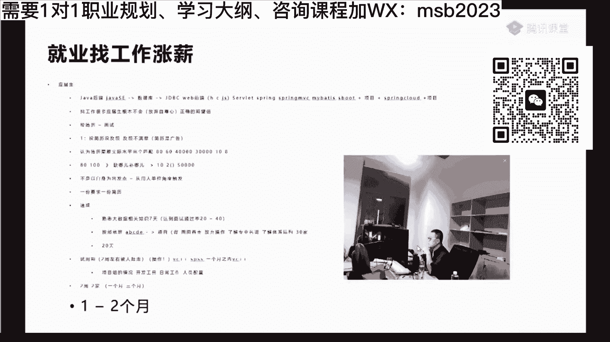
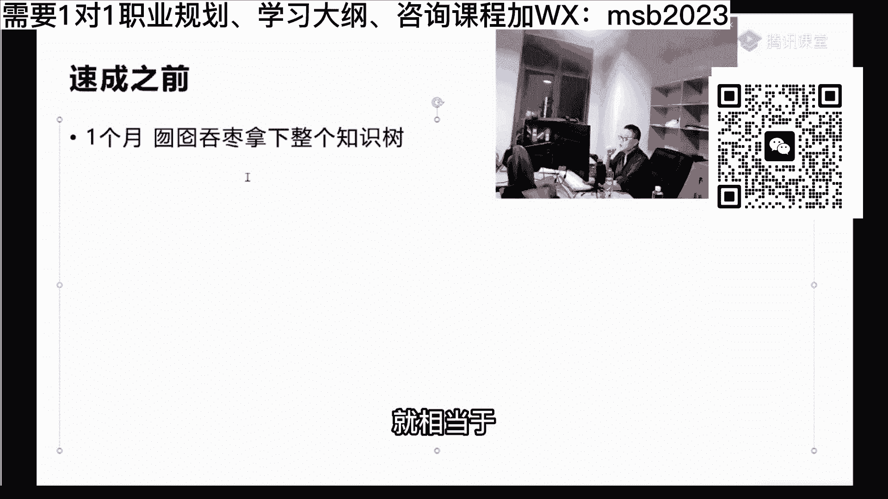
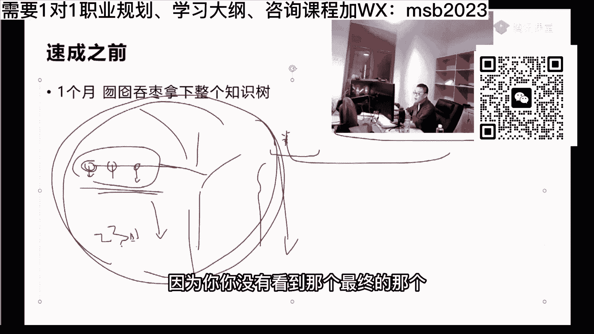
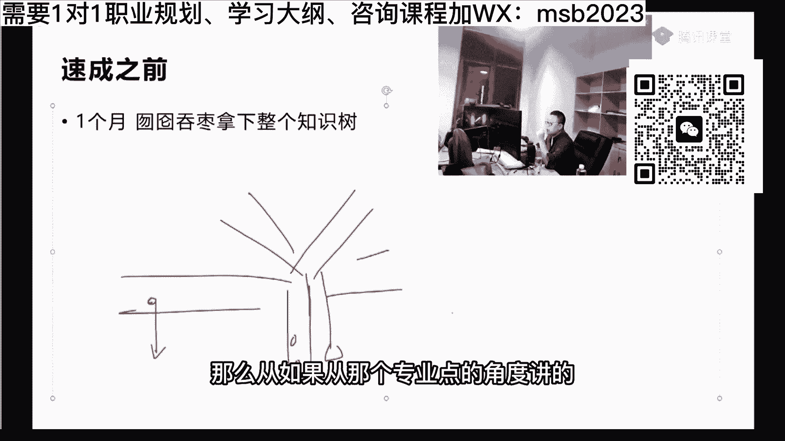
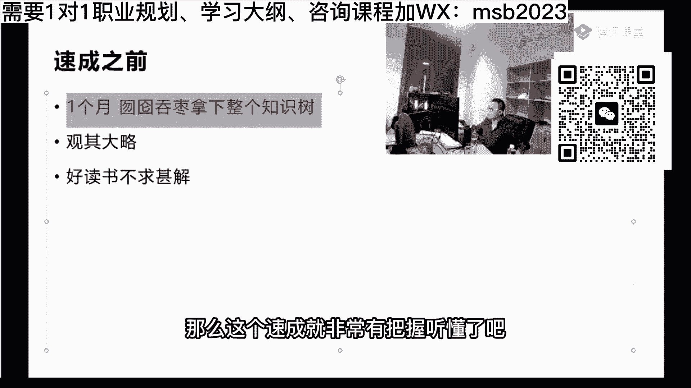
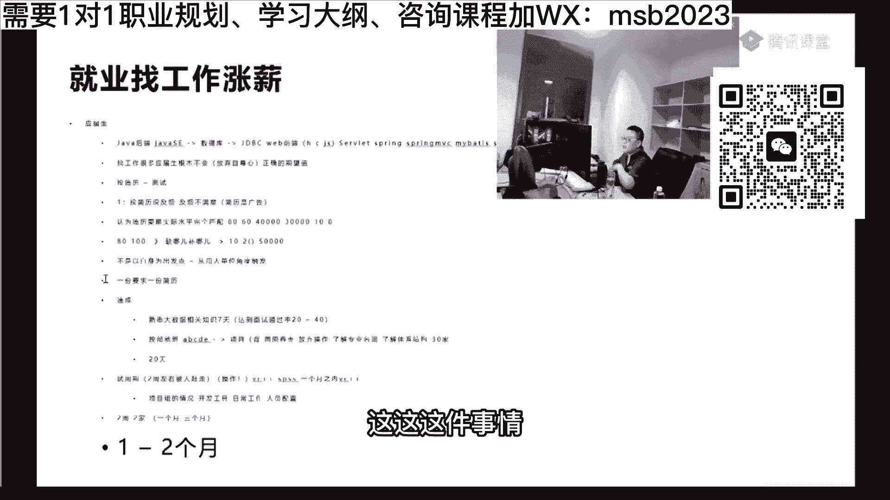
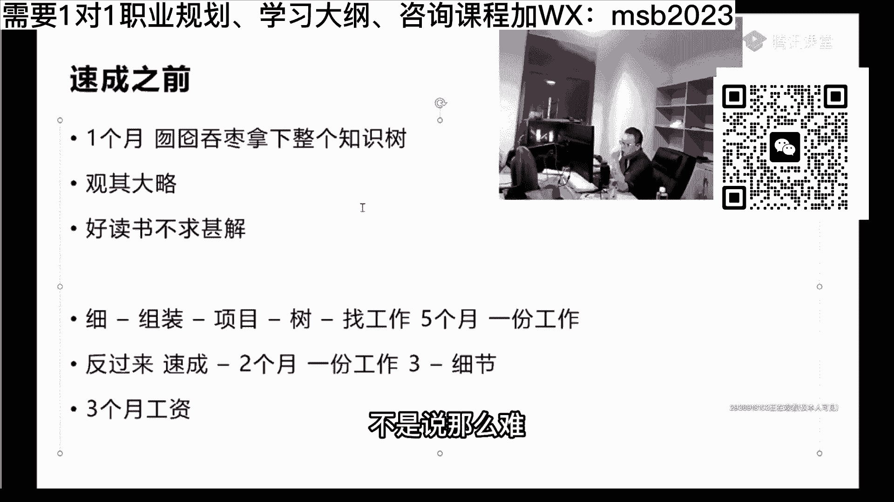

# 系列 6：P46：【2023】速成之前应该准备什么？ - 马士兵学堂 - BV1RY4y1Q7DL

当然呃如果你想让自己，让自己有那么一点点把握性要大一点，我真心希望大家可以，花那么一两个月左右的时间，先对整个知识体系做了解，其实啊在你真正开始这个这件事情之前，想速成之前，真心建议大家呢花一点点时间。

花一个月左右吧，不管是哪个专业方向，go on也好，java也好，前端也好，或者是没好，花一个月时间你要干嘛呢，你不要老想着去操作它，你写一个hello world就可以停，囫囵吞枣拿下整个知识树。

这事情特别重要的，就是同学们你们思考问题的时候，咱们平时的学习方式，思考问题的时候都是没有效率的方式，什么什么什么叫没有效率的方式呢，呃同学们，你们想啊，从咱们小学开始上学开始，就是说一个知识点。

一个知识点猛学，然后每个知识点都钻的特别特别深，就相当于如果我们从粗浅的来理解的话。

就相当于呢这是一整棵的知识的大树啊，这个大树在整个知识树上呢，我们是从某一个叶子开始研究的懂吗，我们对这个叶子研究透了之后呢，也在研究下一篇叶子，再研究下一片叶子，但是我们对于整个知识的综合运用。

是关于项目的，而这个项目的综合运用呢，实际上是关于整个的这些叶子，组装成一个一棵树，反过来的，这件事情是不对的，你懂吗，就这个东西的话，他又费时间，效率又低，还没有乐趣，因为你你没有看到那个最终的那个。

那个那个大的那个结果，所以它的乐趣性还不高，因此正确的学习方式是什么呢，你应该是先掌握整个树干，你知道吧，就是说我整个的知识里面哎这部分是基础，ji s e哦，下一部分在这个基础之上是数据库。

数据库和这个是一个同样的大树杈等等，是形成这样的一个一个一个大大的概念之后，大概念之后呢说哦原来这里边我要读源码，深入进去再深入进去是反过来学，那么从如果从那个专业点的角度讲的。

应该就叫项目驱动，这项目驱动这大家能听懂吗，就是你可以大概的先把这个项目，无论推导拿下来，这个项目驱动呢，你可以先了解说，我做一个实际当中做一个完整的项目啊，我应该是有我我是我我是我应该是我同事。

长什么样，我我应该是由哪些人构成，每个人都在干什么，然后这个项目里面我用到了哪些知识点，然后在驱动着我再去研究这个知识点，反过来学，就这个时候他效率是最高的，他可能让你学起来没那么舒服。

不是像很很很很适合，就是原来跟我们的学习惯很像的那种，但是呢他的这个学习方式的效率是最高的，好吧，就是你你政治学的时候，你可能得需要五个月你才能去去面去做面试，但你反过来学的时候，你可能需要两只。

需要两个半月，你就可以去参加面试了啊，你和那种学习的唯一的就是成功率稍微差一点，但是找工作这件事，你十加乘两三家和十家乘个四五家，本质上有什么区别，其实没有太大区别啊，别都像我们边学的东西对嗯。

所以速成之前我希望你干这件事，注意这事情，这个事情叫囫囵吞枣，为什么要一定要强调囫囵吞枣这件事情，你知道很多人读书啊，他有很好的习惯叫做观其大略是吧，诸葛亮的讲法嘛，叫我读我读书，观其大略好。

ok还有呢就是陶渊明讲啊，叫好读书是吧，不求甚解，这些都是很高效的学习知识的方式，你不要想着每一个细节我全要掌握了之后，才要怎么怎么怎么怎么着，很多人的学习太多了，尤其是还有好多那种他的学历也很好啊。

背景学校也很好，然后一了解学习习惯去全是这样的，我必须要玩命的整整通整个细节，不然的话我心里不踏实，别这样啊，这个大家能听进去吗，就是对知识树的话，拿下整个知识树的话，是这个是最快最简单的学习方式啊。

来这块能听见老师扣一了嗯，就速成之前你要是能干这件事，那么这速成就非常有把握。

听懂了吧，嗯又好多同学呢他们最近找到了，就是说就想速成啊，老师课挺多的，我也不想扎扎实实学，能不能先先速成一下，其实可以，其实可以怎么活囵吞枣哎，活吞枣的话呢，其实比方说啊，你学一个新的东西。

你就先掌握它是干嘛的，用在什么地方，大致了解他的什么搭建过程啊，什么什么环境的处理啊，快速快快速了解一下就行了，然后怎么和其他的那种组件相配合的，好吧就可以了，好嗯这是咱们应届生来说啊，就是就业找工作。

高涨薪，就业找工作，就业找工作，那那当然就这种的找工作的话呢，嗯就是这种找工作呢，有一个最后是不是要回头吸血，对对就是等你拿下工作之后，在工作中运用的过程之中在戏谑，你想想看这是不是好处，这这这件事情。

这件事情是不是它就是它的好处啊，你想想啊，就是有两种方式嘛，第一种是从细，到那个111个组件一个组件啊，到到组装是吧，嗯老项目到完整掌握，掌握整棵树，整棵知识树，然后嗯找找工作是吧，这是这是最扎实的。

这是最扎实的，其实你有时间够的情况下也可以这么写，这是最扎实的情况，那么这种方式呢，比如说你大概需要五个月好，那么从另外一种是反过来，然后就是囫囵吞枣，外加蒙哈哈，就是就是我刚才讲的那种方式啊速成。

那么这种方式呢它可能需要两个月，但是最后你欠的账也一定会还回来的，你这个是五个月之后你找一份工作，这是两个月之后就找一份工作，中间差了多少，差了三个月工资，这是不是就是你的你的收益。

兄弟们是不是就差了三个月工资了，已经然后在三个，你说你这后面这三个月里面，后面这三个月你用到哪个，是不是要研究细节去啊，你欠下的账，你是还是还是要还回来，只不过呢就是在你赚钱的时候，你去研究细节。

这个呢是你不赚钱的时候，研究细节能听懂吗，兄弟们来听懂，给老师扣个一啊，嗯我就是反过来学是吧啊对，好各位呃，听明白这件事之后呢，下面呢我给大家呢，慢慢的就是你们你们想拿下整个知识树。

我将我给我给大家讲这棵知识树可以吗，我慢慢的快速的给大家讲完整个知识数。

