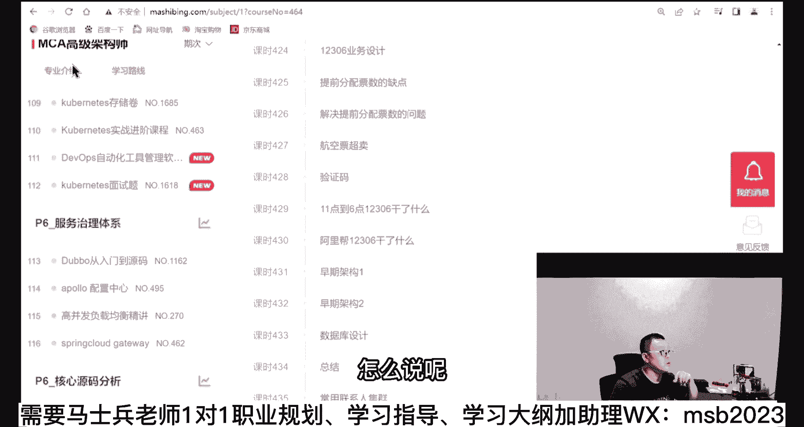
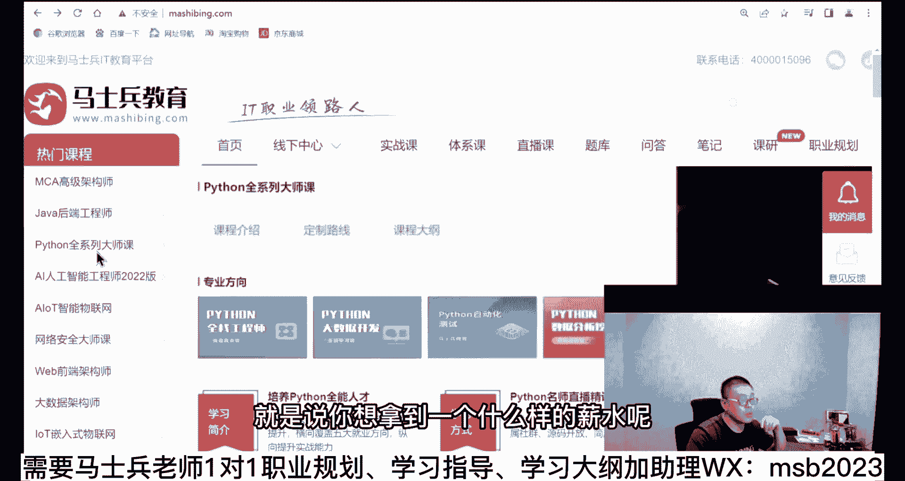
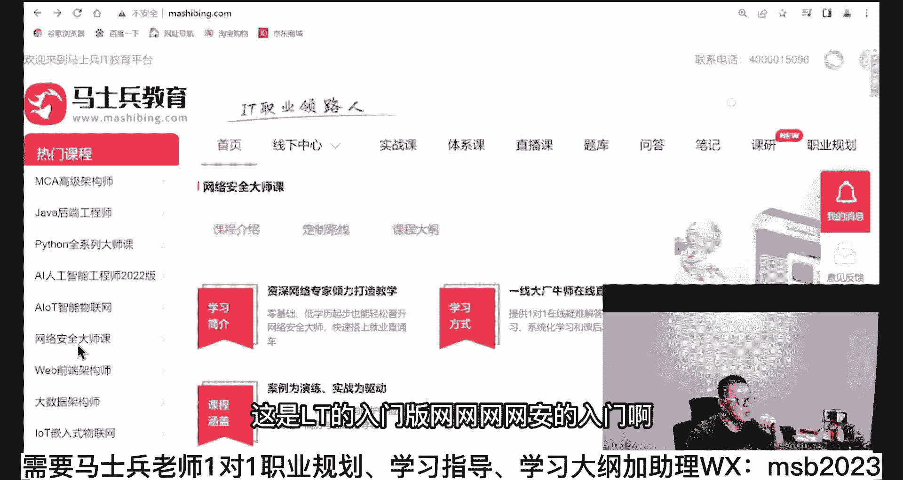
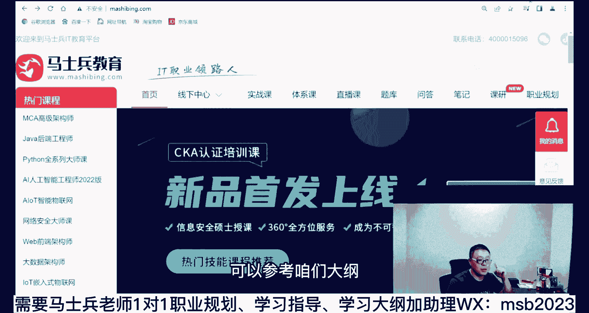

# 系列 6：P49：【2023】你为啥在一家公司呆不住？ - 马士兵学堂 - BV1RY4y1Q7DL

下面我们解决呆不住的问题，你就呆不长吧，不能就待不住啊，你去了待一天也要也要呆呆了一段时间，是不是还待不长的问题，这个问题呢其实更容易解决，这个问题的核心还在于你的心理心理素质，你的心理素质一定要过关。

简单说就不是一定不要怕丢人，知道吗，脸皮薄了，你在这社会上没法混的，在这个很内卷的时代，你脸皮越薄，你受的伤害就越多，越羞涩，你说的祈福说的说的说的说的打击就会越多，你会越羞涩，你会更羞涩。

你就没法混了，稍微慢一点好吧，不要太怕丢人了，还是那句话，我先问大家一个核心问题嗯，你待了两天被人踢出来了，有什么严重的后果没有，去了大家聊了两天，直接被人踢出来了，星期二去面的，星期三上的班。

星期五被人踢了，你有什么后果没有有什么严重的后果没有没有，就是心理上觉得自己过不去嘛，对不对，为什么你全是靠着背的题，只上谈兵，你开玩笑呢，你跟王语嫣似的，你就跟那背背武功招数，你你能上场跟人打吗。

你打不了啊，我告诉你这个阶段应该解决什么问题啊，一般的情况下，我告诉你，正常情况下，其实啊大多数人是能待够两周的，我跟你讲，为什么，因为你刚去的时候没有人说上手，二话不说，拿核心代码丢给你。

你明天就得给出解，我那你就不是新人了，对新人没有这种要求，大多数时候首先是要你熟悉他们的整个项目环，境，用了哪些东西啊，我们项目是做什么的，业务方面的培训，环境方面的培训或者叫了解。

然后呢才会丢给你具体的某个模块，让你去进行新开或者修改，是不是这样啊，同学们，那这个时间有多长呢，短的两三天，长的可能有一个月，你要真的去了银行的那种，前一个月什么都不干，就就给你赔业务。

你这时候你告诉我，我的我待不过两周都待不过不可能的，周文能理解吗，能理解，给老师扣个一来，没问题吧，就是你再过两周基本问题不大啊，哪怕就是短一点，一周不好告诉你这两周该干嘛，这两周同学们。

你们想想该干嘛，我问你该干嘛，你是不是重点，第一需要了解业务，第二需要了解开发环境哦，原来人家用到了redis 5点几，原来人家用到了是idea的，哪哪哪哪一个版本，linux，哪个版本。

spring哪个版本好，我大概了解了啊，业务我也具体了解了哦，原来他们做的是一个财务的这个核算系统好，或者说他们做的是一个这种呃，我要上到网上的核酸系统好，我大概的业务流程我也了解了。

那下一步你该做的是什么呀，这时候需要做的是哪个要用，马上要用的学习哪个，很简单，打开咱们把视频调用的官网，你就找说我下面要用到了你，less the search，好，晚上给我玩命学，这时候我就要求你。

必须给我干到后半夜干就是了，用到了dios了，好，给我干到后半夜用到了什么，这个这个这个这个nt了是吧，你给我干到后半夜啊，用到用到了什么高，并发了好，你给我干干，干到后半夜。

白天你正正常常的在那该怎么参加培训，参加培训，晚上回来使着劲儿的，不要在人前努力玩了命的，在屁股后头赶紧追啊，我该做什么操作啊，黑虎掏心这么练，我赶紧练两下，明天黑虎掏心可能要用上了，知道吧。

然后接下来你就可以上手去上手做这个东西了，好这个时候嗯，因为你这时候的学习都是树叶子啊，这时候学习都是树叶子，都都是实战啊，这个参数该配什么，那个参数该配什么，你晚上尽可量的都要把明天要用到的东西。

赶紧熟悉一遍，第二天来开始真正的上手，开始做开发，做开发这个过程往往还是不顺利，我以前遇到的一个特别印象，让我非常深刻的案例，那哥们儿是英国硕士毕业，大家都知道英国水硕，英国硕士都标水啊，1年制。

然后本科也不是学这个专业的啊，硕士1年学了，学了一个那个计算机，回来了，回国回头搞，让他搞的什么搞搞搞一个spring，简单的配置都搞不定啊，但是他面试的时候就人家对他印象还不错，你知道吗。

一定是这么这么搞进来的，然后呢，别人正常十分钟能干完的事事儿，他是两个小时都干不完，这没什么可说的，一看就是实践经验非常不够，1%都不够，但是这哥们儿呢他就是脸皮比较厚，然后你怎么训怎么骂，你知道吗。

他都能扛得住，所以我这时候就需要你的心理素质一定要过关，别人骂你没关系，你给我待到ky，为你不要脸皮薄，自己辞职，伦敦大学，我没有说伦敦大学，英国好多水，说这打击面有点宽啊，但是他那个肯定是比较水。

我忘了哪个大学了，待到开掉为止，这个这个能理解吗，兄弟们没问题吧，但是你给我记住你，我就问你啊，他做了一件事情，别人干十分钟才两个小时，搁那蒙着满头大汗，搞不出来好，我就问你，这两个小时是你。

你认为他有没有收获，很简单吧，你你骂了他一顿，但是他两个小时搁那使劲搞一晚上，中午也不吃饭，反正就使劲搞两个小时才搞出来，有没有收获，有没有，这个技能是他已经掌握了，另外试用期的工资才拿到了，开不开心。

他不开心的唯一的一点挨了骂了，实在受不了你的时候把你开掉，但这个时候你已经把a b c d e f g里面的acg，这个技能已经已经亮，已经练会了，那你还有什么可怕的呀，你这个时候有了部分的实践。

又通过背题，还能面试，还能通过，你还有什么可怕的，你下一家是不是能给我带到四种，在下家是不是能够待到12周三个月，你待到12周三个月，你还被人开了，那那那那绝对就不是那个技术问题了啊。

那就是为人处世的问题，你知道那那哥们儿那个来了之后，先勾肩搭背的是吧，找找找一个老老成员啊，我把那人问的烦的烦，我也问哼，没开掉，一直在公司呆着一把就成功，ok就这哥们儿其实很值得佩服。

人什么时候的成长最快就是这个时间，这个时间的成长的速度远远高于你的预期，以前有个小姑娘姓赵，叫赵光，后面我就不说了，这这这这是真人啊，真名来的时候什么都不会，s p s s什么什么语言统计语言。

谁为什么，那玩意儿我们要求的是用vivo c加加vc，c加加里面还比较难的那一类，每对他一个要求很简单，就是一个月之内，你必须上手给我做一个简单的东西出来，每天黑眼圈过来，小姑娘一个月之后就真就真做了。

什么时候成长最高，我告诉你，在有压力的时候，在你真正开始为为了一件事情，而玩命而拼命的时候，这个成长是最高的好，当你能够呆住了，确认你自己能够呆住了，下一步干什么啊，系统提手，这时候你又该进行系统化了。

该进行细节化了，这样的话在你下一次再去跳槽的时候，你的准备时间也够了吗，整个过程我大概的就就聊到这儿，这里面落就略过了很多细节，有些细节呢我单独讲给你听，那这会觉得你听上去觉得有用的，你给老师扣个一啊。

我这费劲巴拉的也说了，大概一哇塞一个半小时了，这是一个普适性的过程，这里我讲的是那种水平还比较差的人，搞定工作，有一些水平比较好的，比如说已经在学校里就开始练这个分布式了。

其实你这个过程要进行的比很多人要容易的多，到今年今年很早就体现出来了，甚至去年都有不少同学到现在学个s s m，就想出去找份实习，这个时代已经过去了已经过去了，分布式基本是必须的了，微服务是必须的。

也就是说你至少要达到这个程度，你才能够讲比较有把握的，拿到一份入门性质的工作卷，一点点嘛，无非就是多付出一点，多学习一点点嘛，而且目前整个的就业形式体现出来，叫做向专业化发展。

中间转行的找到工作的概率会偏低了，为什么基础不牢，所以用用最快速的方式，如果你要愿意，可以用最快速的方式，先找一份实习，或者找一份初级的工作，然后再进行系统化学习，不相应的基础好，这里呢我等我。

我给大家讲的是你怎么去找到一份初级的，比较低端一点的工作，关于下面我要教教，我要教大家怎么找高端的工作了好吧，那个关于我上面讲的这这这这这个这个过程啊，大家伙还有什么有疑问的地方，你先提。

我下面讲完这个教大家怎么去找高等的工作，毕业就找一份高起点的，然后毕完业就找高级点的对吧，然后23年我就想进大厂这种的啊，或者说我要我想呃百百万年薪以上的啊，50万~100万的这种的。

我教大家现在怎么找这些，各位同学，那个关于上面我讲完的，这是普适性的东西，还有没有同学有疑问的，有疑问你直接提啊，没有没有问题，你给老师扣个一，我看看有多少，嗯给点反馈，稍微怎么听这个呢，就你就听。

你要是不爱听，你当听，当听一个故事，你只要心理素质过关，能够吃得了这点苦，我肯定想吃这个，这这套绝对能搞定，我以前的记录是十天，他只会html css s，连javascript都不会。

我送他这个行业十天，这是我记录运行者开发完不晚，多大年龄了，然后以前是做什么，你自己的期望值是什么，这个一会一会儿详细的，这得详细一点啊，算是可以，难不不难啊，如果如果大家会想要那种。

比方说我想拿到3万的，我应该去具备哪些，然后6万应该具备哪些，这个我可以找一下，咱们小姐要一下咱们大纲大纲写的比较清楚啊，咱们大纲是这么组，知道都打了，瞅一眼啊，一分钟，我打开一下。

嗯咱们大纲呢分成222部分啊，大概就是，怎么说呢。

解释一下吧，这个是咱们的java入门版啊，这是咱们python的入门版，这是咱们架构师的那个版本嗯，就是说你想拿到一个什么样的薪水呢。

就看你现在处于一个什么水平上啊，这是l o t的入门版。

网网网网安的入门啊，然后那个web web前端的大数据的等等。

先选方向，选好方向之后呢，想拿到一个什么样的薪水呢，可以参考咱们大纲大纲里写的也比较清楚啊。

嗯这是咱们架构师的教师的话呢，上来就是p6 了，那个如果是还没达到p6 的水平呢，参考咱们前的就是java后端工程师，那个那个那个是p5 的啊，你像pu什么水平呢，大概就这里面给你写了薪水了。

你自己看就行了，好我不想这呢也要跟大家强调一点，就是马老师给你的大纲呢是一个最大值，什么叫最大值呢，就是你把这些全掌握，那你的概率非常高，90%以上的这种概率是你，所以你看上去知识点会特别多。

但是我刚才也讲过，这本质上是个概率问题，我教你，我看了我，我了解了你的背景之后，我觉得你欠缺的点在abcd，我就先优先给你补abcd，这个时候你就可以用一个，百分之五六十的概率去拼，这是效率最高的。

各位能听懂吗，所以大家也不要被这个大纲所吓到啊，拿过来之后呢，自己自己可以考虑去读一读啊，你像做p6 来讲呢，它大概是一个什么样的形式，就是30万~70万左右啊，这基本上就涵盖这个诺曼级别的。

基本上就是从0~30万左右，当然它会有一些重叠交叉的内容，每个人的背景不太一样啊，每个人的背景不太一样，所以呢其实每个人的重点的学习，优先的学习的东西也不太一样，这点你一定要理解。

所以我们教大家的时候呢，就是先了解你背景，你的诉求是什么，然后会告诉你在这个诉求你的背景之下，你应该优先去怎么样去掌握这个速度比较快，这就是为什么你看我们安利的时候有好多事，其实它时间很短。

三个月的业余时间是我们建校的普遍时间，基本不会超过六个月，这里指的是业余时间啊，并不是脱产脱产，那就比这要牛逼多了啊，我们脱产的那个那个那个那个效果呢是去年呃，上海的时间，50%以上是24万~30万。

就是刚刚毕业的同学，22%以上是30万~40万啊，3%左右是40万以上，然后没有低于15万以下的那个，剩下的就是15万到18万，18万~24万这两个坑啊，这是我们就是线下的那种那种效果。

脱产的效果会更好，但是呢一般你如果说，比如说你你你你你没这个时间啊，或者说我已经有工作，我只想提升，就不建议脱产啊，你也可以说我我先不，我不想出去去去干什么，我就想自己先猛学一阵，我现在学线上行不行。

可以先生搞不定了，再去线下，导致一个概率问题啊。

