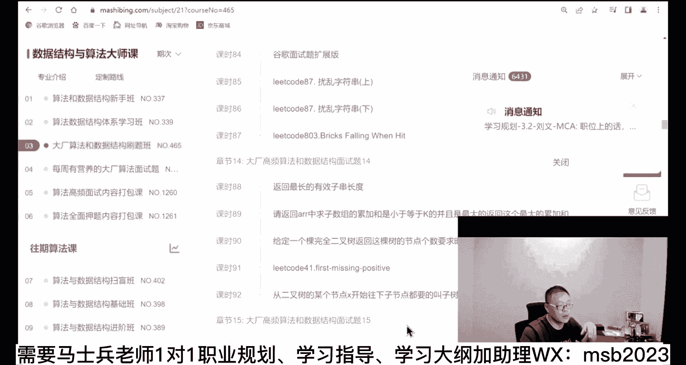

# 系列 6：P51：【2023】高端岗位和低端岗位该怎么选？ - 马士兵学堂 - BV1RY4y1Q7DL

那个，下面呢我来我来给大家讲什么呢，就是说怎么拿到一个高端的啊，各位同学，我现在要讲怎么样拿一个高端高这个高端岗，首先你要理解这一点，这个高端岗跟低端杠它的区别是什么呢，就是高端岗位。

低等岗位说我想要一份普通的工作，只要入行就行，这种的就是就是相对来说比较低端的，搞这种机会会非常的多，浪费一两个无所谓，但是高端岗不一样，我学历还不错啊，这个我们大厂认可我这个学历。

然后有时候来我们学校面试，很多厂子很优秀，我特别想去，但是呢他的要求都比较高，我怎么样增加我的成功成功率，高端这种的叫做面一次少一次，他的每一次面试是非常宝贵的，近量呢用更高的成功的概率去抓他。

你不要说我的概率现在只有10%，20%，我就去试，刚才有同学说过了，说我念完一次，然后我下一次再给我这个厂子，再给我面试机会的时候，只能是半年以后了，这叫做冷却期，这个冷却期不是所有厂的全是一样的。

有的厂子在着急要人的时候，这个冷却期是没有的，原来有些互联网大厂着急要人扩展业务的时候，我这个嗯，就是我我我这个小这个bo这个这个项目组啊，我就不讲了，项目组说bo很多同学可能听不懂啊。

这个这个项目组我我现在灭了这个人，我不觉得不合适，但是我马上会推给另外一个项目，你可能第二天就会收到同一家厂子，第二次面试，另外不同的不同方向的知道吧，所以大家不要认为说嗯一定的，就是我这个一个同步过。

后面还是会回给我免试机会会的，他给你第一次就会给你第二次，但是中间一般会有一个结，严格目前我们了解到最长的也就是半年，短的，那是3月，还有的呢可能就三天无所谓的事情，我觉得这个不够。

但是很可能够你们那个做的这俩能理解能理解，同学老扣一没问题吧，方向的选择有直播课吗，我原来讲过一个四个小时的详细分析，就只有原神一个人对这个理解了是吗，其他人都不理解，好记住啊。

这个高端钢是面一次少一次，所以你也要珍惜，下面我来讲高端岗怎么进，高端岗一个非常普遍的特点，它要求会相对高，所以这时候呢你一定要攒够时间，你像刚才讲的那个方式，那就不适合高端高，除非你呢就是拿高端岗。

想试着玩那个刚才那个方式，你也可以拿到面试机会的，你放心啊，那高德龙怎么进呢，听我说这里面分不同的年龄段，我们讲比较低龄的这些就是你在上大学，大一大二大三啊，这个时候我的目标是要进到一家不错的厂子。

或者说该怎么办，我想我只想拿一份工作这种低段稿，还有呢我呢什么想考个考个公啊什么的，这一类的，他的学习的重权重完全不一样，这一点你一定要理解，高中党的作为成员来讲，第一个权重，第一的是叫算法。

我说的是高端低端岗这块略过，你知道吗，算了，你不用学，你也可以拿到低档位杠，哎没有问题，算法你能算法突击的效果好不好不好，算法只能是成体系的，然后细水长流的啊，这种每天每周都要抽时间来来熟悉学习巩固的。

这样的学习方法，它才是效果最好的，我现在讲的有兴趣的，你给老师扣个一，你们老师不反馈，我也不知道你们多少人想想想变高端的，好好好好还可以还可以好好听我说啊，为什么算法对于程序员非常的重要，我可以这么讲。

算法是选择程序员是水平高还是低的，唯一的一个一个一个方法，做不了假的，你说你背他不可能知道吗，我们我刚才讲你你那种突击找低杠杆，我可以背，对不对，这种方法你背那是不可能的，你绝对背不过。

所以所有的这些个大城有名的厂，他临遴遴选这些人的时候，遴选的比较专业的厂，他的第一面基本都是算法，而且很多长的是赏析题，你觉得你能够背靠背能搞得定吗，搞不定，这没什么可说的。

你从大一我不知道你现在年龄多大，你从大一开始，大二大三，你从这个时候开始练，它的效果是最好的，他成功的概率就是最高的，算法这块到什么程度，能够到达什么样的场，教大家打开了咱们数据结构与算法这个课。

这个课老师叫左程云，左老师，这里有他的介绍，我相信有很多同学应该是听过左老师名字，他原来是在国内是华中科大，国外是芝加哥大学，读完研究生之后，然后进了亚马逊，靠算法amazon。

然后后来在ibm green i o等等这些，然后回来之后再百度，大概的内容的话呢会分成不同的阶段，对应不同的水平，从入门对算法什么都不懂的水平，都可以参加acm大赛的水平，就是可以参加竞赛的水平。

就是在咱们算法课里就全包含了，嗯不需要所有人呢去学习所有的东西，大概对付一些普通的大厂，普通的厂子吧，我们说不是大厂，比如像那种中型的厂子啊，呃有些国企啊等等这些啊，银行类的啊。

这种的大概呢你就把这个体系班搞完就可以了，新手玩建立算法的基本概念，什么初初级的这种排序啊，这些之类的我就不说了，体系班呢你们自己去读好不好，我先建议你们读一下，对这么一个大体的了解。

体系班呢大概会学到什么程度呢，动态规划啊，先论述呃，这个这个这个这个什么n皇后问题是吧，这就叫k m p啊，莫里斯便利吗，nature等等这些图学到这些，这个我可以跟负责任跟大家讲，你到这个程度的时候。

国内的一些不是超一流的大厂，你基本就全可以cover了，呃京东那个快手啊，这一类的场子基本就全cover了，当然如果你想进字节，微软谷歌亚马逊，不好意思，还得往后练，刷题刷什么题啊。

这是每一个都是一道题啊，每每个课时都是一道题啊，都是一些典型的东西，主要是他牛逼的牛逼的点在哪呢，就是他能够帮你把这些题型全给你梳理出来。

梳理出来大概几十个几十类题型。

你看到你看到它的题的时候，你就大概知道该冲哪个方向去去去努力了，知道吧，这是他牛逼的点，当然还有一些押题的啊，高频面试的这个我就我就说了，好到这个时候，你就基本上可以具备全球一一线大厂的水平。

全球一线大厂不可能，小案例看几个，算法单凭算法啥都啥都啥都没有啊，应届生应届生60万，还是要加油的，有个出100万，完了这次没面上兄弟，应届生出100万，当然学历很好，然后再加上算法牛b。

呃这是理想offer，涨了8k的不说了，算法字节的offer是吧，关键点是什么，就是面试的时候，面试算法题全部写出来，难度比平时教练要低一点点，坚持了学习之后，大多数middle级别。

也就是那个中级的这种级别就特别顺啊，都搞定，这个是左老师比较牛逼的一个同学，拿到offer有什么，阿里腾讯，百度美团滴滴快手虾皮，华为招银奇安信大话小红书，自己看就行了啊，怎么说呢。

就是请大家记住各位同学，如果你想在毕业的时候拿到一个很好的大厂的，这个机会，算法是必不可少的，成体系的系统化的学习算法呃，这个它的重要性在于哪里，国内呢招一个程序员除了考算法之外。

还考一些应用级别的这些东西，spring spring这些这一类的应用级别，但是国外你到国外你看看就知道他们就考算法，是其他什么都不考，像前面我所说的，让你背的那些什么j v m的题啊。

一个个背就搞算法就可以了，国外只考算法，所以如果你的目标是要去国外就业，去北美学习，在你没有系统经验的情况下，你没有参加过工作的情况下，他们只会考你算法，咱们算法课除了罗老师讲算法之外呃。

咱们进谷歌的同学也帮大家专门讲了，怎么样去进到谷歌的那个算法题啊，这是咱们在谷歌的那个同学帮他们总结的，怎么说呢，国外呢曾经有一个非常极端的那个案例，中国东莞电子厂的一个女工，你们自己去搜百度上。

到了美国之后，用半年还是1年的时间狂学算法，直接面进去了，谷歌啊，就这么牛逼，这个大家能听懂它的重要性了吗，那有同学说了，老师我有经验，有35年经验了，我想进大厂算法还需不需要需要你。

如果说你的年龄还是在32岁以下，这个算法就都要我再说一遍，32岁以下想杀大厂的同学，这个都要听懂了吗，部分的可能还要年龄还要往上，33岁没准也考你，34岁没准也考你啊，但是基本上你说34 五岁呃。

再考算法的这种大厂不太多了，就因为那个时候他拉你进去，就不是要你在一线去平衡，而是要要的是你的经验，你的架构的能力，你的设计的能力，他要的是你的那个的能力，听懂了吧，所以在你比较年轻的时候，想杀大傻。

不好意思，这个你避不过去，我说清楚没有，然后那么国外大厂我们先讲国外大厂，国外大厂对于呃你你你你已经参加过工作了，社招的同学，除了算法之外，另外还考一个啊，作为作为国外大省来讲，另外只考一个。

也是只考一个，所以国外大厂面试就这两项，这项叫system design，这个也很难，因为这个是落地，这个是设计啊，同学们设计这个东西呢，仁者见仁，智者见智，他虽然他有一定之规啊。

但是他还是需要你透彻的理解和灵活的运用，这个还是比较难的，那怎么去干这个system design这件事，该怎么样去进系统化的补充呢，system design这件事这么来，不如果从大纲里来讲。

我拿我拿我拿大纲讲啊，从大纲里来讲呢，原理和设计要补的都补的时候是补什么，这是架构设计啊，但是对于系统设计来讲讲，你首先要补的其实是我在前面，我就跟大家说吧，其实是第一你要理解设计模式。

设计的一些基本原则啊，等于是设计基本原则，这是第一，这是第一个，第二你需要分析一些框架的原理和源码，这个是你理解别人为什么这么设计，你才能够设计出来你自己的东西，先去理解大师们怎么做的。

然后呢再来想办法，我自己消化，我会怎么做，这个大家能理解吧，这是第二步，那么第三步是什么，第三步就是应用级别的这种设计，就是框架级别以及呢案例，别人给你一个实际当中的案例。

当然这个东西呢就是你有可能会很强，因为你的你的你的技术经验比较高了，也有可能会稍微弱一些，你刚刚入坑，刚刚开始接触设计，讲一个高端一点的案例，你会知道这个设计东西是什么样子，他是怎么样给钱的。

这个我也是印象非常深刻的，这个时候我知道他的你会看到我的头像，在这微信里，我我我我一对一对它进行了指导，这个就是它的设计，自己看，这是腾讯面试的时候面了他的设计题，他觉得自己答的还不算太好。

但是最后腾讯也进了，你如果愿意可以自己尝试一下，这里面也有他大体的答案，你可以参考一下啊，当然这个就是薪水比较高的了，90万年薪，所以通过这儿呢你其实也会慢慢的发现呃，不同的薪水级别。

他面试面试的不同不同不同样的东西，作为大国外大厂来讲，没有经验考算法，有经验考两项，该到了吧，好我们继续回到国内，作为国内的同学，如果你想进大厂，第二个权重叫我把它称之为叫八股，这个八股指的什么意思啊。

一些基础知识基础不牢，地动山摇大厂很多时候就考基础，你不信你去看看那些校招，华为的，校招腾讯的，你去看他们问的都是什么样的东西，这里面的东西就比较多了，操作系统，网络数据库，记住我算法必须的不说了。

如果是java的话，什么jvm呃，什么调优，mysql调优啊，这个jm调优，然后等等这些，还有这个词条u等等，还有什么release这并发多线程单机的，是不是分布式的这些，然后呢嗯release什么。

什么卡夫卡，做keeper设计模式，spring源码等等，这些我就不我就不举例了，大概重点的话呢，基本上是我我列的前面这些这个东西呢，其实就是我所讲的那些叶子，叶子层面的知识，这些知识没什么可说的。

就是越多越好，越多概率就越高，少一点儿，说我能不能成，我以前遇到过就掌握三项就就就也就进去了，就掌握三项jy m并发，然后再加上mysql调优，ok也季节进去了，所以这里头是掌握越多越好。

按权重ip来就行了，这是概率问题，再强调一遍，概率一定要理解这一点，第三个，这个才是应用级别，这个呢对于找那种普通工作的，就前面有讲过这些等内容，普通工作的是第一优先级，知道吧。

去了解什么spring啦，s m了，spring cloud啦，spring boot啦等等这些，但是对于你想进高端岗的这些应届生来讲，这些只能排在第三优先级，所以他的学习顺序和权重完全是不一样的。

你的目标不一样，你记住你的目标不一样，你的学习顺序和权重一定就不一样，第四个呢它是一些加分项啊，比如大数据，与原生让内地址就行啊，等等吧，ai了等等，这些个呢可有可无，有的话更好，没有的话无所谓。

英雄级别，包括项目经验啊，这个比较重要演，所以你看看你想进大厂，但我说的这个点来我讲清楚没有，想在好，我不知道我说清了没有啊，看看各位同学对这块还有没有什么有疑问的地，方，这一问题啊。

你有什么特殊的稍微ai硕士出来，有机会晋升当科技吗，有啊为什么为什么没有投啊，投降你投出去，年龄大现在年龄大，现在根本不理月神，你是后面才进来的吧，你是不是后面才进来的。

我觉得你应该是因为你你如果前面听我讲课了，你不应该问说出这种话来的，所谓的大龄兄弟们，我现在讲这个大零，今天有多少大龄同学让我扣个一项目，多少个表格，是看你多少度，就你简历写几研究工作经验啊。

先看大连的案例啊，看你的大连的案例，找一个比较特殊的吧，大零的42，大零，17~18 41岁。

