# 系列 6：P53：【2023】Java应届生要找到工作需要掌握哪些技术？ - 马士兵学堂 - BV1RY4y1Q7DL

怎么样进行进阶，不管你是自学，你愿意愿意愿意掏钱，快速的学，或者愿意慢慢的自学都可以，这无所谓，我都我都告诉你很好的路线，你该怎么走怎么走好吧，那个从教育找工作来讲呢，其实是分人，人群是分层次的啊。

我跟你讲，就是现在我觉得最难的应该是应届生，我不知道今天听听课的有多少是手头没工作的，就想找第一份工作的，有没有，有的话给老师扣个一，我看一下，看一下有多少，就说我手头现在一份工作都没有。

我就是找不着我，我就选那个就是就是应届生，我就想找一份工作，好好ok ok好，还没开始找，ok呃，这关于这个应届生呢，大家听我说，就是应届生找工作这件事儿，就入行这件事呢，嗯我先说入行的手段。

这个以前也重复过，入行手段呢大概有三个，一个是那个嗯，先给你先跟大伙儿聊这个入行的那个路线吧，好不好，入行路线先先聊路线啊，就说入行的路线来讲呢，其实比较简单，不太难。

入旁路线呢你首先第一点呢你要先选定方向啊，认真听，一定要先选定方向，就是我想问哪个方向去，比方说入行弄的有好多啊，比方说有java后端呃，go on后端go on或者是java的这种游戏后端。

然后呢呃前端，然后呢安全嗯，然后比方说像ui设计产品，产品啊等等等等方方面面，咱们只聊i t啊，咱们不聊说去什么做做餐饮之类的啊，还有像什么测试对嗯，c加加的c加加目前大厂招的比较多呃，或者是什么呢。

结合那个i o t，就是结合那个呃去硬硬件驱动的，这样的开发比较多啊，c加加的，然后嗯iot的这个ai ot的，其实你看一眼还有好多啊，我就不一列了，其实你看一眼光i t来说呢。

它就有好多好多的细分细分领域，你的你的第一件事情呢是一定要认准一个方向，兄弟们，因为有很多人在平时学习的时候，他他学来学去，实际上学的是那个不同方向的内容，不同方向内容没有用的。

所以对于咱们刚刚入行的兄弟们来说呢，就是说你的第一步啊，画个图啊，你的第一步，最开始的最开始的同学是要求是1米宽，1万米深，他是这样的一个一个一个知识体系结构，明白吧，呃当往后的时候，越往后的时候。

他对宽度的要求就越宽，到架构师的话呢，它很可能是这个这个1万米宽，但是每一个只有1米深，明白吧，整个面积是一样的，这块咋能理解，能理解，给老师扣个一了，能理解这件事情这件事情吗，就是最开始的时候。

你其实对对你的要求是1米宽，1万米深就越深越好啊，宽度可能不需要太宽，那么这里面呢首先你第一步呢要选定整个方向，这块呢，我3月我大概在3月12号的公开课里面，我3月12号公开课呢，我大概讲了四个小时。

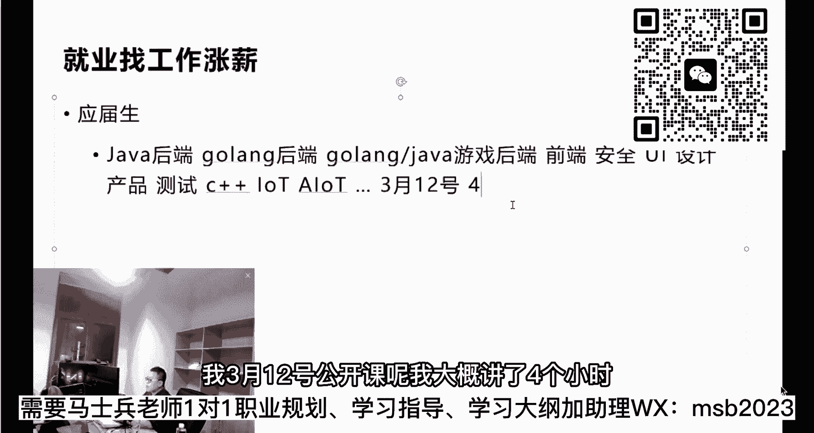

基本上把每一个方向都给大家分析了一遍，所以呢如果对方向选择有疑问的。

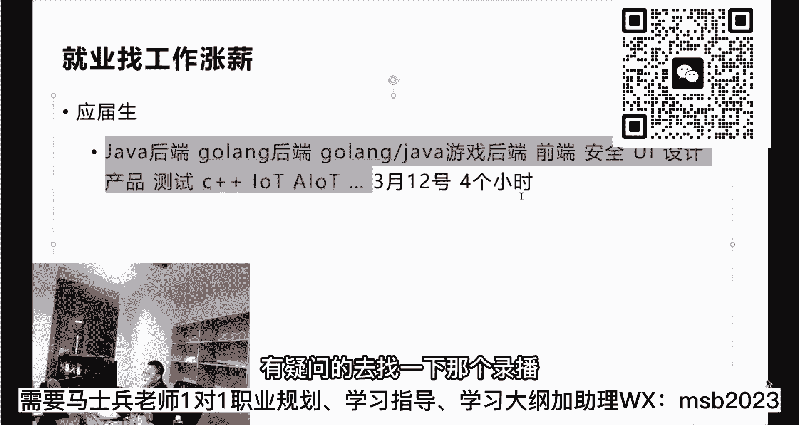

去找一下那个录播，好好听一下，我就值得值得听，值得付出，你要干一件事情，一定要做一个提前的了解，没有调查就没有发言权，是不是啊，同学们，所以呢先做出自己应有的调查，你听我这个呢也是调查之一。

我今天呢也不太可能想说，我们每一个都给大家介绍到啊。

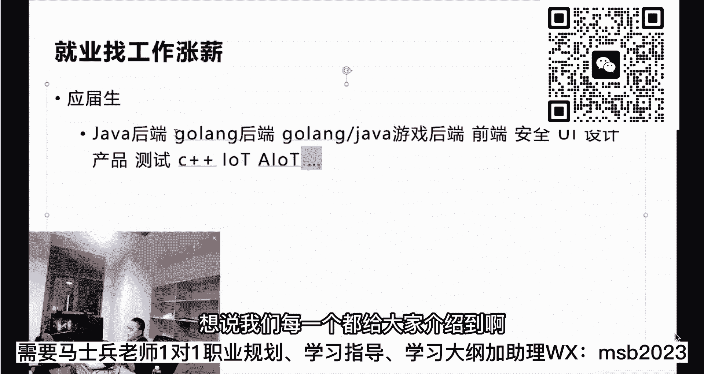

我用现在最宽泛的，现在目前整个市面上最宽的，假如后端来举例子。

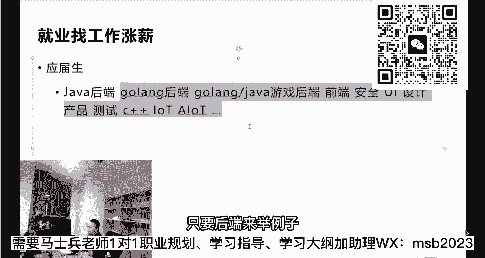

java后端go on后端咱们课程里头的大纲都有，你可以去参考大纲，也可以也能知道整个的学习路线，招后端是最明确最简单的一条路线，它的就业面是最宽的，两个就业面是最宽的，一个是java后端。

应该是前端啊，这两个是就业面是最宽的，到目前为止听懂了吧，所以呢你你们可以去了解了解这两个方向呢，他的学习的这种嗯路线是什么样子，我用我最熟的java后端来给大家举个例子，后端的话呢，其实到目前为止。

他的那种学习的路线是非常非常明确的，而且就一条线走，你从从头开始走到底就行了，那么这条线是什么呢，就是javs e，大概就是这样的一条线啊，jvs e，然后呢数据库那就是mysql了是吧，gdb c。

然后注意这个这里是web前端，那么前端的话呢，差不多就是a t m l c s s g s啊，大概这这这三个语言大致了解就可以啊，然后呢是后端，后端主要了解的是select，然后spring框架。

还有呢就是嗯spring boot，注意到这里的时候，其实在很多中小城市可能到这里啊，在一个项目这个必须要加项目了。

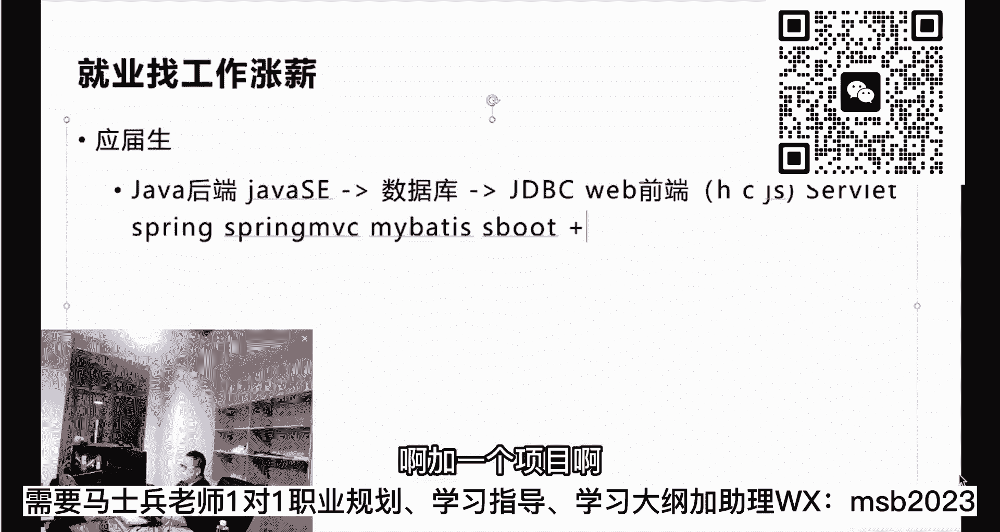

兄弟们嗯，到这里的时候，其实在很多中小城市。

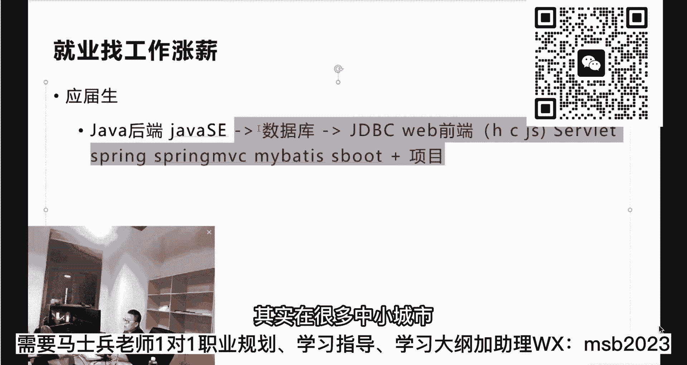

就有可能找一份几千块钱的工作了，有可能啊，说的是把握性并不大，如果你想比较有把握的拿下，各位同学，这个是必须要的，spring cloud还行哦。

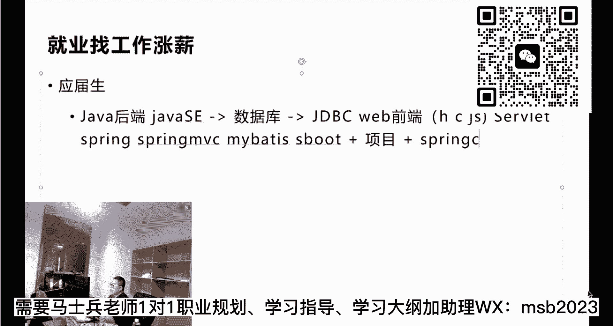

到这儿其实最最小最小值就有了，这是最小值，大家听懂了吗，嗯我说的是最小值啊。

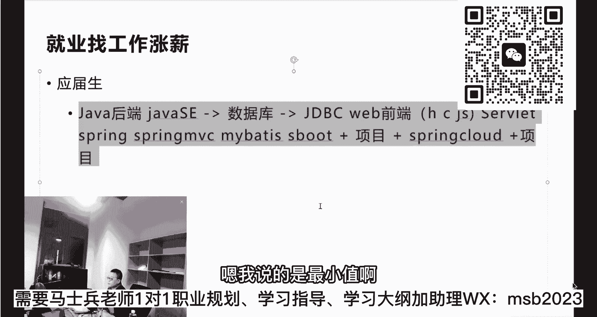

当然有同学说老师我消息中间件要不要了解redis，要不要了解缓存要不要了解，当然是越多越好，越多越好，我说的是最小值，所以各位应届生同学来说呢，你到这里的时候，你就开始有希望了，讲到这儿大家能接受吗。

能听懂的老师扣个一来。

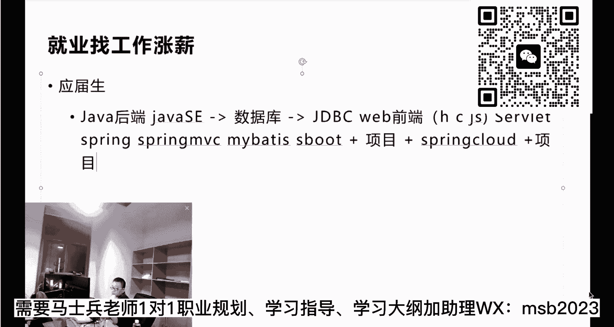

大家呢你也可以从这个java后端工程师，这个系列里面，当然我们给的值呢不是最小值，给的值是一个挺大的一个值，因为有同学呢想要速成。

我就教你是最小值是什么，从咱们s来说呢，我们s一开始就有项目。

然后呢各种的s一的进阶前端技术呢有好多，然后嗯my max spring mvc，spring boot的项目和家园的项目远程调用呃，我们给的是值是比较大的，是一个是一个大的值。

但是实际上你们用的可以考虑，如果你们对就业薪水要求没那么高的话，可以考虑最小值，但是大家不要小看spring cloud，虽然我只是加了一个spring cloud。

spring cloud这块呢是挺重要的一块，这块呢因为它有好多组件构成，最起码有这个注册中心呃，nicos，然后配置中心nichos，然后santino和那个open fan gway和那个sa等等。

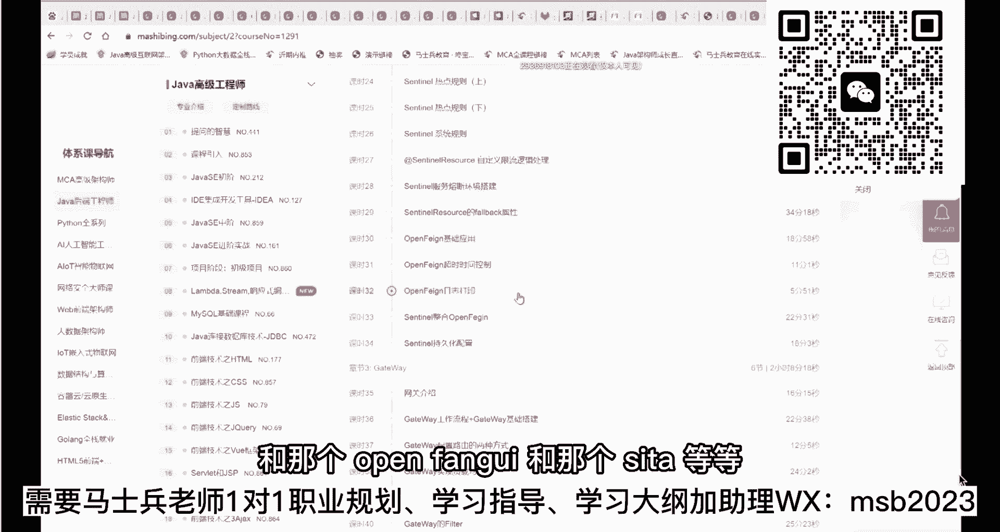

听我说就知识点来讲啊。

其实学起来并不太难，那个所以最小值的话大概就这么多就够了。

其实想是不是比想象中要要要简单一些啊，这大家能听懂吗，大厂的最小值比较难，一会我给大家讲一下大厂的最小值好不好。

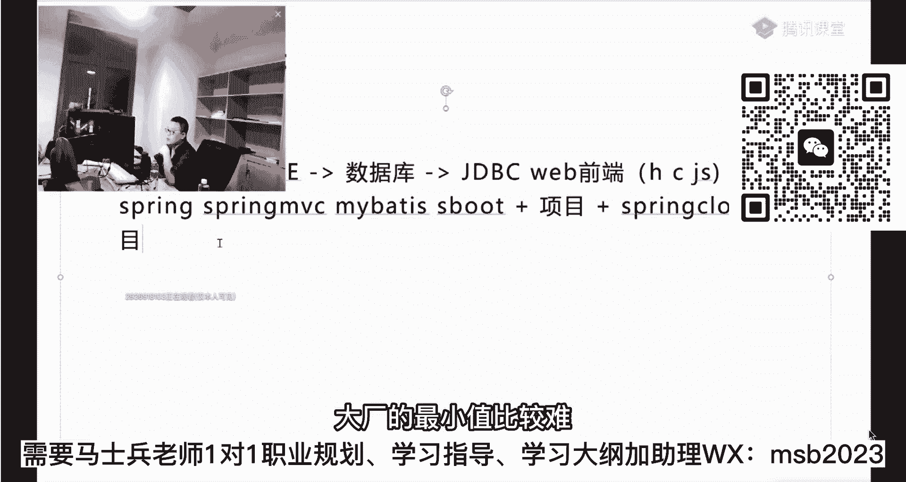

大厂最小值有的地方呢比这个还要少一些啊，呃这是找工作的最小值好吧，呃但是各位听我说啊，如果你们找工作的，我了解我接我接触到的应届生找工作的时候，他的最困难的点呢，不是说他没有掌握这些。

他有好多人呢是不管是自学也好，不管通过培训也好，他是掌握了，但是呢他那个掌握的比较稀松，比较稀松了之后呢，他写简历就不敢写，他写简历不敢写，他那个简历写出来就非常非常的烂，他写出来非常烂的。

他投出去就没没反馈，所以这里面呢我就业这块最核心的点呢，其实还真的不是这些个技术点，这些核心技术点在老师看来啊，带你的情况下，其实很短时间就能让你掌握住，就是掌握到就业的就业的层次。

但是最核心的点是什么呢，最核心的点是，找工作大家不会找，很多应届生根本不会，嗯这跟大家说啊，go on怎么样，go on大家可以，你可以去咱们的那个网站上啊。

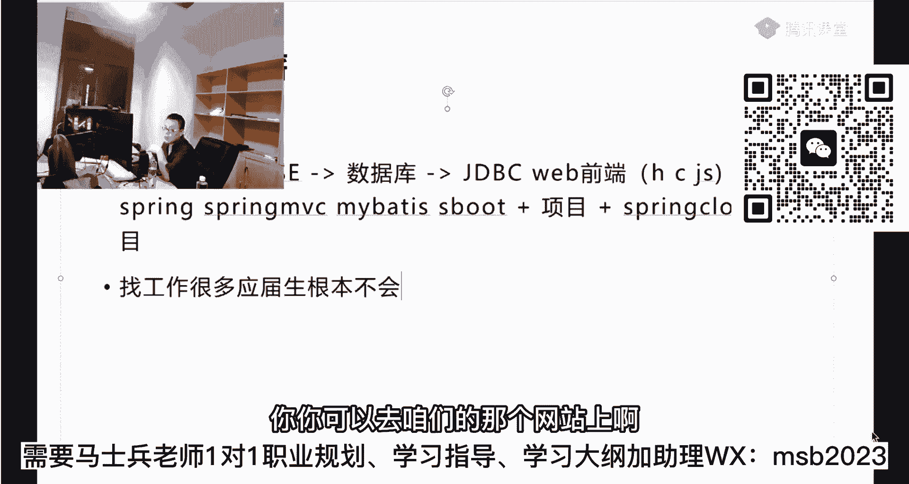

我这个也就太多了，我也我也不可能给大家介绍太完全。

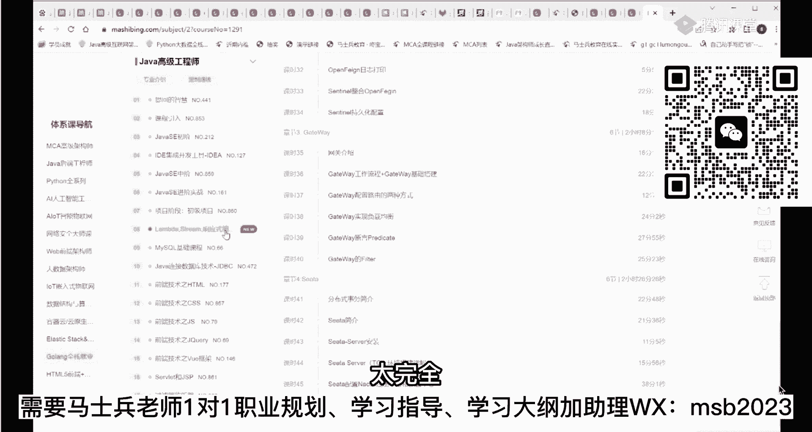

大家到网站上可以去找咱们的那个嗯。

目前的go on的课呢。

正在也在那个不断的更新之中，go on呢是目前主要做中间件的开发，做区块链，然后做游戏后端，大概集中在这三个方三个层面上好吧。

但是从他的招聘量来讲呢，比java后端还要差不少啊，呃找工作很多应届生根本不会相信我，教大家找找找工作的技巧，各位同学认真听，尤其是应届生，同学们，你们呢按照我我讲的去试一试。

你就会发现找工作就没那么难了，这里面呢其实要求最大，电或者的最最重要的一点是放弃不尊心，我有印象，我记得我年轻的时候刚毕业那会儿，那会儿我的自尊心是最强的，我受不了任何的白眼儿。

受不了任何的那个那个挫折的，如果有有人白眼，我一定要打反击回去啊，大家听我说啊，就是说呃你你找工作的第一件事情呢，你要放弃自尊心，还有一个呢，就是要有一个对自己一个正确的希望期望值，呃我告诉我告诉大家。

大家前一阵子可能听说过北大的博士，去做那个城管的，我的同学里面他的他的他的孩子啊，也不是我的同学，就是我的师兄，他的孩子有在北理工读那个计算机系，研究生读下来之后呢，也找不到很好的工作的。

呃我的亲戚里面也有那个在北师大的数学系，然后毕了毕完业之后呢，也找不到很好的工作了，就是我整个了解下来之后呢，实际上是咱们的小孩们呢不太会找工作的，他不会，他也不理解呢。

找工作这件事到底是一件什么样的事情，呃找工作其实非常简单，人听进去啊，那个呃不是北理工的，那个是最后是找着了啊。

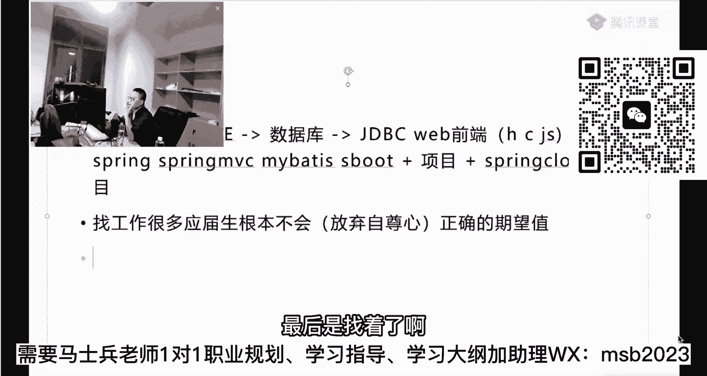

他那个工作不是很理想而已。