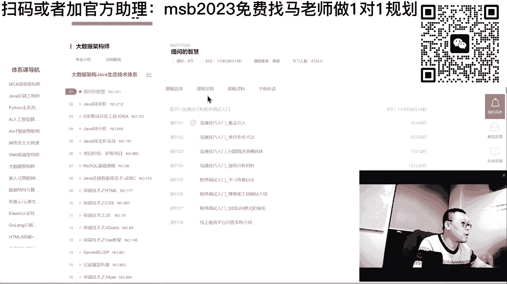
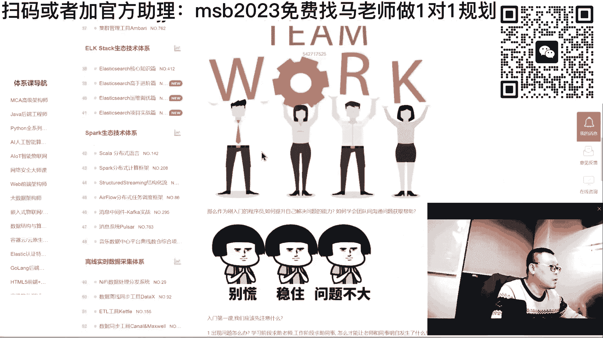
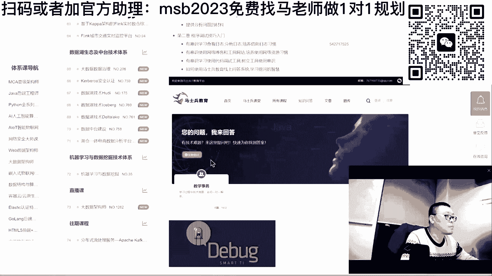
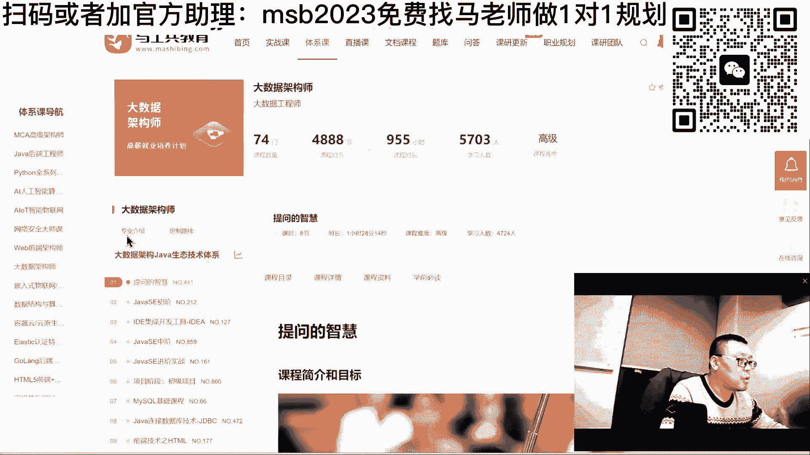
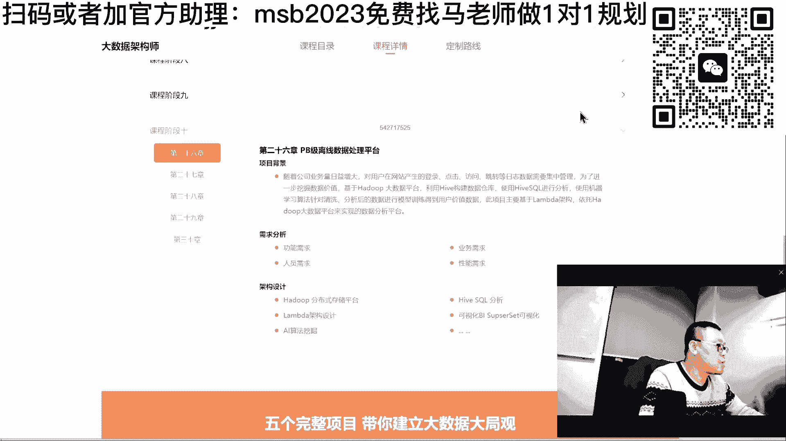
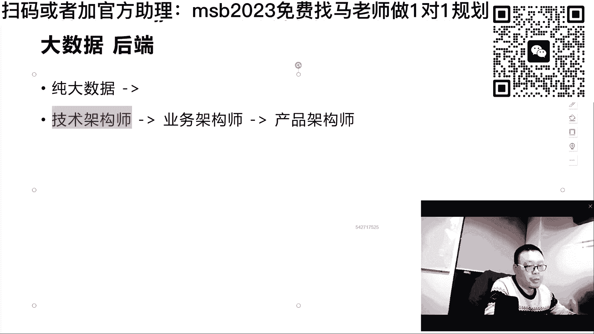
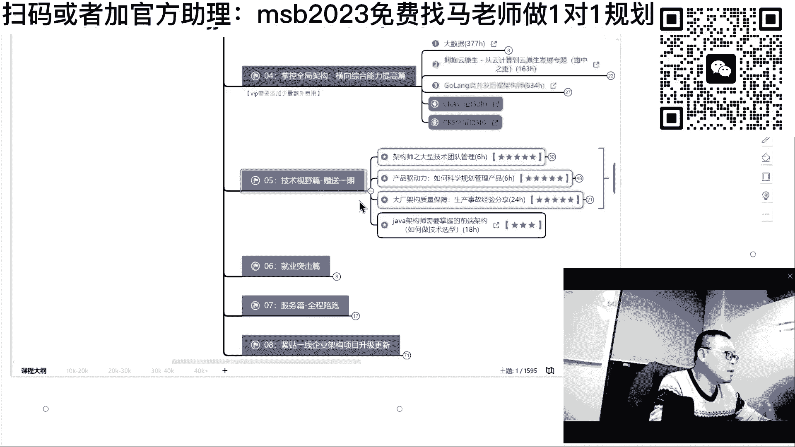
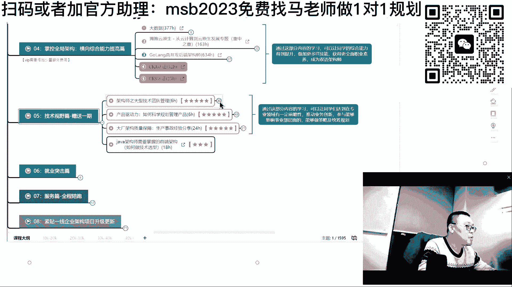
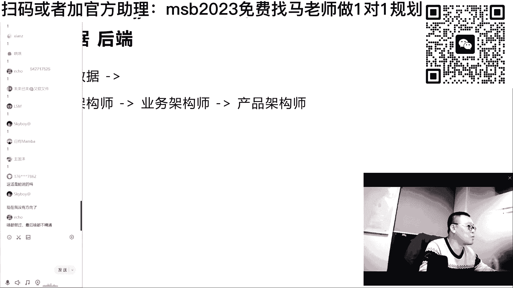

# 系列 6：P57：【2023】后端、大数据、架构师怎么发展？ - 马士兵学堂 - BV1RY4y1Q7DL

我看大家会有什么问题没有啊，我们下面来聊一下，就是有同学说要聊大数据，我跟大家简单聊一下大数据呃，其实作为各种的大数据框架了，它慢慢的有一种简单化的趋势，这个我不知道大家了不了解。

就是一般来说原来做大数据的时候，你需要掌握编程语言，然后用编程去调各论各的接口，去完成大数据的相关的一些操作，但是呢各种各样的大数据平台出来之后呢，它倾向于简单化，用简单的sql语言就能完成。

现在大数据平台基本都这样，但是整个大数据体系的知识还是很多，各位如果想了解整个大数据的技术体系，需要那个大数据架构的，大数据的这个这个这个咱们的课程大纲，或者是什么呢，打开咱们这个大数据架构师。

你自己呢从头读到尾啊。

基本上就是把这个课程的详情。

基本上就把这个人详情去看，你就你就你就了解了，从热度到尾啊。

这个可能你刚写的有问题啊，呃在这里专业介绍啊。

不过程大纲专业介绍呃，你你从头那把它读到尾，大概因为我们的大数据的课呢，大概分了十个阶段啊，从这种技术的存储啊，到采样到清洗是吧，到那个原理源码啊，然后呢再到呃流失处理批处理啊。

再到这个在在线的分引擎嗯，再到这个数据仓库的设计，离线仓库的设计啊，实时仓库的设计，分布式的调度等等这些，再再再加上一定的这种嗯去学习啊，再加上一定的项目，大概四个左右的项目。

把这个表情呢差不多十个阶段啊，大概一共整体上的30张，三三十个小节。

十个阶段完成，嗯怎么说呢，你要去了解这个细节的话呢，我从大的方面跟大家聊大数据，大数据是什么东西，该怎么去掌握它呃，认真听呃，关于大数据这件事情呢，一般来讲，是一个入行的方向。

大数据后端都算是一个入行的方向，但是入行之后殊途同归，什么意思，有的人呢是以大数据入行，有的人是以后端入行，他们两个的区别在于后端比较宽，一线二线三线四线五线小城市都都有需求，大数据呢基本上一二线居多。

大公司居多，原因是小公司没那么多数据，所以他需要的数据量也需要聊聊，大数据的人也不多，听懂了吧，但是如果说你纯玩大数据，纯大数据啊，什么什么后端，其他的各种宽度什么都不懂啊，这种情况下呢。

你的薪资啊在纯大数据，只是做做做数据处理这方面，不去读源码，不去在程序上去改那个中间件的源码，在这种情况下，四五十万年薪到头了，如果是你是做纯后端啊，就是去做各种的业务实现什么的。

各种的那种那种那种结构啊什么的，也不涉及，差不多年薪三四十万，四五十万也到头了，想突破自己的年薪，实际上到最后呢应该是要走向架构师之路，大数据呢走向大数据架构师，后端走向后端架构师。

但是后端和大数据的结合，才叫做完整的技术架构师，技术架构师能够去深刻的理解业务，并且能够根据业务进行架构调整，才能够叫做业务架构师，或者是你能够带领一个完整的产品团队，包括ui，包括设计，包括测试。

包括运维，然后这个才能我们才能称之为叫产品加宝石，所以教师之路呢也是要慢慢的升级的，不断的升级打怪的，在这里呢实际上是大数据和获得的结合，所以大家不要把它对立起来，在你入行的时候有可能是对立的。

但但是当你后端想去寻求更高发展的时候，这两个是结合的，你不能说了解一个教师，只了解前面来了并发量，我知道怎么处理，但是并发量来了之后，数据量变多了，我后端该怎么处理啊，我也不知道了。

那你能是一个完整的家务事吗，它不是各位能听懂吗，在这个高更高纬度的这个这个层面呢。

呃是在是在这里啊。

就课程里面呢，如果你们想了解更高维度的东西，我希望你们去听什么呢。

第一个架构师，大型技术团队的管理，这是咱们p8 的老师，阿里的p8 年薪200万左右，讲的产品的驱动力，科学规划管理，产品产品架构师，这个阿里的p9 p9 的老师讲的ok。

教你怎么在现场大厂之中的线上事故的，ok原来京东的老师啊，架构师的也需要了解的前端架构，这就是你的技术视野呃，为什么聊事业这件事情，呃，各位呢我们聊一点长远的发展，就是以前有很多同学老问我说我年龄大了。

我怎么突然间发现我在这行混的不太好，我突然间发现我的路变得很窄，我我我这到底发生了什么，我该怎么办，有没有人有这方面困惑的，就是大龄我该怎么办，有没有给老师扣个一，应该有。

其实我跟大家首先来说第一个问题，就是说各个行业其实都有中年危机，所谓的大量就是中年危机，各个行业都有啊，包括公务员，公务员到一把年纪了，但是呢还只是个小科员，我升不上去，升上去的都是那些有关系的人。

有能力的人我比较差，我混的不太好，情商不高，能力一般，我升不上去，我算不算中年危机，其实也算啊，没有没有像咱们把it那么严重而已，各个行业都有，我们说那个医疗行业，我们说那个不读读不了博士。

生不了主任是吧，挂个号就只有七块钱的那种，有的事对不对，有的是我告诉你年龄很大，还是护士连护士长都坐不上的。

