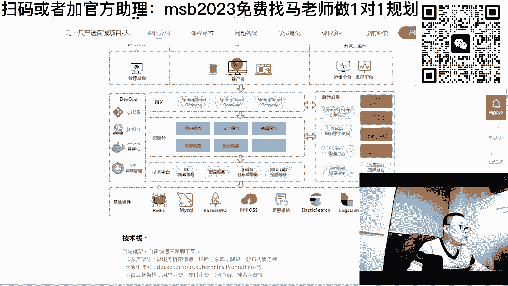

# 系列 6：P60：【2023】简历写的很完美但是都不会怎么办？ - 马士兵学堂 - BV1RY4y1Q7DL

当然我讲到这里呢，一定有同学跟我抬杠说，老师啊，那里边写我，我我可以网上写啊，但是我好东西我连听都没听说过，我连会都不带会的，有没有这样的同学，可以写它不会，是不是说我可以往上写啊。

人家那个小姐姐要的111米83的啊，我实际上是身高一米六三，我就写1米八三十一去不就露馅了吗，我可以写，但不会，我该怎么办好，各位同学，当你是实际1米63，人家要1米83的，你这时候怎么办，玩命增高。

赶紧吃药，短期之内能让自己长多高，就就就就就长多高，能听懂吗，这就叫突击吗，突击是干嘛，哎就是干这事的，改简历这件事情是一个很科学的工作啊，他并不是说你随便找一份模板拷贝拷贝，你就能拿到很好的效果，呃。

同学问你们平时啊写个作文，写个报告嗯，写写写做个毕设都特别花心思呃，我实在搞不懂你们为什么写简历的时候，就特别不花心思，一点心思，萝卜花拿一份模板过来啊，哥们儿，你怎么写的，来，拿过来之后我改不改吧。

拷贝拷贝我就往外扔，你要注意的是呢，你什么考的试呃，通过个四级，这个只是在你人生中一个小小的节点，你去找工作，这件事情是影响你后半辈子的最重要的一件事，他比什么你的事业呀，相比于什么你你的爱情。

你的感情生活那要重要的多得多，你这个时候反而应该是要花大心思的，我们的老师改一份简历来来回回呃，多的时候三天拿过来，改完打回去重新改，打回去重新改，就是我们改完简历的效果，也给大家瞅一眼好不好。

这是简历指导指导之后啊，多个offer涨薪百分之二三十，简历指导两家，简历指导比特大陆币圈的是吧，嗯嗯有一些最夸张的呢。

就是老师帮你改完简历之后，你原来没有面试机会。

就是改完就一堆，改完就一堆啊，为什么，其实很简单。

因为比较了解企业到底需要啥，而你呢从来没有认真想过这件事，哪怕你就听我的，认认真真去阅读人家的这个诉求，当你阅读阅读完这个诉求之后，你改完这个简历，你会发现你和原来不一样啊，所以对着镜。

这一定要重视好吧，我今天ok这点能做到你的啊，嗯对这件事情一定要重视那个，但是呢有好多同学说我可以写，但是我不会好听，听我说这件事是对的，你写简历一定不能只写会的，就是说我1米63，我就真写过1米63。

有的人心虚，我还写一，六零啊，声音这么晚呢，一定要写那些不会的，没有人天生就会，任何的东西都是后面慢慢学会的，我今天不会，明天可以会好，哪怕我三天之后去面试，我今天写的任何东西，我写上去说高并发。

我不会，我恶补三天，hello，hello，又卡了吗，hello，还好吗，可以吗，喂喂，现在又可以了是吧，就是突然之间来了一下啊，没有路由器被黑，就是那个最近这个这边的网络确实有点问题啊。

ok ok那我们继续啊，呃我再重复一遍，并没有同学没有听到，我再说一遍，就是说你一定要写，你不会的，因为你一定要理解，就是知识这个东西是一个动态的概念，你不要认为说我今天写上去的东西，我我不会。

明天还是不会，千万不要这么认为，所以什么叫突击突击，好注意这两个词啊，这个词儿叫增加概率呃，我就问大家一个问题啊，今天呢你就是比方说你对病发什么都不了解，多线程一点都不懂，然后呢你就写我是精通高并发。

精通多线程是吧，然后我写进去啊，我精通那个分布式高并发海啊，我精通那个各种各样的缓存，分布式缓存等等，我全我全了解，但实际上你一点都不会，那么你这时候该怎么办，怎么突击啊，我觉得最简单最简单的办法。

你哪怕只是认认真真的去听一个小知识点，是不是你被问到的概率也很高，他非常有可能问会问到你的呀，你刚复习这个说我我spring源码我从来没读过，但是没关系啊，我听了一个呃，连老师讲的一个小节啊。

他讲了怎么解决循环依赖的问题，对不对，源码里面怎么解决循环依赖的啊，我别的我都我都我都我都不知道，但是我写了我精通spring源码，ok，那么是不是他就非常有可能有有有这种可能性。

他会问到他问到你不就有可能通过的概率吗，能理解了，他是一个概率问题，我再说一遍，不要老追求那种百分百确定再去干一件事，那样的话好多机会全没了，好我教大家一些突击的技巧，各位同学们呃。

怎么样增加一些突击的技巧，简单说怎么快速的进行学习，说白了也是用快速的进行学习啊，啊我给你举个简单例子，假设你现在只会单机，从来没玩过分布式，从来没玩过微服务，然后呢也不知道那些什么。

前面大并发量来了之后，我该怎么处理，后面数据量大了，我该怎么处理啊，但是我要去面架构，是我写上去了，好我这时候该怎么办，同学们呃，我以前待过的同学十天，他原来只会html cs s。

这是一个极限的案例啊，是我的一小亲戚啊，所以我我我我我叫他爸爸，他用十天的时间，把从那个零基本上算是从零基础，然后去入行，十天入行可以吧，好了，我教你，我教你该怎么办，同学们，你们学东西的时候呢。

有两种学习方式啊，就是第一种呢叫做，游戏导出，哈哈这是我们日常最喜欢的学习方式啊，我们我们回想一下，我们学从小学到大学，我们是不是一个一个小小的知识点啊，我们都搞的特别的透彻啊，二元一次方程。

三次方程啊，各种解法，它的原理是什么，搞得特别透彻，然后搞完了之后呢，我们只是为了应付考试，我们从来没想过这东西可以用来干什么，这个东西就相当于什么呢，就相当于我要去造一辆车，但是我上来按照我先去学。

这个车的每一个小零件，它是干嘛使的啊，这个小螺丝它长什么样，它这个角度是多少啊，他这个这个齿轮啊，它的有多少个齿，弧度是多少等等，ok先去学这个怎么去造，它的应力是怎么样，然后呢我学这个齿轮的时候。

我也不知道那个车长什么样，我从来没想过我们从小就这么学的好，这种方式是一种学习方式，那么第二种学习方式呢是我推荐的是由粗到细，反过来，这是效率非常高的，你们可以想象一下，我真正的去了解一辆车。

说我将来的目标我就会造一辆车，我造一辆车的时候，我会不会正常人会不会上来是先去玩齿轮去，不会的，你知道吗，他一定上来先去开这个车，先学会怎么用，对不对，然后这车比较熟了，开的就比较熟了啊，我也知道。

反正一挂档这块就动了，然后呢我可以顺着某一条线去去研究车，哎，为什么我这档把一动下面有一道东西，最近到底哪动了，我顺着这条线研究下去，我就会突然间发现哦，这就是传动系统啊，车身系统，底盘系统，发动机。

我先把大块的了解了之后，再去了解系的，各位能听懂吗，兄弟们，这种方式和这种方式的对比，我们来对比一下，就第一种方式叫做扎实，知道吧，这种的最好的方最好最好的，它的好处就在于扎实，就是你一定是。

你要真是每一个零件都学得特别到位，然后最后组成一辆车，那你一定是扎扎实实的，你什么都懂，但是它的坏处就在于太慢慢，如果你的时间足够，我推荐你可以考虑用这种，没有问题，你时间够吗，反正有的是时间浪费啊。

没有关系，我就慢慢学，我学3年，我必须每一个我学到dos的时候，我一个命令一个命令我全都全都搞定，我linux把所有命令全搞定了，然后我再慢慢往上学，同学们这种人呢就是有扎实慢还累。

就是你们平时自我感觉还挺良好呃，每天拿出一个朋友圈了，然后读一个知识点啊，感觉我今天又学了一些东西，全是碎片化的，但是我推荐大家反过来学这个效率高，效果还好，好不好，反过来学怎么学啊，先了解整车。

再了解零件怎么去做项目驱动，先去了解整个项目，再看项目包含哪些东西，然后再去了解这些东西的细节，什么意思，我刚才还刚才那个例子说我写了很多分布式的，什么微服务的，写了一堆，但是呢我从来都不会怎么办。

找一个教学项目，举个例子吧，就是我们自己的一些项目呃，这个呢是教大家怎么做。

根本架构师的，课程呢就是这个这个看上去像一个那个。

看着像一个商城啊，但是它实际上呢嗯最主要的呢，它的目标是教大家怎么做后端架构的，就是你看上去前面前端网页没有那么复杂，但是实际上它的后端比较复杂，包括了运营，包括了用户开发运维管理，后台客户端运维平台。

监控平台，网关微服务基础，中台服务的治理，基础的组件系列的核心技术啊，呃当然这个是给那个你年薪比较高的人用的啊，他还包括了怎么去带团队，怎么去做ui啊，怎么去做测试，怎么去做运维，怎么去做中台。

怎么去做大数据，怎么去做ai的推荐等等，系列化的东西呃，这个东西呢呃目前是咱们优先推荐的项目，就这个项目呢，你如果在有一定的初步的基础的情况下啊，这是我们投入的人，大概前前后后投入二三十个的开发人员。

就是一个教学项目啊，怎么说呢，我讲到这儿你就多说两句，就是有好多那个机构讲说我我我我教你啊，我一个人就能教你，怎么从头到尾的独立完成项目呃，其实在实际工作中独立完成项目都是扯淡的，其实独立完成性。

所谓的独立完成项目都是独立完成某个模块啊，而且是别人帮你前面做好了各种的分析铺垫，之后，你去独立完成某个模块，实际当中都是大家好互相配合的，所以呢就是完整的模拟了，我们实际在一个大的项目组里头。

二三十个人的一个项目组去完成，整个一个的项目怎么去做的，采用了哪些个架构的东西，呃也许你没有了解过啊，你说我我只了解了那个sm这些东西，我没有了解过，但是没有关系，你呢应该怎么去做。

应该先去囫囵吞枣的把咱们的项目课先听完。

就那以这个项目来举例子，你就囫囵吞枣先听完，你听完之后呢，我跟我跟你讲，你不要去钻研那些细节，你一定给我放过那些细节，你去钻研那些细节，是你最累最苦，而且效果还不好，你不是有毛病吗。

先去享受整个学习的项目和过程。

当你了解了这个之后，其实你会慢慢的呢，大致理解这个架构都长什么样哦，你会知道原来底下有存储，有一些基础的组件，有做存储，有所缓存的，有做消息中间件的啊，有做那个对对象存储的，有短信的，有有搜索的是吧。

有那个日志的，ok你至少了解了这些日常我们一个完整项目，它所应用的这些东西，当你大概了解完这个东西之后，你说我这个mq这个redis我不是很熟好，你这个时候呢再去redis，做一些细节上更深入的了解。

叫做先学习整个脉络，一棵树先去了解整个的大体的脉络的走向，再去钻研这个细节，这才符合人性，我派你去了解了解庐山长什么样，你不会上来就去庐山某一棵树底下，去观察那个小蚂蚁窝吧，你不会这样去做，对不对。

你肯定是坐上飞机啊，先了解啊，整个庐山大概长这样，然后再去了解啊，是这个地方有什么，这个地方有个洞啊，这个地方有个什么景观，是不是这样的，同学们，所以先脉络后细节，这样的学习方式符合人性，而且效果最好。

而且效率最高好，下面我来教你，当你去做这种项目，你说我听完了之后，我听得云山雾绕的，确实老师给我讲完了这个东西是怎么拿的，他们互相之间怎么组合在一起的，但是这些细节该挑哪个命令去调哪些参数。

我一个都不知道啊，没有关系，在你去聊架构的时候，很多人也不会跟你聊细节，你是不是大概能把这个东西你背一遍，能说出来了吧，大体能说出来通过的概率是不是加大了一些，来这块能听明白了，老师扣一大概的啊。

因为我这个一个公开课呢，其实我们我们讲面试这部分，大概讲那个6~8个小时左右，一个公开课呢，我也不可能把所有的细节全讲给大家听啊，我把最重要的讲给大家听好吧，这块一定要理解到位啊，就是先粗后细。

你给我放过那些细节，下面我教大家怎么突击，突击的最好的办法，我教你一个，我给你举个例子，教你一个最简单最简单的办法说我不会分布式，我从来没有玩过微服务，我只会玩r i s s m。

我不会玩spring cloud，spring cloud，八个组件，我一个都没听说过，那么我这时候该怎么办，认真听我讲，很简单，上来二话不说，先把我们教大家的项目囫囵吞枣先给我听一遍。

听完了之后你一定知道哦，原来一个微服务是大概有哪些个组件构成，这个你应该有有有有有有这个信心，你大完整听完一遍，你会知道啊，原来有网关，原来有负载均衡，ok原来有方方面面的各种各样的组件。

它们组合在一起的时候，会构成一个各种各样的微服，好吧，这个你大概知道了，就然后这个大概要花多长时间呢，其实我告诉你快速过一遍，大概也就花几个小时左右，你就大概知道八个组件的名字，我起码背下来了。

你千万不要去干一件事儿，就是你想快速突击，就一定不要去干什么呢，不要去调bug，不要去操作，你一定不要去操作，同学们，你们思考一下，你们平时学习也好，工作也好，最花时间的在什么地方，是不是我开始以操作。

有一个地儿怎么调bug，调了半天总也调不过去，做个配置，看着别人配置的队伍，我一配置总是通不了，一卡卡好几个小时都是少的，最多的时候可以卡，一星期几天有没有遇到过，来遇到过来让我扣个一，就是在你学习。

如果你想快就不要操作，fin的日志配置给我卡懵逼了对啊，所以你们学习的学习细节的时候，我告诉你最花时间的点在哪里，就在于这些地方，如果我们把这些地方略过略过去，我们时间就完全省出来了。

我就粗略的看我不我不操作，你卡不住我了，对不对，好不要操作，当你不要操作的时候，你的时间可以省的非常非常的多，ok那有同学说了，老师我不要操作，我会不会啊，听我说，我现在教你的，首先第一个是你写完简历。

投简历面试谁能过，你们面试过了，应该有多少，面试是要求你现场给我去做个配置，你刚才那哥们说了，说fa配置给我卡，懵逼了，有多少面试要求你现场给我做一个fin的配置，有没有没有100家里头就一点都没有。

我可以这么说，我从来没有遇到过有上机面试，对上机面试，但是也并不是绝大多数，还是那话是概率问题，你不要老想着去覆盖所有的概率算法题，我一会单独讲好不好，没事啊，算法题我一会单独讲，那是比较特殊的。

你们去面面十家里头就一两家要求你干这个，小心操作，所以大多数人呢其实过来之后，就是问做过什么项目，没有厦门遇见过什么痛点，难点没有啊，你们这块是怎么解决，那块怎么解决的，问你个知识点，那个循环依赖你了。

不了解有没有听说我看你写了spring源码，你那你给我讲讲什么，原你读的印象最深的是什么，是不是啊，兄弟们，呃我们先讲楚苏的问题，再讲特殊的问题，待会儿对于大厂了，对于算法了没有关系。

如果你要追求那些个特例，那就没边没沿了，好不好好听我说，当你在不要操作的时候，原来需要十个小时能学完的东西，你一个小时差不多就能搞定，你不信你试试看哈，他不卡你了，对不对，那么然后去干一件什么事儿呢。

背常见面试题，比方说啊我就写了，我会微服务，但是我从来没用过，然后我今天一晚上我突击了一下，花了六个小时，我大概了解了啊，呃八个组件大概怎么配合使用的，然后三天之后我去练，但是他一定会问我一些细节啊。

他会问我有可能问我问我分怎么配置，他不会要求我怎么配，但是它怎么配呀，嗯有有哪些个策略，对不对，然后网关常见的有哪些啊，有哪些个配置的策略等等，他可能会问这些问题，那么这时候该怎么办，被常见面试题。

没想到吧，没想到这个背会居然会出现在找工作的里面，好多同学说找工作要真才实学，是真才实学，适合于这种时间充裕的，不适合于你找了半天都没找着，时间都没找着工作，然后都跟那都都自己都快抑郁了。

还搁那想着说我从细到粗，慢慢慢慢搞呢，背常见面试题，这个你不知道常见面试题是什么，找我们啊，这我老老老师们呢。

像这种突击的问题，早就帮你们搞定了，不知道。

多少遍了好吧。

就是我们突击整个突击班的这个课程啊，不知道都都上过多少遍了，哪个方向上啊，这是咱们教务师的课，教师课堂大概有200多门课，这是我给你举几个例子就行了，你看这种突突突击。

其实呢你要真是说我三天之后就要找工作了，我该怎么办，那搞突击就可以了呀，突击该怎么突啊，首先教你怎么去聊软技能，有没有聊过说hr问你为什么离职，上家单位太恶心了，我不想呆了，对不对，商家单位给钱太少了。

这都不是理由，大概有70个关于hr可能会问你的问题怎么办，没事老师会告诉你你该怎么办，该怎么回答啊，等等你自己去看就行了啊，然后简历该怎么写项目别人问你的时候，你该怎么去做，关于背调该怎么办。

没有高并发的经营项目经验该怎么办，基础的面试常问哪些，然后多线程的常问哪些jvm常问哪些好了，每一个方面啊背一遍好吧，一面可能完整的背不下来，背出1/10了，还是那句话，概率问题是不是有一定的概率了。

对不对，好理解了这件事之后呢，其实就是增加概率啊，还是那句话，就是增加概率，你不要想短期内去替代了人家那个，好几十年的努力啊，好几年的努力，这不太可能，但是呢你一定短期临阵磨枪不快。

也光一定会增加你的概率啊，记住这个词，那好当我呃聊了这件事之后，你们认真思考这个过程，说我第一家啊，由于我背题，我背的还不多呢啊，时间太紧了，我去了之后，他问了我很多不知道的，没有关系。

回来之后哪道题不会问老师，中间哪没回答好，偷偷摸摸录下音，来让老师来帮你听一遍，帮你听完，这叫做面试的陪跑啊，当你听完下次就不要犯重复的错误就可以了，五天之后又一个面试又增加了两天，继续背。

七天之后又一个面试又增加两天，继续背，后面的概率会不会越来越高，我们比较那个差的学生呢，大概20多家吧，才成一点，但是你要知道他可是没那么扎实，他学的时间可没有那么长，它很短，它就搞定了。

好我说的我十天的那个亲戚，刚开始别人问最初级的问题都不会，后面就慢慢背嘛，然后大概灭了17 八家左右就成了o背嘛，对不对，你就注意你不要去操作，你是速度是不是就快了，这块听明白的，给老师扣个一。

当然我讲到这里，马上就会有人问我下一个问题，老师我又不会操作，我去了之后会不会露馅啊，是不是你们一定会问吗，一到任务我是不是就尴尬了，我是不是就傻了，好你们好吧，你们你们老聊这个算法问题行。

我专门专门跟你聊一下算法问题，就是突击这件事是可以进进企业的，你一定要了解这一点啊，这也是咱们面试突击课的指导，面试突击课程简历指导，成功跳槽，涨薪还涨，做了好长时间了，也，这是这是突击，这。

像这种的啊，面试突击一个月，k 16~23，这是连老师在群里头给他透彻的指导的，整个过程，面试的陪跑吗，你说你哪道题没没没打好，没关系啊，你录下音来，老师给你听一下，告诉你下一次该怎么回答。

ok突击一个月搞定工作，突击半个月好吧，这都是突击。

