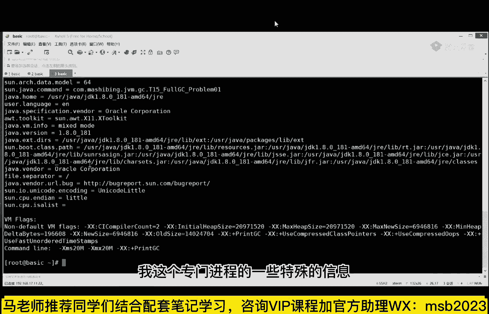
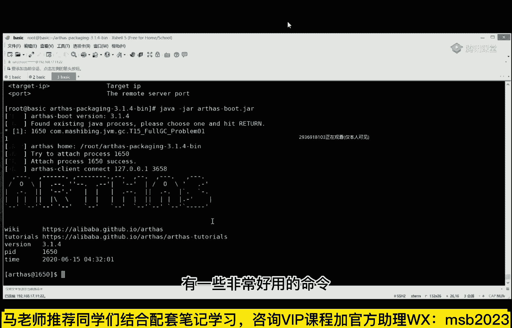

# 系列 6：P7：根据需求进行JVM的规划和预调优 - 马士兵学堂 - BV1RY4y1Q7DL

如何在实战之中啊定位jvm会产生的一些问题，比如说什么呢，它会频繁的fdc，看这里我这程序已经运行很长时间了，所以他在这里不断的f g c，这个fdc的时间大概一秒钟好几次好，当然还有一。

如果说它是呃产生了o o m和内存溢出好，这个时候怎么去定位它，但听我说啊，就是jvm的jvm课程，我是讲完了第一版前面的一点，我在2019年讲完第一版，现在呢再讲二，准备讲二点的课程呃。

现在加内容比较多，jvm这块儿是一个调优，这块是一个重点呃，我讲完第一版之后呢，很多小伙伴呢去面试啊，去在实际当中的环境之中去测试啊，发现了很多很多特别边缘化的东西，我打算第二版了以后呢。

给大家讲全了呃，比如说怎么定位这种直接内存的问题，direct memory啊，比如说如果一个j v m的进程静悄悄的死掉，我不知道有没有同学遇到过，就这y m进程啊，一般他死了之后呢。

会dump一个文件出来，结果他连dump都不dump，静悄悄就就被就被干掉了，有没有，有人遇到过吗，这个时候应该又该怎么去定位它，对，还会还会有静悄悄的，没错，好呃，今天呢我来给大家来讲这个内容。

作为jm的调优来说，大家听我说就，好作为呃jvm调优来说，它的内容上的包括的内容挺多的。

看这里，呃一般呢我们认为呢，这三项内容就可以都可以算作jvm调优的内容，第一个呢是根据需求进行这般的规划和语调，有什么意思呢，你要提前预估一下你的系统啊，将来是一个什么样的压力，它需要多大的内存啊。

然后在预算允许的情况下，选用什么样的硬件好，这个呢可以叫做预调油呃，在某本书里头，那书叫effective java，还是叫做叫做代码调优那本书我忘了呃，他会把成员的这个能力叫做成员的核心能力。

就是提前预估预估的这个能力好，第二个呢比如说你的运行环境慢卡顿，jbm的运行环境，我们在刚才的这个小程序你就会发现啊，他如果你在访问他的时候，他一定会变慢变卡顿，这是很正常的，为什么他把所有的资源都用。

都用来进行f g c了，你想想看他的木板能不卡顿吗，所以这个呢也是这边调优的一种呃，最常见的也是最容易被大家理解的，也是面试之中最容易问到的就是这个问题。

就是o o m om的全称叫做out of memory，内存溢出就是内存爆了，就这么回事儿啊，我呢给大家呢模拟了一个小程序，这个小程序呢我就不跟你讲这个代码，它是什么业务逻辑，是什么意思了。

总而言之呢它会出问题，而且呢如果大家能读懂这个小程序，这个小程序拿回去之后呢，你你你你自己跑一下，它会出问题，但是你真正把它想把它修改过来，也没那么容易，这个小程序呢做了一件事。

他会从数据库里面把对应的数据取出来，用特定的模型来对它进行过滤，那么这个过滤过程呢是通过线程池来进行的，我可以告诉你，问题就出在线程池上，但是它到底是哪出了问题，为什么会出这种问题，好，我现在面呢。

把这个小程序定位的这个过程和用到的工具，讲给大家听，这是我们今天要讲的内容来get到的，给老师扣一，我们可以开始了，你想要这个资料是吧，没问题啊，看这里我们有这个测试代码，我不跟你多做解释，总而言之。

这个测试代码呢是从数据库里面读出一些信息，来把这些信息呢组装成一个类的对象，这个类呢叫card infer，信用卡信息，它由big decimal，string int date这些个对象来构成。

这是它的成员变量，你记着这一点就行了，呃这个小程序运行了起来之后啊。

我先把这个给干掉，挺好的，他已经被干掉了，这小程运行起来之后呢，跑一段时间之后，他会不停的频繁的f d c，我们先来观察一下吧，跑一下小程序，看这里这个小程序啊，我对它进行的参数的设置是这样的。

xm 20兆，x m x20 兆，就最小堆呢是20，最大的也是20，防止内存抖动呃，只是打印了一些gc的特别基础的信息，为什么只打印基础呢，因为没给大家讲过gc的那个详细的认知信息，该怎么去阅读。

所以我把详细的认知信息打出来之后呢，反而容易混淆视听，还是那句话啊，学东西呢应该是先学梗概和脉络，我们先把最主要的矛盾给抓住，回车这小程序开始跑起来，这个小程序跑起来之后，他一定会产生各种各样的问题。

那么首先第一点，同学们，各位同学，首先第一点这些个问题啊，你是怎么观察到的，谁会告诉你你的程序有问题，问男友，你谁啊，这个日志不是日志，一般来说线上的系统应该是会有报警。

就是对于内存和cpu资源的相关的一个报警监控，监控报警，然后运维的人，运维告诉你说哥们儿你的成绩有问题好，你来进行排查，听懂这意思了吧，运维一般都是有报警之后，但这个报警呢，呃p8 课程里专门讲了。

这个监控和运维这块的内容，你得做一点点小小的开发，如果用自己特殊程序的话，然后把它挂到promise上面，或者是呃呃呃其他的这种监控工具上面，在咱们这儿呢我就用手工的给大家模拟一下。

你怎么观察到的小程序有问题呢，其实一个小小的命令就能观察到，看这里top一个小top就可以。

我们看这个top它所显示出来的进程，在这个进程里面呢，他会把这个我们每一个进程他用到的这种cpu啊，内存啊，都会给你列到这里，大家注意看啊，我们看这个c c c c p u呢。

它的呃呃呃使用的这种这种这种百分比。

你会发现它不断递增，内存这块是不是已经满了。

由于20张用的太少了，所以经满了，重新来再来一遍。

再来一遍啊，我们注意观察这个内存内存大小，这就是我们刚刚启动的那个小程序，刚开始你看它是4%，现在是4。3%，对不对，我们继续稍微等一会儿出。

嗯因为这时候他还没有进行f g c。

所以你看到的cpu的信息目前还占的不是特别高，你看现在已经是4。7了，我内存给的特别少，我内存只给了20兆，假如我内存给的特别多，给你到200兆两个g，你就会发现这块内存会不断的增长。

增长到一定程度之后，它不会降低，作为一个特别健康的jvm系统来说，你在里头不停地分配垃圾，他的垃圾回收器会不停的回收，所以它的内存的占比其实呢他不会说呃，就一下子特别高或者怎么样，而且呢它也不会爆掉。

也不会频繁的f d c，那么一旦发生这样的问题的时候，那一定是里边有内存的泄露，尤其是里边你通过读日志的时候。

你看它已经涨到嗯，内存已经涨到5。5了，尤其是你读日志的时候诶你会发现仔细读一下。

看看这个日志能不能读懂，你会发现一些问题没有。

这些日志呢相对来说容易读一些，看这里负g c表明我现在正在进行fdc是吧。

好的，已经out of memory error了啊，不管他。

你看啊，读一下这个日志呢。

它会给你显示出来f d c之前是19839k。

也就是20兆，回收之后是19838k what，这什么意思啊，就是这次f d c运行完了之后，只回收了1k那说明啥，说明他回收来回收取都回收不掉，回收不掉，回收不掉代表什么呀。

代表我内存里面的这些对象全都有用，知道吧，不断产生新的全都有用，回收不掉，说明什么内存有泄露。

都是活对象对都是活对象。

而且把你的内存全给你占满了，这不是有问题吗，当然有问题，所以下面呢就教大家怎么定位这个问题。

好图腾啊，问了一个特别牛叉的问题，图腾问了一个特别牛叉的问题。

就是这个问题是溢出还是泄露，来同学们这两个概念能理解的，同学给老师扣一，需要讲讲的，给老师扣二，溢出和泄露是同一个问题，不是不明白是吧，嗯我简单给大家说一下啊。

我先把程序给停掉，对。

好大家听我说什么叫做内存的泄露，我们先说溢出吧，什么叫做内存溢出，溢出非常简单，内存就这么大，个，允许你用20兆，结果20兆不够你用，因为你不断产生新对象，然后呢，而且这对象全都活着，这个时候填满了。

你20条已经满了，再往上填，已经到21了，爆出来了，一个盆里有水，水已经满了，这叫溢出，还有什么叫泄漏，泄露是啥，泄露泄露的含义是，你在这里分配了一块内存之后，永远不会被回收，听懂了吗。

就这块漏掉了一块，他应该被回收的，应该被当成垃圾回收的，可是你老有一个引用指着他，但是呢这个对象也没用了，这个叫泄露呃，泄露越来越多，再产生新对象就会溢出这个概念，不知道大家听清楚了没有嗯。

对啊刮香木箱举的例子非常到位啊，泄露就是占着茅坑不拉屎，这一出呢一出就是坑满了，再拉就拉出来了，我勒个去，花香木香，你太恶心了啊，好不凉了，我们继续，这就是泄漏和溢出的关系。

其实啊老师这个小程序有的时候会产生泄漏，有的时候会产生溢出啊，他就是这么的怪异，呃，总而言之，你会观察到它会不断的占领内存，那他不断占领内存的时候，我该怎么去定位它呢，好听我说呃。

作为一个远程的在线的工具来说。

有一些那种你可以用到的图形化的工具。

比如啊你只要是装了java的话，c program files，然后java只要你装了java的话，它会自带一些图形工具，这些图形工具呢，是可以远程连接到你的服务器上的，比如说常见的图形工具有哪些呢。

我不知道大家有没有知道的，第一个呢是这个j console，是这个，其实这个jiso呢嗯你你你你可以连远程进程啊，也可以连本地进程都可以，连我们随便先连一个本本地吧，a d。

ok它就会连到我们本地的这个这个这个进程上，然后你可以观察它内存，观察它线程，观察它类观察什么啊，这是图形界面，除了g consol之外呢，java也提供一个叫j v a v m的。

这个会比j cos的稍微的界面上更漂亮一些，那么这个界面呢也是可以连接到本地的，也可以连接到远程的，好吧，比如连他自己本地的好，你就可以监视到它的一些个内存的变化，可以看到它集中间的一些个线程。

也可以对内存进行一些抽样等等，我一会儿给大家讲这是什么意思。

呃总而言之，我们是有一些图形界面，如果有同学听说过的话，那么呃观察jvm来说，观察jvm来说，还有一还有一些比较著名的图形界面，它是可以功能更强大，但是呢它是收费的。

不知道大家有没有听说过j profiler啊，这个工具呃，目前来讲呢，如果你要用图形化的界面，它的功能应该是最强大的，但是很不幸的是，这哥们儿是一个收费的，所以我懒得去讲它，好吧嗯，但是有同学说。

老师你今天是要讲这个图形界面的工具吗，能不讲为啥，原因很简单，如果你跟面试官聊说，呃，我观测我们在线系统的图形，是用图形界面观测的，我跟你讲这个百分之八九十说不过去，虽然说啊确的的确确。

有一些系统是通过远程的这种工具进行连接，然后在远程界面上去观察它，但是啊大多数的，尤其是那个负载特别重的那些个系统，你上线之后，它是不允许你打开端口，通过远程图形界面去连它的。

不知道我能不能说清楚这件事，我再说一下，虽然说你在本地，你可以测试你自己的机器，这个没问题，但是如果一旦上线之后，在远程大多数都是linux的，环境，然后你要你想远程它的话。

你得通过远程的这种这种图形界面的工具，去连它，那么你连他的话就需要它开放一些端口，就增加了不安全性，另外呢也会对它产生一些负载，就是很这个负载倒是很正常，所以大多数情况下，我们做在线定位的时候。

往往不适用的图形界面，ok不知道我说清楚这件事没有，但有同学会说，那老师要面试官要问我，我说什么jv o v m。

我能圆得过去吗，作为老师这么体贴的人，我当然会教你圆过去的方法，其实并不是说老师不会给你讲这个啊，就是这东西呢我我我完全可以讲给你听，但是没意思了，就是远程连接到底该怎么连，呃。

我在文档里呢也说的特别清楚啊，那个你只要照着文档做，你想做远程连接的这种图形化界面监测，是没问题的，但是问题在于你是怎么跟面试官聊的，好吧，面试官怎么聊啊，你说我用的是图形界面工具。

那面试官肯定会问你啊，what你还能够在你的生产环境里头去观察，你们的生产环境里头的，用用用远程连接去观察吗，就不单单定位它吗，就把它内存给它导出来吗，肯定不行，但是你怎么圆过去呢。

你能你能自己圆过去吗。

我教了大家四种说法，好吧，ok在这里不展示了四种说法，你们自己去想啊，好，左拐去人事部签合同，ok可以啊，今天呢教大家专业一点的工具啊，对在测试环境没错啊，这是可以的，还有能能比较更牛逼一点的是。

我有高可用，你懂吗，我有高可用，我这两个都是一样的，然后呢我先干掉一个，我先给他隔离一台，然后我在其中一台上做观察，这可以吧，没问题啊，这个也可以嗯，还有一种呢是在测试环境，这是没问题的。

测试环境怎么做呢，像现在比较牛叉的一些个公司，它会有那种流量流量的呃，这种复制流量复制或者是什么流量的重放，就是大数据的重放过程，今天白天双11来了多少个量，这些量什么时间来的。

什么样的一个并发量过来的，我都给它存储下来，然后我在我的机器上可以进行重放，重新压测，那么这个时候我就可以通过远程的工具，去观测它了，嗯pcb cb没错嗯，呃这个过程不知道我说清楚没有。

也就是说你说你说你用的图形工具，你得能圆的过去才可以好吧，好能get到这点的同学老师扣一，当然我建议大家如果你说定位的话呢，呃用比较好的工具，这个工具呢叫做office，我建议大家用这个。

虽然说java也自带了一堆的这种命令行的工具啊，比如说gps这个也会用到，ok那个那个进程已经死了，那进程已经死了，所以就找不着那进程了，再把它骑起来，再来个shell吧，one two。

比如说gps它能找出来我的整个系统里面，现在正在讨论的jav进程，比如说这inf 1474。

他能给我列出来，我这个java进程的一些特殊的信息。

比如说jd gg c1474 。

ok他能给我列出来我的gc的一些信息啊，比如说像jdg诶。

1474，它能够给我列出来那些个里边的线程啊，比如说还有一些其他的，比如gmap，这个用的也非常多，一会重点讲它等等，这里面的虽然说有有这种命令行工具，但是我跟你说，这些命令行工具用起来都不太好用。

我推荐大家用的是阿里开源的工具。

叫做开源神器啊，叫做alice，这个assets我就不在这，我就不给大家讲怎么安装了，这件事情可以接受吗，咳咳我主要给大家讲讲ars怎么用，它的特点是什么，好不好，不不讲，怎么安装了alice呢。

你如果想自己安装，由于alice是阿里开源的，它有中文的文档写写的特别的呃完善，所以你看着装就可以，我已经装完了啊。

ass下载下来之后呢，解压解压开之后呢，我就解压到这个目录底下了，ass 3。1。4，现在好像新的版本已经超越这个版本了，你可以用最新的，作为阿森来说，它也是java写的。

所以你只要启动它这个ja文件就可以了，ok大家看这里这个others呢就已经启动了，阿特兹启动之后，它会自动的检测到有java进程，检测到一个ava进程是哪个呢，1474，当然它的内部编号是一nas。

就是说你哥们儿你让我监测哪个进程啊。

你告诉你告诉阿三四，我让你监测第1号进程好，他就已经attach上面去了。

但是很不幸的是，第1号进程好像又又死了，roc我们把它的内存稍微放大一些。

再重新来。

100兆。

100兆回车重新启动，others。

1号进程挂上去好，当你看到这个界面的时候，ok已经进入界面了，在这个alice里面有一些非常好用的命令。

如果你不知道这些命令怎么用，help，他会帮你把这些命令全部给你列出来，在这里我教大家几个比较常用的，比较漂亮的命令，每个命令怎么用呢，它的功能非常强大啊，你如果不知道怎么用的话，你就怎么办呢。

就就就就跟他，呃你就去读一读一读他的文档就可以，文档写的比较简略好看，这里啊呃第一个比较常用的命令叫什么命令呢。

叫这个vegetable dashboard的中控台，当你敲这个多控台之后，它会给你列出这么一个界面来，这个界面是什么意思，刚刚的我们那个java进程，在这个java进程里边有多少个县城，看到了吗。

这里都是现成的名字，破万thread挤，破万thread挤，以及timer线程以及互换线程以及main线程啊，刚才你都看到了好，他是怎么排列的呢，它的排列是以cpu占占比来排列的。

看看哪个cpu的占比最高，他就排在第一个。

所以通过这个进通过这个界面，你能够观察到说哪个哥们儿呢。

它的cpu的占比是最高的，他是不是有问题的，是不是超了超了超了cpu的，你预期那个占比了，你去定位他下面这个面板里边装的是啥呢，就是内存的一些大体的情况，比如ispace现在是多少。

survivor是多少，tenure是多少，tenure就是我们的老年代了，nhp非堆内存是多少等等，我在这里，这是我们的max，你你你你如果观察一致啊。

你就会发现呃我们的tenure generation，他一定是在不断的增长，就是老年代是在不断增长，增长的应用程度之后呢，还下不来，回收不回去，这时候你就关注内有内存要溢出了啊，下面是一些普通的信息。

我就不说了，当然这是dashboard。

除了30本之外呢。

还有一些比较常用的其他一些命令，我给你讲的时候呢。

我想干嘛呢，通过一个面试题来讲吧，呃作为jvm的常见的面试题，有的面试官是这么问的，他说如果你一个java进程，他的cpu突然暴增，原来正常就占个百分之五六十的，突然间最近占比居高不下90%以上。

请问如何定位问题，好这个问题大家听懂了吗，你们可以试着回答一下，这是面试里头经常会被问到的，top gun hp，top gun h，我教大家怎么用top找到进程，这不是废话吗。

呃我教大家怎么用这个这个，office去定位它，接着刚才这个你就可以。

dashboard就可以啊，这是最简单的一个dashboard，呃，dashboard的这个你会观察到，如果有某一个进程，某一个线程他老是占比占的比较高，那么就说明这个线程有问题，这点上大家能理解吧。

这非常简单，但是呢呃在说到这儿，我我我多多跟大家聊一点内容，呃扩扩充一点小小的内容啊，我们打开那个阿里的内部的规范，打开一下，嗯我们，不是。

