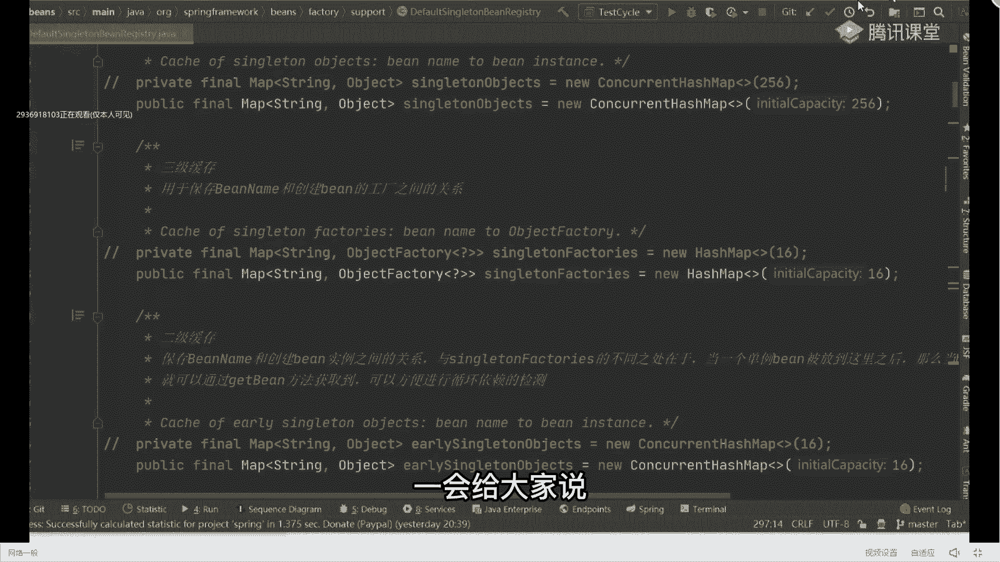
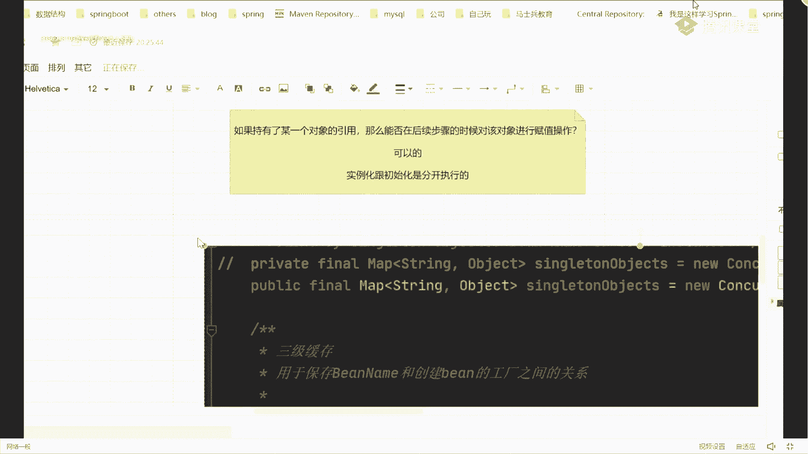
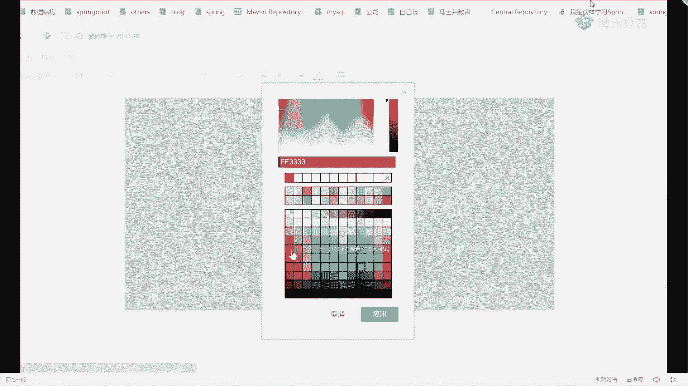
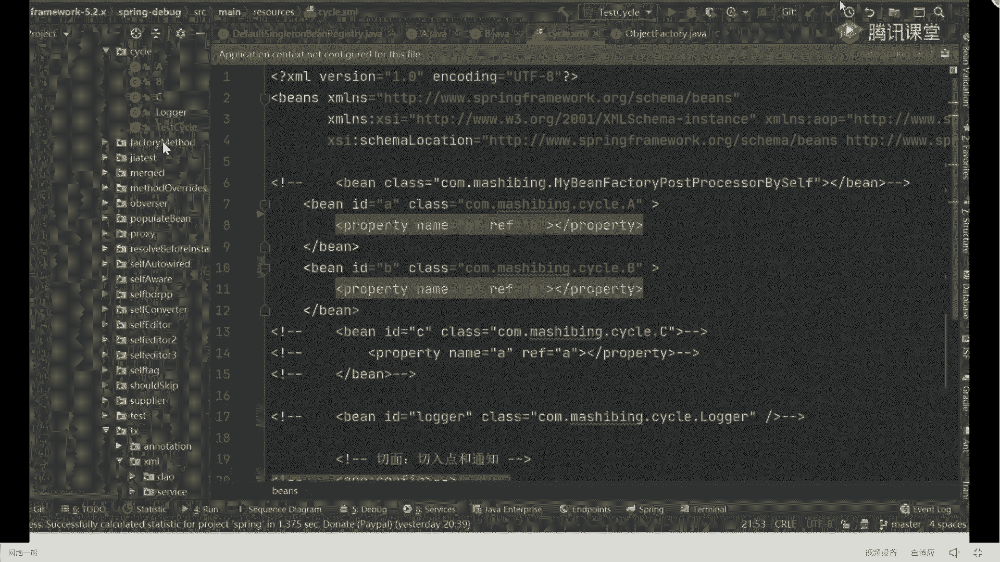

# 系列 6：P78：debug循环依赖的前置准备 - 马士兵学堂 - BV1RY4y1Q7DL

对昨天如果你昨天听课了，昨天上课的时候，其实我再给大家看这东西，今天我把这东西同样给大家拿出来。

怎么看呢，把它关掉来，我们搜一个东西叫匹配的那个being rejection，在当前这个类里面，你往上翻，最上面这块有三个具体的map结构，就是啥玩意儿，我把它当东西给大家截出来，源源码里面啊。

本来原版里面写的是私有的，我改成了公有的，改动的原因是什么，是因为我修改源码了，一会给大家说好吧。

就给大家说，然后我们把这个图粘过来，实际尺寸。

这就是我们经常说到的东西，一级二级三级缓存，比如说这里面实际上指的是这三个mac结构，你是需要对这三个map结构，有整体的认知和把控的好，这三map到底什么意思啊，也非常简单，这个叫什么，大家注意了。

上面这个叫singleton object，single object，它表示是一级缓存，改一下颜色。

他表示一级缓存，而我们下面第二个这东西，我们称之为什么叫三级，换成好，再往下走，一个这玩意儿叫二级红色，他没有按照我们那个书的顺序来定义好吧，你知道这东西可以了，一级缓存叫snon objects。

二级缓存好吧，叫做early sigmjs，三级缓存叫做sington factories，那下面我紧跟着就会问一个问题，这三个缓存结构有什么样的区别，有区别吗，为什么有的是ctrl还行吧。

有人还信办法，现实安全不安全吗，好一级和二级，一级和二级是线程不安全的，所以要加snet的，而三级是安全的，所以要用哈希map就可以了，这代一下后面代码的操作，我一会儿看一下就知道了，好吧。

那有什么区别，先说有区别吗，有吧，第一个区别就是你们说的，老师看后面的窗帘对象不一样，一级二级是ctrl哈，新办法，三二级13级是哈希拜访，除了这个之外，比如说老师还有容量，一级22562节16。

三级16，为什么一级更大一点对吧，这些点不是最主要的，最主要的东西是什么，就是同学们说的这个玩意儿，你看一下一级和二级里面放的东西，都叫object对象对吧。

而三级里面放了一个东西叫object factory，那下面就要解释一下什么叫object factory，是怎么理解啊，能这样这玩意儿吗，它是个啥，它具体要表达的到到底是什么样的一个意思啊。

这东西啊不要不要直接翻译，同学们不要求对象工程，它是什么，它是一个函数式接口，如果接触过拉姆达式的同学，应该知道它是一个函数式，接口好吧，有且仅有一个方法，明白意思吧，那它有什么用处呢，可以啊。

当做方法的参数传递进去，也就是说当指明此类型参数的方法好吧，可以传入，传传传传入一个拉姆达表达式，在执行的时候并不会执行，让他表示，反而在好吧，调用get object方法的时候才会去调用。

那么表示处理的逻辑，这东西如果谁不清楚的话，下去去补充对应的基础实例，可以看一下兰表达式对应的一些点，好，我们这不在浪浪费这个时间，你就记住为啥看狼表达式就知道了，好记住了，我们在指定方法的时候。

你可以传一个object factory这样一个类型，那么在传参数的时候不可以不是一个具体的值，而我可以传一个拉姆达表达式进去，当我把拉姆表示器传进去之后，我在调用这个方法的时候，他并不会立刻执行。

只有在调用这个get ob战的时候才会执行这块，你可以好好去看一下，这个代码叫bad factory，我们就可以直接点过去啊，他们叫functional interface是吧。

然后里面有个get不带上好，通过这个方法来进行调用，这个函数都是编程的一个思想，下来自己看好吧，我不再讲这东西了，属于比较基础的东西，所以你要把这个点记住，因为我们三级缓存存在的意义和价值。

说白了就变成这玩意儿最核心的点，其实就在于这一块儿，好吧，ok把这三种先记住，那把这三种记住之后，还有还有啥，我们要实际的去模拟一下ab对象，在整体的整个创建过程中，它到底在三个缓存中是如何流转。

所以呢我为了方便给他画图，我再画几个框，这是一级，啊写到这儿了过来，一级缓存，下面是我们的二级缓存，后面是我们三级缓存，我把这三个缓存结构放到这块，然后我们在整体对象创建的时候。

我会往后面加上我们对象跟水流传过程，你要跟着我的思路往后慢慢捋，当然在最开始的时候，这个对象一定是等于空的，这没问题吧，放我这啊，后面我会往后面画框，你跟着我的思路把这个对象的流转，你要搞明白了。

那这个时候下一步我们紧跟着进行一个操作，干嘛，有经理bug，我知道很多同学，我问一下，有多少同学自己比bug源码进行过这个操作，同学扣一没进过这个操作，扣二，好了，大部分同学投的都是二。

为了方便大家去理解，我们这儿先做一个我提前的预告，在整个对象的生命周期里面，我们在创建对象的时候，大概有几个非常重要且标准的方法，你给我记住了啊，一共就六个方法名字，你把这六个方法名字给我记住。

第一个发名叫什么呢，叫get b是第一个，第二话名字叫do get变，第二个，第三个叫create b，第三个记住，第四个叫do create。

然后紧跟着后面第五个叫create bean instance，然后第六个，叫pp的b，来这六个方法能不能记住，这没问题吧，我就靠大家的记忆力，脑瓜子记住这个方法没问题吧，这还是很容易的。

比如说我们一会再进行debug的时候，你其他任何的逻辑代码你都不需要看，你只需要给我记住这六个关键方法，当一个方法执行完成之后，我希望你能去报代码里面，去找下一个方法的处理逻辑就完事儿了。

因为原版里面啊代码很多，你要一行一行的去看，太浪费时间，同时很多同学可能跟不上，所以我们要记住的东西，方便你来带着整体的流程，同时我也做一个预告，在原版里面会有很多套娃的存在。

当你看到套娃之后也觉得奇怪啊，很正常一件事情，ok好了，这东西聊完之后，前期准备工作做完之后，我们开始提高代码怎么debug，debug之前，我一定要去给大家看一下我们的原始代码啊。

我这写了一个包叫sql啊，里面定义了一个a对象，你可以看到a对象非常简单，里面只有一个b属性，提供了一个b属性的set get方法，有一个合作方法，有一个tostring没了好吧，同时有一个b对象。

有a里面的set和get方法没了好吧，然后我在配置我们具体的配置文件的时候，也很简单，上面啥都没定义，配置了一个并对象a配置了一个并对象b，然后a的属性b好吧，引用了b。

然后呢b对象的属性a引用了属性a就这意思，这能看懂吗，来这个代码能看懂，同学给老师扣一，这个很简单很基础的东西了，你这个东西必须要会好吧好了，这看了之后，我们开始运行整个应用程序。

